# What is Database Modding?

Contrary to popular belief, there isn't a lot of direct programming that goes into making most mods. Instead, a lot of it is driven by adding and editing values in a database.

To add a new social policy, a new unit, a new civ, etc., you create new entries in the database that tell the game what you're adding, what yields it gives, and what effects you want it to have (assuming you're not trying to have it do something unprecedented), and more.

Text (and translations for that text); whether it be gameplay text, or elaborate flavour text; are also added to the game with a basically identical process, so we'll be covering adding that here too.
# Database Languages

We can interact with the game's database with either **XML** or **SQL**

**XML** is a markup language. It is probably the easiest choice to work with for beginners, and if you've ever worked with HTML, you'll find it looks very similar. It's easier to understand, and simpler to work with. Additionally, most of the game uses XML as well, so you'll have plenty of reference to work from. More advanced users may find it less flexible than SQL, however.

**SQL** (sometimes pronounced "sequel") is a language designed for data manipulation. While it is slightly more complicated than XML, it can be more powerful, as you can dynamically make changes to the database based on already existing data. SQL has a lot of features and functionality that we won't be getting into, but there are plenty of resources and references online if you want to learn more. Civilization specifically uses **SQLite**.

You can use a combination of XML and SQL files in the same mod (just don't try to mix the two in the same file)!

> **Note:** 
> Neither XML or SQL is strictly better than the other. XML is usually simpler and quicker to write, so it can be a better choice for simple changes. Say, if you just want to add a single yield to a single building.
> 
> Conversely, if you wanted to make every Wonder give +5 Gold for example, you'd be able to do so with a single SQL statement as opposed to dozens of lines of XML.

# Database types

Just so you know, there's more than one database you'll be working with! The game has two database contexts: the *shell* (also called the *frontend*), and *game* 'scopes'.

* The **shell** 'scope' is data used in the **main menu**, and **during age transitions** when you select civs for the next age.
* The **game** 'scope' is used during **actual gameplay**. If there's a 3D map running in the background, then it’s pulling from the game context.

The structure of the database in these scopes are **completely different**, so you won't be able to use the SQL/XML files that you use to modify the shell to also modify the game and vice versa.

Both scopes also have **Localization**, **Icon**, and **Color** databases. The structure for these databases are identical for both the shell and game scopes, so you generally will be able to use the same XML/SQL files that modify them in both scopes.

# Working with Ages

One last thing to keep in mind when working specifically with the **game** scope, is that the contents of the database will be different between the various game ages. In Civ 7, game content is designed to work in certain Ages, whether that's a single Age, multiple Ages, or all the Ages. Thus when making database changes, you also need specify which Ages the changes affect.

* Some things, like Leaders, are present no matter the age.
* Some things, like most Units, are present in only one age. Slingers only exist in the Antiquity Age!
* Some things, like Wonders, may be present across multiple ages, but might not be in all of them! Notre Dame is present in the game in Exploration and Modern, but NOT in Antiquity!

> **Note:** Why is this important to know?
> 1. You don't want to add things to Ages where they're not needed.
> 2. You can't edit or reference things that aren't in the database for that Age.

# Modifying the Gameplay Database

When we add something new to the game (whether it be a building, a unit, a civ, a policy, etc.), we'll want to add that information to the game/gameplay database. In this example, we'll be adding new Social Policies in the Antiquity Age.

**To make changes to any database, we create a new `.xml` or `.sql` file to contain our changes, then use the `.modinfo` file to tell the game to load that file.**

1. Make new mod with a `.modinfo` file if you don't have one already (see the [Getting Started](getting-started.md) page if you're not sure how).
2. Create a folder in the the same place as the `.modinfo` file. Name it `data`.
3. Depending on whether you want to use XML or SQL, create a file named `antiquity-traditions.xml` or `antiquity-traditions.sql` in the `data` folder. 

> **Note:** 
> We'll be making specifically named folders and files in this guide. **I recommend using the same names and folder structure so you can easily follow along.**
> 
> However, this specific naming and structuring scheme is not required by mods to function, and in the future, you can structure and name things in your mod folder the way you want. Best to stay organised though!
## Loading our new file with the .modinfo file

We'll want to modify our `.modinfo` file so that the game knows to load the `antiquity-traditions.xml`/`antiquity-traditions.sql` file we made. There's going to be a bunch of `.modinfo` terminology here, you don't need to worry too much about it for this process, and we'll have sample code so you can see what we're doing in this guide as well. But if you want to learn more about `.modinfo` files, you can find out more in the ["modinfo Files"](modinfo-files.md) document.

To tell the game to load our new `antiquity-traditions.xml`/`antiquity-traditions.sql` file, make these changes to the `.modinfo` file:

1. Add a new `ActionGroup` to the `ActionGroups` section with `game` as the scope. Give it a unique ID.
2. Add an `UpdateDatabase` action to load the new `.xml`/`.sql` file. This basically tells the game to update the gameplay database with our new file if the mod is active.
3. Add an `Item` to the `UpdateDatabase` action. Set its value to the path to the  `antiquity-traditions.xml` or `antiquity-traditions.sql` file.

Additionally we'll want to tell the game to restrict those changes to the Antiquity Age.

1. Add a new `Criteria` to the `ActionCriteria` section. Give it a unique ID.
2. Add an `AgeInUse` criterion. Set its value to `AGE_ANTIQUITY`.
3. Assign the `Criteria` we made to the `ActionGroup` we made in the previous step.
	* We do this by giving the `ActionGroup`  a `criteria` attribute with the unique ID from our newly created `Criteria` as the value

Your `.modinfo` file should look something like this.

```xml
<?xml version="1.0" encoding="utf-8"?>
<Mod id="fxs-new-policies" version="1"
	xmlns="ModInfo">
	<Properties>
		<Name>Antiquity Policies</Name>
		<Description>Adds new policies to the Antiquity Age</Description>
		<Authors>Firaxis</Authors>
		<AffectsSavedGames>1</AffectsSavedGames>
	</Properties>
	<Dependencies>
	</Dependencies>
	<ActionCriteria>
		<Criteria id="antiquity-age-current">
			<AgeInUse>AGE_ANTIQUITY</AgeInUse>
		</Criteria>
	</ActionCriteria>
	<ActionGroups>
		<ActionGroup id="antiquity-game" scope="game" criteria="antiquity-age-current">
			<Actions>
				<UpdateDatabase>
					<Item>data/antiquity-traditions.xml</Item>
				</UpdateDatabase>
			</Actions>
		</ActionGroup>
	</ActionGroups>
</Mod>
```

The game will now load our `.xml`/`.sql` file, provided our mod is active on game setup, and we're playing in the Antiquity Age.

> **Warning:** 
> .modinfo files are only loaded on booting up Civilization VII! If you've made any changes to a .modinfo file, you'll need to completely exit the game if it's already running, then start it up again!
## Making changes with XML/SQL

The specific parts of the Database we need to modify will always vary depending on our goals. If you're not sure what to do or how to do it, you can always reference the game's XML. So if you want to add a new building, you can search for "Granary" in the game's files and use those results as a guide. See the Browsing game data section for more information for how to look through the game's files.

For now our goal here is to **add two new policies.** We'll also want to set them to unlock with the Chiefdom civic.

> **Important:** 
> For the sake of this guide, please note that Policies and Traditions are both called "Traditions" in the database. So while we are adding new policies, we'll be working with a lot of tags and tables that say "Traditions".
### If working with XML

If making changes with XML, you can always reference the game's XML files to see *exactly* how things are done. But for now, here's the XML we'll need:

```xml
<?xml version="1.0" encoding="utf-8"?>
<Database>
    <Types>
        <Row Type="TRADITION_FXS_CYLINDER_SEALS" Kind="KIND_TRADITION"/>
        <Row Type="TRADITION_FXS_ORACLE_BONES" Kind="KIND_TRADITION"/>
    </Types>
	<Traditions>
		<Row TraditionType="TRADITION_FXS_CYLINDER_SEALS" Name="LOC_TRADITION_FXS_CYLINDER_SEALS_NAME" Description="LOC_TRADITION_FXS_CYLINDER_SEALS_DESCRIPTION"/>
        <Row TraditionType="TRADITION_FXS_ORACLE_BONES" Name="LOC_TRADITION_FXS_ORACLE_BONES_NAME" Description="LOC_TRADITION_FXS_ORACLE_BONES_DESCRIPTION"/>
    </Traditions>
	<ProgressionTreeNodeUnlocks>
		<Row ProgressionTreeNodeType="NODE_CIVIC_AQ_MAIN_CHIEFDOM" TargetKind="KIND_TRADITION" TargetType="TRADITION_FXS_CYLINDER_SEALS" UnlockDepth="1"/>
        <Row ProgressionTreeNodeType="NODE_CIVIC_AQ_MAIN_CHIEFDOM" TargetKind="KIND_TRADITION" TargetType="TRADITION_FXS_ORACLE_BONES" UnlockDepth="1"/>
    </ProgressionTreeNodeUnlocks>
</Database>
```

So we're adding to the `Types`, `Traditions`, and  `ProgressionTreeNodeUnlocks` tables in the database. Each entry into the table is a separate `Row`, with their columns (such as `TraditionType` or `TargetKind`) defined as separate attributes in those `Rows`.

> **Note:** 
> While the game's XML files are a good place to reference what attributes you might need to add, they aren't an exhaustive list. Using a SQLite Database Browser to open up the debug gameplay database, will give you a much better idea of all the options available to you.

### if working with SQL

Here's **SQL** that's equivalent to the XML from the previous section.

```sql
INSERT INTO Types
        (Type,                              Kind)
VALUES  ('TRADITION_FXS_CYLINDER_SEALS',    'KIND_TRADITION'),
        ('TRADITION_FXS_ORACLE_BONES',      'KIND_TRADITION');

INSERT INTO Traditions
        (TraditionType,                     Name,                                        Description)
VALUES  ('TRADITION_FXS_CYLINDER_SEALS',    'LOC_TRADITION_FXS_CYLINDER_SEALS_NAME',     'LOC_TRADITION_FXS_CYLINDER_SEALS_DESCRIPTION'),
        ('TRADITION_FXS_ORACLE_BONES',      'LOC_TRADITION_FXS_ORACLE_BONES_NAME',       'LOC_TRADITION_FXS_ORACLE_BONES_DESCRIPTION');

INSERT INTO ProgressionTreeNodeUnlocks
        (
            ProgressionTreeNodeType,
            TargetKind,
            TargetType,
            UnlockDepth   
        )
VALUES  (
            'NODE_CIVIC_AQ_MAIN_CHIEFDOM',
            'KIND_TRADITION',
            'TRADITION_FXS_CYLINDER_SEALS',
            1
        ),
        (
            'NODE_CIVIC_AQ_MAIN_CHIEFDOM',
            'KIND_TRADITION',
            'TRADITION_FXS_ORACLE_BONES',
            1
        );
```

The structure is different from XML. You state which table you're trying to `INSERT INTO`; define the various columns you need, then each new row is a set of values surrounded by parentheses in the same order you initially listed the columns.

We're adding to the `Types`, `Traditions`, and  `ProgressionTreeNodeUnlocks` tables in the database. So we have three separate statements, one for each of those tables, each adding two values, one for each for our new Policies.

The syntax can be rather strict, so you'll get errors if you put a comma where you needed a semicolon for example. But SQL is a very powerful language with many more features! There are a lot of resources online about how you can use SQL queries to interact with databases in general that are applicable to modding Civ as well!

Unlike working with XML, you won't be able to use the game files as a direct 1-1 reference, but you can still use those files to figure out which table you need to `INSERT INTO`, as well as what columns are needed.
## Viewing our changes

If you've set things up right, after booting up the game, and after ensuring that the mod is enabled, you'll be able to start a new game in the Antiquity Age, and our new Policies should appear on the Chiefdom civic!

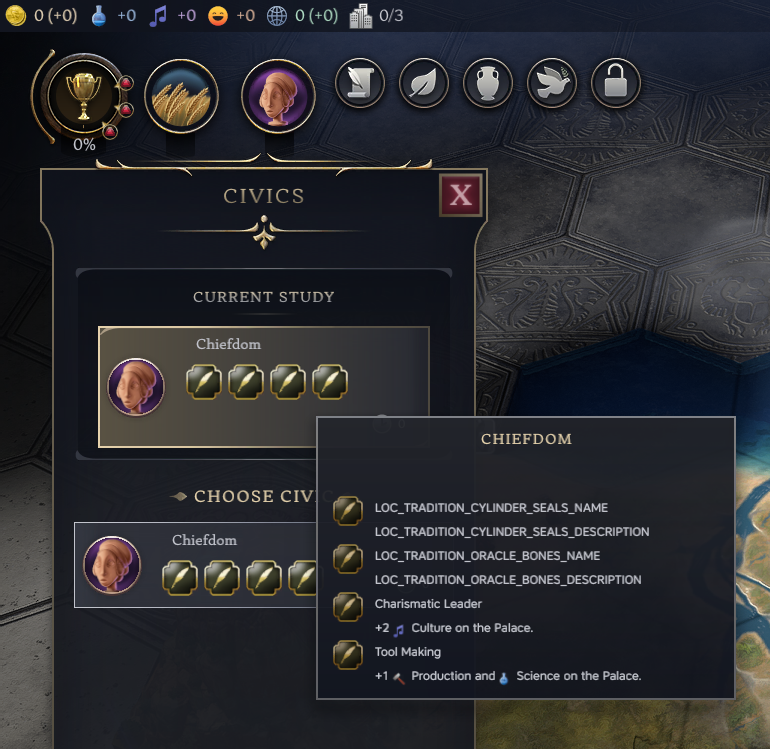

> **Warning:**  It's not working! Help!
> Don't panic! It's probably a small typo somewhere. Unfortunately those little details do matter. Double check your `.modinfo` and `.xml` files to make sure your tags are properly closed. If you're using SQL, make sure you aren't missing a quotation mark, a comma, semicolon, or a parenthesis somewhere!
> 
> In the `Logs` folder next to your `Mods` folder, you can also open the `Database.log` file with a text editor, and look over it to see if there's any indication of what went wrong.
> 
> See the Debugging errors section for more info.

## Adding Game Effects

Neat! Now we have two new policies in the game. But do they do anything yet?

Unfortunately no. For that we'll need Modifiers, which is *technically* just making more Gameplay Database changes, but Modifiers are also a system unto itself. Check out the [Modifier System](the-modifier-system.md) article for more information.

For now:

1. In the `data` folder create a new `.xml` file. Name it `antiquity-game-effects.xml` (it's easier to use XML over SQL here).
2. Copy the code in the code block below, paste it into the `antiquity-game-effects.xml`, and save.

```xml
<?xml version="1.0" encoding="utf-8"?>
<!-- Note that we're changing `GameEffects`, not `Database` like in other files! -->
<GameEffects xmlns="GameEffects">
	<Modifier id="FXS_CYLINDER_SEALS_MOD_PALACE_FOOD" collection="COLLECTION_OWNER" effect="EFFECT_PLAYER_ADJUST_CONSTRUCTIBLE_YIELD">
		<Argument name="YieldType">YIELD_FOOD</Argument>
		<Argument name="Amount">2</Argument>
		<Argument name="ConstructibleType">BUILDING_PALACE</Argument>
	</Modifier>
	<Modifier id="FXS_CYLINDER_SEALS_MOD_PALACE_GOLD" collection="COLLECTION_OWNER" effect="EFFECT_PLAYER_ADJUST_CONSTRUCTIBLE_YIELD">
		<Argument name="YieldType">YIELD_GOLD</Argument>
		<Argument name="Amount">3</Argument>
		<Argument name="ConstructibleType">BUILDING_PALACE</Argument>
		<String context="Description">LOC_TRADITION_FXS_CYLINDER_SEALS_DESCRIPTION</String>
	</Modifier>
	<Modifier id="FXS_ORACLE_BONES_MOD_PALACE_HAPPINESS" collection="COLLECTION_OWNER" effect="EFFECT_PLAYER_ADJUST_CONSTRUCTIBLE_YIELD">
		<Argument name="YieldType">YIELD_HAPPINESS</Argument>
		<Argument name="Amount">3</Argument>
		<Argument name="ConstructibleType">BUILDING_PALACE</Argument>
	</Modifier>
	<Modifier id="FXS_ORACLE_BONES_MOD_PALACE_CULTURE" collection="COLLECTION_OWNER" effect="EFFECT_PLAYER_ADJUST_CONSTRUCTIBLE_YIELD">
		<Argument name="YieldType">YIELD_CULTURE</Argument>
		<Argument name="Amount">1</Argument>
		<Argument name="ConstructibleType">BUILDING_PALACE</Argument>
		<String context="Description">LOC_TRADITION_FXS_ORACLE_BONES_DESCRIPTION</String>
	</Modifier>
</GameEffects>
```


We also need to add a new item to our `.modinfo` file that tells the game to load the new `antiquity-game-effects.xml`

1. Add a new `Item` to the `UpdateDatabase` section of the `.modinfo` file.
2. Set the item to the path to the `antiquity-game-effects.xml` file, which should be `data/antiquity-game-effects.xml`

The `ActionGroups` section of your `.modinfo` file should look something like this.

```xml
	<ActionGroups>
		<ActionGroup id="antiquity-game" scope="game" criteria="antiquity-age-current">
			<Actions>
				<UpdateDatabase>
					<Item>data/antiquity-traditions.xml</Item>
					<Item>data/antiquity-game-effects.xml</Item>
				</UpdateDatabase>
			</Actions>
		</ActionGroup>
	</ActionGroups>
```

-----

We'll also need to go back to our `antiquity-traditions` XML/SQL file and associate these new modifiers with our previously created policy cards.

**For XML**:
Add this near the end of the XML file but **before** the closing `Database` tag.

```xml
	<TraditionModifiers>
		<Row TraditionType="TRADITION_FXS_CYLINDER_SEALS" ModifierId="FXS_CYLINDER_SEALS_MOD_PALACE_FOOD"/>
		<Row TraditionType="TRADITION_FXS_CYLINDER_SEALS" ModifierId="FXS_CYLINDER_SEALS_MOD_PALACE_GOLD"/>
		<Row TraditionType="TRADITION_FXS_ORACLE_BONES" ModifierId="FXS_ORACLE_BONES_MOD_PALACE_HAPPINESS"/>
		<Row TraditionType="TRADITION_FXS_ORACLE_BONES" ModifierId="FXS_ORACLE_BONES_MOD_PALACE_CULTURE"/>
    </TraditionModifiers>
```

**For SQL:**
Add this to the end of the file.

```sql
INSERT INTO TraditionModifiers
        (TraditionType,                     ModifierId)
VALUES  ('TRADITION_FXS_CYLINDER_SEALS',    'FXS_CYLINDER_SEALS_MOD_PALACE_FOOD'),
        ('TRADITION_FXS_CYLINDER_SEALS',    'FXS_CYLINDER_SEALS_MOD_PALACE_GOLD'),
        ('TRADITION_FXS_ORACLE_BONES',      'FXS_ORACLE_BONES_MOD_PALACE_HAPPINESS'),
        ('TRADITION_FXS_ORACLE_BONES',      'FXS_ORACLE_BONES_MOD_PALACE_CULTURE');
```

Our new social policies should now actually have effects matching our descriptions.
# Modifying the Localization Database

Changing the Localization database is a lot like changing the gameplay database. You just use the `UpdateText` action instead.

Because the Localization database is separate from the gameplay database, we **must** make a new file to store the changes we want to make.

1. Create a folder in the the same place as the `.modinfo` file. Name it `text`.
2. Depending on whether you want to use SQL or XML, create a file named `antiquity-text.xml` or `antiquity-text.sql` in the `data` folder. 
   
We also need to modify our `.modinfo` file, so the game knows to load this new file. In this instance, since we already have everything set-up from the previous section, we can actually go ahead and edit the `ActionGroup` we previously made in the `.modinfo`, adding a new `UpdateText` block! So whenever the Action Group is triggered and the game goes to load our gameplay changes, it will also load our text changes.

Here's the excerpt of the modified `ActionGroups` section in the `.modinfo`.

```xml
	<ActionGroups>
		<ActionGroup id="antiquity-game" scope="game" criteria="antiquity-age-current">
			<Actions>
				<UpdateDatabase>
					<Item>data/antiquity-traditions.xml</Item>
					<Item>data/antiquity-game-effects.xml</Item>
				</UpdateDatabase>
				<UpdateText>
					<Item>text/antiquity-text.sql</Item>
				</UpdateText>
			</Actions>
		</ActionGroup>
	</ActionGroups>
```

-----------

Now for the actual database changes.

The way text works, is most text entries in the game are assigned a `Tag`: we did this for our Policies in the `Traditions` table, where we gave a `Name`, and a `Description` to each new `TraditionType`.

The game will look up the `Tag` in the Localization database, and retrieve the text in the appropriate language. In this case American English (`en_US`).
## If working with XML

Here's the XML we'll be using to add new text. There is a `Row` for each new tag we want to add. We set the `Tag` and `Language` attributes as needed. Then add a `Text` child element with the new text we want to assign to the tag.

```xml
<?xml version="1.0" encoding="utf-8"?>
<Database>
    <LocalizedText>
        <Row Tag="LOC_TRADITION_FXS_CYLINDER_SEALS_NAME" Language="en_US">
            <Text>Cylinder Seals</Text>
        </Row>
        <Row Tag="LOC_TRADITION_FXS_CYLINDER_SEALS_DESCRIPTION" Language="en_US">
            <Text>+2[icon:YIELD_FOOD] Food, +3[icon:YIELD_GOLD] Gold on the Palace.</Text>
        </Row>
        <Row Tag="LOC_TRADITION_FXS_ORACLE_BONES_NAME" Language="en_US">
            <Text>Oracle Bones</Text>
        </Row>
        <Row Tag="LOC_TRADITION_FXS_ORACLE_BONES_DESCRIPTION" Language="en_US">
            <Text>+3[icon:YIELD_HAPPINESS] Happiness, +1[icon:YIELD_CULTURE] Culture on the Palace.</Text>
        </Row>
    </LocalizedText>
</Database>
```

## If working with SQL

And the equivalent in SQL. We define our `Tag`, `Language`, and `Text` as columns, and provide our rows as a set of values surrounded by parentheses in the same order we initially listed the columns.

```sql
INSERT OR REPLACE INTO LocalizedText
	(Tag,	Language,	Text)
VALUES
	(
		'LOC_TRADITION_FXS_CYLINDER_SEALS_NAME',
		'en_US',
		'Cylinder Seals'
	),
	(
		'LOC_TRADITION_FXS_CYLINDER_SEALS_DESCRIPTION',
		'en_US',
		'+2[icon:YIELD_FOOD] Food, +3[icon:YIELD_GOLD] Gold on the Palace.'
	),
	(
		'LOC_TRADITION_FXS_ORACLE_BONES_NAME',
		'en_US',
		'Oracle Bones'
	),
	(
		'LOC_TRADITION_FXS_ORACLE_BONES_DESCRIPTION',
		'en_US',
		'+3[icon:YIELD_HAPPINESS] Happiness, +1[icon:YIELD_CULTURE] Culture on the Palace.'
	);
```

Restart the game to see our new changes.

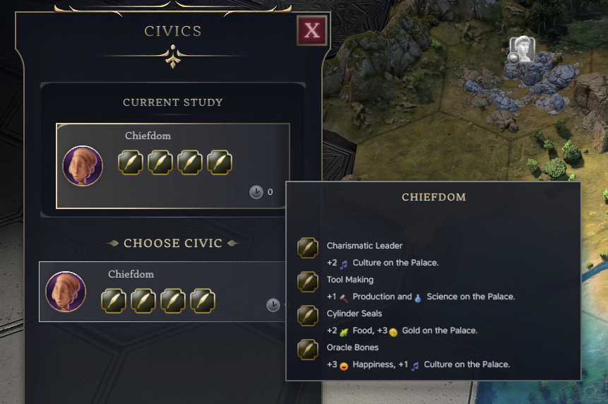

> **Note:**  What are those funny `[icon:YIELD_FOOD]` things?
> Those are the inline icons: the yield symbols interspersed in the game's text! The yield icons are simple, just change from `YIELD_FOOD` to `YIELD_INFLUENCE` or `YIELD_SCIENCE` for example. 
> 
> There are other icons if you look around in the game files as well.

> **Note:**  LocalizedText? But the game files use EnglishText!
> Good eye! The `EnglishText` table is a shorthand for adding an entry into the `LocalizedText` table with `en_US` in the `Language` column.
> 
> You can use either table if you're working with English, they're basically the same, with the `EnglishText` table omitting the `Language`.
> 
> But you'll need to used `LocalizedText` with the appropriate language tag (eg. `es_ES` or `zh_Hans_CN`) if you want to provide translations. You do not need a new file to provide translations.

And that's it! That's our social policy mod done! A completed version of it is be available as a sample mod, with both `.xml` and `.sql` so you can take a examine how things are done in either language.

# Modifying the Icons and Color Databases

Here are examples of **Color** and **Icon** database files respectively, both in `.xml`. You still use  both `.xml` and `.sql` here though! 

```xml
<?xml version="1.0" encoding="UTF-8" standalone="yes"?>
<Database>
	<PlayerColors>
		<Row>
			<Type>LEADER_SAPPHO</Type>
			<Usage>Unique</Usage>
			<PrimaryColor>COLOR_STANDARD_RED_DK</PrimaryColor>
			<SecondaryColor>COLOR_STANDARD_WHITE_LT</SecondaryColor>
			<Alt1PrimaryColor>COLOR_STANDARD_WHITE_LT</Alt1PrimaryColor>
			<Alt1SecondaryColor>COLOR_STANDARD_RED_DK</Alt1SecondaryColor>
			<Alt2PrimaryColor>COLOR_STANDARD_BLUE_DK</Alt2PrimaryColor>
			<Alt2SecondaryColor>COLOR_STANDARD_WHITE_LT</Alt2SecondaryColor>
			<Alt3PrimaryColor>COLOR_STANDARD_WHITE_LT</Alt3PrimaryColor>
			<Alt3SecondaryColor>COLOR_STANDARD_BLUE_DK</Alt3SecondaryColor>
		</Row>
	</PlayerColors>
	<Colors>
		<Row>
			<Type>COLOR_MY_NEW_COLOR</Type>
			<Color>229,117,116,255</Color>
			<Color3D>229,117,116,255</Color3D>
		</Row>
	</Colors>
</Database>
```

> **Note:** 
> Existing player colors can be found in `playerstandardcolors.xml`
> 
> When defining new `Colors`, the `Color` entries are used for UI controls, whereas `Color3D` entries are used for the team color on 3D models in game.

```xml
<?xml version="1.0" encoding="UTF-8" standalone="yes"?>
<Database>
	<IconDefinitions>
        <Row>
			<ID>BUILDING_STAVE_CHURCH</ID>
			<Path>fs://game/denmark/icons/building_stave_church.png</Path>
		</Row>
	</IconDefinitions>
</Database>
```

> **Note:** 
> New `.png` files for icons will need to be imported via the `ImportFiles` in the `.modinfo` file.
> 
> The `Path` to the file will be `fs://game/` + the mod Id + the path to the file in that mod. So in the example above, the mod's Id would be `denmark`, and the `.png` file is in the icons folder of that mod.

Use the `UpdateColors` and `UpdateIcons` actions to update Colors and Icons respectively.

```xml
	<Actions>
		<UpdateIcons>
			<Item>data/modded-icons.sql</Item>
		</UpdateIcons>
		<UpdateColors>
			<Item>data/modded-colors.sql</Item>
		</UpdateColors>
	</Actions>
```
	# Modifying the FrontEnd/Shell Scope

Not all mods need to modify the FrontEnd/Shell: mostly it'll be mods adding new content and options that affect game setup, for example, if you're adding a new leader, new difficulty options, a new map type, a new civ, etc.

Modifying the FrontEnd database really isn't any different from modifying the Gameplay database. You simply need to change the `ActionGroup`'s scope to `shell`. Though there are a few things to keep in mind.

```xml
	<ActionCriteria>
		<Criteria id="always">
			<AlwaysMet></AlwaysMet>
		</Criteria>
	</ActionCriteria>
	<ActionGroups>
		<ActionGroup id="shell-actions" scope="shell" criteria="always">
			<Actions>
				<UpdateDatabase>
					<Item>data/shell-data.xml</Item>
				</UpdateDatabase>
				<UpdateText>
					<Item>text/antiquity-text.sql</Item>
				</UpdateText>
			</Actions>
		</ActionGroup>
	</ActionGroups>
```


First, and most importantly, the structure of the FrontEnd database is completely different from the Gameplay database. While the syntax used to modify it remains the same, you'll be working with different tables with different columns, so you'll need completely separate `.xml`/`.sql` files.

Most DLC will have `.xml` files used to edit the FrontEnd database in a folder named `config` which you can use as a reference.

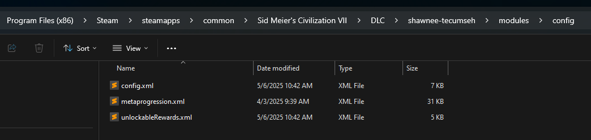

Another thing to remember if you need custom text/icons/colors for use during game setup, you'll need to update the Localization/Icon/Color database on the FrontEnd as well.

Things that are loaded in the `game` scope are not automatically loaded in the `shell` scope. So if you need that same text, icons, or color values available to you in the FrontEnd, you need update the `shell` scope accordingly.

Unlike the FrontEnd vs Gameplay databases, the Localization/Icon/Color databases are more or less identical in structure in the `game` and `shell` scopes. So you normally can use the same `.xml`/`.sql` as you used to update the Localization/Icon/Color database in the `game` scope to update the Localization/Icon/Color database in `shell` scope.

# Appendix

## Browsing game data

Much of database modding requires an understanding of the data that is already available to you to work with, but perhaps more importantly, a grasp of how that data is structured.

The simplest way is probably browsing the game files. If you installed the game via Steam, you can find where the game is installed via the game's properties (as detailed in the [Getting Started](getting-started.md) document).

Under `Base` > `modules`, you'll see the various game ages as separate modules. In each of those, there's a `data` folder with all the data for the age contained as `.xml` files. You can open these files with your code editor.

> **Warning:** 
> This is the data the game uses to drive gameplay. **DO NOT edit these files.** 
> 
> 1. You may **lose your changes when the game updates**, as updates may overwrite these files.
> 2. You will **not be able to play multiplayer games**, as your data will be out of sync with other players.
> 3. If incorrectly done, you **can break your game**, so you will be unable to start a new game or load previous saves.
> 
> If this happens, you can **verify your game files via Steam** to restore the original files.
> 
> **Make a mod if you would like to make any changes to the game**. You will be better able to track the changes you make, the mod can be shared with people you would like to play multiplayer with, and any changes can be undone by simply disabling the mod.

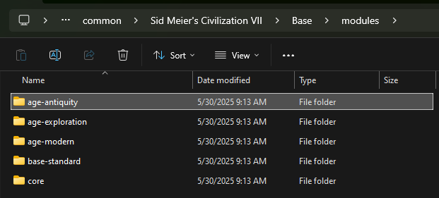

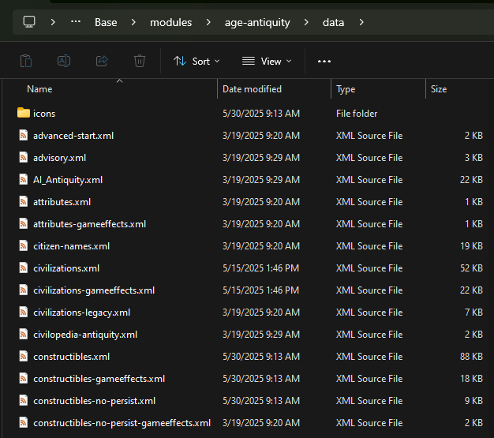

Most code editors also have a "search in files" function (usually using `Ctrl`+`Shift`+`F`) you can use to search the game's files. So you can also just add the location you installed Civilization VII to the folders to search in!

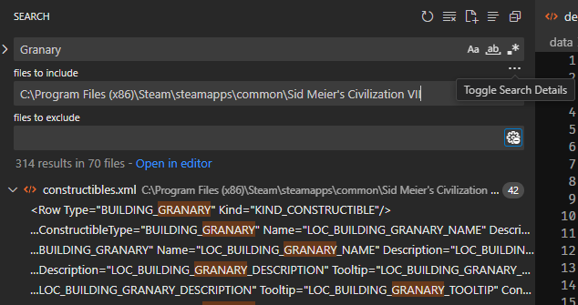

----

Alternatively, you can also use a **SQLite Database Browser** to view game data.

If you have `CopyDatabasesToDisk` set to 1 (as detailed in the [Getting Started](getting-started.md) document), the game will output `.sqlite` files in the `debug` folder after you have started a game.

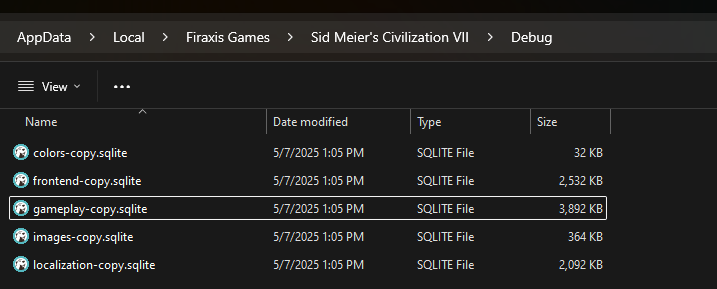

They can be opened to view what each database (whether it be the gameplay, or frontend, or localization database) looks like on game start. You'll be able to see a comprehensive list of all the tables, columns, and values available to work with.

Edits in these debug databases do not have any effect on the game, and these files will be overridden when you exit to the main menu, or when you start a new game.

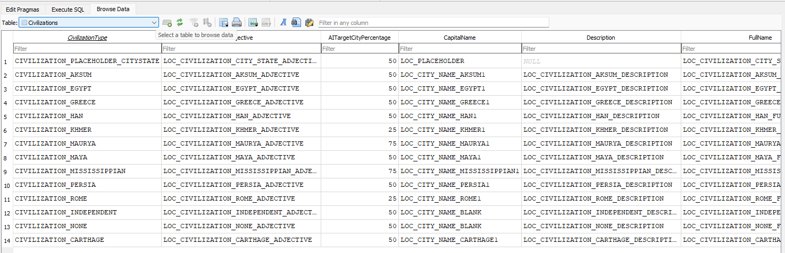

## Debugging errors

If there is an error in your code, you will usually be greeted with this warning when you try to start a game.

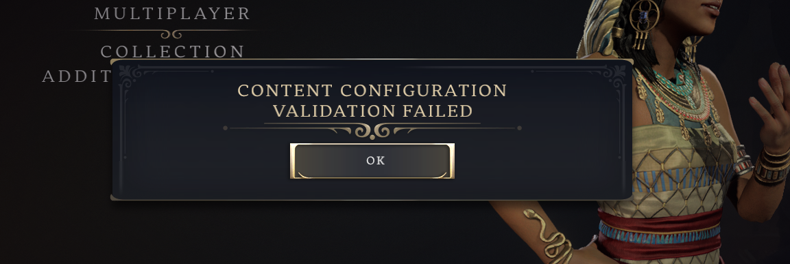

Don't panic! There's a way to figure out what's wrong. The game outputs logs so you can see how it's processing your files. The most helpful file to look at for database modding is the `Database.log` file.

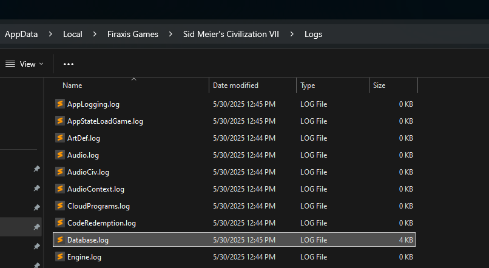

Open the file with your code editor and look for an error message. It'll tell you what sort of error the game encountered. It might even help you pinpoint you where the error is occurring.

For example, here, we're getting a "syntax error" near INSERT. So this is probably an issue with one of the `.SQL` files. It's not always obvious where the error might be unfortunately, so you may still need to do some digging, particularly in larger mods, but at least this will help narrow down the issue somewhat.

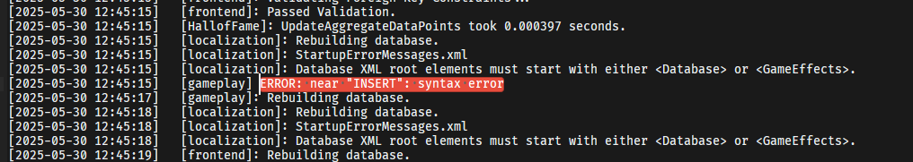

Looking through my SQL files, it seems my issue here is that I'm missing a semicolon (`;`) to end the statement before starting the new `INSERT INTO TraditionModifiers` statement.

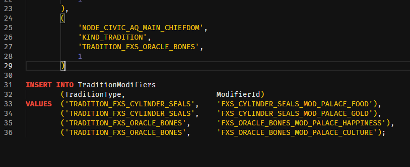