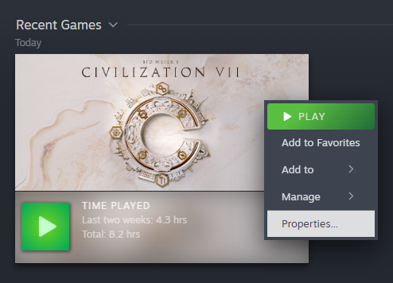
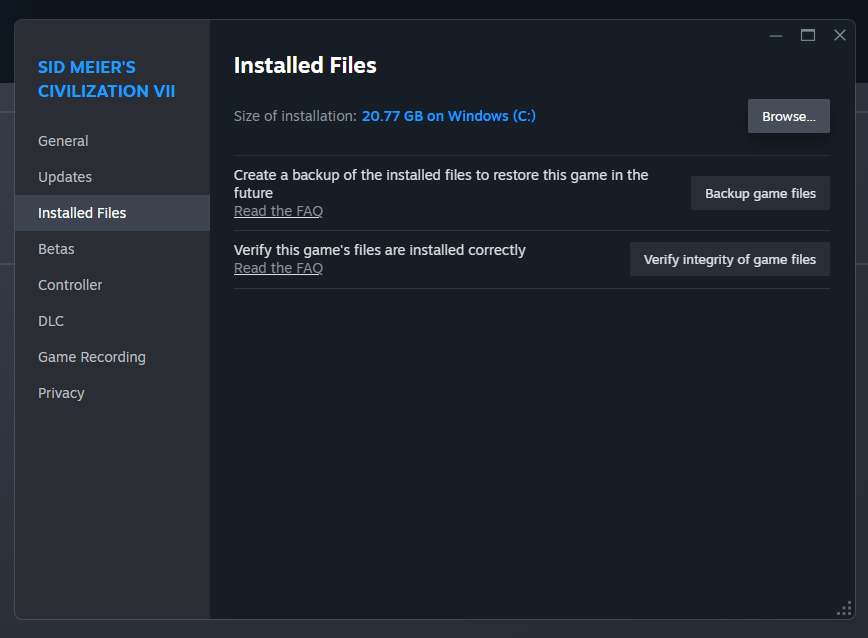
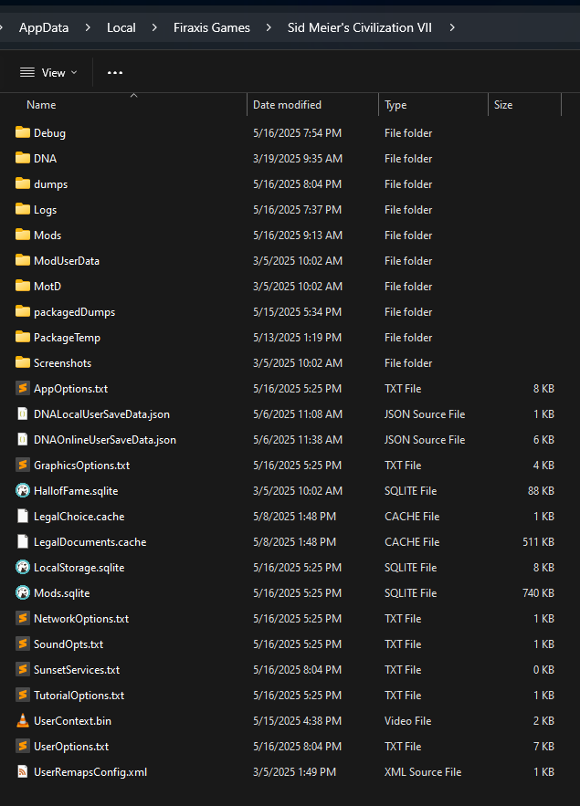
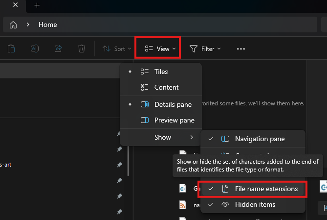

# What is Modding?

Modding is of course, the process of modifying the game. How does this work?

When you boot up Civilization VII, the game will look through a couple of predesignated folders for mods, and add them to a list so they can be toggled on or off in-game. Each mod has a set of actions that then get performed if their respective mod is activated when you setup and start a game.

There are many different things a mod can do. It can modify the UI using **JavaScript, HTML, and CSS.** It can change the data that is used to drive gameplay using **SQL or XML.** It can introduce new behaviours that can't be achieved with database changes with **JavaScript**. Or it can do a combination of all these things!
## Setting Expectations

Before we dive in, we should establish what this guide is aiming to do. This guide won't be a comprehensive set of instructions on how to add every single thing possible into the game. Nor is it going to be a comprehensive tutorial on working with JavaScript, SQL, or XML.

We'll be aiming to set you up with the basics, and to point you to where you can dig to find out how to do more, as well as providing documentation where necessary.

## Help! I don't know how to code at all!

If you've never touched a code editor, here's some advice on getting started.

You don't necessarily need to have coded before to make a mod. The most important languages to know, XML and SQL, are simple enough to parse even if you've not worked with them before if you're patient and observant.

#### XML

```xml
<?xml version="1.0" encoding="utf-8"?>
<Mod id="my-first-mod" version="1" xmlns="ModInfo">
	<Properties>
		<Name>My First Mod</Name>
		<Description>This is my first Mod.</Description>
		<Authors>Me</Authors>
		<AffectsSavedGames>1</AffectsSavedGames>
	</Properties>
	<Dependencies>
	</Dependencies>
</Mod>
```

You'll likely find **XML** simple enough to understand even without prior experience. Look at the sample code and example mods and examine their structure. The first line is always an `XML Declaration`. Afterwards, every opening `<tag>` has a closing `</tag>` or is self-closing like this: `<tag/>`. A pair of tags or a self-closing tag is called an `element`. Elements can have children (additional elements nested between the opening and closing tags), and attributes, like so `<tag Attribute="Value"></tag>`.

Whitespace (the empty space between elements) does not matter. However, it’s good practice to structure the code in a way that makes it easy to read.

Just make sure everything is closed properly, and that the structure matches the examples or what you find in the game files.
#### SQL

```sql
INSERT INTO Types
        (Type,                              Kind)
VALUES  ('TRADITION_FXS_CYLINDER_SEALS',    'KIND_TRADITION');

INSERT INTO TraditionModifiers
		(
			TraditionType,
			ModifierId
		)
VALUES	(
			'TRADITION_PANJI',
			'MOD_FXS_TRADITION_PANJI_QUARTER_CULTURE'
		),
		(
			'TRADITION_PANJI',
			'MOD_FXS_TRADITION_PANJI_QUARTER_CULTURE_ISLAND'
		);
```

**SQL** is more complicated, but you probably can also get pretty far just by copying the structure of the code in the example mods and game files.

The core of SQL are `statements`, which generally begin with an instruction (like `INSERT INTO`), and always end with a semicolon `;`.  Whitespace doesn't matter so long as the words are properly separated. Play attention to the commas and semicolons! Mixing them up will break the code!

#### JavaScript

**JavaScript** is a programming language, and you'll likely not be able to learn it just by reading example code. You don't need to know JavaScript to start modding, and you won't need it at all for most mods that don't change the game's UI.

Luckily for those of you who do want to make UI mods or more complex gameplay mods, as the most important language of the internet, there are plenty of resources out there to help you learn JavaScript! Find them online to learn the basics if you want to jump into UI modding or gameplay scripting.

# Setting Up
## Tools

While *theoretically* you can make a mod with just Windows Notepad, it'll be easier with the correct tools. 

1. **Code Editor**: You'll want a text editor that is geared towards code. **Visual Studio Code** (also known as **VS Code**) is a good option for this.
   
2. **Civilization VII Modding SDK**: If you're looking at this documentation, you probably have this already! You'll want the Steam Workshop Uploader to be able to upload mods to the Steam Workshop; and FireTuner, which is a debugging tool that lets you run Javascript commands, and provides access to a UI that functions as an Ingame editor to help you debug your mods.
   
   You can get the Modding SDK via Steam.
   
3. **(Optional) SQLite Database Browser**: A tool to view the game's debug database may help you understand what is going on and visualise what data is available to work with. You **WON'T** need this for your first few mods, but it can be helpful as begin making more complex mods.
## Important Folders

There are a couple of folders you'll probably want to bookmark.

First is the folder where you've installed the game. Mods are structured very similarly to how the game itself is set up, so if you're ever unsure how to do this or that, you often can just reference how the game or a DLC does things.

If you're running the game via Steam, the easiest way to find where the game has been installed is to right-click on the game in Steam and go to `Properties`:



The go the `Installed Files` tab and click `Browse`.
 


----

You'll also want to know where the game's settings live. This is where you'll be manually installing the mods you make, and getting access to logs to help debug them. There are also a few settings you'll want to tweak there to make your work easier as well.



On **Windows**:
`%localappdata%/Firaxis Games/Sid Meier's Civilization VII/`
On **Mac**:
`~/Library/Application Support/Civilization VII/`
On **Linux/Steam Deck**:
`~/My Games/Sid Meier's Civilization VII/`

Create a `Mods` folder there if one doesn't already exist. This is where you can install the mods you create.
## Settings

There are a couple of settings that I recommend changing. These setting will make life easier for you as a modder, it'll give you access to tools and information you would not otherwise have, and they're set and forget! So let's change them now.

First, if you haven't already, make sure you've enabled file extensions in your file browser. You will need to be able to create files with specific file extensions, or change the extensions of specific files.



Now to tweak some game options. Open `AppOptions.txt` (it will be in the same folder as your Mods folder). You'll see a whole bunch of options! You can change most options by **removing the semicolon** at the beginning of the line, and **changing the value** at the end of it, like so:

**Before**
```
;Make copies of commonly used databases to disk after they have been updated.
;CopyDatabasesToDisk 0
```

**After**
```
;Make copies of commonly used databases to disk after they have been updated.
CopyDatabasesToDisk 1
```

**Useful Settings:**

1. Set `CopyDatabasesToDisk` to `1`
	this will tell the game to export the game's database as `.sqlite` files for you to browse. This can be useful for SQL/XML modding where you may want to view the current state of the game's database.
2. Set `EnableTuner` to `1`
	This allows FireTuner to connect to the game for debugging.
3. Set `EnableDebugPanels` to `1`
   This will allow you to access the in-game debug panels by pressing the `` ` `` (backtick) key.
4. Set `UIDebugger` to `1`
   This will allow you to use Google Chrome (it's buggy with other browsers) to inspect the HTML, CSS, and JavaScript used by the game's UI as it's running.
5. Set `UIFileWatcher` to `1`
   This will tell the game to reload already loaded UI files as you edit them, so you don't have to restart the game to make UI changes.
# Your First Mod

Let's make your first mod! In the `Mods` folder, create a new empty folder. Name it what you want. Then create a new empty file in that folder. You can also name it what you want, but make sure it has the `.modinfo` file extension.


Open the file in a code editor, and copy and paste the following into the file, then save the file.

```xml
<?xml version="1.0" encoding="utf-8"?>
<Mod id="my-first-mod" version="1" xmlns="ModInfo">
	<Properties>
		<Name>My First Mod</Name>
		<Description>This is my first Mod.</Description>
		<Authors>Me</Authors>
		<AffectsSavedGames>1</AffectsSavedGames>
	</Properties>
	<Dependencies>
	</Dependencies>
	<ActionCriteria>
	</ActionCriteria>
	<ActionGroups>
	</ActionGroups>
</Mod>
```

Congratulations! You've just created your first mod. It doesn't *do* anything yet, but it should appear under the Add-Ons menu when you next boot up the game for you to activate/deactivate. 


What you've just done is created a `.modinfo` file. They are the crux of all mods. They tell the game what files to load and what to do with them. They tell the game how your mod interacts with DLC and other mods.

A couple of things to note about our `.modinfo` file.

First, the `id` in the first line is currently set to `my-first-mod`. While this is okay for now, you'll want to ensure these IDs are unique in the future. Multiple mods with the same ID will be identified as different versions of the same mod, and we don't want that for our brand-new mod!

Also notice the `Properties` section, those various fields (`Name`, `Description`, `Author`) can be edited as you wish. You can also toggle `AffectsSavedGames` off by setting it to `0`, for things like UI mods that can be disabled or enabled in between sessions without affecting the game state.

You can learn more about how `.modinfo` files are structured in the [modinfo Files](modinfo-files.md) article.

But of course, we probably want our mod to *actually do something*. See the [Database Modding](database-modding.md) article to learn more.

> **Important:** 
> Don't worry if you don't fully understand or feel a little overwhelmed while going through these documents! A lot of learning to mod is slowly picking up how the game structures its data through looking at examples.
> 
> Even veteran modders will copy existing code from the game and other mods, and modify it to suit their needs. You aren't expected to know everything here by heart!