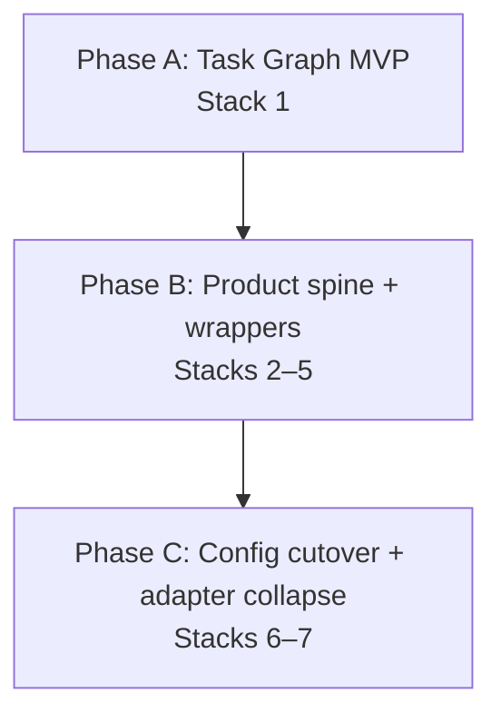

# M3: Core Engine Refactor & Config Shape Evolution

**Milestone ID:** `M3-core-engine-refactor-config-evolution`  
**Status:** Completed (2025-12-19)  
**Owner:** Engineering  

> Note: M3 scope is **locked** (see Objectives + Scope). This doc stays at the **milestone sequencing** level. Execution detail (deliverables, acceptance criteria, open questions) lives in the M3 issue docs and the project deferrals registry.

## Summary

Extend the stable orchestrator-centric slice from M2 into a composable, explicit pipeline: a Task Graph executor runs the full engine as steps with enforced `requires`/`provides`, while `MapGenConfig` evolves into its step-aligned “Phase 2/3” shape and legacy tunables are retired.

## Objectives

- Make all major stages (foundation, morphology, hydrology/climate, narrative overlays, biomes, placement) run as pipeline steps with explicit `requires`/`provides`.
- Enforce `requires`/`provides` at runtime (fail-fast gating), so contract violations cannot silently limp through generation.
- Evolve `MapGenConfig` from the Phase 1 “hygiene” shape into a step-aligned, phase-aware configuration surface (Phase 2/3), and retire tunables.
- Establish `FoundationContext`, `Heightfield`, `ClimateField`, and `StoryOverlays` as canonical **artifacts** (data products) across the engine.
- **Scope guardrail:** M3 is wrap‑first. Do not introduce new geomorphology/hydrology algorithms (e.g., stream power erosion, ocean currents, cryosphere, pedology); preserve current map quality by wrapping existing/engine behavior first.

**Terminology (M3):**

- **Artifacts vs “products”:** used synonymously; prefer “artifact” (matches `docs/system/libs/mapgen/architecture.md`).
- **`requires`/`provides` tags:** may refer to artifacts (`artifact:*`), fields (`field:*`), or engine-surface state guarantees (`state:*`) as described in `docs/system/libs/mapgen/architecture.md`.

## Scope

### In Scope (Locked)

- Task Graph MVP becomes the execution model (`MapGenStep`, `StepRegistry`, `PipelineExecutor`, runtime `requires`/`provides` gating).
- Wrap-first step boundaries for remaining clusters (morphology, hydrology/climate, story overlays, biomes/features, placement).
- Productization where needed for consumer migration (notably `ClimateField` canonicalization + minimal river product).
- Config evolution Phase 2/3 lands in the new, step-aligned form (tunables retired; no long-term carry-forward of legacy shapes).
- Adapter boundary collapse (single adapter at `MapGenContext.adapter: EngineAdapter`).

### Out Of Scope (Explicit Non-Goals)

- New physics/simulation algorithms (stream power erosion, ocean currents, cryosphere, pedology).
- Any additional “M4-style” hardening beyond the baseline runtime gating (e.g., exhaustive manifest validation, broad regression harness work).

### Canonical Sources (Use These For Detail)

- System architecture: `docs/system/libs/mapgen/architecture.md`
- Pipeline PRD: `docs/projects/engine-refactor-v1/resources/PRD-pipeline-refactor.md`
- Config PRD: `docs/projects/engine-refactor-v1/resources/PRD-config-refactor.md`
- Parity tracker (remaining gap rows; issues should link back): `docs/projects/engine-refactor-v1/resources/STATUS-M-TS-parity-matrix.md`
- Time-bound tradeoffs/compat shims (canonical): `docs/projects/engine-refactor-v1/deferrals.md`

## Sequencing & Parallelization Plan (Conceptual)

> This is a planning/communication sequence; it does not redefine scope. See `docs/process/GRAPHITE.md` for stacked PR workflow.
>
> **Graphite execution decision (locked):** implement M3 as **one long-running Graphite stack** and merge to `main` at the end. “Stacks 1–7” below are conceptual groupings for issue-cutting and sequencing, not independent merge tracks.

### Phase A — Task Graph MVP becomes “the way to run” (wrap-only)

- **Goal:** A standard pipeline entry can run steps end-to-end with runtime contract gating, without changing algorithms.
- **Conceptual stacks:** Stack 1.

### Phase B — Product spine + wrapper migration (still wrap-first)

- **Goal:** Make canonical artifacts real for consumers (ClimateField, rivers, overlays), then wrap biomes/features and placement as steps consuming those artifacts (and explicit engine-surface `state:*` where unavoidable).
- **Conceptual stacks:** Stacks 2–5.

### Phase C — Config Phase 2/3 lands + adapter boundary collapses

- **Goal:** Config lands in its step-aligned shape (tunables retired; presets/recipes aligned), then collapse to a single adapter boundary as the “final core architecture” step.
- **Conceptual stacks:** Stacks 6–7.

## Issue Map (Parent Issues / Workstreams)

> These issue docs are the executable source of truth for M3. Linear IDs/titles may change; the workstreams are locked by scope above.

| Stack | Issue | Summary | Depends On |
|------:|-------|---------|------------|
| 1 | [CIV-41](https://linear.app/mateic/issue/CIV-41) | Task Graph MVP + standard pipeline entry + runtime gating | — |
| 2 | [CIV-42](https://linear.app/mateic/issue/CIV-42) | ClimateField canonicalization + minimal river product | 1 |
| 3 | [CIV-43](https://linear.app/mateic/issue/CIV-43) | Story remainder as steps/products (StoryOverlays canonical; compat tracked in deferrals) | 1 |
| 4 | [CIV-44](https://linear.app/mateic/issue/CIV-44) | Biomes/features step wrapper (consumes canonical artifacts) | 1,2,3 |
| 5 | [CIV-45](https://linear.app/mateic/issue/CIV-45) | Placement step wrapper (consumes canonical artifacts; explicit `state:*` where needed) | 1,4 |
| 6 | [CIV-46](https://linear.app/mateic/issue/CIV-46) | Config Phase 2/3 cutover + tunables retirement + presets/recipes alignment | 1–5 |
| 7 | [CIV-47](https://linear.app/mateic/issue/CIV-47) | Collapse EngineAdapter/OrchestratorAdapter boundary | 6 |

### Notes

- `_archive/CIV-19-*`, `_archive/CIV-20-*`, `_archive/CIV-22-*` are **completed M1 work** and must not be resurrected as M3 scope. M3’s wrappers are a different unit of work (Task Graph step boundaries), not the earlier adapter integration.

## Tradeoffs / Deferrals (Centralized)

Temporary bridges/compat behavior and their “until X, then remove” triggers are tracked in:

- `docs/projects/engine-refactor-v1/deferrals.md`

M3 milestone/issue docs should link to the relevant `DEF-00X` entries rather than duplicating tradeoff text here.

## Linear Issues (Minted)

All M3 issues are now live in Linear:

1. Stack 1: CIV-41
2. Stacks 2–3: CIV-42, CIV-43
3. Stacks 4–5: CIV-44, CIV-45
4. Stack 6: CIV-46
5. Stack 7: CIV-47

## Completion Notes (2025-12-19 Re-baseline)

Implementation details and residual follow-ups are captured in:

- `docs/projects/engine-refactor-v1/reviews/REVIEW-M3-core-engine-refactor-config-evolution.md`
- `docs/projects/engine-refactor-v1/reviews/REVIEW-CIV-M4-ADHOC-modularize.md`
