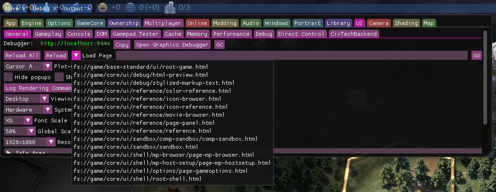

# What is a .modinfo file?

A `.modinfo` file is the linchpin of any mod. At its core, a `.modinfo` file is just an XML file structured in a particular way and given the `.modinfo` file extension.

It tells the game what files to load and what to do with them. It tells the game how a mod relates to other mods and to DLC. It stores all the basic info about the mod (such as the name, author, and so on)!

For those coming from modding Civ VI, the structure of a `.modinfo` file should be very familiar to you, although there are a number of differences.

If you're ever in need of references, check out the various `.modinfo` files in the example mods, or in the game files (yes! The game's modules and DLCs are structured in the same way as mods!).

# Sample .modinfo file

This is a sample `.modinfo` file. You can copy the code here to use as base for your own `.modinfo` files:

```xml
<?xml version="1.0" encoding="utf-8"?>
<Mod id="fxs-new-policies" version="1"
	xmlns="ModInfo">
	<Properties>
		<Name>Antiquity Policies</Name>
		<Description>Adds new policies to the Antiquity Age</Description>
		<Authors>Firaxis</Authors>
		<AffectsSavedGames>1</AffectsSavedGames>
	</Properties>
	<Dependencies>
	</Dependencies>
	<References>
	</References>
	<ActionCriteria>
		<Criteria id="antiquity-age-current">
			<AgeInUse>AGE_ANTIQUITY</AgeInUse>
		</Criteria>
	</ActionCriteria>
	<ActionGroups>
		<ActionGroup id="antiquity-game" scope="game" criteria="antiquity-age-current">
			<Actions>
				<UpdateDatabase>
					<Item>data/antiquity-traditions.xml</Item>
				</UpdateDatabase>
			</Actions>
		</ActionGroup>
	</ActionGroups>
</Mod>
```
# Structure of a .modinfo file
## Mod

The root element in a `.modinfo` file is always the `<Mod>` element. It should have the following attributes:

* `id`
	* The `id` is an identifier used to distinguish mods. It must be unique to distinguish it from other mods.
	  
	  It's recommended that the id be composed solely of ASCII characters and be less than 64 characters. It's also recommended to use solely lower case letters, and to use dashes instead of underscores or spaces.
	  
	  It's also good practice to adopt a developer prefix (an informal identifier for yourself, something like `fxs`, `suk`, `lime`) for all your mods. So instead of giving your mod the id `my-cool-mod`, you'd give it the id `fxs-my-cool-mod` to ensure your mod id is completely unique.
* `version`
	* The version number for the mod.
* `xmlns`
	* The XML namespace. This should always be set to `ModInfo`.
## Properties

The `Properties` element contains much of the additional information about the mod. It consists of the following child elements. All these elements are technically optional, but at minimum, you should include `Name`, `Description`, and `Author`.

* `Name`
	* The name of the mod. If this element is left empty, the mod will not show up in the Add-Ons screen, though the game can still load it.
* `Description`
	* A brief description of what the mod does. It will be displayed in the Add-Ons screen.
* `Authors`
	* The name of the author(s).
* `AffectsSavedGames`
	* Determines whether the mod affects existing saved games.
	  
	  Mods with this element set to `1` cannot be removed or added to games that are already in progress. Mods that affect the Gameplay database should have this set to `1`.
	  
	  Mod with this element set to `0` can be added or removed at any time. This is usually for mods that *ONLY* affect the game's UI and/or Localization database.
	
	  Set to `1` or `0`. If this element is excluded, it defaults to `1`.
* `Package`
	* This field is not currently used by the game's UI. It would allow for mods with the same package value to be grouped together.
* `PackageSortIndex`
	* This field is not currently used by the game's UI. It would determines the order in which mods are shown in the browser.
* `ShowInBrowser`
	* Determines whether the mod should be shown on the Add-Ons screen. 
	  Set to `1` or `0`. If this element is excluded, it defaults to `1`.
* `EnabledByDefault`
	* Determines if the mod is enabled by default if it has not been enabled/disabled in the game previously.
	  Set to `1` or `0`. If this element is excluded, it defaults to `1`.
## Dependencies

The `Dependencies` element consists of a list of `Mod` child elements. This mod will have those mods as dependencies. This means those mods will need to be activated for this mod to be activated. Additionally, those mods will be loaded before this mod.

Each child `Mod` element should have the following attributes:
* `id`
	* This is the id of the mod that this mod will reference. This should match the mod id in the `Mod` root element of that mod's `.modinfo` file
* `title`
	* This is the name of the mod that this mod will reference on. This should match the `Name` in the `Properties` element of that mod's `.modinfo` file

```xml
<Dependencies>
	<Mod id="fxs-new-policies" title="LOC_MODULE_ANTIQUITY_POLICIES_NAME"/>
</Dependencies>
```

A mod can have as many or as few dependencies as it needs. Additionally, all mods have the following modules as dependencies by default:

* `core`
* `base-standard`
* `age-antiquity`
* `age-exploration`
* `age-modern`
## References

The `References` element consists of a list of `Mod` child elements. This mod will have those mod as references. This means those mods will be loaded before this mod.

Each child `Mod` element should have the following attributes:
* `id`
	* This is the id of the mod that this mod will depend on. This should match the mod id in the `Mod` root element of that mod's `.modinfo` file
* `title`
	* This is the name of the mod that this mod will depend on. This should match the `Name` in the `Properties` element of that mod's `.modinfo` file

```xml
<References>
	<Mod id="friedrich-xerxes-alt" title="LOC_MODULE_FRIEDRICH_XERXES_ALT_NAME"/>
</References>
```

## ActionCriteria

The `ActionCriteria` element consists of `Criteria` child elements.

`Criteria` are a set of conditions that need to be met for a mod to execute an `ActionGroup` (see the `ActionGroups` section of this document).

Each criteria must have an `id` property. The `id` must be unique on a per mod basis. So a single mod should not have multiple criteria with the same id; but it may have an id that matches a criteria in another mod without conflict.

```xml
	<ActionCriteria>
		<Criteria id="antiquity-age-current">
			<AgeInUse>AGE_ANTIQUITY</AgeInUse>
		</Criteria>
		<Criteria id="not-antiquity-age">
			<AgeInUse inverse="1">AGE_ANTIQUITY</AgeInUse>
		</Criteria>
		<Criteria id="always">
			<AlwaysMet></AlwaysMet>
		</Criteria>
		<Criteria id="mod-active" any="true">
			<ModInUse>shawnee-tecumseh`</ModInUse>
			<ModInUse>fxs-norman-rework</ModInUse>
			<ModInUse>leu-more-llamas</ModInUse>
		</Criteria>
	</ActionCriteria>
```

By default, all conditions in a `Criteria` element must be met for an `Action` with that criteria to activate. You can add an `any="true"` property to the criteria and it will instead be met if *any* of the conditions are met.

There are several types of conditions/criterion you can use:

#### `AlwaysMet`
As the name states, this criterion is always met. `ActionGroups` that you always want active, should be assigned a `Criteria` with this criterion.

#### `NeverMet`
As the name states, this criterion is never met.

#### `AgeInUse`
This criterion is met when the game age matches the provided age. This should be one of `AGE_ANTIQUITY`, `AGE_EXPLORATION`, `AGE_MODERN`. Mods may add new Ages that can be used here as well.

#### `AgeWasUsed`
This criterion checks whether the provided age was previously played. It does not account for the current age. So if the provided value is `AGE_EXPLORATION` and you are currently playing in the Exploration Age, the criterion will not be met.
	  
Additionally, Advanced Starts do not count towards this criterion. An Exploration Era Advanced Start will **NOT** trigger an `AgeWasUsed` condition set to `AGE_ANTIQUITY`.

#### `AgeEverInUse`
A combination of `AgeInUse` and `AgeWasUsed`. Checks whether the provided Age matches either the current Age, or a previously played Age.

#### `ConfigurationValueMatches`
Checks if a game configuration parameter matches the provided values. This criterion needs three separate values:

* `Group`, this should match the `ConfigurationGroup` of the desired parameter.
* `ConfigurationId`, this should match the `ConfigurationKey` of the desired parameter.
* `Value`, this should match the value you want to check for.

You can reference the `Parameters` table in the frontend/shell database for valid configuration values.

For example, a criterion that checks if the game is set to standard speed would look like this.

```xml
	<ConfigurationValueMatches>
		<Group>Game</Group>
		<ConfigurationId>SpeedType</ConfigurationId>
		<Value>GAMESPEED_STANDARD</Value>
	</ConfigurationValueMatches>
```

#### `ConfigurationValueContains`
Almost identical to `ConfigurationValueMatches`, but it instead takes a comma delimited list for the `Value` field. The criterion is met if the parameter matches any of the provided values

For example, a criterion that checks if the game is set to Governor or Viceroy difficulty would look like this.

```xml
	<ConfigurationValueContains>
		<Group>Game</Group>
		<ConfigurationId>Handicap</ConfigurationId>
		<Value>DIFFICULTY_PRINCE,DIFFICULTY_KING</Value>
	</ConfigurationValueContains>
```

#### `MapInUse`
Checks whether the current map type matches the provided value. The value provided should be match the `File` column of the `Maps` table in the frontend database.

```xml
		<Criteria id="continents-plus">
			<MapInUse>{base-standard}maps/continents-plus.js</MapInUse>
		</Criteria>
```

#### `RuleSetInUse`
Checks if the given ruleset is in use. By default the only ruleset available is `RULESET_STANDARD`, but more may be added by mods or DLC. You can reference the `Rulesets` table in the frontend/shell database for valid rulesets.

#### `GameModeInUse`
Checks whether the game mode matches the provided value. The value MUST be one of `WorldBuilder`, `SinglePlayer`, `HotSeat`, or `MultiPlayer`

#### `LeaderPlayabe`
Checks whether provided leader is a valid configuration option (can you set up a game with this leader as a player?)
#### `CivilizationPlayable`
Checks whether provided civilization is a valid configuration option (can you set up a game with this civilization as a player?).

This is affected by Game Age, `CIVILIZATION_HAN` would not be a valid option in an Exploration Age game.
#### `ModInUse`
This criterion is met when a mod with an `id` matching the provided value is active. The meaning of 'mod' here is broad. This can be user created mods, or official Firaxis DLC such as `shawnee-tecumseh`.
	  
it can optionally also take a `Version` property. In which case it will check to see if the mod version **MATCHES EXACTLY** before being met. It must be exact. Version `1` will not match version `1.0`.

```xml
	<ActionCriteria>
		<Criteria id="babylon-mod-active">
			<ModInUse>
				<Version>2.0</Version>
				<Value>suk-abyssinia-civilization</Value>
			</ModInUse>
		</Criteria>
	</ActionCriteria>
```

## ActionGroups

```xml
<ActionGroups>
	<ActionGroup id="antiquity-game" scope="game" criteria="antiquity-age">
		<Actions>
			<UpdateDatabase>
				<Item>data/antiquity-traditions.xml</Item>
			</UpdateDatabase>
		</Actions>
	</ActionGroup>
	<ActionGroup id="game-always" scope="game" criteria="always">
		<Properties>
			<LoadOrder>10</LoadOrder>
		</Properties>
		<Actions>
			<UpdateText>
				<Item>text/core-text.sql</Item>
			</UpdateText>
			<UIScripts>
				<Item>ui/unit-flags/custom-flags.js</Item>
			</UIScripts>
			<ImportFiles>
				<Item>textures/custom-flag-backing.png</Item>
				<Item>ui/lenses/layer/building-placement-layer.js</Item>
			</ImportFiles>
		</Actions>
	</ActionGroup>
</ActionGroups>
```

The `ActionGroups` element consists of `ActionGroup` child elements. Each `ActionGroup` should have the following attributes:
* `id`
	* The `id` of the `ActionGroup`. This must be unique on a per mod basis.
* `scope`
	* Whether the `ActionGroup` targets the frontend or gameplay scope. The value of this element must be either `game` or `shell`
* `criteria`
	* The criteria that must be met for this `ActionGroup` to trigger. Set the value to the `id` of a `Criteria` defined in `ActionCriteria`

An `ActionGroup` consists of `Action` child elements, which in turn consists of an array of different child elements representing different types of actions. Those child elements should have further `Item` file elements that contain a path (relative to the `.modinfo` file) to the file to be loaded by the action

There are a variety of different action types.
#### `UpdateDatabase`
Updates either the frontend/shell or gameplay database with the provided `.xml` or `.sql` items, depending on the `scope` of the `ActionGroup`.
#### `UpdateText`
Updates the Localization database with the provided `.xml` or `.sql` items. 
#### `UpdateIcons`
Updates the Icons database with the provided `.xml` or `.sql` items. 
#### `UpdateColors`
Updates the Colors database with the provided `.xml` or `.sql` items. 
#### `UpdateArt`
Updates art files. This action type won't be useful for modders until art tools are released.
#### `ImportFiles`
Imports files into the game's file system. This can be used to import custom 2D assets such as `.png` files. It can also be used to replace files, provided the file being imported has the same name and path (relative to the `.modinfo` file).
#### `UIScripts`
Loads the provided `.js` files as new UI scripts.
#### `UIShortcuts`



Loads the provided `.html` files into the game's debug menu for loading. `EnableDebugPanels` must be set to `1` in `AppOptions.txt` to access the panel.
#### `UpdateVisualRemaps`
Updates the Visual Remap database with the provided `.xml` or `.sql` items. The Visual Remaps can be used to relink the visuals of gameplay entries onto other assets.
#### `MapGenScripts`
Adds a new `.js` gameplay script that is loaded during map generation, then unloaded after.
#### `ScenarioScripts`
Adds a new `.js` gameplay script.