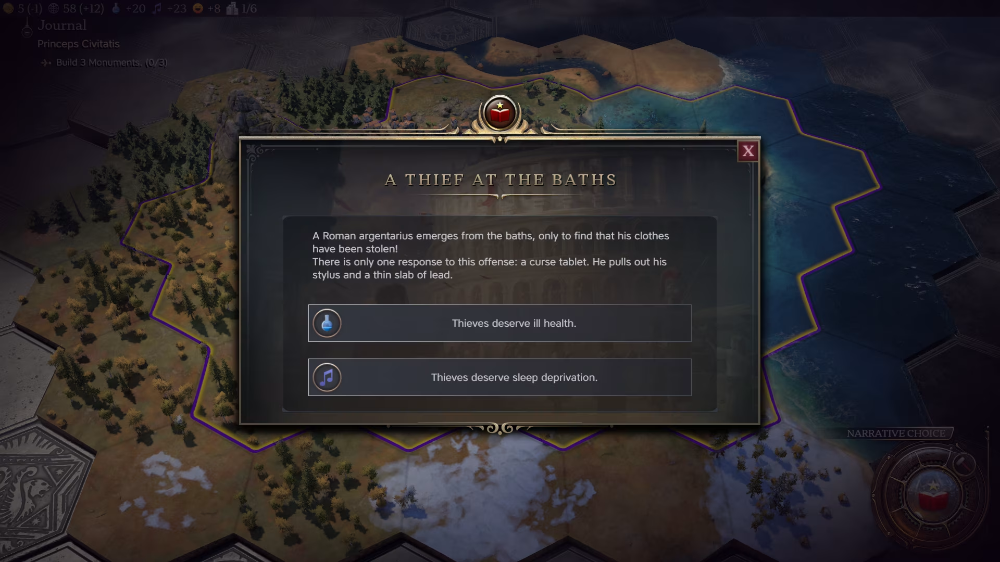
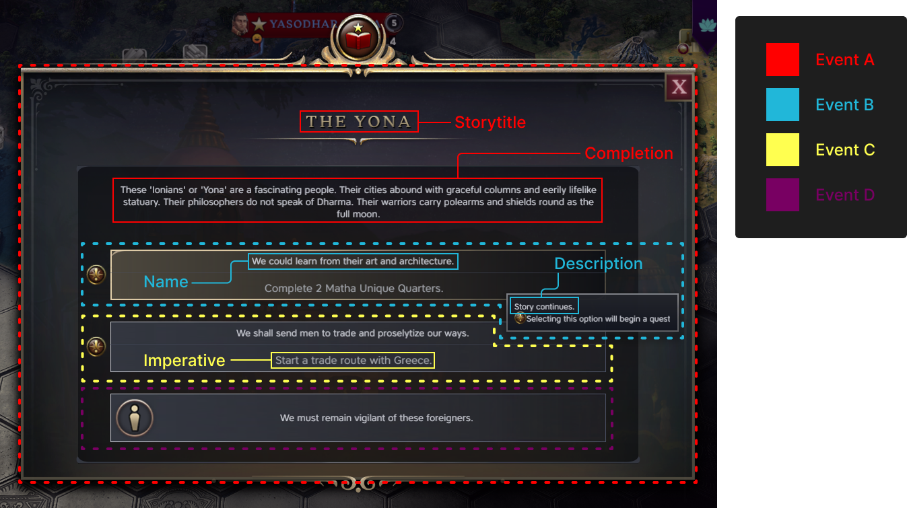
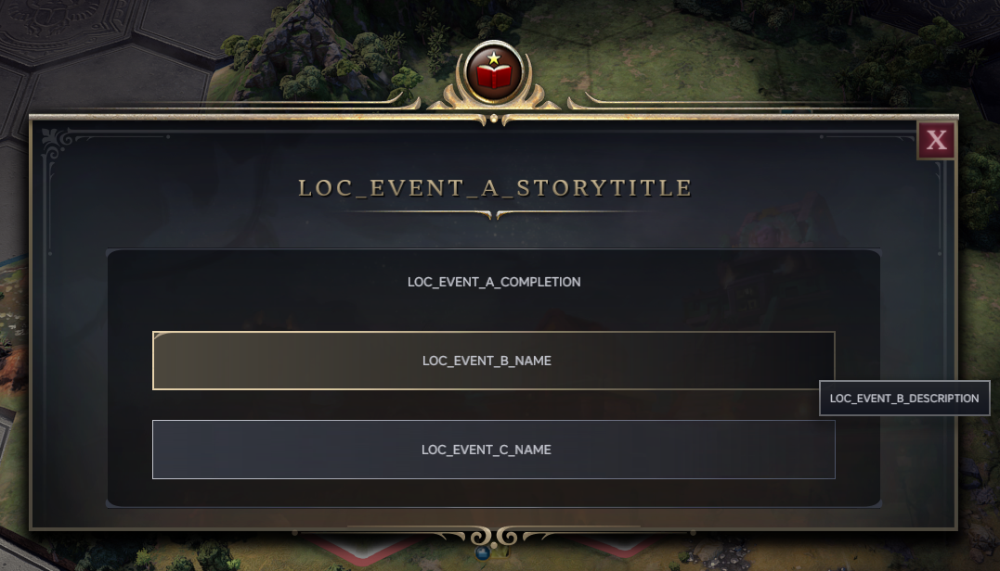
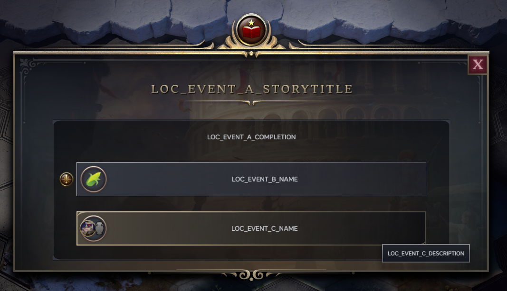
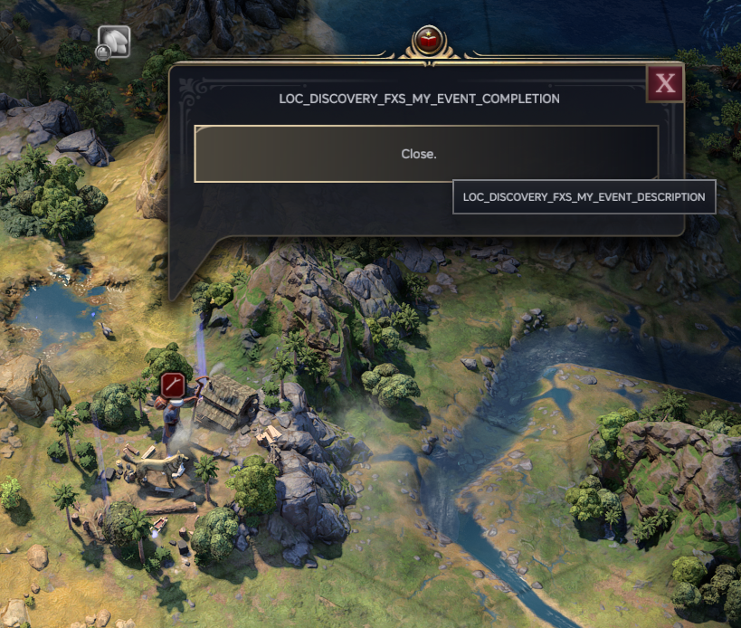

# What are Narrative Events?

> **Important:** 
> This article assumes familiarity with both the basics of [Database Modding](database-modding.md) and the [Modifier System](the-modifier-system.md). Familiarise yourself with that before diving into modding Narrative Events! And if you have never made a mod before, begin with the [Getting Started](getting-started.md) article!

**Narrative Events** are a brand-new feature in Civilization VII. You've probably seen them as the various pop-ups that appear as you play.



As the name suggests, they're a great vehicle for narrative, and a great way to bring a sense of life to the game. Now, with the power of modding, you too can bring your own stories into Civilization VII!

# Anatomy of a Narrative Event

We interact with Narrative Events through pop-ups, so it's best to consider how they relate.

Most pop-ups are actually composed of **multiple Narrative Events**. So to make a single pop-up you'll be normally be creating multiple events and linking them together.



For example, the above popup consists of **4 Narrative Event entries**. Event A is the pop-up itself. Events B to D are each of the three buttons presented to you as choices. These buttons are events in their own right and may have their own popups with further choices. **We would say Event A leads to Events B, C, and D**

So we can break events down into two sections. The **Pop-up** and the **Button**.

* **Pop-ups** consist of the following text:
	* The **Storytitle** is the title that appears at the top of a Pop-up.
	* The **Completion** is the long flavor text that appears as the body of a Pop-up.
* **Buttons** consist of the following text:
	* The **Name** is the flavor text that appears as the key text element in a button.
	* The **Imperative** is an optional text entry that gives you a command to complete in order to advance the Narrative Event. It appears below the Name.
	* The **Description** is gameplay text that appears as the tooltip of a button. This usually a description of what happens when you select an option, such as "+2 Culture on Amphitheaters".

Narrative Events might not use both sections. Some events aren't triggered by buttons. Some events don't trigger pop-ups. 

To reiterate, the **Pop-up** and **the Buttons** in a pop-up usually **belong to separate Narrative Events**. With the parent event supplying data for the Pop-up, and the various events it leads to supplying data for the buttons.

> **Note:** 
> There is one exception to this, which is a Narrative Event that **does not lead to further events**. In which case, the Pop-up will only have one button that says "Close", text is **pulled from the same Narrative Event** for the **Description**. The **Name** and **Imperative** are ignored.
>
> 

# Creating an Event

## NarrativeStories

Let's create a Pop-up with two choices. For this we'll need to make three separate Narrative Events. Then we link two of them to the third so they appear as buttons.

```xml
<?xml version="1.0" encoding="utf-8"?>
<Database>
    <Types>
        <Row Type="EVENT_A" Kind="KIND_NARRATIVE_STORY"/>
        <Row Type="EVENT_B" Kind="KIND_NARRATIVE_STORY"/>
        <Row Type="EVENT_C" Kind="KIND_NARRATIVE_STORY"/>
    </Types>
    <NarrativeStories>
        <Row
            NarrativeStoryType="EVENT_A"
            Name="LOC_EVENT_A_NAME"
            Description="LOC_EVENT_A_DESCRIPTION"
            Completion="LOC_EVENT_A_COMPLETION"
            StoryTitle="LOC_EVENT_A_STORYTITLE"
            Age="AGE_ANTIQUITY"
            Activation="REQUISITE"
            ActivationRequirementSetId="REQSET_EVENT_A_NARRATIVE_REQUISITE"
            RequirementSetId="REQSET_EVENT_A_NARRATIVE"
            UIActivation="STANDARD"
        />
        <Row
            NarrativeStoryType="EVENT_B"
            Name="LOC_EVENT_B_NAME"
            Description="LOC_EVENT_B_DESCRIPTION"
            Completion="LOC_EVENT_B_COMPLETION"
            Age="AGE_ANTIQUITY"
            Activation="LINKED"
            RequirementSetId="Met"
            UIActivation="STANDARD"
        />
        <Row
            NarrativeStoryType="EVENT_C"
            Name="LOC_EVENT_C_NAME"
            Description="LOC_EVENT_C_DESCRIPTION"
            Completion="LOC_EVENT_C_COMPLETION"
            StoryTitle="LOC_EVENT_C_STORYTITLE"
            Age="AGE_ANTIQUITY"
            Activation="LINKED"
            IsQuest="FALSE"
            Hidden="TRUE"
            RequirementSetId="Met"
            UIActivation="STANDARD"
        />
    </NarrativeStories>
    <NarrativeStory_Links>
        <Row
            FromNarrativeStoryType="EVENT_A"
            ToNarrativeStoryType="EVENT_B"
            Name="LOC_EVENT_B_NAME"
            Description="LOC_EVENT_B_DESCRIPTION"
        />
        <Row
            FromNarrativeStoryType="EVENT_A"
            ToNarrativeStoryType="EVENT_C"
            Name="LOC_EVENT_C_NAME"
            Description="LOC_EVENT_C_DESCRIPTION"
        />
    </NarrativeStory_Links>
</Database>
```

So we've defined three new Narrative Events (A, B, and C) in `Types`/`NarrativeStories`. In `NarrativeStory_Links`, we tell the game that A leads to B and C.




<details class="code-example">
<summary>antiquity-discovery.xml</summary>

```xml lines=1-10
%[{ examples/fxs-new-narrative-event/data/antiquity-discovery.xml }]%
```

</details>


<details class="code-example">
<summary>antiquity-discovery-game-effects.sql</summary>

```sql lines=1-80
%[{ examples/fxs-new-narrative-event/data/antiquity-discovery-game-effects.sql }]%
```

</details>

Most of the columns here are self-explanatory, but here are some columns worth noting.

* `NarrativeStories`
	* `Name`/`Description`
		* We talked about the Name/Description in the previous section, but an important thing to note is that these two columns must be defined, even if you're not using them. You can just provide dummy tags, they just can't be left empty.
	* `UIActivation`
		* This determines the visual appearance of the Pop-up in game. `STANDARD` and `DISCOVERY` are probably the most common choices.
	* `Activation` 
		* Determines how the event is activated. Generally you will want to use `REQUISITE` for the initial Narrative Event, and `LINKED` or `LINKED_REQUISITE` for subsequent events. Use `AUTO` for initial Discovery events.
	* `ActivationRequirementSetId` (**OPTIONAL**)
		* A RequirementSet that is checked **once** when the Narrative Event is initialised. Events that fail this check are **immediately archived** and **never shown to the player**.
		  
		  For `REQUISITE` events, this will generally be checks you don't expect to change over the course of play, such as ensuring the player is a given leader or civilization.
		  
		  For `LINKED_REQUISITE` events, the check is run when their parent pop-up triggers. This is useful for when you want to hide buttons on a popup unless the player meets certain conditions at that specific moment in time. Perhaps you want to have an event option only be available and visible to a certain leader. Perhaps you want the option to only be available if they have at least three cities.
		  
		  Events with their `Activation` set to `LINKED` ignore this field.
	* `RequirementSetId`
		* A RequirementSet to check if a Narrative Event is 'complete'. Normally this will be a RequirementSet that checks if the **Imperative** is met for a quest, or if the conditions have been met for a Narrative Event to trigger.
		  
		  Pop-ups display when an event is marked as 'complete'. Hence, the flavor text also being called the `Completion` text.
		  
		  This can be set to `Met` if you don't need to run any checks.
	* `IsQuest` (**OPTIONAL**)
		* Marks if an event is a quest. Defaults to "FALSE" if left empty. Note that marking an event as a quest does not cause the Quest icon to appear in its button by default. You will still have to manually add the button via the `NarrativeRewardIcons` table.
	* `Hidden` (**OPTIONAL**)
		* Hidden events do not spawn Pop-ups when the event is 'complete'. They will still appear as buttons on events that lead to it however. Defaults to "FALSE" if left empty.
	
* `NarrativeStory_Links`
	* `Name`/`Description`
		* The values in these fields are not actually used by the game, but they must be filled. You can just provide dummy tags, they just can't be left empty.

##  Requirements

Events will need RequirementSets to determine when and for whom they can trigger. Let's say you want the event to trigger  a pop-up when they found their 2nd city, but if only if the player is one of Rome, Aksum, or the Mississippians.

1. The `ActivationRequirementSetId` determines if a player is eligible for the event. It is only checked once when the event is initialised.
	* So in the example above, you would want to check the player's `CivilizationType` here.
2. The  `RequirementSetId` determines when the event is 'complete'/when the pop-up is triggered. For events that are quests, this will be where you'd want to check if the quest has been completed. The  `RequirementSetId` is continually checked after the event has been initialised.
	* So in the example above, you would want to check whether the player has founded 2 cities yet, so that the event can be marked as 'complete' and the pop-up can be triggered.

```xml
<?xml version="1.0" encoding="utf-8"?>
<GameEffects xmlns="GameEffects">
	<RequirementSet id="REQSET_EVENT_A_NARRATIVE_REQUISITE" type="REQUIREMENTSET_TEST_ANY">
	    <Requirement type="REQUIREMENT_PLAYER_CIVILIZATION_TYPE_MATCHES">
	        <Argument name="CivilizationType">CIVILIZATION_AKSUM</Argument>
	    </Requirement>
	    <Requirement type="REQUIREMENT_PLAYER_CIVILIZATION_TYPE_MATCHES">
	        <Argument name="CivilizationType">CIVILIZATION_ROME</Argument>
	    </Requirement>
	    <Requirement type="REQUIREMENT_PLAYER_CIVILIZATION_TYPE_MATCHES">
	        <Argument name="CivilizationType">CIVILIZATION_MISSISSIPPIAN</Argument>
	    </Requirement>
    </RequirementSet>
    <RequirementSet id="REQSET_EVENT_A_NARRATIVE">
        <Requirement type="REQUIREMENT_PLAYER_HAS_AT_LEAST_NUM_GOSSIPS">
            <Argument name="GossipTypes">GOSSIP_FOUND_CITY01</Argument>
            <Argument name="DuplicateCount">2</Argument>
        </Requirement>
    </RequirementSet>
</GameEffects>
```

> **Important:** 
> Many Events utilize the `REQUIREMENT_PLAYER_HAS_AT_LEAST_NUM_GOSSIPS` requirement type. This requirement type is a very flexible requirement type that can check for a lot of things, and often overlaps with more standard requirements.
> 
> In the above example, `REQSET_EVENT_A_NARRATIVE` could also have been achieved with a `REQUIREMENT_PLAYER_HAS_FOUNDED_X_CITIES` requirement type.
> 
> Which you choose to use will vary depending on both your preferences and needs. **See the appendix for a more detailed look at the `REQUIREMENT_PLAYER_HAS_AT_LEAST_NUM_GOSSIPS` requirement.**

## Rewards

Often, we will want Narrative Events to interact with the game state. Most frequently, we will want them to grant bonuses or maluses upon completion.

To do this, we use Modifiers, and assign it as a Narrative Reward.

```xml
<Modifier id="EVENT_C_MODIFIER" collection="COLLECTION_PLAYER_CITIES" effect="EFFECT_CITY_ADJUST_CONSTRUCTIBLE_YIELD" permanent="true">
	<Argument name="YieldType">YIELD_CULTURE</Argument>
	<Argument name="Amount">2</Argument>
	<Argument name="ConstructibleType">BUILDING_PALACE</Argument>
</Modifier>
```

```xml
<NarrativeRewards>
    <Row NarrativeRewardType="EVENT_C_REWARD" ModifierID="EVENT_C_MODIFIER"/>
</NarrativeRewards>
<NarrativeStory_Rewards>
	<Row NarrativeStoryType="EVENT_C" NarrativeRewardType="EVENT_C_REWARD" Activation="COMPLETE"/>
</NarrativeStory_Rewards>
```

The process of adding modifiers to an event is slightly more complicated.

1. Create a Modifier you want to assign as a reward. Set `permanent` to true so it persists after the Narrative Event ends.
2. Create a new `NarrativeRewardType`, assigning the Modifier you want to use to it.
3. Assign the `NarrativeRewardType` to a previously created `NarrativeStoryType` using the `NarrativeStory_Rewards` table.

The `Activation` field in `NarrativeStory_Rewards` can be set to `COMPLETE` (when the event's `RequiremenSetId` is met, or `START` (when the event is activated).

**In the case where an event has multiple modifiers. You will need to create multiple Narrative Rewards.**

## Additional Tables

That's technically all you need to know when making a Narrative Event. But there are a few more tables, which while not vital, are extremely helpful in communicating to the player what an event does.
### NarrativeRewardIcons

The `NarrativeRewardIcons` table can be used to add icons to Narrative Event buttons. Despite its name, it is used for more than just rewards. It is also used to add Quest icons, and icons for costs.

A single Narrative Event can have multiple NarrativeRewardIcons.

```xml
    <NarrativeRewardIcons>
        <Row NarrativeStoryType="EVENT_B" RewardIconType="QUEST"/>
        <Row NarrativeStoryType="EVENT_B" RewardIconType="YIELD_FOOD"/>
        <Row NarrativeStoryType="EVENT_C" RewardIconType="BUILDING_ALTAR"/>
        <Row NarrativeStoryType="EVENT_C" RewardIconType="GREATWORK"/>
    </NarrativeRewardIcons>
```



You can theoretically use any icon defined in the game's Icon database here, but normally, only **Yield** icons, **Attribute** icons, and one of a number of preset options are used (so in the above example, `BUILDING_ALTAR` is **non-standard** usage, but it *IS* possible). There is also a `Negative` field that can be used with Yield icons and a number of the preset options to get a red negative version of said icon.
### NarrativeStory_TextReplacements

Occasionally you will want text to be dynamically filled by the event itself. The text might have a reference to your capital city for example.

To do this we use the `NarrativeStory_TextReplacements` table.

```xml
    <NarrativeStory_TextReplacements>
        <Row NarrativeStoryType="EVENT_A" 
        NarrativeStoryTextType="BODY" 
        NarrativeTextReplacementType="CAPITAL"
        Priority="1"/>
        <Row NarrativeStoryType="EVENT_C" 
        NarrativeStoryTextType="REWARD" 
        NarrativeTextReplacementType="REWARD"
        Priority="1"/>
        <Row NarrativeStoryType="EVENT_C" 
        NarrativeStoryTextType="REWARD" 
        NarrativeTextReplacementType="CAPITAL"
        Priority="2"/>
    </NarrativeStory_TextReplacements>
```

```xml
<?xml version="1.0" encoding="utf-8"?>
<Database>
    <LocalizedText>
        <Replace Tag="LOC_EVENT_A_COMPLETION" Language="en_US">
            <Text>My Capital City is {1}</Text>
        </Replace>
        <Replace Tag="LOC_EVENT_C_DESCRIPTION" Language="en_US">
            <Text>{1} in {2}.</Text>
        </Replace>
	</LocalizedText>
</Database>
```


* `NarrativeStoryTextType` determines which part of a Narrative Event you want to replace text in.
	* `BODY` replaces text in the `Completion`
	* `REWARD` replaces text in the `Description`
	* `IMPERATIVE` replaces text in the `Imperative`
	* `OPTION` replaces text in the `Name`
* `NarrativeTextReplacementType` is the data you want to use in the text as a replacement. Some common options include
	* `REWARD`
		* This is an unusual one. `REWARD` parses a reward modifiers attached to the event and provides text describing it. This will be gameplay text so it should normally only be used with the `REWARD`/`Description`. This is why many Narrative events only have `{1_REWARD}.` written out as their `Description`.
		  
		  This does not work with all modifiers, so you may sometimes need to write the reward out manually.
	* `CAPITAL`, your capital city.
	* `CIVILIZATION`, your civilization. (e.g. 'Rome')
	* `CIVILIZATION_ADJ`, your civilization's adjective. (e.g. 'Roman')
	* `INDEPENDENT` a nearby Independent.
* `Priority` determines the order in which the replacement should occur, in case you need multiple text replacements in a single piece of text.

## Discoveries

Discoveries are a subset of Narrative Events, replacing the various "goody huts" from previous games in the series. Discoveries are triggered by moving onto one of a variety of landmarks that appear on the map.


Making a Discovery is mostly the same as making a Narrative Event with a few quirks.

```xml
    <Types>
        <Row Type="DISCOVERY_FXS_MY_EVENT" Kind="KIND_NARRATIVE_STORY"/>
    </Types>
<NarrativeStories>
	<Row
		NarrativeStoryType="DISCOVERY_FXS_MY_EVENT"
		Name="LOC_DISCOVERY_FXS_MY_EVENT_NAME"
		Description="LOC_DISCOVERY_FXS_MY_EVENT_DESCRIPTION"
		Completion="LOC_DISCOVERY_FXS_MY_EVENT_COMPLETION"
		StoryTitle="LOC_DISCOVERY_FXS_MY_EVENT_STORYTITLE"

		Age="AGE_ANTIQUITY"
		Queue="NARRATIVE_GROUP_DISCOVERY_CAMPFIRE_BASIC"

		StartEveryone="TRUE"
		FirstOnly="TRUE"
		ForceChoice="TRUE"

		Activation="AUTO"
		UIActivation="DISCOVERY"
		RequirementSetId="REQSET_DISCOVERY_BASE_NARRATIVE"
	/>
</NarrativeStories>
<NarrativeStoryOverrides>
    <Row NarrativeStoryType="DISCOVERY_FXS_MY_EVENT" OverriddenStoryType="DISCOVERY_BASE"/>
</NarrativeStoryOverrides>
```

For the initial Discovery:

1. Set `StartEveryone`, `FirstOnly`, and `ForceChoice` to true.
2. Set `Activation` to `AUTO`.
3. Set `UIActivation` to `DISCOVERY`.
4. Set `RequirementSetId` to `REQSET_DISCOVERY_BASE_NARRATIVE`.
5. Add the new event to the `NarrativeStoryOverrides` table, overriding the `DISCOVERY_BASE`  Story Type.
6. Choose a `Queue` for the Discovery.

The `Queue` determines two things:

1. In what type of Landmark can your custom event be found. (e.g. Campfire, Cave, Shipwreck)
2. How likely the Discovery is to spawn. (e.g. Basic, Investigation, or Mythic)

You can see a full list of queues in the `NarrativeStory_Queues` table.



You will also want to assign the `DISCOVERY_BASE_REWARD` to this initial Narrative Event.

```xml
<NarrativeStory_Rewards>
    <Row
        NarrativeStoryType="DISCOVERY_FXS_MY_EVENT"
        NarrativeRewardType="DISCOVERY_BASE_REWARD"
        Activation="COMPLETE"
        BonusEligible="FALSE"
    />
</NarrativeStory_Rewards>
```

The `DISCOVERY_BASE_REWARD` NarrativeRewardType is just a predefined Reward Type that is used to remove the landmark from the tile when the discovery is triggered.

The process to add choices to your new Discovery is the same as with standard Narrative Events: just create further Narrative Events exactly how you would normally (the only difference is you will likely want to use `DISCOVERY` for the `UIActivation`). You can define icons, text replacements, quests/imperatives, for those linked Narratives events if you want as well.

```xml
    <Types>
        <Row Type="DISCOVERY_FXS_MY_EVENT_A" Kind="KIND_NARRATIVE_STORY"/>
    </Types>
    <NarrativeStories>
        <Row
            NarrativeStoryType="DISCOVERY_FXS_MY_EVENT_A"
            Name="LOC_DISCOVERY_FXS_MY_EVENT_A_NAME"
            Description="LOC_DISCOVERY_FXS_MY_EVENT_A_DESCRIPTION"
            Completion="LOC_DISCOVERY_FXS_MY_EVENT_A_COMPLETION"
            StoryTitle="LOC_DISCOVERY_FXS_MY_EVENT_A_STORYTITLE"

            Age="AGE_ANTIQUITY"

            Activation="LINKED"
            UIActivation="DISCOVERY"
            RequirementSetId="Met"
        />
    </NarrativeStories>
    <NarrativeStory_Links>
        <Row
	        FromNarrativeStoryType="DISCOVERY_FXS_MY_EVENT"
	        ToNarrativeStoryType="DISCOVERY_FXS_MY_EVENT_A"
	        Priority="0" Name="LOC_DISCOVERY_FXS_MY_EVENT_A_NAME"
	        Description="LOC_DISCOVERY_FXS_MY_EVENT_A_DESCRIPTION"
	    />
    </NarrativeStory_Links>
```
# Appendix

## `REQUIREMENT_PLAYER_HAS_AT_LEAST_NUM_GOSSIPS`

### Introduction

`REQUIREMENT_PLAYER_HAS_AT_LEAST_NUM_GOSSIPS` is a very flexible `RequirementType` frequently used with Narrative Events. It overlaps with various other `RequirementTypes`, but can be easier to set up than a more complicated `RequirementSet`.

It works with the Gossip system, which keeps tracks of various goings-on in the game. This can be everything from founding cities, and meeting players, to killing units.

To use `REQUIREMENT_PLAYER_HAS_AT_LEAST_NUM_GOSSIPS`, you provide a list of Gossip types. For each provided Gossip type, you may also provide additional parameters to check for. Then for each provided  Gossip type, it checks that there is at least one gossip that matches it and the provided parameters.

If the number of Gossip Types with at least one match is equal to at least the provided `Amount`, the requirement is met.

```xml
<Requirement type="REQUIREMENT_PLAYER_HAS_AT_LEAST_NUM_GOSSIPS">
    <Argument name="GossipTypes">GOSSIP_CONSTRUCT_BUILDING01,GOSSIP_TRADITION_ACTIVATED02</Argument>
    <Argument name="GOSSIP_CONSTRUCT_BUILDING01">Hash,ConstructibleType,BUILDING_BLACKSMITH</Argument>
    <Argument name="GOSSIP_TRADITION_ACTIVATED02">Hash,TraditionType,TRADITION_CRAFTSMANSHIP</Argument>
    <Argument name="Amount">2</Argument>
</Requirement>
```

This example checks that a Blacksmith has been built (`GOSSIP_CONSTRUCT_BUILDING01`) and the Craftsmanship Policy has been slotted (`GOSSIP_TRADITION_ACTIVATED02`. Remember that it checks for the number of Gossip Types that have at least one match (as opposed to the total number of Gossips that matches one of the provided Gossip Types + Parameters) so you cannot simply build two Blacksmiths to meet this requirement.

Note how each Gossip Type is followed by a two digit number: this determines the order in which the Gossips are processed. Additionally, note that for each Gossip Type there is a matching additional argument.

These additional arguments are the parameters to check for that Gossip Type. A parameter comes as a set of three keywords in this order: "Parameter Type", "Parameter Name", "Value to Check for". From the above example `Hash,ConstructibleType,BUILDING_BLACKSMITH` checks for a parameter named `ConstructibleType`, which is set to `BUILDING_BLACKSMITH`, which is a `Hash` value.

> **Note:** 
> The surest way to figure how what `GossipTypes` you can use, and what parameters you can use for each type, is to check the game files for examples how this requirement has already been used.
> 
> Alternatively see below for a list of `GossipTypes` and parameters you can use with each type.

There can be multiple parameters per argument, as seen below. Remember that a single parameter comes as a set of three.

```xml
<Requirement type="REQUIREMENT_PLAYER_HAS_AT_LEAST_NUM_GOSSIPS">
    <Argument name="GossipTypes">GOSSIP_CONQUER_CITY01,GOSSIP_CONQUER_CITY02</Argument>
    <Argument name="GOSSIP_CONQUER_CITY01">Hash,OriginalCivilization,CIVILIZATION_GREECE,Hash,OtherPlayer,Other</Argument>
    <Argument name="GOSSIP_CONQUER_CITY01">Hash,IsCapital,True,Hash,OriginalCivilization,CIVILIZATION_ROME,Hash,OtherPlayer,Other</Argument>
    <Argument name="Amount">2</Argument>
</Requirement>
```

This example checks that the player has conquered a Greek city and the Roman Capital. Like the previous requirement, you cannot simply conquer two cities from Greece to meet this requirement.

These additional requirements can also be omitted entirely, in which case, any gossip of the correct type will count towards the Gossip Type being met.
### Arguments
#### `Amount`

Minimum amount of Gossip Types with a match found for this Requirement to be met. If omitted, defaults to one.
#### `GossipTypes`

Comma separated list of one or more Gossip Types. Each listed Gossip Type should be followed by a two digit number starting at 01 (for example `GOSSIP_CONSTRUCT_BUILDING01`). Each listed Gossip Type can be added as an additional Modifier Argument with a list of parameters to check for.
#### `DuplicateCount`

Sometimes you will want to check for multiple instances of a single Gossip type, with identical parameters. For instance, you may want to check that a player has built 3 Monuments. 
  
The sample below tells the modifier to check for multiple instances of the `GOSSIP_CONSTRUCT_BUILDING` Modifier, with its `ConstructibleType` set to `BUILDING_MONUMENT`. So you will have to have built three separate monuments for this requirement to be met.

This argument can **ONLY** be used when a **single Gossip Type** is provided. It cannot be used with multiple Gossip Types.

```xml
	<Requirement type="REQUIREMENT_PLAYER_HAS_AT_LEAST_NUM_GOSSIPS">
	    <Argument name="GossipTypes">GOSSIP_CONSTRUCT_BUILDING01</Argument>
	    <Argument name="GOSSIP_CONSTRUCT_BUILDING01">Hash,ConstructibleType,BUILDING_MONUMENT</Argument>
	    <Argument name="DuplicateCount">3</Argument>
	</Requirement>
```

#### `Distance`

Most (but not all), Gossips have an associated plot location for where the Gossip occurs. When **exactly two Gossip Types** are provided, this tells the game, to ensure that the met gossip instances occur within a specified distance of each other. If there are more than two gossips in the requirement and this argument is set, the requirement will never be met.
  
In the example below, the game is instructed to check that a Library and an Academy are built on the same tile (distance 0).

``` xml
<Requirement type="REQUIREMENT_PLAYER_HAS_AT_LEAST_NUM_GOSSIPS">
    <Argument name="GossipTypes">GOSSIP_CONSTRUCT_BUILDING01,GOSSIP_CONSTRUCT_BUILDING02</Argument>
    <Argument name="GOSSIP_CONSTRUCT_BUILDING01">Hash,ConstructibleType,BUILDING_LIBRARY</Argument>
    <Argument name="GOSSIP_CONSTRUCT_BUILDING02">Hash,ConstructibleType,BUILDING_ACADEMY</Argument>
    <Argument name="Distance">0</Argument>
    <Argument name="Amount">2</Argument>
</Requirement>
```

#### `AfterInit`

Tells the game to only check Gossips that occur after the associated event has been initialised. This should be a boolean value (True/False).
#### `AfterTurn`

Similar to `AfterInit`, but works with a provided turn number instead. If provided, Gossips that occur before the provided turn number are ignored. This should be an integer.
#### `TurnWindow`

Checks that earliest and latest gossips occur within a specific number of turns of each other. It takes the earliest turn of the met gossips and the latest turn of the met gossips, and finds the difference. The difference must be equal to or equivalent to the `TurnWindow` for the requirement to be met. 
#### `OrderedTurnWindow`

This argument only works when **exactly two Gossip Types** are provided. It check for gossips in the ordered provided. It gets the turn the second gossip occurred, and subtracts the turn the first gossip occurred. The resulting difference must be less than or equal to `OrderedTurnWindow`, but must also be greater than or equal to 0.
  
In other words, the first gossip must occur before the second gossip, and both must occur within the provided `OrderedTurnWindow` of each other.

### List of Gossip Types

The following is a list of Gossip Types and their parameters. The list also notes whether each gossip type has an associated location. Not all Gossip Types and/or parameters will make sense for use with the `REQUIREMENT_PLAYER_HAS_AT_LEAST_NUM_GOSSIPS` Requirement Type.

#### `GOSSIP_ACTIVATE_GREAT_PERSON`
* Has Location?: Yes
* Hash, GreatPersonIndividualType, GreatPersonIndividualType
* Hash, IsForeignHemisphere, True/False
#### `GOSSIP_ALLIED`
* Has Location?: Yes (capital of the other player)
* Hash, OtherPlayer, Self/Other
* Hash, IsForeignHemisphere, True/False
* Hash, Civilization, CivilizationType
* Numeric, NavalStrengthRatio, 0-100
* Numeric, LandStrengthRatio, 0-100
#### `GOSSIP_ARMY_FILLED`
* Has Location?: Yes
* Numeric, CombatCount, (number of combat units)
* Numeric, CivilianCount, (number of civilian units)
* Numeric, CombatStrength, (total combat strength of the army)
* Numeric, DifferentUnitCount, (number of different unit types in the army)
* Numeric, CivUniqueUnitCount, (number of units with an assigned TraitType)
#### `GOSSIP_ARTIFACT_EXTRACTED`
* Has Location?: Yes
* Hash, Urban, True/False
* Hash, Civilization, CivilizationType
* Hash, RelationshipLevel, DiplomacyPlayerRelationshipType
* Hash, AtWar, True/False
#### `GOSSIP_ATTACK_LAUNCHED`
* Has Location?: No
* Hash, OtherPlayer, Self/Other
#### `GOSSIP_BANKRUPT_UNIT_DISBAND`
* Has Location?: Yes
* Has, UnitType, UnitType
#### `GOSSIP_BECOME_SUZERAIN`
* Has Location?: Yes
* Hash, CityState, (ID of the City-State)
* Has, CityStateBonus, CityStateBonusType
* Hash, IsForeignHemisphere, True/False
* Numeric, PlayerCount, (number of city states that the player has suzerained)
* Hash, CityStateType, CityStateType (e.g. `CULTURAL` or `SCIENTIFIC`)
#### `GOSSIP_BELIEF_ADDED`
* Has Location?: Yes (the location of the Holy City)
* Hash, ReligionType, ReligionType;
* Hash, BeliefType, BeliefType
#### `GOSSIP_CHANGE_GOVERNMENT`
* Has Location?: No
* Hash, NewGovernment, GovernmentType
* Hash, OldGovernment, GovernmentType
#### `GOSSIP_CITY_BESIEGED`
* Has Location?: Yes
* Hash, CityID, (Id of the City)
#### `GOSSIP_CITY_LIBERATED`
* Has Location?: Yes
* Hash, OtherPlayer, Self/Other
* Hash, CityID, (Id of the City)
#### `GOSSIP_CITY_POPULATION_HEIGHT_CHANGED`
* Has Location?: Yes
* Hash, CityID, (Id of the City)
* Numeric, TotalPop, (Total population of the City)
* Numeric, RuralPop, (Rural population of the City)
* Hash, IsCapital, True/False
* Hash, IsForeignHemisphere, True/False
#### `GOSSIP_CITY_RAZED`
* Has Location?: Yes
* Hash, OtherPlayer, Self/Other
* Hash, IsForeignHemisphere, True/False
#### `GOSSIP_CITY_REVOLTED`
* Has Location?: Yes
* Hash, OtherPlayer, Self/Other
#### `GOSSIP_CITY_UNREST`
* Has Location?: Yes
* Hash, ConstructibleType, ConstructibleType
* Hash, IsForeignHemisphere, True/False
* Hash, BiomeType, BiomeType
* Hash, IsCapital, True/False
#### `GOSSIP_COMPLETED_PROGRESSION_TREE_NODE`
* Has Location?: No
* Hash, ProgressionTreeType, ProgressionTreeType
* Hash, ProgressionTreeNodeType, ProgressionTreeNodeType
* Numeric, TreeDepth, (tier of the node completed)
#### `GOSSIP_CONQUER_CITY`
* Has Location?: Yes
* Hash, OtherPlayer, Self/Other (this is the old owner of the settlement)
* Hash, CityID, (Id of the City)
* Hash, OriginalCivilization, CivilizationType (this is the original civ that founded the settlement)
* Hash, Civilization, CivilizationType (Civilization that last owned the settlement)
* Hash, Leader, LeaderType (Leader that last owned the settlement)
* Hash, IsCapital, True/False (was this settlement a Capital?)
* Hash, UnitType, UnitType (Unit that conquered the settlement)
* Hash, IsForeignHemisphere, True/False
* Hash, IsMinorPlayer, True/False (Was the old owner a Minor?)
* Hash, ConqueringCivilization, CivilizationType
* Hash, IsTown, True/False (Was the settlement a town?)
* Hash, BiomeType, BiomeType
* Hash, IsOriginalOwner, True/False (Is the conqueror the original owner of this settlement?)
* Hash, IsDefeated, True/False (Did this conquest eliminate the previous owner from the game?)
#### `GOSSIP_CONSTRUCTIBLE_DAMAGED`
* Has Location?: Yes
* Hash, CityID, (Id of the City)
* Hash, ConstructibleType, ConstructibleType
* Hash, IsCapital, True/False
* Hash, IsForeignHemisphere, True/False
#### `GOSSIP_CONSTRUCTIBLE_REPAIRED`
* Has Location?: Yes
* Hash, CityID, (Id of the City)
* Hash, ConstructibleType, ConstructibleType
* Hash, IsCapital, True/False
* Hash, IsForeignHemisphere, True/False
#### `GOSSIP_CONSTRUCT_BUILDING`
* Has Location?: Yes
* Hash, CityID, (Id of the City)
* Hash, ConstructibleType, ConstructibleType
* Hash, IsCapital, True/False
* Hash, BiomeType, BiomeType
* Hash, IsCapital, True/False
* Hash, IsLake, True/False
* Hash, IsTown, True/False
* Hash, IsCoastal, True/False
* Numeric, AdjacencyBonus, (the value of the highest adjacency bonus this constructible has)
* Numeric, PlayerCount, (number of constructibles of the same that the player has built)
* Hash, IsForeignHemisphere, True/False
* Hash, IsWonder, True/False
* Hash, FeatureType, FeatureType
* Hash, IsQuarter, True/False
#### `GOSSIP_CREATE_GREAT_PERSON`
* Has Location?: Yes
* Hash, GreatPersonIndividualType, GreatPersonIndividualType
#### `GOSSIP_CREATE_PANTHEON`
* Has Location?: No
* Hash, BeliefType, BeliefType
#### `GOSSIP_DIPLOMACY_ACTION_STARTED`
* Has Location?: No
* Hash, DiplomacyActionType, DiplomacyActionType
* Hash, DiplomacyActionGroup, DiplomacyActionGroupType
* Hash, Civilization, CivilizationType
* Hash, WereEverAtWar, True/False
* Numeric, RelationshipCount, (Current relationship value with the other player)
* Hash, OtherPlayer, Self/Other
#### `GOSSIP_DIPLOMACY_RESPONSE`
* Has Location?: No
* Hash, OtherPlayer, Self/Other
* Hash, DiplomacyActionType, DiplomacyActionType
* Hash, DiplomacyResponseType, DiplomacyResponseType
* Hash, DiplomacyActionGroup, DiplomacyActionGroupType
* Hash, Civilization, CivilizationType
#### `GOSSIP_DISBANDED_UNIT`
* Has Location?: Yes
* Hash, UnitType, UnitType
#### `GOSSIP_FIND_CONTINENT`
* Has Location?: Yes
* Hash, Continent, ContinentType
* Hash, IsForeignHemisphere, True/False
#### `GOSSIP_FIND_NATURAL_WONDER`
* Has Location?: Yes
* Hash, FeatureType, FeatureType (natural wonders count as features)
* Hash, BiomeType, BiomeType
* Hash, IsForeignHemisphere, True/False
#### `GOSSIP_FIND_RIVER`
* Has Location?: Yes
* Hash, RiverType, NamedRiverType
* Hash, FirstDiscover, True/False
* Hash, IsForeignHemisphere, True/False
#### `GOSSIP_FIND_VOLCANO`
* Has Location?: Yes
* Hash, VolcanoType, NamedVolcanoType
* Hash, FirstDiscover, True/False
* Hash, IsForeignHemisphere, True/False
#### `GOSSIP_FOUND_CITY`
* Has Location?: Yes
* Hash, CityID, (Id of the City)
* Hash, BiomeType, BiomeType
* Hash, Continent, ContinentType
* Hash, IsCoastal, True/False
* Numeric, PlayerCount, (Number of settlements the player owns)
* Hash, IsForeignHemisphere, True/False
* Hash, AdjacentToNaturalWonder, True/False
* Hash, AdjacentToNavigableRiver, True/False
#### `GOSSIP_FOUND_RELIGION`
* Has Location?: Yes (the location of the Holy City)
* Hash, ReligionType, ReligionType;
* Hash, IsForeignHemisphere, True/False
#### `GOSSIP_GATHER_RESOURCE`
* Has Location?: Yes (the location of the improved resource)
* Hash, ResourceType, ResourceType
* Numeric, CityCount, (number of this resource produced in this settlement)
* Numeric, PlayerCount, (number of this resource produced by this player)
* Hash, BiomeType, BiomeType
* Hash, FeatureType, FeatureType
* Hash, IsForeignHemisphere, True/False
* Hash, IsCapital, True/False
#### `GOSSIP_GOLDEN_AGE`
* Has Location?: No
* Hash, GoldenAgeType, GoldenAgeType (the specific bonus chosen for the celebration)
#### `GOSSIP_INDEPENDENT_ASSAULT`
* Has Location?: Yes
* Hash, CityID, (Id of the City)
* Hash, IndependentType, IndependentType
#### `GOSSIP_INDEPENDENT_DISPERSE`
* Has Location?: Yes
* Hash, UnitType, UnitType (UnitType that dispersed the Independent)
* Hash, IndependentType, IndependentType
* Hash, IsForeignHemisphere, True/False
#### `GOSSIP_INDEPENDENT_INFLUENCE`
* Has Location?: Yes
* Numeric, Influence, (Amount of influence invested)
* Hash, IndependentType, IndependentType
#### `GOSSIP_LOST_WONDER_RACE`
* Has Location?: Yes (location of the city that lost the race)
* Hash, OtherPlayer, Self/Other (Player who won the race)
* Hash, WinningCityID, (Id of the City)
* Hash, LosingCityID, (Id of the City)
* Hash, ConstructibleType, ConstructibleType
* Numeric, ProductionRefund, (amount of production refunded)
* Numeric, PercentComplete, (how much of the wonder was completed when the wonder was lost)
* Hash, IsLoserFavoredWonder, True/False
* Hash, IsWinnerFavoredWonder, True/False
#### `GOSSIP_MAKE_DOW`
* Has Location?: No
* Hash, OtherPlayer, Self/Other
* Hash, IsForeignHemisphere, True/False
* Hash, WarType, WarType
#### `GOSSIP_MAKE_PEACE`
* Has Location?: No
* Hash, OtherPlayer, Self/Other
#### `GOSSIP_MEET_INDEPENDENT`
* Has Location?: Yes
* Hash, IndependentType, IndependentType
* Hash, BiomeType, BiomeType
* Hash, IsForeignHemisphere, True/False
* Numeric, Influence, (Amount of influence invested)
#### `GOSSIP_NEW_RELIGIOUS_MAJORITY`
* Has Location?: Yes
* Hash, ReligionType, ReligionType;
* Hash, OldReligionType, ReligionType;
#### `GOSSIP_PILLAGE`
* Has Location?: Yes
* Hash, UnitType, UnitType
* Hash, UnitTypeReplaces, UnitType
* Hash, ConstructibleType, ConstructibleType
* Hash, OtherPlayer, Self/Other
* Hash, IsForeignHemisphere, True/False
* Hash, IsCapital, True/False
* Hash, ResourceType, ResourceType
#### `GOSSIP_PLACED_WORKER`
* Has Location?: Yes
* Hash, IsForeignHemisphere, True/False
* Hash, UniqueQuarter, UniqueQuarterType
#### `GOSSIP_PLAYERS_MEET`
* Has Location?: No
* Hash, OtherPlayer, Self/Other
* Hash, IsForeignHemisphere, True/False
* Hash, Civilization, CivilizationType
* Hash, Leader, LeaderType
#### `GOSSIP_PLAYER_DEFEATED_INDEPENDENT_RAID`
* Has Location?: Yes
* Hash, IndependentType, IndependentType
* Hash, IsForeignHemisphere, True/False
#### `GOSSIP_PLUNDER_TRADE_ROUTE`
* Has Location?: Yes
* Hash, UnitType, UnitType
* Hash, OtherPlayer, Self/Other
* Hash, IsForeignHemisphere, True/False
#### `GOSSIP_RANDOM_EVENT_DAMAGE`
* Has Location?: Yes
* Hash, RandomEventType, RandomEventType
* Hash, EffectOperatorType, EffectOperatorType
* Hash, EventClass, EventClass
* Numeric, Severity, (Severity of the event)
* Numeric, TilesDamaged, (number of tiles affected)
* Numeric, PopLost, (Population lost)
* Numeric, UnitsKilled, (number of units killed)
* Numeric, OwnedPlotsTargeted, (Number of owned plots targeted by the event)
* Hash, BiomeType, BiomeType
* Numeric, Fertility, (Fertility gained)
#### `GOSSIP_RANDOM_EVENT_DAMAGED_CONSTRUCTIBLE`
* Has Location?: Yes
* Hash, RandomEventType, RandomEventType
* Hash, EffectOperatorType, EffectOperatorType
* Hash, EventClass, EventClass
* Hash, BiomeType, BiomeType
* Hash, ConstructibleType, ConstructibleType
#### `GOSSIP_RANDOM_EVENT_UNIT_KILLED`
* Has Location?: Yes
* Hash, RandomEventType, RandomEventType
* Hash, EffectOperatorType, EffectOperatorType
* Hash, EventClass, EventClass
* Hash, BiomeType, BiomeType
* Hash, IsDyingUnitPlotOwner, (is the owner of the unit and the plot where the unit died the same?)
* Hash, UnitType, UnitType
#### `GOSSIP_REJECT_DEAL`
* Has Location?: No
* Hash, OtherPlayer, Self/Other
* Hash, DealType, (Type from the DealItemAgreements table)
#### `GOSSIP_RELATIONSHIP_CHANGED`
* Has Location?: No
* Hash, RelationshipLevel, DiplomacyPlayerRelationshipType
* Hash, OldRelationshipLevel, DiplomacyPlayerRelationshipType
* Hash, OtherPlayer, Self/Other
#### `GOSSIP_RELIC_RECEIVED`
* Has Location?: No
* Hash, GreatWorkType, GreatWorkType
#### `GOSSIP_SCORED_VP`
* Has Location?: No
* Hash, VictoryType, LegacyPathType
* Numeric, Amount, (number of points scored)
#### `GOSSIP_SCORE_DISBAND_UNIT`
Note: this Gossip primarily used with the Treasure Fleets Legacy Path.
* Has Location?: Yes
* Hash, IsOriginalOwner, True/False
* Hash, OriginalCivilization, CivilizationType
* Numeric, Amount, (amount of points earned from disbanding the unit)
#### `GOSSIP_TRADE_ROUTE_STARTED`
* Has Location?: Yes (location of the unit starting the route)
* Hash, OtherPlayer, Self/Other
* Hash, DomainType, DomainType (DOMAIN_SEA/DOMAIN_LAND)
* Hash, IsForeignHemisphere, True/False
* Hash, Civilization, CivilizationType
* Hash, Leader, LeaderType
* Hash, IsCapital, True/False
* Hash, WereEverAtWar, True/False
#### `GOSSIP_TRADITION_ACTIVATED`
Note: Policies do count towards this gossip.
* Has Location?: No
* Hash, TraditionType, TraditionType
* Hash, CivilizationTrait, TraitType (TraitType that unlocks the tradition/policy, where applicable)
#### `GOSSIP_TRADITION_DEACTIVATED`
Note: Policies do count towards this gossip.
* Has Location?: No
* Hash, TraditionType, TraditionType
* Hash, CivilizationTrait, TraitType (TraitType that unlocks the tradition/policy, where applicable)
#### `GOSSIP_TRAIN_UNIT`
* Has Location?: Yes
* Hash, UnitType, UnitType
* Numeric, WorldCount, (number of this unit trained in the entire game)
* Numeric, PlayerCount, (number of this unit trained by this player)
* Hash, IsForeignHemisphere, True/False
* Hash, IsCapital, True/False
* Hash, UnitTypeReplaces, UnitType
* Hash, DomainType, DomainType
* Hash, InfantryUnit, True/False (is this an Infantry Unit?)
* Hash, CavalryUnit, True/False (is this a Cavalry Unit?)
* Hash, RangedUnit, True/False (is this a Ranged Unit?)
#### `GOSSIP_UNIT_COMBAT_DEATH`
* Has Location?: Yes
* Hash, DyingUnitType, UnitType
* Hash, KillingUnitType, UnitType
* Hash, OtherPlayer, Self/Other (this is the player who owns the killing unit)
* Hash, IsDyingUnitStronger, True/False (Does the defeated unit have greater combat strength?)
* Hash, IsDyingUnitFaster, True/False (Does the defeated unit have greater movement speed?)
* Hash, CombatType, CombatType
* Hash, IsDyingUnitForeignHemisphere, True/False
* Hash, IsKillingUnitForeignHemisphere, True/False
* Hash, IsPackedArmy, True/False
* Numeric, KillingUnitKillCount, (kill count of the killing unit)
* Numeric, DyingUnitKillCount, (kill count of the dyring unit)
* Hash, BiomeType, BiomeType
* Hash, IsDyingUnitPlotOwner, True/False (Is the plot owner the same as the dying unit owner?)
* Hash, IsKillingUnitPlotOwner, True/False (Is the plot owner the same as the killing unit owner?)
* Hash, IsDyingUnitWalled, (Was the dying unit fortified?)
* Hash, DyingCivilization, CivilizationType
* Hash, KillingCivilization, CivilizationType
* Numeric, DyingWarSupport, (War support of the dying unit owner)
* Numeric, KillingWarSupport, (War support of the killing unit owner)
* Hash, DyingUnitInCommandRadius, True/False
* Hash, KillingUnitInCommandRadius, True/False
* Hash, DomainType, DomainType
* Hash, KillingDomainType, DomainType
* Hash, IsDyingUnitInfantry, True/False (is the dying unit an Infantry Unit?)
* Hash, IsDyingUnitCavalry, True/False (is the dying unit a Cavalry Unit?)
* Hash, IsDyingUnitRanged, True/False (is the dying unit a Ranged Unit?)
* Hash, IsDyingUnitCommander, True/False (is the dying unit a Ranged Unit?)
* Numeric, DyingUnitLevel, (level of the dying unit)
#### `GOSSIP_UNIT_DESTROYED`
* Has Location?: Yes
* Hash, UnitType, UnitType
* Hash, UnitTypeReplaces, UnitType
* Hash, IsForeignHemisphere, True/False
* Hash, IsDyingUnitPlotOwner, True/False (Is the plot owner the same as the dying unit owner?)
* Hash, BiomeType, BiomeType
#### `GOSSIP_UNIT_USES_ABILITY_CHARGE`
* Has Location?: Yes
* Hash, UnitType, UnitType
* Hash, Ability, UnitAbilityType
#### `GOSSIP_URBAN_CONTROL_CHANGED`
* Has Location?: Yes
* Hash, OtherPlayer, Self/Other
* Hash, IsForeignHemisphere, True/False
* Hash, BiomeType, BiomeType
* Hash, IsCapital, True/False
#### `GOSSIP_VICTORY_STRATEGY_CHANGED`
* Has Location?: No
* SetVariant(Parameters::Strategy, strategyDef->GetTypeHash());
* Hash, Strategy, StrategyType
* Hash, IsStarted, True/False
#### `GOSSIP_WAR_PREPARATION`
* Has Location?: No
* Hash, OtherPlayer, Self/Other
#### `GOSSIP_WMD_BUILT`
* Has Location?: No
* Numeric, WMDCount, (number of WMD built)
#### `GOSSIP_WMD_STRIKE`
* Has Location?: No
* Hash, WMDType, 
#### `GOSSIP_WONDER_STARTED`
* Has Location?: Yes
* SetVariant(Parameters::CityID, constructible->GetCityID());
* SetVariant(Parameters::ConstructibleType, constructible->GetTypeHash());
* SetVariant(Parameters::IsCapital, pkItem->GetBoolHash(pkCity != nullptr ? pkCity->IsCapital() : false));
* SetVariant(Parameters::BiomeType, plot->GetBiomeTypeHash());
* SetVariant(Parameters::IsForeignHemisphere, pkItem->GetBoolHash(pkItem->IsForeignHemisphere()));

