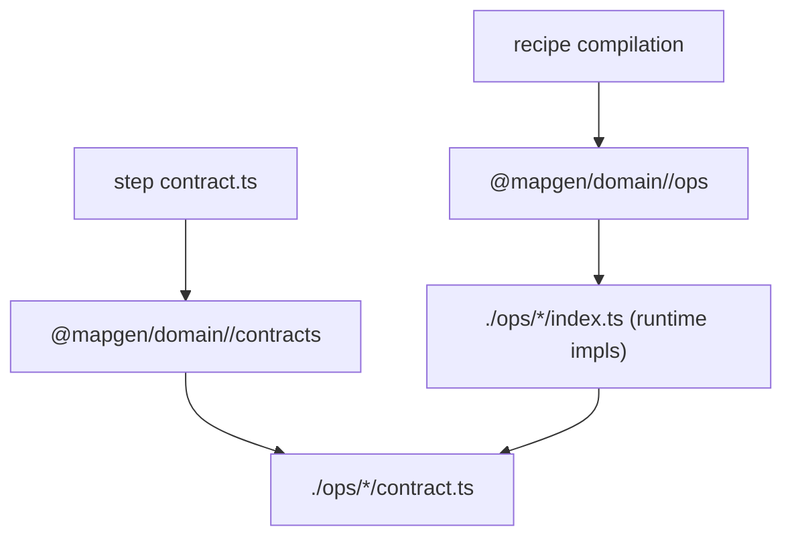

## TL;DR
- Standardize an explicit domain module layout and helper(s) so:
  - step `contract.ts` can import op contracts without pulling runtime op implementations,
  - recipe compilation can import op implementations without importing domain “barrel” exports,
  - domain modules stop duplicating op key lists across `index.ts` and `contracts.ts`,
  - the canonical public surfaces remain tiny: `domainContracts.<opKey>` and `domainOps.ops` / `domainOps.ops.bind(...)`.

## Architecture (target import graph)
The core constraint: in ESM/TS, importing a “barrel” that re-exports runtime implementations eagerly evaluates those modules. So we need **two explicit entrypoints** and a strong “allowed import edges” policy.



**Consequences**
- Step contracts must never import any module that eagerly pulls op implementations (directly or indirectly).
- Recipes/compilers must never depend on step contract entrypoints to access implementations (avoid cycles).

## Problem
- Current domain entrypoints (e.g. `@mapgen/domain/ecology`) import **all runtime op implementations** up front.
  - Step contracts often import that entrypoint to access op contracts, which incidentally loads runtime code (noise, slower typecheck, higher risk of cycles).
- Op key lists are duplicated and drift-prone:
  - `mods/mod-swooper-maps/src/domain/ecology/index.ts` lists implementations + keys.
  - `mods/mod-swooper-maps/src/domain/ecology/contracts.ts` lists contracts + keys.
  - Placement domain has the same “list keys twice” problem in a single file.
- The intended architecture already has the concept of “domain router surface” (M7-U16), but the module layout doesn’t yet support a clean contract-first import path.

## Design goals
- **Contract-first authoring**:
  - Step `contract.ts` should import *only* contracts (and TypeBox/defineStep), never runtime ops.
- **Tiny mental model**:
  - Domains expose two entrypoints: `contracts` and `ops`.
  - Steps use `contracts`; recipes use `ops`.
- **Type safety + autocomplete**:
  - `contracts.<opKey>` and `ops.ops.<opKey>` should autocomplete.
  - Compiler catches missing/extra op keys in domain registries (best-effort without codegen).
- **No new runtime responsibilities in steps**:
  - Keep the compiler/recipe boundary as the place where binding/normalization defaults are owned.

## Non-goals
- Introducing a new “SDK-level domain DSL” (`defineDomain/createDomain`) with settings/router layers.
- Automatic registry generation from the filesystem (no codegen requirement).
- Reworking op folder structure or strategy layout.

## Proposed module layout (per domain)
- `src/domain/<domain>/contracts.ts`
  - Default export: `contracts` object (key → op contract).
  - No imports from op implementations.
- `src/domain/<domain>/ops.ts`
  - Exports `ops` surface (key → op implementation) via `createDomainOpsSurface`.
  - Imports op implementations and (optionally) the `contracts` object to type-check keys.
- `src/domain/<domain>/index.ts`
  - Barrel only: re-export `contracts` plus domain public types/config.
  - Intentionally does **not** re-export `ops` (to keep `@mapgen/domain/<domain>` safe to import from step contracts if it happens, and to reduce temptation to “just import the barrel”).

### Author-facing import rules (intended)
- Step contracts: `import domainContracts from "@mapgen/domain/<domain>/contracts"`
- Recipe/stage compilation: `import * as domainOps from "@mapgen/domain/<domain>/ops"`
- Runtime step implementations: never import ops (they receive `ops` from the step runtime surface).

This aligns with the existing lint policy that forbids `@mapgen/domain/*/ops/*` deep imports in steps, while still allowing `@mapgen/domain/<domain>/contracts`.

## Proposed authoring helper(s) (MapGen core)
These helpers are small and optional; the key value is enforcing key-shape + reducing boilerplate.

### 1) `DomainOpImplementationsFor<TContracts>`
Export a type-level helper for “implementations must cover exactly the same keys as contracts”.

```ts
// @swooper/mapgen-core/authoring (new)
export type DomainOpImplementationsFor<
  TContracts extends Record<string, { id: string }>,
  TOp extends { id: string } = import("./bindings.js").DomainOpCompileAny,
> = Readonly<{ [K in keyof TContracts]: TOp }>;
```

Usage in a domain `ops.ts`:

```ts
import contracts from "./contracts.js";
import { createDomainOpsSurface, type DomainOpImplementationsFor } from "@swooper/mapgen-core/authoring";

const implementations = {
  /* ... */
} as const satisfies DomainOpImplementationsFor<typeof contracts>;

export const ops = createDomainOpsSurface(implementations);
export default ops;
```

This doesn’t fully prove `contract.id === op.id`, but it:
- eliminates “forgot to add the op to one side” errors at compile time,
- keeps runtime binding failure (`OpBindingError`) as the last line of defense.

### 2) (Optional) `createDomainModule({ contracts, implementations })`
Provide a tiny convenience wrapper for the common pattern and to centralize future checks.

```ts
export function createDomainModule<
  const TContracts extends Record<string, { id: string }>,
  const TImpls extends DomainOpImplementationsFor<TContracts>,
>(def: { contracts: TContracts; implementations: TImpls }) {
  return {
    contracts: def.contracts,
    ops: createDomainOpsSurface(def.implementations),
  } as const;
}
```

## Example (ecology)

### `@mapgen/domain/ecology/contracts.ts`
```ts
import ApplyFeaturesContract from "./ops/features-apply/contract.js";
import PlanVegetationContract from "./ops/features-plan-vegetation/contract.js";
// ...

export const contracts = {
  applyFeatures: ApplyFeaturesContract,
  planVegetation: PlanVegetationContract,
  // ...
} as const;

export default contracts;
```

### `@mapgen/domain/ecology/ops.ts`
```ts
import applyFeatures from "./ops/features-apply/index.js";
import planVegetation from "./ops/features-plan-vegetation/index.js";
// ...
import contracts from "./contracts.js";
import { createDomainOpsSurface, type DomainOpImplementationsFor } from "@swooper/mapgen-core/authoring";

const implementations = {
  applyFeatures,
  planVegetation,
  // ...
} as const satisfies DomainOpImplementationsFor<typeof contracts>;

export const ops = createDomainOpsSurface(implementations);
export default ops;
```

### Step contract usage
```ts
import { defineStep, Type } from "@swooper/mapgen-core/authoring";
import ecologyContracts from "@mapgen/domain/ecology/contracts";

export default defineStep({
  id: "features-apply",
  phase: "ecology",
  ops: { apply: ecologyContracts.applyFeatures },
  schema: Type.Object({}),
});
```

### Recipe compilation usage
```ts
import { collectCompileOps, createRecipe } from "@swooper/mapgen-core/authoring";
import * as ecologyDomain from "@mapgen/domain/ecology/ops";
import * as placementDomain from "@mapgen/domain/placement/ops";

const compileOpsById = collectCompileOps(ecologyDomain, placementDomain);
```

## Deliverables
- Add domain module layout + entrypoints for at least:
  - `@mapgen/domain/ecology`
  - `@mapgen/domain/placement`
- Add core helper type(s) to enforce “implementations cover contract keys”:
  - `DomainOpImplementationsFor<TContracts>`
  - (optional) `createDomainModule(...)`
- Migrate step contracts in `mods/mod-swooper-maps/src/recipes/**/steps/**/contract.ts` to import from `@mapgen/domain/<domain>/contracts`.
- Migrate recipe compilation to import from `@mapgen/domain/<domain>/ops` (not the barrel).
- Update lint guardrails to encode the intended import rules (preferably with narrow globs):
  - Step contract files should not import `@mapgen/domain/<domain>` (barrel) when `@mapgen/domain/<domain>/contracts` exists.

## Acceptance Criteria
- Step `contract.ts` files can access op contracts without importing runtime op implementations.
- Domain ops registry:
  - fails typecheck if an op contract key has no implementation entry (or vice versa),
  - continues to support `domain.ops.bind(...)` for tests or legacy usage.
- Recipe compilation imports only the ops surface modules and remains stable.
- Ecology/placement domain entrypoints no longer require duplicating op key lists across multiple files (single source of truth for each: contracts list, implementations list; enforced by typing).

## Testing / Verification
- `pnpm check`
- `pnpm -C mods/mod-swooper-maps check`
- `pnpm -C mods/mod-swooper-maps test`

## Alternatives considered (brief)
- Keep using `@mapgen/domain/<domain>` as the canonical import:
  - Rejected because “barrel imports” are indistinguishable from “imports contracts only” in authoring code, and ESM eagerly evaluates runtime exports.
- Re-export `ops` from `index.ts` for convenience:
  - Rejected because it reintroduces accidental runtime imports in step contracts and defeats the clarity of “contracts vs ops” entrypoints.
- Filesystem-based registry/codegen:
  - Deferred; acceptable later once the authoring surface stabilizes.

## Notes / Followups
- If we want to reduce import noise further (one import per op, not two), consider a followup to re-export each op’s contract from its `index.ts` (implementation module) so domain registry can import `{ contract }` alongside the default op implementation. This is optional and can be staged domain-by-domain.
