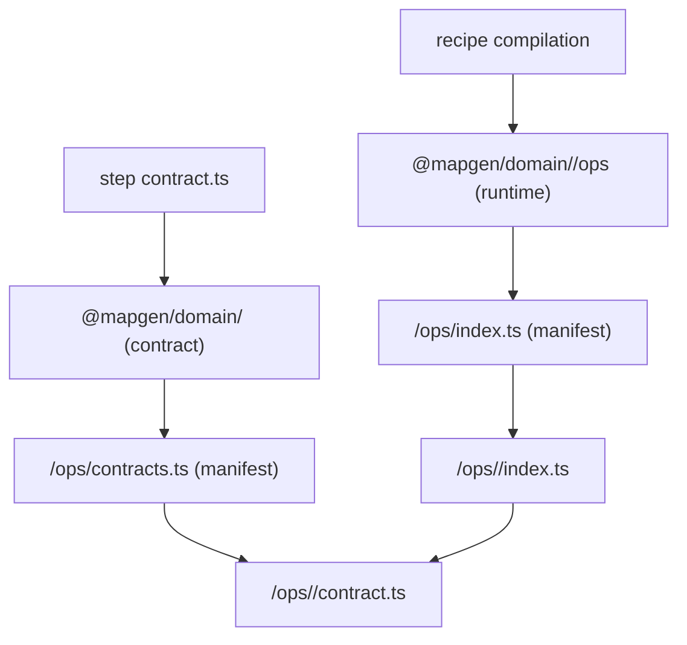

## TL;DR
- Introduce first-class domain authoring helpers aligned with `defineStep/createStep`:
  - `defineDomain(...)` produces a contract-only domain module (safe to import from step contracts).
  - `createDomain(...)` binds that contract to op implementations and exposes a single runtime entrypoint (for recipe compilation and execution).
- Refactor `@mapgen/domain/<domain>` + `@mapgen/domain/<domain>/ops` to match this mental model and to be *author-friendly*:
  - domain definition becomes a tiny, obvious file
  - consumers import from a single place
  - per-op “wiring lists” live in one domain-local manifest (no deep-import sprawl in consumers)
- No codegen; no “legacy fallback” shims.

## Context / why this exists
The current domain module pattern (U19) solved the import-boundary problem (contracts vs runtime), but did not deliver the primary DX objective:
- domain authoring is still “manual wiring” spread across multiple small files (`contracts.ts`, `ops.ts`, `index.ts`, plus per-op deep imports)
- step contracts still feel like configuration plumbing instead of contract-first composition
- domain consumers are forced into per-op import patterns when they shouldn’t be

This issue corrects that by making domain authoring a first-class `define*` / `create*` pattern and by centralizing operation lists behind obvious domain entrypoints.

## Design goals
- **10x author DX**:
  - A domain is defined in one obvious file (contract entrypoint).
  - Runtime domain entrypoint is one obvious file.
  - Consumers import from one place (contracts from `@mapgen/domain/<domain>`, runtime from `@mapgen/domain/<domain>/ops`).
- **Contract-first**:
  - Step `contract.ts` imports contract-only domain entrypoints and never touches runtime implementations.
- **Type safety and autocomplete**:
  - Domain contract ops and runtime ops are fully typed and autocomplete cleanly.
  - Missing/extra implementations are caught at typecheck time (best-effort, no codegen).
- **Keep the architecture invariant**:
  - ESM eager evaluation means we preserve the “two entrypoints” boundary.
  - No code generation / filesystem scanning required.
- **Minimize consumer import noise**:
  - No deep imports into each `ops/<op>/contract` from step contracts.
  - No manual per-op imports in recipes beyond the domain runtime entrypoint.

## Non-goals
- Filesystem-based auto-registry (no codegen).
- Reworking op folder structure or strategy layout.
- Re-exporting runtime ops from the contract entrypoint (breaks the import boundary).

## Target mental model (aligned with defineStep/createStep)
### Authoring primitives
- `defineDomain(...)` is to domains what `defineStep(...)` is to steps: contract-only, safe to import broadly.
- `createDomain(...)` is to domains what `createStep(...)` is to steps: binds contract to runtime implementations and exposes runtime surfaces.

### Import graph (pinned)


## Proposed API (mapgen-core)
This is intentionally “boring” and consistent with existing authoring primitives (`defineOp/defineStep` + `createOp/createStep`): preserve literal inference with `const` generics, and keep runtime-only work out of contract entrypoints.

### TypeScript signatures (explicit)
These signatures are the contract for the intended DX, including inference and autocomplete behavior.

```ts
import type { DomainOpCompileAny, DomainOpsSurface } from "./bindings.js";
import { createDomainOpsSurface } from "./bindings.js";
import type { StepOpsDecl } from "./step/ops.js";

/**
 * Contract-only domain “definition”.
 *
 * Important: `ops` is a registry of *op contracts* (outputs of `defineOp`), not runtime op implementations.
 * Step contracts consume these to (a) declare which ops they use and (b) auto-extend the step schema with
 * per-op config envelopes.
 */
export type DomainContract<const Id extends string, const Ops extends StepOpsDecl> = Readonly<{
  id: Id;
  ops: Ops;
}>;

export type DomainContractAny = DomainContract<string, StepOpsDecl>;

export function defineDomain<const Id extends string, const Ops extends StepOpsDecl>(
  def: DomainContract<Id, Ops>
): typeof def;

/**
 * Runtime domain module produced by binding a domain contract to runtime op implementations.
 *
 * `ops` is a `DomainOpsSurface` (router + registry), so recipe compilation can:
 * - collect compile ops via `collectCompileOps(domainModule, ...)`
 * - bind compile/runtime ops per-step via `domainModule.ops.bind(stepContract.ops)`
 */
export type DomainModule<
  const C extends DomainContractAny,
  const Implementations extends Readonly<Record<string, DomainOpCompileAny>>,
> = Readonly<{
  contract: C;
  ops: DomainOpsSurface<Implementations>;
}>;

/**
 * Minimum “structural” guarantee for domain implementation registries:
 * - same keys as the contract registry
 * - each implementation’s `id` matches the contract’s `id` (best-effort, no codegen)
 *
 * This is designed to be used with `satisfies` so we *validate* shape without widening value types.
 */
export type DomainOpImplementationsForContracts<TContracts extends Record<string, { id: string }>> =
  Readonly<{
    [K in keyof TContracts]: DomainOpCompileAny & Readonly<{ id: TContracts[K]["id"] }>;
  }>;

export function createDomain<
  const C extends DomainContractAny,
  const Implementations extends DomainOpImplementationsForContracts<C["ops"]>,
>(
  contract: C,
  implementations: Implementations
): DomainModule<C, Implementations>;

// Intended runtime implementation (shape only; exact module path TBD):
export function createDomain(contract: any, implementations: any): any {
  return {
    contract,
    ops: createDomainOpsSurface(implementations),
  } as const;
}
```

### Type ergonomics notes (inference + IntelliSense)
- Domain contract entrypoints should export a *single default value* (`defineDomain(...)`) so consumers import once and get `domain.ops.<...>` autocompletion.
- `defineDomain` uses `const` generics and returns `typeof def` so:
  - `domain.id` stays a literal
  - `domain.ops` preserves exact op keys (autocomplete)
  - each op contract retains its literal `id` and config schema type.
- `DomainOpImplementationsForContracts<...>` is intended to be used via `satisfies` in the runtime entrypoint:
  - validates “keys match” + “id matches” without widening the op value types
  - preserves op-specific types on the implementations object (useful for debugging and local authoring)
  - still relies on runtime binding checks as the final guardrail (no codegen).

### Export surface
- `packages/mapgen-core/src/authoring/index.ts` exports:
  - `defineDomain`, `createDomain`
  - any required types (`DomainContract`, `DomainModule`)

## Domain module layout (per domain)
This layout prioritizes “one obvious file” for contract definition and “one obvious file” for runtime binding, while allowing domain-local manifests to centralize operation lists.

### Contract entrypoint (safe everywhere)
`mods/mod-swooper-maps/src/domain/<domain>/index.ts`
```ts
import { defineDomain } from "@swooper/mapgen-core/authoring";
import ops from "./ops/contracts.js";

export default defineDomain({ id: "<domain>", ops } as const);
```

### Runtime entrypoint (recipes/execution)
`mods/mod-swooper-maps/src/domain/<domain>/ops.ts`
```ts
import { createDomain } from "@swooper/mapgen-core/authoring";
import domain from "./index.js";
import implementations from "./ops/index.js";

export default createDomain(domain, implementations);
```

### Domain-local manifests (the only “big lists”)
- `mods/mod-swooper-maps/src/domain/<domain>/ops/contracts.ts`
  - imports each op’s `contract.ts` and exports a single `ops` object
- `mods/mod-swooper-maps/src/domain/<domain>/ops/index.ts`
  - imports each op’s runtime implementation and exports a single `implementations` object (plus any existing named re-exports if desired)

This keeps per-op wiring in one place while letting the domain entrypoints stay tiny and consistent.

## Consumer DX (what should feel good)
### Step contracts
```ts
import { defineStep, Type } from "@swooper/mapgen-core/authoring";
import ecology from "@mapgen/domain/ecology";

export default defineStep({
  id: "features-apply",
  phase: "ecology",
  requires: [...],
  provides: [...],
  ops: { apply: ecology.ops.applyFeatures },
  schema: Type.Object({}),
});
```

### Recipe compilation
```ts
import { collectCompileOps } from "@swooper/mapgen-core/authoring";
import ecology from "@mapgen/domain/ecology/ops";
import placement from "@mapgen/domain/placement/ops";

export const compileOpsById = collectCompileOps(ecology, placement);
```

## Migration plan (no shims)
1. Mark U19 as incomplete and update its scope notes to reflect this issue as the DX completion layer.
2. Implement domain authoring API in mapgen-core:
   - `defineDomain`, `createDomain`, types, exports.
3. Refactor `@mapgen/domain/ecology` and `@mapgen/domain/placement`:
   - Replace the current domain-root `contracts.ts` + `ops.ts` pattern with:
     - domain contract entrypoint `index.ts` (default export is `defineDomain(...)`)
     - domain runtime entrypoint `ops.ts` (default export is `createDomain(...)`)
     - manifests: `ops/contracts.ts` and `ops/index.ts` exporting single objects
4. Update callsites:
   - step contracts import the domain contract entrypoint (`@mapgen/domain/<domain>`)
   - recipe compilation imports the runtime entrypoint (`@mapgen/domain/<domain>/ops`)
   - tests update to the new entrypoints as necessary
5. Update lint guardrails:
   - allow `@mapgen/domain/<domain>` in step contracts *only if* the domain entrypoint is contract-only
   - forbid importing `@mapgen/domain/<domain>/ops` from step contracts
   - forbid importing runtime op implementations from step contracts (existing rules can be narrowed/extended)

## Implementation Notes (U20 scope updates)
- Ignore the U19 status update in the migration plan; do not touch U19 docs or status.
- Perform a horizontal sweep across all domain modules (no deep domain-specific refactors).
- Update stages and steps to align with the new domain module pattern; remove legacy/stylistic leftovers.

## Implementation Decisions

### Add empty ops manifests for non-op domains
- **Context:** U20 requires all domain modules to follow the defineDomain/createDomain pattern, but several domains have no ops.
- **Options:** (A) Leave non-op domains unchanged, (B) Add empty ops manifests + domain entrypoints with default exports, (C) Restructure domains to split runtime vs contract exports.
- **Choice:** Option B.
- **Rationale:** Aligns all domains to the new pattern with minimal change and avoids deep refactors.
- **Risk:** Contract entrypoints still re-export non-op helpers, which could blur the contract/runtime boundary if misused later.

## Acceptance criteria
- Domain authoring:
  - Each domain has an obvious contract file (default export is `defineDomain(...)`).
  - Each domain has an obvious runtime file (default export is `createDomain(...)` binding).
  - Domain entrypoints remain small (no per-op deep import sprawl outside of manifests).
- Consumer DX:
  - Step contract files can declare ops via `domain.ops.<opKey>` with autocomplete and without importing runtime code.
  - Recipe compilation imports each domain’s runtime entrypoint from a single path.
- Architectural invariants:
  - Import boundary is enforced: step contracts do not (directly or indirectly) evaluate runtime implementations.
  - No legacy fallbacks/shims.
  - No codegen.
- Verification:
  - `pnpm check`
  - `pnpm lint`
  - `pnpm -C mods/mod-swooper-maps check`
  - `pnpm -C mods/mod-swooper-maps test`

## Notes / risks
- ESM cycles remain a real risk if contract manifests import domain config barrels that import op contracts; keep “domain config” dependencies pointed at leaf op contracts where necessary.
- If `ops/index.ts` remains a re-export-only barrel, `ops.ts` will still need to import per-op implementations. Prefer an `implementations` object export (consistent with step `steps/index.ts`).
