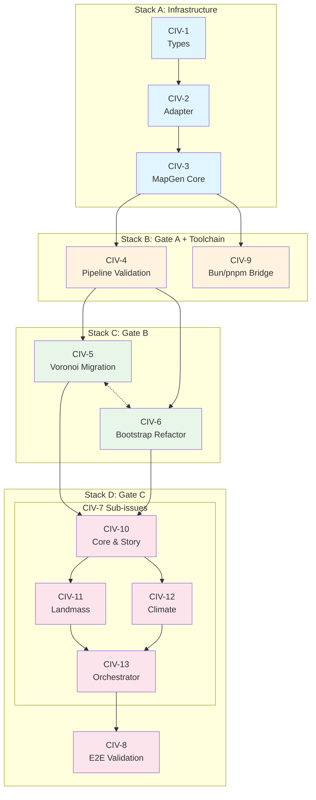

# M-TS: TypeScript Migration & Package Architecture

**Goal:** Transform swooper-maps from a monolithic JavaScript mod into a typed, testable TypeScript library architecture with clean package boundaries.

**Status:** Planned

**Owner:** Engineering

## Summary

We are transitioning the swooper-maps mod from a monolithic collection of raw JavaScript files into a structured, type-safe TypeScript library within the existing monorepo. This enables:

- **Testability**: Run complex algorithms (Voronoi, tectonics, climate) via `bun test` in milliseconds, outside the game
- **Type Safety**: Catch errors at compile time, improve IDE support
- **Modularity**: Separate domain logic (`@swooper/mapgen-core`) from mod delivery (`mods/mod-swooper-maps`)
- **Reusability**: Shared `@civ7/types` package for typing the Civ7 runtime environment

## Target Architecture

| Package | Path | Role |
|---------|------|------|
| `@civ7/types` | `packages/civ7-types` | TypeScript definitions for game globals and `/base-standard/...` modules |
| `@civ7/adapter` | `packages/civ7-adapter` | Single entry point for `/base-standard/...` imports; tests mock this |
| `@swooper/mapgen-core` | `packages/mapgen-core` | Pure TS domain library: Orchestrator, Tectonics, Climate. No side effects on import. |
| Swooper Mod | `mods/mod-swooper-maps` | Thin shell: configure core, bundle via tsup, deploy to game |

## Acceptance Criteria

- [ ] `packages/civ7-types` compiles and allows `import ... from '/base-standard/...'` without TS errors
- [ ] `packages/mapgen-core` builds as valid ESM with `bun test` passing
- [ ] `mods/mod-swooper-maps/mod/maps/swooper-desert-mountains.js` generated with `/base-standard/...` imports preserved as external
- [ ] Game loads the mod without "Module Not Found" errors
- [ ] Voronoi/plate algorithms run in Bun tests <100ms
- [ ] `/base-standard/...` imports appear only in adapter package (grep check)

## Issues / Deliverables

### Foundation (Gate A Prerequisites)

- [ ] [CIV-1: Scaffold Type Foundation](../issues/CIV-1-scaffold-type-foundation.md) — Create `@civ7/types` package
- [ ] [CIV-2: Create Centralized Adapter](../issues/CIV-2-create-adapter-package.md) — Create `@civ7/adapter` package
- [ ] [CIV-3: Initialize MapGen Core](../issues/CIV-3-initialize-mapgen-core.md) — Create `@swooper/mapgen-core` package

### Pipeline Validation (Gate A)

- [ ] [CIV-4: Validate Build Pipeline](../issues/CIV-4-validate-build-pipeline.md) — Prove tsup produces valid artifact that game loads

### Testability (Gate B)

- [ ] [CIV-5: Migrate World/Voronoi Logic](../issues/CIV-5-migrate-voronoi-world-logic.md) — Port `world/*.js` to TypeScript with tests
- [ ] [CIV-6: Refactor Bootstrap to Lazy Providers](../issues/CIV-6-refactor-bootstrap-lazy-providers.md) — Fix import-time crashes for testing

### Full Migration (Gate C)

- [ ] [CIV-7: Migrate Orchestrator & Layers](../issues/CIV-7-migrate-orchestrator-layers.md) — Port remaining logic to TypeScript (parent issue)
  - [ ] [CIV-10: Core Utils & Story](../issues/CIV-10-core-utils-story.md)
  - [ ] [CIV-11: Landmass & Terrain](../issues/CIV-11-landmass-terrain.md)
  - [ ] [CIV-12: Climate & Biomes](../issues/CIV-12-climate-biomes.md)
  - [ ] [CIV-13: Placement & Orchestrator](../issues/CIV-13-placement-orchestrator.md)
- [ ] [CIV-8: Validate End-to-End](../issues/CIV-8-validate-end-to-end.md) — Feature parity with JS version

### Toolchain (Gate D Contingency)

- [ ] [CIV-9: Bun/pnpm Bridge Scripts](../issues/CIV-9-bun-pnpm-bridge.md) — Bridge scripts and fallback procedure

## Sequencing & Parallelization Plan

**Stacks Overview**

- **Stack A (Infrastructure)**: Types → Adapter → MapGen Core scaffold (sequential)
- **Stack B (Gate A Validation)**: Depends on Stack A; minimal entry point proves pipeline works
- **Stack C (Logic Migration)**: Voronoi + Bootstrap refactor (can parallelize after Stack A)
- **Stack D (Full Migration)**: Orchestrator + Layers (depends on C)

**Notes**
- Gate A proves the pipeline before heavy migration work begins
- Gate B proves testability before committing to full migration
- If Bun + pnpm friction occurs (Gate D contingency), fall back to pnpm/vitest/tsup

## Key Technical Decisions

### Decision A: Direct Game Path Imports

Use exact file paths the game expects (`/base-standard/maps/map-utilities.js`) rather than creating wrapper abstractions. `tsup` marks these as external, passing them through untouched.

### Decision A.1: Centralized Adapter Pattern

Single adapter module (`@civ7/adapter`) is the only place allowed to import `/base-standard/...`. Core/tests consume the adapter interface. Enables mocking for tests.

### Decision B: Lazy Bootstrapping with Reset

Refactor `tunables.js`, `resolved.js`, `runtime.js` to use memoized provider pattern:
- No logic execution at import time
- Export `getX()` functions that cache results
- Export `resetX()` functions for test isolation

### Decision C: Adapter Boundary for Civ7 Engine

Core stays "pure TS"; adapter owns all engine/Civ7 imports. Tests mock the adapter. Bundling keeps `/base-standard/...` external and stable.

## Risks

| Risk | Mitigation |
|------|------------|
| Type coverage incomplete | Start with concrete inventory (72+ GameplayMap methods, 15+ GameInfo tables already cataloged) |
| Import-time crashes in tests | Gate B specifically addresses this via lazy providers |
| Bun + pnpm coexistence issues | Gate D contingency: fall back to pnpm/vitest/tsup |
| Bundle output differs from expected | Gate A validates with minimal artifact before heavy migration |

## Notes

- Reference plan: `docs/projects/engine-refactor-v1/resources/migrate-to-ts-plan.md`
- Existing adapter in `mod/maps/core/adapters.js` can be promoted to shared package
- Story system (`story/*.js`) migration not explicitly scoped but follows same patterns
- `mod/maps/base-standard/` contains 28 bundled game files — plan uses game runtime paths
