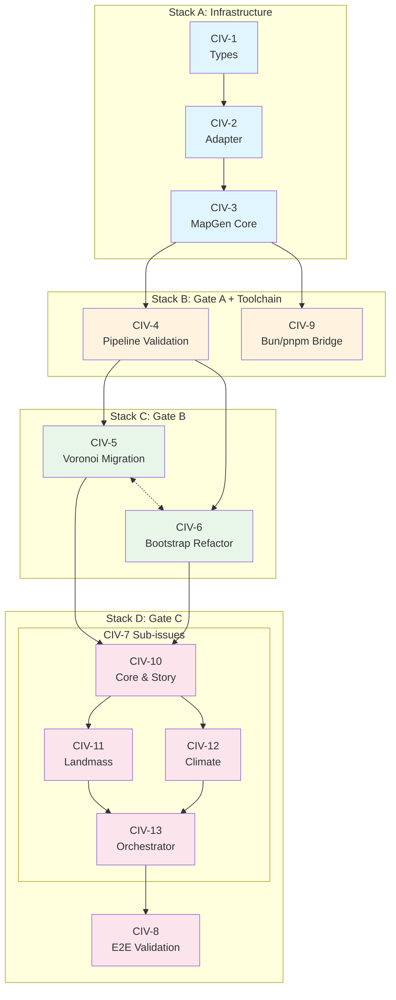
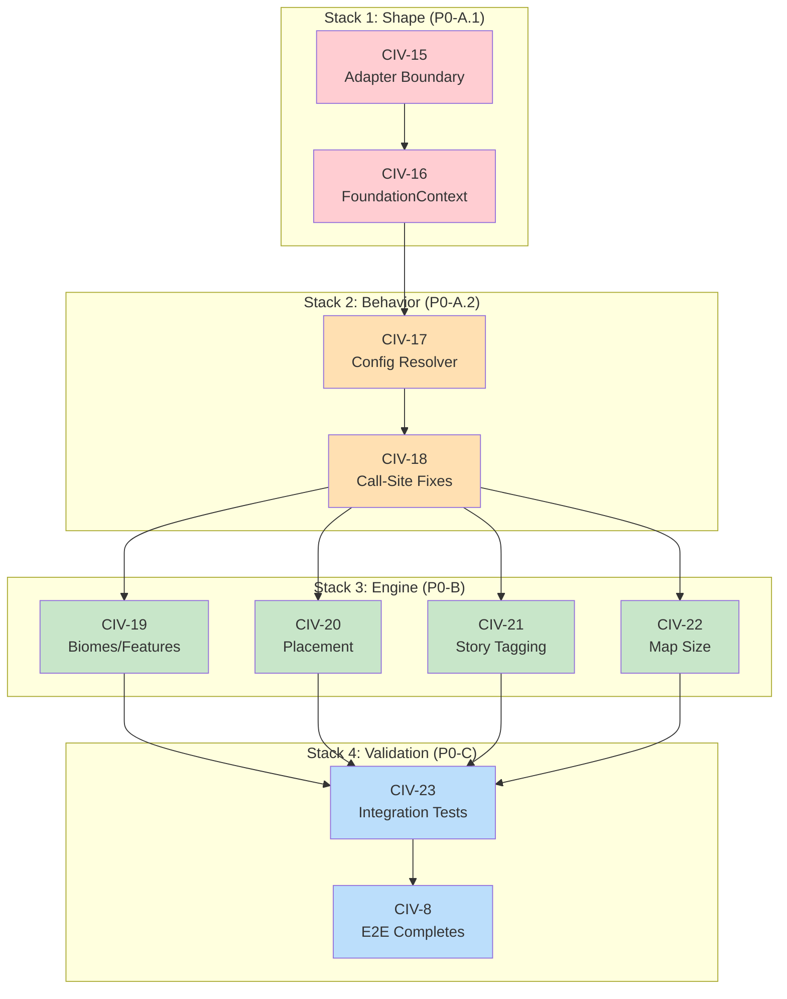

# M1: TypeScript Migration & Package Architecture

**Milestone ID:** `M1-TS-typescript-migration`  
**Goal:** Transform swooper-maps from a monolithic JavaScript mod into a typed, testable TypeScript library architecture with clean package boundaries.

**Status:** Complete

**Owner:** Engineering

## Status & Carry-Over

M1 is considered complete for the TypeScript migration and initial remediation:

- Core packages (`@civ7/types`, `@civ7/adapter`, `@swooper/mapgen-core`) and the Swooper mod entry are migrated to TypeScript and building successfully.
- P0 remediation for the "Null Map Script" (adapter boundary, FoundationContext consumption, config-to-manifest resolver, call-site fixes, map-size awareness, and dev diagnostics) has landed via CIV-15-CIV-20, CIV-22, and CIV-24.
- M1 issues are closed; remaining work is intentionally deferred:
  - Story porting (CIV-21) is split: minimal parity lands in M2, remaining system lands in M3.
  - Integration & behavior tests (CIV-23) now live in M4.
  - Further JS-to-TS parity clean-up will be driven from the parity docs and later milestones (see below).

Future work on engine shape, story overlays, and tests should be scoped under M2-M4 rather than re-opening this milestone.

## Summary

We are transitioning the swooper-maps mod from a monolithic collection of raw JavaScript files into a structured, type-safe TypeScript library within the existing monorepo. This enables:

- **Testability**: Run complex algorithms (Voronoi, tectonics, climate) via `bun test` in milliseconds, outside the game
- **Type Safety**: Catch errors at compile time, improve IDE support
- **Modularity**: Separate domain logic (`@swooper/mapgen-core`) from mod delivery (`mods/mod-swooper-maps`)
- **Reusability**: Shared `@civ7/types` package for typing the Civ7 runtime environment

## Target Architecture

| Package | Path | Role |
|---------|------|------|
| `@civ7/types` | `packages/civ7-types` | TypeScript definitions for game globals and `/base-standard/...` modules |
| `@civ7/adapter` | `packages/civ7-adapter` | Single entry point for `/base-standard/...` imports; tests mock this |
| `@swooper/mapgen-core` | `packages/mapgen-core` | Pure TS domain library: Orchestrator, Tectonics, Climate. No side effects on import. |
| Swooper Mod | `mods/mod-swooper-maps` | Thin shell: configure core, bundle via tsup, deploy to game |

## Acceptance Criteria

- [ ] `packages/civ7-types` compiles and allows `import ... from '/base-standard/...'` without TS errors
- [ ] `packages/mapgen-core` builds as valid ESM with `bun test` passing
- [ ] `mods/mod-swooper-maps/mod/maps/swooper-desert-mountains.js` generated with `/base-standard/...` imports preserved as external
- [ ] Game loads the mod without "Module Not Found" errors
- [ ] Voronoi/plate algorithms run in Bun tests <100ms
- [ ] `/base-standard/...` imports appear only in adapter package (grep check)

## Issues / Deliverables

### Foundation (Gate A Prerequisites)

- [ ] [CIV-1: Scaffold Type Foundation](../issues/CIV-1-scaffold-type-foundation.md) — Create `@civ7/types` package
- [ ] [CIV-2: Create Centralized Adapter](../issues/CIV-2-create-adapter-package.md) — Create `@civ7/adapter` package
- [ ] [CIV-3: Initialize MapGen Core](../issues/CIV-3-initialize-mapgen-core.md) — Create `@swooper/mapgen-core` package

### Pipeline Validation (Gate A)

- [ ] [CIV-4: Validate Build Pipeline](../issues/CIV-4-validate-build-pipeline.md) — Prove tsup produces valid artifact that game loads

### Testability (Gate B)

- [ ] [CIV-5: Migrate World/Voronoi Logic](../issues/CIV-5-migrate-voronoi-world-logic.md) — Port `world/*.js` to TypeScript with tests
- [ ] [CIV-6: Refactor Bootstrap to Lazy Providers](../issues/CIV-6-refactor-bootstrap-lazy-providers.md) — Fix import-time crashes for testing

### Full Migration (Gate C)

- [ ] [CIV-7: Migrate Orchestrator & Layers](../issues/CIV-7-migrate-orchestrator-layers.md) — Port remaining logic to TypeScript (parent issue)
  - [ ] [CIV-10: Core Utils & Story](../issues/CIV-10-core-utils-story.md)
  - [ ] [CIV-11: Landmass & Terrain](../issues/CIV-11-landmass-terrain.md)
  - [ ] [CIV-12: Climate & Biomes](../issues/CIV-12-climate-biomes.md)
  - [ ] [CIV-13: Placement & Orchestrator](../issues/CIV-13-placement-orchestrator.md)
- [ ] [CIV-8: Validate End-to-End](../issues/CIV-8-validate-end-to-end.md) — Feature parity with JS version

### Toolchain (Gate D Contingency)

- [ ] [CIV-9: Bun/pnpm Bridge Scripts](../issues/CIV-9-bun-pnpm-bridge.md) — Bridge scripts and fallback procedure

## Sequencing & Parallelization Plan

**Stacks Overview**

- **Stack A (Infrastructure)**: Types → Adapter → MapGen Core scaffold (sequential)
- **Stack B (Gate A Validation)**: Depends on Stack A; minimal entry point proves pipeline works
- **Stack C (Logic Migration)**: Voronoi + Bootstrap refactor (can parallelize after Stack A)
- **Stack D (Full Migration)**: Orchestrator + Layers (depends on C)

**Notes**
- Gate A proves the pipeline before heavy migration work begins
- Gate B proves testability before committing to full migration
- If Bun + pnpm friction occurs (Gate D contingency), fall back to pnpm/vitest/tsup

## Key Technical Decisions

### Decision A: Direct Game Path Imports

Use exact file paths the game expects (`/base-standard/maps/map-utilities.js`) rather than creating wrapper abstractions. `tsup` marks these as external, passing them through untouched.

### Decision A.1: Centralized Adapter Pattern

Single adapter module (`@civ7/adapter`) is the only place allowed to import `/base-standard/...`. Core/tests consume the adapter interface. Enables mocking for tests.

### Decision B: Lazy Bootstrapping with Reset

Refactor `tunables.js`, `resolved.js`, `runtime.js` to use memoized provider pattern:
- No logic execution at import time
- Export `getX()` functions that cache results
- Export `resetX()` functions for test isolation

### Decision C: Adapter Boundary for Civ7 Engine

Core stays "pure TS"; adapter owns all engine/Civ7 imports. Tests mock the adapter. Bundling keeps `/base-standard/...` external and stable.

## Risks

| Risk | Mitigation |
|------|------------|
| Type coverage incomplete | Start with concrete inventory (72+ GameplayMap methods, 15+ GameInfo tables already cataloged) |
| Import-time crashes in tests | Gate B specifically addresses this via lazy providers |
| Bun + pnpm coexistence issues | Gate D contingency: fall back to pnpm/vitest/tsup |
| Bundle output differs from expected | Gate A validates with minimal artifact before heavy migration |

## Notes

- Reference plan: `docs/projects/engine-refactor-v1/resources/migrate-to-ts-plan.md`
- Existing adapter in `mod/maps/core/adapters.js` can be promoted to shared package
- Story system (`story/*.js`) migration not explicitly scoped but follows same patterns
- `mod/maps/base-standard/` contains 28 bundled game files — plan uses game runtime paths

---

## P0 Remediation (Post-Migration Fixes)

> **Status:** Added after discovering the migrated TypeScript pipeline compiles successfully but produces no runtime output ("Null Map Script"). This section tracks the structured fix required to complete CIV-8 validation.

### Why Remediation Was Needed

The TypeScript migration (CIV-1 through CIV-13) passed all compilation gates but failed at runtime:

1. **Config Air Gap** — `bootstrap()` stores `stageConfig`, but `stageEnabled()` reads `stageManifest` (always empty)
2. **Adapter Anti-Pattern** — Dynamic require fails silently, falls back to globals, `@civ7/adapter` never used
3. **Story Void** — `story/tagging.ts` never ported, all story-aware code paths are no-ops
4. **FoundationContext Bypass** — Layers import `WorldModel` singleton instead of reading `ctx.foundation`

**Root cause:** Gate criteria focused on build artifacts, not runtime behavior. The migration faithfully ported broken patterns from the original JS codebase.

### Remediation Issues

- [ ] [CIV-14: TypeScript Migration Remediation](../issues/CIV-14-typescript-migration-remediation.md) — Parent issue

#### Stack 1: Shape Fixes (P0-A.1)
- [ ] [CIV-15: Fix Adapter Boundary & Orchestration Wiring](../issues/CIV-15-fix-adapter-boundary.md)
- [ ] [CIV-16: Migrate Layers to FoundationContext Consumption](../issues/CIV-16-foundationcontext-consumption.md)

#### Stack 2: Enable Behavior (P0-A.2)
- [ ] [CIV-17: Implement Config→Manifest Resolver](../issues/CIV-17-config-manifest-resolver.md)
- [ ] [CIV-18: Fix Biomes & Climate Call-Sites](../issues/CIV-18-callsite-fixes.md)

#### Stack 3: Wire to Engine (P0-B)
- [ ] [CIV-19: Biomes & Features Adapter Integration](../issues/CIV-19-biomes-features-adapter.md)
- [ ] [CIV-20: Placement Adapter Integration](../issues/CIV-20-placement-adapter.md)
- [ ] [CIV-21: Reactivate Minimal Story Tagging](../issues/CIV-21-story-tagging.md)
- [ ] [CIV-22: Restore Map-Size Awareness](../issues/CIV-22-map-size-awareness.md)

#### Stack 4: Validation (P0-C)
- [ ] [CIV-23: Integration & Behavior Tests](../issues/CIV-23-integration-tests.md)
- Completes: [CIV-8: Validate End-to-End](../issues/CIV-8-validate-end-to-end.md)

#### Cross-Cutting: Tooling
- [ ] [CIV-24: Restore Dev Diagnostics & Stage Logging](../issues/CIV-24-dev-diagnostics.md)

### Remediation Stack Dependencies

## P1: JS → TS Parity Matrix (Second-Pass Remediation)

> Status: Not yet scoped (pending decisions)

The P0 remediation stack above focuses on fixing the "Null Map Script" behavior, adapter boundary, and foundational wiring. In parallel, we now have a dedicated JS → TS parity matrix that inventories module-by-module status and divergences versus the original JS mod.

- Reference: [M-TS-parity-matrix.md](../resources/M-TS-parity-matrix.md) — canonical list of `Parity`, `Missing`, and `Detraction / Open` rows across story, bootstrap, world, and layers.
- Goal: Run a **second-pass remediation** that:
  - Classifies each `Detraction / Open` row as either an intentionally accepted evolution (and documents it) or required follow-up work.
  - Turns each `Missing` row into concrete issues (e.g., story tagging & corridors, presets/base config ownership, adapter method parity, dev logging surfaces).
  - Feeds any resulting work back into this milestone and the CIV-14+ remediation issues.
- Scope: This second pass is **not yet broken down into CIV issues or gate stacks**; we first need to make decisions on which divergences we want to bless vs. close. Until then, the parity matrix remains the authoritative checklist of remaining migration work.

### Lessons Learned

1. **Gate criteria must include behavioral verification** — "Builds successfully" ≠ "Works correctly"
2. **Blind ports preserve blind spots** — The original JS had subtle architectural issues the migration faithfully copied
3. **Follow-up work:** Add adapter boundary lint to CI; add minimal MockAdapter smoke test to gate criteria

### Reference Documents

- [M-TS-typescript-migration-review.md](../reviews/M-TS-typescript-migration-review.md) — Detailed technical review
- [M-TS-typescript-migration-canvas.md](../reviews/M-TS-typescript-migration-canvas.md) — Concern canvas
- [M-TS-typescript-migration-remediation.md](../reviews/M-TS-typescript-migration-remediation.md) — Remediation analysis
- [M-TS-typescript-migration-prioritization.md](../reviews/M-TS-typescript-migration-prioritization.md) — Prioritized action plan
 - [M-TS-parity-matrix.md](../resources/M-TS-parity-matrix.md) — JS → TS parity status and divergences
