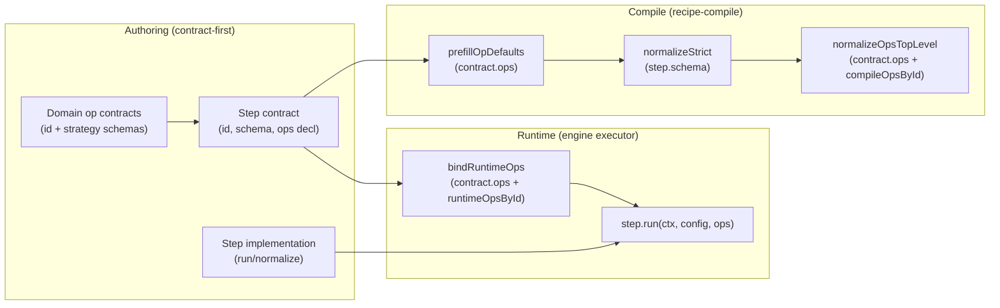
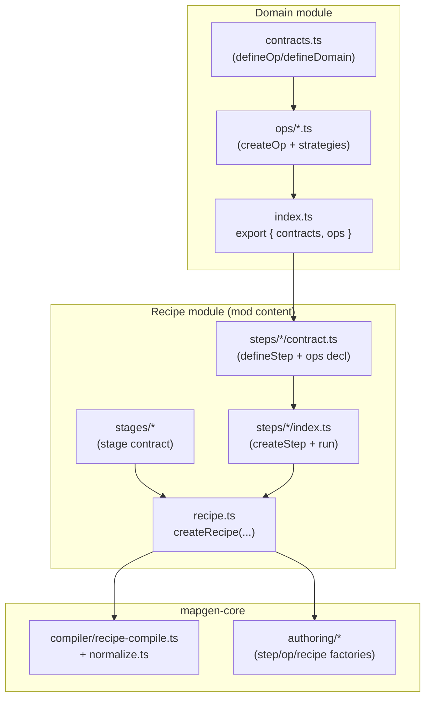

## Purpose

Define a cohesive, contract-first authoring mental model that matches the codebase as implemented today, and map the concrete changes required to remove the current step-level noise (especially in ecology) without introducing new coupling.

This document is a **remediation proposal**: it is meant to become the basis of a plan and implementation slices.

## Current reality (what shipped)

### What is implemented correctly (and should stay)

- **Domains export two distinct surfaces**:
  - `domain.contracts`: op contracts (pure schemas + ids + strategy schemas).
  - `domain.ops`: op implementations (compile + runtime registries) plus a router API `domain.ops.bind(...)`.
- **Compiler already understands step op usage**:
  - `step.contract.ops?: StepOpsDecl` exists in the compiler’s types.
  - The compiler can:
    - prefill op envelope defaults (`prefillOpDefaults`)
    - call op-level normalization (`normalizeOpsTopLevel`)
  - This behavior is tested.
- **Guardrails exist** to prevent deep imports into op implementation internals from non-domain layers (eslint rules).

### Where the architecture breaks down (DX gap)

The compiler expects a richer step contract shape than the authoring factory can produce:

- Compiler expects: `StepContractAny = { id; schema; ops?: StepOpsDecl }`
- Authoring provides: `StepContract = { id; phase; requires; provides; schema }` (no `ops`)

That mismatch forces step authors into manual, redundant patterns:

- Step contracts embed op envelope schemas via `domain.ops.<op>.config` instead of “declare the op contract and let the system own envelopes”.
- Step implementations:
  - re-declare `opContracts`
  - call `domain.ops.bind(opContracts)`
  - manually call `compile.<op>.normalize(...)` inside `step.normalize(...)` even though the compiler has a canonical op-normalization pass.

Ecology steps like `mods/mod-swooper-maps/src/recipes/standard/stages/ecology/steps/features-plan/index.ts` are noisy for exactly this reason.

## Architecture (target state)

### Core principle

**Contracts declare intent; compilers and factories perform wiring.**

In practice:

- A step contract declares the operations it uses once (by op contract reference).
- The compiler:
  - owns envelope defaults and op normalization for those ops
  - validates/binds op ids against the recipe’s available op registries
- The runtime step implementation:
  - receives the bound ops as a typed parameter (no re-binding, no re-importing contracts)
  - focuses on orchestration + algorithm glue only

### Architecture diagram (compile vs runtime)



Key boundary: **the engine stays domain-agnostic**. The only thing threaded through is an `opsById` registry (data), not a domain object (behavioral coupling).

### Module shape diagram (where the wiring lives)



The “wiring gravity” should live in core authoring/compiler helpers, not in individual step files.

## Design goals, decisions, and rationale

1. **Single declaration** of step-used ops (in the contract).
2. **Zero “schema import from runtime op surface”** in step contracts.
3. **Zero local `domain.ops.bind(...)` boilerplate** in step implementations.
4. **End-to-end type safety + completion**:
   - step config keys are typed
   - `ops.<key>.run(...)` is typed
5. **Compiler-first correctness**:
   - op defaults and op.normalize happen in one canonical pass
6. **No new coupling**:
   - runtime binding should not require importing domains into the engine or recipe compiler

## Alternatives (bobbing + weaving → converge)

### A) Keep the current pattern, but “make it prettier”

- Add helpers to reduce boilerplate in steps, but keep local `opContracts` + `domain.ops.bind(...)`.

Why this fails:
- It preserves duplicate declarations (schema keys + binding keys).
- It keeps op normalization split across step.normalize vs compiler.
- It does not achieve contract-first wiring (it’s still “impl-first”).

### B) Inject ops into `ExtendedMapContext` (e.g. `context.ops`)

Why it’s tempting:
- No signature changes.
- Easy to access from anywhere.

Why it’s a trap:
- Pollutes global context with step-local concerns.
- Encourages implicit dependencies and collisions across steps/domains.
- Makes testing harder (context becomes a service locator).

### C) Let steps call ops by id (`ops.run("ecology.planVegetation", ...)`)

Why it’s tempting:
- No binding needed.
- Registry-based.

Why it’s insufficient:
- Loses ergonomic key-level completion unless wrapped with additional generators.
- Harder to enforce “only declared ops are callable”.

### D) Bind declared ops once at recipe creation time and pass them into step handlers (**chosen**)

This matches the best patterns in contract-first ecosystems (e.g. oRPC / ts-rest):

- A contract subtree becomes a typed implementer/consumer surface.
- A router binds contracts to runtime behavior once.
- Handlers receive a structured context object, not raw wiring responsibilities.

It also matches our existing architecture:
- We already have op registries and a compiler stage that can normalize op envelopes.
- We only need to make the contract shape expressible and thread the runtime registry.

### Key decisions (explicit)

1. **`contract.ops` is the single source of truth** for:
   - which ops get default envelopes
   - which ops get op.normalize
   - which ops are callable in step runtime
2. **The “op key” equals the “config key”** for the op envelope (top-level by default).
   - If a step wants `vegetation` in config, the op is declared under `ops.vegetation`.
   - This keeps the mental model simple and makes binding automatic.
3. **Schema derivation produces a single `Type.Object(...)`** (not an intersection) to preserve strict unknown-key enforcement.
4. **The engine remains unaware of domains**:
   - mapgen-core binds to `runtimeOpsById` during recipe creation
   - bound ops are passed to step handlers as data

## High-level architecture changes (concrete)

### 1) Step contract: add `ops` and make schema derivable

**Step contracts should be able to express op usage declaratively.**

Add:

- `ops?: StepOpsDecl` to the authoring `StepContract` type (shared with compiler).

Then provide a contract-first schema builder that removes the need to import `domain.ops.*.config`:

- `buildStepSchema({ props, ops })` (or equivalent), which:
  - builds op envelope schemas from op contracts (via `buildOpEnvelopeSchema(contract.id, contract.strategies)`)
  - merges them into one `Type.Object(...)` with `additionalProperties: false`
  - enforces no key collisions between `props` and `ops`

This is the minimum needed to make contracts simple and compiler-aligned.

### 2) Step implementation: accept a typed `ops` parameter

Extend the step implementation signature to:

- `run(context, config, ops)`

Where `ops` is bound based on `contract.ops` and a recipe-provided `runtimeOpsById` registry.

This can be implemented without touching the engine by wrapping the engine-facing `run` function inside `createRecipe(...)` (see Implementation Plan).

### 3) Recipe definition: provide runtime ops registry alongside compile ops

Today, recipes provide `compileOpsById` to the compiler.

To support runtime binding centrally, recipes should also provide:

- `runtimeOpsById` (constructed from the same domain ops surfaces)

This keeps binding purely data-driven and avoids importing domain modules into core runtime layers.

### 4) Normalize flow: make the compiler the only place that calls `op.normalize`

With `contract.ops` expressible, step `normalize(...)` should almost never call `compile.<op>.normalize(...)`.

Rule of thumb:
- Use `step.normalize(...)` only for *shape-preserving* transforms that cannot be expressed via schemas/defaults (e.g. env/knob-derived computed fields).
- Let `normalizeOpsTopLevel(...)` perform op.normalize for declared ops.

### End-state authoring (ecology example)

These are illustrative shapes; the specific helper names can be adjusted during implementation.

#### Step contract

```ts
import { defineStep, Type, buildStepSchema } from "@swooper/mapgen-core/authoring";
import * as ecology from "@mapgen/domain/ecology";
import { M3_DEPENDENCY_TAGS } from "../../../../tags.js";

const ops = {
  vegetation: ecology.contracts.planVegetation,
  wetlands: ecology.contracts.planWetlands,
  reefs: ecology.contracts.planReefs,
  ice: ecology.contracts.planIce,
} as const;

export default defineStep({
  id: "features-plan",
  phase: "ecology",
  requires: [
    M3_DEPENDENCY_TAGS.artifact.biomeClassificationV1,
    M3_DEPENDENCY_TAGS.artifact.heightfield,
    M3_DEPENDENCY_TAGS.artifact.pedologyV1,
  ],
  provides: [M3_DEPENDENCY_TAGS.artifact.featureIntentsV1],
  ops,
  schema: buildStepSchema({ props: Type.Object({}), ops }),
});
```

#### Step implementation

```ts
import { createStep } from "@swooper/mapgen-core/authoring";
import contract from "./contract.js";

export default createStep(contract, {
  run: (context, config, ops) => {
    // ops.vegetation.run(..., config.vegetation)
    // ops.wetlands.run(..., config.wetlands)
  },
});
```

## Implementation plan (sliced, low-risk)

- Declares ops once.
- Derives schema from op contracts.

Resulting contract file imports become: `Type/defineStep` + `domain.contracts` + tags.

### Step implementation (no local binding)

- Imports `createStep` + the step contract.
- Uses `ops.<key>.run(...)` passed into `run(...)`.

This removes:
- `opContracts` objects
- `domain.ops.bind(...)` calls
- manual `compile.<op>.normalize(...)` calls

## High-level implementation plan (sliced, low-risk)

1. **Unify types**
   - Move/define a single `StepOpsDecl` type shared by authoring + compiler.
   - Add `ops?: StepOpsDecl` to `packages/mapgen-core/src/authoring/step/contract.ts`.

2. **Schema derivation helper**
   - Add `buildStepSchema(...)` in authoring (near step contract utilities).
   - Ensure it produces a single `Type.Object(...)` to preserve strict unknown-key enforcement.

3. **Authoring API enhancement**
   - Update `defineStep(...)` to accept `ops` (and optionally a `props`/`schema` input style that encourages contract-first usage).
   - Preserve backwards compatibility for existing explicit schemas.

4. **Runtime ops registry**
   - Add `collectRuntimeOps(...)` next to `collectCompileOps(...)` in `packages/mapgen-core/src/authoring/bindings.ts`.
   - Extend `RecipeDefinition` to carry `runtimeOpsById` (or introduce a helper that returns both registries).

5. **Thread ops into step handlers**
   - Extend the step module type so step authors can write `run(context, config, ops)`.
   - In `createRecipe(...)`, wrap each authored step’s `run`:
     - bind `ops` once per step occurrence (using `bindRuntimeOps(step.contract.ops, runtimeOpsById)`)
     - call the authored handler with the bound `ops`
   - Fail fast if a declared op id is missing from `runtimeOpsById` (mirrors compiler’s missing-op behavior).

6. **Migrate ecology steps (proof of end-state)**
   - Convert ecology step contracts to declare `ops` and use derived schemas.
   - Remove local binding + manual op.normalize from step implementations.
   - This is the “next step: ecology domain refactor” on-ramp.

7. **Enforce the new contract-first style**
   - Add an eslint rule (or extend existing ones) to forbid `domain.ops.*.config` usage inside step contract files (except within domain code).
   - Add examples + a short “golden path” snippet in the recipe-compile authoring patterns doc.

### Implementation impact map (where code changes land)

- `packages/mapgen-core/src/authoring/step/contract.ts`
  - Extend `StepContract` to include `ops?: StepOpsDecl`
  - Extend `defineStep(...)` input to accept `ops`
- `packages/mapgen-core/src/compiler/recipe-compile.ts`
  - (Ideally) import the authoring `StepContract` type (or share a common `StepContractShape`) so compiler/authoring cannot drift again
- `packages/mapgen-core/src/authoring/types.ts`
  - Extend the step `run` signature to allow `run(context, config, ops)`
  - Keep existing steps valid (handlers may ignore the extra param)
- `packages/mapgen-core/src/authoring/op/envelope.ts`
  - Reuse `buildOpEnvelopeSchema(...)` as the single envelope schema builder
- `packages/mapgen-core/src/authoring/bindings.ts`
  - Add `collectRuntimeOps(...)` (parallel to `collectCompileOps(...)`)
  - Consider a single `collectOps(...) => { compileOpsById, runtimeOpsById }` helper to reduce accidental partial wiring
- `packages/mapgen-core/src/authoring/recipe.ts`
  - Extend `RecipeDefinition` usage so `createRecipe(...)` can access `runtimeOpsById`
  - Wrap step `run` to supply bound ops based on `contract.ops`

### Migration strategy (minimize churn)

1. Land core type + plumbing changes (ops on contracts, runtime registry threading, ops injection).
2. Add schema derivation helper (can exist alongside legacy explicit schemas).
3. Convert one ecology step end-to-end (e.g. `features-plan`) as the golden path.
4. Convert remaining ecology steps.
5. Tighten lint enforcement once most callsites are migrated.

### Validation strategy

- Unit tests (core):
  - Extend compiler tests to validate:
    - default envelopes are prefilled from `contract.ops` even when step schema requires the keys
    - op.normalize ordering relative to step.normalize remains correct
  - Add authoring/recipe tests validating:
    - a step with `contract.ops` receives correctly bound runtime ops in `run(...)`
    - missing runtime op ids fail fast at recipe construction time
- Migration tests (mod):
  - Update/extend existing ecology tests to ensure behavior is unchanged after removing local binding + manual op.normalize.

## External DX references (what we’re borrowing conceptually)

- **oRPC**: `implement(contract)` produces a typed surface where handlers are attached to contract nodes; the contract drives runtime enforcement.
- **ts-rest**: `router(contractSubtree, implMap)` binds an implementation map to a contract subtree and provides handlers a structured context object.

Our analogue:
- contract nodes = op contracts referenced by `step.contract.ops`
- binding = `bindRuntimeOps(opsDecl, runtimeOpsById)` done centrally
- handler context = a typed `ops` parameter passed to `step.run(...)`

## Notes on “why did we end up manually importing op contracts into schemas?”

Given the current codebase, the most plausible explanation is simply an incomplete convergence:

- Compiler-first op-defaulting/op-normalize landed (and is correct),
- domain router binding landed (and is correct),
- but the step authoring contract factory never gained the missing `ops` field + schema derivation helper.

So step authors reached for the only practical available building blocks: `domain.ops.<op>.config` and local `domain.ops.bind(...)`.

## Readiness checklist for the upcoming ecology refactor

- [ ] Step contracts can declare `ops` (no runtime schema imports).
- [ ] Recipe provides both compile + runtime op registries.
- [ ] Steps receive bound ops in `run(...)` with full types.
- [ ] Compiler owns op defaults + op.normalize for declared ops.
- [ ] A “golden path” example exists in the recipe-compile spec docs.
