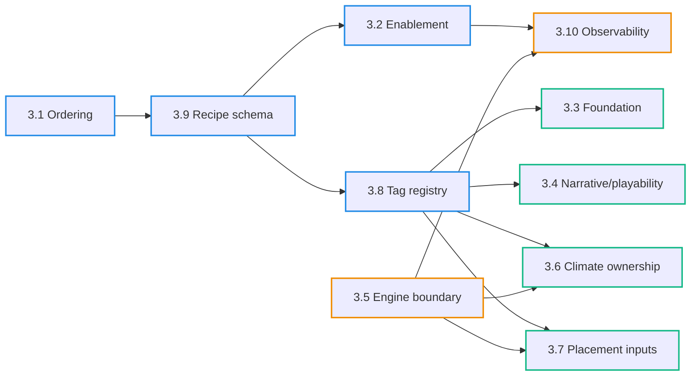

# SPEC: Target Architecture Draft (Canonical)

> ~~Agent disclaimer (WIP):~~
>
> ~~- We have not yet added the deferrals into this SPEC / flow.~~
> ~~- We want to add deferrals specifically to avoid agents “finishing” this prematurely.~~
> ~~- Agents should make sure to implement/handle deferrals and not treat this as a completed end-to-end architecture yet.~~
> ~~- We have not yet “loaded the screen” in that sense — this deferral behavior is still missing.~~
>
> **Update (2025-12-21, M4 planning):** Deferrals are tracked in `deferrals.md`; this SPEC is canonical for decisions, and the WIP disclaimer is superseded.

## 0. Purpose

Capture the canonical target architecture for MapGen. This document has two
layers:

1. **Pure end-state target** (Section 1): The greenfield architecture as if
   building from scratch, with no legacy constraints.
2. **V1 target slice** (Section 2): The concrete subset we are actively building
   toward now, with explicit deferrals and constraints.

The companion doc
`docs/projects/engine-refactor-v1/resources/SPIKE-target-architecture-draft.md`
is the working canvas for resolving open questions, accumulating exploratory
thinking, and documenting decision rationale.

---

## 1. Pure Target Architecture (End-State)

This section describes the greenfield target with no legacy constraints.

### 1.1 Core principles

- Task Graph pipeline with explicit contracts between steps.
- No globals; all state is in `MapGenContext`.
- Recipe is the single source of truth for step ordering (3.1 accepted) and enablement (3.2 accepted).
- Artifacts, fields, and effects are explicit, typed, and versioned (3.8 accepted).
- Engine boundary is adapter-only; engine is an I/O surface. Cross-step dependencies prefer reified `field:*` / `artifact:*` products, and engine-surface guarantees are modeled as verified, schedulable `effect:*` tags (`state:engine.*` is transitional only; 3.5 accepted).
- Offline determinism is required; engine is optional.
- The core engine is content-agnostic; pipeline content ships as **mods** that provide
  their own registry + recipes (the standard pipeline is just one mod).

### 1.2 Pipeline contract

- Boundary input is `RunRequest = { recipe, settings }` (not a monolithic `MapGenConfig`).
- Legacy stage-based ordering/config inputs (`stageManifest`, `STAGE_ORDER`, `stageConfig`) do not exist in the target runtime. They are migration-only legacy and must be deleted.
- The engine runs **mod-provided content**: a mod package supplies the `registry`
  (steps + tags) and one or more recipes; the core engine does not embed a
  privileged pipeline.
- `settings` are narrowly-scoped, global per-run values required to initialize the context (at minimum: seed selection and dimensions). Step-local knobs live in per-occurrence config supplied by the recipe.
- Canonical long-term: a recipe defines pipeline composition as a **DAG / partial-order**
  of step occurrences plus per-occurrence config.
- V1 baseline: a **linear sequence** is the canonical baseline authoring shape (DAG authoring is a later refinement).
- `MapGenStep` is the contract: `id`, `phase`, `requires`, `provides`, `run`.
- Enablement is authored in the recipe and compiled into the `ExecutionPlan`:
  - The plan contains only enabled nodes.
  - The executor runs plan nodes; it does not re-check enablement.
  - `MapGenStep` does not have a `shouldRun` field in the target contract.
  - Any runtime checks are explicit preconditions/capability checks that fail
    loudly (validation/precondition error), not silent skips.
- Validation is fail-fast: missing deps or unknown config keys are errors.
- Recipes compile into an internal `ExecutionPlan` (derived) which is what the
  executor runs (validated, defaults resolved, bundles expanded, topo-sorted).
- Canonical DAG scheduling (when DAG authoring is introduced): compile to a deterministic schedule via stable topological sort (tie-break rule is a separate decision tracked in the SPIKE).

Observability baseline (accepted; 3.10):
- Required outputs (always-on; stable contract):
  - A deterministic `runId` and a stable “plan fingerprint” derived from `settings + recipe + step IDs + config`.
  - Structured compile-time errors (recipe schema, unknown IDs, invalid tags/config) and structured runtime failures (missing deps, `effect:*` verification failures, step precondition failures).
  - `ExecutionPlan` must carry enough normalized data to explain scheduling (resolved node IDs + per-node `requires/provides` + resolved per-node config).
- Optional (dev/tracing):
  - Rich tracing and diagnostics are implemented as optional sinks fed by a shared event model.
  - Tracing must be toggleable globally and per step occurrence; toggles must not change execution semantics.
  - Steps own domain-specific richness (events/summaries) but emit through the shared foundation.

V1 recipe structure (sketch):
- Recipe is versioned via `schemaVersion`.
- Recipe references runnable atoms by registry step `id`.
- V1 ordering is an explicit ordered `steps[]` list; compilation produces `ExecutionPlan`.
- Keep explicit extension containers reserved for future DAG/mod placement semantics.

### 1.3 Context shape

`MapGenContext` owns:
- `fields`: mutable canvas buffers (engine-facing, but canonical in TS).
- `artifacts`: immutable or versioned intermediate products.
- `settings`: validated global run settings (from `RunRequest.settings`).
- `runtime`: the engine I/O boundary surface (adapter + related facilities).

Step-local config is not a global context property; it is supplied per occurrence
via the recipe and carried in the compiled `ExecutionPlan` nodes.

### 1.4 Dependency tags

- `artifact:*` tags reference concrete artifacts in `context.artifacts`.
- `field:*` tags reference concrete buffers in `context.fields`.
- `effect:*` tags reference externally meaningful changes/events emitted by steps.
- Intended end-state: `state:*` tags are transitional only and not part of the
  target contract (3.5 accepted).

### 1.5 Phase ownership (target surfaces)

~~The concrete list of canonical artifacts/fields is a target sketch and is
finalized via ADRs (pending decisions 3.4, 3.6, 3.7).~~
**Update (2025-12-21, M4 planning):** Decisions 3.4/3.6/3.7 are accepted; ADRs are optional post-M4. Implementation timing is governed by `deferrals.md`.

- Foundation (3.3 accepted): the foundation surface is **discrete artifacts**
  (not a monolithic `FoundationContext`). The initial canonical tag set is
  expected to look like:
  - `artifact:foundation.mesh`
  - `artifact:foundation.crust`
  - `artifact:foundation.plateGraph`
  - `artifact:foundation.tectonics`
  Payload shapes may evolve during Phase B without blocking the rest of this
  architecture.
  - Storage layout is **decided**: canonical storage is nested under
    `context.artifacts.foundation.*` (e.g., `context.artifacts.foundation.mesh`),
    but dependencies are still expressed via `artifact:*` tags (no blob
    dependency). New work must not depend on `ctx.foundation.*`.
- Morphology: intended `field:heightfield` plus `artifact:terrainMask`,
  `artifact:erosion`, `artifact:sediment`.
- Hydrology: intended `artifact:climateField` (rainfall + temperature) and
  ~~`artifact:riverGraph` (pending 3.6).~~
  - **Update (2025-12-21, M4 planning):** `artifact:riverGraph` is deferred per DEF-005; canonical river product remains `artifact:riverAdjacency` until a later milestone.
- Ecology: intended `artifact:soils`, `artifact:biomes`, `artifact:resources`,
  `artifact:features`.
- Narrative/playability: intended typed narrative artifacts under
  `artifact:narrative.*` (3.4 accepted; concrete inventory is domain-owned).
- Placement: intended explicit artifact inputs/outputs ~~(pending 3.7).~~
  - **Update (2025-12-21, M4 planning):** Decision 3.7 is accepted; implementation is deferred per DEF-006 (`artifact:placementInputs@v1`).

### 1.6 Narrative / playability model (accepted)

Narrative/playability is an **optional bundle of steps** (a recipe composition
choice), not a privileged core pipeline phase.

**Accepted target contract (3.4):**
- Narrative/playability steps publish **typed, versioned, categorized narrative
  artifacts** (examples: `artifact:narrative.corridors@v1`,
  `artifact:narrative.regions@v1`, `artifact:narrative.motifs.*@v1`,
  `artifact:narrative.heatmaps.*@v1`).
- Downstream steps that need narrative semantics must `require` those artifacts
  and must not re-derive the same semantics independently.
- There is **no canonical `StoryTags` surface** in the target contract.
  Any “tag-like” query convenience must be derived from narrative artifacts and
  must be context-scoped (performance only; not a second representation).
- There are **no narrative globals** outside a run context (no module-level
  registries/caches). Any caching must be context-owned artifacts keyed to the
  run.
- “Optional” is enforced via recipes:
  - A recipe may omit narrative/playability steps entirely and still be valid.
  - If a recipe includes a narrative consumer, it must also include the
    narrative publishers; compilation fails fast otherwise.

### 1.7 Observability

- Dependency validation before each step.
- Post-step contract checks (required outputs present).
- Optional artifact lineage tracing for debugging.

---

## 2. V1 Target Slice

This section describes the concrete subset of the end-state target that we are
actively building toward. It explicitly calls out what V1 includes, what it
defers, and any V1-specific constraints.

### 2.1 What V1 includes

Long-term direction commitments that V1 locks in:

- Canonical long-term direction: recipes can be DAG/partial-order authored (later refinement).
- "Vanilla" ships as a **standard mod package** (registry + default recipe), not
  a privileged internal order.
- Mods can be expressed as steps plus placement constraints (dataflow + hooks).

Concrete V1 deliverables:

- Boundary input is `RunRequest = { recipe, settings }`.
- Linear recipe schema (baseline) compiles to `ExecutionPlan`.
- Deterministic scheduling comes from authored linear order (no topo-sort semantics required in V1).
- Registry is the canonical catalog; steps declare deps and config schemas.
- Enablement is recipe-authored and compiled into the plan; no silent runtime skips.
- ~~Presets shape is explicitly deferred (recipe-only vs full `RunRequest`); the V1 contract supports either without changing `RunRequest` or `ExecutionPlan`.~~
  **Update (2025-12-21, M4 planning):** Presets are removed; entry is explicit recipe + settings selection, and any "preset" is treated as a named recipe (if used). See `docs/projects/engine-refactor-v1/milestones/M4-tests-validation-cleanup.md`.

### 2.2 What V1 explicitly defers

These are explicitly out of scope for V1, but the schema/contracts must allow
adding them non-breakingly later:

- Ergonomic patch tooling for recipes (insert/replace/remove operations).
- Indirect mod placement scripts ("a script changes mountains; system places it").
- DAG authoring semantics and tooling (including deterministic scheduling tie-break rules).
- Optional descriptive metadata like `affects` / `affectedBy` (no scheduling semantics by default).
- Full artifact lineage tracing (optional hooks are sufficient for V1).

### 2.3 V1-specific constraints

Any compromises or transitional constraints that apply only to V1:

- (None currently identified—V1 is a true subset of end-state, not a compromise.)

---

## 3. Tag Registry (Artifacts, Fields, Effects)

Each mod instantiates its own registry. This registry shape is the intended
greenfield contract surface. Registry rules (canonical registration, schema
ownership, optional demos, and fail-fast collisions) are locked in decision 3.8;
the concrete tag inventory still evolves alongside domain decisions. This
section applies to both end-state and V1.

Rules (3.8 accepted):
- Tags are only valid if they are registered in the mod’s instantiated registry.
- No collisions: duplicate tag IDs and duplicate step IDs are hard errors.
- Unknown tag references in `requires/provides` are hard errors.
- Demo payloads are optional; if provided, they must be safe defaults and schema-valid.
- `effect:*` tags are first-class and visible in the registry like artifacts/fields.

Type safety note:
- TypeScript can strongly type tag *shapes* (via TypeBox) and tag *kinds* (via
  `field:*` / `artifact:*` / `effect:*` template-literal `TagId`s).
- It cannot generally guarantee global uniqueness of IDs purely because modules are
  imported. Uniqueness is enforced by runtime fail-fast checks when the registry is built.
- For static compositions (a `const` entry list), we can add best-effort compile-time
  duplicate detection later without changing the runtime contract.

### 3.1 Artifacts (intermediate products)

| Tag | Owner phase | Purpose |
| --- | --- | --- |
| `artifact:mesh` | foundation | Voronoi mesh / region graph |
| `artifact:crust` | foundation | Lithosphere material mask |
| `artifact:plateGraph` | foundation | Plate partition + kinematics |
| `artifact:tectonics` | foundation | Tectonic force tensors |
| `artifact:terrainMask` | morphology | Land/water mask + terrain classes |
| `artifact:erosion` | morphology | Erosion field or modifiers |
| `artifact:sediment` | morphology | Sediment deposition map |
| `artifact:climateField` | hydrology | Rainfall + temperature fields |
| `artifact:riverGraph` | hydrology | River topology + flow |
| `artifact:soils` | ecology | Soil fertility / moisture |
| `artifact:biomes` | ecology | Biome classification |
| `artifact:resources` | ecology | Resource placement candidates |
| `artifact:features` | ecology | Feature placement candidates |
| `artifact:narrative.corridors@v1` | narrative | Strategic corridors / paths (typed) |
| `artifact:narrative.regions@v1` | narrative | Named regions / partitions (typed) |
| `artifact:narrative.motifs.*@v1` | narrative | Motif sets/heatmaps (typed, categorized) |
| `artifact:placementInputs@v1` | placement | Resolved placement prerequisites (typed, TS-canonical) |
| `artifact:placementOutputs` | placement | Final placement decisions |

### 3.2 Fields (engine-facing buffers)

| Tag | Purpose |
| --- | --- |
| `field:heightfield` | Elevation buffer |
| `field:terrainType` | Terrain class buffer |
| `field:rainfall` | Rainfall buffer |
| `field:temperature` | Temperature buffer |
| `field:biomes` | Biome buffer |
| `field:features` | Feature buffer |

### 3.3 Effects (externally meaningful changes/events)

Effects represent externally meaningful changes/events emitted by steps that may
be consumed by other systems. They are part of the shared dependency language
and registry visibility, but they are not necessarily stored as dataflow
artifacts.

| Tag | Purpose |
| --- | --- |
| `effect:engine.heightfieldApplied` | Heightfield publish/applied to engine |
| `effect:engine.featuresApplied` | Feature publish/applied to engine |

---

## 4. Pending Decisions

The following decisions are tracked (open/proposed/accepted). See the SPIKE for
full decision packets with context, options, and rationale.



| ID | Decision | Status | SPIKE section |
| --- | --- | --- | --- |
| 3.1 | Ordering source of truth (recipe vs manifest) | accepted | §2.1 |
| 3.2 | Enablement model (recipe-only; remove `shouldRun`) | accepted | §2.2 |
| 3.3 | Foundation surface (discrete artifacts vs `FoundationContext`) | accepted | §2.3 |
| 3.4 | Narrative/playability model (typed narrative artifacts; no `StoryTags`) | accepted | §2.4 |
| 3.5 | Engine boundary (adapter-only; reification-first; verified `effect:*`; `state:engine.*` transitional-only) | accepted | §2.5 |
| 3.6 | Climate ownership (`ClimateField` vs engine rainfall) | accepted | §2.6 |
| 3.7 | Placement inputs (explicit artifact vs engine reads) | accepted | §2.7 |
| 3.8 | Artifact registry (names + schema ownership + versioning) | accepted | §2.8 |
| 3.9 | Recipe schema (versioning + compatibility rules) | accepted | §2.9 |
| 3.10 | Observability (required diagnostics + validation behavior) | accepted | §2.10 |

---

## 5. Non-goals (pure target)

- No migration strategy or compatibility shims in this document.
- No algorithm selection or tuning details for individual steps.
- No parity or output-compatibility guarantees with legacy pipelines.
- No engine adapter API specification beyond the adapter-only boundary.

---

## 6. Promotion Plan

- Once decisions are resolved, move sections of this spec into
  `docs/system/libs/mapgen/architecture.md` and phase docs.
- Record decisions in `docs/system/ADR.md` as they are finalized.

---

## 7. Appendix: Reference Code Sketch (Registry + Tags + Steps + Recipe)

This appendix shows a concrete, developer-experience-first sketch of the target
authoring model. It is illustrative (not copy/paste production code), but it
is intended to be internally consistent with the locked decisions in this SPEC:
the standard pipeline is represented as a mod package under `mods/standard`.

- `RunRequest = { recipe, settings }`
- `recipe` is composition + enablement (compile-time); no `shouldRun` or silent skips
- `Registry` is the canonical catalog of tags + steps
- `ExecutionPlan` is compiled from `{ recipe, settings } + Registry` and is the only
  effective-run artifact the executor runs

### 7.1 Suggested file layout (core + mods)

Core engine library (definitions only, no concrete pipeline content):
- `packages/mapgen-core/src/core/registry.ts` — `RegistryEntry` types + registry factory
- `packages/mapgen-core/src/core/lib/**` — shared core utilities (RNG, noise, helpers)

Standard mod package (content; treated like any other mod):
- `packages/mapgen-core/src/mods/standard/mod.ts` — entrypoint (exports `mod`)
- `packages/mapgen-core/src/mods/standard/registry/index.ts` — builds the mod’s `Registry`
- `packages/mapgen-core/src/mods/standard/registry/globals.ts` — mod tags (fields + shared artifacts/effects)
- `packages/mapgen-core/src/mods/standard/registry/<phase>/**/<name>.entry.ts` — one entry per file
- `packages/mapgen-core/src/mods/standard/recipes/default.ts` — default recipe (separate from registry)
- `packages/mapgen-core/src/mods/standard/lib/**` — domain logic used by the mod’s steps

Note: the top-level split (`core/`, `compiler/`, `runtime/`, `types/`, `mods/`) is
intentional and minimal. It keeps the core entrypoints clear while leaving room to
re-organize under a broader `pipeline/` domain if that becomes the clearer fit later.

```text
packages/mapgen-core/src/
├─ core/
│  ├─ registry.ts
│  │  # RegistryEntry types + registry factory (core entrypoint for mod authors)
│  └─ lib/
│     └─ ... (shared utilities)
├─ compiler/
│  └─ compileExecutionPlan.ts
├─ runtime/
│  ├─ runExecutionPlan.ts
│  └─ runtimeAdapters.ts
├─ types/
│  └─ runtime.ts
└─ mods/
   └─ standard/
      ├─ mod.ts
      ├─ lib/
      │  ├─ terrain.ts
      │  └─ ... (domain logic, helpers)
      ├─ recipes/
      │  └─ default.ts
      └─ registry/
         ├─ index.ts
         ├─ globals.ts
         ├─ morphology/
         │  └─ buildHeightfield.entry.ts
         ├─ hydrology/
         │  └─ buildClimateField.entry.ts
         └─ ... (other phase folders)
```

### 7.1a Core import surface (mod author entrypoint)

Mod authors should import core registry helpers from a single, stable surface:
`core/registry.ts`. Shared utilities live under `core/lib/**` (and should be
referenced via path alias rather than deep relative paths).

### 7.1b Path alias call-out (recommended surfaces only)

Use path aliases for the **main surfaces only**:
- mod-local `lib` (domain logic for the mod),
- core `lib` (shared utilities),
- the core package itself (registry/compiler/runtime entrypoints).

```ts
// examples (alias names are placeholders; wire via tsconfig paths)
import { createRegistryEntry } from "@mapgen/core/registry";
import { compileExecutionPlan } from "@mapgen/core/compiler";
import { noise2d } from "@mapgen/core/lib/noise";
import { buildTerrainMask } from "@mod/lib/terrain";
```
### 7.2 `RegistryEntry` and `Registry` (single catalog, no clever names)

Key DX goal: step files export a **single registry entry** that contains
**exactly one step** plus any number of **fields / artifacts / effects**. These
are all tags internally, but splitting them makes author intent and diffs clear.
No per-step `registerX()` exports, no singleton builder, and no hidden
side-effect registration.

Note: without codegen or runtime filesystem scanning, **a static import list is
still required**. We keep that explicit in one place (`mods/standard/registry/index.ts`)
so adding an entry is:

1) add `*.entry.ts`
2) add one import line to `mods/standard/registry/index.ts`

Step modules import a single creator from `core/registry.ts` (the primary core
import point for mod authors). It is a thin, direct wrapper (an identity helper)
that returns a typed `RegistryEntry`
without extra nesting or per-item helper calls.
The mod-local `registry/index.ts` imports the global fields/artifacts/effects and
the entry list and constructs that mod’s canonical `Registry`.

```ts
// packages/mapgen-core/src/core/registry.ts
import type { Static, TSchema } from "typebox";

export type TagId =
  | `field:${string}`
  | `artifact:${string}`
  | `effect:${string}`;
export type StepId = string;

export type TagKind = "field" | "artifact" | "effect";
export type Owner = { pkg: string; phase?: string };

export type BaseTag = {
  id: TagId;
  kind: TagKind;
  owner: Owner;
  doc?: string;
};

// Field tags: mutable canvases/buffers. Schema/demo are optional in V1.
export type FieldTag<S extends TSchema | undefined = TSchema | undefined> =
  BaseTag & {
    kind: "field";
    schema?: S;
    demo?: S extends TSchema ? Static<S> : unknown;
  };

// Artifact tags: dataflow products. Schema is required; demo is optional (recommended).
export type ArtifactTag<S extends TSchema = TSchema> = BaseTag & {
  kind: "artifact";
  schema: S;
  demo?: Static<S>;
};

// Effect tags: externally meaningful changes/events. Schema/demo are optional.
export type EffectTag<S extends TSchema | undefined = TSchema | undefined> =
  BaseTag & {
    kind: "effect";
    schema?: S;
    demo?: S extends TSchema ? Static<S> : unknown;
  };

export type Tag = FieldTag | ArtifactTag | EffectTag;

export type Step<C extends TSchema> = {
  id: StepId;
  owner: Owner;
  configSchema: C;
  requires: readonly TagId[];
  provides: readonly TagId[];
  run: (ctx: unknown, config: Static<C>) => void | Promise<void>;
};

export type RegistryEntry = Readonly<{
  fields?: readonly FieldTag[];
  artifacts?: readonly ArtifactTag[];
  effects?: readonly EffectTag[];
  step: Step<TSchema>;
}>;

export type Registry = Readonly<{
  tags: ReadonlyMap<TagId, Tag>;
  steps: ReadonlyMap<StepId, Step<TSchema>>;
}>;

export function createRegistryEntry(entry: RegistryEntry): RegistryEntry {
  return entry;
}

export function createRegistry<const Entries extends readonly RegistryEntry[]>(input: {
  fields?: readonly FieldTag[];
  artifacts?: readonly ArtifactTag[];
  effects?: readonly EffectTag[];
  entries: Entries;
}): Registry {
  const tags = new Map<TagId, Tag>();
  const steps = new Map<StepId, Step<TSchema>>();

  const addTag = (tag: Tag) => {
    if (tags.has(tag.id)) throw new Error(`Duplicate tag: ${tag.id}`);
    tags.set(tag.id, tag);
  };

  for (const tag of input.fields ?? []) addTag(tag);
  for (const tag of input.artifacts ?? []) addTag(tag);
  for (const tag of input.effects ?? []) addTag(tag);

  for (const entry of input.entries) {
    for (const tag of entry.fields ?? []) addTag(tag);
    for (const tag of entry.artifacts ?? []) addTag(tag);
    for (const tag of entry.effects ?? []) addTag(tag);
    if (steps.has(entry.step.id)) throw new Error(`Duplicate step: ${entry.step.id}`);
    steps.set(entry.step.id, entry.step as Step<TSchema>);
  }

  // Fail-fast on unknown tag references (validated at build time so declaration
  // order across modules does not matter).
  for (const step of steps.values()) {
    for (const t of [...step.requires, ...step.provides]) {
      if (!tags.has(t)) throw new Error(`Unknown tag "${t}" referenced by step "${step.id}"`);
    }
  }

  return {
    tags,
    steps,
  };
}
```

### 7.3 Global tags (fields + shared artifacts + effects) are just tags

Fields are tags with `kind: "field"`. Artifacts are tags with `kind: "artifact"`.
Effects are tags with `kind: "effect"`. This file declares the
globally shared surfaces in one place.

```ts
// packages/mapgen-core/src/mods/standard/registry/globals.ts
import { Type } from "typebox";
import type { ArtifactTag, EffectTag, FieldTag } from "../../../core/registry";

// Field surfaces (mutable canvases)
export const FIELD_HEIGHTFIELD: FieldTag = {
  id: "field:heightfield",
  kind: "field",
  owner: { pkg: "@swooper/mapgen-core", phase: "morphology" },
  schema: Type.Object({}),
};

// Shared artifacts (dataflow products) that many steps depend on
export const ARTIFACT_CLIMATE_FIELD: ArtifactTag = {
  id: "artifact:climateField",
  kind: "artifact",
  owner: { pkg: "@swooper/mapgen-core", phase: "hydrology" },
  schema: Type.Object({
    rainfall: Type.Uint8Array(),
    temperature: Type.Uint8Array(),
  }),
  demo: {
    rainfall: new Uint8Array(),
    temperature: new Uint8Array(),
  },
};

// Shared effects that multiple steps may emit/observe (no schema required in V1).
export const EFFECT_ENGINE_HEIGHTFIELD_APPLIED: EffectTag = {
  id: "effect:engine.heightfieldApplied",
  kind: "effect",
  owner: { pkg: "@swooper/mapgen-core", phase: "morphology" },
  doc: "Heightfield was published/applied to the engine surface.",
};

export const GLOBAL_FIELDS = [
  FIELD_HEIGHTFIELD,
] as const;

export const GLOBAL_ARTIFACTS = [
  ARTIFACT_CLIMATE_FIELD,
] as const;

export const GLOBAL_EFFECTS = [
  EFFECT_ENGINE_HEIGHTFIELD_APPLIED,
] as const;
```

### 7.4 One step per file: export a `RegistryEntry` (one step + many fields/artifacts/effects)

Step files import the shared factory and declare:
- any step-local artifacts/fields/effects they provide, and
- the step definition (id, config schema, requires/provides, run).

```ts
// packages/mapgen-core/src/mods/standard/registry/morphology/buildHeightfield.entry.ts
import { Type } from "typebox";
import { createRegistryEntry } from "@mapgen/core/registry";
import { buildTerrainMask } from "@mod/lib/terrain";
import { EFFECT_ENGINE_HEIGHTFIELD_APPLIED, FIELD_HEIGHTFIELD } from "../globals";

export default createRegistryEntry({
	  artifacts: [
	    {
	      id: "artifact:terrainMask",
	      kind: "artifact",
	      owner: { pkg: "@swooper/mapgen-core", phase: "morphology" },
	      schema: Type.Object({
	        landMask: Type.Uint8Array(),
	        terrainClass: Type.Uint8Array(),
	      }),
	      demo: {
	        landMask: new Uint8Array(),
	        terrainClass: new Uint8Array(),
	      },
	    },
	  ],
	  step: {
	    id: "core.morphology.buildHeightfield",
	    owner: { pkg: "@swooper/mapgen-core", phase: "morphology" },
	    configSchema: Type.Object({ roughness: Type.Number() }),
	    requires: [FIELD_HEIGHTFIELD.id],
	    provides: ["artifact:terrainMask", EFFECT_ENGINE_HEIGHTFIELD_APPLIED.id],
	    run: async (ctx, config) => {
	      const mask = buildTerrainMask(ctx, config);
      // 1) read from ctx.settings + step-local config
      // 2) write to field:heightfield
      // 3) publish artifact:terrainMask
      // 4) emit effect:engine.heightfieldApplied if/when a publish step applies it
    },
  },
});
```

### 7.5 Registry index (explicit entry list + registry build)

This module gathers entries and builds the registry. It is intentionally
explicit (no codegen).

```ts
// packages/mapgen-core/src/mods/standard/registry/index.ts
import { createRegistry } from "../../../core/registry";
import { GLOBAL_FIELDS, GLOBAL_ARTIFACTS, GLOBAL_EFFECTS } from "./globals";
import buildHeightfield from "./morphology/buildHeightfield.entry";
import buildClimateField from "./hydrology/buildClimateField.entry";

const ENTRY_LIST = [
  buildHeightfield,
  buildClimateField,
] as const;

export const registry = createRegistry({
  fields: GLOBAL_FIELDS,
  artifacts: GLOBAL_ARTIFACTS,
  effects: GLOBAL_EFFECTS,
  entries: ENTRY_LIST,
});
```

### 7.6 Default recipe lives separately from the registry

Registry is a catalog; recipe is composition + enablement + per-occurrence config.

```ts
// packages/mapgen-core/src/mods/standard/recipes/default.ts
export const defaultRecipe = {
  schemaVersion: 1,
  id: "core.default",
  steps: [
    {
      id: "core.morphology.buildHeightfield",
      enabled: true,
      config: { roughness: 0.6 },
    },
    {
      id: "core.hydrology.buildClimateField",
      enabled: true,
      config: { humidityBias: 0.1 },
    },
  ],
} as const;
```

### 7.7 Mod entrypoint exports `mod`

```ts
// packages/mapgen-core/src/mods/standard/mod.ts
import { registry } from "./registry";
import { defaultRecipe } from "./recipes/default";

export const mod = {
  id: "core.standard",
  registry,
  recipes: {
    default: defaultRecipe,
  },
} as const;
```

### 7.8 How this connects to `RunRequest` and `ExecutionPlan` (high level)

```ts
// conceptual usage (compiler/runner APIs are described elsewhere in the SPEC)
import { mod } from "./mods/standard/mod";

const runRequest = {
  recipe: mod.recipes.default,
  settings: { seed: 123, width: 80, height: 50 },
};

// compile: strict validation + config defaulting/cleaning (TypeBox-based)
const plan = compileExecutionPlan(runRequest, mod.registry);

// run: executor runs the plan nodes; no `shouldRun`, no silent skips
runExecutionPlan(plan);
```

### 7.9 Narrative/playability example (motif artifacts + injectors)

This section illustrates the accepted narrative/playability model (3.4):

- Narrative/playability is authored as normal steps.
- Steps publish **typed narrative artifacts** (`artifact:narrative.*`) and other
  steps consume them.
- There is no `StoryTags` contract surface; any query helpers are derived from
  the narrative artifacts and scoped to the run context.
- “Optional” is recipe composition: include or omit the steps; do not rely on
  “if present” behavior inside core steps.

#### 7.9a End-to-end flow inside the standard mod (deriver + injector)

Deriver step: compute a strategic corridor motif and publish it as a narrative artifact.

```ts
// packages/mapgen-core/src/mods/standard/registry/morphology/deriveCorridors.entry.ts
import { Type } from "typebox";
import { createRegistryEntry } from "@mapgen/core/registry";
import { computeStrategicCorridors } from "@mod/lib/narrative/corridors";

export default createRegistryEntry({
  artifacts: [
    {
      id: "artifact:narrative.corridors@v1",
      kind: "artifact",
      owner: { pkg: "@swooper/mapgen-core", phase: "morphology" },
      schema: Type.Object({
        version: Type.Literal(1),
        corridors: Type.Array(
          Type.Object({
            id: Type.String(),
            kind: Type.Union([Type.Literal("landOpen"), Type.Literal("seaLane"), Type.Literal("riverChain")]),
            cells: Type.Array(Type.String()), // "x,y" keys (sparse)
          })
        ),
        summary: Type.Record(Type.String(), Type.Unknown()),
      }),
      demo: { version: 1, corridors: [], summary: {} },
    },
  ],
  step: {
    id: "standard.narrative.deriveCorridors",
    owner: { pkg: "@swooper/mapgen-core", phase: "morphology" },
    configSchema: Type.Object({
      density: Type.Number({ default: 0.1 }),
      maxCorridors: Type.Number({ default: 6 }),
    }),
    requires: [
      "field:heightfield",
      "artifact:climateField",
      "artifact:riverAdjacency",
    ],
    provides: ["artifact:narrative.corridors@v1"],
    run: (ctx, config) => {
      const corridors = computeStrategicCorridors(ctx, config);
      ctx.artifacts.set("artifact:narrative.corridors@v1", corridors);
    },
  },
});
```

Injector step: consume the corridor motif to bias biomes or features in a strictly
dataflow-shaped way (no re-derivation).

```ts
// packages/mapgen-core/src/mods/standard/registry/ecology/applyCorridorBiomeBias.entry.ts
import { Type } from "typebox";
import { createRegistryEntry } from "@mapgen/core/registry";
import { applyCorridorBiasToBiomes } from "@mod/lib/narrative/injectors/biomes";

export default createRegistryEntry({
  step: {
    id: "standard.ecology.applyCorridorBiomeBias",
    owner: { pkg: "@swooper/mapgen-core", phase: "ecology" },
    configSchema: Type.Object({
      riverValleyFoodBias: Type.Number({ default: 1.15 }),
      tundraRestraint: Type.Number({ default: 0.9 }),
    }),
    requires: [
      "artifact:biomes",
      "artifact:narrative.corridors@v1",
    ],
    provides: ["artifact:biomes"],
    run: (ctx, config) => {
      const corridors = ctx.artifacts.get("artifact:narrative.corridors@v1");
      const biomes = ctx.artifacts.get("artifact:biomes");
      ctx.artifacts.set("artifact:biomes", applyCorridorBiasToBiomes(biomes, corridors, config));
    },
  },
});
```

Recipe composition is what makes narrative “optional” (include or omit the steps):

```ts
// packages/mapgen-core/src/mods/standard/recipes/default.ts (excerpt)
export const defaultRecipe = {
  schemaVersion: 1,
  id: "standard.default",
  steps: [
    { id: "standard.morphology.buildHeightfield", enabled: true, config: {} },
    { id: "standard.hydrology.buildClimateField", enabled: true, config: {} },
    { id: "standard.hydrology.buildRiverAdjacency", enabled: true, config: {} },

    // Narrative bundle (optional): omit both steps to run “no-story”.
    { id: "standard.narrative.deriveCorridors", enabled: true, config: {} },
    { id: "standard.ecology.applyCorridorBiomeBias", enabled: true, config: {} },

    { id: "standard.ecology.designateBiomes", enabled: true, config: {} },
    { id: "standard.ecology.designateFeatures", enabled: true, config: {} },
    { id: "standard.placement.placeStarts", enabled: true, config: {} },
  ],
} as const;
```

#### 7.9b Mod authoring examples (light vs heavy)

These examples intentionally avoid “automatic insertion” tooling (patching/DAG
authoring is deferred). The mod author composes a recipe explicitly.

**Light mod:** one injector step that biases features near rivers (no motif artifact).

```ts
// packages/my-playability-lite/mod.ts (conceptual)
import { createRegistry, createRegistryEntry } from "@mapgen/core/registry";
import type { Mod } from "@mapgen/core/mod";
import standardBuildHeightfield from "@mapgen/core/mods/standard/registry/morphology/buildHeightfield.entry";
import standardBuildRiverAdjacency from "@mapgen/core/mods/standard/registry/hydrology/buildRiverAdjacency.entry";
import standardDesignateFeatures from "@mapgen/core/mods/standard/registry/ecology/designateFeatures.entry";
import { Type } from "typebox";

const biasFeaturesNearRivers = createRegistryEntry({
  step: {
    id: "playabilityLite.ecology.biasFeaturesNearRivers",
    owner: { pkg: "@mods/playability-lite", phase: "ecology" },
    configSchema: Type.Object({ riverBonus: Type.Number({ default: 1.2 }) }),
    requires: ["artifact:riverAdjacency", "artifact:features"],
    provides: ["artifact:features"],
    run: (ctx, config) => {
      // mutate the features candidate artifact in-memory (pure dataflow)
      const adj = ctx.artifacts.get("artifact:riverAdjacency");
      const features = ctx.artifacts.get("artifact:features");
      ctx.artifacts.set("artifact:features", bumpRiverFeatures(features, adj, config));
    },
  },
});

export const mod: Mod = {
  id: "@mods/playability-lite",
  registry: createRegistry({ entries: [standardBuildHeightfield, standardBuildRiverAdjacency, standardDesignateFeatures, biasFeaturesNearRivers] }),
  recipes: {
    default: {
      schemaVersion: 1,
      id: "playabilityLite.default",
      steps: [
        { id: "standard.morphology.buildHeightfield", enabled: true, config: {} },
        { id: "standard.hydrology.buildRiverAdjacency", enabled: true, config: {} },
        { id: "standard.ecology.designateFeatures", enabled: true, config: {} },
        { id: "playabilityLite.ecology.biasFeaturesNearRivers", enabled: true, config: { riverBonus: 1.3 } },
      ],
    },
  },
};
```

**Heavier mod:** publishes a motif artifact (mountain passes) and then injects it into placement.

```ts
// packages/my-mountain-corridors/mod.ts (conceptual)
import { createRegistry, createRegistryEntry } from "@mapgen/core/registry";
import type { Mod } from "@mapgen/core/mod";
import standardBuildHeightfield from "@mapgen/core/mods/standard/registry/morphology/buildHeightfield.entry";
import standardPlaceStarts from "@mapgen/core/mods/standard/registry/placement/placeStarts.entry";
import { Type } from "typebox";

const deriveMountainPasses = createRegistryEntry({
  artifacts: [
    {
      id: "artifact:narrative.motifs.mountainPasses@v1",
      kind: "artifact",
      owner: { pkg: "@mods/mountain-corridors", phase: "morphology" },
      schema: Type.Object({
        version: Type.Literal(1),
        passes: Type.Array(Type.Object({ cells: Type.Array(Type.String()), strength: Type.Number() })),
      }),
      demo: { version: 1, passes: [] },
    },
  ],
  step: {
    id: "mountainCorridors.narrative.deriveMountainPasses",
    owner: { pkg: "@mods/mountain-corridors", phase: "morphology" },
    configSchema: Type.Object({ maxPasses: Type.Number({ default: 12 }) }),
    requires: ["field:heightfield"],
    provides: ["artifact:narrative.motifs.mountainPasses@v1"],
    run: (ctx, config) => {
      ctx.artifacts.set("artifact:narrative.motifs.mountainPasses@v1", findMountainPasses(ctx, config));
    },
  },
});

const biasStartsByPassability = createRegistryEntry({
  step: {
    id: "mountainCorridors.placement.biasStartsByPassability",
    owner: { pkg: "@mods/mountain-corridors", phase: "placement" },
    configSchema: Type.Object({ corridorWeight: Type.Number({ default: 1.25 }) }),
    requires: ["artifact:narrative.motifs.mountainPasses@v1"],
    provides: ["artifact:placementOutputs"],
    run: (ctx, config) => {
      // placement consumes the motif as an explicit input (no hidden engine reads)
      const passes = ctx.artifacts.get("artifact:narrative.motifs.mountainPasses@v1");
      applyPlacementBias(ctx, passes, config);
    },
  },
});

export const mod: Mod = {
  id: "@mods/mountain-corridors",
  registry: createRegistry({ entries: [standardBuildHeightfield, standardPlaceStarts, deriveMountainPasses, biasStartsByPassability] }),
  recipes: {
    default: {
      schemaVersion: 1,
      id: "mountainCorridors.default",
      steps: [
        { id: "standard.morphology.buildHeightfield", enabled: true, config: {} },
        { id: "mountainCorridors.narrative.deriveMountainPasses", enabled: true, config: {} },
        { id: "standard.placement.placeStarts", enabled: true, config: {} },
        { id: "mountainCorridors.placement.biasStartsByPassability", enabled: true, config: {} },
      ],
    },
  },
};
```
