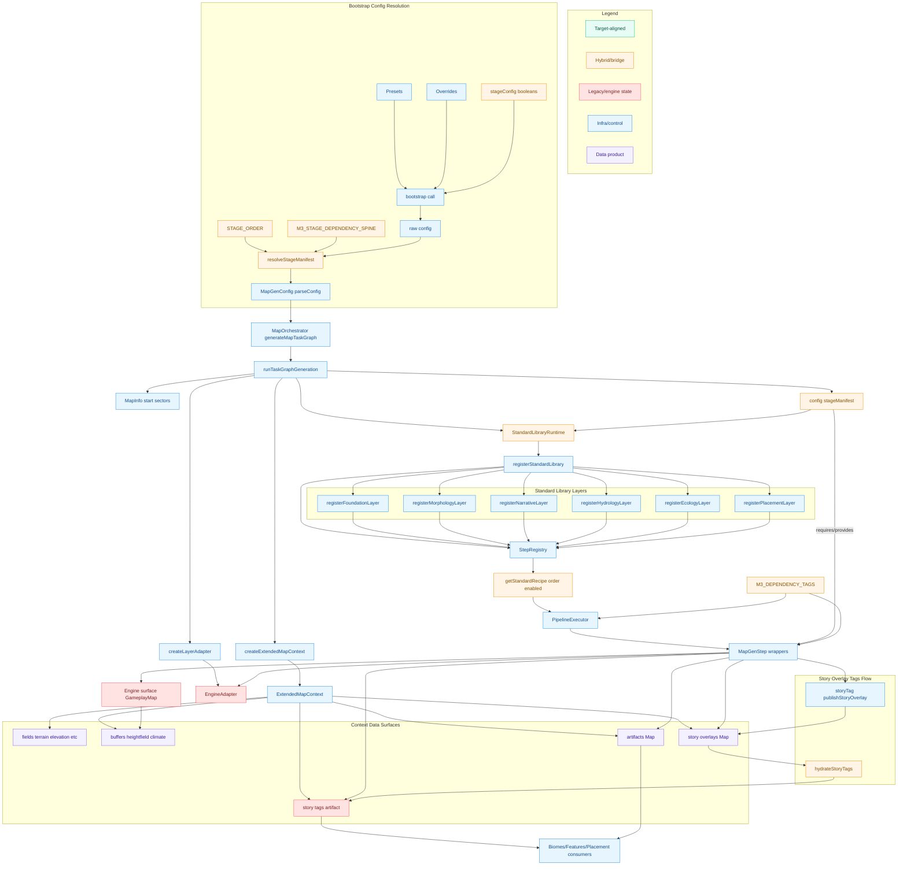
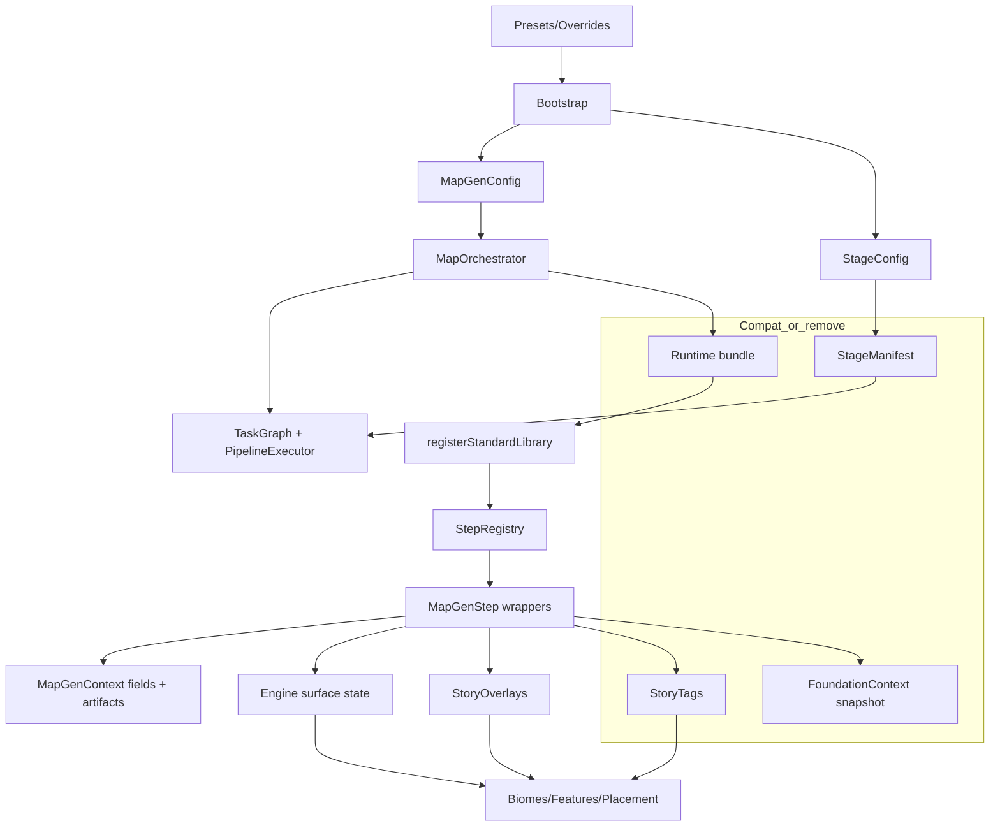
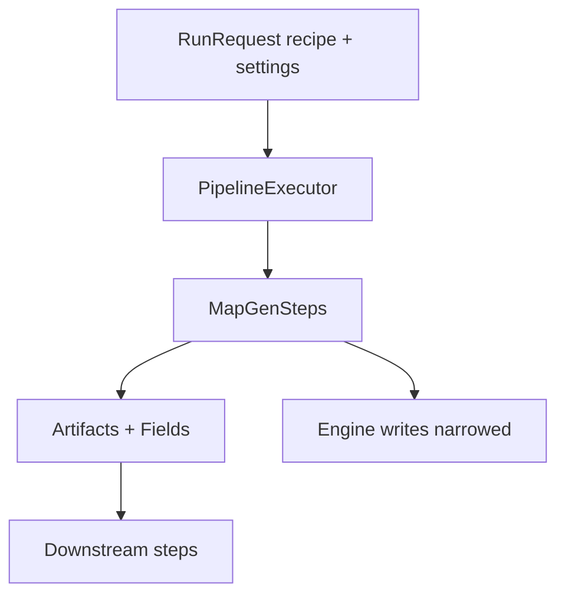

# SPIKE: MapOrchestrator Indirection Audit (M3/M4 Prep)

## 0. Purpose

Consolidate current findings on MapOrchestrator and related pipeline indirection,
capture a current vs target matrix, and enumerate root causes + levers so we can
drive an M4 completion plan without losing context across threads.

Scope:
- `packages/mapgen-core/src/MapOrchestrator.ts`
- Task Graph plumbing (`pipeline/*`, `orchestrator/*`)
- Story tags/overlays + stage enablement
- Related deferrals and project docs

This is a "single place to point" for M4 planning and follow-up refactors.

---

## 1. Snapshot: Where We Are (Executive Summary)

We are in a transitional M3/M4 slice:
- Task Graph is in place and MapOrchestrator now runs it by default.
- Stage enablement is derived from `stageConfig` → `stageManifest` and applied when deriving the recipe list (transitional; `DEF-004`).
- Story data is still represented twice (tags + overlays) for compatibility; consumers re-hydrate tags from overlays.
- Foundation output is still a monolithic `FoundationContext` snapshot (compatibility boundary), not the target multi-artifact foundation graph.
- Engine-surface state (`state:engine.*`) is trusted rather than runtime-verified.

Net effect: The architecture is directionally aligned but still carries deliberate indirection
to preserve behavior while downstream consumers migrate.

---

## 2. Docs & Architecture Clarity

Target architecture drafting now lives in
`docs/projects/engine-refactor-v1/resources/SPIKE-target-architecture-draft.md`.
This section is a snapshot of what was known at the time of this audit.

### 2.1 Canonical docs available (what we have)

System / domain docs (target intent, but mixed):
- `docs/system/libs/mapgen/architecture.md` (target + current mixed)
- `docs/system/libs/mapgen/foundation.md` (target, with current bridge notes)
- `docs/system/libs/mapgen/morphology.md` (target)
- `docs/system/libs/mapgen/hydrology.md` (target + current notes)
- `docs/system/libs/mapgen/ecology.md` (target)
- `docs/system/libs/mapgen/narrative.md` (target)

Project docs (current snapshot / contracts / deferrals):
- `docs/projects/engine-refactor-v1/PROJECT-engine-refactor-v1.md` (only explicit target stage topology table)
- `docs/projects/engine-refactor-v1/status.md` (current snapshot)
- `docs/projects/engine-refactor-v1/deferrals.md` (explicit M3/M4 deferrals)
- `docs/projects/engine-refactor-v1/resources/CONTRACT-foundation-context.md` (current M2 foundation contract)
- `docs/projects/engine-refactor-v1/issues/*` (scope slices)

Doc hygiene ambiguity:
- Canonical docs are supposed to be ALL-CAPS under `docs/`, but the mapgen
  architecture docs are lowercase. That implies "supporting" status by policy,
  yet they are used as canonical target references. This is an open ambiguity.

### 2.2 Target architecture synthesis (from system docs)

From `docs/system/libs/mapgen/architecture.md`:
- Pipeline is a Task Graph with phases: `setup`, `foundation`, `morphology`,
  `hydrology`, `ecology`, `placement`.
- Steps implement `MapGenStep` (id, phase, requires, provides, run) and are registered via `StepRegistry`.
- Target drafting now treats `RunRequest = { recipe, settings }` as the boundary input (not `MapGenConfig`), with step-owned config schemas supplied via per-occurrence recipe config.
- `MapGenContext` owns `fields` (mutable canvas) and `artifacts` (intermediate
  data); `EngineAdapter` is injected, no globals.
- Dependency tags include `artifact:*`, `field:*`, and `effect:*` (schedulable); `state:engine.*` is transitional-only.
- Fail-fast: no Null Adapter, dependency validation required.

From phase docs (foundation/morphology/hydrology/ecology/narrative):
- Foundation: mesh/crust/plateGraph/tectonics artifacts; optional eras.
- Morphology: heightfield + terrain mask; erosion/sediment artifacts.
- Hydrology: `ClimateField` is canonical rainfall/temperature; engine river
  modeling is wrapped (M3).
- Ecology: soils/biomes/resources/features; uses climate + morphology artifacts.
- Narrative: cross-cutting story overlays/tags/regions/corridors/history,
  injected/observed alongside physical phases.

### 2.3 Is the target architecture clearly laid out?

Partial, but not precise:
- The target direction (Task Graph, steps, artifacts, no globals) is clear in
  `docs/system/libs/mapgen/architecture.md`, but it explicitly mixes current and target.
- The most concrete target stage topology and outputs are in
  `docs/projects/engine-refactor-v1/PROJECT-engine-refactor-v1.md`, which is not
  a canonical system doc and will drift if it is not promoted.
- Phase-level docs (morphology/hydrology/ecology/narrative) are aspirational and
  do not lock down actual step IDs, artifact names, or schema contracts.
- Recipe and enablement are described conceptually, but there is no canonical
  recipe schema or single source of truth for enablement.

Net: We have a strong target narrative, but the precise contract surfaces
(step IDs, artifact registry, recipe schema, engine boundary rules) are
spread across project docs or implied, not canonical.

### 2.4 Target architecture gaps and unresolved components

Explicit gaps / open questions in target docs (as of 2025-12-20):
- Foundation surface is still `FoundationContext` as a compatibility snapshot; discrete foundation artifacts are not yet locked (3.3 open / DEF-014).
- Story contract is still split (overlays + tags) for compatibility; canonical schema + lifecycle are not locked (3.4 open / DEF-002/DEF-012).
- Climate ownership and placement inputs are still not locked (3.6/3.7 open / DEF-006/DEF-010).
- `MapGenContext.fields` is not complete or consistent (no `resources`, `names`,
  or `placement` buffers defined in the architecture doc).
- Step ID taxonomy is aspirational but not locked (e.g., `morphology.*`,
  `hydrology.*` naming vs actual registry).
- Placement + setup phases are defined in `GenerationPhase` but have no
  dedicated target docs or artifact contracts.
- Narrative contract is described qualitatively, but no canonical schema for
  story overlays/tags or their lifecycle exists.
- Engine boundary policy is now pinned in target drafts (adapter-only; reification-first; verified `effect:*`), but enforcement work remains (`state:engine.*` → `effect:*` migration; DEF-008).
- Diagnostics/observability targets are not specified in the system docs
  (per-stage metrics, artifact inspection, or contract validation).

### 2.5 This-or-this ambiguities (legacy vs target vs shim)

Flagging direct either/or choices that remain unresolved:
- **Ordering cutover:** target recipe/ExecutionPlan ordering **or** continued M3 ordering via `STAGE_ORDER` + `stageManifest` (DEF-004).
- **Foundation shape:** `FoundationContext` snapshot **or** discrete artifacts
  (`mesh`, `crust`, `plateGraph`, `tectonics`) as the canonical surface.
- **Story model:** `StoryTags` **or** `artifact:storyOverlays` /
  `context.artifacts.story` (no single declared schema).
- **Climate ownership:** `ClimateField` as canonical rainfall **or**
  engine-surface rainfall as the real source of truth.
- **Context shape:** `ctx.foundation` vs `context.artifacts.*` naming; fields
  vs engine buffers for features/resources.

### 2.6 Decision log stubs (to promote into ADRs)

Stub list only (to be expanded into ADRs with decision, rationale, and impact):
- **ADR-TBD: Pipeline ordering source of truth** — accepted in target drafts (3.1); promote to ADR.
- **ADR-TBD: Step enablement model** — accepted in target drafts (3.2); promote to ADR.
- **ADR-TBD: Foundation artifact contract** — `FoundationContext` snapshot vs
  discrete artifacts (`mesh`, `crust`, `plateGraph`, `tectonics`).
- **ADR-TBD: Story data model** — `StoryTags` vs `storyOverlays` /
  `context.artifacts.story` as the canonical surface.
- **ADR-TBD: Engine boundary policy** — accepted in target drafts (3.5); promote to ADR.
- **ADR-TBD: Climate/Rainfall ownership** — `ClimateField` artifact as canonical
  vs engine-surface rainfall as source of truth.
- **ADR-TBD: Context schema ownership** — explicit `fields`/`artifacts` registry
  vs implicit `ctx.*` usage in steps.
- **ADR-TBD: Recipe schema versioning** — accepted in target drafts (3.9); promote to ADR.

### 2.7 Do we have a full map of the current hybrid architecture?

Not yet. We have partial coverage:
- `status.md` gives a high-level snapshot but not a topology map.
- `CONTRACT-foundation-context.md` is precise for the foundation product only.
- The actual hybrid wiring (stage manifest, flags, runtime bundle, story tags)
  lives in code; there is no single doc that maps the current runtime topology.

Net: The "current map" is discoverable from code + deferrals, but it is not
documented as a whole. The diagram below is a best-effort map of the lynchpins.

---

## 3. Current vs Target Matrix

| Area | Target (canonical) | Current (M3/M4 slice) | Delta / Impact | Deferral / Blocker |
| --- | --- | --- | --- | --- |
| Orchestration boundary | Thin entrypoint; steps publish artifacts/fields; minimal runtime wiring | Orchestrator passes a large runtime bundle into `registerStandardLibrary()` and resets global story caches | Hidden cross-step coupling; step contracts obscured by runtime side-channel | DEF-012 (story state), DEF-004 (recipe cutover) |
| Recipe / enablement | Mod/UI-facing recipe defines order + per-step config; single enablement source | `STAGE_ORDER` + `stageManifest` drives the derived recipe list (enablement filtering happens only when deriving the list; no `shouldRun`/stageFlags) | Still no mod-facing recipe authoring surface; ordering/enablement remain stage-boolean-driven (bridge) | DEF-004 |
| Stage config plumbing | Direct recipe surface (no stageConfig air gap) | `stageConfig` booleans are resolved into `stageManifest` (bridge layer) | Added indirection; requires drift checks | M3 locked decision (CIV-41) |
| Story outputs | Context-owned story artifact(s); no globals; consumers read overlays directly | StoryTags + overlays both exist; tags are produced and also hydrated from overlays in consumers | Duplicate representation; risk of semantic drift | DEF-002, DEF-003, DEF-012 |
| Story registry | Context-scoped overlays only | Overlay registry has compatibility path (context map; no enforced single owner) | Global fallback risk and unclear ownership | DEF-003 |
| Foundation output | Multi-artifact foundation graph (mesh/crust/plateGraph/tectonics) | `FoundationContext` snapshot published as compatibility artifact | Monolithic surface; blocks foundation refactor | DEF-014 |
| Engine state contracts | `state:engine.*` tags verifiable or replaced by artifacts | `state:engine.*` tags trusted (no runtime verification) | Gating may pass while engine state is incorrect | DEF-008 |
| Placement inputs | Canonical `artifact:placementInputs` (engine-less testing) | Placement step reads engine-surface state directly | Hard to test offline; step not purely data-driven | DEF-006 |
| River products | River graph (or richer product) | `artifact:riverAdjacency` only | Limits downstream narrative/placement richness | DEF-005 |
| Climate/rainfall ownership | TS-owned canonical climate artifact | Climate still leans on engine surface for some reads/writes | Limits offline determinism | DEF-010 |
| Legacy state | No globals; no WorldModel bridge | WorldModel producer removed; globals remain for story compatibility | Remaining global story caches still influence execution | DEF-012 |

---

## 4. Current Hybrid Architecture Map (Lynchpins)

Best-effort map of the current hybrid runtime and the primary "remove later"
compatibility nodes. This is a topology sketch, not a precise data-flow spec.

### 4.1 Detailed topology diagram (current hybrid, M3)

Color key: green = target-aligned, orange = hybrid/bridge, red = legacy/engine
state, blue = infra/control, purple = data product surface.

### 4.1a Lower-level stage outputs and publish points (current hybrid, M3)

Lower-level view is boxed and tinted to keep it distinct from the big-lever map above.

```mermaid
flowchart LR
  classDef low fill:#f8f9fa,stroke:#adb5bd,color:#495057
  classDef stage fill:#e7f5ff,stroke:#228be6,color:#114b8a
  classDef artifact fill:#f3f0ff,stroke:#845ef7,color:#3b1c95
  classDef state fill:#fff4e6,stroke:#f08c00,color:#7f4f00

  subgraph LowLevel_Legend[Legend for lower level view]
    LL1[Stage step]:::stage
    LL2[Artifact publish]:::artifact
    LL3[State tag publish]:::state
  end

  subgraph LowLevel[Lower level stage outputs]
    direction LR

    subgraph FoundationPhase[Foundation]
      foundationStep[foundation]:::stage
    end

    subgraph MorphologyPhase[Morphology]
      landmassPlates[landmassPlates]:::stage
      coastlines[coastlines]:::stage
      ruggedCoasts[ruggedCoasts]:::stage
      islands[islands]:::stage
      mountains[mountains]:::stage
      volcanoes[volcanoes]:::stage
      storySeed[storySeed]:::stage
      storyHotspots[storyHotspots]:::stage
      storyRifts[storyRifts]:::stage
      storyOrogeny[storyOrogeny]:::stage
      storyCorridorsPre[storyCorridorsPre]:::stage
    end

    subgraph HydrologyPhase[Hydrology]
      lakes[lakes]:::stage
      climateBaseline[climateBaseline]:::stage
      storySwatches[storySwatches]:::stage
      rivers[rivers]:::stage
      storyCorridorsPost[storyCorridorsPost]:::stage
      climateRefine[climateRefine]:::stage
    end

    subgraph EcologyPhase[Ecology]
      biomes[biomes]:::stage
      features[features]:::stage
    end

    subgraph PlacementPhase[Placement]
      placement[placement]:::stage
    end

    subgraph PublishedTags[Published tags]
      foundationTag[artifact foundation]:::artifact
      heightfieldTag[artifact heightfield]:::artifact
      climateTag[artifact climateField]:::artifact
      riverAdjTag[artifact riverAdjacency]:::artifact
      storyOverlaysTag[artifact storyOverlays]:::artifact
      landmassTag[state landmassApplied]:::state
      coastlinesTag[state coastlinesApplied]:::state
      riversModeledTag[state riversModeled]:::state
      biomesTag[state biomesApplied]:::state
      featuresTag[state featuresApplied]:::state
      placementTag[state placementApplied]:::state
    end

    foundationStep --> foundationTag
    landmassPlates --> landmassTag
    islands --> landmassTag
    mountains --> landmassTag
    volcanoes --> landmassTag
    coastlines --> coastlinesTag
    ruggedCoasts --> coastlinesTag

    storySeed --> storyOverlaysTag
    storyHotspots --> storyOverlaysTag
    storyRifts --> storyOverlaysTag
    storyOrogeny --> storyOverlaysTag
    storyCorridorsPre --> storyOverlaysTag
    storyCorridorsPost --> storyOverlaysTag

    lakes --> heightfieldTag
    climateBaseline --> heightfieldTag
    climateBaseline --> climateTag
    storySwatches --> climateTag
    rivers --> riversModeledTag
    rivers --> heightfieldTag
    rivers --> riverAdjTag
    climateRefine --> climateTag

    biomes --> biomesTag
    features --> featuresTag
    placement --> placementTag
  end

  style LowLevel fill:#f8f9fa,stroke:#adb5bd,stroke-dasharray: 5 5
```

Refs: `packages/mapgen-core/src/pipeline/standard.ts`, `packages/mapgen-core/src/pipeline/*/index.ts`.

### 4.1b Per-phase contract tables (readable scan)

Intent: show the contract surface by phase without forcing a spaghetti edge diagram.
Rows are sorted by execution order from `STAGE_ORDER` and include that order index
to make scanability easier.

Foundation:

| Order | Stage | Requires | Provides |
| --- | --- | --- | --- |
| 1 | foundation | - | [A] foundation |

Morphology:

| Order | Stage | Requires | Provides |
| --- | --- | --- | --- |
| 2 | landmassPlates | [A] foundation | [S] landmassApplied |
| 3 | coastlines | [S] landmassApplied | [S] coastlinesApplied |
| 4 | storySeed | [S] coastlinesApplied | [A] storyOverlays |
| 5 | storyHotspots | [S] coastlinesApplied | [A] storyOverlays |
| 6 | storyRifts | [S] coastlinesApplied | [A] storyOverlays |
| 7 | ruggedCoasts | [S] coastlinesApplied | [S] coastlinesApplied |
| 8 | storyOrogeny | [S] coastlinesApplied | [A] storyOverlays |
| 9 | storyCorridorsPre | [S] coastlinesApplied | [A] storyOverlays |
| 10 | islands | [S] coastlinesApplied | [S] landmassApplied |
| 11 | mountains | [A] foundation | [S] landmassApplied |
| 12 | volcanoes | [A] foundation | [S] landmassApplied |

Hydrology:

| Order | Stage | Requires | Provides |
| --- | --- | --- | --- |
| 13 | lakes | [S] landmassApplied | [A] heightfield |
| 14 | climateBaseline | [A] foundation | [A] heightfield, [A] climateField |
| 15 | storySwatches | [A] climateField | [A] climateField |
| 16 | rivers | [A] foundation, [A] heightfield | [S] riversModeled, [A] heightfield, [A] riverAdjacency |
| 17 | storyCorridorsPost | [S] coastlinesApplied, [A] climateField, [A] riverAdjacency | [A] storyOverlays |
| 18 | climateRefine | [A] foundation, [A] heightfield, [A] climateField, [A] riverAdjacency | [A] climateField |

Ecology:

| Order | Stage | Requires | Provides |
| --- | --- | --- | --- |
| 19 | biomes | [A] climateField, [A] heightfield, [A] riverAdjacency | [S] biomesApplied |
| 20 | features | [S] biomesApplied, [A] climateField, [A] heightfield | [S] featuresApplied |

Placement:

| Order | Stage | Requires | Provides |
| --- | --- | --- | --- |
| 21 | placement | [S] coastlinesApplied, [S] riversModeled, [S] featuresApplied | [S] placementApplied |

Refs: `packages/mapgen-core/src/pipeline/standard.ts`.

### 4.2 Simplified topology sketch

Target sketch (what this collapses toward):

---

## 5. Indirection Inventory (Root Causes + Symptoms)

### 5.1 Stage enablement indirection

Chain:
1. `bootstrap()` captures `stageConfig`
2. `resolveStageManifest()` expands into `stageManifest` (with `STAGE_ORDER`)
3. `StepRegistry.getStandardRecipe(stageManifest)` derives the recipe list by filtering `stageManifest.order` via stage enablement

Symptoms:
- Enablement is still stage-boolean driven in M3 (`stageConfig` → `stageManifest`) rather than a mod-facing recipe authoring surface (DEF-004).
- `validateStageDrift()` exists to warn about list drift.
- Mod-facing config is still stage booleans, not a true recipe.

Key refs:
- `packages/mapgen-core/src/bootstrap/entry.ts`
- `packages/mapgen-core/src/bootstrap/resolved.ts`
- `packages/mapgen-core/src/pipeline/StepRegistry.ts`
- `docs/projects/engine-refactor-v1/issues/CIV-41-task-graph-mvp.md`
- DEF-004, DEF-013

### 5.2 Story tags + overlays double derivation

Current behavior:
- Tagging passes write to StoryTags and publish overlay snapshots.
- Some consumers hydrate tags from overlays (to preserve legacy interfaces).

Symptoms:
- Tags can be mutated both directly (tagging steps) and indirectly (hydrate).
- Risk of divergence if tag definitions evolve separately from overlays.
- Clear compatibility goal but still two data models.

Key refs:
- `packages/mapgen-core/src/domain/narrative/tagging/*`
- `packages/mapgen-core/src/domain/narrative/overlays/*`
- `packages/mapgen-core/src/pipeline/ecology/BiomesStep.ts`
- `packages/mapgen-core/src/pipeline/ecology/FeaturesStep.ts`
- DEF-002, DEF-012

### 5.3 Orchestrator runtime bundle

Current behavior:
- Orchestrator collects run-specific data and passes it into `registerStandardLibrary(...)`.
- Steps depend on this runtime bundle rather than explicit artifacts/fields.

Symptoms:
- Runtime wiring acts as a hidden blackboard.
- No explicit provenance for some data (start sectors, continent bounds, mapInfo).
- Steps can mutate data without publishing explicit artifacts.

Key refs:
- `packages/mapgen-core/src/orchestrator/task-graph.ts`
- `packages/mapgen-core/src/pipeline/standard-library.ts`
- `docs/projects/engine-refactor-v1/resources/SPIKE-orchestrator-bloat-assessment.md`
- DEF-013

### 5.4 Foundation compatibility boundary

Current behavior:
- Foundation stage produces a monolithic `FoundationContext` snapshot.
- Downstream stages consume that snapshot rather than a graph of artifacts.

Symptoms:
- Hard to evolve foundation internals without preserving compatibility blob.
- Blocks graph-based foundation refactor (Phase B).

Key refs:
- `packages/mapgen-core/src/core/types.ts` (`FoundationContext`)
- `docs/projects/engine-refactor-v1/issues/CIV-48-worldmodel-cut-phase-a.md`
- DEF-014

### 5.5 Trusted `state:engine.*` tags

Current behavior:
- Executor verifies artifact/field tags but trusts engine state tags.

Symptoms:
- Contracts can “pass” without verifiable engine state; bugs surface later.

Key refs:
- `packages/mapgen-core/src/pipeline/PipelineExecutor.ts`
- `packages/mapgen-core/src/pipeline/standard.ts`
- DEF-008

---

## 6. Root Causes (Why Indirection Persists)

1. **Compatibility-first M3 scope**  
   The Task Graph was introduced as a wrapper around existing stage logic without changing algorithms or contracts.

2. **Deferred recipe design**  
   M3 intentionally avoided exposing a mod-facing recipe surface; `STAGE_ORDER` + enable/disable flags stayed as the source of truth.

3. **Mixed data ownership during migration**  
   Story and foundation artifacts are not yet fully re-homed into context-owned products; compatibility layers remain.

4. **Engine coupling still present**  
   Engine-surface operations (placement, rivers, rainfall) require `state:engine.*` tags and runtime adapters.

5. **Phase B foundation refactor deferred**  
   `FoundationContext` remains a monolith until graph artifacts are introduced.

---

## 7. Key Levers (M4-Minded)

These are the primary change levers that reduce indirection and move us to target architecture:

1. **Enablement consolidation**  
   Resolved in-repo (CIV-53 / DEF-013): recipe list is the sole enablement source; no `shouldRun`/stageFlags gating.
   Next lever is the **ordering cutover**: replace `STAGE_ORDER` + `stageManifest` with a mod-facing recipe surface (DEF-004).

2. **Story state consolidation**  
   Pick a canonical story artifact (`artifact:storyOverlays` or explicit `artifact:storyState`) and migrate consumers; retire StoryTags compatibility.

3. **Runtime bundle removal**  
   Replace runtime wiring with explicit artifacts/fields (e.g., publish `artifact:startSectors`, `artifact:continentBounds`, `artifact:mapInfo`).

4. **Foundation graph artifacts (Phase B)**  
   Define and publish graph artifacts; migrate consumers off `ctx.foundation`.

5. **Engine state contract strategy**  
   Either:
   - Introduce adapter checks for `state:engine.*`, or
   - Replace with explicit artifacts wherever feasible.

---

## 8. Target vs Current Detail (Path Narrative)

**Target:** composable Task Graph, explicit artifacts/fields, recipe-driven pipeline, no globals, no legacy compatibility paths.

**Current:** Task Graph exists but is wrapped around the old stage order, story compatibility remains, and orchestration still carries runtime coupling.

**Path delta:** Most missing pieces align exactly to deferrals in
`docs/projects/engine-refactor-v1/deferrals.md` and the Phase B foundation PRD.

---

## 9. Related References (Index)

Core docs:
- `docs/system/libs/mapgen/architecture.md`
- `docs/system/libs/mapgen/foundation.md`
- `docs/projects/engine-refactor-v1/status.md`

Deferrals:
- `docs/projects/engine-refactor-v1/deferrals.md` (DEF-002/003/004/005/006/008/010/012/013/014)

Issues:
- `docs/projects/engine-refactor-v1/issues/CIV-41-task-graph-mvp.md`
- `docs/projects/engine-refactor-v1/issues/CIV-43-story-system.md`
- `docs/projects/engine-refactor-v1/issues/CIV-48-worldmodel-cut-phase-a.md`

Prior spike:
- `docs/projects/engine-refactor-v1/resources/SPIKE-orchestrator-bloat-assessment.md`

---

## 10. Open Questions / Follow-ups

1. What should the first-class M4 recipe surface be (JSON schema, config extension, or new entrypoint)?
2. Should story tags be eliminated entirely or demoted to dev-only debug surfaces?
3. Which runtime bundle pieces are true artifacts vs. transient execution inputs?
4. How far do we take `state:engine.*` verification in M4 vs. replacing those tags?
5. Does foundation graph artifact work happen before or after story consolidation?
