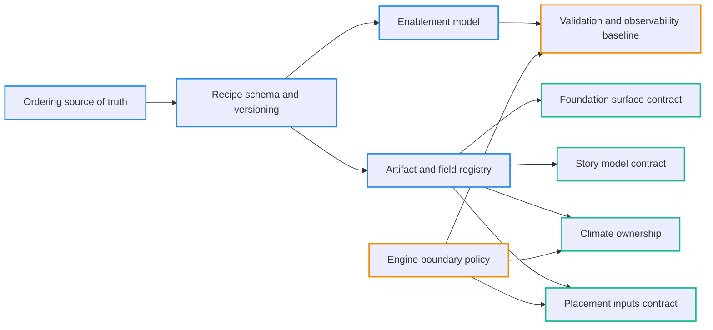

# SPIKE: Target Architecture Draft (Working Notes)

> Agent disclaimer (WIP):
>
> - The deferrals are not yet fully integrated into the target flow; do not treat this as complete.
> - In particular, we have not yet “loaded the screen” in that sense — this deferral behavior is still missing.

## 0. Purpose

This is the working canvas for resolving target architecture decisions. It
accumulates exploratory thinking, decision rationale, and interim notes as we
converge on the canonical target.

The canonical target architecture lives in the companion doc:
`docs/projects/engine-refactor-v1/resources/SPEC-target-architecture-draft.md`

Related:
- Indirection audit and current map: `docs/projects/engine-refactor-v1/resources/SPIKE-orchestrator-indirection-audit.md`

---

## 1. Inputs and references

Primary references (target intent, mixed with current state):
- `docs/system/libs/mapgen/architecture.md`
- `docs/system/libs/mapgen/foundation.md`
- `docs/system/libs/mapgen/morphology.md`
- `docs/system/libs/mapgen/hydrology.md`
- `docs/system/libs/mapgen/ecology.md`
- `docs/system/libs/mapgen/narrative.md`

Project references (contracts, deferrals, and transition state):
- `docs/projects/engine-refactor-v1/PROJECT-engine-refactor-v1.md`
- `docs/projects/engine-refactor-v1/deferrals.md`
- `docs/projects/engine-refactor-v1/status.md`
- `docs/projects/engine-refactor-v1/resources/CONTRACT-foundation-context.md`

---

## 2. Decision packets

Each decision below includes context for why it exists, why it is ambiguous,
why the ambiguity is a problem, the simplest system-level option, and why we
may not yet simplify.

### 2.0 How we will resolve decisions

This doc is the decision-making workspace. The canonical target lives in the
SPEC doc (`SPEC-target-architecture-draft.md`).

Workflow (repeat per decision or per decision-batch):
- Gather evidence (code refs + doc refs + deferrals).
- Enumerate options and identify the greenfield simplest.
- Call out what blocks simplification and whether it is real or legacy-only.
- Propose a default (explicitly marked tentative until accepted).
- Once accepted, update the SPEC immediately and link an ADR stub.

Decision status values:
- `open` -> not yet proposed
- `proposed` -> a preferred option exists, awaiting acceptance
- `accepted` -> update SPEC is complete and becomes canonical target draft
- `superseded` -> replaced by another decision

### 2.0a Decision dependency graph

This is the intended ordering to avoid thrash. "Spine" decisions define the
contract language; boundary decisions define what must be observable/enforced;
domain decisions then lock concrete artifact shapes.

### 2.0b Decision packet template

Use this structure for each decision so we can move from "discussion" to
SPEC updates quickly and consistently.

Decision packet:
- **Status:** `open | proposed | accepted | superseded`
- **Decision:** one sentence
- **Why this exists:** what created the ambiguity
- **Why it matters:** what breaks or stays hard while unresolved
- **Evidence:** links to code, docs, deferrals, and any parity matrices
- **Greenfield simplest:** what we would do from scratch
- **Options:** 2–4 options with tradeoffs and required preconditions
- **What blocks simplification:** what is truly necessary vs legacy-only
- **Tentative default:** the current recommendation (until accepted)
- **SPEC impact:** exact sections/tables to update in the pure spec
- **ADR stub:** name/link placeholder
- **Migration note:** what changes in current hybrid and which deferrals close

### 2.1 Ordering source of truth (recipe-only vs `STAGE_ORDER` + manifest)

**Status:** `accepted`

**Decision (one sentence):** What is the single source of truth for pipeline
ordering in the target system?

**Terminology (to de-confuse the packet):**
- **Layer (conceptual):** a domain grouping (foundation/morphology/hydrology/ecology/narrative/placement). Layers are how we *talk* about the pipeline; they are not necessarily runtime units.
- **Stage (current runtime unit):** the legacy/transition runtime unit that roughly corresponds to "a pipeline module" and is currently also used as an ordering/enabling unit (`stageConfig`, `stageManifest`, `STAGE_ORDER`).
- **Step (target runtime unit):** the unit of execution in a TaskGraph (`MapGenStep`). A step has explicit `requires/provides` and an executable `run`.
  - Today we frequently have a **1:1 mapping** "stage ID == step ID" (which is part of why terms blur).
  - In the target, a "stage" can be treated as a *bundle* (a named group of steps), while "step" remains the executable atom.
- **Recipe (authoring contract):** a data object that defines pipeline composition: which runnable things occur, in what order/topology, with what per-occurrence config.
- **RunRequest (boundary input):** the authored input bundle: `{ recipe, settings }`. This supersedes the "mega-object" `MapGenConfig` as the target boundary contract.
- **Settings (global run settings):** per-run instance parameters shared across steps (e.g., `seed`, map dimensions). These live at `ctx.settings` (not in a legacy config mega-object).
- **Per-step config (occurrence-local knobs):** step-owned config (validated against the step’s schema) supplied per occurrence by the recipe and carried by the compiled plan.
- **Runtime (engine I/O surface):** the adapter/engine boundary and related I/O facilities exposed to steps (e.g., `ctx.runtime.adapter`). This is distinct from settings/config.
- **ExecutionPlan (compiled internal view):** the derived/validated, executable plan compiled from `recipe + registry + settings`. This is the single "effective run" artifact in the target.
  - Transitional note: today the closest analogue is the internal `StageManifest` (derived from `STAGE_ORDER`), but `StageManifest` is not the target compiled-plan contract.
- **Registry (catalog/runtime):** the lookup mechanism that maps IDs to code (`MapGenStep` implementations) and their config schema/validation.
- **Mod package (content bundle):** a self-contained package that ships a registry + one or more recipes. The standard pipeline is just a mod (not privileged engine content).

**Current mapping (today) vs target intent (what we mean when we say "recipe"):**
- Today:
  - Ordering: `STAGE_ORDER` -> `StageManifest.order` -> "recipe" list (stage IDs).
  - Enablement: `stageConfig`/`stageManifest` flags plus per-step guards (`shouldRun`) and other legacy gating (transitional only; removed in the target contract).
  - Topology: mostly linear; dependency metadata is carried in a "dependency spine" derived from `M3_STAGE_DEPENDENCY_SPINE`, not owned exclusively by step code.
  - Registry: used, but assumes a standard ordered list built from `stageManifest.order`.
- Target intent (greenfield):
  - Recipe is the canonical, mod-facing "instruction set".
  - Registry is the catalog the recipe draws from (and/or a plugin extension mechanism).
  - `ExecutionPlan` is derived from `RunRequest = { recipe, settings }` + registry (validation + defaults), not a parallel truth.
  - Steps own their dependency declarations; recipe composes them.

**Why this exists (how ambiguity was created):**
- `DEF-004` intentionally keeps ordering derived from `STAGE_ORDER` +
  `stageManifest` in M3, while docs describe a recipe-driven target.
- The current TaskGraph path calls the ordered step list a "recipe", but it is
  derived from `stageManifest.order` (which is itself derived from `STAGE_ORDER`).

**Why it matters (what stays hard until resolved):**
- We cannot define a stable recipe schema or public authoring story until we
  decide whether ordering lives in the recipe (public) or in engine internals.
- We cannot make "enablement" single-sourced without also pinning the source
  of ordering (the two are currently coupled via `stageManifest`).
- Contract validation/instrumentation can be misleading if there are multiple
  ordering representations that can drift.

**What is *actually* undecided (even if we agree "we want a recipe"):**
There are at least three subtly different "recipe-like" futures, and picking one
is what this decision is really about:
- **Recipe as an ordered list of step occurrences (true authoring surface):**
  - Recipe explicitly lists runnable occurrences (steps or stage-bundles) in order/topology.
  - Ordering and enablement are authored in the recipe.
  - `ExecutionPlan` becomes purely derived (compiled), not a parallel truth.
- **Recipe as a config overlay on a fixed canonical order:**
  - Ordering stays "internal" (hard-coded or engine-owned).
  - Recipe only controls enable/params for known stages/steps.
  - This looks like a recipe, but it is not composition-driven.
- **Recipe as "the manifest" (publicly exposing the resolved internal wiring):**
  - We rename `StageManifest` into "Recipe" and expose it.
  - This may be expedient, but risks freezing M3's internals as the long-term public contract.

This decision is not "obviously answered" by "we want a recipe" because we must
choose (a) what the recipe *controls* (ordering vs just params), (b) what the
recipe *references* (stages vs steps vs bundles), and (c) what becomes derived
vs remains canonical (manifest, dependency spine, enablement flags).

**Evidence (where ordering lives today):**
- `packages/mapgen-core/src/bootstrap/resolved.ts` defines `STAGE_ORDER` and
  builds `StageManifest.order` from it via `resolveStageManifest()`.
- `packages/mapgen-core/src/bootstrap/entry.ts` always resolves
  `stageConfig` -> `stageManifest` (the "config air gap" bridge).
- `packages/mapgen-core/src/pipeline/StepRegistry.ts` defines
  `getStandardRecipe(stageManifest)` as `stageManifest.order` filtered by
  enabled stages (note the 1:1 assumption with stage IDs).
- `packages/mapgen-core/src/orchestrator/task-graph.ts` builds `recipe` via
  `registry.getStandardRecipe(stageManifest)` and passes it to `PipelineExecutor`.
- `packages/mapgen-core/src/config/schema.ts` marks `stageConfig` and
  `stageManifest` as `[internal]` plumbing (not mod-facing API).
- `docs/system/libs/mapgen/architecture.md` describes recipe-driven composition,
  but explicitly notes "Current (M3): execution order is still derived from
  legacy `STAGE_ORDER` + `stageManifest`" (points to `DEF-004`).
- `docs/projects/engine-refactor-v1/resources/PRD-plate-generation.md` proposes
  a deterministic **stage→substep expansion** mechanism (keep `foundation` as a
  single stage in `STAGE_ORDER`, but expand into multiple substeps at runtime)
  explicitly because arbitrary recipe composition is deferred in M3.
- `docs/system/libs/mapgen/research/SPIKE-synthesis-earth-physics-systems-swooper-engine.md`
  calls out "pipeline modding" use cases (insert erosion, reorder hydrology substeps),
  which are hard to express with `STAGE_ORDER` and push toward recipe-driven composition.

**Greenfield simplest (pure target):**
- A recipe is the single source of truth for ordering.
- The default order is expressed as a default recipe, not as a hard-coded list.
- Internal metadata like `stageManifest` (if it exists at all) is derived from
  the recipe, not parallel to it.

**Stakeholder intent (current direction, not yet "accepted"):**
- Target is **composition-driven**: recipe composes runnable atoms (not a fixed internal vanilla order).
- "Vanilla" should be expressed as a **default recipe** shipped as part of a **standard mod package** (registry + default recipe), not as privileged internal ordering.
- Registry remains the **catalog/lookup**; recipe is the **instruction set**.
- Any manifest-like representation must be **derived/internal** (a compiled plan), not a second truth.
- Canonical long-term goal: recipes support **DAG / partial-order authoring**.
- V1 baseline: **linear sequence** is the canonical baseline authoring shape; DAG authoring details are deferred.

**Decision scope and non-goals (so we don't mix packets):**
- In scope:
  - "What defines the canonical pipeline composition order/topology?"
  - "What is derived vs canonical in support of that?"
  - "What does a recipe reference: stages, steps, or bundles?"
- Out of scope (separate packets, but affected by this one):
  - Recipe schema/versioning details (`2.9`).
  - Enablement consolidation (`2.2`), except where it couples to ordering.
  - Artifact/field registry ownership/versioning (`2.8`).

**Options (with tradeoffs):**
- **A) Recipe canonical; DAG/partial-order; registry as catalog; plan derived (target)**:
  - Pro: one source of truth; enables mod/UI composition; aligns with docs.
  - Con: requires shipping a recipe schema + validation + migration tooling;
    forces us to define what "step occurrence" means (stages vs steps vs bundles).
- **B) Registry or code default canonical; recipe only selects variants**:
  - Pro: keeps "vanilla" order centralized in code and supports incremental
    authoring surfaces (recipe as "choose variant + params").
  - Con: recipe is not truly compositional; still leaves ordering as an internal truth.
- **C) `STAGE_ORDER` canonical; recipe stays aspirational**:
  - Pro: minimal change; preserves current stability assumptions.
  - Con: blocks target architecture; no public ordering contract; docs remain mixed.
- **D) Promote `StageManifest` as "the recipe" (rename + make public)**:
  - Pro: leverages existing structure immediately.
  - Con: bakes M3 implementation details (requires/provides + state tags) into
    the public contract and makes long-term evolution harder.
- **E) Recipe exists, but ordering is fixed; recipe only controls enable/params**:
  - Pro: smaller surface area; still gives UI a stable config format.
  - Con: contradicts "data-driven task graph composition"; still needs a
    separate ordering truth and limits modding.

**Framing the core sub-questions (to separate ordering vs enablement):**
- Static ordering (structure):
  - Is the default "vanilla" pipeline defined as data (a default recipe in the standard mod) or code (`STAGE_ORDER`/registry)?
  - Does ordering mean strictly linear order, or can recipes be DAG-shaped?
  - What does a recipe list: step IDs, stage IDs, or named bundles of steps?
- Dynamic enablement (execution):
  - Enablement is recipe-authored (presence/enabled flag) and compiled into `ExecutionPlan`.
  - There is no step-level runtime enablement hook (`shouldRun`) and no category of
    “guard” that silently skips a node; errors are fail-fast (validation/precondition).

**What "non-linear recipe" means here (concrete):**
- A **linear recipe** is an ordered list of step occurrences. Dependencies are used for:
  - validation ("you forgot to run the producer"), and/or
  - sanity checks ("your order violates the declared requires/provides").
- A **DAG-shaped recipe** (or "partial-order recipe") is authored as constraints/edges:
  - "Run `B` after `A` because it requires `artifact:X`", without specifying absolute positions.
  - The executor derives an execution order via topological sort (and can detect cycles).

**What DAG authoring enables that a linear list does not:**
- **Patchability without renumbering:** a recipe patch can say "insert erosion after heightfield and before rivers" by constraints, without rewriting the whole list.
- **True composition patterns:** forks/joins when multiple independent producers can be computed before a join consumer step runs.
- **Potential parallelism:** independent subgraphs can be executed concurrently (if we ever want that), though determinism constraints may limit this in practice.

**Plausible examples for MapGen:**
- **Hydrology substeps:** "compute flow/accumulation" and "carve rivers" must happen after heightfield, but could be separated from later "climate/biomes" work. A DAG makes "insert an erosion pass between morphology and rivers" easier to express without brittle list edits.
- **Derived fields consumed by multiple layers:** a "dryness index" step could be consumed by both ecology and narrative overlays; DAG authoring makes that dependency explicit and reduces reliance on global phase ordering.

**Why DAG might be overkill (still valuable to call out):**
- We already have explicit `requires/provides`. If we keep recipes linear, we can still get most value by:
  - validating that the linear list respects dependencies, and
  - providing patch tooling that operates on "insert before/after step-id" rather than raw indices.

**DAG vs linear compatibility (so we don't paint ourselves into a corner):**
- A DAG/partial-order recipe is a **superset** of a linear list:
  - A linear list can be compiled into a DAG by adding "sequence edges"
    `step[i] -> step[i+1]` (a total order).
  - A DAG can still produce a deterministic linear schedule by choosing a
    stable topological sort (tie-break rules must be explicit).
- Moving to DAG authoring does **not** require giving up explicit sequence control:
  - If authors want strict order, they can supply explicit sequence edges (or a
    linear "layout" view that compiles into those edges).
  - If authors want flexibility, they supply only the edges/constraints they care about.

**Mod insertion and "script-based" authoring (how this relates to DAG):**
- The modding style described ("a script changes mountains; system places it") is
  easiest when the underlying recipe is a DAG because mods can be expressed as
  **constraints** relative to dependencies, not hard-coded indices.
- However, DAG alone is not sufficient; we also need a stable **placement model**
  for mods:
  - **Dataflow-first placement:** mod step declares `requires/provides` (and/or read/write sets) on semantic artifacts/fields; placement falls out of dependency constraints.
- **Hook/slot placement:** the standard mod package exports stable hook points (named nodes or boundaries) that mods target (`before/after/around`).
  - In practice we likely want both: dataflow for correctness + hooks for ergonomic authoring.

**On extra metadata like `affects` / `affectedBy` (early direction):**
- In a pure dataflow model, "affectedBy" is mostly `requires` (reads), and
  "affects" is `provides` / writes.
- If we want to support "mutation" steps (modify an existing artifact/field),
  we should prefer modeling this as explicit **read/write sets** (or versioned
  artifacts) rather than introducing a second semantic axis with unclear scheduling meaning.
- Recommendation for V1 target contract:
  - Keep the **semantic scheduling surface** to `requires/provides` (and/or explicit
    `reads`/`writes` if we introduce them), and treat "affects" metadata as optional,
    non-semantic labeling for tooling/UI until proven necessary.

**What "manifest" is for (conceptual):**
- In the target, "manifest" should not be a public concept. It is the internal **compiled plan** produced by:
  - resolving recipe defaults,
  - expanding bundles into concrete step occurrences (if bundles exist),
  - validating step IDs/config schemas,
  - producing the final execution list (or topo-sorted plan),
  - optionally attaching derived metadata for observability (step lineage, resolved config hashes, etc.).
- If that compiled plan is just "validated recipe", we should name it accordingly (e.g. `CompiledRecipe` / `ExecutionPlan`) and treat it as an implementation detail.

**V1 vs future expansions (to keep "target" honest):**
- Long-term direction (canonical):
  - DAG/partial-order recipe as the authoring contract; linear layouts are views/shorthands.
- Default "vanilla" recipe ships as part of the standard mod package.
  - Mods can be expressed as steps plus placement constraints (dataflow + hooks).
- V1 scope recommendation (what we can lock without committing to all tooling):
  - Linear recipe is the baseline authoring shape; compile to `ExecutionPlan`.
  - Explicitly defer DAG authoring and topo-sort semantics while keeping schema room for it.
  - Explicitly defer ergonomic patch tooling and indirect mod placement scripts,
    while keeping schema room for non-breaking extension.

**DAG authoring: canonical direction (proposed; implementation/tooling still deferred):**
This does not block V1 (linear baseline), but it is cheap to lock now and expensive
to revisit after we publish a mod-facing contract.

- **Deterministic scheduling (tie-break):**
  - When we introduce DAG/partial-order authoring, we derive a deterministic linear schedule via a **stable topological sort**.
  - Tie-break rule (in priority order):
    1. explicit order constraints (edges) authored in the recipe,
    2. the recipe's **layout order** (the authored `steps[]` list order, if present),
    3. lexical order of `instanceId` as the final deterministic fallback.
- **Mutation semantics (read/write direction):**
  - Scheduling semantics should remain grounded in **dataflow**:
    - `requires` ≈ reads, `provides` ≈ writes.
  - Canonical direction:
    - `field:*` are mutable canvases (in-place writes are expected).
    - `artifact:*` should be treated as immutable/versioned products; steps that "modify" an artifact should publish a new artifact (new tag or versioned key) rather than mutate in place.
  - If we later need richer mutation modeling, introduce explicit `reads`/`writes` sets (or artifact versioning) rather than `affects` semantics.
- **Mod placement model (dataflow + hooks):**
  - Canonical direction is **hybrid**:
    - correctness via dataflow (`requires/provides` and/or explicit read/write sets), and
  - ergonomics via named hook points exported by the standard mod package (`before/after/around` boundaries).
  - "Script-based insertion" is tooling over this model, not a new scheduling surface.
- **`affects` / `affectedBy` metadata:**
  - Not part of scheduling semantics by default.
  - Allowed only as descriptive/tooling metadata unless/until we explicitly promote it to semantics via a schema major bump.

**What blocks simplification (real vs legacy-only):**
- Real: we do not yet have a canonical recipe schema, versioning, and
  compatibility rules (`2.9`).
- Mostly legacy: preserving exact legacy sequencing/parity while migrating
  consumers (explicitly the reason for `DEF-004`).
- Structural: today, `stageManifest` also carries a "dependency spine"
  (`requires/provides`) derived from `M3_STAGE_DEPENDENCY_SPINE`; if we move
  ordering into a recipe, we must decide whether dependencies live only in
  steps (greenfield) or remain partly config-driven (transitional).

**Thoughts that should influence the conversation:**
- The schema already declares `stageManifest` as `[internal]`. If we expect a
  public ordering surface, "recipe canonical" is the only option that avoids
  leaking M3 internals into the mod-facing contract.
- The current "recipe" is only a list of stage IDs and assumes a 1:1 mapping
  between stages and step IDs. If we ever want multi-step phases (true task
  graph composition), the authoring surface must evolve beyond the current
  stage list anyway.
- If we delay this decision too long, we risk building more tooling/docs around
  `stageManifest` that will later be thrown away.

**Accepted choice (final):**
- **Recipe is canonical:** the recipe is the single source of truth for ordering (and enablement via decision `2.2`).
- **Default order is content, not engine:** "vanilla" ordering ships as the default recipe in the `standard` mod (not as `STAGE_ORDER`).
- **Manifest is derived/transitional:** any `StageManifest`/`STAGE_ORDER` representation is an internal bridge only and must not become a mod-facing authoring contract.
- **ExecutionPlan is authoritative:** compilation produces an `ExecutionPlan` from `RunRequest = { recipe, settings } + registry`; the executor runs the plan.

**Enforcement (guardrails for future work):**
- No new target-facing docs, APIs, or tooling should treat `STAGE_ORDER`/`StageManifest` as canonical ordering sources.
- Any remaining `STAGE_ORDER` call sites are explicitly transitional (see `DEF-004`) and should be deleted once parity is reached.

**SPEC impact (accepted):**
- `docs/projects/engine-refactor-v1/resources/SPEC-target-architecture-draft.md`:
  - `1.2 Pipeline contract` (ordering/enabling source of truth)
  - Add recipe schema summary and constraints (once `2.9` is also settled)

**ADR stub:**
- ADR-TBD: Pipeline ordering source of truth (recipe vs manifest)

**Migration note (current hybrid -> target):**
- Introduce a versioned recipe schema and a default recipe that matches the
  current `STAGE_ORDER`.
- Make `stageManifest` derived-from-recipe (or delete it) once all call sites
  read recipe ordering and stage enablement from the same surface.

### 2.2 Enablement model (recipe-only; no `shouldRun`)

**Status:** `accepted`

**Decision (one sentence):** Enablement is authored in the recipe and compiled
into `ExecutionPlan`; steps have no `shouldRun` contract and there are no silent
skips—only fail-fast validation/precondition errors.

**Why this exists (how ambiguity was created):**
- Phase A/M3 kept enablement split across multiple transitional surfaces:
  - `stageConfig` → `stageManifest` → `StageFlags` (`packages/mapgen-core/src/orchestrator/stage-flags.ts`)
  - `StageManifest.order` filtered by `enabled` becomes the “standard recipe”
    (`packages/mapgen-core/src/pipeline/StepRegistry.ts#getStandardRecipe`)
  - the executor *also* filters by `MapGenStep.shouldRun` at runtime
    (`packages/mapgen-core/src/pipeline/PipelineExecutor.ts`)
- Many registered steps are authored with `shouldRun: () => runtime.stageFlags.<id>`
  (e.g. `packages/mapgen-core/src/pipeline/*/index.ts`), preserving legacy “stage enablement”
  behavior even after recipe-like ordering exists.
- `DEF-013` explicitly deferred “enablement consolidation” to avoid destabilizing the Phase A worldmodel cut.

**Why it matters (what stays hard until resolved):**
- **Hidden skips break contract validation:** a step can be included/enabled by
  the authored composition but skipped by `shouldRun`, so `requires/provides`
  validation can’t be treated as complete.
- **Reproducibility + introspection suffer:** “what ran” is not knowable from the
  recipe alone; you must replay runtime state to know which steps executed.
- **More indirection persists:** we keep `stageFlags` and stage-name plumbing
  alive solely to support enablement, which blocks simplifying the orchestration
  boundary and making the registry + recipe authoritative.

**Evidence (what we do today):**
- Double gating exists:
  - `StepRegistry#getStandardRecipe` filters by `StageManifest.stages[<id>].enabled`.
  - `PipelineExecutor` filters again via `.filter(step.shouldRun ? step.shouldRun(ctx) : true)`.
- Many “steps” are effectively stage wrappers with `shouldRun` mapped to stage flags:
  - `packages/mapgen-core/src/pipeline/morphology/index.ts`
  - `packages/mapgen-core/src/pipeline/narrative/index.ts`
  - `packages/mapgen-core/src/pipeline/ecology/index.ts`
  - `packages/mapgen-core/src/pipeline/placement/index.ts`
- Some steps contain additional *internal* conditional behavior beyond stage enablement
  (example: rivers paleo tagging):
  - `packages/mapgen-core/src/pipeline/hydrology/RiversStep.ts` applies paleo
    behavior conditionally (`shouldRunPaleo`) and can publish additional artifacts.

**Greenfield simplest (pure target):**
- **Enablement is authored, not inferred:** the recipe (composition) is the only
  canonical place that says whether a step occurrence exists and is enabled.
- **ExecutionPlan is authoritative:** compilation produces a list/graph of plan
  nodes to execute; the executor runs the plan nodes and does not “self-filter”.
- **No silent runtime skips:** a step either runs or the run fails loudly with a
  validation/precondition error. Optional behavior is expressed as:
  - separate steps/variants in the recipe, or
  - step-local config that produces a deterministic no-op *without* changing
    declared `requires/provides`.

**Accepted model (final):**
- Recipe determines enabled step occurrences; the compiler emits only enabled nodes.
- The executor runs plan nodes; it does not filter or consult any enablement hook.
- Step-local “preconditions” are allowed only as **hard failures** (not skips).
- Capability gating is expressed as explicit requirements checked at compile-time
  where possible; otherwise runtime errors (still fail-fast, never “skip”).

**Rejected alternatives (for historical context only):**
- Any `shouldRun`-style gating (whether evaluated at runtime or “compiled”) is
  explicitly rejected because it reintroduces dual enablement surfaces and
  makes dependency validation incomplete by construction.

**What blocks simplification (what is truly necessary vs legacy-only):**
- **Legacy stage enablement** is not necessary in the target; it is purely a
  transitional shape (`STAGE_ORDER`/`stageManifest`/`stageFlags`).
- **True runtime capability checks** may be necessary (engine APIs differ; some
  steps require adapter surfaces). This should be modeled explicitly as
  capability preconditions, not as silent “skips”.
- **Optional sub-effects inside a step** (e.g., paleo tagging inside rivers)
  are a design smell in the target because they can change effective outputs.
  Untangling them may require step splits/variants (domain-level work).

**Accepted choice: Option A**
- Recipe enablement is authoritative; `ExecutionPlan` contains only enabled nodes.
- The executor does not filter; steps do not self-skip for enablement.
- Any “can’t run” condition becomes a compile-time validation error when
  statically knowable, otherwise a runtime precondition failure with a clear error.
- Any optional behavior that changes effective outputs is expressed as separate
  steps/variants (not hidden within a single step run).

**SPEC impact:**
- `docs/projects/engine-refactor-v1/resources/SPEC-target-architecture-draft.md`:
  - `1.2 Pipeline contract` (enablement semantics; ban silent runtime skips)
  - `1.7 Observability` (required diagnostics; fail-fast error surfaces)
  - `2.1 What V1 includes` (explicitly: recipe enablement is authoritative)

**ADR stub:**
- ADR-TBD: Enablement model (recipe-only; no `shouldRun`)

**Migration note (current hybrid -> target):**
- We want a clean cutover to a single enablement model (recipe → plan), but we
  can implement it in internal phases for safety:
  - Phase 1 (bridge): generate `recipe.steps[]` from `stageManifest.order` and
    embed `enabled` per occurrence from `stageManifest.stages[<id>].enabled`.
  - Phase 2 (cutover): compile enablement into `ExecutionPlan` (plan contains only
    enabled nodes) and remove `PipelineExecutor` filtering by `shouldRun`.
  - Phase 3 (cleanup): delete `stageFlags` and stage-based enablement plumbing;
    remove `shouldRun` as an enablement mechanism from the standard mod package.
  - Ongoing refactor requirement: split/variant-ize steps with conditional
    sub-effects that change outputs (e.g., rivers paleo tagging) so that behavior
    is explicit in the plan rather than hidden inside `run()`.

### 2.3 Foundation surface (discrete artifacts vs `FoundationContext`)

Status: `open`

Context:
- `DEF-014` keeps the `FoundationContext` snapshot as a compatibility surface.
- `CONTRACT-foundation-context.md` is the active, precise contract.

Why this is ambiguous:
- Target docs describe a graph of foundation artifacts, but current contracts
  still route everything through a monolithic context object.

Why this is a problem:
- The monolith hides dependency boundaries and blocks refactoring foundation
  algorithms independently.
- Consumers cannot migrate incrementally to smaller, typed artifacts.

Simplest option:
- Publish discrete artifacts (`mesh`, `crust`, `plateGraph`, `tectonics`) as the
  canonical surface and remove `ctx.foundation`.

Why we might not simplify yet:
- Consumers still expect `FoundationContext`; migrating them requires a large
  coordinated change.
- The foundation algorithm replacement work is planned for Phase B.

### 2.4 Story model (overlays canonical vs tags canonical)

Status: `open`

Context:
- `DEF-002` keeps `StoryTags` as a derived compatibility layer from overlays.
- `DEF-003` keeps a global overlays registry fallback.
- `DEF-012` defers finalizing story state as context-owned artifacts.

Why this is ambiguous:
- Some docs treat overlays as canonical, yet tags are still consumed and
  sometimes recomputed from overlays in callers.

Why this is a problem:
- Duplicate representations risk semantic drift and split ownership.
- Global story caches break determinism and make ordering invisible.

Simplest option:
- Overlays are canonical; tags are derived views (or removed) and no globals
  exist outside the context.

Why we might not simplify yet:
- Legacy consumers still rely on `StoryTags` and global registry access.
- The final schema for overlays/tags is not locked.

### 2.5 Engine boundary (`state:engine.*` canonical vs transitional)

**Status:** `open`

**Decision (one sentence):** What is the canonical engine boundary contract in
the target system: which engine state signals (if any) may participate in
dependency scheduling (`requires/provides`), how they are verified (if at all),
and what replaces today’s trusted `state:engine.*` tags?

**What is already settled (do not re-open in this packet):**
- **Adapter-only boundary:** core pipeline code talks to the engine only through
  `EngineAdapter` (no direct `GameplayMap`/`TerrainBuilder` calls in mapgen-core).
  - Evidence: `docs/projects/engine-refactor-v1/issues/CIV-47-adapter-collapse.md`
- **Canonical dependency language includes effects:** `effect:*` is a first-class
  dependency tag namespace (registry-visible, collision-checked) alongside
  `field:*` and `artifact:*` (decision `2.8` accepted).
- **Fail-fast execution:** enablement is recipe-only and there are no silent
  skips/guards (decision `2.2` accepted). Any engine precondition failures must
  be loud runtime errors (never “skip”).

**Why this exists (how ambiguity was created):**
- M3 adopted dependency tags but kept a transitional engine state namespace:
  - `packages/mapgen-core/src/pipeline/tags.ts` defines `state:engine.*` tags and
    treats them as “satisfied” via an internal set (not verified).
  - `packages/mapgen-core/src/config/schema.ts` documents `state:engine.*` as
    trusted assertions (aligns with `DEF-008`).
- Several steps use `state:engine.*` as scheduling dependencies for “engine-side
  happened” signals (coastlines/biomes/features/placement), but those signals
  are not reified as artifacts and are not adapter-verifiable today.
  - Evidence: `packages/mapgen-core/src/pipeline/standard.ts` (`M3_STAGE_DEPENDENCY_SPINE`)

**Why it matters (what stays hard until resolved):**
- **Contract correctness:** if engine-side invariants are represented only as
  “trusted” state tags, plan validation can succeed while the engine surface is
  inconsistent (then downstream steps fail unpredictably).
- **Engine-less determinism + testing:** we cannot define which steps are truly
  engine-coupled vs engine-optional unless we have a clear policy for engine
  reads/writes and for what “engine-side happened” means in the dependency language.
- **Registry semantics:** `effect:*` exists as a namespace, but the policy for
  whether effects can participate in scheduling (and under what constraints) is
  not fully articulated; without this, `requires/provides` semantics remain muddy.

**Evidence (current code + docs):**
- Transitional state tags and lack of verification:
  - `packages/mapgen-core/src/pipeline/tags.ts` (`M3_DEPENDENCY_TAGS.state`,
    `isDependencyTagSatisfied()` defaults to “trusted set” for `state:*`).
  - `docs/projects/engine-refactor-v1/deferrals.md` `DEF-008`.
- Steps depend on engine-state tags for ordering:
  - `packages/mapgen-core/src/pipeline/standard.ts` uses `state:engine.*` for
    `requires/provides` across many steps.
- M3 explicitly preserved some engine-state contracts:
  - `docs/projects/engine-refactor-v1/issues/CIV-42-hydrology-products.md`
    locks `state:engine.riversModeled` for “engine rivers exist on the surface”
    in M3 (for adjacency mask derivation).
- Target docs already imply a direction but stop short of locking policy:
  - `docs/projects/engine-refactor-v1/resources/SPEC-target-architecture-draft.md`
    includes `effect:engine.*` examples and says “engine state is not canonical
    (pending 3.5)”.

**Greenfield simplest (pure target):**
- Engine state is **never** a canonical dependency surface:
  - if a downstream step needs data, that data is a `field:*`/`artifact:*`.
  - if a downstream step needs to know an engine-side publish happened, that is
    represented as an `effect:*` emitted by an explicit publish step.
- Engine reads happen only through adapter APIs and are minimized:
  - the canonical pipeline is artifact/field-driven,
  - publish steps are the only place engine writes happen,
  - any required engine reads are either reified into artifacts (preferred) or
    become explicit hard runtime preconditions.

**What is *actually* still open (the choices we need to make):**
1) **Scheduling semantics for engine-side signals:**
   - Are `effect:*` tags allowed in `requires/provides` as true scheduling edges,
     or are they tooling/observability-only?
2) **Verification posture for engine-side signals:**
   - Do we require adapter-backed verification for any engine-side signal that
     participates in scheduling, or do we allow “asserted effects” (unverified)
     as long as failures are loud downstream?
3) **Fate of `state:engine.*`:**
   - Is `state:engine.*`:
     - banned in the target (transitional-only, with a sunset plan), or
     - kept as a permanent namespace with an adapter-verification requirement?

**Options (target policy):**
- **A) No `state:*` in target; engine publishes are `effect:*`; scheduling allowed; verification best-effort**
  - Replace `state:engine.*` with `effect:engine.*` for “publish happened”.
  - Effects may participate in scheduling when they represent an explicit publish step.
  - Verification is adapter-backed only when it is cheap and reliable; otherwise
    the effect is an asserted contract and downstream steps must fail loudly if
    engine state is incompatible.
  - Pros: aligns with “effects are first-class”; keeps engine coupling explicit;
    avoids blocking on adapter API expansion.
  - Cons: some scheduling edges are still not formally verified.
- **B) No engine-state signals participate in scheduling; only artifacts/fields do**
  - Eliminate `state:*` and treat `effect:*` as observability-only.
  - Any step that currently relies on engine-side ordering must instead depend
    on an artifact/field that reifies the needed state (or fail fast).
  - Pros: strongest dataflow purity; maximizes engine-less determinism.
  - Cons: forces large reification work (placement/climate/rivers) before we can
    express current pipeline structure cleanly.
- **C) Keep `state:engine.*` as a permanent namespace but require verification**
  - Retain `state:engine.*` but make it adapter-verifiable and fail-fast.
  - Pros: preserves the existing mental model; makes dependencies “real”.
  - Cons: pushes complexity into adapter APIs; risks widening adapter surface or
    encoding fragile invariants.

**What blocks simplification (what is truly necessary vs legacy-only):**
- Necessary (real constraints):
  - Some steps are currently engine-effect driven (e.g., placement) and cannot
    be fully reified to artifacts without additional design work (`DEF-006`).
  - Some engine invariants are not introspectable today (verification gap).
- Legacy/transitional:
  - `state:engine.*` exists primarily to preserve stage-era ordering without
    forcing immediate adapter expansion (`DEF-008`).

**Tentative default (recommended for closure direction, not yet accepted):**
- **Option A**: treat `state:engine.*` as transitional only; migrate to explicit
  `effect:engine.*` emitted by publish steps; allow effects to participate in
  scheduling; add adapter verification only where cheap/reliable.

**SPEC impact (if/when accepted):**
- `docs/projects/engine-refactor-v1/resources/SPEC-target-architecture-draft.md`:
  - tighten “engine boundary is adapter-only” into explicit rules:
    - no `state:engine.*` in target (or explicitly fenced transitional namespace),
    - effect scheduling semantics (`effect:*` may/May not participate in `requires/provides`),
    - verification posture (what must be verifiable vs asserted).
- `docs/projects/engine-refactor-v1/deferrals.md`:
  - update/close `DEF-008` once `state:engine.*` is replaced or verified.

**ADR stub:**
- ADR-TBD: Engine boundary policy (`state:engine.*` transitional vs canonical)

**Migration note (current hybrid -> target):**
- Replace `state:engine.*` dependencies with `effect:engine.*` emitted by
  explicit publish steps (one per engine publish boundary) and remove “trusted
  assertions” from core tag satisfaction logic.
- Add adapter verification only for selected high-risk publish effects (when
  possible) and keep the rest as asserted contracts with loud downstream failures.

### 2.6 Climate ownership (`ClimateField` vs engine rainfall)

Status: `open`

Context:
- `DEF-010` keeps rainfall generation engine-owned; Phase A only reworked the
  adapter boundary for writes.

Why this is ambiguous:
- Docs say `ClimateField` is canonical, but generation still depends on engine
  state and reads.

Why this is a problem:
- Offline determinism and reproducibility are compromised.
- Climate steps become harder to test and reason about outside the engine.

Simplest option:
- TS-owned climate artifacts are canonical; engine writes happen only in a
  publish step from artifacts/fields.

Why we might not simplify yet:
- Climate pipeline contracts and parity expectations are not finalized.
- Moving rainfall to TS implies new modeling work and tuning.

### 2.7 Placement inputs (explicit artifact vs engine reads)

Status: `open`

Context:
- `DEF-006` keeps placement as an engine-effect step without a canonical
  `artifact:placementInputs`.

Why this is ambiguous:
- Target docs suggest data-driven placement inputs, but runtime still reads
  engine state directly.

Why this is a problem:
- Placement is hard to test offline and hides dependency surfaces.
- It increases coupling to engine state and ordering.

Simplest option:
- Define and publish `artifact:placementInputs` and consume it in placement.

Why we might not simplify yet:
- Building a stable placement inputs artifact is a non-trivial design task.
- Engine-first placement may still be required for parity or performance.

### 2.8 Artifact registry (canonical names + schema ownership + versioning)

**Status:** `accepted`

**Decision (one sentence):** What is the canonical registry for dependency tags
(`artifact:*`, `field:*`, and `effect:*`), including naming, schema ownership,
and versioning, such that step `requires/provides` and plan validation are
strict and mod/plugin-safe with fail-fast collision behavior?

**Why this exists (how ambiguity was created):**
- In M3 we introduced dependency tags and runtime validation, but we did not
  define a single canonical registry surface with owned schemas and explicit
  evolution rules.
- The current system has multiple “almost-registry” mechanisms:
  - `packages/mapgen-core/src/pipeline/tags.ts` defines `M3_DEPENDENCY_TAGS` and
    enforces a fixed allowlist via `validateDependencyTag()`.
  - `PipelineExecutor` hard-codes additional tag handling (e.g., which `provides`
    are verified post-step) in `packages/mapgen-core/src/pipeline/PipelineExecutor.ts`.
- Some domains reference artifacts ad hoc in error messages and helper layers
  (e.g., ecology requiring `artifact:climateField` rainfall, hydrology requiring
  `artifact:riverAdjacency`), but those names are not “owned” anywhere as a
  versioned contract.
- Deferrals intentionally kept the `state:engine.*` namespace as “trusted”
  assertions in M3 (`DEF-008`), which blurs whether `state:*` is part of the
  canonical contract or purely transitional wiring.

**Why it matters (what stays hard until resolved):**
- **Strict plan validation is impossible without a registry:** compilation can’t
  reliably decide whether a step’s tags are valid, whether a provided artifact
  can be verified, or whether “unknown tags” are user error vs plugin extension.
- **Schema drift + collisions are inevitable:** without central ownership and
  versioning, multiple steps (or mods) can publish the same tag name with
  incompatible shapes.
- **Mod/plugin ergonomics require stability:** if tags are the “public language”
  for `requires/provides` and mod placement, we need deterministic naming rules,
  clear ownership boundaries, and explicit compatibility expectations.
- **Observability depends on it:** any “missing dependency” errors and artifact
  inspection tools are only useful if tags refer to canonical, documented things.

**Evidence (what we do today):**
- Allowlisted tags and shape checks exist but are not generalized:
  - `packages/mapgen-core/src/pipeline/tags.ts` provides validation and special
    satisfaction checks for a small set of `artifact:*` and `field:*` tags.
  - `packages/mapgen-core/src/pipeline/PipelineExecutor.ts` duplicates a
    hard-coded list of “verified provides” tags post-step.
- Stage manifest still treats `state:engine.*` tags as “trusted assertions”:
  - `packages/mapgen-core/src/config/schema.ts` (`StageDescriptorSchema`) notes
    that `state:engine.*` provides are not runtime-verified (aligns with `DEF-008`).

**Greenfield simplest (pure target):**
- A single canonical registry of dependency tags that:
  - defines the tag namespace (`artifact:*`, `field:*`, `effect:*`, and any
    explicitly-scoped transitional namespaces if any),
  - assigns ownership to a domain package (or phase owner),
  - defines a strict schema for each artifact/field (TypeBox),
  - defines how “presence/shape” is validated at runtime (when applicable),
  - defines compatibility/evolution rules (what changes are breaking).
- Steps may only `require/provide` tags present in the registry (or in explicitly
  registered plugin extensions); unknown tags are fail-fast errors.

**Accepted subdecision (locked): RegistryEntry shape**
- Registry assembly uses **RegistryEntry** objects:
  - **Exactly one step per entry**, with **fields / artifacts / effects** lists
    (authoring clarity); these are merged into tags at registry build time.
  - Step files export entries (data), and `createRegistry({ fields, artifacts, effects, entries })`
    builds the canonical registry.
  - No singleton builder and no side-effect registration are part of the target
    authoring pattern.
  - Registry instances are created inside mod packages; the core engine exports
    only the registry helpers (`createRegistryEntry`, `createRegistry`) and types.

**Accepted: Canonical tag registry rules (Option A, with RegistryEntry authoring)**
- Tags are only valid if they are present in the instantiated mod’s registry:
  - global tags (`fields`, `artifacts`, `effects`) and
  - entry-local tags declared inside `RegistryEntry` exports.
- **No collisions**:
  - Duplicate tag IDs are **hard errors** (fail-fast) at registry build time.
  - Duplicate step IDs are **hard errors** (fail-fast) at registry build time.
- **Unknown tag references are hard errors**:
  - If a step `requires/provides` a tag not present in the registry, registry build
    (or plan compilation) fails fast.
- **Artifacts require demos**:
  - Every `artifact:*` tag must include a demo payload.
  - Demo payloads must be safe defaults (non-crashing) for introspection tooling.
- **Effects are first-class**:
  - `effect:*` tags are declared and registered like `artifact:*` and `field:*`.
  - Effects represent externally meaningful changes/events and are visible in the
    canonical registry alongside artifacts/fields.
- **Schema ownership and evolution are explicit**:
  - Every tag has an explicit owner (package + optional phase/domain).
  - Tag schemas may include compatibility metadata; changes follow explicit rules.
- **Namespacing policy is intentionally minimal**:
  - Tag IDs must be globally unique within the instantiated registry; collisions
    are the enforcement mechanism.
  - Naming conventions (prefixing by mod id, etc.) are recommended for ergonomics
    but are not required to make the system safe.

**Notes on type safety (what TypeScript can/can’t guarantee):**
- Importing a registry entry does **not** inherently give compile-time uniqueness
  guarantees for tag IDs across the final set of imported entries.
- We can get **best-effort compile-time duplicate detection** when the composed
  entry list is a `const` tuple at the `createRegistry(...)` callsite, but the
  canonical enforcement remains **runtime fail-fast checks** during registry build.

**What blocks simplification (what is truly necessary vs legacy-only):**
- **Artifact shapes not locked yet:** foundation/story/climate/placement are still
  in flux (decisions 3.3–3.7); the registry must support evolution and explicitly
  mark “unstable” tags during transition.
- **`state:engine.*` tags are transitional:** M3 currently relies on them and does
  not verify them (`DEF-008`). In the target:
  - the canonical dependency language is `artifact:*`, `field:*`, and `effect:*`,
  - and any `state:*`/engine assertions (if needed) must be explicitly fenced as
    transitional wiring with a sunset plan.

**SPEC impact (now that it’s accepted):**
- `docs/projects/engine-refactor-v1/resources/SPEC-target-architecture-draft.md`:
  - `1.4 Dependency tags` (which namespaces exist and what they mean)
  - `3. Tag Registry` (registry contract and ownership/versioning)
  - `2.1 What V1 includes` (what subset of the registry is stabilized in V1)

**ADR stub:**
- ADR-TBD: Dependency tag registry (namespacing, ownership, versioning)

**Migration note (current hybrid -> target):**
- Phase 1: reframe `M3_DEPENDENCY_TAGS` + `validateDependencyTag()` as the seed
  of a registry surface (still internal), and remove duplicated hard-coded tag
  lists from the executor by delegating to registry-provided validation hooks.
- Phase 2: introduce explicit schema ownership for canonical artifacts/fields and
  use the registry to drive runtime “provides” verification consistently.
- Phase 3: introduce a namespaced extension mechanism for plugins/mods and define
  deprecation/sunset rules for transitional tags (including `state:engine.*`).

### 2.9 Recipe schema (versioning + compatibility rules)

**Status:** `accepted`

**Decision (one sentence):** What is the V1 recipe schema shape and its
versioning/compatibility policy, given our target separation:
recipe (authored) → registry (catalog) → `ExecutionPlan` (compiled)?

**Why this exists (how ambiguity was created):**
- Target docs describe a mod-facing recipe surface, but M3 still routes ordering
  and enablement through `stageConfig` + `stageManifest` + `STAGE_ORDER` (`DEF-004`).
- We have strong TypeBox-based schema/validation machinery for legacy config
  surfaces (including strict unknown-key errors), but there is no equivalent
  canonical schema for a mod-facing recipe (and by extension the target boundary
  input bundle `RunRequest = { recipe, settings }`).
- "Recipe" is currently an internal derived list of stage IDs (1:1 stage/step),
  which is not a stable authoring contract.

**Why it matters (what stays hard until resolved):**
- Public authoring is undefined: mods/tools can't reliably produce a recipe.
- Validation/UX is undefined: we can't produce actionable errors without a stable schema.
- Forward evolution is risky: without explicit compatibility rules, every future
  change becomes a breaking change by accident.
- Migration stays ambiguous: we can't define how to transition from
  `stageConfig/stageManifest` to recipe without a recipe contract.

**Evidence (what we do today):**
- Strict unknown-key behavior exists for config:
  - `packages/mapgen-core/src/config/loader.ts` detects unknown keys
    (`findUnknownKeyErrors`) before coercion/cleaning and throws.
  - `packages/mapgen-core/src/config/schema.ts` marks internal plumbing fields
    with `xInternal` and exports a filtered public schema via `getPublicJsonSchema()`.
- No recipe schema exists today:
  - `packages/mapgen-core/src/config/schema.ts` includes internal `StageConfigSchema`
    and `StageManifestSchema` but no mod-facing recipe object.
- Transitional ordering plumbing is hard-coded:
  - `packages/mapgen-core/src/bootstrap/resolved.ts` defines `STAGE_ORDER` and
    derives `StageManifest.order`.
  - `packages/mapgen-core/src/bootstrap/entry.ts` resolves `stageConfig -> stageManifest`
    (the "config air gap" bridge).
  - `packages/mapgen-core/src/pipeline/StepRegistry.ts` defines "standard recipe for M3"
    as `stageManifest.order` filtered by enablement.
- Deferral acknowledges the gap:
  - `docs/projects/engine-refactor-v1/deferrals.md` `DEF-004` explicitly defers
    arbitrary recipe composition and keeps `STAGE_ORDER + stageManifest` as M3 truth.

**Greenfield simplest (pure target):**
- A versioned, strict recipe schema that:
  - references runnable atoms by **registry IDs** (not embedded code),
  - is fail-fast on unknown keys and unknown step IDs,
  - compiles deterministically into an internal `ExecutionPlan`,
  - has explicit compatibility rules (what changes are breaking vs additive).
- A single boundary input bundle:
  - `RunRequest = { recipe, settings }` where `settings` are global run settings
    shared across steps (seed, dimensions, etc.), and step-local knobs are supplied
    via per-occurrence recipe config and carried into the compiled `ExecutionPlan`.

**Proposed V1 recipe schema shape (baseline authoring is linear):**
This is the minimum contract we can implement and validate while staying aligned
with the long-term direction from `2.1` (DAG later; linear baseline now).

Top-level:
- `schemaVersion` (required): identifies the recipe schema version (see below).
- `id` (optional): stable identifier for tooling, not semantics.
- `metadata` (optional): labels/notes for humans/tooling (no scheduling semantics).
- `steps` (required): ordered list (V1 canonical baseline authoring shape).
- `future` (optional, V1 must be empty / ignored): reserved space for later DAG/mod features.
- `extensions` (optional): open-ended vendor/plugin space (non-semantic in V1).

Step entry (per occurrence):
- `id` (required): registry step ID (string).
- `instanceId` (optional): unique occurrence ID if a step appears multiple times.
  - Default: if absent, `instanceId = id` (V1 assumes no duplicates unless explicitly disambiguated).
- `enabled` (optional, default true): explicit enablement in recipe (see `2.2` for full model).
- `config` (optional): per-step config object validated by the step's own schema (when available).
- `labels` (optional): tooling-only tags (no scheduling semantics in V1).

Reserved future fields (intentionally non-blocking now):
- `future.graph`: DAG edges/constraints (must be absent or empty in V1).
- `future.modPlacement`: hooks/constraints descriptors (must be absent or empty in V1).
- `future.affects`: descriptive or semantic metadata (must be absent or empty in V1).

**How it references registry entries:**
- Each step occurrence references a registry key (`id`).
- Compile-time validation resolves `id -> MapGenStep` via registry; unknown IDs are errors.
- Per-step config validation:
  - If the registry exposes a config schema for that step, validate strictly against it.
  - If no schema is available, accept an open record (but this is a "soft spot" for API quality).

**How ordering is encoded in V1 (linear):**
- V1 recipes are an ordered list of occurrences (`steps[]`).
- The compiler produces an `ExecutionPlan` by walking `steps[]` in order and:
  - resolving defaults and enablement,
  - validating dependencies (`requires/provides`) and declared artifacts/fields,
  - producing a validated list of executable step instances.

**Extension points kept for later DAG/mod placement (without blocking V1):**
- Reserve named containers (`future.*`) that are accepted by the schema but must be empty in V1.
- Keep `extensions` as a non-semantic escape hatch for plugin tooling experimentation.
- Require that any future semantics that affect scheduling bump `schemaVersion` major.

**Versioning model (schema + compatibility rules):**
We need a versioning story that supports:
- strict unknown-key behavior,
- planned expansion for DAG/mod features,
- and explicit break vs additive changes.

Options:
- **A) `schemaVersion: 1` (major integer; bump on breaking)**:
  - V1 starts at `1`.
  - Any added semantic fields or changed meaning bumps major.
  - Pros: simple; matches "strict schema" posture; avoids false compatibility promises.
  - Cons: coarse-grained; frequent major bumps if we iterate quickly.
- **B) `schemaVersion: "1.0"` (semver string; major breaking, minor additive)**:
  - New optional fields can be introduced as `1.x` additive (but tooling must support it).
  - Pros: more expressive; aligns with ecosystem expectations.
  - Cons: requires tighter discipline around forward/back compat guarantees.
- **C) "Capabilities flags" inside a fixed major (schemaVersion constant, `features[]`)**:
  - Recipe declares features it uses; compiler enforces or rejects.
  - Pros: can evolve within a major while staying explicit.
  - Cons: complexity; easy to create inconsistent partial support.

Compatibility policy axes (independent of the version format):
- Unknown keys:
  - **Strict (recommended):** reject unknown keys at top-level and in step entries.
  - For `config`, strictness is delegated to step schema where available.
- Deprecations:
  - Allow deprecated fields within a major only if they remain supported and warn.
  - Remove deprecated fields only on a major bump.
- Forward compatibility:
  - If we keep strict unknown-key behavior, forward compatibility requires either:
    - schema bump + updated validator, or
    - an explicit extension container (`future` / `extensions`) for experimental keys.

**How this interacts with other decisions:**
- `2.1 Ordering source of truth`:
  - V1 baseline remains linear; schema must preserve room for future DAG without blocking V1.
  - Clear separation: recipe authored → registry resolved → `ExecutionPlan` executed.
- `2.8 Artifact/field registry`:
  - Recipe itself should not own artifact naming; step dependencies remain expressed as tags.
  - The compiler should validate dependency tags against the canonical registry once it exists.
- `2.2 Enablement model`:
  - Enablement is recipe-authored and compiled into `ExecutionPlan` (accepted; no `shouldRun` hook).

**What blocks simplification (real vs legacy-only):**
- Real:
  - Step config schemas are not uniformly exposed/owned (some config is still "untyped knobs").
  - Artifact/field registry is not yet canonical (`2.8`), so we can't fully validate deps against it.
- Legacy/transitional:
  - M3 ordering and enablement still run through `stageManifest`/`STAGE_ORDER` (`DEF-004`).
  - Existing preset/override mechanics are centered on the legacy `MapGenConfig` mega-object, not `RunRequest`.

**Resolved follow-ups (proposed answers; impacts V1 but does not require DAG tooling):**
- **Presets shape (target + V1):**
  - Treat "preset" as **recipe-first**: a named recipe shipped in a mod package (standard mod or other mod package).
  - `RunRequest` is the runtime boundary input and must include concrete `settings` per run (engine-provided or caller-provided).
  - For fixtures/tests, it is acceptable to serialize a full `RunRequest` (recipe + settings), but that is not the mod-facing authoring contract.
- **Settings scope (target + V1):**
  - `settings` contains only **instance-level** values that are:
    - determined by the host environment (engine UI, CLI flags, test harness),
    - needed for context allocation/initialization, and/or
    - legitimately shared across many steps.
  - Proposed minimal `RunSettings` shape:
    - `seed` (required): seed selection for deterministic RNG (fixed vs engine RNG).
    - `dimensions` (required): `{ width, height }`.
    - `latitudeBounds` (required): `{ topLatitude, bottomLatitude }`.
    - `wrap` (required): `{ wrapX, wrapY }`.
    - `metadata` (optional): `{ mapSizeId?: number }` for logging only (no semantics).
  - Everything else should live in per-step config owned by the step schema and supplied per occurrence by the recipe.
- **Runtime separation (target + V1):**
  - `ctx.runtime` (engine I/O surfaces, adapters, host-provided utilities) is **not** config.
  - `ctx.settings` is the only location for global run settings.
  - Step-local knobs live only in per-occurrence `config` compiled into `ExecutionPlan` nodes.
- **Storage/transport story (resolved enough for V1):**
  - Canonical in-memory contract is always `RunRequest = { recipe, settings }`.
  - Serialization is a tooling concern:
    - recipes can be stored standalone, and
    - run invocations can embed recipes or reference a recipe by name/path (tooling-defined), without changing the core contract.

**Accepted choice (final):**
- Adopt **Option A** for V1: `schemaVersion: 1` (major integer).
- Unknown keys are rejected (fail-fast) at recipe top-level and in step entries.
- Step IDs are resolved via the registry; unknown IDs are errors.
- Per-step `config` is validated against the step’s schema when available (TypeBox-based; no new validator library).
  - If no schema exists yet, accept an open record as a transitional soft spot (explicitly tracked).
- Reserve `future.*` containers (accepted by schema but must be empty in V1) plus `extensions` for non-semantic experiments.

**SPEC impact (accepted):**
- `docs/projects/engine-refactor-v1/resources/SPEC-target-architecture-draft.md`:
  - Update `1.2 Pipeline contract` to reference a versioned recipe schema and compilation to `ExecutionPlan`.
  - Add a short "V1 recipe structure (sketch)" subsection.

**ADR stub:**
- ADR-TBD: Recipe schema (structure, versioning, and compatibility rules)

**Migration note (current hybrid -> target):**
- Introduce `RunRequest` / `MapGenRecipe` as a first-class boundary input alongside legacy config:
  - Phase 1: generate a recipe from `stageManifest.order` + stage enablement (bridge).
  - Phase 2: switch internal execution to compile `ExecutionPlan` from recipe + registry.
  - Phase 3: remove `STAGE_ORDER`/`stageManifest` as canonical ordering sources once parity/migrations are complete (closes `DEF-004`).
- Keep preset/override flow in parallel initially; later decide whether presets produce recipes, settings, or full `RunRequest`s (separate decision/ADR).

### 2.10 Observability (required diagnostics and validation behavior)

Status: `open`

Context:
- Executor validates `artifact:*` and `field:*` dependencies, but there is no
  explicit target for metrics or artifact lineage tracing.

Why this is ambiguous:
- It is not clear which validations are mandatory vs optional.

Why this is a problem:
- Hard to debug pipeline issues and confirm contract adherence.
- No clear baseline for when validation failures should block execution.

Simplest option:
- Minimal required validation (dependency presence + schema checks) with
  optional tracing hooks.

Why we might not simplify yet:
- Instrumentation adds complexity and may need to align with engine tooling.
- Required diagnostics depend on how strict the final contracts are.

---

## 3. Interim notes

This section is a scratch space for exploratory thinking that doesn't yet fit
into a formal decision packet. Content here may be promoted to decision packets
or discarded as decisions are made.

### 3.1 Versioning: target direction vs scoped V1

(Preserved from earlier synthesis work — may inform decision packets.)

This is not a commitment to a shipping milestone; it is a way to keep the
architecture "target" honest while still scoping what we can implement first.

Long-term direction (canonical target):
- Recipes are DAG/partial-order authored; linear layouts are a view/shorthand.
- "Vanilla" is a default recipe in the standard mod package (no privileged internal order).
- Mods are steps + placement constraints; placement can be inferred from dataflow
  deps and/or targeted to stable hook points.

Scoped V1 (recommended target slice):
- Linear sequence is the canonical baseline authoring shape; it compiles into an
  internal `ExecutionPlan`.
- Deterministic scheduling comes from the authored sequence (no topo-sort semantics required in V1).
- Registry is the canonical catalog; steps declare deps and config schemas.
- Authoring ergonomics (patch tooling, indirect mod scripts, "affects" metadata)
  are explicitly deferred, but the schema must allow adding them non-breakingly later.

### 3.2 Earlier synthesis notes

(Preserved from earlier working drafts — context for decisions.)

**Goals and constraints (draft):**
- Task Graph pipeline with explicit contracts between steps (artifacts/fields).
- Engine boundary should be narrow: adapter only, no implicit global state.
- Recipe is the only user-facing pipeline configuration surface.
- Step ordering and enablement should be single-sourced.
- Artifacts and fields are explicit and versioned (schema ownership defined).
- Offline determinism is a first-class requirement (engine optional).

Assumptions to confirm:
- Deterministic generation requires no hidden engine state writes.
- Plugins must be able to add steps and artifacts via recipe or extensions.

**Pipeline contract (draft):**
- A recipe defines the pipeline composition and per-step config (canonical goal:
  DAG/partial-order authoring with a linear authoring view).
- `MapGenStep` is the contract: `id`, `phase`, `requires`, `provides`, `run`.
- `StepRegistry` resolves steps by ID; recipe references only IDs.
- Validation is fail-fast: missing deps or unknown config keys are errors.
  - Compilation produces an internal `ExecutionPlan` (derived/compiled recipe)
    which is what the executor actually runs.

Assumptions to confirm:
- Whether `STAGE_ORDER` and `stageManifest` are fully removed or retained as a
  compatibility/authoring layer.
- Whether "mutation" is modeled via explicit read/write sets or via versioned
  artifacts (important for mod insertion semantics).

**Context, artifacts, and fields (draft):**
- `MapGenContext` owns `fields` (mutable canvas) and `artifacts` (typed products).
- Artifacts are the canonical surface for cross-step dependencies.
- Fields represent engine-facing buffers (heightfield, climate field, etc.).
- `EngineAdapter` is injected; no globals; no static registries.

Assumptions to confirm:
- Canonical artifact registry (names + schemas) and ownership.
- Which fields are canonical vs transient and how they map to engine buffers.
- Whether `FoundationContext` is removed in favor of discrete artifacts.

**Phase ownership (draft surfaces):**
- Foundation: `mesh`, `crust`, `plateGraph`, `tectonics` artifacts.
- Morphology: heightfield + terrain masks; erosion/sediment artifacts.
- Hydrology: `ClimateField` is canonical (rainfall + temperature).
- Ecology: soils, biomes, resources, features derived from climate/morphology.
- Narrative: story overlays/tags/regions/corridors as explicit artifacts.
- Placement: consumes artifacts, emits placement outputs without engine reads.

Assumptions to confirm:
- Exact artifact names and shapes per phase.
- Whether narrative is a separate phase or cross-cutting overlays.
- Placement inputs as explicit artifact vs direct field reads.

**Engine boundary policy (draft):**
- `state:engine.*` tags are transitional only, not canonical contracts.
- Engine writes are adapter-driven from fields/artifacts, not read-back gates.
- Validation hooks verify that required engine state matches artifacts if used.

Assumptions to confirm:
- Long-term policy for engine state verification (required vs optional).
- Whether any engine-only surfaces remain canonical.

**Story model (draft):**
- Story overlays are the canonical surface; story tags are derived views.
- Overlays live in `context.artifacts.story` (schema owned by narrative domain).
- No global story registry; all overlays are context-scoped.

Assumptions to confirm:
- Final schema for overlays/tags and lifecycle across phases.
- Whether tags remain as a compatibility-only export.

**Validation and observability (draft):**
- Pre-run validation: step deps + artifact/field schema checks.
- Post-run validation: required outputs present + contract sanity checks.
- Traceable artifact lineage for debugging (optional, but likely required).

Assumptions to confirm:
- Required diagnostics minimum (per-step metrics, artifact inspection).
- Whether validation errors are fatal or optionally downgraded.

---

## 4. Decision log stubs (ADR placeholders)

These will be promoted to `docs/system/ADR.md` as decisions are accepted.

- ADR-TBD: Ordering source of truth (recipe vs manifest).
- ADR-TBD: Step enablement model (recipe-only; remove `shouldRun`).
- ADR-TBD: Foundation contract (snapshot vs discrete artifacts).
- ADR-TBD: Story data model (overlays vs tags).
- ADR-TBD: Engine boundary policy (`state:engine.*` transitional vs canonical).
- ADR-TBD: Climate ownership (`ClimateField` vs engine rainfall).
- ADR-TBD: Placement inputs (artifact vs engine reads).
- ADR-TBD: Artifact registry ownership and versioning.
- ADR-TBD: Recipe schema versioning and compatibility policy.
- ADR-TBD: Validation and observability requirements.

---

## 5. Next actions

- Confirm which decisions are required before finalizing the target docs.
- Convert accepted decisions into ADRs and update canonical docs.
- Map each deferral in `docs/projects/engine-refactor-v1/deferrals.md` to a
  target contract decision and migration step.
