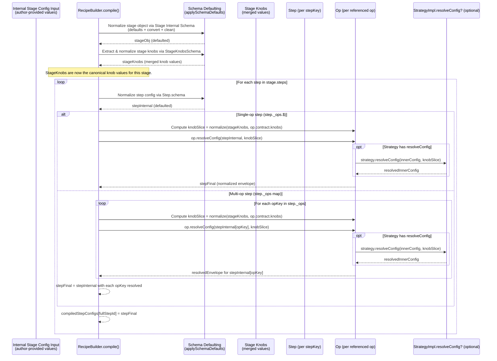

Below are Mermaid diagrams that focus strictly on the **internal config compilation path** (treating the recipe’s input config as already-internal; i.e., public config ignored).

I split this into the major flows that matter for “where does final internal per-step config come from?” and “who reads from whom, in what order?”

---

## Diagram 1 — Static provenance: where internal config structure, defaults, and knob slices come from

This diagram is about **ingredients** (schemas/defaults/slices), not runtime values.

```mermaid
flowchart LR
  %% ======================
  %% Static ingredients
  %% ======================

  subgraph D[Domain (declares)]
    DK[DomainKnobsSchema<br/>(TypeBox object)]
    OC[OpContract(s)<br/>- strategies.* schemas<br/>- knobs slice schema]
  end

  subgraph O[Op (assembled from contract)]
    OE[Op Envelope Schema<br/>(Union of {strategy, config})]
    OD[Op Default Envelope<br/>(strategy: "default", config: Default(strategySchema.default))]
    OR[Op.resolveConfig<br/>(delegates to Strategy.resolveConfig + schema normalize)]
  end

  subgraph ST[Strategy (implementation)]
    SR[Strategy.resolveConfig?<br/>(optional; deterministic)]
    RUN[Strategy.run<br/>(runtime)]
  end

  subgraph S[Step (authoring primitive)]
    SS[Step.schema<br/>(derived from op.configSchema or object of them)]
    SD[Step.defaultConfig<br/>(derived from op.defaultConfig(s))]
    SM[StepModule<br/>(run + schema + defaults + _ops metadata)]
  end

  subgraph G[Stage (composition)]
    SO[Scan Step._ops<br/>(which ops are referenced)]
    KS[StageKnobsSchema<br/>(merge of op.contract.knobs slices)]
    STS[Stage Internal Schema<br/>(knobs fields + stepKey: step.schema)]
  end

  subgraph R[Recipe (compiler)]
    RS[Recipe Internal Schema<br/>(stageKey: StageSchema...)]
    RC[Recipe.compile()<br/>(produces final per-step internal configs)]
  end

  %% Relationships
  DK -->|Pick / Slice| OC
  OC -->|createOp| OE
  OC -->|createOp| OD
  SR -->|wired into| OR
  OE -->|used by| SS
  OD -->|used by| SD
  SS --> SM
  SD --> SM
  SM -->|exposes _ops| SO
  SO --> KS
  KS --> STS
  SM --> STS
  STS --> RS
  RS --> RC
```

Key takeaways:

* **Steps do not invent config**; they **derive** schema/defaults from ops.
* **Stages do not invent knobs**; they **derive** the stage knobs schema from the **op knob slices** used by steps.
* The recipe compiler is the first place where the above are *executed* to produce **final per-step internal configs**.

---

## Diagram 2 — Runtime compilation order inside a stage (values + reads/writes + ordering)

This is the “who reads from whom, and in what order” view. It shows how stage knob values influence op config normalization.



Ordering you should scrutinize for hop-elimination:

1. Stage defaults → stage knobs extraction
2. Step defaults
3. Op-level normalization using knob slices (mechanical pass)

If we remove hops later, we have to preserve this ordering (or justify why it doesn’t matter).

---

## Diagram 3 — Single-op step compilation: explicit data sources for final step config

This isolates the most common case: `step.op(op)`.

```mermaid
flowchart TD
  %% Single-op step compilation

  A[Internal Stage Config Input<br/>stageObj[stepKey] = raw] --> B[Default/clean stepKey via Step.schema]
  B --> C[stepInternal (defaulted)]

  K[StageKnobs (values)<br/>from stageObj knob fields] --> KS[Normalize knobSlice via op.contract.knobs]
  KS --> D[op.resolveConfig(stepInternal, knobSlice)]

  subgraph OP[Inside op.resolveConfig]
    E[Select strategy by envelope.strategy]
    F[Optional strategy.resolveConfig(innerConfig, knobSlice)]
    G[applySchemaDefaults(strategySchema, resolvedInnerConfig)]
    H[Return normalized envelope {strategy, config}]
  end

  D --> OP --> I[Final Step Internal Config<br/>(plan-truth-ready)]
  I --> J[compiledStepConfigs[fullStepId]]
```

Explicit reads:

* Step reads **its raw config** from `stageObj[stepKey]`.
* Step reads **its schema/defaults** from **op.configSchema/op.defaultConfig** (via StepModule derivation).
* Op reads **knobSlice** from **stageKnobs**, which ultimately comes from **domain knobs values** authored at the stage level.

---

## Diagram 4 — Multi-op step compilation: step config is a product of multiple ops + shared stage knobs

This is `step.ops({ a: opA, b: opB, ... })`.

```mermaid
flowchart TD
  %% Multi-op step compilation

  A[Internal Stage Config Input<br/>stageObj[stepKey] = raw object] --> B[Default/clean via Step.schema<br/>(object-of-op-envelopes)]
  B --> C[stepInternal{ a: envA, b: envB, ... }]

  K[StageKnobs (values)] --> K1[opA.contract.knobs slice normalize]
  K --> K2[opB.contract.knobs slice normalize]
  K --> K3[opC.contract.knobs slice normalize]

  C --> D1[opA.resolveConfig(stepInternal.a, knobSliceA)]
  C --> D2[opB.resolveConfig(stepInternal.b, knobSliceB)]
  C --> D3[opC.resolveConfig(stepInternal.c, knobSliceC)]

  D1 --> R1[normalized envA]
  D2 --> R2[normalized envB]
  D3 --> R3[normalized envC]

  R1 --> Z[stepFinal = { a: envA', b: envB', c: envC' }]
  R2 --> Z
  R3 --> Z

  Z --> OUT[compiledStepConfigs[fullStepId] = stepFinal]
```

Explicit reads:

* Stage knobs are read once, but **each op may read a different slice**.
* This is why stage knobs are “global-ish tuning,” but op configs remain per-op plan truth.

---

## Diagram 5 — Whole-recipe compilation: from internal recipe config → final internal per-step configs → ExecutionPlan

This shows how per-stage compilation aggregates into the final internal recipe config that execution uses.

```mermaid
flowchart TB
  %% Whole recipe compilation

  IN[Internal Recipe Config Input<br/>(stageKey objects)] --> R0[RecipeBuilder.compile()]

  subgraph R[RecipeBuilder]
    direction TB
    P1[For each Stage:<br/>default stage + extract stageKnobs]
    P2[For each Step in Stage:<br/>default step config]
    P3[Mechanical op.resolve pass:<br/>apply knobSlice + normalize envelopes]
    P4[Emit compiledStepConfigs:<br/>Map(fullStepId -> stepFinal)]
  end

  R0 --> R

  P4 --> PLAN[ExecutionPlan<br/>steps[].config = compiledStepConfigs[stepId]]
  PLAN --> EXEC[Engine Executor<br/>(PipelineExecutor + StepRegistry)]
```

This diagram is the “final internal config” view:

* The compiled artifact is effectively:
  `compiledStepConfigs: Map<fullStepId, stepFinalInternalConfig>`
* That map is what populates `ExecutionPlan.steps[].config`.

---

### What to tell me next (so we can eliminate hops intelligently)

If your goal is “which steps/hops can be eliminated,” the first thing to decide is whether **stage knobs values** should remain a distinct stage-level object that’s read by ops during compilation, or whether we want to precompute and embed knob effects earlier (e.g., bake knob influence into defaults/derived step configs).

If you answer these two questions, I can redraw a “reduced-hop” variant diagram set:

1. Do you want **stage knobs** to exist as explicit authored values in internal config (separate from per-step configs), or should knobs be “compiled away” into per-step config before op normalization runs?
2. Should op.resolveConfig be allowed to depend on **only stage knobs**, or eventually also on **recipe/root knobs** (global knobs), with precedence rules?

If you do not want to decide yet, I can still propose two concrete hop-elimination options and show the before/after diagrams for each.
