# Hydrology Domain Refactor — Phase 1 Current-State Spike

Purpose: capture **evidence-based current state** (wiring, contracts, boundary violations, and legacy surfaces) for the Hydrology vertical refactor so Phase 2 modeling can reconcile **greenfield intent** with **reality**, not assumptions.

References:
- Workflow (canonical): `docs/projects/engine-refactor-v1/resources/workflow/domain-refactor/WORKFLOW.md`
- Phase 1 template: `docs/projects/engine-refactor-v1/resources/workflow/domain-refactor/references/phase-1-current-state.md`
- Inventory + boundaries reference: `docs/projects/engine-refactor-v1/resources/workflow/domain-refactor/references/domain-inventory-and-boundaries.md`
- Phase 0.5 spike (greenfield sketch): `docs/projects/engine-refactor-v1/resources/spike/spike-hydrology-greenfield.md`

Scope guardrails (do not violate):
- This is **current-state only**. No target modeling and no slice plan.
- Capture **facts** (file paths, callsites, contract ids); defer design choices to Phase 2/3.
- “Greenfield delta notes” may describe *constraints* on Phase 0.5 ideas, but must not become Phase 2 modeling.

---

## Authority stack (for Phase 1)

**Canonical for current-state evidence:**
- `mods/mod-swooper-maps/src/recipes/standard/recipe.ts` (stage order + compile ops wiring)
- `mods/mod-swooper-maps/src/recipes/standard/stages/**` (step contracts + step implementations)
- `mods/mod-swooper-maps/src/domain/hydrology/**` (Hydrology domain exports + internal runtime code)
- `mods/mod-swooper-maps/src/domain/config.ts` (author-facing schema barrel; schema/type-only)

**Supporting (helpful context; not contract truth):**
- `docs/projects/engine-refactor-v1/issues/LOCAL-TBD-M8-U21-foundation-vertical-domain-refactor.md` (mentions intended “Hydrology owns winds/currents” posture; use as supporting reference only)
- `docs/projects/engine-refactor-v1/issues/_archive/LOCAL-TBD-morphology-vertical-domain-refactor.md` (upstream planning notes; use as supporting reference only)

---

## Domain surface inventory (outside view)

This is the set of modules and exports that constitute the current Hydrology “surface” in practice (what steps/domains can import or depend on).

### A) Domain entrypoint (authoring surface)

- `@mapgen/domain/hydrology` → `mods/mod-swooper-maps/src/domain/hydrology/index.ts`
  - Defines `domain = defineDomain({ id: "hydrology", ops })`.
  - Historical note: prior to M9, this surface included `hydrology.ops.computeWindFields`; it is now replaced by `hydrology.ops.computeAtmosphericCirculation` + `hydrology.ops.computeOceanSurfaceCurrents`.
  - Re-exports `HydrologyWindFieldSchema` from `mods/mod-swooper-maps/src/domain/hydrology/ops/shared/wind-field.ts`.

### B) Hydrology ops (contract-first, but minimal)

- `mods/mod-swooper-maps/src/domain/hydrology/ops/contracts.ts`
  - Historical note: references to `compute-wind-fields` below reflect pre-M9 state; current contracts are under `mods/mod-swooper-maps/src/domain/hydrology/ops/**/contract.ts`.

### C) “Climate engine” code under Hydrology

Hydrology currently includes a climate module subtree that is invoked from Hydrology stages and (indirectly) from Narrative.

- `@mapgen/domain/hydrology/climate/index.ts`
  - Entry points:
    - `applyClimateBaseline(...)` (baseline pass)
    - `applyClimateSwatches(...)` (macro swatch pass)
    - `refineClimateEarthlike(...)` (refine pass)
- Core runtime:
  - `@mapgen/domain/hydrology/climate/runtime.ts`
    - `resolveAdapter(...)` (wraps `ctx.adapter` + `ctx.buffers.heightfield` into a `ClimateAdapter`)
    - `createClimateRuntime(...)` (binds rainfall/humidity buffers and IO helpers)
  - `@mapgen/domain/hydrology/climate/types.ts` (interfaces: `ClimateAdapter`, `ClimateRuntime`, `OrogenyCache`, etc.)
- Baseline pass:
  - `@mapgen/domain/hydrology/climate/baseline.ts` (`applyClimateBaseline`)
  - `@mapgen/domain/hydrology/climate/distance-to-water.ts` (`distanceToNearestWater`)
- Refinement pass:
  - `@mapgen/domain/hydrology/climate/refine/index.ts` (`refineClimateEarthlike`)
  - Refinement subpasses (each exported from its file):
    - `applyWaterGradientRefinement`
    - `applyOrographicShadowRefinement` (uses wind fields)
    - `applyRiverCorridorRefinement` (reads adjacency via adapter)
    - `applyRiftHumidityRefinement`
    - `applyOrogenyBeltsRefinement`
    - `applyHotspotMicroclimatesRefinement`
- Swatch pass:
  - `@mapgen/domain/hydrology/climate/swatches/index.ts` (`applyClimateSwatches`)
  - Swatch implementations (exported):
    - `applyMacroDesertBeltSwatch`
    - `applyEquatorialRainbeltSwatch`
    - `applyRainforestArchipelagoSwatch`
    - `applyMountainForestsSwatch`
    - `applyGreatPlainsSwatch`
  - Helper types/selection:
    - `chooseSwatchTypeWeighted(...)`
    - `SwatchRuntime`, `SwatchHelpers`, `SwatchTypesConfig` in `swatches/types.ts`

### D) Stage-local Hydrology utilities (recipe-owned, not domain-owned)

- `mods/mod-swooper-maps/src/recipes/standard/stages/hydrology-core/river-adjacency.ts`
  - `computeRiverAdjacencyMask(ctx, radius=1): Uint8Array`
  - Uses `ctx.adapter.isAdjacentToRivers(...)` (engine-backed).

---

## Step map (all callsites that touch Hydrology)

This is the **complete current step-level map** of where Hydrology logic is called, including cross-domain “inversions” (Narrative calling Hydrology climate functions).

### Standard recipe stage order (current)

From `mods/mod-swooper-maps/src/recipes/standard/recipe.ts`:

1. `foundation`
2. `morphology-pre`
3. `narrative-pre`
4. `morphology-mid`
5. `narrative-mid`
6. `morphology-post`
7. `hydrology-pre`
8. `narrative-swatches`
9. `hydrology-core`
10. `narrative-post`
11. `hydrology-post`
12. `ecology`
13. `placement`

### Steps (Hydrology-proper stages)

**Stage `hydrology-pre`**

- Step `hydrology-pre/lakes`
  - Contract: `mods/mod-swooper-maps/src/recipes/standard/stages/hydrology-pre/steps/lakes.contract.ts`
  - Implementation: `mods/mod-swooper-maps/src/recipes/standard/stages/hydrology-pre/steps/lakes.ts`
  - Calls:
    - `context.adapter.generateLakes(...)` (engine)
    - `syncHeightfield(context)` (mapgen-core)
  - Publishes: `artifact:heightfield` (see contract matrix)

- Step `hydrology-pre/climate-baseline`
  - Contract: `mods/mod-swooper-maps/src/recipes/standard/stages/hydrology-pre/steps/climateBaseline.contract.ts`
  - Implementation: `mods/mod-swooper-maps/src/recipes/standard/stages/hydrology-pre/steps/climateBaseline.ts`
  - Calls:
    - Multiple engine-backed mutation calls prior to baseline (`recalculateAreas`, `buildElevation`, `stampContinents`, etc.)
    - Historical note: prior to M9, this step called `hydrology.ops.computeWindFields(...)` and legacy `applyClimateBaseline(...)`; the refactor replaces these with contract-first climate/ocean ops.
  - Publishes: `artifact:climateField`, `artifact:windField`

**Stage `hydrology-core`**

- Step `hydrology-core/rivers`
  - Contract: `mods/mod-swooper-maps/src/recipes/standard/stages/hydrology-core/steps/rivers.contract.ts`
  - Implementation: `mods/mod-swooper-maps/src/recipes/standard/stages/hydrology-core/steps/rivers.ts`
  - Calls:
    - `context.adapter.modelRivers(...)`, `validateAndFixTerrain()`, `defineNamedRivers()` (engine)
    - Narrative hook: `storyTagClimatePaleo(context, config.climate)` (defined in Narrative domain)
    - Local helper: `computeRiverAdjacencyMask(context)` (stage-local file)
  - Publishes: `artifact:riverAdjacency`
  - Provides (tag): `effect:engine.riversModeled`

**Stage `hydrology-post`**

- Step `hydrology-post/climate-refine`
  - Contract: `mods/mod-swooper-maps/src/recipes/standard/stages/hydrology-post/steps/climateRefine.contract.ts`
  - Implementation: `mods/mod-swooper-maps/src/recipes/standard/stages/hydrology-post/steps/climateRefine.ts`
  - Calls:
    - Hydrology climate: `refineClimateEarthlike(width, height, context, ...)`
    - Overlay readers (recipe-owned): `readOverlayMotifsRifts(...)`, `readOverlayMotifsHotspots(...)`
  - Consumes: wind field + overlays + river adjacency

### Steps (cross-domain consumers of Hydrology artifacts/logic)

**Stage `narrative-swatches` (Narrative-owned step calls Hydrology climate)**

- Step `narrative-swatches/story-swatches`
  - Contract: `mods/mod-swooper-maps/src/recipes/standard/stages/narrative-swatches/steps/storySwatches.contract.ts`
  - Implementation: `mods/mod-swooper-maps/src/recipes/standard/stages/narrative-swatches/steps/storySwatches.ts`
  - Calls:
    - Narrative function `storyTagClimateSwatches(...)` → `mods/mod-swooper-maps/src/domain/narrative/swatches.ts`
      - This calls Hydrology climate `applyClimateSwatches(...)` under the hood.

**Stage `ecology` (multiple steps require Hydrology artifacts)**

- `ecology/biomes` requires `artifact:climateField` + `artifact:heightfield` (and overlays)
- `ecology/pedology` requires `artifact:climateField` + `artifact:heightfield`
- `ecology/features` requires `artifact:climateField` + `artifact:heightfield` (and overlays)
- `ecology/features-plan` requires `artifact:heightfield` (and pedology/biomes outputs)
- `ecology/resource-basins` requires `artifact:climateField` + `artifact:heightfield` (and pedology)

**Stage `narrative-post`**

- `narrative-post/story-corridors-post` requires `artifact:riverAdjacency` (Hydrology output) plus `artifact:morphology.topography` and overlays.

**Stage `placement`**

- `placement/derive-placement-inputs` requires `effect:engine.riversModeled` (Hydrology-provided tag) and `effect:engine.featuresApplied`.

---

## Contract matrix (current-state)

This section is the current producer/consumer contract view: dependency tags plus artifacts (with ids and schema locations).

### A) Hydrology-owned artifacts (produced in Hydrology stages)

**`artifact:heightfield` (Hydrology pre)**
- Defined: `mods/mod-swooper-maps/src/recipes/standard/stages/hydrology-pre/artifacts.ts` (`hydrologyPreArtifacts.heightfield`)
- Schema: `HeightfieldArtifactSchema` uses `Type.Any()` for `elevation/terrain/landMask` (not typed-array schemas).
- Producer: step `hydrology-pre/lakes` publishes `context.buffers.heightfield`.
- Consumers:
  - `hydrology-pre/climate-baseline` (requires)
  - `hydrology-post/climate-refine` (requires)
  - `narrative-swatches/story-swatches` (requires)
  - `ecology/*` (multiple steps require)

**`artifact:climateField` (Hydrology pre)**
- Defined: `mods/mod-swooper-maps/src/recipes/standard/stages/hydrology-pre/artifacts.ts` (`hydrologyPreArtifacts.climateField`)
- Schema: `ClimateFieldArtifactSchema` uses `Type.Any()` for `rainfall/humidity` (not typed-array schemas).
- Producer: step `hydrology-pre/climate-baseline` publishes `context.buffers.climate`.
- Consumers:
  - `hydrology-core/rivers` (requires)
  - `hydrology-post/climate-refine` (requires)
  - `narrative-swatches/story-swatches` (requires)
  - `ecology/*` (multiple steps require)

**`artifact:windField` (Hydrology pre)**
- Defined: `mods/mod-swooper-maps/src/recipes/standard/stages/hydrology-pre/artifacts.ts` (`hydrologyPreArtifacts.windField`)
- Schema: `HydrologyWindFieldSchema` from `@mapgen/domain/hydrology` (typed-array schemas inside op contract)
- Producer: step `hydrology-pre/climate-baseline` publishes the op result `{ windU/windV/currentU/currentV }`.
- Consumers:
  - `hydrology-post/climate-refine` (requires)

**`artifact:riverAdjacency` (Hydrology core)**
- Defined: `mods/mod-swooper-maps/src/recipes/standard/stages/hydrology-core/artifacts.ts` (`hydrologyCoreArtifacts.riverAdjacency`)
- Schema: `Type.Any()` (not typed-array schema)
- Producer: step `hydrology-core/rivers` publishes a `Uint8Array` mask from `computeRiverAdjacencyMask(...)`.
- Consumers:
  - `hydrology-post/climate-refine` (requires)
  - `narrative-post/story-corridors-post` (requires)

### B) Upstream artifacts consumed by Hydrology

**`artifact:morphology.topography` (Morphology pre)**
- Defined: `mods/mod-swooper-maps/src/recipes/standard/stages/morphology-pre/artifacts.ts` (`morphologyArtifacts.topography`)
- Schema: typed-array schema with `elevation: i16[]`, `terrain: u8[]`, `landMask: u8[]`
- Producer: step `morphology-pre/landmass-plates` publishes `context.buffers.heightfield`.
- Hydrology consumer:
  - `hydrology-pre/lakes` requires this artifact, but does not read it explicitly in the step body (dependency gating only).

**`artifact:storyOverlays` (Narrative pre)**
- Defined: `mods/mod-swooper-maps/src/recipes/standard/stages/narrative-pre/artifacts.ts` (`narrativePreArtifacts.overlays`)
- Schema: `Type.Any()` collections (`corridors/swatches/motifs`)
- Producers (non-exhaustive; narrative-pre is multi-step):
  - `narrative-pre/story-seed` provides the overlays artifact
- Hydrology consumers:
  - `hydrology-post/climate-refine` reads overlays and extracts motifs (rifts/hotspots) via recipe overlay readers.

### C) Dependency tags (requires/provides)

Hydrology steps currently use tags minimally.

- Provided by Hydrology:
  - `effect:engine.riversModeled` (from `hydrology-core/rivers.contract.ts`)
- Required downstream:
  - `placement/derive-placement-inputs` requires `effect:engine.riversModeled` (and `effect:engine.featuresApplied`)
- Tag catalog and satisfaction rules:
  - `mods/mod-swooper-maps/src/recipes/standard/tags.ts`

---

## Legacy surface inventory (config properties + rules/policies + functions)

This section inventories the “legacy” authoring and runtime surfaces that must be classified in Phase 2/3 (keep/kill/migrate). In Phase 1, everything is treated as **legacy candidate** unless explicitly called out as already contract-first and properly owned.

### A) Config surface map (schemas + defaults + authoring entrypoints)

**Hydrology climate schema**
- Barrel entry: `@mapgen/domain/config` → `mods/mod-swooper-maps/src/domain/config.ts` (schema/type-only re-export)
- Hydrology climate schema definition (historical): formerly `mods/mod-swooper-maps/src/domain/hydrology/config.ts` (deleted during M9 refactor)

**Hydrology op strategy schema**
- Current contracts live under: `mods/mod-swooper-maps/src/domain/hydrology/ops/**/contract.ts`

**Important current-state contract observation (schema vs runtime)**
- Historical note: this spike predates the contract-first op schema posture; the refactor moves all op configs into step schemas via `defineStep({ ops: ... })` and relies on compiler defaulting.

### B) Config property ledger (Hydrology climate)

Source of truth for historical keys (deleted): formerly `mods/mod-swooper-maps/src/domain/hydrology/config.ts`.

Top-level:
- `climate.baseline.*`
- `climate.refine.*`
- `climate.story.*`
- `climate.swatches.*`

#### `climate.baseline`

`climate.baseline.bands`
- `deg0to10`
- `deg10to20`
- `deg20to35`
- `deg35to55`
- `deg55to70`
- `deg70plus`
- `transitionWidth`
- `edges.deg0to10`
- `edges.deg10to20`
- `edges.deg20to35`
- `edges.deg35to55`
- `edges.deg55to70`

`climate.baseline.sizeScaling`
- `baseArea`
- `minScale`
- `maxScale`
- `equatorBoostScale`
- `equatorBoostTaper`

`climate.baseline.blend`
- `baseWeight`
- `bandWeight`

`climate.baseline.seed`
- `baseRainfall`
- `coastalExponent`

`climate.baseline.orographic`
- `hi1Threshold`
- `hi1Bonus`
- `hi2Threshold`
- `hi2Bonus`

`climate.baseline.coastal`
- `spread`
- `coastalLandBonus`

`climate.baseline.noise`
- `baseSpanSmall`
- `spanLargeScaleFactor`
- `scale`

#### `climate.refine`

`climate.refine.waterGradient`
- `radius`
- `perRingBonus`
- `lowlandBonus`

`climate.refine.orographic`
- `steps`
- `reductionBase`
- `reductionPerStep`

`climate.refine.riverCorridor`
- `adjacencyRadius`
- `lowlandAdjacencyBonus`
- `highlandAdjacencyBonus`

`climate.refine.lowBasin`
- `radius`
- `delta`

#### `climate.story`

`climate.story.rainfall`
- `paradiseDelta`
- `volcanicDelta`
- `riftRadius`
- `riftBoost`

`climate.story.paleo`
- `fossilChannelMinDistanceFromCurrentRivers`
- `maxDeltas`
- `deltaFanRadius`
- `deltaMarshChance`
- `maxOxbows`
- `oxbowElevationMax`
- `maxFossilChannels`
- `fossilChannelLengthTiles`
- `fossilChannelStep`
- `fossilChannelHumidity`
- `bluffWetReduction`
- `sizeScaling.lengthMulSqrt`
- `elevationCarving.enableCanyonRim`
- `elevationCarving.rimWidth`
- `elevationCarving.canyonDryBonus`

#### `climate.swatches`

`climate.swatches.enabled`

`climate.swatches.sizeScaling`
- `widthMulSqrt`
- `lengthMulSqrt`

`climate.swatches.types.<typeKey>`
- `weight` (selection weight; key present on each type config)
- plus type-specific numeric knobs (swatch code treats configs as `Record<string, number | boolean | undefined>`)

Current type keys referenced in code under `mods/mod-swooper-maps/src/domain/hydrology/climate/swatches/index.ts`:
- `macroDesertBelt`
- `equatorialRainbelt`
- `rainforestArchipelago`
- `mountainForests`
- `greatPlains`

### C) Runtime rules/policies (non-trivial semantics in current behavior)

These are behaviorally meaningful policies embedded in current Hydrology climate logic:

- Rainfall is clamped to `[0..200]`; humidity is derived as `(rainfall / 200) * 255` in `createClimateRuntime(...).writeRainfall(...)`.
- Baseline pass uses:
  - latitude bands + blended edges,
  - coastal falloff using a BFS distance-to-water map,
  - orographic “bonus by elevation threshold” (not windward/lee in baseline),
  - Perlin noise modulation with map-size scaling.
- Swatch pass:
  - chooses a swatch type by weighted random (`chooseSwatchTypeWeighted`) and applies it as a macro transform.
  - defines `isCoastalLand` with a local fallback if `adapter.isCoastalLand` is undefined.
- Refinement pass:
  - sequences multiple subpasses (water gradient → orographic shadow → river corridors → rift humidity → orogeny belts → hotspot microclimates).
  - consumes wind fields (`HydrologyWindFields`) and story overlays (rifts/hotspots) as modifiers.

### D) Function inventory (domain + stage-local)

This is the **current function surface** relevant to Hydrology behavior (exported functions + step-local glue).

**Hydrology domain exports**
- Historical note: prior to M9, `hydrology.ops.computeWindFields` existed (deleted); current ops include `hydrology.ops.computeAtmosphericCirculation` and `hydrology.ops.computeOceanSurfaceCurrents` among others.
- `HydrologyWindFieldSchema` (schema)

**Hydrology climate exports**
- `applyClimateBaseline`
- `applyClimateSwatches`
- `refineClimateEarthlike`
- `createClimateRuntime`, `resolveAdapter`
- `distanceToNearestWater`
- Refinement subpasses:
  - `applyWaterGradientRefinement`
  - `applyOrographicShadowRefinement`
  - `applyRiverCorridorRefinement`
  - `applyRiftHumidityRefinement`
  - `applyOrogenyBeltsRefinement`
  - `applyHotspotMicroclimatesRefinement`
- Swatch exports:
  - `applyMacroDesertBeltSwatch`
  - `applyEquatorialRainbeltSwatch`
  - `applyRainforestArchipelagoSwatch`
  - `applyMountainForestsSwatch`
  - `applyGreatPlainsSwatch`
  - `chooseSwatchTypeWeighted`

**Recipe-owned hydrology functions**
- `computeRiverAdjacencyMask` (hydrology-core stage-local file)
- Hydrology stage step implementations:
  - `hydrology-pre/lakes` (engine calls + heightfield publish)
  - `hydrology-pre/climate-baseline` (engine calls + wind op + baseline climate)
  - `hydrology-core/rivers` (engine calls + narrative paleo hook + river adjacency publish)
  - `hydrology-post/climate-refine` (refine climate + overlay motif extraction)

---

## Upstream authoritative input review (non-root scan)

Hydrology is **not the pipeline root** in the standard recipe. It currently depends on upstream outputs in three primary ways:

1) **Morphology topography artifact** (`artifact:morphology.topography`)
- Contract shape is typed-array strict and is meant to represent the canonical “heightfield handle”.
- Hydrology currently introduces a second topography-like artifact (`artifact:heightfield`) that also points to `context.buffers.heightfield`, but its artifact schema is `Type.Any()` in the stage contract.

2) **Narrative overlays artifact** (`artifact:storyOverlays`)
- Schema is `Type.Any()` collections; consumers use recipe-owned readers like `readOverlayMotifsRifts(...)`.
- Hydrology refine consumes rifts/hotspots motifs extracted from overlays.

3) **Engine adapter and engine-backed state**
- Hydrology stage steps mutate engine state directly (`generateLakes`, `modelRivers`, `buildElevation`, etc.).
- Hydrology climate runtime (`resolveAdapter`) is a wrapper over `ctx.adapter` + `ctx.buffers.*`, and requires MapContext (multiple “legacy direct-engine fallback removed” guards).

Upstream note (documentation availability):
- There is no upstream Phase 2 spike for Morphology present under `docs/projects/engine-refactor-v1/resources/spike/` in this checkout. Upstream “authoritative intake” for Phase 1 is therefore based on the **current contracts and code** (artifact ids + schema + callsites) rather than a prior Phase 2 model document.

---

## Upstream handoff review (prior refactor changes affecting Hydrology)

This section lists evidence that Hydrology already includes surfaces introduced by prior refactor work (or refactor-era deletions that constrain what “legacy” means today).

- Hydrology currently owns wind/currents production as an op + artifact:
  - Op: `hydrology/compute-wind-fields`
  - Artifact: `artifact:windField` (Hydrology pre)
  - This aligns with the “Hydrology owns winds/currents” intent referenced in `docs/projects/engine-refactor-v1/issues/LOCAL-TBD-M8-U21-foundation-vertical-domain-refactor.md` (supporting reference only).
- Climate engine functions explicitly require MapContext:
  - `applyClimateBaseline`, `applyClimateSwatches`, and `refineClimateEarthlike` throw if called without `ctx` (“legacy direct-engine fallback removed”).
  - This implies a prior removal of a fallback pathway and constrains refactor options: the climate engine is already MapContext-coupled.

---

## Downstream consumer inventory (non-leaf scan)

Hydrology is **not a leaf** in the standard recipe: it produces artifacts/tags consumed by later stages/domains.

Consumers of `artifact:climateField`:
- Narrative: `narrative-swatches/story-swatches` (also calls Hydrology swatches pass)
- Hydrology: `hydrology-core/rivers`, `hydrology-post/climate-refine`
- Ecology: `ecology/biomes`, `ecology/pedology`, `ecology/features`, `ecology/resource-basins`

Consumers of `artifact:heightfield`:
- Hydrology: `hydrology-pre/climate-baseline`, `hydrology-post/climate-refine`
- Narrative: `narrative-swatches/story-swatches`
- Ecology: `ecology/biomes`, `ecology/pedology`, `ecology/features`, `ecology/features-plan`, `ecology/resource-basins`, plus other ecology steps that require heightfield

Consumers of `artifact:windField`:
- Hydrology: `hydrology-post/climate-refine`

Consumers of `artifact:riverAdjacency`:
- Hydrology: `hydrology-post/climate-refine`
- Narrative: `narrative-post/story-corridors-post`

Consumers of `effect:engine.riversModeled`:
- Placement: `placement/derive-placement-inputs` (required)

Downstream note (coupling inversion):
- Narrative’s swatches code calls Hydrology climate swatches pass (`applyClimateSwatches`), so changes to Hydrology climate API will directly impact Narrative.

---

## Current pipeline map (producer/consumer data-flow snapshot)

This map is factual, current-state only.

### Hydrology-related contracts across the standard pipeline

```mermaid
flowchart LR
  subgraph Morphology
    M1["morphology-pre/landmass-plates\nprovides artifact:morphology.topography"]
  end

  subgraph NarrativePre
    N1["narrative-pre/story-seed\nprovides artifact:storyOverlays"]
    N2["narrative-pre/story-hotspots\nreads overlays + topography"]
  end

  subgraph HydrologyPre
    H1["hydrology-pre/lakes\nrequires morphology.topography\nprovides artifact:heightfield"]
    H2["hydrology-pre/climate-baseline\nrequires artifact:heightfield\nprovides climateField + windField"]
  end

  subgraph NarrativeSwatches
    NS["narrative-swatches/story-swatches\nrequires heightfield+climateField+overlays\ncalls hydrology applyClimateSwatches"]
  end

  subgraph HydrologyCore
    HC["hydrology-core/rivers\nrequires heightfield+climateField\nprovides riverAdjacency + effect:riversModeled"]
  end

  subgraph NarrativePost
    NP["narrative-post/story-corridors-post\nrequires topography+overlays+riverAdjacency"]
  end

  subgraph HydrologyPost
    HP["hydrology-post/climate-refine\nrequires heightfield+climateField+windField+overlays+riverAdjacency\ncalls refineClimateEarthlike"]
  end

  subgraph Ecology
    E["ecology/*\nrequires heightfield+climateField (varies)"]
  end

  subgraph Placement
    P["placement/derive-placement-inputs\nrequires effect:riversModeled"]
  end

  M1 --> N1 --> H1 --> H2 --> NS --> HC --> NP --> HP --> E --> P
```

---

## Greenfield delta notes (Phase 0.5 vs current evidence)

This section lists *constraints* and *contradictions* observed in the current system relative to the Phase 0.5 greenfield sketch. This is not Phase 2 modeling.

### A) Climate realism posture (current)

- Baseline rainfall is primarily driven by **latitude-band targets** plus simple coastal/orographic modifiers (`applyClimateBaseline`).
- Wind/currents production exists (`hydrology/compute-wind-fields`), but it currently uses latitude-driven heuristics for winds and currents, with random jitter and a small set of “jet streaks”.
- Refinement includes multiple microclimate passes (orographic shadow, river corridors, rifts/hotspots modifiers), which is aligned with a “microclimates matter” posture, but is still ultimately layered over a latitude-band baseline.

Implication for Phase 2: the current system already has multiple “climate passes,” but the causal spine is not yet aligned with the Phase 0.5 greenfield emphasis on circulation + ocean coupling as primary drivers.

### B) Domain boundary and ownership (current)

- Hydrology climate functions are called both from Hydrology stages and from Narrative (swatches). This is a concrete coupling inversion that Phase 2 must explicitly account for.
- Hydrology introduces a second topography-like artifact (`artifact:heightfield`) that appears to mirror the Morphology topography buffer handle, but with weaker schema typing (`Type.Any()`).

Implication for Phase 2: the Phase 0.5 boundary sketch (“Hydrology consumes Morphology topography”) is *partially true*, but current contracts suggest a “projection alias” artifact exists and needs explicit disposition.

### C) Contract strictness and typed arrays (current)

- Several Hydrology artifacts use `Type.Any()` rather than typed-array schemas in their artifact contracts.
- Steps compensate by implementing ad-hoc artifact validators in the step implementations.

Implication for Phase 2/3: contract-first, typed-array strictness is not consistently enforced at artifact boundaries in Hydrology stages today.

---

## Decisions + defaults (initial; Phase 1 only)

These are Phase 1 scoping/interpretation decisions (not target-state modeling decisions).

- Include `mods/mod-swooper-maps/src/domain/hydrology/**` and the Hydrology stages (`hydrology-pre`, `hydrology-core`, `hydrology-post`) as “Hydrology domain surface” for refactor inventory.
- Include Narrative swatches callsite (`narrative-swatches/story-swatches` → `storyTagClimateSwatches` → `applyClimateSwatches`) as an in-scope Hydrology coupling for consumer inventory.
- Treat `@mapgen/domain/config` as schema/type-only (per `mods/mod-swooper-maps/src/domain/config.ts`) and inventory its Hydrology-provided fragments as part of Hydrology’s current config surface.

---

## Risk register (initial; current-state risks only)

- Artifact schemas for `artifact:heightfield`, `artifact:climateField`, and `artifact:riverAdjacency` are `Type.Any()` while runtime behavior assumes specific typed arrays; mismatch risk for validation and refactor migration.
- Hydrology climate code is MapContext + adapter coupled; refactor must respect existing “no legacy fallback” posture or explicitly reintroduce/test a new boundary.
- Climate configuration appears in multiple places (step schema + implied op config conventions); risk of hidden defaults and “unknown-bag” behavior unless normalized at a stable boundary.
- Narrative directly calls Hydrology swatches pass; any Hydrology climate API changes must be coordinated with Narrative.
- Engine-backed calls inside Hydrology steps (`buildElevation`, `modelRivers`, etc.) mix responsibilities; refactor must tease apart “what Hydrology owns” vs “what Hydrology triggers” without breaking pipeline semantics.

---

## Golden path candidate (Phase 1)

A minimal “golden path” through current Hydrology behavior that should remain runnable throughout refactor slices:

1) Produce Morphology topography (`morphology-pre/landmass-plates`).
2) Publish Hydrology heightfield (`hydrology-pre/lakes`) and baseline climate + wind (`hydrology-pre/climate-baseline`).
3) Apply swatches (Narrative stage calling Hydrology swatches pass): `narrative-swatches/story-swatches`.
4) Model rivers + publish river adjacency + satisfy `effect:engine.riversModeled`: `hydrology-core/rivers`.
5) Refine climate using overlays + winds + river adjacency: `hydrology-post/climate-refine`.
6) Consume climate outputs downstream (Ecology and Placement stages).

---

## Deletion list (current-state concrete targets; disposition locked in Phase 2/3)

This list is concrete (symbols + file paths) but **not a Phase 2 decision**; it is a Phase 1 inventory of refactor targets that must go to zero *somewhere* in the Hydrology vertical refactor scope.

- `Type.Any()` artifact schemas in Hydrology stages:
  - `mods/mod-swooper-maps/src/recipes/standard/stages/hydrology-pre/artifacts.ts` (`HeightfieldArtifactSchema`, `ClimateFieldArtifactSchema`)
  - `mods/mod-swooper-maps/src/recipes/standard/stages/hydrology-core/artifacts.ts` (`RiverAdjacencyArtifactSchema`)
- Step-local artifact validators that re-implement typed-array validation logic:
  - `mods/mod-swooper-maps/src/recipes/standard/stages/hydrology-pre/steps/lakes.ts`
  - `mods/mod-swooper-maps/src/recipes/standard/stages/hydrology-pre/steps/climateBaseline.ts`
  - `mods/mod-swooper-maps/src/recipes/standard/stages/hydrology-core/steps/rivers.ts`
- Hydrology-owned “alias” artifact surface that mirrors upstream morphology topography:
  - `mods/mod-swooper-maps/src/recipes/standard/stages/hydrology-pre/artifacts.ts` (`artifact:heightfield`)
  - (Disposition TBD: delete vs rename vs migrate to direct `artifact:morphology.topography` usage.)
- Coupling inversion where Narrative calls Hydrology swatches pass:
  - `mods/mod-swooper-maps/src/domain/narrative/swatches.ts` (calls `applyClimateSwatches`)
  - (Disposition TBD: keep as consumer integration or move swatches ownership.)

---

## Lookback 1

What was surprising or important:
- Hydrology already contains a “climate engine” subtree with multiple refinement passes and microclimate hooks (rifts/hotspots/orogeny), but the baseline is still latitude-band driven.
- Contract strictness is uneven: several artifacts are `Type.Any()` even though steps and domain logic assume typed arrays with strict length invariants.
- Hydrology is coupled in two directions: downstream consumes its artifacts/tags, and Narrative calls into Hydrology’s climate swatch pass.

What remains ambiguous (for Phase 2 modeling to resolve explicitly):
- Whether `artifact:heightfield` should exist at all (vs using Morphology’s `artifact:morphology.topography` directly).
- Where op strategy config should live authoritatively in the refactored Hydrology boundary (step schema vs op contract vs normalized internal config).
- How to reconcile “Hydrology owns climate” with the current split where Narrative owns swatches but calls Hydrology code.
