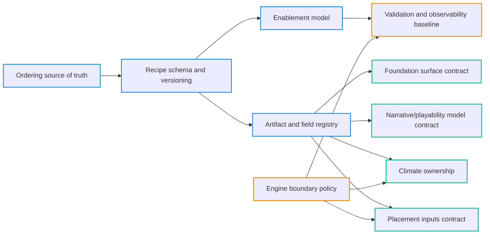

# Spike (Target): Design/Directive Grab Bag (Staging)

This file consolidates **target/directive/design** material extracted from historical spikes.
It is **not canonical**; use it as a manual reconciliation staging area against:
- `docs/projects/engine-refactor-v1/resources/SPEC-target-architecture-draft.md`

Sources are grouped by original spike filename.

---

## Source: SPIKE-m6-architecture-spec-prework-audit.md

> Extracted target/directive/design blocks only. Ground truth and drift are extracted separately in: `spike-current-m6-system.md` and `spike-drift-m6-vs-spec.md`.

# SPIKE — M6 Target Architecture SPEC Prework Audit

This doc is a **scratch/workbook** for tightening the final target architecture SPEC.
It is **not canonical**: use it to make decisions and then promote the settled declarations into `SPEC-target-architecture-draft.md`.

## Hard decisions locked (treat as final)

These are now **directives** for the next phase and must be reflected in the final SPEC (no branching, no compatibility story), except where explicitly marked “open”.

1) **Config SSOT (final):** recipe config is composed + validated (step → stage → recipe). No `MapGenConfig`-shaped “global overrides” and no official `ctx.config` bag access.
2) **Run settings access (final):** settings are a run-level input, and steps access them via **context-carried settings** (e.g. `context.settings`) without changing the step `run(context, config)` signature.
3) **Tag ownership (open):** explore a “domain-owned tag language / contract modules” design; do not lock this in SPEC until explicitly confirmed.
4) **Domain boundary (final):** domain modules are pure; steps own engine semantics (adapter/context/artifact publication).
5) **Step module standard (final):** single-file step modules; ban `steps/index.ts` barrels; prefer decomposition into more steps over per-step directory forests.
6) **Core public surface (final):** mod-facing API is authoring-first; mods must not import from `@swooper/mapgen-core/engine` (treat as a leak to clean up). Explicitly sanctioned `lib/*` imports must be listed in SPEC.
7) **Artifact immutability (final):** artifact values are immutable snapshots and this is **enforced**, not advisory.
8) **Context naming (final):** rename `context.fields` → `context.buffers`. Retire the term “fields” entirely.
9) **Buffers vs artifacts separation (final):** buffers are mutable run state; artifacts are immutable published snapshots. Do not publish buffers as artifacts to satisfy dependency gating.

## Why this exists

M6 landed the major wiring refactor (authoring SDK + plan compiler + executor + mod-owned content package), but the canonical SPEC drifted vs. what shipped. Before editing the SPEC, this SPIKE captures:

- what M6 **actually does** (code-grounded),
- earlier **decisions already recorded** in ADR/issues,
- the remaining **choice points** (config model, tag composition, domain vs step boundary, step module standard, core import surface),
- concrete **options** with tradeoffs.


## Prior decisions already captured (don’t reinvent)

### Pipeline boundary and config intent (project ADRs)

- **Boundary input is** `RunRequest = { recipe, settings }` (not a monolithic `MapGenConfig`).
  - `docs/projects/engine-refactor-v1/ADR.md` (ADR-ER1-003)
- **Cross-cutting directionality belongs in `settings`**, not in `ctx.config.foundation.*` or duplicated across step configs.
  - `docs/projects/engine-refactor-v1/ADR.md` (ADR-ER1-019)

### Authoring decisions (issue decision records)

- **Authoring enforces schemas** (`createStep` requires a schema); engine runtime remains permissive (for legacy call sites).
  - `docs/projects/engine-refactor-v1/issues/LOCAL-TBD-M6-U02-1-define-authoring-pojos-and-schema-requirements.md`
- **`instanceId` intended to be recipe-occurrence-only** (validate uniqueness in authoring).
  - `docs/projects/engine-refactor-v1/issues/LOCAL-TBD-M6-U02-1-define-authoring-pojos-and-schema-requirements.md`
- **Tag definitions are inferred from step usage with explicit overrides** (instead of requiring fully explicit catalogs for every tag).
  - `docs/projects/engine-refactor-v1/issues/LOCAL-TBD-M6-U02-2-implement-createrecipe-registry-plumbing-and-api-surface.md`

### Standard recipe tag catalog decision (M6 issue record)

- Standard recipe owns a recipe-local `tags.ts` and passes it into `createRecipe({ tagDefinitions })`.
  - `docs/projects/engine-refactor-v1/issues/LOCAL-TBD-M6-U05-2-compose-standard-recipe-and-tag-definitions-via-authoring-sdk.md`


### Target (final): composed + validated recipe config is the only config model

Directive: the final SPEC must describe **only** this model.

- Each step owns a TypeBox config schema and derived TS type.
- Each stage config is a composition of its steps’ configs.
- Each recipe config is a composition of its stages’ configs.
- A map file authors **one config surface** for a chosen recipe: `RecipeConfigOf<typeof stages>` (strongly typed) which is validated/defaulted at compile time.
- `ExtendedMapContext.config` is not part of the target authoring/runtime model; any remaining reads are remediation targets.

## Artifact immutability (target, enforced)

### Decision (locked)

Artifact **values** are immutable snapshots: once published into the artifact store, they must not be mutated.

This is an intentional design constraint (not just convention) and must be **enforced** by the publishing mechanism.

### Enforcement rule (target)

- Artifact publication must **deep-immobilize** the artifact value at publish time (freeze / deep-freeze semantics).
- Artifact payloads are restricted to “snapshot-friendly” data:
  - primitives, arrays, and plain objects (JSON-ish trees)
  - `Readonly<Record<string, unknown>>`-style shapes and nested readonly collections
- Disallowed as artifact payloads:
  - typed arrays and other mutable buffers (`Uint8Array`, `Int16Array`, etc.)
  - `Map`/`Set`
  - class instances with mutable internal state
  - functions
- Large/mutable numeric state belongs in `context.buffers` / `context.staging`, not in artifacts.

### Why this matters (non-optional semantics)

- `requires/provides` only makes sense if “provided” means “stable snapshot exists now”.
- Prevents action-at-a-distance: downstream steps cannot mutate upstream artifacts via shared references.
- Supports replay/debug/diff by ensuring artifacts are stable by construction.


## Context naming: `fields` → `buffers` (target)

### Decision (locked)

- Rename `context.fields` → `context.buffers`.
- Retire “fields” as a term in the runtime/authoring API: all “fields” are mutable buffers in practice.

### Implementation blast radius (for the later execution pass)

- Rename touches core types (`ExtendedMapContext`, `createExtendedMapContext`) plus all mod steps and tag-contract `satisfies` checks referencing `context.fields`.


## Decision record: buffers vs artifacts separation (immutable artifacts; mutable buffers)

### Decision (locked)

We commit to a hard separation:

- **Artifacts are immutable snapshots.**
  - “Publish artifact” means “store an immutable value that downstream steps can rely on as stable”.
- **Buffers are mutable run state.**
  - Buffers are where generation writes evolving world state and intermediate working data (typed arrays, caches, staging tensors).
- **Do not publish buffers as artifacts.**
  - Using `context.artifacts` as a registry for typed-array buffers is a transitional misuse and is not allowed in the target.

Canonical step context shape (for now):

- `context.buffers` (mutable)
- `context.artifacts` (mutable store of **immutable values**)
- `context.settings` (immutable run settings)
- `context.overlays` (optional, non-canonical derived debug cache; never required for correctness)

### Intent / architectural direction

Make the system legible:

- “Mutable world state” is clearly contained under buffers.
- “Published results” are clearly contained under artifacts.
- Dependency gating (“requires/provides”) must be able to refer to both **without forcing buffers through artifacts**.


### Target (what changes)

In the target architecture:

- **Buffers stay in `context.buffers`** and are satisfied/validated as buffers.
- **Artifacts stay in `context.artifacts`** and are enforced-immutable snapshots.
- Steps that currently “publish a buffer artifact” instead:
  - **provide a buffer dependency** (readiness contract) and
  - write/read the underlying data via `context.buffers`.

This requires tightening an architectural seam in the dependency system:

- The gating model must support “buffer readiness” dependencies that validate against `context.buffers` (sizes, presence, invariants) without copying the data into artifacts.

### Problem this solves

- Restores a clean mental model: mutable buffers vs immutable artifacts.
- Makes artifact immutability enforcement feasible and meaningful.
- Clarifies what the dependency system is actually gating: stable snapshots vs mutable state availability.

### Boundaries (what this decision does NOT decide)

- **Overlays**: whether overlays live as artifacts or a separate context surface is explicitly **TBD** and must be decided in a separate session.
- The exact internal organization of buffers (world vs work vs staging) is not settled here; we only commit that they are all **buffers** and are mutable.

### Open questions / follow-ups (explicit)

- **Dependency gating detail (needs design):**
  - Where do buffer dependency contracts live and how are they inferred/declared?
  - What are the canonical satisfiers for buffer readiness (presence + size + shape + version)?
- **Buffer taxonomy (needs design):**
  - Do we standardize a `context.buffers.<area>` hierarchy (e.g., `world`, `foundation`, `scratch`) or keep a flat structure?
  - How do we represent “work buffers” vs “world buffers” without reintroducing confusing terminology?

Concrete grounding for the “validated/defaulted” claim:

- Step config validation/defaulting already happens during plan compile via TypeBox, per step schema:
  - `packages/mapgen-core/src/engine/execution-plan.ts` (`normalizeStepConfig`, `buildNodeConfig`)

Explicit remediation targets implied by this decision:

- Delete the “MapGenConfig overrides → recipe config mapping” mechanism:
  - `mods/mod-swooper-maps/src/maps/_runtime/standard-config.ts` (`StandardRecipeOverrides`, `buildStandardRecipeConfig`)
- Eliminate the remaining “monolithic config bag” reads:
  - `mods/mod-swooper-maps/src/recipes/standard/stages/hydrology-post/steps/climateRefine.ts`
  - `mods/mod-swooper-maps/src/domain/narrative/tagging/rifts.ts`

Note: `mods/mod-swooper-maps/src/config/AGENTS.md` currently encodes a centralization rule for config ownership. The target architecture intentionally revises that rule to match composed SSOT; this must be explicit in the final SPEC when promoted.


## Run settings vs context vs config (ADR intent + minimal wiring)

### ADR intent (in plain language)

ADR-ER1-019 exists because “directionality” is:

- cross-cutting (many steps want it),
- semantically run-level (a policy/knob),
- and becomes ambiguous if stored as “someone’s config” (forces duplication or hidden “read another step’s config” dependencies).

So the decision is: **directionality is a `RunRequest.settings` concern** and steps consume it from **settings** (not from `ctx.config.foundation.*` and not from other steps’ config).

- `docs/projects/engine-refactor-v1/ADR.md` (ADR-ER1-019)
- The review record explicitly calls out the current drift and recommends `context.settings`:
  - `docs/projects/engine-refactor-v1/reviews/REVIEW-M5-proposal-clean-architecture-finalization.md` (m5-u09-def-016 review)


### Target (final): context-carried settings, no step signature change

Minimal, concrete wiring to make ADR intent real (Option A):

1) Add `settings: RunSettings` onto the runtime context type (e.g. `ExtendedMapContext.settings: RunSettings`).
2) Attach the plan’s **normalized** settings to the context once per run in `createRecipe(...).run(...)` (authoring layer):
   - Compile the plan, then set `context.settings = plan.settings`, then execute the plan.
3) Steps read settings via `context.settings.*` (e.g. `context.settings.directionality`).

This keeps `run(context, stepConfig)` intact and does not create a second “hidden” settings surface: the context field is simply the runtime attachment of the already-validated `RunRequest.settings`.


### Terminology audit: “tag” is overloaded (disambiguate + possibly rename)

This system uses “tag” to mean at least three unrelated things. Untangling the words makes the ownership decision (T0/T1/T2) clearer.

**Where “tag” shows up today (what it actually means)**

- **Pipeline dependency IDs** (strings): `DependencyTag` values in `requires`/`provides` (e.g. `artifact:*`, `buffer:*` (today: `field:*`), `effect:*`).
  - `packages/mapgen-core/src/engine/types.ts`
- **Pipeline dependency registry + runtime contracts**: `TagRegistry` + `DependencyTagDefinition` (`kind`, optional `satisfies(context, state)`, optional `demo`, optional `owner`).
  - `packages/mapgen-core/src/engine/tags.ts`
  - Used by the executor to validate missing/unsatisfied dependencies.
    - `packages/mapgen-core/src/engine/PipelineExecutor.ts`
- **“Artifact tags”** in core types are actually **artifact dependency IDs** used as `context.artifacts` keys (e.g. `FOUNDATION_*_ARTIFACT_TAG = "artifact:..."`).
  - `packages/mapgen-core/src/core/types.ts`
- **Effect “tags”** are really **engine effect IDs** (some come from `@civ7/adapter` as `ENGINE_EFFECT_TAGS.*`).
  - `mods/mod-swooper-maps/src/recipes/standard/tags.ts`
- **Civ7 plot tags** are a separate engine concept: numeric plot tag IDs set on tiles (`PLOT_TAG.*`, `PlotTagName`, `adapter.getPlotTagId(...)`).
  - `packages/mapgen-core/src/core/plot-tags.ts`
- **“Story tagging”** is narrative overlay classification (domain algorithms that pick tile-key sets and, in M6, write `StoryOverlaySnapshot` snapshots into `ctx.overlays`; target: views are derived on demand from published story entries). It is unrelated to pipeline dependency tags.
  - `mods/mod-swooper-maps/src/domain/narrative/tagging/**`

**Clean semantic buckets (distinct concepts currently shoved under “tag”)**

1. **DependencyKey** — the string a step declares in `requires`/`provides` (today: `DependencyTag`).
   - Role: drives scheduling/integrity checks in the executor.
   - Shape: string with kind prefix (`artifact:` / `buffer:` / `effect:`) (today: `field:` instead of `buffer:`).
   - Ownership: pipeline contract (not pure domain, not Civ7 adapter).
2. **DependencyDefinition** — the runtime-checkable contract for a `DependencyKey` (today: `DependencyTagDefinition` in a `TagRegistry`).
   - Role: enforces postconditions (`satisfies`) and optionally carries `demo`/`owner` metadata.
   - Shape: ID + kind + optional engine-coupled satisfier.
   - Ownership: pipeline contract (allowed to be engine-aware).
3. **ArtifactKey** — a `DependencyKey` of kind `artifact:`; usually a key into `context.artifacts` (today: many `*_ARTIFACT_TAG` constants).
   - Role: names a published data product in the pipeline.
   - Note: in M6, some `artifact:*` dependencies are satisfied via custom `satisfies(...)` logic against *other* context stores (e.g. story overlays), so “artifact” is best read as “data-product dependency”, not strictly “`context.artifacts` storage key”.
   - Ownership: pipeline contract; payload schemas/types may be domain-owned, but publication/verification is step/contract-owned.
4. **BufferKey** — a `DependencyKey` of kind `buffer:` that asserts a specific buffer exists on `context.buffers` (e.g. `buffer:rainfall`).
   - Role: integrity check for “this buffer is present/initialized”.
   - Ownership: pipeline contract; its relationship to `keyof MapBuffers` is core-owned.
5. **EffectKey** — a `DependencyKey` of kind `effect:` that asserts some engine-side effect has been applied (verified via adapter).
   - Role: integrity check for “engine state guarantees”.
   - Ownership: adapter-integration contract (engine-aware).
6. **PlotTagId** — numeric tile tags in Civ7 (unrelated to pipeline dependencies).
   - Ownership: adapter/Civ7 integration.
7. **StoryTileKey / overlay membership keys** — string tile coordinate keys (via `storyKey(x, y)`) stored in story overlays.
   - Ownership: domain concepts (narrative overlays), not pipeline dependency contract language.

**Proposed naming (SPEC-level terminology; no code changes yet)**

- Prefer **“dependency”** over **“tag”** for the pipeline contract language:
  - `DependencyTag` → **`DependencyKey`** (or `DependencyId`)
  - `DependencyTagDefinition` → **`DependencyDefinition`** (or `DependencyContract`)
  - `TagRegistry` → **`DependencyRegistry`** (optional; could keep “registry” but retire “tag” in docs)
  - `tagDefinitions` (recipe authoring input) → **`dependencyDefinitions`**
  - `*_ARTIFACT_TAG` constants → **`*_ARTIFACT_KEY`** / `*_ARTIFACT_ID`
- Keep **“plot tag”** as a Civ7 term, but avoid using “tag” for pipeline dependencies in the canonical SPEC.
- Treat “story tagging” in docs as **“story overlay classification”** (keep function names for now; just don’t conflate it with dependency tags).

**How this reframes T0/T1/T2**

- Under this naming, the ownership decision becomes: where do **`DependencyKey`** and **`DependencyDefinition`** live?
  - T0 (recipe-root only): `recipes/standard/dependencies.ts` (keys + definitions) → simplest, highest god-catalog risk.
  - T1 (domain/contracts own IDs): `domain/contracts/dependencies.ts` owns keys (+ payload schemas); recipe/stages own definitions → only works if domain never exports engine-coupled satisfiers.
  - T2 (dedicated contracts layer): `contracts/dependencies/**` owns keys + definitions; domain stays pure → cleanest match to “domain is pure; steps own engine semantics”.

Recommendation for SPEC terminology (once we promote): retire “tag” as the primary name for pipeline dependencies; keep “tag” only for Civ7 plot tags (and optionally as legacy code identifiers).


### Composition patterns to choose from (2–3 viable standards)

**Pattern 1: Single recipe-wide `tags.ts` (today’s shape)**

- Pros: easiest to find “the tag language”, simplest wiring, minimal composition boilerplate.
- Cons: tends to become a “god catalog” as tags grow; weak ownership signals.

**Pattern 2: Per-stage `tags.ts` composed at recipe root**

- Idea: `stages/<stageId>/tags.ts` exports:
  - tag IDs introduced/owned by the stage, and
  - `DependencyTagDefinition[]` for those tags (especially `satisfies` for artifacts/effects it provides).
- `recipes/standard/recipe.ts` composes `tagDefinitions: [...foundationTags, ...morphologyTags, ...]`.
- Pros: ownership + colocation improves (“who owns this artifact/effect?”); reduces god-file pressure.
- Cons: cross-stage artifacts (provided in one stage, consumed later) need a clear ownership rule; composition ordering/duplication risk needs discipline.

**Pattern 3: Contract-sliced modules (artifacts/fields/effects)**

- Idea: keep a small ID catalog, but split definitions by kind:
  - `contracts/artifacts.ts`, `contracts/fields.ts`, `contracts/effects.ts`
- Pros: avoids an unstructured mega-file while keeping discoverability.
- Cons: still central; may just re-create a smaller set of “catalog files”.

Open question for the SPEC: do we want tag definition “ownership” to track:

- the producing step/stage,
- the artifact contract module (independent of producers),
- or “the recipe” as the owner of the whole contract language?

### Proposed “tags live in domain (contract)” variants (open; bring back options)

This idea already shows up implicitly today: several domain modules import `M3_DEPENDENCY_TAGS` via `@mapgen/domain/tags.js`, which is currently a recipe re-export:

- `mods/mod-swooper-maps/src/domain/tags.ts` re-exports from `recipes/standard/tags.ts`

If domain is “pure” in the target architecture, that shim must be removed. A domain-owned tag language module is a plausible replacement — but we must keep engine semantics (e.g. `satisfies(ctx)`) out of pure domain.

Two code-shaped options to consider:

**Option T1: Pure domain owns tag IDs + artifact payload schemas; recipe owns tag verifiers**

- `domain/contracts/tags.ts` exports IDs (no context usage):

  ```ts
  export const TAG = {
    artifact: { heightfield: "artifact:heightfield" },
    effect: { landmassApplied: "effect:engine.landmassApplied" },
  } as const;
  ```

- `recipes/standard/tags.ts` becomes “explicit definition overrides only” (owners/demos/satisfies), composed from per-stage modules if desired.

**Option T2: A dedicated mod “contracts” layer owns both IDs and `DependencyTagDefinition`s (not `domain/`)**

- Create `mods/mod-swooper-maps/src/contracts/tags/**` (or similar) for the pipeline contract language.
- Keep `domain/**` pure operations only.
- Steps import IDs from `contracts/tags` and declare `requires/provides` with those IDs.
- Recipe imports the definition arrays from `contracts/tags` and passes them to `createRecipe({ tagDefinitions })`.

Recommendation to validate next: **T1** if we want to keep “domain” strictly pure; **T2** if we want a first-class “contract” layer that is allowed to know about engine satisfaction (`satisfies`) and demo payloads.


### Target (final): “Domain is pure; steps own engine + pipeline semantics.”

- Domain:
  - no `ExtendedMapContext`, no `ctx.adapter`, no `ctx.artifacts`, no `ctx.overlays`.
  - accepts plain data and returns plain data.
  - may define operation-level TypeBox schemas and TS types for inputs/outputs.
- Steps:
  - are the only place that mutates adapter state and publishes artifacts.
- Consequence: refactors are required for current domain modules that read/publish artifacts or call adapter directly.

Concrete “likely move/split” candidates under either rule set:

- Move/split engine-glue placement into the placement step/stage:
  - `mods/mod-swooper-maps/src/domain/placement/**`
- Move artifact publication out of domain narrative modules into their steps:
  - `mods/mod-swooper-maps/src/domain/narrative/**` (listed above where `ctx.artifacts.set` occurs)
- Re-evaluate recipe-coupled shims:
  - `mods/mod-swooper-maps/src/domain/tags.ts`
  - `mods/mod-swooper-maps/src/domain/artifacts.ts`


Target alignment with the pure-domain boundary:

- Domain operations return results (plain data) and never publish artifacts/tags.
- Steps decide which returned results become artifacts (store them in `context.artifacts`) and which dependency tags they provide.


### Target (final): single-file steps, no step barrels

- Keep step modules as-is.
- Delete `stages/<stageId>/steps/index.ts`; import step modules directly from stage `index.ts`.
- Primary win: remove pointless indirection without changing the step standard.


### Target (final): authoring-first mod API; ban `/engine` imports

Observed import paths used by `mods/mod-swooper-maps/src/**` (counts from `rg`):

- `@swooper/mapgen-core` (118)
- `@swooper/mapgen-core/authoring` (38)
- `@swooper/mapgen-core/lib/math` (16), `@swooper/mapgen-core/lib/grid` (11), plus a small set of other `lib/*` subpaths
- `@swooper/mapgen-core/engine` (2) — **leaks** (`RunSettings`, `DependencyTagDefinition`, `TagOwner`)

Concrete target contract work implied by this decision:

1) Re-export the minimal authoring-needed engine types from `@swooper/mapgen-core/authoring` so mods never need `/engine`:
   - `RunSettings`
   - `DependencyTagDefinition`
   - `TagOwner`
2) Explicitly list sanctioned `lib/*` imports in the SPEC (based on actual usage today):
   - `@swooper/mapgen-core/lib/math`
   - `@swooper/mapgen-core/lib/grid`
   - `@swooper/mapgen-core/lib/noise`
   - `@swooper/mapgen-core/lib/plates`
   - `@swooper/mapgen-core/lib/heightfield`
   - `@swooper/mapgen-core/lib/collections`

Note: `packages/mapgen-core/src/index.ts` currently re-exports `@mapgen/engine/index.js` from the root package. The target import story should avoid making engine internals reachable via the root entrypoint; this is a core SDK layout/publishing decision to capture in the final SPEC.


Initial classification (for SPEC promotion later):

- `map-init.ts`, `helpers.ts`, `types.ts`: look like **reusable, canonical Civ7 runtime integration** and should move out of the mod into a shared runtime surface (core SDK or a dedicated runtime package).
- `standard-config.ts`: conflicts with the “composed config SSOT” decision; should be removed/rewritten as part of remediation (no legacy mapping).


## Remaining open decisions before editing the canonical SPEC

1) **Tag definition ownership + composition standard (open)**
   - Decide whether tag IDs + contracts live under pure `domain/contracts/*` (T1) or a dedicated `contracts/*` layer (T2),
     and whether recipe aggregates per-stage modules or uses a single recipe-wide contract module.

## Rename brief (SPIKE-only): pipeline dependency system terminology (Bucket A)

### Bucket A: Pipeline dependency system (requires/provides gating)

**What this “tag” system actually is:** a runtime-validated dependency graph for pipeline execution. Steps declare dependency **IDs** in `requires` / `provides`. At runtime, a registry holds optional **contracts** for those IDs (kind + optional satisfaction predicate + demos), and the executor gates step execution on “satisfied” dependencies.

This section is a **terminology + rename workbook** only. No code renames yet.

#### Current symbol inventory (today in code)

- **Dependency IDs (the keys in `requires`/`provides`)**
  - `DependencyTag` (alias `string`)
  - `DependencyTagKind` (`"artifact" | "field" | "effect"`)
- **Contracts (runtime metadata for an ID)**
  - `DependencyTagDefinition` (fields: `id`, `kind`, optional `owner`, `satisfies`, `demo`, `validateDemo`)
  - `TagOwner` (`pkg`, `phase`, optional `stepId`)
- **Registry**
  - `TagRegistry` (stores `DependencyTagDefinition` by `id`; validates known IDs; enforces kind↔prefix compatibility on registration)
- **Key functions**
  - `validateDependencyTag`, `validateDependencyTags`
  - `isDependencyTagSatisfied`
  - `computeInitialSatisfiedTags`
- **Errors**
  - `DependencyTagError`
  - `InvalidDependencyTagError`, `UnknownDependencyTagError`, `DuplicateDependencyTagError`
  - `InvalidDependencyTagDemoError`

#### Rename candidates (updated to reflect current naming preference)

Note: earlier draft terminology used `DependencyKey` / `DependencyDefinition`. Updated preference is **explicit “Id/Contract”** naming.

- **Types / interfaces**
  - `DependencyTag` → `DependencyId`
  - `DependencyTagKind` → `DependencyKind`
  - `DependencyTagDefinition` → `DependencyContract`
  - `TagOwner` → `DependencyOwner`
- **Registry (decision: lock name now)**
  - `TagRegistry` → `DependencyRegistry` (**final**)
    - Rationale: mirrors `StepRegistry` (same role class name), communicates runtime lookup + validation semantics, and avoids the “static list” vibe of names like “manifest”.
- **Satisfaction**
  - `isDependencyTagSatisfied` → `isDependencySatisfied`
    - Semantics: “given a dependency ID + registry + satisfaction state, is it satisfied for this context?”

#### Validation & error naming (ID vs contract clarity)

**Goal:** names should reveal whether we’re validating **dependency IDs** (known/well-formed/registered) vs validating **dependency contracts** (definition object correctness).

- `validateDependencyTag(tag, registry)` → `validateDependencyId(id, registry)` (**final**)
  - What it enforces (decision: lock semantics now): “ID is a non-empty string AND is registered/known in the `DependencyRegistry`.”
- `validateDependencyTags(tags, registry)` → `validateDependencyIds(ids, registry)` (**final**)
  - Same semantics for lists.
- Contract validation (decision: lock naming approach now)
  - Rename `TagRegistry.registerTag(definition)` → `DependencyRegistry.registerContract(contract)` (**final**)
  - Rename `TagRegistry.registerTags(definitions)` → `DependencyRegistry.registerContracts(contracts)` (**final**)
  - Rationale: contract validation stays coupled to contract registration (duplicate ID, kind↔prefix compatibility, demo validation). We do not expose a separate `validateDependencyContract` function as part of the public surface unless/until a real call site needs it.

#### Error type renames (updated to reflect preference)

- `DependencyTagError` → `DependencyError`
- `InvalidDependencyTagError` → `InvalidDependencyIdError`
- `UnknownDependencyTagError` → `UnknownDependencyIdError`
- `DuplicateDependencyTagError` → `DuplicateDependencyIdError`
- `InvalidDependencyTagDemoError` → `InvalidDependencyDemoError`

#### “Initial satisfied” naming + semantics (decision: lock now)

- `computeInitialSatisfiedTags(context)` → `computeInitialSatisfiedDependencyIds(context)` (**final**)
  - What it does today: returns an empty `Set<string>`; satisfaction begins empty and grows only via explicit `provides`.
  - Semantic decision: keep the hook, but the default semantics remain “nothing is pre-satisfied”; any future introduction of pre-satisfied dependency IDs is a behavior change and must be justified explicitly (not a casual convenience).

#### Prework run prompt (later): Bucket A mechanical rename mapping + patch

Use this prompt when we’re ready to execute the **mechanical** rename across code (no behavior changes). Do not run it until explicitly requested.

Prompt:

“Create a single, reviewable, mechanical-rename change that implements the locked Bucket A dependency terminology across the repo.

1) Produce a **final mapping list** (old → new) for every public symbol in the pipeline dependency system (types/interfaces/classes/functions/errors) including:
   - `DependencyTag` → `DependencyId`
   - `DependencyTagKind` → `DependencyKind`
   - `DependencyTagDefinition` → `DependencyContract`
   - `TagOwner` → `DependencyOwner`
   - `TagRegistry` → `DependencyRegistry`
   - `validateDependencyTag(s)` → `validateDependencyId(s)`
   - `isDependencyTagSatisfied` → `isDependencySatisfied`
   - `computeInitialSatisfiedTags` → `computeInitialSatisfiedDependencyIds`
   - `DependencyTagError` → `DependencyError`
   - `InvalidDependencyTagError` → `InvalidDependencyIdError`
   - `UnknownDependencyTagError` → `UnknownDependencyIdError`
   - `DuplicateDependencyTagError` → `DuplicateDependencyIdError`
   - `InvalidDependencyTagDemoError` → `InvalidDependencyDemoError`
   - Rename `TagRegistry.registerTag(s)` to `DependencyRegistry.registerContract(s)` (and `registerTags` → `registerContracts`) while preserving behavior.

2) Identify and list any **public re-export entrypoints** that need to change (e.g., `packages/mapgen-core/src/engine/index.ts`, root `index.ts`, `authoring` re-exports), and ensure exports remain coherent.

3) Apply the mechanical rename across call sites in:
   - `packages/mapgen-core`
   - `mods/mod-swooper-maps`
   - `packages/civ7-adapter` (only where it references the dependency system; do not rename Civ7 plot tags)

4) Explicit non-goals:
   - No ownership refactors (T0/T1/T2 remains unchanged)
   - No runtime behavior changes
   - Do not rename Civ7 plot tags (`PLOT_TAG`, `getPlotTagId`, `PlotTagName`)
   - Do not rename narrative ‘storyTag*’ functions yet

5) Validate with the workspace’s standard checks (pnpm scripts).”

---

### Bucket B — Dependency ID catalogs & constants (M3/M4, adapter effect IDs, `*_ARTIFACT_TAG`)

**Scope:** this bucket is about the *named constant vocabularies* that hold dependency IDs (and their associated contract arrays). It is not about the core dependency system types/registry (Bucket A), and not about Civ7 plot tags or narrative “tagging” (Buckets C/D).

#### 1) Audit: what `M3_DEPENDENCY_TAGS` vs `M4_EFFECT_TAGS` are today (M6)

**Where they live (SSOT today):**
- `mods/mod-swooper-maps/src/recipes/standard/tags.ts`
  - `M3_DEPENDENCY_TAGS`: canonical **artifact** + **buffer** dependency IDs for the standard recipe (today: `field`).
  - `M4_EFFECT_TAGS`: canonical **effect** dependency IDs (engine effects) for the standard recipe.
  - `STANDARD_TAG_DEFINITIONS`: explicit dependency contracts (`DependencyTagDefinition<ExtendedMapContext>`) for artifacts/buffers/effects used by the standard recipe.

**How `M3_DEPENDENCY_TAGS` is structured:**
- `artifact.*`
  - Mix of:
    - *Imported IDs from core*: `FOUNDATION_*_ARTIFACT_TAG` (from `@swooper/mapgen-core`)
    - *Local literal IDs*: e.g. `artifact:riverAdjacency`, `artifact:placementInputs@v1`, narrative story entries (`artifact:narrative.motifs.<motifId>.stories.<storyId>@vN`)
- `buffer.*` (today: `field.*`)
  - Local literal IDs: `buffer:terrainType`, `buffer:elevation`, etc.

**How `M4_EFFECT_TAGS` is structured:**
- `engine.*` effect IDs
  - Mix of:
    - *Local literal IDs*: `effect:engine.landmassApplied`, `effect:engine.coastlinesApplied`, `effect:engine.riversModeled`
    - *Imported IDs from adapter*: `ENGINE_EFFECT_TAGS.{biomesApplied,featuresApplied,placementApplied}` (from `@civ7/adapter`)

**Where they’re used (standard steps):**
- Steps import these constants via `mods/mod-swooper-maps/src/recipes/standard/tags.ts` (typically `import { M3_DEPENDENCY_TAGS, M4_EFFECT_TAGS } from "../../../tags.js"`).
- `M3_DEPENDENCY_TAGS` is used broadly for artifact/field `requires`/`provides` across stages.
- `M4_EFFECT_TAGS` is used broadly for effect `requires`/`provides` across stages (not just “placement”):
  - Example: `coastlines` requires `effect:engine.landmassApplied`, provides `effect:engine.coastlinesApplied`.
  - Example: `biomes` provides `effect:engine.biomesApplied` and also provides `buffer:biomeId`.
  - Quick “where” summary (by stage):
    - `M3_DEPENDENCY_TAGS`: ecology, foundation, hydrology-pre/core/post, morphology-pre/mid/post, narrative-pre/mid/post/swatches, placement
    - `M4_EFFECT_TAGS`: ecology, hydrology-pre/core, morphology-pre/mid/post, narrative-pre/mid/post, placement

**How they’re “registered” today (contracts):**
- `STANDARD_TAG_DEFINITIONS` includes:
  - Explicit contracts for all M3 artifacts/fields (shape checks against `context.artifacts` / `context.fields`).
  - Auto-generated contracts for all M4 effect IDs (kind=`effect`), with verification behavior for a subset:
    - Most verified effects use `context.adapter.verifyEffect(id)`.
    - `placementApplied` adds an extra check: it’s only “satisfied” if the placement effect is recorded *and* `artifact:placementOutputs@v1` meets cheap invariants.

**Notable alias/indirection:**
- `mods/mod-swooper-maps/src/domain/tags.ts` currently re-exports `M3_DEPENDENCY_TAGS` from `recipes/standard/tags.ts` (domain importing recipe-scoped dependency IDs).

#### 2) Consolidation check: do effects need a separate “system” from other dependency IDs?

**Code reality (core):** the dependency system treats `effect:*` IDs exactly like `artifact:*` and `field:*` IDs.
- `packages/mapgen-core/src/engine/tags.ts`:
  - `DependencyTagKind` includes `"effect"`.
  - Kind compatibility is purely prefix-based (`effect:`).
  - Satisfaction is uniform: “ID must be in `state.satisfied`, then optionally run `definition.satisfies(...)`.”
- `packages/mapgen-core/src/authoring/recipe.ts`:
  - `inferTagKind` infers kind from prefix, including `effect:`.

**Adapter reality:** effect verification lives in the adapter, but *still* flows through the same dependency contract mechanism.
- `packages/civ7-adapter/src/effects.ts` exports `ENGINE_EFFECT_TAGS` (effect IDs).
- `packages/civ7-adapter/src/civ7-adapter.ts` implements `verifyEffect(effectId)`:
  - Some effects are verified by scanning map state (landmass/coastlines/rivers).
  - Others are verified via recorded evidence (e.g., placement/features/biomes).
- The standard recipe’s effect contracts delegate verification to `context.adapter.verifyEffect(id)` (plus one special-case invariant for placement outputs).

**Conclusion (for naming/structure):**
- There is **no technical reason** to keep “dependency IDs” and “effect IDs” as separate *kinds of things*; effects are simply `DependencyKind = "effect"`.
- The only real reason to keep separate constants/modules is **human organization / ownership** (what vocabulary is “standard recipe”, what’s “engine adapter”, what’s “core”).

#### 3) Bucket B rename candidates (aligned with Bucket A “Id/Contract” naming)

**Catalog/container renames:**
- `M3_DEPENDENCY_TAGS` → `M3_DEPENDENCY_IDS`
- `M4_EFFECT_TAGS` → `M4_EFFECT_IDS`
- `M3_CANONICAL_DEPENDENCY_TAGS` → `STANDARD_CANONICAL_DEPENDENCY_IDS`
  - Note: today this set includes `M4_EFFECT_TAGS.engine.*` values too; the “M3” prefix is misleading.

**Contract list renames (explicitly aligned with Bucket A `DependencyContract`):**
- `STANDARD_TAG_DEFINITIONS` → `STANDARD_DEPENDENCY_CONTRACTS`
- `registerStandardTags(...)` → `registerStandardDependencyContracts(...)`

**Adapter effect ID renames (effect IDs are dependency IDs of kind `effect`):**
- `ENGINE_EFFECT_TAGS` → `ENGINE_EFFECT_IDS`
- `EngineEffectTagId` → `EngineEffectId`

**Core artifact ID constants (these are artifact-kind dependency IDs):**
- `FOUNDATION_PLATES_ARTIFACT_TAG` → `FOUNDATION_PLATES_ARTIFACT_ID`
- `FOUNDATION_DYNAMICS_ARTIFACT_TAG` → `FOUNDATION_DYNAMICS_ARTIFACT_ID`
- `FOUNDATION_SEED_ARTIFACT_TAG` → `FOUNDATION_SEED_ARTIFACT_ID`
- `FOUNDATION_DIAGNOSTICS_ARTIFACT_TAG` → `FOUNDATION_DIAGNOSTICS_ARTIFACT_ID`
- `FOUNDATION_CONFIG_ARTIFACT_TAG` → `FOUNDATION_CONFIG_ARTIFACT_ID`

#### 4) “Split by kind” naming analysis (ArtifactId / FieldId / EffectId)

There are two materially different interpretations of “split by kind”:

**Variant K1 (low-churn, mostly naming): keep a single `DependencyId` type, but use kind-specific names for constants where it helps.**
- This is already what the code *reads like* at call sites because catalogs are nested by kind:
  - `M3_DEPENDENCY_TAGS.artifact.*`, `M3_DEPENDENCY_TAGS.field.*`, `M4_EFFECT_TAGS.engine.*`
- The rename candidates above already move in this direction (e.g., `*_ARTIFACT_TAG` → `*_ARTIFACT_ID`, `ENGINE_EFFECT_TAGS` → `ENGINE_EFFECT_IDS`).
- **Upside:** better scanability (“this is clearly an artifact/effect ID”) without introducing new type-level machinery.
- **Downside:** still no compile-time enforcement of “this string definitely has the `artifact:` prefix”, but in practice the nested namespaces do most of the readability work.

**Variant K2 (higher-churn, type-level): introduce distinct TS types like `ArtifactId` / `FieldId` / `EffectId` in addition to `DependencyId`.**
- This only pays off if we also thread those types through public APIs (e.g., `createStep`, `DependencyContract`, helpers), which is not a “rename-only” change.
- **Upside:** stronger static semantics (harder to accidentally pass an `effect:` ID to an API that expects an artifact ID).
- **Downside:** many call sites mix kinds in the same step (`requires` includes artifacts; `provides` includes a field *and* an effect), so the public surface tends to collapse back to “union of kinds” unless we significantly refactor types and authoring APIs.

**M6 reality check:** current call sites already treat IDs as “one vocabulary with kind prefixes”; introducing K2 would be a deliberate, non-trivial type-system refactor, not a straightforward terminology cleanup.

#### 5) Bucket B Q&A (explicit answers)

**Q: Why are `M3_DEPENDENCY_TAGS` and `M4_EFFECT_TAGS` separate today? Is one legacy?**
- Best explanation grounded in current code: the split is **organizational and historical**, not technical.
  - “M3” groups artifact/field dependency IDs and their contracts.
  - “M4” groups effect dependency IDs and their contracts/verification hooks (some sourced from the adapter, some local to the standard recipe).
- Neither appears deprecated in M6; both are used by standard steps and by `STANDARD_TAG_DEFINITIONS`.
- The *milestone naming* is what’s “legacy-ish”: `M3_CANONICAL_DEPENDENCY_TAGS` already includes `M4_EFFECT_TAGS` values, so the names no longer match the semantics cleanly.

**Q: What would splitting naming by kind (ArtifactId/FieldId/EffectId) imply?**
- K1 (kind-specific names for constants, keep `DependencyId` everywhere) is a **straightforward clarity win** and fits our “rename-first” goal.
- K2 (add type-level `ArtifactId/FieldId/EffectId`) is **not rename-only**; it implies changing public authoring/engine types and would add non-trivial churn during M7 unless we explicitly choose to do a type-system hardening pass.

#### Bucket B decision (locked)

We will execute Bucket B as **K1 only**:
- Rename catalogs/constants/contracts to **Id/Contract** terminology (no behavior changes).
- Keep a **single dependency ID vocabulary**; effects remain `DependencyKind="effect"`, not a separate system.
- Do **not** introduce type-level `ArtifactId/FieldId/EffectId` as part of the rename pass.

Locked names (no alternatives):
- `M3_DEPENDENCY_TAGS` → `M3_DEPENDENCY_IDS`
- `M4_EFFECT_TAGS` → `M4_EFFECT_IDS`
- `M3_CANONICAL_DEPENDENCY_TAGS` → `STANDARD_CANONICAL_DEPENDENCY_IDS`
- `STANDARD_TAG_DEFINITIONS` → `STANDARD_DEPENDENCY_CONTRACTS`
- `registerStandardTags(...)` → `registerStandardDependencyContracts(...)`
- `ENGINE_EFFECT_TAGS` → `ENGINE_EFFECT_IDS`
- `EngineEffectTagId` → `EngineEffectId`
- `FOUNDATION_*_ARTIFACT_TAG` → `FOUNDATION_*_ARTIFACT_ID`

---

### Bucket C — Civ7 plot tags & “tag” terminology (locked)

**Core problem:** “tag” is overloaded. After Buckets A/B, we need a clear rule for when “tag” is acceptable language, and when it is forbidden (because we mean pipeline dependencies).

#### What exists today (M6 reality)

**Civ7 plot tags (engine-native):**
- `packages/mapgen-core/src/core/plot-tags.ts`
  - Provides plot-tag helpers using adapter-resolved numeric IDs (`adapter.getPlotTagId("LANDMASS")`, etc.).
  - Exposes fallback numeric constants (`PLOT_TAG`) for tests/non-engine contexts.
  - Also includes landmass-region IDs (`LANDMASS_ID` / `resolveLandmassIds`) which are similar “engine numeric IDs” but *not* part of the dependency system.
- Standard recipe steps already consume **landmass ID** helpers (e.g., `markLandmassId(...)`), not pipeline dependencies.

**Pipeline dependencies (not plot tags):**
- Dependency IDs/contracts (`artifact:*`, `field:*`, `effect:*`) are pipeline gating primitives and must not be called “tags” going forward (Buckets A/B lock `DependencyId` / `DependencyContract`).

#### Locked rule (wording + naming)

**Allowed uses of “tag”:**
- **Civ7 plot tags** only, explicitly named as such:
  - “plot tag”, “Civ7 plot tag”, `PLOT_TAG`, `PlotTagName`, `getPlotTagId`, etc.
- **Map-surface tagging concepts** that literally “tag the map” (tile/plot/overlay annotation), but only with an explicit qualifier:
  - “story tag”, “narrative tag”, “overlay tag”, “tile label”, etc.

**Forbidden uses of “tag”:**
- Any pipeline dependency system concept:
  - Do not say “dependency tag”, “tag registry”, “tag definition” in docs or new APIs.
  - Use **dependency** terminology exclusively: `DependencyId`, `DependencyContract`, `DependencyRegistry`, “requires/provides dependencies”, etc.

**Naming guidance (to reduce drift):**
- If you mean a pipeline gate: say “dependency” (ID/contract/registry).
- If you mean a Civ7 engine plot/tile tag: say “plot tag” (or “tile tag” when describing semantics).
- If you mean narrative classification on the map: avoid the bare word “tag”; prefer “annotation/label/marker” unless “story tag” is truly the clearest phrase.

---

### Bucket D — Narrative “story tagging”: map-surface overlay vocabulary (prompt + recommendation)

**Core problem:** narrative code currently uses “tag” as a verb (`storyTag*`), but pipeline dependencies also used “tag” historically. After Buckets A/B, we need narrative terminology that:
- Is clearly **map-surface semantics** (tiles/plots/overlays), not pipeline gating.
- Supports the target boundary “domain is pure; steps own engine semantics” (so “publish/write” is not a domain verb).
- Matches what the code actually does today so the rename can be mechanical later.

#### What exists today (M6 reality)

**Tile identity primitive (today):**
- `packages/mapgen-core/src/core/index.ts` exports `storyKey(x, y) => "${x},${y}"`.
- Narrative code uses `Set<string>` of `storyKey` strings as its primary “marked tiles” representation.

**Overlay representation (today):**
- `packages/mapgen-core/src/core/types.ts` defines `StoryOverlaySnapshot` with `active?: readonly string[]`, `passive?: readonly string[]`, and `summary`.
- `mods/mod-swooper-maps/src/domain/narrative/overlays/registry.ts` implements:
  - `publishStoryOverlay(ctx, key, overlay)` → normalizes + writes into `ctx.overlays` (side effect)
  - `finalizeStoryOverlay(key, overlay)` → normalizes only (pure)
  - `resetStoryOverlays(ctx)` / `getStoryOverlay(ctx, key)`
- `mods/mod-swooper-maps/src/domain/narrative/overlays/keys.ts` defines `STORY_OVERLAY_KEYS` (margins, rifts, hotspots, orogeny, corridors, swatches, paleo).

**Narrative “tagging” functions (today):**
- `mods/mod-swooper-maps/src/domain/narrative/tagging/*`:
  - `storyTagContinentalMargins(ctx, config, { publish? })`:
    - Reads: `ctx.dimensions`, coastal land via `isCoastalLand(ctx, ...)`, RNG `rand(ctx, ...)`.
    - Produces: two tile sets (`activeSet`, `passiveSet`) and a `StoryOverlaySnapshot` (published or finalized).
    - Also writes: `ctx.artifacts.set(M3_DEPENDENCY_TAGS.artifact.narrativeMotifsMarginsV1, ...)`.
  - `storyTagHotspotTrails(ctx, config)`:
    - Reads: dims + water/adjacency checks + RNG.
    - Produces: a tile set (`hotspotPoints`) + publishes overlay.
    - Also writes: `ctx.artifacts.set(...narrativeMotifsHotspotsV1, ...)`.
  - `storyTagRiftValleys(ctx, config)`:
    - Reads: foundation plate artifacts (`assertFoundationPlates(ctx, ...)`), dims, water, and (today) `ctx.config` for directionality (legacy config model).
    - Produces: two tile sets (`riftLine`, `riftShoulder`) + publishes overlay + returns summary.
    - Also writes: `ctx.artifacts.set(...narrativeMotifsRiftsV1, ...)`.
- Additional narrative “tagging” functions outside `tagging/**`:
  - `mods/mod-swooper-maps/src/domain/narrative/orogeny/belts.ts` `storyTagOrogenyBelts(ctx, config)`:
    - Produces: belt/windward/lee tile sets + publishes overlay + writes motifs artifact.
    - Also populates an in-memory cache used by climate swatches.
  - `mods/mod-swooper-maps/src/domain/narrative/corridors/index.ts` `storyTagStrategicCorridors(ctx, stage, config)`:
    - Reads: prior narrative motif artifacts via `getNarrativeMotifsHotspots/getNarrativeMotifsRifts`.
    - Produces: multiple corridor tile sets, plus `kindByTile/styleByTile/attributesByTile`, publishes overlay, writes corridors artifact.
  - `mods/mod-swooper-maps/src/domain/narrative/swatches.ts` `storyTagClimateSwatches/storyTagClimatePaleo`:
    - Produces: overlay summaries for applied climate/paleo deltas (publishes overlay; does not publish motif artifacts).

**Where the outputs flow next (today):**
- Narrative motif artifacts are read back via `mods/mod-swooper-maps/src/domain/narrative/queries.ts` (`getNarrativeMotifs*`), e.g. corridors consume rift/hotspot motifs.
- M6 also writes `StoryOverlaySnapshot` into `ctx.overlays` for inspection/debug/contracts.
  - **Target:** `ctx.overlays` is non-canonical; motif **story entries are the primitives**, and any narrative “views” are **derived on demand** from those primitives.

#### Proposed semantic mapping: marker / overlay / annotation

**Marker (noun):** a *map-surface mark* on a tile.
- Concrete representation today: a `storyKey` string (`"${x},${y}"`).
- Appears today as: `Set<string>` in narrative artifacts, `active/passive: string[]` inside overlays.

**Overlay (noun):** a derived snapshot aggregating markers (and metadata) for inspection/debug/contracts.
- Concrete representation today: `StoryOverlaySnapshot` (in M6, stored in `ctx.overlays` under a `STORY_OVERLAY_KEYS.*` key).
- **Target:** overlays are not published products; overlay snapshots are *derived on demand* from narrative story entries.

**Annotate (verb):** “apply narrative markings onto the map”.
- In target boundary terms, “annotate” is inherently **engine-facing** (writes to `context.artifacts` and/or mutates `context.buffers`) and therefore should read as a **step-level verb**, not a domain-level verb.

#### Clarify “derive” vs “annotate” (verb semantics)

**What “derive” would mean here (pure):**
- Compute marker sets / overlay payloads from inputs (`context.buffers`/`context.artifacts`/config) **without writing** to `ctx`.
- In M6 code, most `storyTag*` bodies are already “derive + publish” interleaved; the “derive” part is the tile-set math and summary computation.

**What “annotate” would mean here (side effect):**
- Publish **story entries** (artifacts) and/or apply changes to mutable world state (`context.buffers`).
- In M6 code, this corresponds primarily to calls like `ctx.artifacts.set(...)` (and, as legacy debug behavior, `publishStoryOverlay(...)`).

**Conclusion:** “derive” and “annotate” are not synonyms. If we want “domain is pure; steps own engine semantics” later, we should reserve:
- `derive*` / `compute*` for domain operations (pure)
- `publish*` / `annotate*` for step operations (side effects)

#### Candidate naming patterns (SPIKE-only; no code renames yet)

**Locked naming pattern:** Marker/Overlay nouns; derive/build vs publish verbs
- Nouns:
  - “marker” = tile membership (today: `storyKey` strings)
  - “overlay” = `StoryOverlaySnapshot` (inspectable snapshot)
- Verbs:
  - `derive*` / `compute*` = pure computation (no `ctx` writes)
  - `publish*` / `annotate*` = side-effect boundary (writes to `context.artifacts` / mutates `context.buffers`)
- Legacy note (for later mechanical rename work): `storyTag*` functions should be renamed to `derive*` + `publish*` shapes where appropriate.

#### Locked terminology firewall (extends Bucket C rule)

- **Allowed “tag” usage:** only map-surface semantics, explicitly qualified (“plot tag”, “story tag”, “narrative tag”).
- **Preferred narrative vocabulary (even when “story tag” is allowed):** “marker”, “overlay”, “annotation”.
- **Forbidden “tag” usage:** pipeline dependency system (Buckets A/B).

#### Decision (locked): story entries are published primitives; views are derived on demand

**What is published (primitives):**
- Steps publish **story entries** as immutable artifacts (per-story/per-producer intervention records), classified under a motif.
- These story entries are the only narrative data products that participate in `requires/provides` gating and correctness.

**What is not published (no persisted views):**
- Narrative **views** (e.g., “corridors overlay”) are not published products and must not be treated as dependency surfaces.
- There is no meaningful “`corridors view exists`” dependency in the target model; consumers depend on the specific story entries (or motif-level story-entry availability once that gating story is designed).

**How views work (explicit, no black ice):**
- A view is a **derived snapshot** computed at point-of-use from story entries (and, where relevant, current buffers).
- Derivation lives in code (domain/authoring), not as “store-level merge semantics”.
- Any caching of derived views (including `ctx.overlays` / `StoryOverlaySnapshot`) is **non-canonical debug support only** and must never be required for correctness.

**Relationship to prior decisions (consistency constraints):**
- Buckets A/B: pipeline gating uses **dependency** terminology (`DependencyId` / `DependencyContract`), never “tags”.
- Bucket C: “tag” remains reserved for Civ7 plot tags and explicitly-qualified map-surface language; narrative APIs should prefer marker/overlay nouns.
- Bucket D naming: domain-side operations should read as `derive*`/`compute*`; publishing story entries is step-owned side-effect work (`publish*`).

**Open design topic (explicitly out of scope for this decision):**
- We may later want “merge-like” overlay collaboration (multiple contributors, partial updates, etc.).
- If that becomes necessary, it requires a **separate design session** and is not implied by the current derived-view model (no store-level merge semantics).

**Decision (locked):** keep `publish*` as the canonical side-effect verb for storing narrative story entries (artifacts). “Annotate” remains narrative vocabulary, but it is not the API verb for artifact publication.

---

## Narrative System (Motifs + Views) — Current Synthesis

### Purpose / problem space (conceptual)
The narrative system resolves the longstanding “how do we handle narratives?” problem by separating **world-generation rules** from **intentful interventions**.

- The **pipeline** is the “rules world”: procedural mechanics that evolve world state (terrain, climate, hydrology, ecology). It defines *how* the universe works.
- The **narrative system** is the “intervention world”: deliberate, playability-driven nudges that shape *how the map feels* (movement corridors, strategic funnels, hotspot regions, crater-lake candidates, etc.) without requiring mod authors to rewrite the procedural laws.

This matters because most gameplay-facing customization is better expressed as “put your thumb on the scale” (corridors, regions, playability signals) rather than as low-level algorithm rewrites. Narrative motifs give mod authors a stable, high-leverage authoring surface: publish and consume story entries that can influence multiple downstream stages while the core pipeline stays maintainable and coherent.

### Architecture connection (concrete/technical)
Architecturally, narrative is **not a separate execution system**. It is a **mod-facing lens** over published story entries produced/consumed by steps, preserving explicit ordering via requires/provides.

- Steps still own sequencing and engine coupling: they decide when an intervention is produced and when it is applied.
- Domain remains pure (per the locked boundary rule): narrative selection/scoring/derivation logic can live in domain modules as pure operations; steps orchestrate and publish.
- Narrative story entries are immutable published snapshots (consistent with enforced artifact immutability). The container may accumulate many such snapshots over a run; the values themselves are immutable.
- Narrative “overlay”/“view” snapshots are **derived on demand** from story entries (and, where relevant, buffers). They are not published dependency surfaces.

Net effect: narrative becomes a coherent, authorable layer that can be depended on, without collapsing back into “just another procedural step” or smuggling hidden merge semantics into the engine.

### Emerging solution shape (what we’ve converged on so far)
**Motifs** (e.g. corridors/regions/fertility) are the primary narrative organizing concept: stable categories of interventions that downstream consumers can treat as coherent concepts.

Current direction:
- Steps publish **immutable story entries** (per-story/per-producer intervention records) over time, classified under motifs.
- Other steps consume story entries at the point they need them and apply explicit logic (no store-level “winner” behavior required).
- Narrative should be **mod-facing and data-first**: a typed, discoverable authoring surface that lets modders publish/query/reduce motif story entries without spelunking step internals.

A key practical pressure: the hard part is not raw storage (we can store immutable items), it’s **DX and gating**:
- Discovery/query: “give me all corridor story entries so far” needs a first-class typed query story (not ad-hoc `Map` spelunking).
- Requires/provides: consumers gate on specific story entry IDs; “motif exists” is a query concern, not a dependency surface.

### Locked decisions that constrain narrative
- Artifacts are immutable snapshots and immutability is enforced.
- Buffers are mutable run state (`context.buffers`), and buffers must not be modeled as artifacts just to satisfy gating.
- Domain is pure; steps own engine semantics.
- Pipeline dependency terminology must not use generic “tag”; “tag” is reserved for Civ7 plot tags and explicitly-qualified map-surface semantics (story/narrative), not pipeline gating.
- Narrative story entries are published primitives; views are derived on demand (no persisted view products).
- Narrative motifs are a **first-class, mod-facing, data-first authoring surface** (a lens over published products, not a separate execution system).
- Motif story entries are **multi-producer**: multiple steps may publish distinct story entries over time.

### Open questions / unresolved design decisions (explicit)
1) **Narrative API packaging / runtime exposure**
- Narrative is mod-facing (locked). Open: does the narrative lens live as:
  - a first-class `context.narrative` facade/container, or
  - an authoring surface (e.g., `@swooper/mapgen-core/authoring/narrative`) that reads/writes existing context stores?
- If we choose a `context.narrative` facade: is it purely a typed query/publish façade over immutable story entries, or does it become a distinct runtime store with new semantics?

2) **Discovery/query contract**
- How does a consumer obtain “all story entries for motif X” in a typed way?
- Do we standardize prefix conventions + helper utilities, or require an explicit per-motif index/manifest?

3) **Consistency of interpretation**
- If multiple consumers “reduce at point-of-use”, how do we prevent semantic drift (different reductions meaning different “corridors”)?
- Do we lock “one canonical reducer per motif” as a rule, and where does it live (domain operations vs authoring layer)?


---

## Source: SPIKE-target-architecture-draft.md

# SPIKE: Target Architecture Draft (Working Notes)

> **Historical / rationale only.**
>
> This document contains rejected options, transitional migration notes, and scratch assumptions.
> Do **not** treat it as canonical target architecture or contracts.
>
> **For M4 execution, canonical sources are:**
> - `docs/projects/engine-refactor-v1/resources/SPEC-target-architecture-draft.md`
> - `docs/projects/engine-refactor-v1/milestones/M4-target-architecture-cutover-legacy-cleanup.md`
> - `docs/projects/engine-refactor-v1/ADR.md`
>
> If you find yourself making a design/implementation decision based on this SPIKE (e.g., choosing between options below), **stop**: add a `triage` entry to `docs/projects/engine-refactor-v1/triage.md` documenting the decision point + why, then ask for confirmation and update the SPEC/ADR before proceeding.

> ~~Agent disclaimer (WIP):~~
>
> ~~- The deferrals are not yet fully integrated into the target flow; do not treat this as complete.~~
> ~~- In particular, we have not yet “loaded the screen” in that sense — this deferral behavior is still missing.~~
>
> **Update (2025-12-21, M4 planning):** Deferrals are tracked in `deferrals.md`; decisions are canonical in the SPEC, and this WIP disclaimer is superseded.

## 0. Purpose

This is the working canvas for resolving target architecture decisions. It
accumulates exploratory thinking, decision rationale, and interim notes as we
converge on the canonical target.

The canonical target architecture lives in the companion doc:
`docs/projects/engine-refactor-v1/resources/SPEC-target-architecture-draft.md`

Related:
- Indirection audit and current map: `docs/projects/engine-refactor-v1/resources/SPIKE-orchestrator-indirection-audit.md`

---

## 1. Inputs and references

Primary references (target intent, mixed with current state):
- `docs/system/libs/mapgen/architecture.md`
- `docs/system/libs/mapgen/foundation.md`
- `docs/system/libs/mapgen/morphology.md`
- `docs/system/libs/mapgen/hydrology.md`
- `docs/system/libs/mapgen/ecology.md`
- `docs/system/libs/mapgen/narrative.md`

Project references (contracts, deferrals, and transition state):
- `docs/projects/engine-refactor-v1/PROJECT-engine-refactor-v1.md`
- `docs/projects/engine-refactor-v1/deferrals.md`
- `docs/projects/engine-refactor-v1/status.md`
- `docs/projects/engine-refactor-v1/resources/CONTRACT-foundation-context.md`

---

## 2. Decision packets

Each decision below includes context for why it exists, why it is ambiguous,
why the ambiguity is a problem, the simplest system-level option, and why we
may not yet simplify.

### 2.0 How we will resolve decisions

This doc is the decision-making workspace. The canonical target lives in the
SPEC doc (`SPEC-target-architecture-draft.md`).

Workflow (repeat per decision or per decision-batch):
- Gather evidence (code refs + doc refs + deferrals).
- Enumerate options and identify the greenfield simplest.
- Call out what blocks simplification and whether it is real or legacy-only.
- Propose a default (explicitly marked tentative until accepted).
- Once accepted, update the SPEC immediately and link an ADR stub.

Decision status values:
- `open` -> not yet proposed
- `proposed` -> a preferred option exists, awaiting acceptance
- `accepted` -> update SPEC is complete and becomes canonical target draft
- `superseded` -> replaced by another decision

### 2.0a Decision dependency graph

This is the intended ordering to avoid thrash. "Spine" decisions define the
contract language; boundary decisions define what must be observable/enforced;
domain decisions then lock concrete artifact shapes.



### 2.0b Decision packet template

Use this structure for each decision so we can move from "discussion" to
SPEC updates quickly and consistently.

Decision packet:
- **Status:** `open | proposed | accepted | superseded`
- **Decision:** one sentence
- **Why this exists:** what created the ambiguity
- **Why it matters:** what breaks or stays hard while unresolved
- **Evidence:** links to code, docs, deferrals, and any parity matrices
- **Greenfield simplest:** what we would do from scratch
- **Options:** 2–4 options with tradeoffs and required preconditions
- **What blocks simplification:** what is truly necessary vs legacy-only
- **Tentative default:** the current recommendation (until accepted)
- **SPEC impact:** exact sections/tables to update in the pure spec
- **ADR stub:** name/link placeholder
- **Migration note:** what changes in current hybrid and which deferrals close

### 2.1 Ordering source of truth (recipe-only vs `STAGE_ORDER` + manifest)

**Status:** `accepted`

**Decision (one sentence):** What is the single source of truth for pipeline
ordering in the target system?

**Terminology (to de-confuse the packet):**
- **Layer (conceptual):** a domain grouping (foundation/morphology/hydrology/ecology/narrative/placement). Layers are how we *talk* about the pipeline; they are not necessarily runtime units.
- **Stage (current runtime unit):** the legacy/transition runtime unit that roughly corresponds to "a pipeline module" and is currently also used as an ordering/enabling unit (`stageConfig`, `stageManifest`, `STAGE_ORDER`).
- **Step (target runtime unit):** the unit of execution in a TaskGraph (`MapGenStep`). A step has explicit `requires/provides` and an executable `run`.
  - Today we frequently have a **1:1 mapping** "stage ID == step ID" (which is part of why terms blur).
  - In the target, a "stage" can be treated as a *bundle* (a named group of steps), while "step" remains the executable atom.
- **Recipe (authoring contract):** a data object that defines pipeline composition: which runnable things occur, in what order/topology, with what per-occurrence config.
- **RunRequest (boundary input):** the authored input bundle: `{ recipe, settings }`. This supersedes the "mega-object" `MapGenConfig` as the target boundary contract.
- **Settings (global run settings):** per-run instance parameters shared across steps (e.g., `seed`, map dimensions). These live at `ctx.settings` (not in a legacy config mega-object).
- **Per-step config (occurrence-local knobs):** step-owned config (validated against the step’s schema) supplied per occurrence by the recipe and carried by the compiled plan.
- **Runtime (engine I/O surface):** the adapter/engine boundary and related I/O facilities exposed to steps (e.g., `ctx.runtime.adapter`). This is distinct from settings/config.
- **ExecutionPlan (compiled internal view):** the derived/validated, executable plan compiled from `recipe + registry + settings`. This is the single "effective run" artifact in the target.
  - Transitional note: today the closest analogue is the internal `StageManifest` (derived from `STAGE_ORDER`), but `StageManifest` is not the target compiled-plan contract.
- **Registry (catalog/runtime):** the lookup mechanism that maps IDs to code (`MapGenStep` implementations) and their config schema/validation.
- **Mod package (content bundle):** a self-contained package that ships a registry + one or more recipes. The standard pipeline is just a mod (not privileged engine content).

**Current mapping (today) vs target intent (what we mean when we say "recipe"):**
- Today:
  - Ordering: `STAGE_ORDER` -> `StageManifest.order` -> "recipe" list (stage IDs).
  - Enablement: `stageConfig`/`stageManifest` flags (transitional bridge; in-repo `stageFlags`/`shouldRun()` gating is removed as of 2025-12-20).
  - Topology: mostly linear; dependency metadata is carried in a "dependency spine" derived from `M3_STAGE_DEPENDENCY_SPINE`, not owned exclusively by step code.
  - Registry: used, but assumes a standard ordered list built from `stageManifest.order`.
- Target intent (greenfield):
  - Recipe is the canonical, mod-facing "instruction set".
  - Registry is the catalog the recipe draws from (and/or a plugin extension mechanism).
  - `ExecutionPlan` is derived from `RunRequest = { recipe, settings }` + registry (validation + defaults), not a parallel truth.
  - Steps own their dependency declarations; recipe composes them.

**Why this exists (how ambiguity was created):**
- `DEF-004` intentionally keeps ordering derived from `STAGE_ORDER` +
  `stageManifest` in M3, while docs describe a recipe-driven target.
- The current TaskGraph path calls the ordered step list a "recipe", but it is
  derived from `stageManifest.order` (which is itself derived from `STAGE_ORDER`).

**Why it matters (what stays hard until resolved):**
- We cannot define a stable recipe schema or public authoring story until we
  decide whether ordering lives in the recipe (public) or in engine internals.
- We cannot make "enablement" single-sourced without also pinning the source
  of ordering (the two are currently coupled via `stageManifest`).
- Contract validation/instrumentation can be misleading if there are multiple
  ordering representations that can drift.

**What is *actually* undecided (even if we agree "we want a recipe"):**
There are at least three subtly different "recipe-like" futures, and picking one
is what this decision is really about:
- **Recipe as an ordered list of step occurrences (true authoring surface):**
  - Recipe explicitly lists runnable occurrences (steps or stage-bundles) in order/topology.
  - Ordering and enablement are authored in the recipe.
  - `ExecutionPlan` becomes purely derived (compiled), not a parallel truth.
- **Recipe as a config overlay on a fixed canonical order:**
  - Ordering stays "internal" (hard-coded or engine-owned).
  - Recipe only controls enable/params for known stages/steps.
  - This looks like a recipe, but it is not composition-driven.
- **Recipe as "the manifest" (publicly exposing the resolved internal wiring):**
  - We rename `StageManifest` into "Recipe" and expose it.
  - This may be expedient, but risks freezing M3's internals as the long-term public contract.

This decision is not "obviously answered" by "we want a recipe" because we must
choose (a) what the recipe *controls* (ordering vs just params), (b) what the
recipe *references* (stages vs steps vs bundles), and (c) what becomes derived
vs remains canonical (manifest, dependency spine, enablement flags).

**Evidence (where ordering lives today):**
- `packages/mapgen-core/src/bootstrap/resolved.ts` defines `STAGE_ORDER` and
  builds `StageManifest.order` from it via `resolveStageManifest()`.
- `packages/mapgen-core/src/bootstrap/entry.ts` always resolves
  `stageConfig` -> `stageManifest` (the "config air gap" bridge).
- `packages/mapgen-core/src/pipeline/StepRegistry.ts` defines
  `getStandardRecipe(stageManifest)` as `stageManifest.order` filtered by
  enabled stages (note the 1:1 assumption with stage IDs).
- `packages/mapgen-core/src/orchestrator/task-graph.ts` builds `recipe` via
  `registry.getStandardRecipe(stageManifest)` and passes it to `PipelineExecutor`.
- `packages/mapgen-core/src/config/schema.ts` marks `stageConfig` and
  `stageManifest` as `[internal]` plumbing (not mod-facing API).
- `docs/system/libs/mapgen/architecture.md` describes recipe-driven composition,
  but explicitly notes "Current (M3): execution order is still derived from
  legacy `STAGE_ORDER` + `stageManifest`" (points to `DEF-004`).
- `docs/projects/engine-refactor-v1/resources/PRD-plate-generation.md` proposes
  a deterministic **stage→substep expansion** mechanism (keep `foundation` as a
  single stage in `STAGE_ORDER`, but expand into multiple substeps at runtime)
  explicitly because arbitrary recipe composition is deferred in M3.
- `docs/system/libs/mapgen/research/SPIKE-synthesis-earth-physics-systems-swooper-engine.md`
  calls out "pipeline modding" use cases (insert erosion, reorder hydrology substeps),
  which are hard to express with `STAGE_ORDER` and push toward recipe-driven composition.

**Greenfield simplest (pure target):**
- A recipe is the single source of truth for ordering.
- The default order is expressed as a default recipe, not as a hard-coded list.
- Internal metadata like `stageManifest` (if it exists at all) is derived from
  the recipe, not parallel to it.

**Stakeholder intent (current direction, not yet "accepted"):**
- Target is **composition-driven**: recipe composes runnable atoms (not a fixed internal vanilla order).
- "Vanilla" should be expressed as a **default recipe** shipped as part of a **standard mod package** (registry + default recipe), not as privileged internal ordering.
- Registry remains the **catalog/lookup**; recipe is the **instruction set**.
- Any manifest-like representation must be **derived/internal** (a compiled plan), not a second truth.
- Canonical long-term goal: recipes support **DAG / partial-order authoring**.
- V1 baseline: **linear sequence** is the canonical baseline authoring shape; DAG authoring details are deferred.

**Decision scope and non-goals (so we don't mix packets):**
- In scope:
  - "What defines the canonical pipeline composition order/topology?"
  - "What is derived vs canonical in support of that?"
  - "What does a recipe reference: stages, steps, or bundles?"
- Out of scope (separate packets, but affected by this one):
  - Recipe schema/versioning details (`2.9`).
  - Enablement consolidation (`2.2`), except where it couples to ordering.
  - Artifact/field registry ownership/versioning (`2.8`).

**Options (with tradeoffs):**
*(Historical options; final decision is above in this packet. Do not treat these as live choices.)*
- **A) Recipe canonical; DAG/partial-order; registry as catalog; plan derived (target)**:
  - Pro: one source of truth; enables mod/UI composition; aligns with docs.
  - Con: requires shipping a recipe schema + validation + migration tooling;
    forces us to define what "step occurrence" means (stages vs steps vs bundles).
- **B) Registry or code default canonical; recipe only selects variants**:
  - Pro: keeps "vanilla" order centralized in code and supports incremental
    authoring surfaces (recipe as "choose variant + params").
  - Con: recipe is not truly compositional; still leaves ordering as an internal truth.
- **C) `STAGE_ORDER` canonical; recipe stays aspirational**:
  - Pro: minimal change; preserves current stability assumptions.
  - Con: blocks target architecture; no public ordering contract; docs remain mixed.
- **D) Promote `StageManifest` as "the recipe" (rename + make public)**:
  - Pro: leverages existing structure immediately.
  - Con: bakes M3 implementation details (requires/provides + state tags) into
    the public contract and makes long-term evolution harder.
- **E) Recipe exists, but ordering is fixed; recipe only controls enable/params**:
  - Pro: smaller surface area; still gives UI a stable config format.
  - Con: contradicts "data-driven task graph composition"; still needs a
    separate ordering truth and limits modding.

**Framing the core sub-questions (to separate ordering vs enablement):**
- Static ordering (structure):
  - ~~Is the default "vanilla" pipeline defined as data (a default recipe in the standard mod) or code (`STAGE_ORDER`/registry)?~~  
    **Update (2025-12-21, M4 planning):** The standard pipeline is a mod-style package + recipe; it is not hard-coded. See `../milestones/M4-target-architecture-cutover-legacy-cleanup.md`.
  - Does ordering mean strictly linear order, or can recipes be DAG-shaped?
  - What does a recipe list: step IDs, stage IDs, or named bundles of steps?
- Dynamic enablement (execution):
  - Enablement is recipe-authored (presence/enabled flag) and compiled into `ExecutionPlan`.
  - There is no step-level runtime enablement hook (`shouldRun`) and no category of
    “guard” that silently skips a node; errors are fail-fast (validation/precondition).

**What "non-linear recipe" means here (concrete):**
- A **linear recipe** is an ordered list of step occurrences. Dependencies are used for:
  - validation ("you forgot to run the producer"), and/or
  - sanity checks ("your order violates the declared requires/provides").
- A **DAG-shaped recipe** (or "partial-order recipe") is authored as constraints/edges:
  - "Run `B` after `A` because it requires `artifact:X`", without specifying absolute positions.
  - The executor derives an execution order via topological sort (and can detect cycles).

**What DAG authoring enables that a linear list does not:**
- **Patchability without renumbering:** a recipe patch can say "insert erosion after heightfield and before rivers" by constraints, without rewriting the whole list.
- **True composition patterns:** forks/joins when multiple independent producers can be computed before a join consumer step runs.
- **Potential parallelism:** independent subgraphs can be executed concurrently (if we ever want that), though determinism constraints may limit this in practice.

**Plausible examples for MapGen:**
- **Hydrology substeps:** "compute flow/accumulation" and "carve rivers" must happen after heightfield, but could be separated from later "climate/biomes" work. A DAG makes "insert an erosion pass between morphology and rivers" easier to express without brittle list edits.
- **Derived fields consumed by multiple layers:** a "dryness index" step could be consumed by both ecology and narrative overlays; DAG authoring makes that dependency explicit and reduces reliance on global phase ordering.

**Why DAG might be overkill (still valuable to call out):**
- We already have explicit `requires/provides`. If we keep recipes linear, we can still get most value by:
  - validating that the linear list respects dependencies, and
  - providing patch tooling that operates on "insert before/after step-id" rather than raw indices.

**DAG vs linear compatibility (so we don't paint ourselves into a corner):**
- A DAG/partial-order recipe is a **superset** of a linear list:
  - A linear list can be compiled into a DAG by adding "sequence edges"
    `step[i] -> step[i+1]` (a total order).
  - A DAG can still produce a deterministic linear schedule by choosing a
    stable topological sort (tie-break rules must be explicit).
- Moving to DAG authoring does **not** require giving up explicit sequence control:
  - If authors want strict order, they can supply explicit sequence edges (or a
    linear "layout" view that compiles into those edges).
  - If authors want flexibility, they supply only the edges/constraints they care about.

**Mod insertion and "script-based" authoring (how this relates to DAG):**
- The modding style described ("a script changes mountains; system places it") is
  easiest when the underlying recipe is a DAG because mods can be expressed as
  **constraints** relative to dependencies, not hard-coded indices.
- However, DAG alone is not sufficient; we also need a stable **placement model**
  for mods:
  - **Dataflow-first placement:** mod step declares `requires/provides` (and/or read/write sets) on semantic artifacts/fields; placement falls out of dependency constraints.
- **Hook/slot placement:** the standard mod package exports stable hook points (named nodes or boundaries) that mods target (`before/after/around`).
  - In practice we likely want both: dataflow for correctness + hooks for ergonomic authoring.

**On extra metadata like `affects` / `affectedBy` (early direction):**
- In a pure dataflow model, "affectedBy" is mostly `requires` (reads), and
  "affects" is `provides` / writes.
- If we want to support "mutation" steps (modify an existing artifact/field),
  we should prefer modeling this as explicit **read/write sets** (or versioned
  artifacts) rather than introducing a second semantic axis with unclear scheduling meaning.
- Recommendation for V1 target contract:
  - Keep the **semantic scheduling surface** to `requires/provides` (and/or explicit
    `reads`/`writes` if we introduce them), and treat "affects" metadata as optional,
    non-semantic labeling for tooling/UI until proven necessary.

**What "manifest" is for (conceptual):**
- In the target, "manifest" should not be a public concept. It is the internal **compiled plan** produced by:
  - resolving recipe defaults,
  - expanding bundles into concrete step occurrences (if bundles exist),
  - validating step IDs/config schemas,
  - producing the final execution list (or topo-sorted plan),
  - optionally attaching derived metadata for observability (step lineage, resolved config hashes, etc.).
- If that compiled plan is just "validated recipe", we should name it accordingly (e.g. `CompiledRecipe` / `ExecutionPlan`) and treat it as an implementation detail.

**V1 vs future expansions (to keep "target" honest):**
- Long-term direction (canonical):
  - DAG/partial-order recipe as the authoring contract; linear layouts are views/shorthands.
- Default "vanilla" recipe ships as part of the standard mod package.
  - Mods can be expressed as steps plus placement constraints (dataflow + hooks).
- V1 scope recommendation (what we can lock without committing to all tooling):
  - Linear recipe is the baseline authoring shape; compile to `ExecutionPlan`.
  - Explicitly defer DAG authoring and topo-sort semantics while keeping schema room for it.
  - Explicitly defer ergonomic patch tooling and indirect mod placement scripts,
    while keeping schema room for non-breaking extension.

**DAG authoring: canonical direction (proposed; implementation/tooling still deferred):**
This does not block V1 (linear baseline), but it is cheap to lock now and expensive
to revisit after we publish a mod-facing contract.

	- **Deterministic scheduling (tie-break):**
	  - When we introduce DAG/partial-order authoring, we derive a deterministic linear schedule via a **stable topological sort**.
	  - Tie-break rule (in priority order):
	    1. explicit order constraints (edges) authored in the recipe,
	    2. the recipe's **layout order** (the authored `steps[]` list order, if present),
	    3. lexical order of `step id` as the final deterministic fallback.
- **Mutation semantics (read/write direction):**
  - Scheduling semantics should remain grounded in **dataflow**:
    - `requires` ≈ reads, `provides` ≈ writes.
  - Canonical direction:
    - `buffer:*` are mutable canvases (in-place writes are expected).
    - `artifact:*` should be treated as immutable/versioned products; steps that "modify" an artifact should publish a new artifact (new tag or versioned key) rather than mutate in place.
  - If we later need richer mutation modeling, introduce explicit `reads`/`writes` sets (or artifact versioning) rather than `affects` semantics.
- **Mod placement model (dataflow + hooks):**
  - Canonical direction is **hybrid**:
    - correctness via dataflow (`requires/provides` and/or explicit read/write sets), and
  - ergonomics via named hook points exported by the standard mod package (`before/after/around` boundaries).
  - "Script-based insertion" is tooling over this model, not a new scheduling surface.
- **`affects` / `affectedBy` metadata:**
  - Not part of scheduling semantics by default.
  - Allowed only as descriptive/tooling metadata unless/until we explicitly promote it to semantics via a schema major bump.

**What blocks simplification (real vs legacy-only):**
- Real: we do not yet have a canonical recipe schema, versioning, and
  compatibility rules (`2.9`).
- Mostly legacy: preserving exact legacy sequencing/parity while migrating
  consumers (explicitly the reason for `DEF-004`).
- Structural: today, `stageManifest` also carries a "dependency spine"
  (`requires/provides`) derived from `M3_STAGE_DEPENDENCY_SPINE`; if we move
  ordering into a recipe, we must decide whether dependencies live only in
  steps (greenfield) or remain partly config-driven (transitional).

**Thoughts that should influence the conversation:**
- The schema already declares `stageManifest` as `[internal]`. If we expect a
  public ordering surface, "recipe canonical" is the only option that avoids
  leaking M3 internals into the mod-facing contract.
- The current "recipe" is only a list of stage IDs and assumes a 1:1 mapping
  between stages and step IDs. If we ever want multi-step phases (true task
  graph composition), the authoring surface must evolve beyond the current
  stage list anyway.
- If we delay this decision too long, we risk building more tooling/docs around
  `stageManifest` that will later be thrown away.

**Accepted choice (final):**
- **Recipe is canonical:** the recipe is the single source of truth for ordering (and enablement via decision `2.2`).
- **Default order is content, not engine:** "vanilla" ordering ships as the default recipe in the `standard` mod (not as `STAGE_ORDER`).
- **Manifest is derived/transitional:** any `StageManifest`/`STAGE_ORDER` representation is an internal bridge only and must not become a mod-facing authoring contract.
- **ExecutionPlan is authoritative:** compilation produces an `ExecutionPlan` from `RunRequest = { recipe, settings } + registry`; the executor runs the plan.

**Enforcement (guardrails for future work):**
- No new target-facing docs, APIs, or tooling should treat `STAGE_ORDER`/`StageManifest` as canonical ordering sources.
- Any remaining `STAGE_ORDER` call sites are explicitly transitional (see `DEF-004`) and should be deleted once parity is reached.

**SPEC impact (accepted):**
- `docs/projects/engine-refactor-v1/resources/SPEC-target-architecture-draft.md`:
  - `1.2 Pipeline contract` (ordering/enabling source of truth)
  - Add recipe schema summary and constraints (once `2.9` is also settled)

**ADR stub:**
- ~~ADR-TBD: Pipeline ordering source of truth (recipe vs manifest)~~ **Update (2025-12-21, M4 planning):** ADRs are post-M4; decisions are captured in the SPEC/M4 plan.

**Migration note (current hybrid -> target):**
- Introduce a versioned recipe schema and a default recipe that matches the
  current `STAGE_ORDER`.
- Make `stageManifest` derived-from-recipe (or delete it) once all call sites
  read recipe ordering and stage enablement from the same surface.

### 2.2 Enablement model (recipe-only; no `shouldRun`)

**Status:** `accepted`

**Decision (one sentence):** Enablement is authored in the recipe and compiled
into `ExecutionPlan`; steps have no `shouldRun` contract and there are no silent
skips—only fail-fast validation/precondition errors.

**Why this exists (how ambiguity was created):**
- Historically (Phase A/M3), enablement was split across multiple transitional surfaces:
  - `stageConfig` → `stageManifest` (the “config air gap” bridge)
  - derived “standard recipe” list from `StageManifest.order` filtered by enablement
  - (previously) additional stage-driven gating via `stageFlags` + per-step `shouldRun()`
- `DEF-013` explicitly deferred “enablement consolidation” to avoid destabilizing the Phase A worldmodel cut.
- As of 2025-12-20, `stageFlags`/`shouldRun()` gating is removed in-repo (CIV-53 / DEF-013 resolved); enablement is single-sourced via the recipe list.

**Why it matters (what stays hard until resolved):**
- **Historically, hidden skips broke contract validation:** when enablement lived
  partly in `shouldRun()`, `requires/provides` validation could not be treated as complete.
- **Historically, reproducibility + introspection suffered:** “what ran” was not
  knowable from the recipe list alone; runtime flags affected execution.
- **Even after enablement consolidation, ordering is still bridged:** M3 still
  routes through `stageConfig`/`stageManifest`/`STAGE_ORDER` (`DEF-004`), which keeps
  extra plumbing in the orchestration boundary until the recipe cutover is complete.

**Evidence (what we do today):**
- Recipe-list enablement is now single-sourced:
  - `packages/mapgen-core/src/pipeline/StepRegistry.ts#getStandardRecipe` derives the ordered
    step list from `StageManifest.order` filtered by stage enablement (`DEF-004` bridge).
  - `packages/mapgen-core/src/pipeline/PipelineExecutor.ts` executes the provided list as-is
    (no `shouldRun`, no silent skipping).
- `MapGenStep` no longer includes `shouldRun`:
  - `packages/mapgen-core/src/pipeline/types.ts`

**Greenfield simplest (pure target):**
- **Enablement is authored, not inferred:** the recipe (composition) is the only
  canonical place that says whether a step occurrence exists and is enabled.
- **ExecutionPlan is authoritative:** compilation produces a list/graph of plan
  nodes to execute; the executor runs the plan nodes and does not “self-filter”.
- **No silent runtime skips:** a step either runs or the run fails loudly with a
  validation/precondition error. Optional behavior is expressed as:
  - separate steps/variants in the recipe, or
  - step-local config that produces a deterministic no-op *without* changing
    declared `requires/provides`.

**Accepted model (final):**
- Recipe determines enabled step occurrences; the compiler emits only enabled nodes.
- The executor runs plan nodes; it does not filter or consult any enablement hook.
- Step-local “preconditions” are allowed only as **hard failures** (not skips).
- Capability gating is expressed as explicit requirements checked at compile-time
  where possible; otherwise runtime errors (still fail-fast, never “skip”).

**Rejected alternatives (for historical context only):**
- Any `shouldRun`-style gating (whether evaluated at runtime or “compiled”) is
  explicitly rejected because it reintroduces dual enablement surfaces and
  makes dependency validation incomplete by construction.

**What blocks simplification (what is truly necessary vs legacy-only):**
- **Legacy stage enablement** is not necessary in the target; it is purely a
  transitional shape (`STAGE_ORDER`/`stageManifest`/`stageFlags`).
- **True runtime capability checks** may be necessary (engine APIs differ; some
  steps require adapter surfaces). This should be modeled explicitly as
  capability preconditions, not as silent “skips”.
- **Optional sub-effects inside a step** (e.g., paleo tagging inside rivers)
  are a design smell in the target because they can change effective outputs.
  Untangling them may require step splits/variants (domain-level work).

**Accepted choice: Option A**
- Recipe enablement is authoritative; `ExecutionPlan` contains only enabled nodes.
- The executor does not filter; steps do not self-skip for enablement.
- Any “can’t run” condition becomes a compile-time validation error when
  statically knowable, otherwise a runtime precondition failure with a clear error.
- Any optional behavior that changes effective outputs is expressed as separate
  steps/variants (not hidden within a single step run).

**SPEC impact:**
- `docs/projects/engine-refactor-v1/resources/SPEC-target-architecture-draft.md`:
  - `1.2 Pipeline contract` (enablement semantics; ban silent runtime skips)
  - `1.7 Observability` (required diagnostics; fail-fast error surfaces)
  - `2.1 What V1 includes` (explicitly: recipe enablement is authoritative)

**ADR stub:**
- ~~ADR-TBD: Enablement model (recipe-only; no `shouldRun`)~~ **Update (2025-12-21, M4 planning):** ADRs are post-M4; decisions are captured in the SPEC/M4 plan.

**Migration note (current hybrid -> target):**
- We want a clean cutover to a single enablement model (recipe → plan), but we
  can implement it in internal phases for safety:
  - Phase 1 (bridge): generate `recipe.steps[]` from `stageManifest.order` and
    embed `enabled` per occurrence from `stageManifest.stages[<id>].enabled`.
  - Phase 2 (cutover): compile enablement into `ExecutionPlan` (plan contains only
    enabled nodes) and remove any executor-level self-filtering.
  - Phase 3 (cleanup): delete stage-based enablement plumbing and any step-level
    enablement hooks.
- In-repo status (2025-12-20): Phase 2–3 are complete (CIV-53 / DEF-013 resolved).

### 2.3 Foundation surface (discrete artifacts vs `FoundationContext`)

**Status:** `accepted`

**Decision (one sentence):** M4 keeps the foundation payload monolithic, but on the artifacts surface: `artifact:foundation` stored at `ctx.artifacts.foundation` (no `ctx.foundation`). Post-M4, the end-state remains discrete `artifact:foundation.*` products (DEF-014).

**Context:**
- `docs/projects/engine-refactor-v1/resources/CONTRACT-foundation-context.md` is
  the binding contract for the monolithic foundation payload (`artifact:foundation`
  at `ctx.artifacts.foundation`).
- `docs/system/libs/mapgen/foundation.md` describes the intended target as
  discrete foundation artifacts.
- `DEF-014` defers the post-M4 split into discrete foundation artifacts; M4 still
  removes `ctx.foundation` as a top-level surface.

**Why this was ambiguous (how we got here):**
- The project has both:
  - a binding M2 contract centered on `FoundationContext`, and
  - target docs that describe a graph of foundation artifacts.
- Without an explicit “which is canonical” decision, downstream steps can drift
  toward treating the monolith as permanent.

**Why this mattered:**
- A monolith hides dependency boundaries and makes refactors coarse-grained.
- Discrete artifacts are required to:
  - make `requires`/`provides` meaningful for foundation-derived data
  - allow incremental migration of consumers
  - enable Phase B foundation algorithm replacement without a single “big-bang”

**Accepted choice (refined): end-state is discrete artifacts; M4 interim uses a monolithic artifact**
- **End-state:** foundation publishes discrete `artifact:foundation.*` products as the contract surface.
- **M4 interim:** foundation is published as a monolithic `artifact:foundation` payload at `ctx.artifacts.foundation`; `ctx.foundation` is removed.
- The “no blob dependency” rule is an end-state goal; M4 allows the blob as a timeboxed compatibility measure to avoid taking on the full split in M4.
- The exact *payload shapes* of the discrete foundation artifacts may evolve during Phase B; what is locked now is the contract direction and the M4 surface alignment.
- Storage layout is **decided** (not deferred):
  - Target canonical storage is nested under `context.artifacts.foundation.*`
    (e.g., `context.artifacts.foundation.plateGraph`).
  - `requires`/`provides` remain explicit per `artifact:*` tag (e.g.,
    `artifact:foundation.plateGraph`); storage grouping must not reintroduce a
    “blob dependency”.
  - New work must not depend on `ctx.foundation.*` at all; use `artifact:foundation` / `ctx.artifacts.foundation` in M4.

**What remains (implementation, not a decision):**
- M4 surface cutover (CIV-62):
  - Publish the monolithic payload as `artifact:foundation` at `ctx.artifacts.foundation`.
  - Delete `ctx.foundation` and migrate all consumers.
- Phase B split plan (tracked by `DEF-014`):
  - Define the initial canonical tag set (likely:
    `artifact:foundation.mesh`, `artifact:foundation.crust`,
    `artifact:foundation.plateGraph`, `artifact:foundation.tectonics`).
  - Publish those artifacts onto `context.artifacts`.
  - Update consumers to depend on the discrete artifacts.
  - Remove the monolithic `artifact:foundation` once no longer needed.

**SPEC impact (accepted):**
- `docs/projects/engine-refactor-v1/resources/SPEC-target-architecture-draft.md`:
  - Mark decision 3.3 as accepted.
  - Clarify the M4 interim surface (`artifact:foundation` at `ctx.artifacts.foundation`) and that the discrete `artifact:foundation.*` split is deferred per DEF-014.

**ADR stub:**
- ~~ADR-TBD: Foundation surface (discrete artifacts; `FoundationContext` compat-only)~~ **Update (2025-12-21, M4 planning):** ADRs are post-M4; decisions are captured in the SPEC/M4 plan.

### 2.4 Narrative/playability model (story entries by motif; views derived; no `StoryTags`)

**Status:** `accepted`

**Decision (one sentence):** Narrative/playability is expressed as normal
pipeline steps that publish **typed, versioned narrative story entries**
(`artifact:narrative.motifs.<motifId>.stories.<storyId>@vN`); consumers derive
views on demand from story entries, there is no canonical `StoryTags` surface,
and no narrative globals outside the run context.

**Context (why this exists):**
- We want “playability” semantics (corridors, rifts, chokepoints, regions,
  labels, heatmaps) to be explicit, inspectable contracts that can be authored
  by the standard mod and by external mods, without coupling core phases to
  story heuristics.
- Prior drafts used “StoryOverlays” + “StoryTags”. In practice, this created a
  dual-source representation and repeated derivations across steps.
- `docs/projects/engine-refactor-v1/issues/CIV-M4-ADHOC-modularize.md`
  already locks the key boundary constraint: **core pipeline must run without
  stories**, and story/playability work should schedule into existing phases,
  not introduce a dedicated new phase.

**What is locked (target direction, not content inventory):**
- Narrative/playability steps publish **story entry artifacts** under a stable
  motif vocabulary (`artifact:narrative.motifs.<motifId>.stories.<storyId>@vN`).
- Consumers (ecology/placement/climate refinements) depend on the specific story
  entry IDs they require via `requires`/`provides`.
- Narrative views (overlays/snapshots) are derived on demand from story entries
  and are not published dependency surfaces.
- “Optional” means **recipe-level composition**:
  - Recipes may omit narrative/playability steps entirely and still be valid.
  - If a recipe includes a narrative artifact consumer, it must also include
    the publisher steps; compilation fails fast otherwise.
- There are **no module-level globals/caches** for narrative state. Any
  caching must be context-owned artifacts keyed to the run.
- `StoryTags` is **not** a target contract surface. Any remaining tag-like
  convenience views must be derived from story entries and explicitly scoped to
  the context (performance-only; no new canonical representation).

**Why this mattered:**
- Prevents semantic drift (“double deriving” motifs differently in multiple
  consumers).
- Makes narrative/playability mod-friendly without creating a privileged
  in-core “story layer”.
- Keeps the dependency graph honest: narrative products are explicit artifacts.

**Migration note (implementation follow-up, not a design question):**
- Remove any remaining “global story registry” fallbacks and caches (or move
  them into context-owned artifacts).

**SPEC impact (accepted):**
- `docs/projects/engine-refactor-v1/resources/SPEC-target-architecture-draft.md`:
  - Replace any “published overlay view” narrative with story entries + derived views.
  - Explicitly state “no StoryTags” and “optional via recipe composition”.

**ADR stub:**
- ~~ADR-TBD: Narrative/playability contract (typed narrative artifacts; no StoryTags)~~ **Update (2025-12-21, M4 planning):** ADRs are post-M4; decisions are captured in the SPEC/M4 plan.

### 2.5 Engine boundary (adapter-only; reification-first; verified `effect:*`)

**Status:** `accepted`

**Decision (one sentence):** The Civ engine is an I/O surface behind
`EngineAdapter`; cross-step dependencies must flow through reified `buffer:*` /
`artifact:*` products and verified, schedulable `effect:*` tags (with
`state:engine.*` treated as transitional-only wiring).

**Accepted policy (enforceable rules):**
- **Adapter-only:** steps must not touch engine globals directly; all reads/writes
  go through `context.adapter` (CIV-47).
- **Effects schedule:** `effect:*` is a first-class dependency namespace and is
  valid in `requires`/`provides` as true scheduling edges (3.8).
- **No unverified schedulable effects:** any `effect:*` used for scheduling must
  be runtime-verifiable (typically adapter postcondition checks). There is no
  “asserted but unverified” category for schedulable engine signals.
- **Reification-first:** pipeline state is canonical in TS-owned `buffer:*` /
  `artifact:*`. If a step reads engine state that later steps depend on, it must
  publish (reify) the corresponding `buffer:*` / `artifact:*` onto the context.
- **Engine mutations must be reflected back:** if a step mutates the engine and
  later steps depend on the results, the step must either:
  - compute/carry authoritative data in TS first and publish to engine (“publish step”), or
  - mutate engine then reify the relevant results back into `buffer:*` / `artifact:*`
    (often as a separate “reify step”).
- **`state:engine.*` is transitional-only:** migrate to `effect:engine.*` +
  reified products; do not enshrine `state:engine.*` as a permanent namespace
  (aligns with `docs/projects/engine-refactor-v1/deferrals.md` DEF-008).
- **Escape hatch (rare, transitional):** engine-first steps may remain during
  migration for parity/correctness (e.g., Civ scripts), but must not introduce
  implicit cross-step dependencies on opaque engine state. If any downstream
  step depends on a value, that value must be reified.

**Evidence (current code + docs):**
- Transitional state tags and lack of verification:
  - `packages/mapgen-core/src/pipeline/tags.ts` (`state:engine.*` tags are trusted).
  - `docs/projects/engine-refactor-v1/deferrals.md` `DEF-008`.
- Current scheduling depends on engine-surface signals:
  - `packages/mapgen-core/src/pipeline/standard.ts` uses `state:engine.*`.

**Migration note (current hybrid -> target):**
- Replace `state:engine.*` scheduling edges with `effect:engine.*`.
- Add executor support for verifying provided `effect:*` tags (postcondition checks).
- Split “engine-first” clusters into explicit publish/reify steps wherever a
  downstream dependency exists, so cross-step contracts remain dataflow-shaped.

### 2.6 Climate ownership (`ClimateField` vs engine rainfall)

**Status:** `accepted`

Context:
- `DEF-010` tracks the remaining climate engine-coupling: some climate inputs
  still rely on adapter reads (e.g., latitude/water/elevation), even though
  rainfall/humidity buffers are TS-owned and published as `artifact:climateField`.

Why this is ambiguous:
- Docs say `ClimateField` is canonical, but generation still depends on engine
  state and reads.

Why this is a problem:
- Offline determinism and reproducibility are compromised.
- Climate steps become harder to test and reason about outside the engine.

**Decision (one sentence):** `artifact:climateField` (and any derived `buffer:*`
mirrors) is TS-owned and canonical; the engine is a publish surface via adapter
writes, and any engine-only reads are allowed only through the adapter and must
be reified if they become cross-step dependencies.

**Accepted policy (enforceable rules):**
- **TS-owned climate is canonical:** climate generation writes to TS buffers and
  publishes `artifact:climateField` (and optional `buffer:*` mirrors).
- **Engine writes are publish:** adapter writes (e.g., `setRainfall`) are treated
  as publish effects, not the source-of-truth.
- **Engine reads are allowed but fenced:** mods/steps may read engine-only signals
  via `context.adapter` when necessary/desired, but must not rely on “read the
  engine later” as an implicit cross-step dependency surface.
- **Reify cross-step dependencies:** if a value read from (or mutated in) the
  engine is needed by later steps, the producing step must reify it into
  `buffer:*`/`artifact:*` and declare it in `provides` so downstream steps depend
  on TS-canonical products.

Why we might not simplify yet:
- (Content) The exact minimal climate IO contract (e.g., latitude/water/elevation
  inputs) is still evolving; this does not change the ownership rule above.
- Some climate inputs may remain adapter-only during migration/parity work until
  we fully reify them (e.g., `buffer:latitude`, TS landmask/isWater, heightfield
  elevation).

### 2.7 Placement inputs (explicit artifact vs engine reads)

**Status:** `accepted`

**Decision (one sentence):** Placement consumes an explicit, TS-canonical
`artifact:placementInputs@v1` (produced upstream and referenced via
`requires/provides`); placement may still delegate writes/side-effects to the Civ
engine via the adapter, but **must not** use implicit “read engine later” state
as a cross-step dependency surface.

**Context (why this exists):**
- Placement currently assembles a mix of inputs (some TS-side, some engine-side)
  and then performs engine-facing mutations (“apply placement”).
- `DEF-006` deferred introducing a canonical `artifact:placementInputs` in M3 to
  avoid blocking on a full placement-input contract design.
- With 3.5 (engine boundary) accepted, any cross-step dependency must be
  expressed via `buffer:*`/`artifact:*`/verified `effect:*`, not opaque engine
  reads.

**Why this matters (what stays hard until resolved):**
- Placement is difficult to test and reason about if its prerequisites are
  implicit engine reads.
- Mods cannot compose placement reliably if “what placement needs” is not a
  first-class artifact.
- The executor cannot validate ordering if dependencies are not explicit tags.

**Greenfield simplest (pure target):**
- Introduce a stable, versioned placement inputs artifact (`@v1`) that captures
  the minimal set of information placement needs, entirely in TS memory.
- Placement requires that artifact, and placement outputs (and engine-side
  side-effects) are published explicitly via artifacts/fields/effects.

**Accepted policy (enforceable rules):**
- **Canonical input surface:** placement requires
  `artifact:placementInputs@v1`; it is produced by an upstream “derive placement
  inputs” step (or a small cluster of such steps).
- **Adapter-only IO:** engine access is only via `ctx.runtime.adapter` (no direct
  engine calls).
- **Reification-first:** if any engine-derived value is needed cross-step, it
  must be reified into `buffer:*`/`artifact:*` and declared in `provides`
  (no implicit “read engine again later”).
- **Engine writes remain allowed:** placement can still apply results to the
  engine (e.g., via Civ scripts), but must publish a verified `effect:*` to make
  the engine-side mutation schedulable and observable.
- **No `state:engine.*` dependency surface:** `state:engine.*` remains
  transitional-only wiring (aligns with DEF-008). Target placement contracts use
  `artifact:*`/`buffer:*`/`effect:*`.

**What is intentionally *not* decided here (content layer):**
- The exact fields inside `PlacementInputs@v1` (and the exact set of placement
  outputs) are domain/content decisions that can evolve independently of this
  architectural contract. The architectural invariant is: **placement inputs are
  explicit, TS-canonical, and schedulable via tags**.

**Evidence (current code + docs):**
- `DEF-006` keeps placement engine-effect driven in M3.
- `packages/mapgen-core/src/pipeline/standard.ts` currently schedules placement
  via engine-surface tags, not a canonical inputs artifact.

**Migration note (current hybrid -> target):**
- Add `artifact:placementInputs@v1` to the tag registry with a safe demo.
- Introduce a `derivePlacementInputs` step that:
  - `requires` the upstream physical/narrative prerequisites it needs
  - produces `artifact:placementInputs@v1`
  - reifies any engine-only reads into TS buffers if later steps depend on them
- Update placement to:
  - `requires: [\"artifact:placementInputs@v1\"]`
  - publish `effect:engine.placementApplied` (verified) when it mutates engine
  - publish any placement outputs as explicit artifacts/fields if needed

### 2.8 Artifact registry (canonical names + schema ownership + versioning)

**Status:** `accepted`

**Decision (one sentence):** What is the canonical registry for dependency tags
(`artifact:*`, `buffer:*`, and `effect:*`), including naming, schema ownership,
and versioning, such that step `requires/provides` and plan validation are
strict and mod/plugin-safe with fail-fast collision behavior?

**Why this exists (how ambiguity was created):**
- In M3 we introduced dependency tags and runtime validation, but we did not
  define a single canonical registry surface with owned schemas and explicit
  evolution rules.
- The current system has multiple “almost-registry” mechanisms:
  - `packages/mapgen-core/src/pipeline/tags.ts` defines `M3_DEPENDENCY_TAGS` and
    enforces a fixed allowlist via `validateDependencyTag()`.
  - `PipelineExecutor` hard-codes additional tag handling (e.g., which `provides`
    are verified post-step) in `packages/mapgen-core/src/pipeline/PipelineExecutor.ts`.
- Some domains reference artifacts ad hoc in error messages and helper layers
  (e.g., ecology requiring `artifact:climateField` rainfall, hydrology requiring
  `artifact:riverAdjacency`), but those names are not “owned” anywhere as a
  versioned contract.
- Deferrals intentionally kept the `state:engine.*` namespace as “trusted”
  assertions in M3 (`DEF-008`), which blurs whether `state:*` is part of the
  canonical contract or purely transitional wiring.

**Why it matters (what stays hard until resolved):**
- **Strict plan validation is impossible without a registry:** compilation can’t
  reliably decide whether a step’s tags are valid, whether a provided artifact
  can be verified, or whether “unknown tags” are user error vs plugin extension.
- **Schema drift + collisions are inevitable:** without central ownership and
  versioning, multiple steps (or mods) can publish the same tag name with
  incompatible shapes.
- **Mod/plugin ergonomics require stability:** if tags are the “public language”
  for `requires/provides` and mod placement, we need deterministic naming rules,
  clear ownership boundaries, and explicit compatibility expectations.
- **Observability depends on it:** any “missing dependency” errors and artifact
  inspection tools are only useful if tags refer to canonical, documented things.

**Evidence (what we do today):**
- Allowlisted tags and shape checks exist but are not generalized:
  - `packages/mapgen-core/src/pipeline/tags.ts` provides validation and special
    satisfaction checks for a small set of `artifact:*` and `buffer:*` tags.
  - `packages/mapgen-core/src/pipeline/PipelineExecutor.ts` duplicates a
    hard-coded list of “verified provides” tags post-step.
- Stage manifest still treats `state:engine.*` tags as “trusted assertions”:
  - `packages/mapgen-core/src/config/schema.ts` (`StageDescriptorSchema`) notes
    that `state:engine.*` provides are not runtime-verified (aligns with `DEF-008`).

**Greenfield simplest (pure target):**
- A single canonical registry of dependency tags that:
  - defines the tag namespace (`artifact:*`, `buffer:*`, `effect:*`, and any
    explicitly-scoped transitional namespaces if any),
  - assigns ownership to a domain package (or phase owner),
  - defines a strict schema for each artifact/field (TypeBox),
  - defines how “presence/shape” is validated at runtime (when applicable),
  - defines compatibility/evolution rules (what changes are breaking).
- Steps may only `require/provide` tags present in the registry (or in explicitly
  registered plugin extensions); unknown tags are fail-fast errors.

**Accepted subdecision (locked): RegistryEntry shape**
- Registry assembly uses **RegistryEntry** objects:
  - **Exactly one step per entry**, with **fields / artifacts / effects** lists
    (authoring clarity); these are merged into tags at registry build time.
  - Step files export entries (data), and `createRegistry({ fields, artifacts, effects, entries })`
    builds the canonical registry.
  - No singleton builder and no side-effect registration are part of the target
    authoring pattern.
  - Registry instances are created inside mod packages; the core engine exports
    only the registry helpers (`createRegistryEntry`, `createRegistry`) and types.

**Accepted: Canonical tag registry rules (Option A, with RegistryEntry authoring)**
- Tags are only valid if they are present in the instantiated mod’s registry:
  - global tags (`fields`, `artifacts`, `effects`) and
  - entry-local tags declared inside `RegistryEntry` exports.
- **No collisions**:
  - Duplicate tag IDs are **hard errors** (fail-fast) at registry build time.
  - Duplicate step IDs are **hard errors** (fail-fast) at registry build time.
- **Unknown tag references are hard errors**:
  - If a step `requires/provides` a tag not present in the registry, registry build
    (or plan compilation) fails fast.
- **Demo payloads are optional (recommended)**:
  - Tags may include a demo payload for introspection/tooling and engine-free tests.
  - If a demo payload is provided, it must conform to the tag schema (when present) and
    must be a safe default (non-crashing).
- **Effects are first-class**:
  - `effect:*` tags are declared and registered like `artifact:*` and `buffer:*`.
  - Effects represent externally meaningful changes/events and are visible in the
    canonical registry alongside artifacts/fields.
- **Schema ownership and evolution are explicit**:
  - Every tag has an explicit owner (package + optional phase/domain).
  - Tag schemas may include compatibility metadata; changes follow explicit rules.
- **Namespacing policy is intentionally minimal**:
  - Tag IDs must be globally unique within the instantiated registry; collisions
    are the enforcement mechanism.
  - Naming conventions (prefixing by mod id, etc.) are recommended for ergonomics
    but are not required to make the system safe.

**Notes on type safety (what TypeScript can/can’t guarantee):**
- Importing a registry entry does **not** inherently give compile-time uniqueness
  guarantees for tag IDs across the final set of imported entries.
- We can get **best-effort compile-time duplicate detection** when the composed
  entry list is a `const` tuple at the `createRegistry(...)` callsite, but the
  canonical enforcement remains **runtime fail-fast checks** during registry build.

**What blocks simplification (what is truly necessary vs legacy-only):**
- **Artifact shapes not locked yet:** foundation/story/climate/placement are still
  in flux (decisions 3.3–3.7); the registry must support evolution and explicitly
  mark “unstable” tags during transition.
- **`state:engine.*` tags are transitional:** M3 currently relies on them and does
  not verify them (`DEF-008`). In the target:
  - the canonical dependency language is `artifact:*`, `buffer:*`, and `effect:*`,
  - and any `state:*`/engine assertions (if needed) must be explicitly fenced as
    transitional wiring with a sunset plan.

**SPEC impact (now that it’s accepted):**
- `docs/projects/engine-refactor-v1/resources/SPEC-target-architecture-draft.md`:
  - `1.4 Dependency tags` (which namespaces exist and what they mean)
  - `3. Tag Registry` (registry contract and ownership/versioning)
  - `2.1 What V1 includes` (what subset of the registry is stabilized in V1)

**ADR stub:**
- ~~ADR-TBD: Dependency tag registry (namespacing, ownership, versioning)~~ **Update (2025-12-21, M4 planning):** ADRs are post-M4; decisions are captured in the SPEC/M4 plan.

**Migration note (current hybrid -> target):**
- Phase 1: reframe `M3_DEPENDENCY_TAGS` + `validateDependencyTag()` as the seed
  of a registry surface (still internal), and remove duplicated hard-coded tag
  lists from the executor by delegating to registry-provided validation hooks.
- Phase 2: introduce explicit schema ownership for canonical artifacts/fields and
  use the registry to drive runtime “provides” verification consistently.
- Phase 3: introduce a namespaced extension mechanism for plugins/mods and define
  deprecation/sunset rules for transitional tags (including `state:engine.*`).

### 2.9 Recipe schema (versioning + compatibility rules)

**Status:** `accepted`

**Decision (one sentence):** What is the V1 recipe schema shape and its
versioning/compatibility policy, given our target separation:
recipe (authored) → registry (catalog) → `ExecutionPlan` (compiled)?

**Why this exists (how ambiguity was created):**
- Target docs describe a mod-facing recipe surface, but M3 still routes ordering
  and enablement through `stageConfig` + `stageManifest` + `STAGE_ORDER` (`DEF-004`).
- We have strong TypeBox-based schema/validation machinery for legacy config
  surfaces (including strict unknown-key errors), but there is no equivalent
  canonical schema for a mod-facing recipe (and by extension the target boundary
  input bundle `RunRequest = { recipe, settings }`).
- "Recipe" is currently an internal derived list of stage IDs (1:1 stage/step),
  which is not a stable authoring contract.

**Why it matters (what stays hard until resolved):**
- Public authoring is undefined: mods/tools can't reliably produce a recipe.
- Validation/UX is undefined: we can't produce actionable errors without a stable schema.
- Forward evolution is risky: without explicit compatibility rules, every future
  change becomes a breaking change by accident.
- Migration stays ambiguous: we can't define how to transition from
  `stageConfig/stageManifest` to recipe without a recipe contract.

**Evidence (what we do today):**
- Strict unknown-key behavior exists for config:
  - `packages/mapgen-core/src/config/loader.ts` detects unknown keys
    (`findUnknownKeyErrors`) before coercion/cleaning and throws.
  - `packages/mapgen-core/src/config/schema.ts` marks internal plumbing fields
    with `xInternal` and exports a filtered public schema via `getPublicJsonSchema()`.
- No recipe schema exists today:
  - `packages/mapgen-core/src/config/schema.ts` includes internal `StageConfigSchema`
    and `StageManifestSchema` but no mod-facing recipe object.
- Transitional ordering plumbing is hard-coded:
  - `packages/mapgen-core/src/bootstrap/resolved.ts` defines `STAGE_ORDER` and
    derives `StageManifest.order`.
  - `packages/mapgen-core/src/bootstrap/entry.ts` resolves `stageConfig -> stageManifest`
    (the "config air gap" bridge).
  - `packages/mapgen-core/src/pipeline/StepRegistry.ts` defines "standard recipe for M3"
    as `stageManifest.order` filtered by enablement.
- Deferral acknowledges the gap:
  - `docs/projects/engine-refactor-v1/deferrals.md` `DEF-004` explicitly defers
    arbitrary recipe composition and keeps `STAGE_ORDER + stageManifest` as M3 truth.

**Greenfield simplest (pure target):**
- A versioned, strict recipe schema that:
  - references runnable atoms by **registry IDs** (not embedded code),
  - is fail-fast on unknown keys and unknown step IDs,
  - compiles deterministically into an internal `ExecutionPlan`,
  - has explicit compatibility rules (what changes are breaking vs additive).
- A single boundary input bundle:
  - `RunRequest = { recipe, settings }` where `settings` are global run settings
    shared across steps (seed, dimensions, etc.), and step-local knobs are supplied
    via per-occurrence recipe config and carried into the compiled `ExecutionPlan`.

**Recipe schema v2 shape (baseline authoring is linear):**
This is the minimum contract we can implement and validate while staying aligned
with the long-term direction from `2.1` (DAG later; linear baseline now).

Top-level:
- `schemaVersion` (required): identifies the recipe schema version (see below).
- `id` (optional): stable identifier for tooling, not semantics.
- `steps` (required): ordered list (canonical baseline authoring shape).

Step entry (per occurrence):
- `id` (required): registry step ID (string).
- `enabled` (optional, default true): explicit enablement in recipe (see `2.2` for full model).
- `config` (optional): per-step config object validated by the step's own schema (when available).

**How it references registry entries:**
- Each step occurrence references a registry key (`id`).
- Compile-time validation resolves `id -> MapGenStep` via registry; unknown IDs are errors.
- Per-step config validation:
  - If the registry exposes a config schema for that step, validate strictly against it.
  - If no schema is available, accept an open record (but this is a "soft spot" for API quality).

**How ordering is encoded in V1 (linear):**
- V1 recipes are an ordered list of occurrences (`steps[]`).
- The compiler produces an `ExecutionPlan` by walking `steps[]` in order and:
  - resolving defaults and enablement,
  - validating dependencies (`requires/provides`) and declared artifacts/fields,
  - producing a validated list of executable step instances.

**Extension points kept for later DAG/mod placement (without blocking V1):**
- Reserve named containers (`future.*`) that are accepted by the schema but must be empty in V1.
- Keep `extensions` as a non-semantic escape hatch for plugin tooling experimentation.
- Require that any future semantics that affect scheduling bump `schemaVersion` major.

**Versioning model (schema + compatibility rules):**
We need a versioning story that supports:
- strict unknown-key behavior,
- planned expansion for DAG/mod features,
- and explicit break vs additive changes.

Options:
- **A) `schemaVersion: 1` (major integer; bump on breaking)**:
  - V1 starts at `1`.
  - Any added semantic fields or changed meaning bumps major.
  - Pros: simple; matches "strict schema" posture; avoids false compatibility promises.
  - Cons: coarse-grained; frequent major bumps if we iterate quickly.
- **B) `schemaVersion: "1.0"` (semver string; major breaking, minor additive)**:
  - New optional fields can be introduced as `1.x` additive (but tooling must support it).
  - Pros: more expressive; aligns with ecosystem expectations.
  - Cons: requires tighter discipline around forward/back compat guarantees.
- **C) "Capabilities flags" inside a fixed major (schemaVersion constant, `features[]`)**:
  - Recipe declares features it uses; compiler enforces or rejects.
  - Pros: can evolve within a major while staying explicit.
  - Cons: complexity; easy to create inconsistent partial support.

Compatibility policy axes (independent of the version format):
- Unknown keys:
  - **Strict (recommended):** reject unknown keys at top-level and in step entries.
  - For `config`, strictness is delegated to step schema where available.
- Deprecations:
  - Allow deprecated fields within a major only if they remain supported and warn.
  - Remove deprecated fields only on a major bump.
- Forward compatibility:
  - If we keep strict unknown-key behavior, forward compatibility requires either:
    - schema bump + updated validator, or
    - an explicit extension container (`future` / `extensions`) for experimental keys.

**How this interacts with other decisions:**
- `2.1 Ordering source of truth`:
  - V1 baseline remains linear; schema must preserve room for future DAG without blocking V1.
  - Clear separation: recipe authored → registry resolved → `ExecutionPlan` executed.
- `2.8 Artifact/field registry`:
  - Recipe itself should not own artifact naming; step dependencies remain expressed as tags.
  - The compiler should validate dependency tags against the canonical registry once it exists.
- `2.2 Enablement model`:
  - Enablement is recipe-authored and compiled into `ExecutionPlan` (accepted; no `shouldRun` hook).

**What blocks simplification (real vs legacy-only):**
- Real:
  - Step config schemas are not uniformly exposed/owned (some config is still "untyped knobs").
  - Artifact/field registry is not yet canonical (`2.8`), so we can't fully validate deps against it.
- Legacy/transitional:
  - M3 ordering and enablement still run through `stageManifest`/`STAGE_ORDER` (`DEF-004`).
  - Existing preset/override mechanics are centered on the legacy `MapGenConfig` mega-object, not `RunRequest` (M4 removes presets entirely; entry becomes explicit recipe + settings selection).

**Resolved follow-ups (proposed answers; impacts V1 but does not require DAG tooling):**
- **Presets shape (target + V1):**
  - Treat "preset" as **recipe-first**: a named recipe shipped in a mod package (standard mod or other mod package).
  - `RunRequest` is the runtime boundary input and must include concrete `settings` per run (engine-provided or caller-provided).
  - For fixtures/tests, it is acceptable to serialize a full `RunRequest` (recipe + settings), but that is not the mod-facing authoring contract.
- **Settings scope (target + V1):**
  - `settings` contains only **instance-level** values that are:
    - determined by the host environment (engine UI, CLI flags, test harness),
    - needed for context allocation/initialization, and/or
    - legitimately shared across many steps.
  - Proposed minimal `RunSettings` shape:
    - `seed` (required): seed selection for deterministic RNG (fixed vs engine RNG).
    - `dimensions` (required): `{ width, height }`.
    - `latitudeBounds` (required): `{ topLatitude, bottomLatitude }`.
    - `wrap` (required): `{ wrapX, wrapY }`.
    - `metadata` (optional): `{ mapSizeId?: number }` for logging only (no semantics).
  - Everything else should live in per-step config owned by the step schema and supplied per occurrence by the recipe.
- **Runtime separation (target + V1):**
  - `ctx.runtime` (engine I/O surfaces, adapters, host-provided utilities) is **not** config.
  - `ctx.settings` is the only location for global run settings.
  - Step-local knobs live only in per-occurrence `config` compiled into `ExecutionPlan` nodes.
- **Storage/transport story (resolved enough for V1):**
  - Canonical in-memory contract is always `RunRequest = { recipe, settings }`.
  - Serialization is a tooling concern:
    - recipes can be stored standalone, and
    - run invocations can embed recipes or reference a recipe by name/path (tooling-defined), without changing the core contract.

**Accepted choice (final):**
- Adopt **Option A** for V1: `schemaVersion: 1` (major integer).
- Unknown keys are rejected (fail-fast) at recipe top-level and in step entries.
- Step IDs are resolved via the registry; unknown IDs are errors.
- Per-step `config` is validated against the step’s schema when available (TypeBox-based; no new validator library).
  - If no schema exists yet, accept an open record as a transitional soft spot (explicitly tracked).
- Reserve `future.*` containers (accepted by schema but must be empty in V1) plus `extensions` for non-semantic experiments.

**SPEC impact (accepted):**
- `docs/projects/engine-refactor-v1/resources/SPEC-target-architecture-draft.md`:
  - Update `1.2 Pipeline contract` to reference a versioned recipe schema and compilation to `ExecutionPlan`.
  - Add a short "V1 recipe structure (sketch)" subsection.

**ADR stub:**
- ~~ADR-TBD: Recipe schema (structure, versioning, and compatibility rules)~~ **Update (2025-12-21, M4 planning):** ADRs are post-M4; decisions are captured in the SPEC/M4 plan.

**Migration note (current hybrid -> target):**
- Introduce `RunRequest` / `MapGenRecipe` as a first-class boundary input alongside legacy config:
  - Phase 1: generate a recipe from `stageManifest.order` + stage enablement (bridge).
  - Phase 2: switch internal execution to compile `ExecutionPlan` from recipe + registry.
  - Phase 3: remove `STAGE_ORDER`/`stageManifest` as canonical ordering sources once parity/migrations are complete (closes `DEF-004`).
- Presets: do not keep a parallel preset/override pipeline. M4 deletes preset resolution/composition; “preset” is treated as choosing a named recipe + settings (tooling concern).

### 2.10 Observability (required diagnostics and validation behavior)

**Status:** `accepted`

**Decision (one sentence):** What observability and validation outputs are
mandatory for `ExecutionPlan` compilation and plan execution, vs optional
dev-only diagnostics?

**Why this exists (how ambiguity was created):**
- The current hybrid system has:
  - ad-hoc dev diagnostics (e.g., foundation diagnostics toggles and ASCII logs)
  - some runtime dependency gating (`requires`/`provides`) in the executor
  - but no explicit “target baseline” for what must be observable and stable.
- As we remove legacy indirection (manifest/stage config/flags), we need to
  ensure we don’t lose the ability to explain *what ran, why, and with what
  inputs*.

**Why it matters (what stays hard until resolved):**
- Debuggability: without a baseline, regressions become “black box” failures.
- Contract enforcement: we cannot claim “fail-fast” if we don’t define where and
  how failures surface (compile-time vs runtime) and what evidence we preserve.
- Migration: removing legacy paths (e.g., manifest-driven execution) is risky
  unless the new system exposes comparable (or better) introspection.
- Mod authoring: a recipe/registry model needs predictable feedback when a mod
  introduces missing tags, invalid config, or contradictory scheduling edges.

**Evidence (what exists today):**
- Dev diagnostics surface (legacy/stable-slice) lives in config:
  - `packages/mapgen-core/src/config/schema.ts` (`FoundationDiagnosticsConfigSchema`)
  - `packages/mapgen-core/src/orchestrator/task-graph.ts` (`initDevFlags`)
- Timing utilities exist (not formally “required”):
  - `packages/mapgen-core/src/dev/timing.ts`
- Some metrics exist on context/types:
  - `packages/mapgen-core/src/core/types.ts` (`GenerationMetrics`)
- Runtime dependency validation/gating exists:
  - `packages/mapgen-core/src/pipeline/PipelineExecutor.ts`
  - `packages/mapgen-core/src/pipeline/tags.ts` (`validateDependencyTags`, satisfied-tag derivation)

**Greenfield simplest (from scratch):**
- A required, stable “run report” and “plan report”:
  - compilation validates and returns a structured report (or throws)
  - execution emits structured events and a final summary (or throws)
- Optional, pluggable tracing sinks (console, JSON, perf spans) that consume the
  same structured events.

**Options:**
*(Historical options; final decision is above in this packet. Do not treat these as live choices.)*
- **A) Minimal required baseline + optional sinks (recommended)**
  - Required:
    - Compile-time validation errors are structured and fail-fast:
      - unknown step IDs, invalid recipe schema, unknown config keys, invalid
        tag IDs, duplicate IDs, missing required tags that are knowable at
        compile-time.
    - Execution-time failures are structured and stop the run:
      - missing runtime-only deps, adapter verification failure for `effect:*`,
        step-level precondition failures.
    - Required artifacts:
      - `ExecutionPlan` contains: normalized recipe, resolved step references,
        resolved per-occurrence config, and declared `requires/provides` per node.
      - A deterministic `runId` and a stable “plan fingerprint” (hash) derived
        from `settings + recipe + step IDs + config` (for correlating logs).
  - Optional (dev):
    - step timing, memory usage, artifact snapshots, ASCII maps, histograms.
  - Pros: least coupling; stable contract; easy to grow.
  - Cons: you don’t get rich traces “for free”; you must opt in via sinks.

- **B) Rich required tracing and lineage (always-on)**
  - Required:
    - always produce per-step timing + requires/provides satisfaction deltas
    - always capture artifact lineage metadata (producer step, version, size)
  - Pros: great debugging; supports tooling out of the box.
  - Cons: higher overhead; forces storage decisions; risks overcommitting to
    early shapes while many domains are still migrating.

- **C) Dev-config-driven required baseline (status quo-like)**
  - Required behavior depends on `settings.diagnostics` / dev flags.
  - Pros: familiar to current workflow.
  - Cons: conflicts with “fail-fast” and “no silent behavior”; tends to drift
    into “required but only sometimes,” which creates ambiguous contracts.

**What blocks simplification (truly necessary vs legacy-only):**
- **Legacy-only:** continuing to rely on `MapGenConfig`/stage diagnostics toggles
  as the “canonical” surface (target is `RunRequest` + recipe/plan).
- **Truly necessary:** we need at least a stable minimal event model to support
  debugging when mods/recipes become first-class.
- Tooling alignment: if we want to integrate with engine tooling later, we
  should avoid hardcoding a single logging backend now.

**Accepted choice:** **Option A** — define a small required baseline for compile
+ run (structured errors, runId/plan fingerprint, plan report), with optional
tracing/diagnostics sinks.

Additional constraints (accepted):
- Rich tracing must be toggleable:
  - Globally and per step occurrence (e.g., “enable tracing only for step X”).
  - Toggles must not change execution semantics (observability-only).
- Richness is step-owned:
  - Steps may emit domain-specific diagnostic events/summaries, but they must do
    so through a shared foundation (a common event model + sink interface).

**SPEC impact (accepted):**
- `docs/projects/engine-refactor-v1/resources/SPEC-target-architecture-draft.md`:
  - Add a short “Observability baseline” subsection under the pipeline contract
    describing required compile/run outputs (runId, plan fingerprint, structured
    error shape, and optional tracing sinks).

**ADR stub:**
- ~~ADR-TBD: Observability baseline and validation behavior~~ **Update (2025-12-21, M4 planning):** ADRs are post-M4; decisions are captured in the SPEC/M4 plan.

**Migration note (current hybrid -> target):**
- Preserve existing dev diagnostics (foundation ASCII/histograms) as optional
  sinks fed by the new structured run events (don’t bake diagnostics into the
  step contract).
- Replace ad-hoc logs in orchestrator paths with:
  - compile-time plan report (when building `ExecutionPlan`)
  - execution events + final summary (when running the plan)

---

## 3. Interim notes (historical scratchpad)

This section is a **historical scratchpad / thinking out loud**.
It may contain obsolete assumptions, superseded options, and open questions that
are already decided elsewhere.

Do **not** use this section as input for M4 design/implementation decisions.

### 3.1 Versioning: target direction vs scoped V1

(Preserved from earlier synthesis work — may inform decision packets.)

This is not a commitment to a shipping milestone; it is a way to keep the
architecture "target" honest while still scoping what we can implement first.

Long-term direction (canonical target):
- Recipes are DAG/partial-order authored; linear layouts are a view/shorthand.
- "Vanilla" is a default recipe in the standard mod package (no privileged internal order).
- Mods are steps + placement constraints; placement can be inferred from dataflow
  deps and/or targeted to stable hook points.

Scoped V1 (recommended target slice):
- Linear sequence is the canonical baseline authoring shape; it compiles into an
  internal `ExecutionPlan`.
- Deterministic scheduling comes from the authored sequence (no topo-sort semantics required in V1).
- Registry is the canonical catalog; steps declare deps and config schemas.
- Authoring ergonomics (patch tooling, indirect mod scripts, "affects" metadata)
  are explicitly deferred, but the schema must allow adding them non-breakingly later.

### 3.2 Earlier synthesis notes

(Preserved from earlier working drafts — context for decisions.)

**Goals and constraints (draft):**
- Task Graph pipeline with explicit contracts between steps (artifacts/fields).
- Engine boundary should be narrow: adapter only, no implicit global state.
- Recipe is the only user-facing pipeline configuration surface.
- Step ordering and enablement should be single-sourced.
- Artifacts and fields are explicit and versioned (schema ownership defined).
- Offline determinism is a first-class requirement (engine optional).

Assumptions to confirm:
- Deterministic generation requires no hidden engine state writes.
- Plugins must be able to add steps and artifacts via recipe or extensions.

**Pipeline contract (draft):**
- A recipe defines the pipeline composition and per-step config (canonical goal:
  DAG/partial-order authoring with a linear authoring view).
- `MapGenStep` is the contract: `id`, `phase`, `requires`, `provides`, `run`.
- `StepRegistry` resolves steps by ID; recipe references only IDs.
- Validation is fail-fast: missing deps or unknown config keys are errors.
  - Compilation produces an internal `ExecutionPlan` (derived/compiled recipe)
    which is what the executor actually runs.

Assumptions to confirm:
- ~~Whether `STAGE_ORDER` and `stageManifest` are fully removed or retained as a
  compatibility/authoring layer.~~  
  **Update (2025-12-21, M4 planning):** `STAGE_ORDER`/`stageManifest` are removed; recipe + `ExecutionPlan` is the only ordering/enablement surface. See `../milestones/M4-target-architecture-cutover-legacy-cleanup.md`.
- Whether "mutation" is modeled via explicit read/write sets or via versioned
  artifacts (important for mod insertion semantics).

**Context, artifacts, and fields (draft):**
- `MapGenContext` owns `fields` (mutable canvas) and `artifacts` (typed products).
- Artifacts are the canonical surface for cross-step dependencies.
- Fields represent engine-facing buffers (heightfield, climate field, etc.).
- `EngineAdapter` is injected; no globals; no static registries.

Assumptions to confirm:
- Canonical artifact registry (names + schemas) and ownership.
- Which fields are canonical vs transient and how they map to engine buffers.
- ~~Whether `FoundationContext` is removed in favor of discrete artifacts.~~  
  **Update (2025-12-21, M4 planning):** Discrete foundation artifacts are canonical; `FoundationContext` is migration-only (DEF-014). See `../milestones/M4-target-architecture-cutover-legacy-cleanup.md`.

**Phase ownership (draft surfaces):**
- Foundation: `mesh`, `crust`, `plateGraph`, `tectonics` artifacts.
- Morphology: heightfield + terrain masks; erosion/sediment artifacts.
- Hydrology: `ClimateField` is canonical (rainfall + temperature).
- Ecology: soils, biomes, resources, features derived from climate/morphology.
- Narrative/playability: narrative story entry artifacts (`artifact:narrative.motifs.*.stories.*@vN`) as explicit products.
- Placement: consumes artifacts, emits placement outputs without engine reads.

Assumptions to confirm:
- Exact artifact names and shapes per phase.
- Whether narrative/playability steps are scheduled into morphology/hydrology/ecology/placement
  or remain grouped under a “narrative” folder (no new runtime phase concept).
- Placement inputs as explicit artifact vs direct field reads.

**Engine boundary policy (accepted):**
- `state:engine.*` tags are transitional only; target uses verified `effect:*`.
- `effect:*` participates in scheduling via `requires`/`provides` and is runtime-verifiable.
- Reification-first: any engine-derived value that flows across steps is reified into `buffer:*` / `artifact:*`.
- Engine reads/writes happen only through `EngineAdapter`; no direct engine globals.

Assumptions to confirm:
- The minimal “effect verifier” surface (adapter queries + executor hook) and the first set of high-risk effects to verify (placement/biomes/features).

**Narrative/playability model (accepted):**
- Narrative/playability publishes typed, versioned narrative story entry artifacts under `artifact:narrative.motifs.*.stories.*@vN`.
- There is no canonical `StoryTags` surface; any query convenience is derived from narrative artifacts
  and context-scoped (performance only).
- “Optional” is recipe composition: omit the narrative bundle entirely, or include both publishers and
  consumers; compilation fails fast on missing deps.

**Validation and observability (draft):**
- Pre-run validation: step deps + artifact/field schema checks.
- Post-run validation: required outputs present + contract sanity checks.
- Traceable artifact lineage for debugging (optional, but likely required).

Assumptions to confirm:
- Required diagnostics minimum (per-step metrics, artifact inspection).
- Validation errors are fatal (locked): no downgrade/suppression category.

---

### 3.3 Decision log stubs (ADR placeholders)

~~These will be promoted to `docs/system/ADR.md` as decisions are accepted.~~
**Update (2025-12-21, M4 planning):** ADR promotion is post-M4; decisions are captured in the SPEC/M4 plan.

- ~~ADR-TBD: Ordering source of truth (recipe vs manifest).~~ **Update (2025-12-21, M4 planning):** ADRs are post-M4; decisions are captured in the SPEC/M4 plan.
- ~~ADR-TBD: Step enablement model (recipe-only; remove `shouldRun`).~~ **Update (2025-12-21, M4 planning):** ADRs are post-M4; decisions are captured in the SPEC/M4 plan.
- ~~ADR-TBD: Foundation contract (snapshot vs discrete artifacts).~~ **Update (2025-12-21, M4 planning):** ADRs are post-M4; decisions are captured in the SPEC/M4 plan.
- ~~ADR-TBD: Narrative/playability model (typed narrative artifacts; no `StoryTags`).~~ **Update (2025-12-21, M4 planning):** ADRs are post-M4; decisions are captured in the SPEC/M4 plan.
- ~~ADR-TBD: Engine boundary policy (adapter-only; reification-first; verified `effect:*`).~~ **Update (2025-12-21, M4 planning):** ADRs are post-M4; decisions are captured in the SPEC/M4 plan.
- ~~ADR-TBD: Climate ownership (`ClimateField` vs engine rainfall).~~ **Update (2025-12-21, M4 planning):** ADRs are post-M4; decisions are captured in the SPEC/M4 plan.
- ~~ADR-TBD: Placement inputs (artifact vs engine reads).~~ **Update (2025-12-21, M4 planning):** ADRs are post-M4; decisions are captured in the SPEC/M4 plan.
- ~~ADR-TBD: Artifact registry ownership and versioning.~~ **Update (2025-12-21, M4 planning):** ADRs are post-M4; decisions are captured in the SPEC/M4 plan.
- ~~ADR-TBD: Recipe schema versioning and compatibility policy.~~ **Update (2025-12-21, M4 planning):** ADRs are post-M4; decisions are captured in the SPEC/M4 plan.
- ~~ADR-TBD: Validation and observability requirements.~~ **Update (2025-12-21, M4 planning):** ADRs are post-M4; decisions are captured in the SPEC/M4 plan.

---

### 3.4 Next actions

- ~~Confirm which decisions are required before finalizing the target docs.~~ **Update (2025-12-21, M4 planning):** Decisions are already captured in the SPEC/M4 plan.
- ~~Convert accepted decisions into ADRs and update canonical docs.~~ **Update (2025-12-21, M4 planning):** ADR conversion is explicitly post-M4.
- Map each deferral in `docs/projects/engine-refactor-v1/deferrals.md` to a
  target contract decision and migration step.


---

## Source: SPIKE-m6-standard-mod-feature-sliced-content-ownership.md

> NOTE: This source mixes current grounding, target directives, and transition mapping; it was not cleanly separable without rewriting, so it is included verbatim.

# SPIKE M6: Recipe-Local Mod Authoring (Domain Libraries + Recipe Mini-Packages)

Primary reference:
- Canonical target: `docs/projects/engine-refactor-v1/resources/SPEC-target-architecture-draft.md`

Milestone: M6

This SPIKE is an end-to-end structural rebuild of the “standard mod content” story with a single goal: make authoring clean and obvious.

It intentionally prioritizes:
- **Recipe-local ownership** (clear boundaries, low indirection)
- **Thin composition layers** (recipe → stages → steps)
- **Reuse through mod-local domain libraries** (pure logic), not through shared step catalogs

It does not include migration steps or task breakdowns.

---

## 0) Summary decisions (the model we are locking in)

1. **Shared domain logic lives in domain libraries (mod-owned).**
   - Domain libraries are pure logic/utilities reused across a mod.
   - The engine/authoring SDK does not prescribe their shape.

2. **Everything else is recipe-owned.**
   - A recipe is a **mini-package**: it owns its stages, steps, and ordering.
   - Steps are not treated as globally reusable primitives; reuse happens by sharing domain logic.
   - Every step defines a **config schema** (even if empty). Config **values** are supplied by the map that instantiates the recipe.

3. **Stages remain a first-class authoring concept (not runtime).**
   - A stage is a named, ordered list of steps used to keep recipes readable.
   - A stage is also the **ownership boundary** for its steps on disk.
   - The runtime does not “schedule stages”; the recipe flattens to an ordered step list.

4. **Registry remains fundamental, but is fully hidden from authors.**
   - The engine still compiles and executes using `StepRegistry + TagRegistry`.
   - The authoring SDK builds the registry internally from recipe-local steps.
   - Mod authors never touch registry plumbing in the common path.

5. **Recipe is the canonical ordering artifact (per SPEC 1.2).**
   - The concrete `RunRequest.recipe.steps[]` order is what the compiler uses.
   - Stages are an authoring convenience; they must not become a second source of truth.

6. **Recipe is not a “map variant”.**
   - A recipe defines **how** we generate a kind of map (the pipeline structure).
   - A map is an **instance** of a recipe: it selects a recipe and provides a config object (values).
   - Many different maps/presets can use the same recipe with different configs.
     - Extremely different outcomes (e.g., “water world” vs “massive desert”) may be achievable via config alone, or may require a different recipe if the pipeline structure must change.
   - This SPIKE does not bake “enable/disable stages” into config yet; leave room for it later without making it a requirement now.

---

## 1) Anchor in the existing runtime contract (what already exists)

This SPIKE assumes (and is designed around) the current runtime surfaces:

- `StepRegistry` + `TagRegistry` (`packages/mapgen-core/src/pipeline/StepRegistry.ts`, `packages/mapgen-core/src/pipeline/tags.ts`)
- `compileExecutionPlan(runRequest, registry)` (`packages/mapgen-core/src/pipeline/execution-plan.ts`)
- `PipelineExecutor.executePlan(context, plan)` (`packages/mapgen-core/src/pipeline/PipelineExecutor.ts`)

Key invariants we keep (SPEC 1.2):
- Boundary input is `RunRequest = { recipe, settings }`.
- Recipes compile into an `ExecutionPlan` (derived) which is what the executor runs.
- `requires` / `provides` remain strictly on steps; the engine validates and enforces them.

---

## 2) Layering (engine runtime vs authoring ergonomics vs mod content)

### 2.1 Engine SDK (runtime-only)

Today this is effectively the existing `@swooper/mapgen-core/pipeline` surface.

The “ideal state” packaging change is to **promote** that surface as the public runtime SDK
(e.g., `@swooper/mapgen-core/engine`) without changing behavior.

**Engine owns:**
- `StepRegistry`, `TagRegistry`
- `RunRequest`, `RecipeV2`, `RunSettings`
- `compileExecutionPlan`, `ExecutionPlan`
- `PipelineExecutor`
- errors + observability primitives

**Engine does not know about:**
- stages
- recipes-as-folders
- authoring helpers
- mod content layout

### 2.2 Authoring SDK (ergonomics-only, thin factories)

Authoring SDK is a layer that:
- imports engine runtime primitives
- provides **factory functions** for `step`, `stage`, `recipe`
- hides registry compilation/plumbing

Mod content packages depend on this authoring surface; they do not import engine primitives directly.

To keep registry fully hidden, the authoring layer may also provide tiny “convenience runtime” helpers (e.g., `recipe.compile()` / `recipe.run()`), but these are strictly wrappers over engine compile/execute — not new semantics.

### 2.3 Mod content package (pure content)

Mod content packages:
- contain domain libraries (pure logic)
- contain recipe mini-packages (steps/stages/recipe composition)
- export recipes (and optionally convenience “run” entrypoints)

---

## 3) Mod content package structure (many maps per recipe; one recipe = one mini-package)

This is the canonical layout we want to converge on for `mods/mod-swooper-maps`:

Directory sketch (illustrative; not a file):
```text
mods/mod-swooper-maps/src/
├─ mod.ts
├─ maps/
│  ├─ swooper-earthlike.ts
│  ├─ swooper-desert-mountains.ts
│  └─ *.ts
├─ recipes/
│  ├─ standard/
│  │  ├─ recipe.ts
│  │  ├─ stages/
│  │  │  ├─ foundation/
│  │  │  │  ├─ index.ts
│  │  │  │  └─ steps/
│  │  │  │     ├─ index.ts
│  │  │  │     └─ *.ts
│  │  │  ├─ morphology/
│  │  │  │  ├─ index.ts
│  │  │  │  └─ steps/
│  │  │  │     ├─ index.ts
│  │  │  │     └─ *.ts
│  │  │  └─ hydrology/
│  │  │     ├─ index.ts
│  │  │     └─ steps/
│  │  │        ├─ index.ts
│  │  │        └─ *.ts
│  └─ <recipeId>/
│     └─ **/**
└─ domain/
   └─ **/**
```

Rules:
- **No shared `steps/` catalog at the mod root.** Steps live inside the recipe that owns them.
- **Steps live under their stage** (`stages/<stageId>/steps/**`), so “what stage owns this step?” is structural, not conceptual.
- If two recipes need similar behavior, share the logic in `domain/**` and keep step wrappers thin.
- Domain libraries are **mod-owned**. The authoring SDK does not prescribe their internal layout.

### 3.1 Registry vs recipe (how this stays SPEC-aligned)

SPEC 1.2 says “mods ship registry + recipes”. In this model we satisfy that by packaging registry construction **inside each recipe module**:

- `mods/mod-swooper-maps/src/mod.ts` exports recipes (and mod metadata), not a global registry.
- Each `mods/mod-swooper-maps/src/recipes/<recipeId>/recipe.ts` builds a runtime `StepRegistry` internally from its recipe-local steps.
- The **only** canonical ordering artifact remains `RunRequest.recipe.steps[]` (a `RecipeV2` list). Stages are authoring-only groupings that flatten into that single list.

This keeps the engine contract intact while removing a mod-wide “catalog” folder that tends to become a grab bag.

### 3.2 Target directory structure (authoritative; collapsed view)

The directory sketch above is illustrative. This section is the intended end-state structure for M6 (derived from the exhaustive mapping).

```text
packages/mapgen-core/
├─ src/
│  ├─ engine/                        # runtime-only SDK
│  │  ├─ PipelineExecutor.ts
│  │  ├─ StepRegistry.ts
│  │  ├─ errors.ts
│  │  ├─ execution-plan.ts
│  │  ├─ index.ts
│  │  ├─ observability.ts
│  │  ├─ plot-tags.ts                # moved out of core/**
│  │  ├─ step-config.ts
│  │  ├─ tags.ts
│  │  ├─ terrain-constants.ts        # moved out of core/**
│  │  ├─ types.ts
│  │  └─ context.ts                  # extracted from core/types.ts (engine-owned context + writers)
│  ├─ authoring/                     # ergonomics-only SDK (factories)
│  ├─ dev/                           # dev-only diagnostics (not part of SDK surface)
│  ├─ lib/                           # neutral utilities (engine-owned)
│  ├─ polyfills/
│  ├─ shims/
│  ├─ trace/
│  └─ index.ts                       # thin compatibility re-export; prefer /engine + /authoring
└─ test/
   ├─ engine/                        # engine tests (no content ownership)
   └─ authoring/                     # authoring tests (no content ownership)

mods/mod-swooper-maps/
├─ src/
│  ├─ mod.ts                         # exports recipes; no global registry surface
│  ├─ maps/                          # map/preset entrypoints (config instances live here)
│  │  ├─ *.ts
│  │  └─ _runtime/                   # Civ7 runner glue (M6 keeps this mod-owned)
│  │     ├─ helpers.ts
│  │     ├─ map-init.ts
│  │     ├─ run-standard.ts
│  │     ├─ standard-config.ts
│  │     ├─ types.ts
│  │     └─ foundation-diagnostics.ts
│  ├─ recipes/
│  │  └─ standard/
│  │     ├─ recipe.ts
│  │     ├─ tags.ts
│  │     └─ stages/
│  │        ├─ <stageId>/
│  │        │  ├─ index.ts
│  │        │  └─ steps/
│  │        │     ├─ index.ts
│  │        │     └─ *.ts
│  │        └─ **/**
│  └─ domain/                        # pure logic (mod-owned)
│     ├─ config/
│     │  └─ schema/                  # schema fragments imported by step schemas
│     │     ├─ index.ts
│     │     ├─ common.ts
│     │     └─ *.ts
│     └─ **/**
└─ test/                             # content tests
   └─ **/**
```

End-state invariants:
- No `mods/mod-swooper-maps/src/config/**` module. Config schema fragments live under `src/domain/config/schema/**` and step schemas are co-located with step modules.
- No `packages/mapgen-core/src/core/**` module. Engine-owned context/helpers live under `src/engine/**`; content-owned artifacts/tags/validators live under the mod.
- No `packages/mapgen-core/src/config/**` or `packages/mapgen-core/src/bootstrap/**` modules. Config schemas live under `mods/mod-swooper-maps/src/domain/config/schema/**`; maps provide config instances directly.
- No `packages/mapgen-core/src/base/**` or `packages/mapgen-core/src/pipeline/mod.ts`. Standard content lives entirely in `mods/mod-swooper-maps/src/recipes/**` + `mods/mod-swooper-maps/src/domain/**`.
- `packages/mapgen-core/src/engine/context.ts` is the only engine-owned context surface; `MapGenConfig` is removed from core.
---

## 4) Authoring SDK: minimal factories (`createStep`, `createStage`, `createRecipe`)

The authoring surface is intentionally small and “POJO-first”.

### 4.1 Public surface

File: `packages/mapgen-core/src/authoring/index.ts` (whole file; new)
```ts
export { createStep } from "./step";
export { createStage } from "./stage";
export { createRecipe } from "./recipe";

export type { Step, Stage, RecipeConfig, RecipeConfigOf, RecipeModule } from "./types";
```

### 4.2 Types (authoring-only)

File: `packages/mapgen-core/src/authoring/types.ts` (whole file; new)
```ts
import type { TSchema } from "typebox";

import type {
  DependencyTag,
  ExecutionPlan,
  GenerationPhase,
  RecipeV2,
  RunRequest,
  RunSettings,
} from "@mapgen/engine/index.js";
import type { TraceSession } from "@mapgen/trace/index.js";
import type { ExtendedMapContext } from "@mapgen/core/types.js";

// An authored step definition (recipe-local; owned by a recipe stage).
// - Step-local config *values* do not live here.
// - Config *schema* lives here; values are supplied by the map that instantiates the recipe.
// - Tag kinds/metadata are inferred from dependency tag ids (artifact:/field:/effect:) and can be overridden
//   by the recipe-local tag catalog passed to `createRecipe({ tagDefinitions })`.
// - Tag definitions are runtime metadata only in this target (no per-tag TypeBox schemas in M6).
export type Step<TContext = ExtendedMapContext, TConfig = unknown> = Readonly<{
  // Local id within the stage. Final runtime id is derived as:
  //   `${namespace?}.${recipeId}.${stageId}.${stepId}`
  id: string;
  phase: GenerationPhase;
  requires: readonly DependencyTag[];
  provides: readonly DependencyTag[];
  // Required: every step must provide a schema (even if it's an empty object).
  // This keeps “unknown config keys are errors” enforceable by the engine.
  schema: TSchema;
  run: (context: TContext, config: TConfig) => void | Promise<void>;

}>;

export type Stage<TContext = ExtendedMapContext> = {
  readonly id: string;
  readonly steps: readonly Step<TContext, unknown>[];
};

// Recipe config values provided by the end consumer (a map entrypoint).
// Shape mirrors the ownership tree: stageId → stepId → stepConfig.
export type RecipeConfig = Readonly<Record<string, Readonly<Record<string, unknown>>>>;

// Type helper: derive a strongly typed RecipeConfig shape from a `createRecipe({ stages })` input.
type UnionToIntersection<T> = (T extends unknown ? (x: T) => void : never) extends (
  x: infer I
) => void
  ? I
  : never;

type StepConfigById<
  TStage extends Stage<any>,
  TStepId extends string,
> = Extract<TStage["steps"][number], { id: TStepId }> extends Step<any, infer TConfig>
  ? TConfig
  : unknown;

export type RecipeConfigOf<TStages extends readonly Stage<any>[]> = UnionToIntersection<
  TStages[number] extends infer TStage
    ? TStage extends Stage<any>
      ? Readonly<
          Record<
            TStage["id"],
            Readonly<{
              [K in TStage["steps"][number]["id"]]: StepConfigById<TStage, K>;
            }>
          >
        >
      : never
    : never
>;

// What the mod exports for a recipe.
// Registry is intentionally not exposed.
export type RecipeModule<TContext = ExtendedMapContext> = {
  readonly id: string;
  // Structural recipe: step order + ids, but no per-step config values baked in.
  // Concrete config values are supplied by the map that instantiates the recipe.
  readonly recipe: RecipeV2;

  // Instantiate a concrete RecipeV2 by applying config values (stageId→stepId) onto the structural recipe.
  instantiate: (config?: RecipeConfig | null) => RecipeV2;

  runRequest: (settings: RunSettings, config?: RecipeConfig | null) => RunRequest;
  compile: (settings: RunSettings, config?: RecipeConfig | null) => ExecutionPlan;
  run: (
    context: TContext,
    settings: RunSettings,
    config?: RecipeConfig | null,
    options?: { trace?: TraceSession | null; log?: (message: string) => void }
  ) => void;
};
```

### 4.3 `createStep`

File: `packages/mapgen-core/src/authoring/step.ts` (whole file; new)
```ts
import type { Step } from "./types";

export function createStep<const TStep extends Step>(step: TStep): TStep {
  return step;
}
```

### 4.4 `createStage`

File: `packages/mapgen-core/src/authoring/stage.ts` (whole file; new)
```ts
import type { Stage } from "./types";

export function createStage<const TStage extends Stage>(stage: TStage): TStage {
  return stage;
}
```

### 4.5 `createRecipe` (builds registry internally; exposes only recipe/compile/run)

File: `packages/mapgen-core/src/authoring/recipe.ts` (whole file; new)
```ts
import {
  compileExecutionPlan,
  PipelineExecutor,
  StepRegistry,
  TagRegistry,
  type DependencyTagDefinition,
  type ExecutionPlan,
  type MapGenStep,
  type RecipeV2,
  type RunRequest,
  type RunSettings,
} from "@mapgen/engine/index.js";

import type { TraceSession } from "@mapgen/trace/index.js";
import type { ExtendedMapContext } from "@mapgen/core/types.js";
import type { RecipeConfig, RecipeModule, Stage, Step } from "./types";

type StepOccurrence<TContext> = {
  stageId: string;
  stepId: string;
  step: MapGenStep<TContext, unknown>;
};

function inferTagKind(id: string): DependencyTagDefinition["kind"] {
  if (id.startsWith("artifact:")) return "artifact";
  if (id.startsWith("field:")) return "field";
  if (id.startsWith("effect:")) return "effect";
  throw new Error(`Invalid dependency tag "${id}" (expected artifact:/field:/effect:)`);
}

function computeFullStepId(input: {
  namespace?: string;
  recipeId: string;
  stageId: string;
  stepId: string;
}): string {
  const base = input.namespace ? `${input.namespace}.${input.recipeId}` : input.recipeId;
  return `${base}.${input.stageId}.${input.stepId}`;
}

function finalizeOccurrences<TContext extends ExtendedMapContext>(input: {
  namespace?: string;
  recipeId: string;
  stages: readonly Stage<TContext>[];
}): StepOccurrence<TContext>[] {
  const out: StepOccurrence<TContext>[] = [];

  for (const stage of input.stages) {
    for (const authored of stage.steps) {
      const stepId = authored.id;
      const fullId = computeFullStepId({
        namespace: input.namespace,
        recipeId: input.recipeId,
        stageId: stage.id,
        stepId,
      });

	      out.push({
	        stageId: stage.id,
	        stepId,
	        step: {
	          id: fullId,
	          phase: authored.phase,
	          requires: authored.requires,
	          provides: authored.provides,
	          configSchema: authored.schema,
	          run: authored.run as unknown as MapGenStep<TContext, unknown>["run"],
	        },
	      });
	    }
	  }

  return out;
}

function collectTagDefinitions(
  occurrences: readonly StepOccurrence<unknown>[],
  explicit: readonly DependencyTagDefinition[]
): DependencyTagDefinition[] {
  const defs = new Map<string, DependencyTagDefinition>();

  const tagIds = new Set<string>();
  for (const occ of occurrences) {
    for (const tag of occ.step.requires) tagIds.add(tag);
    for (const tag of occ.step.provides) tagIds.add(tag);
  }
  for (const id of tagIds) {
    defs.set(id, { id, kind: inferTagKind(id) });
  }

  // Explicit recipe-local tag definitions override inferred ones.
  for (const def of explicit) {
    defs.set(def.id, def);
  }

  return Array.from(defs.values());
}

function buildRegistry<TContext extends ExtendedMapContext>(
  occurrences: readonly StepOccurrence<TContext>[],
  tagDefinitions: readonly DependencyTagDefinition[]
) {
  const tags = new TagRegistry();
  tags.registerTags(collectTagDefinitions(occurrences, tagDefinitions));

  const registry = new StepRegistry<TContext>({ tags });
  for (const occ of occurrences) registry.register(occ.step);
  return registry;
}

  function toStructuralRecipeV2(id: string, occurrences: readonly StepOccurrence<unknown>[]): RecipeV2 {
    return {
      schemaVersion: 2,
      id,
      steps: occurrences.map((occ) => ({
        id: occ.step.id,
      })),
    };
  }

export function createRecipe<TContext extends ExtendedMapContext>(input: {
  id: string;
  namespace?: string;
  // Recipe-local tag catalog/definitions (may be empty, but always provided).
  // This is the replacement for `base/tags.ts`.
  tagDefinitions: readonly DependencyTagDefinition[];
  stages: readonly Stage<TContext>[];
}): RecipeModule<TContext> {
  const occurrences = finalizeOccurrences({
    namespace: input.namespace,
    recipeId: input.id,
    stages: input.stages,
  });
  const registry = buildRegistry(occurrences, input.tagDefinitions);
  const recipe = toStructuralRecipeV2(input.id, occurrences);

  function instantiate(config?: RecipeConfig | null): RecipeV2 {
    const cfg = config ?? null;
    return {
      ...recipe,
      steps: occurrences.map((occ) => ({
        id: occ.step.id,
        config: cfg ? cfg[occ.stageId]?.[occ.stepId] : undefined,
      })),
    };
  }

  function runRequest(settings: RunSettings, config?: RecipeConfig | null): RunRequest {
    return { recipe: instantiate(config), settings };
  }

  function compile(settings: RunSettings, config?: RecipeConfig | null): ExecutionPlan {
    return compileExecutionPlan(runRequest(settings, config), registry);
  }

  function run(
    context: TContext,
    settings: RunSettings,
    config?: RecipeConfig | null,
    options: { trace?: TraceSession | null; log?: (message: string) => void } = {}
  ): void {
    const plan = compile(settings, config);
    const executor = new PipelineExecutor(registry, {
      log: options.log,
      logPrefix: `[recipe:${input.id}]`,
    });
    executor.executePlan(context, plan, { trace: options.trace ?? null });
  }

  return { id: input.id, recipe, instantiate, runRequest, compile, run };
}
```

### 4.6 Packaging overlay (ideal state)

This SPIKE assumes the authoring SDK is exported as a stable surface from `@swooper/mapgen-core`.

Concretely:
- Add exports in `packages/mapgen-core/package.json` for `./engine` (runtime) and `./authoring` (ergonomics).
- Mod content packages (e.g., `mods/mod-swooper-maps`) import only from `@swooper/mapgen-core/authoring`.
  - They do not import `@swooper/mapgen-core/engine` directly in the common path.

Notes:
- Registry creation exists, but is **invisible** to mod authors and end users.
- `requires`/`provides` remain on steps; engine semantics are unchanged.
- Recipe definition exports a **structural** `RecipeV2` (ordered `steps[]`, no config values); stages do not appear in runtime.
- The end consumer (a map entrypoint) supplies config values; `RecipeModule.instantiate(config)` produces the concrete `RecipeV2` that is compiled/executed.
- Buffer tags (`buffer:*`) are part of the target architecture, but runtime satisfaction seeding is an engine concern (e.g., via `computeInitialSatisfiedTags`). Until that exists, prefer `artifact:*` products for cross-step contracts.

---

## 5) Recipe mini-package template (one file per step/stage/recipe)

For every recipe:

- Each step is a file exporting a single `createStep(...)` POJO.
- Each stage is a folder with:
  - `stages/<stageId>/index.ts` exporting a single `createStage(...)` POJO (ordered step list), and
  - `stages/<stageId>/steps/index.ts` exporting explicit named step exports.
- The recipe is a file exporting a single `createRecipe(...)` POJO that composes stages.

Directory sketch (illustrative; not a file):
```text
mods/mod-swooper-maps/src/recipes/<recipeId>/
├─ recipe.ts
├─ stages/
│  └─ <stageId>/
│     ├─ index.ts
│     └─ steps/
│        ├─ index.ts
│        └─ <stepId>.ts
```

Stage step barrel rules (required):
- `stages/<stageId>/steps/index.ts` must use **explicit named exports only**:
  - `export { default as buildHeightfield } from "./buildHeightfield";`
  - No `export *`.
- Dependency direction is strictly one-way:
  - `stages/<stageId>/index.ts` may import from `./steps`.
  - Step files must never import `../index.ts` or `./index.ts` to avoid cycles.

---

## 6) Concrete example (non-narrative, linear)

This example deliberately avoids narrative; narrative is deferred.

### 6.1 Shared domain logic (pure)

File: `mods/mod-swooper-maps/src/domain/terrain/buildTerrainMask.ts` (whole file)
```ts
export function buildTerrainMask(_params: { roughness: number }): Uint8Array {
  // Domain logic lives here (pure; reusable across recipes).
  return new Uint8Array();
}
```

### 6.2 Steps (recipe-local wrappers over domain logic)

File: `mods/mod-swooper-maps/src/recipes/standard/stages/morphology/steps/buildHeightfield.ts` (whole file)
```ts
import { Type } from "typebox";
import { createStep } from "@swooper/mapgen-core/authoring";
import { buildTerrainMask } from "../../../../../domain/terrain/buildTerrainMask";

export type BuildHeightfieldConfig = { roughness: number };

export default createStep({
  id: "buildHeightfield",
  phase: "morphology",
  requires: [],
  provides: ["artifact:terrainMask@v1"],
  schema: Type.Object(
    { roughness: Type.Number({ default: 0.5 }) },
    { additionalProperties: false }
  ),
  run: (ctx, config: BuildHeightfieldConfig) => {
    const mask = buildTerrainMask({ roughness: config.roughness });
    // (Illustrative) publish artifact
    ctx.artifacts.set("artifact:terrainMask@v1", mask);
  },
});
```

File: `mods/mod-swooper-maps/src/recipes/standard/stages/hydrology/steps/buildClimateField.ts` (whole file)
```ts
import { Type } from "typebox";
import { createStep } from "@swooper/mapgen-core/authoring";

export type BuildClimateFieldConfig = { humidity: number };

export default createStep({
  id: "buildClimateField",
  phase: "hydrology",
  requires: ["artifact:terrainMask@v1"],
  provides: ["artifact:climateField@v1"],
  schema: Type.Object(
    { humidity: Type.Number({ default: 0.6 }) },
    { additionalProperties: false }
  ),
  run: (_ctx, _config: BuildClimateFieldConfig) => {
    // Domain logic omitted; step remains thin.
  },
});
```

### 6.3 Stages (authoring-only ordering)

File: `mods/mod-swooper-maps/src/recipes/standard/stages/morphology/steps/index.ts` (whole file)
```ts
export { default as buildHeightfield } from "./buildHeightfield";
export type { BuildHeightfieldConfig } from "./buildHeightfield";
```

File: `mods/mod-swooper-maps/src/recipes/standard/stages/hydrology/steps/index.ts` (whole file)
```ts
export { default as buildClimateField } from "./buildClimateField";
export type { BuildClimateFieldConfig } from "./buildClimateField";
```

File: `mods/mod-swooper-maps/src/recipes/standard/stages/morphology/index.ts` (whole file)
```ts
import { createStage } from "@swooper/mapgen-core/authoring";
import { buildHeightfield } from "./steps";

export default createStage({
  id: "morphology",
  steps: [buildHeightfield],
} as const);
```

File: `mods/mod-swooper-maps/src/recipes/standard/stages/hydrology/index.ts` (whole file)
```ts
import { createStage } from "@swooper/mapgen-core/authoring";
import { buildClimateField } from "./steps";

export default createStage({
  id: "hydrology",
  steps: [buildClimateField],
} as const);
```

### 6.4 Recipe (canonical global order via stage composition)

File: `mods/mod-swooper-maps/src/recipes/standard/recipe.ts` (whole file)
```ts
import { createRecipe } from "@swooper/mapgen-core/authoring";
import type { RecipeConfigOf } from "@swooper/mapgen-core/authoring";
import morphology from "./stages/morphology";
import hydrology from "./stages/hydrology";

const NAMESPACE = "mod-swooper-maps";
const stages = [morphology, hydrology] as const;

export type StandardRecipeConfig = RecipeConfigOf<typeof stages>;

export default createRecipe({
  id: "standard",
  namespace: NAMESPACE,
  tagDefinitions: [],
  stages,
} as const);
```

### 6.5 Map entrypoint (config instance lives here)

This is the key separation:
- The recipe module exports **structure** (order + step definitions + schemas).
- The map entrypoint supplies the **config instance** (values) and run settings.

File: `mods/mod-swooper-maps/src/maps/swooper-earthlike.ts` (excerpt; illustrative)
```ts
import standard, { type StandardRecipeConfig } from "../recipes/standard/recipe";

// RunSettings comes from map init + seed selection (details owned by the map runner / future publishing SDK).
const settings = /* RunSettings */ {} as any;
const ctx = /* MapGenContext */ {} as any;

// Config instance is owned by the map (values), not by steps or the recipe definition.
const config: StandardRecipeConfig = {
  morphology: {
    buildHeightfield: { roughness: 0.55 },
  },
  hydrology: {
    buildClimateField: { humidity: 0.62 },
  },
};

standard.run(ctx, settings, config);
```

Multiple maps/presets can import the same recipe module (e.g., `standard`) and supply different config instances to produce different outcomes.

---

## 7) Mod entrypoint (exports recipes; no shared step catalog)

File: `mods/mod-swooper-maps/src/mod.ts` (whole file)
```ts
import standard from "./recipes/standard/recipe";

export const mod = {
  id: "mod-swooper-maps",
  recipes: { standard },
} as const;
```

---

## 8) Narrative (explicitly deferred)

This model treats narrative the same way as any other content:
- it can be a recipe-local stage with recipe-local steps, and
- its cross-cutting nature is expressed only through artifacts + recipe placement.

We are **not** redesigning narrative structure in this refactor. Any deeper narrative architecture changes require a dedicated narrative SPIKE.

---

## 9) Current code → target architecture mapping (exhaustive)

Scope:
- `packages/mapgen-core/**` (the “map-gen” package)
- `mods/mod-swooper-maps/**` (the target content package)

Rule for this mapping:
- **Domain logic** (pure algorithms) is grouped and not enumerated file-by-file.
- Every other file is mapped one-to-one to a target location/role, including deletions.
- File move lists are recorded as YAML blocks for parseability.

### 9.1 `packages/mapgen-core/**` (engine + authoring SDK)

#### 9.1.1 Domain logic (grouped; reviewed but not enumerated)

- `packages/mapgen-core/src/domain/**` → move to `mods/mod-swooper-maps/src/domain/**` (mod-owned domain libraries).
  - Required follow-up: remove any imports of `@mapgen/base/*` / base tags from domain modules; domain libraries must not depend on a privileged “base mod”.

#### 9.1.2 Engine runtime (pipeline → engine) and neutral utilities

Target intent:
- `packages/mapgen-core/src/engine/**` is the **runtime-only** SDK surface (current `pipeline/**` renamed).
- `packages/mapgen-core/src/lib/**`, `packages/mapgen-core/src/trace/**`, and `packages/mapgen-core/src/polyfills/**` remain engine-owned neutral utilities.

```yaml
moves:
  - current: "packages/mapgen-core/src/AGENTS.md"
    target: "packages/mapgen-core/src/AGENTS.md"
    layer: "meta"
    notes: "Instructions only"
  - current: "packages/mapgen-core/src/index.ts"
    target: "packages/mapgen-core/src/index.ts"
    layer: "meta"
    notes: "Becomes a thin compatibility re-export (prefer `@swooper/mapgen-core/engine` + `@swooper/mapgen-core/authoring`)"
  - current: "packages/mapgen-core/src/polyfills/text-encoder.ts"
    target: "packages/mapgen-core/src/polyfills/text-encoder.ts"
    layer: "engine"
    notes: "Required runtime polyfill for Civ7 V8"
  - current: "packages/mapgen-core/src/shims/typebox-format.ts"
    target: "packages/mapgen-core/src/shims/typebox-format.ts"
    layer: "engine"
    notes: "Build-time shim used by bundlers; keep as-is"
  - current: "packages/mapgen-core/src/trace/index.ts"
    target: "packages/mapgen-core/src/trace/index.ts"
    layer: "engine"
    notes: "Trace primitives + hashing (may be split later; not required for this refactor)"
```


Engine runtime (rename `pipeline/` → `engine/`):

```yaml
moves:
  - current: "packages/mapgen-core/src/pipeline/PipelineExecutor.ts"
    target: "packages/mapgen-core/src/engine/PipelineExecutor.ts"
    layer: "engine"
    notes: "Move pipeline → engine (runtime SDK)"
  - current: "packages/mapgen-core/src/pipeline/StepRegistry.ts"
    target: "packages/mapgen-core/src/engine/StepRegistry.ts"
    layer: "engine"
    notes: "Move pipeline → engine (runtime SDK)"
  - current: "packages/mapgen-core/src/pipeline/errors.ts"
    target: "packages/mapgen-core/src/engine/errors.ts"
    layer: "engine"
    notes: "Move pipeline → engine (runtime SDK)"
  - current: "packages/mapgen-core/src/pipeline/execution-plan.ts"
    target: "packages/mapgen-core/src/engine/execution-plan.ts"
    layer: "engine"
    notes: "Move pipeline → engine (runtime SDK)"
  - current: "packages/mapgen-core/src/pipeline/index.ts"
    target: "packages/mapgen-core/src/engine/index.ts"
    layer: "engine"
    notes: "Move pipeline → engine (runtime SDK)"
  - current: "packages/mapgen-core/src/pipeline/mod.ts"
    target: "(delete)"
    layer: "legacy"
    notes: "Remove `PipelineModV1` (registry-forward mod contract); replaced by recipe modules"
  - current: "packages/mapgen-core/src/pipeline/observability.ts"
    target: "packages/mapgen-core/src/engine/observability.ts"
    layer: "engine"
    notes: "Move pipeline → engine (runtime SDK)"
  - current: "packages/mapgen-core/src/pipeline/step-config.ts"
    target: "packages/mapgen-core/src/engine/step-config.ts"
    layer: "engine"
    notes: "Move pipeline → engine (runtime SDK)"
  - current: "packages/mapgen-core/src/pipeline/tags.ts"
    target: "packages/mapgen-core/src/engine/tags.ts"
    layer: "engine"
    notes: "Move pipeline → engine (runtime SDK)"
  - current: "packages/mapgen-core/src/pipeline/types.ts"
    target: "packages/mapgen-core/src/engine/types.ts"
    layer: "engine"
    notes: "Move pipeline → engine (runtime SDK)"
```


Neutral utilities (`lib/**`) (unchanged paths; engine-owned):

```yaml
moves:
  - current: "packages/mapgen-core/src/lib/collections/freeze-clone.ts"
    target: "packages/mapgen-core/src/lib/collections/freeze-clone.ts"
    layer: "engine"
    notes: "Neutral utility (unchanged)"
  - current: "packages/mapgen-core/src/lib/collections/index.ts"
    target: "packages/mapgen-core/src/lib/collections/index.ts"
    layer: "engine"
    notes: "Neutral utility (unchanged)"
  - current: "packages/mapgen-core/src/lib/collections/record.ts"
    target: "packages/mapgen-core/src/lib/collections/record.ts"
    layer: "engine"
    notes: "Neutral utility (unchanged)"
  - current: "packages/mapgen-core/src/lib/grid/bounds.ts"
    target: "packages/mapgen-core/src/lib/grid/bounds.ts"
    layer: "engine"
    notes: "Neutral utility (unchanged)"
  - current: "packages/mapgen-core/src/lib/grid/distance/bfs.ts"
    target: "packages/mapgen-core/src/lib/grid/distance/bfs.ts"
    layer: "engine"
    notes: "Neutral utility (unchanged)"
  - current: "packages/mapgen-core/src/lib/grid/index.ts"
    target: "packages/mapgen-core/src/lib/grid/index.ts"
    layer: "engine"
    notes: "Neutral utility (unchanged)"
  - current: "packages/mapgen-core/src/lib/grid/indexing.ts"
    target: "packages/mapgen-core/src/lib/grid/indexing.ts"
    layer: "engine"
    notes: "Neutral utility (unchanged)"
  - current: "packages/mapgen-core/src/lib/grid/neighborhood/hex-oddq.ts"
    target: "packages/mapgen-core/src/lib/grid/neighborhood/hex-oddq.ts"
    layer: "engine"
    notes: "Neutral utility (unchanged)"
  - current: "packages/mapgen-core/src/lib/grid/neighborhood/square-3x3.ts"
    target: "packages/mapgen-core/src/lib/grid/neighborhood/square-3x3.ts"
    layer: "engine"
    notes: "Neutral utility (unchanged)"
  - current: "packages/mapgen-core/src/lib/grid/wrap.ts"
    target: "packages/mapgen-core/src/lib/grid/wrap.ts"
    layer: "engine"
    notes: "Neutral utility (unchanged)"
  - current: "packages/mapgen-core/src/lib/heightfield/base.ts"
    target: "packages/mapgen-core/src/lib/heightfield/base.ts"
    layer: "engine"
    notes: "Neutral utility (unchanged)"
  - current: "packages/mapgen-core/src/lib/heightfield/sea-level.ts"
    target: "packages/mapgen-core/src/lib/heightfield/sea-level.ts"
    layer: "engine"
    notes: "Neutral utility (unchanged)"
  - current: "packages/mapgen-core/src/lib/math/clamp.ts"
    target: "packages/mapgen-core/src/lib/math/clamp.ts"
    layer: "engine"
    notes: "Neutral utility (unchanged)"
  - current: "packages/mapgen-core/src/lib/math/index.ts"
    target: "packages/mapgen-core/src/lib/math/index.ts"
    layer: "engine"
    notes: "Neutral utility (unchanged)"
  - current: "packages/mapgen-core/src/lib/math/lerp.ts"
    target: "packages/mapgen-core/src/lib/math/lerp.ts"
    layer: "engine"
    notes: "Neutral utility (unchanged)"
  - current: "packages/mapgen-core/src/lib/noise/fractal.ts"
    target: "packages/mapgen-core/src/lib/noise/fractal.ts"
    layer: "engine"
    notes: "Neutral utility (unchanged)"
  - current: "packages/mapgen-core/src/lib/noise/index.ts"
    target: "packages/mapgen-core/src/lib/noise/index.ts"
    layer: "engine"
    notes: "Neutral utility (unchanged)"
  - current: "packages/mapgen-core/src/lib/noise/perlin.ts"
    target: "packages/mapgen-core/src/lib/noise/perlin.ts"
    layer: "engine"
    notes: "Neutral utility (unchanged)"
  - current: "packages/mapgen-core/src/lib/plates/crust.ts"
    target: "packages/mapgen-core/src/lib/plates/crust.ts"
    layer: "engine"
    notes: "Neutral utility (unchanged)"
  - current: "packages/mapgen-core/src/lib/plates/topology.ts"
    target: "packages/mapgen-core/src/lib/plates/topology.ts"
    layer: "engine"
    notes: "Neutral utility (unchanged)"
  - current: "packages/mapgen-core/src/lib/rng/index.ts"
    target: "packages/mapgen-core/src/lib/rng/index.ts"
    layer: "engine"
    notes: "Neutral utility (unchanged)"
  - current: "packages/mapgen-core/src/lib/rng/pick.ts"
    target: "packages/mapgen-core/src/lib/rng/pick.ts"
    layer: "engine"
    notes: "Neutral utility (unchanged)"
  - current: "packages/mapgen-core/src/lib/rng/unit.ts"
    target: "packages/mapgen-core/src/lib/rng/unit.ts"
    layer: "engine"
    notes: "Neutral utility (unchanged)"
  - current: "packages/mapgen-core/src/lib/rng/weighted-choice.ts"
    target: "packages/mapgen-core/src/lib/rng/weighted-choice.ts"
    layer: "engine"
    notes: "Neutral utility (unchanged)"
```


Dev-only diagnostics (`dev/**`) (unchanged paths; not part of authoring surface):

```yaml
moves:
  - current: "packages/mapgen-core/src/dev/ascii.ts"
    target: "packages/mapgen-core/src/dev/ascii.ts"
    layer: "engine (devtools)"
    notes: "Diagnostics-only helpers (keep; not part of authoring surface)"
  - current: "packages/mapgen-core/src/dev/diagnostics-parity.ts"
    target: "packages/mapgen-core/src/dev/diagnostics-parity.ts"
    layer: "engine (devtools)"
    notes: "Diagnostics-only helpers (keep; not part of authoring surface)"
  - current: "packages/mapgen-core/src/dev/flags.ts"
    target: "packages/mapgen-core/src/dev/flags.ts"
    layer: "engine (devtools)"
    notes: "Diagnostics-only helpers (keep; not part of authoring surface)"
  - current: "packages/mapgen-core/src/dev/histograms.ts"
    target: "packages/mapgen-core/src/dev/histograms.ts"
    layer: "engine (devtools)"
    notes: "Diagnostics-only helpers (keep; not part of authoring surface)"
  - current: "packages/mapgen-core/src/dev/index.ts"
    target: "packages/mapgen-core/src/dev/index.ts"
    layer: "engine (devtools)"
    notes: "Diagnostics-only helpers (keep; not part of authoring surface)"
  - current: "packages/mapgen-core/src/dev/introspection.ts"
    target: "packages/mapgen-core/src/dev/introspection.ts"
    layer: "engine (devtools)"
    notes: "Diagnostics-only helpers (keep; not part of authoring surface)"
  - current: "packages/mapgen-core/src/dev/logging.ts"
    target: "packages/mapgen-core/src/dev/logging.ts"
    layer: "engine (devtools)"
    notes: "Diagnostics-only helpers (keep; not part of authoring surface)"
  - current: "packages/mapgen-core/src/dev/summaries.ts"
    target: "packages/mapgen-core/src/dev/summaries.ts"
    layer: "engine (devtools)"
    notes: "Diagnostics-only helpers (keep; not part of authoring surface)"
  - current: "packages/mapgen-core/src/dev/timing.ts"
    target: "packages/mapgen-core/src/dev/timing.ts"
    layer: "engine (devtools)"
    notes: "Diagnostics-only helpers (keep; not part of authoring surface)"
```


#### 9.1.3 Engine context + Civ7-facing helpers (current `core/**`)

`packages/mapgen-core/src/core/**` currently mixes:
- engine-owned context/buffer/writer helpers, and
- content-owned artifacts/tags/types (especially foundation artifacts).

Target: split it cleanly.

```yaml
moves:
  - current: "packages/mapgen-core/src/core/index.ts"
    target: "(delete)"
    layer: "legacy"
    notes: "Remove the “grab-bag” core barrel; replace with explicit exports from `engine/**` and `lib/**`"
  - current: "packages/mapgen-core/src/core/terrain-constants.ts"
    target: "packages/mapgen-core/src/engine/terrain-constants.ts"
    layer: "engine"
    notes: "Civ7 adapter → terrain/biome/feature indices; keep engine-owned"
  - current: "packages/mapgen-core/src/core/plot-tags.ts"
    target: "packages/mapgen-core/src/engine/plot-tags.ts"
    layer: "engine"
    notes: "Civ7 adapter plot tagging helpers; keep engine-owned"
  - current: "packages/mapgen-core/src/core/types.ts"
    target: "packages/mapgen-core/src/engine/context.ts"
    layer: "engine + content split"
    notes: "Split: engine context + writers stay in `engine/context.ts`; foundation/story artifact types + validators move to mod domain libs (see base/content mapping)"
  - current: "packages/mapgen-core/src/core/assertions.ts"
    target: "mods/mod-swooper-maps/src/recipes/standard/stages/foundation/assertions.ts"
    layer: "content"
    notes: "Foundation artifact assertions are base/standard content, not engine"
```


#### 9.1.4 Runner/orchestration helpers (current `orchestrator/**`)

These are not part of the engine runtime contract (SPEC entry is `RunRequest`), and they currently bake in legacy config + base-mod assumptions.

```yaml
moves:
  - current: "packages/mapgen-core/src/orchestrator/helpers.ts"
    target: "mods/mod-swooper-maps/src/maps/_runtime/helpers.ts"
    layer: "content (maps)"
    notes: "Mod-owned runtime glue for map entrypoints (M6). M7: consider extracting a reusable `packages/mapgen-core/src/runner/**` surface."
  - current: "packages/mapgen-core/src/orchestrator/map-init.ts"
    target: "mods/mod-swooper-maps/src/maps/_runtime/map-init.ts"
    layer: "content (maps)"
    notes: "Map init resolution/apply; mod-owned runtime glue (M6). M7 candidate: `packages/mapgen-core/src/runner/map-init.ts`."
  - current: "packages/mapgen-core/src/orchestrator/types.ts"
    target: "mods/mod-swooper-maps/src/maps/_runtime/types.ts"
    layer: "content (maps)"
    notes: "Runner-only types (adapter creation, mapSizeDefaults, etc.). M7 candidate: `packages/mapgen-core/src/runner/types.ts`."
  - current: "packages/mapgen-core/src/orchestrator/task-graph.ts"
    target: "(delete)"
    layer: "legacy"
    notes: "Legacy “run base mod with MapGenConfig/overrides”; replaced by map entrypoints calling `recipe.run(ctx, settings, config)`"
```


#### 9.1.5 Legacy config/bootstrap modules (remove; replace with recipe-local schemas + map-owned config instances)

SPEC 1.2 is explicit: boundary input is `RunRequest = { recipe, settings }` (not monolithic `MapGenConfig`).

```yaml
moves:
  - current: "packages/mapgen-core/src/bootstrap/AGENTS.md"
    target: "(delete)"
    layer: "legacy"
    notes: "Bootstrap module removed"
  - current: "packages/mapgen-core/src/bootstrap/entry.ts"
    target: "(delete)"
    layer: "legacy"
    notes: "Remove overrides/bootstrap; maps instantiate config directly and pass to recipe"
  - current: "packages/mapgen-core/src/bootstrap/types.ts"
    target: "(delete)"
    layer: "legacy"
    notes: "Replace with recipe-local step schemas/types"
  - current: "packages/mapgen-core/src/config/AGENTS.md"
    target: "(delete)"
    layer: "legacy"
    notes: "Config module removed from core package"
  - current: "packages/mapgen-core/src/config/index.ts"
    target: "(delete)"
    layer: "legacy"
    notes: "Remove `MapGenConfig` surface; step schemas/types move to mod domain libs"
  - current: "packages/mapgen-core/src/config/loader.ts"
    target: "(delete)"
    layer: "legacy"
    notes: "No global config parsing; per-step validation happens during compile via step schemas"
  - current: "packages/mapgen-core/src/config/schema.ts"
    target: "mods/mod-swooper-maps/src/domain/config/schema/index.ts"
    layer: "content (domain)"
    notes: "Keep schema fragments as mod-owned library (imported by step schemas)"
  - current: "packages/mapgen-core/src/config/schema/common.ts"
    target: "mods/mod-swooper-maps/src/domain/config/schema/common.ts"
    layer: "content (domain)"
    notes: "Move as-is"
  - current: "packages/mapgen-core/src/config/schema/ecology.ts"
    target: "mods/mod-swooper-maps/src/domain/config/schema/ecology.ts"
    layer: "content (domain)"
    notes: "Move as-is"
  - current: "packages/mapgen-core/src/config/schema/foundation.ts"
    target: "mods/mod-swooper-maps/src/domain/config/schema/foundation.ts"
    layer: "content (domain)"
    notes: "Move as-is"
  - current: "packages/mapgen-core/src/config/schema/hydrology.ts"
    target: "mods/mod-swooper-maps/src/domain/config/schema/hydrology.ts"
    layer: "content (domain)"
    notes: "Move as-is"
  - current: "packages/mapgen-core/src/config/schema/landmass.ts"
    target: "mods/mod-swooper-maps/src/domain/config/schema/landmass.ts"
    layer: "content (domain)"
    notes: "Move as-is"
  - current: "packages/mapgen-core/src/config/schema/morphology.ts"
    target: "mods/mod-swooper-maps/src/domain/config/schema/morphology.ts"
    layer: "content (domain)"
    notes: "Move as-is"
  - current: "packages/mapgen-core/src/config/schema/narrative.ts"
    target: "mods/mod-swooper-maps/src/domain/config/schema/narrative.ts"
    layer: "content (domain)"
    notes: "Move as-is"
  - current: "packages/mapgen-core/src/config/schema/placement.ts"
    target: "mods/mod-swooper-maps/src/domain/config/schema/placement.ts"
    layer: "content (domain)"
    notes: "Move as-is"
```


#### 9.1.6 Base/standard content (current `base/**`) → `mods/mod-swooper-maps` (content package)

Target intent:
- Delete the privileged `@swooper/mapgen-core/base` export.
- Move the standard pipeline content into `mods/mod-swooper-maps/src/recipes/standard/**`.
- Move reusable *pure* algorithms into `mods/mod-swooper-maps/src/domain/**`.
- Remove legacy `MapGenConfig` translation (`buildRunRequest`) and all override plumbing.

```yaml
moves:
  - current: "packages/mapgen-core/src/base/index.ts"
    target: "(delete)"
    layer: "legacy"
    notes: "Remove `@swooper/mapgen-core/base` surface; replaced by a real content package (`mods/mod-swooper-maps`)"
  - current: "packages/mapgen-core/src/base/mod.ts"
    target: "(delete)"
    layer: "legacy"
    notes: "Remove `baseMod` (registry-forward mod contract); recipes are exported directly from the mod content package"
  - current: "packages/mapgen-core/src/base/library.ts"
    target: "(delete)"
    layer: "legacy"
    notes: "Remove “register layer” indirection; recipe owns its steps directly"
  - current: "packages/mapgen-core/src/base/run-request.ts"
    target: "(delete)"
    layer: "legacy"
    notes: "Remove `MapGenConfig → per-step config` translation; maps supply config instances directly"
  - current: "packages/mapgen-core/src/base/phases.ts"
    target: "(delete)"
    layer: "legacy"
    notes: "Phase is now authored on each step definition (supports narrative cross-cutting)"
  - current: "packages/mapgen-core/src/base/stage-spine.ts"
    target: "(delete)"
    layer: "legacy"
    notes: "Replace with explicit `requires`/`provides` on steps (enforced by compiler/executor)"
  - current: "packages/mapgen-core/src/base/tags.ts"
    target: "mods/mod-swooper-maps/src/recipes/standard/tags.ts"
    layer: "content"
    notes: "Standard recipe’s tag catalog/definitions (artifact/effect/field); consumed when building the recipe registry"
  - current: "packages/mapgen-core/src/base/recipes/default.ts"
    target: "mods/mod-swooper-maps/src/recipes/standard/recipe.ts"
    layer: "content"
    notes: "Becomes the “standard” structural recipe module (stages + steps)"
```


Foundation domain logic (pure; move into mod domain libraries):

```yaml
moves:
  - current: "packages/mapgen-core/src/base/foundation/constants.ts"
    target: "mods/mod-swooper-maps/src/domain/foundation/constants.ts"
    layer: "content (domain)"
    notes: "Move as-is"
  - current: "packages/mapgen-core/src/base/foundation/plate-seed.ts"
    target: "mods/mod-swooper-maps/src/domain/foundation/plate-seed.ts"
    layer: "content (domain)"
    notes: "Move as-is"
  - current: "packages/mapgen-core/src/base/foundation/plates.ts"
    target: "mods/mod-swooper-maps/src/domain/foundation/plates.ts"
    layer: "content (domain)"
    notes: "Move as-is"
  - current: "packages/mapgen-core/src/base/foundation/types.ts"
    target: "mods/mod-swooper-maps/src/domain/foundation/types.ts"
    layer: "content (domain)"
    notes: "Move as-is"
  - current: "packages/mapgen-core/src/base/pipeline/foundation/producer.ts"
    target: "mods/mod-swooper-maps/src/domain/foundation/producer.ts"
    layer: "content (domain)"
    notes: "Pure foundation algorithm runner (currently mislocated under base pipeline)"
```


Recipe-local helpers (not pure; keep inside the recipe mini-package):

```yaml
moves:
  - current: "packages/mapgen-core/src/base/orchestrator/foundation.ts"
    target: "mods/mod-swooper-maps/src/maps/_runtime/foundation-diagnostics.ts"
    layer: "content (maps)"
    notes: "Optional diagnostics wrapper used by map entrypoints (not part of recipe structure)"
  - current: "packages/mapgen-core/src/base/pipeline/artifacts.ts"
    target: "mods/mod-swooper-maps/src/recipes/standard/artifacts.ts"
    layer: "content"
    notes: "Shared artifact publish/get helpers (mutates context; not a domain lib)"
```


Standard recipe stages and steps (step factory files → recipe-local step files; index/steps wiring simplified):

Foundation stage:

```yaml
moves:
  - current: "packages/mapgen-core/src/base/pipeline/foundation/FoundationStep.ts"
    target: "mods/mod-swooper-maps/src/recipes/standard/stages/foundation/steps/foundation.ts"
    layer: "content"
    notes: "Rewrite from `createFoundationStep(...)` factory to default-export `createStep({...})`"
  - current: "packages/mapgen-core/src/base/pipeline/foundation/steps.ts"
    target: "mods/mod-swooper-maps/src/recipes/standard/stages/foundation/steps/index.ts"
    layer: "content"
    notes: "Replace with explicit named re-exports (no `export *`)"
  - current: "packages/mapgen-core/src/base/pipeline/foundation/index.ts"
    target: "mods/mod-swooper-maps/src/recipes/standard/stages/foundation/index.ts"
    layer: "content"
    notes: "Replace `registerFoundationLayer` with a `createStage({ id, steps })` module"
```

Morphology stage:

```yaml
moves:
  - current: "packages/mapgen-core/src/base/pipeline/morphology/LandmassStep.ts"
    target: "mods/mod-swooper-maps/src/recipes/standard/stages/morphology/steps/landmassPlates.ts"
    layer: "content"
    notes: "Rewrite; step id remains `landmassPlates`"
  - current: "packages/mapgen-core/src/base/pipeline/morphology/CoastlinesStep.ts"
    target: "mods/mod-swooper-maps/src/recipes/standard/stages/morphology/steps/coastlines.ts"
    layer: "content"
    notes: "Rewrite"
  - current: "packages/mapgen-core/src/base/pipeline/morphology/RuggedCoastsStep.ts"
    target: "mods/mod-swooper-maps/src/recipes/standard/stages/morphology/steps/ruggedCoasts.ts"
    layer: "content"
    notes: "Rewrite"
  - current: "packages/mapgen-core/src/base/pipeline/morphology/IslandsStep.ts"
    target: "mods/mod-swooper-maps/src/recipes/standard/stages/morphology/steps/islands.ts"
    layer: "content"
    notes: "Rewrite"
  - current: "packages/mapgen-core/src/base/pipeline/morphology/MountainsStep.ts"
    target: "mods/mod-swooper-maps/src/recipes/standard/stages/morphology/steps/mountains.ts"
    layer: "content"
    notes: "Rewrite"
  - current: "packages/mapgen-core/src/base/pipeline/morphology/VolcanoesStep.ts"
    target: "mods/mod-swooper-maps/src/recipes/standard/stages/morphology/steps/volcanoes.ts"
    layer: "content"
    notes: "Rewrite"
  - current: "packages/mapgen-core/src/base/pipeline/morphology/steps.ts"
    target: "mods/mod-swooper-maps/src/recipes/standard/stages/morphology/steps/index.ts"
    layer: "content"
    notes: "Replace with explicit named re-exports (no `export *`)"
  - current: "packages/mapgen-core/src/base/pipeline/morphology/index.ts"
    target: "mods/mod-swooper-maps/src/recipes/standard/stages/morphology/index.ts"
    layer: "content"
    notes: "Replace `registerMorphologyLayer` with `createStage({ id, steps })`"
```

Narrative stage:

```yaml
moves:
  - current: "packages/mapgen-core/src/base/pipeline/narrative/StorySeedStep.ts"
    target: "mods/mod-swooper-maps/src/recipes/standard/stages/narrative/steps/storySeed.ts"
    layer: "content"
    notes: "Rewrite"
  - current: "packages/mapgen-core/src/base/pipeline/narrative/StoryHotspotsStep.ts"
    target: "mods/mod-swooper-maps/src/recipes/standard/stages/narrative/steps/storyHotspots.ts"
    layer: "content"
    notes: "Rewrite"
  - current: "packages/mapgen-core/src/base/pipeline/narrative/StoryRiftsStep.ts"
    target: "mods/mod-swooper-maps/src/recipes/standard/stages/narrative/steps/storyRifts.ts"
    layer: "content"
    notes: "Rewrite"
  - current: "packages/mapgen-core/src/base/pipeline/narrative/StoryOrogenyStep.ts"
    target: "mods/mod-swooper-maps/src/recipes/standard/stages/narrative/steps/storyOrogeny.ts"
    layer: "content"
    notes: "Rewrite"
  - current: "packages/mapgen-core/src/base/pipeline/narrative/StorySwatchesStep.ts"
    target: "mods/mod-swooper-maps/src/recipes/standard/stages/narrative/steps/storySwatches.ts"
    layer: "content"
    notes: "Rewrite (step phase is `hydrology`, but stage grouping remains `narrative`)"
  - current: "packages/mapgen-core/src/base/pipeline/narrative/StoryCorridorsStep.ts"
    target: "mods/mod-swooper-maps/src/recipes/standard/stages/narrative/steps/storyCorridorsPre.ts"
    layer: "content"
    notes: "Split: file becomes two steps (`storyCorridorsPre`, `storyCorridorsPost`)"
  - current: "packages/mapgen-core/src/base/pipeline/narrative/StoryCorridorsStep.ts"
    target: "mods/mod-swooper-maps/src/recipes/standard/stages/narrative/steps/storyCorridorsPost.ts"
    layer: "content"
    notes: "Split: file becomes two steps (`storyCorridorsPre`, `storyCorridorsPost`)"
  - current: "packages/mapgen-core/src/base/pipeline/narrative/index.ts"
    target: "mods/mod-swooper-maps/src/recipes/standard/stages/narrative/index.ts"
    layer: "content"
    notes: "Replace `registerNarrativeLayer` with `createStage({ id, steps })`; add `steps/index.ts` barrel (new)"
```

Hydrology stage:

```yaml
moves:
  - current: "packages/mapgen-core/src/base/pipeline/hydrology/LakesStep.ts"
    target: "mods/mod-swooper-maps/src/recipes/standard/stages/hydrology/steps/lakes.ts"
    layer: "content"
    notes: "Rewrite"
  - current: "packages/mapgen-core/src/base/pipeline/hydrology/ClimateBaselineStep.ts"
    target: "mods/mod-swooper-maps/src/recipes/standard/stages/hydrology/steps/climateBaseline.ts"
    layer: "content"
    notes: "Rewrite"
  - current: "packages/mapgen-core/src/base/pipeline/hydrology/RiversStep.ts"
    target: "mods/mod-swooper-maps/src/recipes/standard/stages/hydrology/steps/rivers.ts"
    layer: "content"
    notes: "Rewrite"
  - current: "packages/mapgen-core/src/base/pipeline/hydrology/ClimateRefineStep.ts"
    target: "mods/mod-swooper-maps/src/recipes/standard/stages/hydrology/steps/climateRefine.ts"
    layer: "content"
    notes: "Rewrite"
  - current: "packages/mapgen-core/src/base/pipeline/hydrology/steps.ts"
    target: "mods/mod-swooper-maps/src/recipes/standard/stages/hydrology/steps/index.ts"
    layer: "content"
    notes: "Replace with explicit named re-exports (no `export *`)"
  - current: "packages/mapgen-core/src/base/pipeline/hydrology/index.ts"
    target: "mods/mod-swooper-maps/src/recipes/standard/stages/hydrology/index.ts"
    layer: "content"
    notes: "Replace `registerHydrologyLayer` with `createStage({ id, steps })`"
```

Ecology stage:

```yaml
moves:
  - current: "packages/mapgen-core/src/base/pipeline/ecology/BiomesStep.ts"
    target: "mods/mod-swooper-maps/src/recipes/standard/stages/ecology/steps/biomes.ts"
    layer: "content"
    notes: "Rewrite"
  - current: "packages/mapgen-core/src/base/pipeline/ecology/FeaturesStep.ts"
    target: "mods/mod-swooper-maps/src/recipes/standard/stages/ecology/steps/features.ts"
    layer: "content"
    notes: "Rewrite"
  - current: "packages/mapgen-core/src/base/pipeline/ecology/steps.ts"
    target: "mods/mod-swooper-maps/src/recipes/standard/stages/ecology/steps/index.ts"
    layer: "content"
    notes: "Replace with explicit named re-exports (no `export *`)"
  - current: "packages/mapgen-core/src/base/pipeline/ecology/index.ts"
    target: "mods/mod-swooper-maps/src/recipes/standard/stages/ecology/index.ts"
    layer: "content"
    notes: "Replace `registerEcologyLayer` with `createStage({ id, steps })`"
```

Placement stage:

```yaml
moves:
  - current: "packages/mapgen-core/src/base/pipeline/placement/placement-inputs.ts"
    target: "mods/mod-swooper-maps/src/domain/placement/placement-inputs.ts"
    layer: "content (domain)"
    notes: "Pure type guards/types reused by steps + tag validation"
  - current: "packages/mapgen-core/src/base/pipeline/placement/placement-outputs.ts"
    target: "mods/mod-swooper-maps/src/domain/placement/placement-outputs.ts"
    layer: "content (domain)"
    notes: "Pure type guards/types reused by steps + tag validation"
  - current: "packages/mapgen-core/src/base/pipeline/placement/DerivePlacementInputsStep.ts"
    target: "mods/mod-swooper-maps/src/recipes/standard/stages/placement/steps/derivePlacementInputs.ts"
    layer: "content"
    notes: "Rewrite"
  - current: "packages/mapgen-core/src/base/pipeline/placement/PlacementStep.ts"
    target: "mods/mod-swooper-maps/src/recipes/standard/stages/placement/steps/placement.ts"
    layer: "content"
    notes: "Rewrite"
  - current: "packages/mapgen-core/src/base/pipeline/placement/steps.ts"
    target: "mods/mod-swooper-maps/src/recipes/standard/stages/placement/steps/index.ts"
    layer: "content"
    notes: "Replace with explicit named re-exports (no `export *`)"
  - current: "packages/mapgen-core/src/base/pipeline/placement/index.ts"
    target: "mods/mod-swooper-maps/src/recipes/standard/stages/placement/index.ts"
    layer: "content"
    notes: "Replace `registerPlacementLayer` with `createStage({ id, steps })`"
```


#### 9.1.7 Package/build/tooling files

```yaml
moves:
  - current: "packages/mapgen-core/AGENTS.md"
    target: "packages/mapgen-core/AGENTS.md"
    layer: "meta"
    notes: "Instructions only"
  - current: "packages/mapgen-core/bunfig.toml"
    target: "packages/mapgen-core/bunfig.toml"
    layer: "meta"
    notes: "Test runner configuration (keep)"
  - current: "packages/mapgen-core/package.json"
    target: "packages/mapgen-core/package.json"
    layer: "build"
    notes: "Update exports: add `./engine` + `./authoring`; remove `./base`, `./domain`, `./config`, `./bootstrap`"
  - current: "packages/mapgen-core/tsup.config.ts"
    target: "packages/mapgen-core/tsup.config.ts"
    layer: "build"
    notes: "Update entry list: drop base/domain/config/bootstrap; add `src/engine/index.ts` + `src/authoring/index.ts`"
  - current: "packages/mapgen-core/tsconfig.json"
    target: "packages/mapgen-core/tsconfig.json"
    layer: "build"
    notes: "Keep; update references as needed for renamed modules"
  - current: "packages/mapgen-core/tsconfig.paths.json"
    target: "packages/mapgen-core/tsconfig.paths.json"
    layer: "build"
    notes: "Keep; path aliases remain valid (still `@mapgen/* → src/*`)"
  - current: "packages/mapgen-core/tsconfig.tsup.json"
    target: "packages/mapgen-core/tsconfig.tsup.json"
    layer: "build"
    notes: "Keep"
  - current: "packages/mapgen-core/scripts/check-schema-defaults.ts"
    target: "(delete)"
    layer: "legacy"
    notes: "Script targets monolithic `MapGenConfigSchema`; replace later with step-schema-specific validation tooling (future)"
```


#### 9.1.8 Tests (move content tests out; keep engine tests)

Target: `packages/mapgen-core/test/**` should cover **engine + authoring SDK** only.
All standard content tests move to `mods/mod-swooper-maps` (or a dedicated content test package).

```yaml
moves:
  - current: "packages/mapgen-core/test/setup.ts"
    target: "packages/mapgen-core/test/setup.ts"
    layer: "test"
    notes: "Keep (shared bun setup)"
  - current: "packages/mapgen-core/test/smoke.test.ts"
    target: "packages/mapgen-core/test/smoke.test.ts"
    layer: "test"
    notes: "Keep; update imports away from base/bootstrap/config"
```


Bootstrap/config tests (delete with modules):

```yaml
moves:
  - current: "packages/mapgen-core/test/bootstrap/entry.test.ts"
    target: "(delete)"
    layer: "legacy"
    notes: "Bootstrap removed"
  - current: "packages/mapgen-core/test/config/loader.test.ts"
    target: "(delete)"
    layer: "legacy"
    notes: "Config module removed"
```


Engine tests (rename folder when pipeline → engine; update imports):

```yaml
moves:
  - current: "packages/mapgen-core/test/pipeline/execution-plan.test.ts"
    target: "packages/mapgen-core/test/engine/execution-plan.test.ts"
    layer: "test (engine)"
    notes: "Rewrite to stop depending on base tags/config; keep compile semantics coverage"
  - current: "packages/mapgen-core/test/pipeline/tag-registry.test.ts"
    target: "packages/mapgen-core/test/engine/tag-registry.test.ts"
    layer: "test (engine)"
    notes: "Rewrite to stop depending on base tags"
  - current: "packages/mapgen-core/test/pipeline/tracing.test.ts"
    target: "packages/mapgen-core/test/engine/tracing.test.ts"
    layer: "test (engine)"
    notes: "Keep; update import paths (`pipeline`→`engine`)"
  - current: "packages/mapgen-core/test/pipeline/placement-gating.test.ts"
    target: "packages/mapgen-core/test/engine/placement-gating.test.ts"
    layer: "test (engine)"
    notes: "Rewrite to remove base artifacts/tags; keep provides/requires behavior coverage"
  - current: "packages/mapgen-core/test/pipeline/hello-mod.smoke.test.ts"
    target: "packages/mapgen-core/test/engine/hello-mod.smoke.test.ts"
    layer: "test (engine)"
    notes: "Rewrite away from `PipelineModV1` (deleted) to use direct registry+recipe"
  - current: "packages/mapgen-core/test/pipeline/artifacts.test.ts"
    target: "packages/mapgen-core/test/engine/artifacts.test.ts"
    layer: "test (engine)"
    notes: "Split: keep engine gating assertions; move base artifact helper tests to mod package"
  - current: "packages/mapgen-core/test/pipeline/standard-recipe.test.ts"
    target: "mods/mod-swooper-maps/test/standard-recipe.test.ts"
    layer: "test (content)"
    notes: "Base recipe/spine is content; relocate and update to new recipe/stage structure"
  - current: "packages/mapgen-core/test/pipeline/standard-smoke.test.ts"
    target: "mods/mod-swooper-maps/test/standard-smoke.test.ts"
    layer: "test (content)"
    notes: "Content smoke should live with the mod package"
```


Orchestrator tests (runner; move or delete with legacy runner):

```yaml
moves:
  - current: "packages/mapgen-core/test/orchestrator/requestMapData.test.ts"
    target: "packages/mapgen-core/test/runner/requestMapData.test.ts"
    layer: "test (runner)"
    notes: "If runner is kept; otherwise move to future publishing SDK"
  - current: "packages/mapgen-core/test/orchestrator/generateMap.integration.test.ts"
    target: "(delete)"
    layer: "legacy"
    notes: "Depends on task-graph runner + base mod + MapGenConfig; replaced by mod maps integration tests"
  - current: "packages/mapgen-core/test/orchestrator/task-graph.smoke.test.ts"
    target: "(delete)"
    layer: "legacy"
    notes: "Depends on legacy runner"
  - current: "packages/mapgen-core/test/orchestrator/foundation.smoke.test.ts"
    target: "mods/mod-swooper-maps/test/foundation.smoke.test.ts"
    layer: "test (content)"
    notes: "Foundation behavior is content/domain; move alongside domain libs"
  - current: "packages/mapgen-core/test/orchestrator/story-parity.smoke.test.ts"
    target: "mods/mod-swooper-maps/test/story-parity.smoke.test.ts"
    layer: "test (content)"
    notes: "Narrative behavior is content/domain; move"
  - current: "packages/mapgen-core/test/orchestrator/paleo-ordering.test.ts"
    target: "mods/mod-swooper-maps/test/paleo-ordering.test.ts"
    layer: "test (content)"
    notes: "Narrative ordering is content-level and recipe-owned"
  - current: "packages/mapgen-core/test/orchestrator/placement-config-wiring.test.ts"
    target: "(delete)"
    layer: "legacy"
    notes: "MapGenConfig wiring removed"
  - current: "packages/mapgen-core/test/orchestrator/worldmodel-config-wiring.test.ts"
    target: "(delete)"
    layer: "legacy"
    notes: "MapGenConfig wiring removed"
```


Core/domain tests (move with domain libraries):

```yaml
moves:
  - current: "packages/mapgen-core/test/core/foundation-context.test.ts"
    target: "mods/mod-swooper-maps/test/foundation-context.test.ts"
    layer: "test (content)"
    notes: "Foundation artifact types/validators move to mod domain libs"
  - current: "packages/mapgen-core/test/core/utils.test.ts"
    target: "packages/mapgen-core/test/engine/context-utils.test.ts"
    layer: "test (engine)"
    notes: "Split: keep engine context utilities coverage; move content-specific bits"
  - current: "packages/mapgen-core/test/dev/crust-map.test.ts"
    target: "mods/mod-swooper-maps/test/crust-map.test.ts"
    layer: "test (content)"
    notes: "Content-specific diagnostics smoke"
  - current: "packages/mapgen-core/test/foundation/plate-seed.test.ts"
    target: "mods/mod-swooper-maps/test/foundation/plate-seed.test.ts"
    layer: "test (content)"
    notes: "Foundation domain"
  - current: "packages/mapgen-core/test/foundation/plates.test.ts"
    target: "mods/mod-swooper-maps/test/foundation/plates.test.ts"
    layer: "test (content)"
    notes: "Foundation domain"
  - current: "packages/mapgen-core/test/foundation/voronoi.test.ts"
    target: "mods/mod-swooper-maps/test/foundation/voronoi.test.ts"
    layer: "test (content)"
    notes: "Foundation domain"
  - current: "packages/mapgen-core/test/story/corridors.test.ts"
    target: "mods/mod-swooper-maps/test/story/corridors.test.ts"
    layer: "test (content)"
    notes: "Narrative domain"
  - current: "packages/mapgen-core/test/story/orogeny.test.ts"
    target: "mods/mod-swooper-maps/test/story/orogeny.test.ts"
    layer: "test (content)"
    notes: "Narrative domain"
  - current: "packages/mapgen-core/test/story/overlays.test.ts"
    target: "mods/mod-swooper-maps/test/story/overlays.test.ts"
    layer: "test (content)"
    notes: "Narrative domain"
  - current: "packages/mapgen-core/test/story/paleo.test.ts"
    target: "mods/mod-swooper-maps/test/story/paleo.test.ts"
    layer: "test (content)"
    notes: "Narrative domain"
  - current: "packages/mapgen-core/test/story/tags.test.ts"
    target: "mods/mod-swooper-maps/test/story/tags.test.ts"
    layer: "test (content)"
    notes: "Narrative domain"
  - current: "packages/mapgen-core/test/layers/callsite-fixes.test.ts"
    target: "mods/mod-swooper-maps/test/layers/callsite-fixes.test.ts"
    layer: "test (content)"
    notes: "Exercises domain APIs (climate/biomes); move with domain libs"
```


### 9.2 `mods/mod-swooper-maps/**` (content package: domain libs + recipes + maps)

Target intent:
- This package becomes the canonical “standard mod” content package.
- It owns domain libraries (`src/domain/**`) and recipe mini-packages (`src/recipes/**`).
- It also owns map entrypoints (`src/maps/**`) that select a recipe and provide config instances.

```yaml
moves:
  - current: "mods/mod-swooper-maps/AGENTS.md"
    target: "mods/mod-swooper-maps/AGENTS.md"
    layer: "meta"
    notes: "Instructions only"
  - current: "mods/mod-swooper-maps/package.json"
    target: "mods/mod-swooper-maps/package.json"
    layer: "build"
    notes: "Update usage: maps import local recipes; recipe code imports `@swooper/mapgen-core/authoring` only"
  - current: "mods/mod-swooper-maps/tsconfig.json"
    target: "mods/mod-swooper-maps/tsconfig.json"
    layer: "build"
    notes: "Keep; update path aliases if added for domain imports"
  - current: "mods/mod-swooper-maps/tsconfig.tsup.json"
    target: "mods/mod-swooper-maps/tsconfig.tsup.json"
    layer: "build"
    notes: "Keep"
  - current: "mods/mod-swooper-maps/tsup.config.ts"
    target: "mods/mod-swooper-maps/tsup.config.ts"
    layer: "build"
    notes: "Update entries to `src/maps/*.ts` (and ensure recipe/domain modules are bundled via imports)"
  - current: "mods/mod-swooper-maps/src/AGENTS.md"
    target: "mods/mod-swooper-maps/src/AGENTS.md"
    layer: "meta"
    notes: "Instructions only"
```


Mod metadata/assets (unchanged; Civ7 mod packaging):

```yaml
moves:
  - current: "mods/mod-swooper-maps/mod/swooper-maps.modinfo"
    target: "mods/mod-swooper-maps/mod/swooper-maps.modinfo"
    layer: "deploy"
    notes: "Keep"
  - current: "mods/mod-swooper-maps/mod/config/config.xml"
    target: "mods/mod-swooper-maps/mod/config/config.xml"
    layer: "deploy"
    notes: "Keep (may be extended if we surface recipe selection/config via XML later)"
  - current: "mods/mod-swooper-maps/mod/text/en_us/MapText.xml"
    target: "mods/mod-swooper-maps/mod/text/en_us/MapText.xml"
    layer: "deploy"
    notes: "Keep"
  - current: "mods/mod-swooper-maps/mod/text/en_us/ModuleText.xml"
    target: "mods/mod-swooper-maps/mod/text/en_us/ModuleText.xml"
    layer: "deploy"
    notes: "Keep"
```


Map entrypoints (rewrite to the new model; config instances move here):

```yaml
moves:
  - current: "mods/mod-swooper-maps/src/swooper-earthlike.ts"
    target: "mods/mod-swooper-maps/src/maps/swooper-earthlike.ts"
    layer: "content (maps)"
    notes: "Rewrite: import `standard` recipe module, provide config instance, call `recipe.run(...)`"
  - current: "mods/mod-swooper-maps/src/swooper-desert-mountains.ts"
    target: "mods/mod-swooper-maps/src/maps/swooper-desert-mountains.ts"
    layer: "content (maps)"
    notes: "Rewrite: same pattern with different config instance"
  - current: "mods/mod-swooper-maps/src/gate-a-continents.ts"
    target: "mods/mod-swooper-maps/src/maps/gate-a-continents.ts"
    layer: "content (maps)"
    notes: "Rewrite: same pattern (gate scenario)"
```


New required content files (added; not currently present):
- `mods/mod-swooper-maps/src/mod.ts` (exports recipes; no registry plumbing exposed)
- `mods/mod-swooper-maps/src/domain/**` (domain libraries moved from `packages/mapgen-core/src/domain/**` + `packages/mapgen-core/src/base/foundation/**`)
- `mods/mod-swooper-maps/src/recipes/standard/**` (standard recipe mini-package; steps nested under stages)

---

## 10) Open issues / pre-work (structural, not “design debates”)

1) **Engine context split is mandatory**  
`packages/mapgen-core/src/core/types.ts` currently mixes engine context, monolithic config (`MapGenConfig`), and base/standard content artifacts. This must be split into:
- `packages/mapgen-core/src/engine/context.ts` (engine-owned context + writers; no `MapGenConfig`), and
- mod-owned foundation/story artifact types + validators under `mods/mod-swooper-maps/src/domain/**`.

2) **Civ7 map runner (decision: mod-owned runtime glue)**  
For M6, keep a minimal Civ7 runner in the content package under `mods/mod-swooper-maps/src/maps/_runtime/**`:
- resolves map init params / map info,
- constructs `RunSettings`,
- builds the engine context (engine-owned; no monolithic `MapGenConfig`),
- calls `recipe.run(...)` (authoring SDK wrapper over engine compile/execute).

A future “publishing SDK” extraction is explicitly deferred; extract only if/when multiple mods need a shared Civ7 runner surface.
