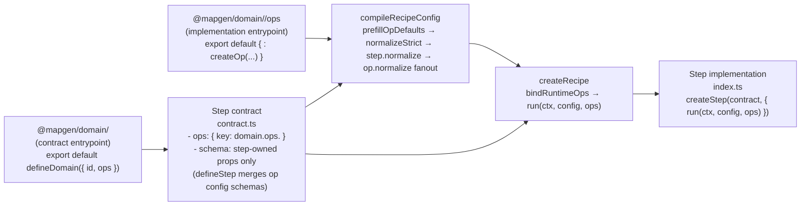

# WORKFLOW: Refactor a Domain to Operation Modules (Canonical)

This is the **canonical, end-to-end workflow** for refactoring **one MapGen domain** so it conforms to the target **contract-first ops + orchestration-only steps** architecture.

This file is intentionally a **thin executable checklist**. Deep detail lives in the linked references.

Golden reference:
- Ecology domain (assumed “final form” exemplar for this workflow):
  - Domain contract entrypoint: `mods/mod-swooper-maps/src/domain/ecology/index.ts`
  - Op contracts router: `mods/mod-swooper-maps/src/domain/ecology/ops/contracts.ts`
  - Op implementations router: `mods/mod-swooper-maps/src/domain/ecology/ops/index.ts`
  - Representative step contract: `mods/mod-swooper-maps/src/recipes/standard/stages/ecology/steps/biomes/contract.ts`

Canonical spec:
- `docs/projects/engine-refactor-v1/resources/spec/SPEC-step-domain-operation-modules.md`
- `docs/projects/engine-refactor-v1/resources/spec/SPEC-DOMAIN-MODELING-GUIDELINES.md`

Canonical architecture:
- `docs/projects/engine-refactor-v1/resources/repomix/gpt-config-architecture-converged.md`

Workflow package references (read as needed; do not reinterpret them):
- `docs/projects/engine-refactor-v1/resources/workflow/domain-refactor/references/structure-and-module-shape.md`
- `docs/projects/engine-refactor-v1/resources/workflow/domain-refactor/references/domain-inventory-and-boundaries.md`
- `docs/projects/engine-refactor-v1/resources/workflow/domain-refactor/references/op-and-config-design.md`
- `docs/projects/engine-refactor-v1/resources/workflow/domain-refactor/references/verification-and-guardrails.md`

Canonical example:
- `docs/projects/engine-refactor-v1/resources/workflow/domain-refactor/examples/VOLCANO.md`

Implementation sub-flow:
- `docs/projects/engine-refactor-v1/resources/workflow/domain-refactor/subflows/IMPLEMENTATION.md`

## Mission + hard constraints (do not skip)

Refactor a single domain so that:
- **All domain logic is behind operation contracts** (`mods/mod-swooper-maps/src/domain/<domain>/ops/**`).
- **Steps are orchestration only** (build inputs → call ops → apply/publish).
- **Config normalization happens at compile time** (schema defaults + `step.normalize` + `op.normalize`), and runtime does not “fix up” config.
- **Legacy paths are removed** within the refactor scope (“scorched earth”).
- **Documentation is part of “done”**: any touched exported function/op/step/schema gets contextual JSDoc and/or TypeBox `description` updates (do call/reference tracing before writing docs).

Canonical authoring surface (single shape; do not invent alternates):
- Ops are authored with `defineOp(...)` + `createOp(contract, { strategies })`.
- Strategies are authored with `createStrategy(contract, "<strategyId>", { normalize?, run })`.
- Every op must include a `"default"` strategy.
- Domain contract entrypoints are authored with `defineDomain({ id, ops })` (contract-only).
- Op contracts are aggregated under `mods/mod-swooper-maps/src/domain/<domain>/ops/contracts.ts`.
- Op implementations are aggregated under `mods/mod-swooper-maps/src/domain/<domain>/ops/index.ts`.
- Steps are authored with `defineStep(...)` + `createStep(contract, { normalize?, run })`, where `createStep` is bound via `createStepFor<TContext>()`.
- Do not introduce any alternate authoring patterns; keep the repo converging on one shape.

TypeScript rules (hard rules):
- Use `OpTypeBag` from `@swooper/mapgen-core/authoring` for all shared op types (`types.ts` is the only shared type surface).
- Do not export or re-export types from helpers or rules; shared types live in `types.ts` only.
- `rules/**` must not import `../contract.js` (type-only or runtime). Use `../types.js` for types and core SDK packages for utilities.

Import boundary rules (hard rules):
- Step `contract.ts` imports **only** from the domain contract entrypoint (`@mapgen/domain/<domain>`) and recipe-local tags/utilities.
  - Step contracts must not import domain op implementations (`@mapgen/domain/<domain>/ops`) or any deep paths under `@mapgen/domain/<domain>/**`.
- Step `index.ts` (implementation) must not import domain op implementations either; it receives runtime ops via the injected `ops` parameter.
- Recipe wiring (recipe definition / stage registry) is the only layer allowed to import `@mapgen/domain/<domain>/ops` to build `compileOpsById`.

Canonical op module structure (single shape):
- Every op is a directory module under `mods/mod-swooper-maps/src/domain/<domain>/ops/<op>/`.
- Every op directory contains: `contract.ts`, `types.ts`, `rules/`, `strategies/`, `rules/index.ts`, `strategies/index.ts`, `index.ts`.

Execution posture:
- Proceed **end-to-end without pausing for feedback**.
- Only stop if continuing would cause dangerous side effects (data loss, breaking public contracts without updating consumers, or violating the canonical spec/ADRs).

Non-negotiable invariants (target architecture):
- Ops are the contract; steps never call internal domain helpers directly.
- Ops are atomic; ops must not call other ops (composition happens in steps/stages).
- No runtime “views” cross the op boundary (POJOs + typed arrays only).
- Op contracts own schemas and default configs; step contracts declare which op contracts they use via `contract.ops`.
- `defineStep({ ops })` merges declared op configs into the step schema automatically (step schemas only declare step-owned props).
- Plan compilation produces final configs; runtime treats `node.config` as “the config” (no runtime defaulting merges).
- No dual paths, shims, translators, DeepPartial override blobs, or fallback behaviors within scope.
- Router compliance: before editing any file, read the closest `AGENTS.md` router that scopes that file.

## Mental model (wiring + surfaces)

This diagram is the “one picture” view of the vertical refactor target.



## Expected file surfaces (domain + stage)

This is the “outside view” of what a refactored domain should look like. (Internals are documented elsewhere.)

```txt
mods/mod-swooper-maps/src/domain/<domain>/
  index.ts                # contract entrypoint (defineDomain); safe for step contracts
  config.ts               # optional; thin re-export surface for domain-owned schemas/constants
  ops/
    contracts.ts          # op contracts registry (export const contracts = { ... })
    index.ts              # op implementations registry (export default { ... } satisfies contracts)
    <op>/
      contract.ts
      types.ts
      rules/
        index.ts
      strategies/
        default.ts
        index.ts
      index.ts

mods/mod-swooper-maps/src/recipes/standard/stages/<stage>/
  index.ts                # stage module (createStage), wires steps + knobsSchema
  steps/
    <step>/
      contract.ts         # defineStep({ ops, schema, requires/provides })
      index.ts            # createStep(contract, { normalize?, run(ctx, config, ops) })
      lib/                # optional pure helpers
```

Decision discipline:
- Prefer the ecology pattern and the spec/ADR text over local legacy precedent.
- Make a single choice, implement it, and record it (no “optional paths” in instructions).

Where to record decisions:
- Domain-local: append to the domain’s local issue doc under `## Implementation Decisions` (`docs/projects/engine-refactor-v1/issues/**`).
- Cross-cutting: `docs/projects/engine-refactor-v1/triage.md`.

<workflow>

<step name="canonical-references">

Read (do not reinterpret):
- `docs/projects/engine-refactor-v1/resources/repomix/gpt-config-architecture-converged.md`
- `docs/projects/engine-refactor-v1/resources/spec/SPEC-step-domain-operation-modules.md`
- `docs/projects/engine-refactor-v1/resources/spec/SPEC-DOMAIN-MODELING-GUIDELINES.md`
- `docs/projects/engine-refactor-v1/resources/spec/adr/adr-er1-034-operation-kind-semantics.md`
- `docs/projects/engine-refactor-v1/resources/spec/adr/adr-er1-030-operation-inputs-policy.md`
- `docs/projects/engine-refactor-v1/resources/spec/adr/adr-er1-035-config-normalization-and-derived-defaults.md`
- `docs/projects/engine-refactor-v1/resources/spec/SPEC-global-invariants.md`
- `docs/projects/engine-refactor-v1/triage.md` (cross-cutting decisions and ongoing risk notes)
- `mods/mod-swooper-maps/AGENTS.md` and closest scoped routers for touched files
- `mods/mod-swooper-maps/src/AGENTS.md` when touching standard config exports

Code references (read when implementing; these are the “truth of behavior”):
- `packages/mapgen-core/src/compiler/recipe-compile.ts` (compile-time config normalization + op normalize fanout)
- `packages/mapgen-core/src/authoring/step/contract.ts` (`defineStep` schema merge + ops-derived config keys)
- `packages/mapgen-core/src/authoring/op/contract.ts` (`defineOp`)
- `packages/mapgen-core/src/authoring/op/types.ts` (`OpTypeBag`)
- `packages/mapgen-core/src/authoring/op/strategy.ts` (`createStrategy`)
- `packages/mapgen-core/src/authoring/op/create.ts` (`createOp`)
- `packages/mapgen-core/src/authoring/step/contract.ts` (`defineStep`)
- `packages/mapgen-core/src/authoring/step/create.ts` (`createStep`, `createStepFor`)
- `packages/mapgen-core/src/authoring/recipe.ts` (runtime ops injection into `step.run(context, config, ops)`)
- `packages/mapgen-core/src/authoring/bindings.ts` (op registries, `collectCompileOps`, `bindRuntimeOps`)
- `mods/mod-swooper-maps/test/support/compiler-helpers.ts` (canonical test helpers for config normalization)
- `packages/mapgen-core/src/authoring/typed-array-schemas.ts` (typed-array schema metadata used by validation)

Sequencing helper (domain braid reality):
- `docs/projects/engine-refactor-v1/resources/spike/spike-domain-refactor-sequencing.md`
- Standard recipe stage order: `mods/mod-swooper-maps/src/recipes/standard/recipe.ts`

Keep open while implementing:
- `docs/projects/engine-refactor-v1/resources/workflow/domain-refactor/references/structure-and-module-shape.md`
- `docs/projects/engine-refactor-v1/resources/workflow/domain-refactor/references/op-and-config-design.md`
- `docs/projects/engine-refactor-v1/resources/workflow/domain-refactor/references/domain-inventory-and-boundaries.md`
- `docs/projects/engine-refactor-v1/resources/workflow/domain-refactor/references/verification-and-guardrails.md`

</step>

<step name="graphite-worktree-loop">

This workflow is executed inside an **isolated git worktree**; the primary worktree stays clean.

Preflight (primary worktree; stop if dirty):
```bash
git status
gt ls
git worktree list
```

Sync trunk metadata without restacking:
```bash
gt sync --no-restack
```

Create a new layer branch from the stack tip, then create a worktree:
```bash
git worktree add -b dev-<milestone>-<domain>-<subissue> ../wt-dev-<milestone>-<domain>-<subissue> <parent-branch>
cd ../wt-dev-<milestone>-<domain>-<subissue>
gt track
```

Patch-path guard (mandatory):
- Only edit files inside the worktree path.
- If your harness requires it, use **absolute paths** for patches.

Install dependencies (in the worktree) if needed for checks:
```bash
pnpm install
```

Baseline gates (mandatory; once per domain refactor, before writing code):
```bash
pnpm -C packages/mapgen-core check
pnpm -C packages/mapgen-core test
pnpm -C mods/mod-swooper-maps check
pnpm -C mods/mod-swooper-maps test
pnpm -C mods/mod-swooper-maps build
pnpm deploy:mods
```

Commit rules (per subissue; every subissue ends in a clean, reviewable commit):
```bash
gt add -A
gt modify --commit -am "refactor(<domain>): <subissue summary>"
```

</step>

<step name="domain-inventory">

Produce the domain inventory (this is not optional; it is the primary derisking artifact).

Reference (includes the command kit and required inventory sections):
- `docs/projects/engine-refactor-v1/resources/workflow/domain-refactor/references/domain-inventory-and-boundaries.md`
- `docs/projects/engine-refactor-v1/resources/spec/SPEC-DOMAIN-MODELING-GUIDELINES.md`

</step>

<step name="lock-op-catalog">

Lock the target op surface design for the domain with **no optionality**:
- op ids + kinds (`plan | compute | score | select`)
- op inputs/outputs/config schemas + defaultConfig
- where scaling semantics live (`op.normalize`) and how they compose (`step.normalize` + compiler fanout)

Reference:
- `docs/projects/engine-refactor-v1/resources/workflow/domain-refactor/references/op-and-config-design.md`
- `docs/projects/engine-refactor-v1/resources/spec/SPEC-DOMAIN-MODELING-GUIDELINES.md`

</step>

<step name="implement-subissues">

Implementation is executed as a series of **agent-defined slices** (you choose slice boundaries based on the domain inventory).

Hard requirement:
- Each slice must be completed end-to-end (no dual paths), then committed, before moving on.

Detailed implementation checklist + slicing guardrails:
- `docs/projects/engine-refactor-v1/resources/workflow/domain-refactor/subflows/IMPLEMENTATION.md`

Implementation shape references:
- `docs/projects/engine-refactor-v1/resources/workflow/domain-refactor/references/structure-and-module-shape.md`
- `docs/projects/engine-refactor-v1/resources/workflow/domain-refactor/references/op-and-config-design.md`
- `docs/projects/engine-refactor-v1/resources/workflow/domain-refactor/references/verification-and-guardrails.md`

</step>

<step name="verify-and-submit">

Run guardrails and verification gates; they must be green before submission.

Reference:
- `docs/projects/engine-refactor-v1/resources/workflow/domain-refactor/references/verification-and-guardrails.md`

Submit after gates are green.

Parallelism rule:
- For parallel vertical domain refactors, keep each domain refactor as its own stack (often a single branch). Avoid stacking multiple domains on top of one another.

Submit the stack as draft immediately after gates are green:
```bash
gt ss --draft
```

Include in PR notes:
- what was deleted (scorched earth inventory),
- what contracts changed (requires/provides, artifact shapes, config keys),
- what tests were added and how to run them.

After submission:
- Remove only the worktrees you created for this refactor.
- Confirm `git worktree list` is clean and `gt ls` matches the expected stack state.

</step>

</workflow>
