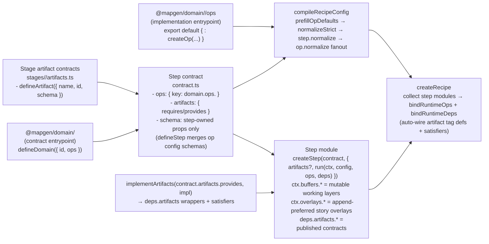

# WORKFLOW: Vertical Domain Refactor (Operation Modules)

This is the **canonical, end-to-end workflow** for refactoring **one MapGen domain** so it conforms to:
- the target **contract-first ops + orchestration-only steps** architecture, and
- a **physically grounded, first-principles domain model** (earth-physics-informed; legacy behavior is not sacred).

This file is intentionally a **flow-first executable checklist**: the `<workflow>` comes first; deep detail is indexed at the bottom.

## TL;DR (phase model)

Phases are **adaptive**: each phase produces concrete artifacts, then a required lookback step updates the next phase’s plan based on what you learned (no “write once, never revise” docs).

1. **Phase 1: Current-state spike** → write `docs/projects/engine-refactor-v1/resources/spike/spike-<domain>-current-state.md`
2. **Lookback 1 (Phase 1 → Phase 2): Adjust the modeling plan** → append lookback findings + plan deltas into the Phase 1 spike
3. **Phase 2: Modeling spike (first principles)** → write `docs/projects/engine-refactor-v1/resources/spike/spike-<domain>-modeling.md`
4. **Lookback 2 (Phase 2 → Phase 3): Adjust the implementation plan** → append lookback findings + pipeline deltas into the Phase 2 spike
5. **Phase 3: Implementation plan + slice plan** → write/update `docs/projects/engine-refactor-v1/issues/LOCAL-TBD-<milestone>-<domain>-*.md`
6. **Lookback 3 (Phase 3 → Phase 4): Finalize slices + sequencing** → append lookback findings into the Phase 3 issue doc
7. **Phase 4: Implementation (slices)** → refactor domain + stage code (one slice at a time; no dual paths)
8. **Lookback 4 (Phase 4 → Phase 5): Stabilize and reconcile** → append lookback findings into the Phase 3 issue doc
9. **Phase 5: Verification + cleanup + submit** → run gates, submit, remove worktrees

## Required “living artifacts” (keep updated; canonical plan spine)

Each domain refactor must maintain these artifacts as a **single-source-of-truth spine** for the refactor. They can live in the domain plan doc (recommended), or be embedded into the Phase 1/2 spike docs + Phase 3 issue doc if you are not using a plan doc.

- **Domain surface inventory (outside view):** entrypoints, stage contracts, step list, and who imports/calls what.
- **Contract matrix:** per-step `requires/provides`, explicitly distinguishing **artifacts vs buffers vs overlays**, plus producer/consumer mapping.
- **Decisions + defaults:** assumptions you are using *right now*; explicit triggers to revisit.
- **Risk register:** top risks, whether blocking, and the mitigation plan (usually slice ordering).
- **Golden path example:** one representative step, showing canonical imports + `run(ctx, config, ops, deps)` + `deps.artifacts.*` usage + docs-as-code.

These artifacts exist to prevent “black ice”:
- they force you to name what is public,
- force you to name who depends on what,
- force you to record assumptions and risks,
- and force you to keep the plan synchronized with what you learned in each phase.

## Domain resource directory (recommended for larger artifacts)

If any of the “living artifacts” above start to get long, split them into standalone docs under a per-domain resources directory, and link them from the spikes/issues instead of duplicating.

Recommended location:
- `docs/projects/engine-refactor-v1/resources/domains/<domain>/`

Recommended “outside view” doc set (create only what you need; keep it small):
- `docs/projects/engine-refactor-v1/resources/domains/<domain>/INDEX.md` (optional; links + navigation)
- `docs/projects/engine-refactor-v1/resources/domains/<domain>/inventory.md` (Domain Surface Inventory)
- `docs/projects/engine-refactor-v1/resources/domains/<domain>/contract-matrix.md` (Contract Matrix)
- `docs/projects/engine-refactor-v1/resources/domains/<domain>/decisions.md` (Decisions + Defaults)
- `docs/projects/engine-refactor-v1/resources/domains/<domain>/risks.md` (Risk Register)
- `docs/projects/engine-refactor-v1/resources/domains/<domain>/golden-path.md` (Golden Path Example)

Rule of thumb:
- If it’s referenced across phases and exceeds ~1 page, it belongs in `resources/domains/<domain>/...`.
- If it’s short and phase-local, keep it in the spike/issue doc.

## Hard rules (do not violate)

- **Contract-first:** All domain logic is behind op contracts (`mods/mod-swooper-maps/src/domain/<domain>/ops/**`).
- **No op composition:** Ops are atomic; ops must not call other ops (composition happens in steps/stages).
- **Steps are orchestration:** step modules must not import op implementations; they call injected ops in `run(ctx, config, ops, deps)`.
- **Single-path deps access:** step runtime must not reach into alternate dependency paths (no `ctx.deps`); dependencies are accessed via the `deps` parameter only.
- **Artifacts are stage-owned (contracts) and contract-first:** each stage defines artifact contracts in `mods/mod-swooper-maps/src/recipes/standard/stages/<stage>/artifacts.ts`; step contracts declare `artifacts.requires` / `artifacts.provides` using those stage-owned contracts.
- **No ad-hoc artifact imports in steps:** step implementations read/publish artifacts via `deps.artifacts.<artifactName>.*` (no direct imports from recipe-level `artifacts.*`, and no direct `ctx.artifacts` access in normal authoring).
- **Buffers are not artifacts (conceptual rule):** buffers are mutable, shared working layers (e.g., heightfield/elevation, climate field, routing indices) that multiple steps/stages refine over time.
  - **Today (intentional compromise):** some buffers are still routed through artifact contracts for gating/typing; publish the buffer artifact **once**, then mutate the underlying buffer in place (do **not** re-publish).
  - **Modeling posture:** always describe buffers as buffers in domain specs and refactor plans; treat any artifact wrapping as a temporary wiring strategy, not as a domain-model truth statement.
- **Overlays are not artifacts (conceptual rule):** overlays are append-preferred, structured “stories of formation” (e.g., corridors, swatches) that downstream domains can read and act on.
  - **Canonical shape:** a single `overlays` container with per-type collections (`overlays.corridors`, `overlays.swatches`, ...). Avoid many top-level overlay artifacts.
  - **Today (intentional compromise):** overlays are routed through artifact contracts for gating/typing; publish the overlays artifact **once**, then accumulate overlays via `ctx.overlays.*` (append-preferred; mutation is rare and intentional).
- **Compile-time normalization:** defaults + `step.normalize` + `op.normalize`; runtime does not “fix up” config.
- **Import discipline:** step `contract.ts` imports only `@mapgen/domain/<domain>` + stage-local contracts (e.g. `../artifacts.ts`); no deep imports under `@mapgen/domain/<domain>/**`, and no `@mapgen/domain/<domain>/ops`.
- **Do not propagate legacy patterns:** do not copy legacy authoring patterns forward. Implement changes only through the canonical architecture, and prefer minimal, high-DX expressions over redundant imports/typing/boilerplate.
  - Concrete example (legacy smell): importing a domain config type and annotating the `run(...)` handler `config` parameter even when `config` is already inferred from the step contract schema. Treat this as a pattern to delete, not to repeat.
- **Docs-as-code is enforced:** any touched exported function/op/step/schema gets contextual JSDoc and/or TypeBox `description` updates (trace references before writing docs).
- **Authoritative modeling (not “code cleanup”):** prefer the physically grounded target model over preserving legacy behavior; delete/replace broken or nonsensical behavior as needed.
- **Cross-pipeline consistency is required:** when the domain model changes contracts/artifacts, update upstream/downstream steps and stage-owned artifact contracts so the whole pipeline stays internally consistent (no “temporary mismatch”).
- **Upstream compat/projection sunset:** if upstream provides compatibility shims or projection artifacts for migration, do not treat them as canonical inputs. Choose and document the authoritative upstream inputs this domain will use (buffers/artifacts/overlays), and remove compat reads as part of the refactor. If this domain publishes projections for downstream consumers, do so explicitly and mark them as deprecated/compat in contracts/docs.
- **Compat projection cleanup ownership:** if this refactor leaves compat projections in place, create a cleanup item in `docs/projects/engine-refactor-v1/triage.md`. Do not assume the next downstream refactor will delete them. If the immediate downstream domain can remove them safely and no other downstream consumers are affected, that domain owns the cleanup and must have a dedicated issue for it; link the issue from triage.

## Principles (authoritative surfaces)

Domains own their surfaces. If a clean internal model requires breaking a compatibility surface, break it and update downstream stages in the same refactor. Projections are presentation-only and must never shape the internal representation.

Config ownership is local and narrow. Op contracts must define op-owned strategy schemas; do not reuse a domain-wide config bag inside op contracts. If an external preset bag must be preserved temporarily, map it at step normalization into per-op envelopes or migrate presets outright.

## Anti-patterns (avoid; common failure modes)

- **Phase bleed:** mixing Phase 2 modeling with Phase 3 slice planning or implementation detail. Keep modeling and execution separate.
- **Missing living artifacts:** a narrative spike without the inventory/contract matrix/decisions/risks/golden path spine.
- **Model/projection confusion:** treating downstream-compat projections as canonical outputs or letting them shape the model.
- **Decisions buried in prose:** critical choices not recorded as explicit decisions with rationale and triggers.
- **Boundary drift:** silent deep imports or `ctx.artifacts` reads that reintroduce coupling during refactor.
- **Untracked deltas:** changing contracts without updating the contract matrix or cross-pipeline inventory.
- **Config bag reuse inside ops:** using a domain-wide config bag in op strategy schemas instead of op-owned config.

Example anti-pattern (do not copy):
```ts
import { Type } from "@swooper/mapgen-core/authoring";
import { FoundationConfigSchema } from "../config.js";

export const ComputePlatesContract = defineOp({
  id: "foundation/compute-plates",
  kind: "compute",
  input: Type.Object({ /* ... */ }),
  output: Type.Object({ /* ... */ }),
  strategies: {
    default: Type.Partial(FoundationConfigSchema), // grab-bag config
  },
} as const);
```

Preferred posture: define a minimal op-owned schema and map any external bag at step normalization.

## Golden reference (Ecology exemplar)

- Domain contract entrypoint: `mods/mod-swooper-maps/src/domain/ecology/index.ts`
- Op contracts router: `mods/mod-swooper-maps/src/domain/ecology/ops/contracts.ts`
- Op implementations router: `mods/mod-swooper-maps/src/domain/ecology/ops/index.ts`
- Stage-owned artifact contracts: `mods/mod-swooper-maps/src/recipes/standard/stages/ecology/artifacts.ts`
- Representative step contract: `mods/mod-swooper-maps/src/recipes/standard/stages/ecology/steps/biomes/contract.ts`

## Decision logging

- Domain-local: append to the domain’s local issue doc under `## Implementation Decisions` (`docs/projects/engine-refactor-v1/issues/**`).
- Cross-cutting: `docs/projects/engine-refactor-v1/triage.md`.

Expanded constraints, wiring diagram, and the “outside view” file surfaces are in the appendices below.

<workflow>

<step name="phase-0-setup">

**Objective:** Create an isolated worktree and establish a known-good baseline before touching the domain.

**Inputs:**
- `<domain>` (e.g. `foundation | morphology | narrative | hydrology | placement | ecology`)
- `<milestone>` (e.g. `M8`)

**Outputs:**
- A new branch and worktree for the domain refactor.
- A place to keep “living artifacts” (either a plan doc or a per-domain resources directory).
- A recorded baseline run of verification gates (so regressions are attributable).

**Steps (primary checkout):**

Preflight (stop if dirty):
```bash
git status
gt ls
git worktree list
```

Sync trunk metadata without restacking:
```bash
gt sync --no-restack
```

Create a new branch (empty branch is fine):
```bash
gt create refactor-<milestone>-<domain>
```

Create and enter a worktree:
```bash
git worktree add ../wt-refactor-<milestone>-<domain> refactor-<milestone>-<domain>
cd ../wt-refactor-<milestone>-<domain>
```

Patch-path guard (mandatory):
- Only edit files inside the worktree path.

Create a per-domain resources directory (recommended when artifacts are non-trivial):
```bash
mkdir -p docs/projects/engine-refactor-v1/resources/domains/<domain>
```

Install dependencies (only if you will run checks here):
```bash
pnpm install
```

Baseline gates (mandatory; once per domain refactor):
```bash
pnpm -C packages/mapgen-core check
pnpm -C packages/mapgen-core test
pnpm -C mods/mod-swooper-maps check
pnpm -C mods/mod-swooper-maps test
pnpm -C mods/mod-swooper-maps build
pnpm deploy:mods
```

**Commit rules (Graphite-only; do not use `git commit`):**
```bash
gt add -A
gt modify --commit -am "refactor(<domain>): <slice or doc summary>"
```

**Gate (do not proceed until):**
- [ ] Worktree exists and you are operating inside it (`pwd -P` shows the worktree path).
- [ ] Baseline gates are green (or failures are recorded with links + rationale).

**References:**
- Routers: `mods/mod-swooper-maps/AGENTS.md` and any closer scoped `AGENTS.md` for touched files
- Canonical docs (read once before Phase 1): see “Reference index” below

</step>

<step name="phase-1-current-state-spike">

**Objective:** Produce a grounded “where it stands vs where it should be” spike for this domain (inventory + boundary violations + deletion list).

**Outputs:**
- `docs/projects/engine-refactor-v1/resources/spike/spike-<domain>-current-state.md`
  - Ensure it links to (or embeds) the “living artifacts” spine:
    - Domain Surface Inventory
    - Contract Matrix (current-state)
    - Decisions + Defaults (initial)
    - Risk Register (initial)
    - Golden Path Example (initial candidate)
  - complete step map (allsites that touch the domain)
  - dependency gating inventory:
    - `requires`/`provides` (non-artifacts) per step (ids + file paths)
    - `artifacts.requires`/`artifacts.provides` per step (ids + file paths)
    - stage-owned artifact contract catalog per stage (`stages/<stage>/artifacts.ts`)
  - config surface map (schemas/defaults/normalizers + runtime fixups to delete)
  - typed-array inventory (constructors, lengths, validators)
  - deletion list (symbols + file paths that must go to zero)

**Gate (do not proceed until):**
- [ ] All 5 inventory artifacts exist in the spike doc (not in scattered notes).
- [ ] Every boundary violation in scope is either (a) listed as a slice target, or (b) already eliminated.

**References:**
- `docs/projects/engine-refactor-v1/resources/workflow/domain-refactor/references/domain-inventory-and-boundaries.md`

</step>

<step name="phase-1-lookback-and-adjust">

**Objective:** Convert Phase 1 findings into explicit updates to the Phase 2 modeling work (and explicitly record any plan changes you discovered).

This lookback is mandatory: Phase 2 is expected to be **re-planned** based on evidence from Phase 1 (inventory + violations + deletion list).

**Inputs:**
- `docs/projects/engine-refactor-v1/resources/spike/spike-<domain>-current-state.md` (Phase 1 output)

**Outputs (append to the end of the Phase 1 spike doc):**
- `## Lookback (Phase 1 → Phase 2): Adjust modeling plan`
  - What surprised you (top 3)
  - Updated boundary map (what is “in domain” vs “pipeline glue” vs “legacy to delete”)
  - Updated domain surface inventory + contract matrix (outside view, `requires/provides`, producers/consumers)
  - Updated model hypotheses (what Phase 2 must validate/decide)
  - Updated deletion list (anything discovered late)
  - Updated cross-pipeline touchpoints (upstream/downstream contracts that Phase 2 must consider)
  - Updated decisions + defaults + risk register (what became newly true / newly risky)

**Gate (do not proceed until):**
- [ ] The lookback section exists and includes explicit “plan deltas” (not just a recap).
- [ ] Phase 2 has a clear target: what must be redesigned vs what can be preserved.

</step>

<step name="phase-2-modeling-spike">

**Objective:** Define “how this domain should look” from first principles + our architecture, producing a no-optionality target model.

Modeling posture (enforced):
- operations are **atomic** (no op-calls-op composition),
- composition happens in steps/stages,
- rules are **policy units** imported into ops/strategies (avoid generic helper drift).

Earth-physics grounding (required):
- Model the domain “from the ground up” using the relevant earth-physics research and domain-level architecture docs.
- You are explicitly allowed (and expected) to **discard** legacy behavior, artifacts, ops, and step shapes that are clearly broken, incoherent, or physically nonsensical.
- If preserving a legacy behavior is intentional, justify it explicitly in the modeling spike as a “kept legacy invariant” with a reason (gameplay constraint, engine constraint, regression harness).

Cross-pipeline posture (required):
- The domain model lives inside a pipeline. Your target model must be consistent with (and may reshape) the artifact/deps contracts at domain boundaries.
- If the modeled domain needs different inputs/outputs, you must plan the pipeline updates (artifact contracts, step deps, stage wiring) so the compiled plan remains valid and consumers remain coherent.
- Prefer coordinating changes via **stage-owned artifact contracts** (`stages/<stage>/artifacts.ts`) rather than ad-hoc cross-domain imports.

Foundation-specific reminder (applies only when `<domain> == foundation`):
- Foundation is “upstream of everything”. Phase 2 must treat its modeled outputs (buffers, artifacts, overlays) as pipeline-wide contracts; plan for downstream adaptation rather than preserving legacy couplings.

**Outputs:**
- `docs/projects/engine-refactor-v1/resources/spike/spike-<domain>-modeling.md`
  - target op catalog (ids + kinds + input/output/config schemas + defaults + normalize ownership)
  - artifact contracts (stage-owned contracts + producing steps + consuming steps; how artifacts flow across steps via `deps`)
  - policy/rules map (what decisions exist and where they should live)
  - step/stage composition plan (which steps orchestrate which ops and in what order)
  - explicit non-goals (what modeling work is deferred, if any)
  - pipeline delta list:
    - upstream artifacts/inputs that must change (and where),
    - downstream artifacts/outputs that must change (and where),
    - any cross-domain compatibility or sequencing implications.
- Update the domain’s canonical modeling reference doc (or create it if missing):
  - `docs/system/libs/mapgen/<domain>.md`
  - Treat this as the “domain-only model + causality” doc; avoid baking in implementation mechanics beyond what’s needed to describe products/contracts.
 - Update the living artifacts spine to match the target model:
   - Domain Surface Inventory (what will exist after refactor)
   - Contract Matrix (target-state)
   - Decisions + Defaults (target assumptions + triggers)
   - Risk Register (updated top risks + mitigations)
   - Golden Path Example (update if Phase 2 changes the canonical step shape)

**Gate (do not proceed until):**
- [ ] Op catalog is locked with no optionality (no “could do A or B”).
- [ ] No op depends on another op (composition is step/stage-owned).
- [ ] Policy/rules posture is explicit (where decisions live; what’s just plumbing).
- [ ] Pipeline delta list is explicit (no implicit “we’ll figure it out during implementation”).

**References:**
- `docs/projects/engine-refactor-v1/resources/spec/SPEC-DOMAIN-MODELING-GUIDELINES.md`
- ADRs: `docs/projects/engine-refactor-v1/resources/spec/adr/adr-er1-030-operation-inputs-policy.md`, `docs/projects/engine-refactor-v1/resources/spec/adr/adr-er1-034-operation-kind-semantics.md`, `docs/projects/engine-refactor-v1/resources/spec/adr/adr-er1-035-config-normalization-and-derived-defaults.md`
- Earth physics + domain spec index: `docs/projects/engine-refactor-v1/resources/workflow/domain-refactor/references/earth-physics-and-domain-specs.md`

</step>

<step name="phase-2-lookback-and-adjust">

**Objective:** Convert the Phase 2 target model into a deterministic, slice-able implementation plan (and explicitly record any plan changes you discovered during modeling).

This lookback is mandatory: Phase 3 is expected to be **re-planned** based on Phase 2’s final target model (op catalog + policy map + pipeline deltas).

**Inputs:**
- `docs/projects/engine-refactor-v1/resources/spike/spike-<domain>-modeling.md` (Phase 2 output)

**Outputs (append to the end of the Phase 2 spike doc):**
- `## Lookback (Phase 2 → Phase 3): Adjust implementation plan`
  - Finalized invariants (what must not change during implementation)
  - Risks (top 3) + how the slice plan mitigates them (update the risk register)
  - Pipeline delta slicing strategy (how contract changes will be spread across slices without breaking the pipeline)
  - Contract matrix delta (what `requires/provides` changes, by slice)
  - Draft slice boundaries (a first cut; Phase 3 will harden into an executable checklist)
  - Test strategy notes (what needs deterministic harnessing; what can be thin integration)

**Gate (do not proceed until):**
- [ ] The lookback section exists and includes explicit “plan deltas” (not just a recap).
- [ ] There is a clear slicing strategy for any pipeline deltas (no “big bang” unless justified).

</step>

<step name="phase-3-implementation-plan-and-slice-plan">

**Objective:** Translate the spikes into a deterministic implementation issue and an executable slice plan.

**Outputs:**
- A local implementation issue doc (domain-local “source of truth”):
  - `docs/projects/engine-refactor-v1/issues/LOCAL-TBD-<milestone>-<domain>-*.md`
- A slice plan in that issue doc, including for each slice:
  - step(s) included (ids + file paths)
  - ops introduced/changed (ids + kinds + module paths)
  - legacy entrypoints to delete (file paths / exports)
  - tests to add/update (op contract tests + any thin integration edge)
  - guardrail scope (`REFRACTOR_DOMAINS=...`)
  - pipeline deltas included (which upstream/downstream stages/contracts are updated in this slice, if any)

**Gate (do not proceed until):**
- [ ] Slice plan is written and reviewable.
- [ ] Every planned slice can end in a working state (no “we’ll delete later”).
- [ ] Any pipeline delta from Phase 2 is fully assigned to slices (no “out of band” work).

**References:**
- `docs/projects/engine-refactor-v1/resources/workflow/domain-refactor/references/op-and-config-design.md`
- `docs/projects/engine-refactor-v1/resources/workflow/domain-refactor/references/verification-and-guardrails.md`

</step>

<step name="phase-3-lookback-and-adjust">

**Objective:** Validate that the slice plan is executable, then lock sequencing and reduce ambiguity before writing production code.

This lookback is mandatory: Phase 4 is expected to be **re-planned** based on what Phase 3 uncovered (e.g., missing harnesses, contract uncertainties, edge cases).

**Inputs:**
- `docs/projects/engine-refactor-v1/issues/LOCAL-TBD-<milestone>-<domain>-*.md` (Phase 3 output)

**Outputs (append to the Phase 3 issue doc):**
- `## Lookback (Phase 3 → Phase 4): Finalize slices + sequencing`
  - Confirmed slice DAG (what blocks what; where pipeline deltas land)
  - Any prework findings completed during planning (code-intel checks, boundary confirmation)
  - Any remaining open decisions (should be rare; record options + default; update decisions + defaults)
  - “First slice is safe” checklist (what must be true before implementing slice 1)

**Gate (do not proceed until):**
- [ ] Slice 1 is independently shippable (tests + docs + deletions included).
- [ ] Any remaining open decisions are explicit, scoped, and non-surprising to implementers.

</step>

<step name="phase-4-implementation-slices">

**Objective:** Implement the refactor in small, end-to-end slices with no dual paths.

Canonical authoring surface (do not invent alternates):
- Ops: `defineOp(...)` + `createOp(contract, { strategies })`
- Strategies: `createStrategy(contract, "<strategyId>", { normalize?, run })` (must include `"default"`)
- Domain contracts: `defineDomain({ id, ops })` (contract-only; safe for step contracts)
- Artifacts: `defineArtifact({ name, id, schema })` (stage-owned contract surface) + `implementArtifacts(provides, impl)` (producer step runtime binding)
- Steps: `defineStep(...)` + `createStep(contract, { artifacts?, normalize?, run(ctx, config, ops, deps) })` (via a bound `createStepFor<TContext>()`)

Import boundaries (enforced):
- Step `contract.ts` imports **only**:
  - the domain contract entrypoint (`@mapgen/domain/<domain>`), and
  - stage-local contract surfaces (notably `stages/<stage>/artifacts.ts` for artifact contracts),
  - plus recipe-local utilities.
- Step runtime calls injected ops and uses the injected dependency surface:
  - ops: `run(ctx, config, ops, deps)` calls `ops.<key>(...)` / `ops.<key>.run(...)` (depending on op kind),
  - artifacts: `deps.artifacts.<artifactName>.read(ctx)` / `.publish(ctx, value)` (no artifact helper imports; no direct `ctx.artifacts` access in normal authoring).
- Recipe wiring is the only layer allowed to import `@mapgen/domain/<domain>/ops` to build `compileOpsById`.
- `createRecipe(...)` is responsible for:
  - threading the typed `deps` surface into each step’s `run(ctx, config, ops, deps)`, and
  - auto-wiring artifact tag definitions + satisfiers from step contracts + step-provided artifact runtimes (no manual registry maintenance for artifacts).

**Slice completion checklist (repeat for each slice):**

1) Extract ops for the slice
- Create/update op modules under `mods/mod-swooper-maps/src/domain/<domain>/ops/**`.
- Op boundary is POJO/POJO-ish only (typed arrays ok); no adapters/context/RNG callbacks cross the boundary.
- Op module shape is fixed (see “Expected file surfaces” below).

2) Wire steps for the slice
- Promote step(s) into the contract-first step module shape (`contract.ts` + `index.ts` + optional `lib/**`).
- Step contracts declare op contracts via `ops: { <key>: domain.ops.<opKey> }`.
- Step contracts declare artifact dependencies (when applicable) via `artifacts: { requires: [...], provides: [...] }` using artifact contracts imported from the stage boundary (`stages/<stage>/artifacts.ts`).
- Step contracts must not manually list artifact tags in raw `requires`/`provides` when those same tags are declared via `artifacts.requires`/`artifacts.provides`.
- Step runtime calls injected ops: `ops.<key>(input, config.<key>)`.
- Step runtime reads/publishes artifacts via `deps.artifacts.*` and never imports recipe-level artifact helpers (no `.../artifacts.*` imports inside step implementations).
- Producer steps bind runtime artifact behavior via `implementArtifacts(contract.artifacts.provides, { ... })` and pass the result to `createStep(contract, { artifacts, run(...) })`.
- If you added/changed ops for this slice, update stage/recipe wiring to include the op implementations in the compile-time op registry (recipe wiring is the only layer allowed to import `@mapgen/domain/<domain>/ops`).
- If this slice includes a pipeline delta (Phase 2), update the impacted stages/contracts and their consumers now:
  - edit the relevant stage-owned artifact contract surfaces (`stages/<stage>/artifacts.ts`),
  - update any affected step contracts (`artifacts.requires`/`artifacts.provides`) and step runtime reads/writes (`deps.artifacts.*`),
  - do not leave mismatched producers/consumers for “later”.

3) Delete legacy for the slice
- Delete legacy entrypoints/helpers for the migrated steps; no compat exports or “old/new” switches.

4) Tests for the slice
- Add at least one deterministic op contract test.
- If artifact/config contracts changed across steps, add one thin integration test for the edge.

5) Documentation for the slice (required)
- Trace callsites/references first (code-intel; do not guess intent).
- Add/refresh JSDoc for any touched exported symbol (behavior/why/edge cases).
- Add/refresh TypeBox `description` for any touched schema fields (especially config; describe behavioral impact and interactions).

6) Guardrails for the slice
```bash
REFRACTOR_DOMAINS="<domain>[,<domain2>...]" ./scripts/lint/lint-domain-refactor-guardrails.sh
```

7) Commit the slice (Graphite-only)
```bash
gt add -A
gt modify --commit -am "refactor(<domain>): <slice summary>"
```

**Gate (do not proceed to next slice until):**
- [ ] Legacy paths for this slice are deleted.
- [ ] Slice guardrails are green.
- [ ] Slice tests are green.
- [ ] Slice docs-as-code updates are complete.

**References:**
- Extended slice guidance: `docs/projects/engine-refactor-v1/resources/workflow/domain-refactor/subflows/IMPLEMENTATION.md`
- “Truth of behavior” source files: see “Reference index” below

</step>

<step name="phase-4-lookback-and-adjust">

**Objective:** Reconcile implementation reality with the plan, then stabilize before final verification/cleanup.

This lookback is mandatory: Phase 5 is expected to incorporate what Phase 4 uncovered (drift, missing docs, unexpected couplings).

**Inputs:**
- The Phase 3 issue doc and the implementation work completed in Phase 4

**Outputs (append to the Phase 3 issue doc):**
- `## Lookback (Phase 4 → Phase 5): Stabilize and reconcile`
  - Any plan drift (what changed and why)
  - Any newly discovered cross-pipeline coupling (and how it was resolved)
  - Any follow-up work explicitly deferred (with triggers)
  - Final verification runbook adjustments (what is now the true “done” gate)

**Gate (do not proceed until):**
- [ ] The issue doc reflects the actual implementation outcome (no “paper plan” left behind).
- [ ] All intentional deferrals are explicit (no silent TODOs).

</step>

<step name="phase-5-verify-cleanup-submit">

**Objective:** Run end-to-end gates, submit, and leave no loose ends.

**Verification gates (must be green):**
```bash
pnpm -C packages/mapgen-core check
pnpm -C packages/mapgen-core test
pnpm -C mods/mod-swooper-maps check
pnpm -C mods/mod-swooper-maps test
pnpm -C mods/mod-swooper-maps build
pnpm deploy:mods
```

**Submit:**
```bash
gt ss --draft
```

Include in PR notes:
- what was deleted (deletion list),
- what contracts changed (requires/provides, artifacts.requires/provides, artifact contracts, config keys),
- what tests were added and how to run them.

**Worktree cleanup (after submission):**
```bash
git worktree list
```

Remove only the worktrees you created for this refactor.

**Gate (done when):**
- [ ] Full verification gates are green.
- [ ] PR/stack is submitted.
- [ ] Worktrees are cleaned up and `git worktree list` is sane.

**References:**
- `docs/projects/engine-refactor-v1/resources/workflow/domain-refactor/references/verification-and-guardrails.md`

</step>

</workflow>

## Appendix A: Expanded constraints and invariants (reference)

Canonical TypeScript rules (hard rules):
- Use `OpTypeBag` from `@swooper/mapgen-core/authoring` for all shared op types (`types.ts` is the only shared type surface).
- Do not export or re-export types from helpers or rules; shared types live in `types.ts` only.
- `rules/**` must not import `../contract.js` (type-only or runtime). Use `../types.js` for types and core SDK packages for utilities.

Execution posture:
- Proceed end-to-end; only stop if continuing would cause dangerous side effects (data loss, breaking public contracts without updating consumers, or violating the canonical spec/ADRs).
- Router compliance: before editing any file, read the closest `AGENTS.md` router that scopes that file.

Non-negotiable invariants (target architecture):
- Ops are the contract; steps never call internal domain helpers directly.
- Ops are atomic; ops must not call other ops (composition happens in steps/stages).
- No runtime “views” cross the op boundary (POJOs + typed arrays only).
- Op contracts own schemas and default configs; step contracts declare which op contracts they use via `contract.ops`.
- `defineStep({ ops })` merges declared op configs into the step schema automatically (step schemas only declare step-owned props).
- Plan compilation produces final configs; runtime treats `node.config` as “the config” (no runtime defaulting merges).
- No dual paths, shims, translators, DeepPartial override blobs, or fallback behaviors within scope.
- Artifacts are contract-first and stage-owned:
  - contracts live at `stages/<stage>/artifacts.ts` (stable import surface),
  - step contracts declare `artifacts.requires/provides` using those contracts,
  - step runtime uses `deps.artifacts.*` exclusively (no ad-hoc artifact imports).

### Artifacts authoring (stage-owned contract + step-owned runtime)

Stage contract surface (stable import path for step contracts):
```ts
// mods/mod-swooper-maps/src/recipes/standard/stages/ecology/artifacts.ts
import { Type, defineArtifact } from "@swooper/mapgen-core/authoring";

export const ecologyArtifacts = {
  featureIntents: defineArtifact({
    name: "featureIntents",
    id: "artifact:ecology.featureIntents",
    schema: Type.Object({}, { additionalProperties: false }),
  }),
} as const;
```

Consumer step contract (declares dependencies via `artifacts.*`):
```ts
// mods/mod-swooper-maps/src/recipes/standard/stages/ecology/steps/features-apply/contract.ts
import { Type, defineStep } from "@swooper/mapgen-core/authoring";
import ecology from "@mapgen/domain/ecology";
import { ecologyArtifacts } from "../../artifacts.js";

export default defineStep({
  id: "features-apply",
  phase: "ecology",
  artifacts: { requires: [ecologyArtifacts.featureIntents], provides: [] },
  ops: { apply: ecology.ops.applyFeatures },
  schema: Type.Object({}, { additionalProperties: false }),
  requires: [],
  provides: [],
});
```

Producer step runtime (binds runtime checks + publishes via `deps`):
```ts
// mods/mod-swooper-maps/src/recipes/standard/stages/ecology/steps/features-plan/index.ts
import { createStep, implementArtifacts } from "@swooper/mapgen-core/authoring";
import contract from "./contract.js";

const artifacts = implementArtifacts(contract.artifacts!.provides!, {
  featureIntents: { /* validate/satisfies/freeze overrides (optional) */ },
});

export default createStep(contract, {
  artifacts,
  run: (ctx, config, ops, deps) => {
    // No artifact imports here: only deps.* access.
    deps.artifacts.featureIntents.publish(ctx, { /* ... */ });
  },
});
```

## Appendix B: Target architecture diagram (wiring)



## Appendix C: Expected file surfaces (outside view)

```txt
mods/mod-swooper-maps/src/domain/<domain>/
  index.ts                # contract entrypoint (defineDomain); safe for step contracts
  config.ts               # optional; thin re-export surface for domain-owned schemas/constants
  ops/
    contracts.ts          # op contracts registry (export const contracts = { ... })
    index.ts              # op implementations registry (export default { ... } satisfies contracts)
    <op>/
      contract.ts
      types.ts
      rules/
        index.ts
      strategies/
        default.ts
        index.ts
      index.ts

mods/mod-swooper-maps/src/recipes/standard/stages/<stage>/
  artifacts.ts            # stage-owned artifact contracts (defineArtifact)
  index.ts                # stage module (createStage), wires steps + knobsSchema + compile-time op registry
  steps/
    <step>/
      contract.ts         # defineStep({ ops, artifacts.requires/provides, schema, requires/provides (non-artifacts) })
      index.ts            # createStep(contract, { artifacts?, normalize?, run(ctx, config, ops, deps) })
      lib/                # optional pure helpers
```

## Reference index

Read once before Phase 1:
- `docs/projects/engine-refactor-v1/resources/repomix/gpt-config-architecture-converged.md`
- `docs/projects/engine-refactor-v1/resources/spec/SPEC-step-domain-operation-modules.md`
- `docs/projects/engine-refactor-v1/resources/spec/SPEC-DOMAIN-MODELING-GUIDELINES.md`
- `docs/projects/engine-refactor-v1/resources/spec/recipe-compile/DX-ARTIFACTS-PROPOSAL.md`
- `docs/projects/engine-refactor-v1/issues/LOCAL-TBD-M8-U21-artifacts-step-owned-deps.md`

Consult while modeling (Phase 2):
- `docs/projects/engine-refactor-v1/resources/spec/adr/adr-er1-030-operation-inputs-policy.md`
- `docs/projects/engine-refactor-v1/resources/spec/adr/adr-er1-034-operation-kind-semantics.md`
- `docs/projects/engine-refactor-v1/resources/spec/adr/adr-er1-035-config-normalization-and-derived-defaults.md`
- `docs/projects/engine-refactor-v1/resources/spec/SPEC-global-invariants.md`
- `docs/projects/engine-refactor-v1/triage.md`
- `docs/system/libs/mapgen/architecture.md`
- `docs/system/libs/mapgen/foundation.md`
- `docs/system/libs/mapgen/morphology.md`
- `docs/system/libs/mapgen/hydrology.md`
- `docs/system/libs/mapgen/ecology.md`
- `docs/system/libs/mapgen/narrative.md`
- `docs/projects/engine-refactor-v1/resources/PRD-plate-generation.md` (Foundation seed; not authoritative for contracts)
- `docs/projects/engine-refactor-v1/resources/workflow/domain-refactor/references/earth-physics-and-domain-specs.md`

Truth of behavior (consult as needed while implementing):
- `packages/mapgen-core/src/compiler/recipe-compile.ts` (compile-time config normalization + op normalize fanout)
- `packages/mapgen-core/src/compiler/normalize.ts` (strict normalize pipeline)
- `packages/mapgen-core/src/authoring/recipe.ts` (runtime ops + deps injection into `step.run(ctx, config, ops, deps)`)
- `packages/mapgen-core/src/authoring/step/contract.ts` (`defineStep` schema merge + ops-derived config keys)
- `packages/mapgen-core/src/authoring/op/contract.ts` (`defineOp`)
- `packages/mapgen-core/src/authoring/op/create.ts` (`createOp`)
- `packages/mapgen-core/src/authoring/op/strategy.ts` (`createStrategy`)
- `packages/mapgen-core/src/authoring/bindings.ts` (`collectCompileOps`, `bindRuntimeOps`, `bindRuntimeDeps`)
- `packages/mapgen-core/src/authoring/artifact/contract.ts` (`defineArtifact` + name/id/schema invariants)
- `packages/mapgen-core/src/authoring/artifact/runtime.ts` (`implementArtifacts` + runtime wrappers + satisfiers)
- `mods/mod-swooper-maps/test/support/compiler-helpers.ts` (canonical test helpers for config normalization)

Workflow package references (keep open while implementing):
- `docs/projects/engine-refactor-v1/resources/workflow/domain-refactor/references/structure-and-module-shape.md`
- `docs/projects/engine-refactor-v1/resources/workflow/domain-refactor/references/domain-inventory-and-boundaries.md`
- `docs/projects/engine-refactor-v1/resources/workflow/domain-refactor/references/op-and-config-design.md`
- `docs/projects/engine-refactor-v1/resources/workflow/domain-refactor/references/verification-and-guardrails.md`
- `docs/projects/engine-refactor-v1/resources/workflow/domain-refactor/subflows/IMPLEMENTATION.md`

Prior art / sequencing helpers:
- `docs/projects/engine-refactor-v1/resources/workflow/domain-refactor/examples/VOLCANO.md`
- `docs/projects/engine-refactor-v1/resources/spike/spike-domain-refactor-sequencing.md`
- Domain plan examples (draft specs):
  - `docs/projects/engine-refactor-v1/resources/workflow/domain-refactor/plans/FOUNDATION.md`
  - `docs/projects/engine-refactor-v1/resources/workflow/domain-refactor/plans/MORPHOLOGY.md`
  - `docs/projects/engine-refactor-v1/resources/workflow/domain-refactor/plans/HYDROLOGY.md`
  - `docs/projects/engine-refactor-v1/resources/workflow/domain-refactor/plans/ECOLOGY.md`
- Standard recipe stage order: `mods/mod-swooper-maps/src/recipes/standard/recipe.ts`
