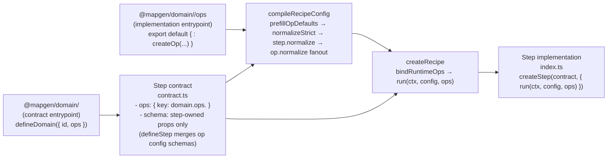

# WORKFLOW: Vertical Domain Refactor (Operation Modules)

This is the **canonical, end-to-end workflow** for refactoring **one MapGen domain** so it conforms to the target **contract-first ops + orchestration-only steps** architecture.

This file is intentionally a **flow-first executable checklist**: the `<workflow>` comes first; deep detail is indexed at the bottom.

## TL;DR (phase model)

1. **Phase 1: Current-state spike** → write `docs/projects/engine-refactor-v1/resources/spike/spike-<domain>-current-state.md`
2. **Phase 2: Modeling spike (first principles)** → write `docs/projects/engine-refactor-v1/resources/spike/spike-<domain>-modeling.md`
3. **Phase 3: Implementation plan + slice plan** → write/update `docs/projects/engine-refactor-v1/issues/LOCAL-TBD-<milestone>-<domain>-*.md`
4. **Phase 4: Implementation (slices)** → refactor domain + stage code (one slice at a time; no dual paths)
5. **Phase 5: Verification + cleanup + submit** → run gates, submit, remove worktrees

## Hard rules (do not violate)

- **Contract-first:** All domain logic is behind op contracts (`mods/mod-swooper-maps/src/domain/<domain>/ops/**`).
- **No op composition:** Ops are atomic; ops must not call other ops (composition happens in steps/stages).
- **Steps are orchestration:** step modules must not import op implementations; they call injected ops in `run(context, config, ops)`.
- **Compile-time normalization:** defaults + `step.normalize` + `op.normalize`; runtime does not “fix up” config.
- **Import discipline:** step `contract.ts` imports only `@mapgen/domain/<domain>` (no deep imports, no `.../ops`).
- **Docs-as-code is enforced:** any touched exported function/op/step/schema gets contextual JSDoc and/or TypeBox `description` updates (trace references before writing docs).

## Golden reference (Ecology exemplar)

- Domain contract entrypoint: `mods/mod-swooper-maps/src/domain/ecology/index.ts`
- Op contracts router: `mods/mod-swooper-maps/src/domain/ecology/ops/contracts.ts`
- Op implementations router: `mods/mod-swooper-maps/src/domain/ecology/ops/index.ts`
- Representative step contract: `mods/mod-swooper-maps/src/recipes/standard/stages/ecology/steps/biomes/contract.ts`

## Decision logging

- Domain-local: append to the domain’s local issue doc under `## Implementation Decisions` (`docs/projects/engine-refactor-v1/issues/**`).
- Cross-cutting: `docs/projects/engine-refactor-v1/triage.md`.

Expanded constraints, wiring diagram, and the “outside view” file surfaces are in the appendices below.

<workflow>

<step name="phase-0-setup">

**Objective:** Create an isolated worktree and establish a known-good baseline before touching the domain.

**Inputs:**
- `<domain>` (e.g. `foundation | morphology | narrative | hydrology | placement | ecology`)
- `<milestone>` (e.g. `M8`)

**Outputs:**
- A new branch and worktree for the domain refactor.
- A recorded baseline run of verification gates (so regressions are attributable).

**Steps (primary checkout):**

Preflight (stop if dirty):
```bash
git status
gt ls
git worktree list
```

Sync trunk metadata without restacking:
```bash
gt sync --no-restack
```

Create a new branch (empty branch is fine):
```bash
gt create refactor-<milestone>-<domain>
```

Create and enter a worktree:
```bash
git worktree add ../wt-refactor-<milestone>-<domain> refactor-<milestone>-<domain>
cd ../wt-refactor-<milestone>-<domain>
```

Patch-path guard (mandatory):
- Only edit files inside the worktree path.

Install dependencies (only if you will run checks here):
```bash
pnpm install
```

Baseline gates (mandatory; once per domain refactor):
```bash
pnpm -C packages/mapgen-core check
pnpm -C packages/mapgen-core test
pnpm -C mods/mod-swooper-maps check
pnpm -C mods/mod-swooper-maps test
pnpm -C mods/mod-swooper-maps build
pnpm deploy:mods
```

**Commit rules (Graphite-only; do not use `git commit`):**
```bash
gt add -A
gt modify --commit -am "refactor(<domain>): <slice or doc summary>"
```

**Gate (do not proceed until):**
- [ ] Worktree exists and you are operating inside it (`pwd -P` shows the worktree path).
- [ ] Baseline gates are green (or failures are recorded with links + rationale).

**References:**
- Routers: `mods/mod-swooper-maps/AGENTS.md` and any closer scoped `AGENTS.md` for touched files
- Canonical docs (read once before Phase 1): see “Reference index” below

</step>

<step name="phase-1-current-state-spike">

**Objective:** Produce a grounded “where it stands vs where it should be” spike for this domain (inventory + boundary violations + deletion list).

**Outputs:**
- `docs/projects/engine-refactor-v1/resources/spike/spike-<domain>-current-state.md`
  - complete step map (allsites that touch the domain)
  - requires/provides inventory (artifact contracts + owners)
  - config surface map (schemas/defaults/normalizers + runtime fixups to delete)
  - typed-array inventory (constructors, lengths, validators)
  - deletion list (symbols + file paths that must go to zero)

**Gate (do not proceed until):**
- [ ] All 5 inventory artifacts exist in the spike doc (not in scattered notes).
- [ ] Every boundary violation in scope is either (a) listed as a slice target, or (b) already eliminated.

**References:**
- `docs/projects/engine-refactor-v1/resources/workflow/domain-refactor/references/domain-inventory-and-boundaries.md`

</step>

<step name="phase-2-modeling-spike">

**Objective:** Define “how this domain should look” from first principles + our architecture, producing a no-optionality target model.

Modeling posture (enforced):
- operations are **atomic** (no op-calls-op composition),
- composition happens in steps/stages,
- rules are **policy units** imported into ops/strategies (avoid generic helper drift).

**Outputs:**
- `docs/projects/engine-refactor-v1/resources/spike/spike-<domain>-modeling.md`
  - target op catalog (ids + kinds + input/output/config schemas + defaults + normalize ownership)
  - artifact contracts (who owns which typed arrays / POJOs, and how they flow)
  - policy/rules map (what decisions exist and where they should live)
  - step/stage composition plan (which steps orchestrate which ops and in what order)
  - explicit non-goals (what modeling work is deferred, if any)

**Gate (do not proceed until):**
- [ ] Op catalog is locked with no optionality (no “could do A or B”).
- [ ] No op depends on another op (composition is step/stage-owned).
- [ ] Policy/rules posture is explicit (where decisions live; what’s just plumbing).

**References:**
- `docs/projects/engine-refactor-v1/resources/spec/SPEC-DOMAIN-MODELING-GUIDELINES.md`
- ADRs: `docs/projects/engine-refactor-v1/resources/spec/adr/adr-er1-030-operation-inputs-policy.md`, `docs/projects/engine-refactor-v1/resources/spec/adr/adr-er1-034-operation-kind-semantics.md`, `docs/projects/engine-refactor-v1/resources/spec/adr/adr-er1-035-config-normalization-and-derived-defaults.md`

</step>

<step name="phase-3-implementation-plan-and-slice-plan">

**Objective:** Translate the spikes into a deterministic implementation issue and an executable slice plan.

**Outputs:**
- A local implementation issue doc (domain-local “source of truth”):
  - `docs/projects/engine-refactor-v1/issues/LOCAL-TBD-<milestone>-<domain>-*.md`
- A slice plan in that issue doc, including for each slice:
  - step(s) included (ids + file paths)
  - ops introduced/changed (ids + kinds + module paths)
  - legacy entrypoints to delete (file paths / exports)
  - tests to add/update (op contract tests + any thin integration edge)
  - guardrail scope (`REFRACTOR_DOMAINS=...`)

**Gate (do not proceed until):**
- [ ] Slice plan is written and reviewable.
- [ ] Every planned slice can end in a working state (no “we’ll delete later”).

**References:**
- `docs/projects/engine-refactor-v1/resources/workflow/domain-refactor/references/op-and-config-design.md`
- `docs/projects/engine-refactor-v1/resources/workflow/domain-refactor/references/verification-and-guardrails.md`

</step>

<step name="phase-4-implementation-slices">

**Objective:** Implement the refactor in small, end-to-end slices with no dual paths.

Canonical authoring surface (do not invent alternates):
- Ops: `defineOp(...)` + `createOp(contract, { strategies })`
- Strategies: `createStrategy(contract, "<strategyId>", { normalize?, run })` (must include `"default"`)
- Domain contracts: `defineDomain({ id, ops })` (contract-only; safe for step contracts)
- Steps: `defineStep(...)` + `createStep(contract, { normalize?, run })` (via a bound `createStepFor<TContext>()`)

Import boundaries (enforced):
- Step `contract.ts` imports **only** the domain contract entrypoint (`@mapgen/domain/<domain>`) and recipe-local utilities.
- Step runtime calls injected ops in `run(context, config, ops)`; it must not import implementations.
- Recipe wiring is the only layer allowed to import `@mapgen/domain/<domain>/ops` to build `compileOpsById`.

**Slice completion checklist (repeat for each slice):**

1) Extract ops for the slice
- Create/update op modules under `mods/mod-swooper-maps/src/domain/<domain>/ops/**`.
- Op boundary is POJO/POJO-ish only (typed arrays ok); no adapters/context/RNG callbacks cross the boundary.
- Op module shape is fixed (see “Expected file surfaces” below).

2) Wire steps for the slice
- Promote step(s) into the contract-first step module shape (`contract.ts` + `index.ts` + optional `lib/**`).
- Step contracts declare op contracts via `ops: { <key>: domain.ops.<opKey> }`.
- Step runtime calls injected ops: `ops.<key>(input, config.<key>)`.
- If you added/changed ops for this slice, update stage/recipe wiring to include the op implementations in the compile-time op registry (recipe wiring is the only layer allowed to import `@mapgen/domain/<domain>/ops`).

3) Delete legacy for the slice
- Delete legacy entrypoints/helpers for the migrated steps; no compat exports or “old/new” switches.

4) Tests for the slice
- Add at least one deterministic op contract test.
- If artifact/config contracts changed across steps, add one thin integration test for the edge.

5) Documentation for the slice (required)
- Trace callsites/references first (code-intel; do not guess intent).
- Add/refresh JSDoc for any touched exported symbol (behavior/why/edge cases).
- Add/refresh TypeBox `description` for any touched schema fields (especially config; describe behavioral impact and interactions).

6) Guardrails for the slice
```bash
REFRACTOR_DOMAINS="<domain>[,<domain2>...]" ./scripts/lint/lint-domain-refactor-guardrails.sh
```

7) Commit the slice (Graphite-only)
```bash
gt add -A
gt modify --commit -am "refactor(<domain>): <slice summary>"
```

**Gate (do not proceed to next slice until):**
- [ ] Legacy paths for this slice are deleted.
- [ ] Slice guardrails are green.
- [ ] Slice tests are green.
- [ ] Slice docs-as-code updates are complete.

**References:**
- Extended slice guidance: `docs/projects/engine-refactor-v1/resources/workflow/domain-refactor/subflows/IMPLEMENTATION.md`
- “Truth of behavior” source files: see “Reference index” below

</step>

<step name="phase-5-verify-cleanup-submit">

**Objective:** Run end-to-end gates, submit, and leave no loose ends.

**Verification gates (must be green):**
```bash
pnpm -C packages/mapgen-core check
pnpm -C packages/mapgen-core test
pnpm -C mods/mod-swooper-maps check
pnpm -C mods/mod-swooper-maps test
pnpm -C mods/mod-swooper-maps build
pnpm deploy:mods
```

**Submit:**
```bash
gt ss --draft
```

Include in PR notes:
- what was deleted (deletion list),
- what contracts changed (requires/provides, artifact shapes, config keys),
- what tests were added and how to run them.

**Worktree cleanup (after submission):**
```bash
git worktree list
```

Remove only the worktrees you created for this refactor.

**Gate (done when):**
- [ ] Full verification gates are green.
- [ ] PR/stack is submitted.
- [ ] Worktrees are cleaned up and `git worktree list` is sane.

**References:**
- `docs/projects/engine-refactor-v1/resources/workflow/domain-refactor/references/verification-and-guardrails.md`

</step>

</workflow>

## Appendix A: Expanded constraints and invariants (reference)

Canonical TypeScript rules (hard rules):
- Use `OpTypeBag` from `@swooper/mapgen-core/authoring` for all shared op types (`types.ts` is the only shared type surface).
- Do not export or re-export types from helpers or rules; shared types live in `types.ts` only.
- `rules/**` must not import `../contract.js` (type-only or runtime). Use `../types.js` for types and core SDK packages for utilities.

Execution posture:
- Proceed end-to-end; only stop if continuing would cause dangerous side effects (data loss, breaking public contracts without updating consumers, or violating the canonical spec/ADRs).
- Router compliance: before editing any file, read the closest `AGENTS.md` router that scopes that file.

Non-negotiable invariants (target architecture):
- Ops are the contract; steps never call internal domain helpers directly.
- Ops are atomic; ops must not call other ops (composition happens in steps/stages).
- No runtime “views” cross the op boundary (POJOs + typed arrays only).
- Op contracts own schemas and default configs; step contracts declare which op contracts they use via `contract.ops`.
- `defineStep({ ops })` merges declared op configs into the step schema automatically (step schemas only declare step-owned props).
- Plan compilation produces final configs; runtime treats `node.config` as “the config” (no runtime defaulting merges).
- No dual paths, shims, translators, DeepPartial override blobs, or fallback behaviors within scope.

## Appendix B: Target architecture diagram (wiring)



## Appendix C: Expected file surfaces (outside view)

```txt
mods/mod-swooper-maps/src/domain/<domain>/
  index.ts                # contract entrypoint (defineDomain); safe for step contracts
  config.ts               # optional; thin re-export surface for domain-owned schemas/constants
  ops/
    contracts.ts          # op contracts registry (export const contracts = { ... })
    index.ts              # op implementations registry (export default { ... } satisfies contracts)
    <op>/
      contract.ts
      types.ts
      rules/
        index.ts
      strategies/
        default.ts
        index.ts
      index.ts

mods/mod-swooper-maps/src/recipes/standard/stages/<stage>/
  index.ts                # stage module (createStage), wires steps + knobsSchema + compile-time op registry
  steps/
    <step>/
      contract.ts         # defineStep({ ops, schema, requires/provides })
      index.ts            # createStep(contract, { normalize?, run(ctx, config, ops) })
      lib/                # optional pure helpers
```

## Reference index

Read once before Phase 1:
- `docs/projects/engine-refactor-v1/resources/repomix/gpt-config-architecture-converged.md`
- `docs/projects/engine-refactor-v1/resources/spec/SPEC-step-domain-operation-modules.md`
- `docs/projects/engine-refactor-v1/resources/spec/SPEC-DOMAIN-MODELING-GUIDELINES.md`

Consult while modeling (Phase 2):
- `docs/projects/engine-refactor-v1/resources/spec/adr/adr-er1-030-operation-inputs-policy.md`
- `docs/projects/engine-refactor-v1/resources/spec/adr/adr-er1-034-operation-kind-semantics.md`
- `docs/projects/engine-refactor-v1/resources/spec/adr/adr-er1-035-config-normalization-and-derived-defaults.md`
- `docs/projects/engine-refactor-v1/resources/spec/SPEC-global-invariants.md`
- `docs/projects/engine-refactor-v1/triage.md`

Truth of behavior (consult as needed while implementing):
- `packages/mapgen-core/src/compiler/recipe-compile.ts` (compile-time config normalization + op normalize fanout)
- `packages/mapgen-core/src/compiler/normalize.ts` (strict normalize pipeline)
- `packages/mapgen-core/src/authoring/recipe.ts` (runtime ops injection into `step.run(context, config, ops)`)
- `packages/mapgen-core/src/authoring/step/contract.ts` (`defineStep` schema merge + ops-derived config keys)
- `packages/mapgen-core/src/authoring/op/contract.ts` (`defineOp`)
- `packages/mapgen-core/src/authoring/op/create.ts` (`createOp`)
- `packages/mapgen-core/src/authoring/op/strategy.ts` (`createStrategy`)
- `packages/mapgen-core/src/authoring/bindings.ts` (`collectCompileOps`, `bindRuntimeOps`)
- `mods/mod-swooper-maps/test/support/compiler-helpers.ts` (canonical test helpers for config normalization)

Workflow package references (keep open while implementing):
- `docs/projects/engine-refactor-v1/resources/workflow/domain-refactor/references/structure-and-module-shape.md`
- `docs/projects/engine-refactor-v1/resources/workflow/domain-refactor/references/domain-inventory-and-boundaries.md`
- `docs/projects/engine-refactor-v1/resources/workflow/domain-refactor/references/op-and-config-design.md`
- `docs/projects/engine-refactor-v1/resources/workflow/domain-refactor/references/verification-and-guardrails.md`
- `docs/projects/engine-refactor-v1/resources/workflow/domain-refactor/subflows/IMPLEMENTATION.md`

Prior art / sequencing helpers:
- `docs/projects/engine-refactor-v1/resources/workflow/domain-refactor/examples/VOLCANO.md`
- `docs/projects/engine-refactor-v1/resources/spike/spike-domain-refactor-sequencing.md`
- Standard recipe stage order: `mods/mod-swooper-maps/src/recipes/standard/recipe.ts`
