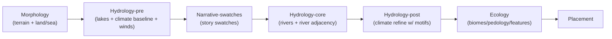

# Hydrology Domain Refactor — Phase 1 Current‑State Spike (Synthesis)

Purpose: capture **evidence‑based current state** (wiring, contracts, boundary violations, legacy surfaces, and producer/consumer map) for the Hydrology vertical refactor so Phase 2 modeling reconciles **greenfield intent** with **reality**, not assumptions.

This synthesis combines the strongest, non‑conflicting elements from:
- `spike-hydrology-current-state.md`
- `spike-hydrology-current-state-gpt-web.md`
- `spike-hydrology-current-state-gemini.md`

Scope guardrails (do not violate):
- This is **current-state only**. No target modeling and no slice plan.
- Capture **facts** (file paths, callsites, contract ids). Interpretation is allowed only when tied back to evidence.
- Include “greenfield delta notes” as **constraints/contradictions**, not as design proposals.

Important note (avoid phase bleed):
- The current pipeline includes **author‑driven climate interventions** (notably “swatches” and story motifs) that directly perturb climate buffers.
- This spike inventories those surfaces as **current-state evidence only**. Phase 2 must treat them as **legacy intervention mechanisms** to remove, not as acceptable target capabilities.

---

## Authority stack (for Phase 1 evidence)

**Primary evidence (code + wiring):**
- `mods/mod-swooper-maps/src/recipes/standard/recipe.ts` (stage order + orchestration)
- `mods/mod-swooper-maps/src/recipes/standard/stages/**` (step contracts + implementations)
- `mods/mod-swooper-maps/src/domain/hydrology/**` (domain exports + runtime code)
- `mods/mod-swooper-maps/src/domain/narrative/**` (cross-domain calls into Hydrology)
- `mods/mod-swooper-maps/src/domain/config.ts` (author-facing schema barrel; types)

**Supporting context (non-authoritative for target model):**
- Phase 0.5 greenfield sketch (for delta notes only): `docs/projects/engine-refactor-v1/resources/spike/spike-hydrology-greenfield.md`
- Workflow guides (structure & required outputs): `docs/projects/engine-refactor-v1/resources/workflow/domain-refactor/WORKFLOW.md`

---

## Executive snapshot (what the evidence says)

Current Hydrology is split across multiple stages and mixes:
- engine-backed lake/river generation,
- a “climate baseline” pass plus a “refine” pass,
- and **author/story-driven climate overrides** (swatches) wired as a standalone stage.

Key boundary violations (evidence-backed):
- Narrative owns a stage that calls Hydrology’s swatch climate function (cross-domain inversion).
- Hydrology’s refine step reads narrative motif overlays (Hydrology consuming Narrative inputs to alter climate), which contradicts the physics-first target posture.

---

## Pipeline snapshot (current)

### Standard recipe stage order (current)

From `mods/mod-swooper-maps/src/recipes/standard/recipe.ts`:
1. `foundation`
2. `morphology-pre`
3. `narrative-pre`
4. `morphology-mid`
5. `narrative-mid`
6. `morphology-post`
7. `hydrology-pre`
8. `narrative-swatches`
9. `hydrology-core`
10. `narrative-post`
11. `hydrology-post`
12. `ecology`
13. `placement`

This ordering strongly suggests the system currently treats climate/water as a multi-pass process that can be perturbed by narrative between passes.

---

## Domain surface inventory (outside view; importable/depended-on surfaces)

### A) Hydrology domain entrypoint + ops

- `mods/mod-swooper-maps/src/domain/hydrology/index.ts`
  - `defineDomain({ id: "hydrology", ops })`
- Ops wiring:
  - `mods/mod-swooper-maps/src/domain/hydrology/ops/contracts.ts`
  - `mods/mod-swooper-maps/src/domain/hydrology/ops/compute-wind-fields/contract.ts`
  - `mods/mod-swooper-maps/src/domain/hydrology/ops/compute-wind-fields/index.ts`

Observed characteristics:
- `hydrology/compute-wind-fields` exists as a contract-first op with typed-array IO and deterministic seeded RNG behavior (per implementation).
- This is a meaningful “physics pipeline” foothold already present in current state (but it is only one piece of the target model).

### B) Hydrology climate module subtree (called by steps; also indirectly by Narrative)

- `mods/mod-swooper-maps/src/domain/hydrology/climate/index.ts`
  - `applyClimateBaseline(...)`
  - `applyClimateSwatches(...)` (**author intervention surface**)
  - `refineClimateEarthlike(...)`
- Runtime helpers:
  - `mods/mod-swooper-maps/src/domain/hydrology/climate/runtime.ts`
  - `mods/mod-swooper-maps/src/domain/hydrology/climate/types.ts`
- Baseline-related:
  - `mods/mod-swooper-maps/src/domain/hydrology/climate/baseline.ts`
  - `mods/mod-swooper-maps/src/domain/hydrology/climate/distance-to-water.ts`
- Refinement subtree:
  - `mods/mod-swooper-maps/src/domain/hydrology/climate/refine/**`
  - includes multiple subpasses (e.g., orographic shadow refinement, hotspot microclimates refinement, river corridor refinement, etc.)
- Swatches subtree (**legacy author-driven overrides**):
  - `mods/mod-swooper-maps/src/domain/hydrology/climate/swatches/**`
  - includes multiple swatch types and weighted selection helpers.

### C) Recipe-owned hydrology utilities (not domain-owned)

- `mods/mod-swooper-maps/src/recipes/standard/stages/hydrology-core/river-adjacency.ts`
  - `computeRiverAdjacencyMask(ctx, radius=1)`
  - uses engine-backed adjacency (`ctx.adapter.isAdjacentToRivers(...)`)

---

## Step map (callsites that touch Hydrology)

### Stage `hydrology-pre`

- Step `hydrology-pre/lakes`
  - contract: `mods/mod-swooper-maps/src/recipes/standard/stages/hydrology-pre/steps/lakes.contract.ts`
  - impl: `mods/mod-swooper-maps/src/recipes/standard/stages/hydrology-pre/steps/lakes.ts`
  - calls engine lake generation and syncs heightfield
- Step `hydrology-pre/climate-baseline`
  - contract: `mods/mod-swooper-maps/src/recipes/standard/stages/hydrology-pre/steps/climateBaseline.contract.ts`
  - impl: `mods/mod-swooper-maps/src/recipes/standard/stages/hydrology-pre/steps/climateBaseline.ts`
  - calls:
    - `hydrology/compute-wind-fields` op
    - `applyClimateBaseline(...)`
  - publishes climate + wind artifacts (see contract matrix below)

### Stage `narrative-swatches` (Narrative-owned step calling Hydrology climate swatches)

- Step `narrative-swatches/story-swatches`
  - contract: `mods/mod-swooper-maps/src/recipes/standard/stages/narrative-swatches/steps/storySwatches.contract.ts`
  - impl: `mods/mod-swooper-maps/src/recipes/standard/stages/narrative-swatches/steps/storySwatches.ts`
  - calls Narrative function that calls Hydrology `applyClimateSwatches(...)` under the hood

This is a current boundary violation to explicitly eliminate in the target model (but Phase 1 only inventories it).

### Stage `hydrology-core`

- Step `hydrology-core/rivers`
  - contract: `mods/mod-swooper-maps/src/recipes/standard/stages/hydrology-core/steps/rivers.contract.ts`
  - impl: `mods/mod-swooper-maps/src/recipes/standard/stages/hydrology-core/steps/rivers.ts`
  - calls engine river modeling; also triggers Narrative climate tagging and computes `riverAdjacency`
  - publishes `artifact:riverAdjacency` and provides an `effect:engine.riversModeled` tag

### Stage `hydrology-post`

- Step `hydrology-post/climate-refine`
  - contract: `mods/mod-swooper-maps/src/recipes/standard/stages/hydrology-post/steps/climateRefine.contract.ts`
  - impl: `mods/mod-swooper-maps/src/recipes/standard/stages/hydrology-post/steps/climateRefine.ts`
  - calls `refineClimateEarthlike(...)`
  - reads narrative motif overlays (rifts/hotspots) via overlay readers

This is the second major boundary violation: Hydrology climate mutation influenced by Narrative motif overlays.

---

## Contract matrix (current-state)

This section summarizes what the current system consumes and publishes at step boundaries (as evidenced by the step contracts and implementations listed above).

### Upstream intake (current)

Hydrology steps and Hydrology climate runtime appear to depend on:
- world topology / width-height + latitude basis (passed or queried),
- Morphology’s terrain state via `ctx.adapter` and `ctx.buffers.heightfield` (elevation + land/sea),
- engine-backed mutation/compute calls (lakes, rivers, terrain validation),
- narrative overlays/motifs (consumed during climate refine step),
- “river adjacency” derived from engine river state (computed in recipe-owned helper).

### Hydrology outputs (current)

Published artifacts (as staged outputs):
- `artifact:heightfield` (after lakes; heightfield synced)
- `artifact:climateField` (after climate baseline; then mutated by swatches + refine)
- `artifact:windField` (after compute-wind-fields)
- `artifact:riverAdjacency` (after rivers)

Observed type posture:
- Some artifacts/schemas are strict typed arrays; others are loose (`Type.Any()` appears in some schema positions per Phase 1 evidence). This unevenness is a current-state constraint for Phase 2/3 to reconcile.

---

## Legacy surface inventory (current “thumb-on-scale” mechanisms)

Evidence-backed legacy intervention surfaces include:
- Hydrology’s `applyClimateSwatches(...)` and the `climate/swatches/**` subtree (region-scale climate overrides).
- Climate refinement subpasses that incorporate narrative motifs (rifts/hotspots) as direct inputs to climate mutation.

These surfaces must be treated as legacy “intervention mechanisms” rather than physics mechanisms:
- Phase 2 model must not adopt them as legitimate Hydrology inputs.
- Phase 3 planning must explicitly classify them (keep/kill/migrate) and plan consumer migrations.

---

## Current producer/consumer map (evidence view)

Notable: Narrative sits *between* Hydrology climate passes and is currently able to perturb climate fields directly (via swatches and overlays).

---

## Greenfield delta notes (constraints/contradictions for Phase 2)

These are Phase 0.5 contradictions revealed by evidence (no modeling changes here; just constraints):

- **Hydrology is not a single contiguous stage today.** It is split across `hydrology-pre/core/post` with a Narrative interleave; Phase 2 must model a clean causality spine that does not require narrative interleave.
- **“Swatches” are a first-class pipeline stage today.** This is explicit evidence of legacy author intervention; Phase 2 must explicitly ban it.
- **Hydrology climate refine consumes narrative motifs today.** The current system encodes “story theming” by mutating climate; Phase 2 must treat this as forbidden coupling (Narrative may only consume physics outputs).
- **Engine is an active participant.** Lakes/rivers are generated via adapter/engine calls today; Phase 2 must model stable contracts that do not rely on hidden engine state, even if engine calls remain during implementation.
- **Typed-array strictness is uneven.** Phase 2 should expect to tighten contracts (but Phase 1 only notes the mismatch).

---

## Lookback 1 (what this changes about how we approach Phase 2)

What Phase 1 evidence makes unavoidable:
- Phase 2 modeling must explicitly address the “split” (baseline → swatches → rivers → refine) and replace it with a single, causal Hydrology spine.
- Phase 2 must explicitly forbid Narrative→Hydrology feedback (both swatches and motif-driven refine).
- Phase 2 must treat “climate refine because rivers exist” as a symptom of an incoherent causal model and avoid encoding it into the target design.

What Phase 1 leaves open (to be decided in Phase 2/3, not here):
- Whether routing/hydrography should be fully owned by Hydrology or partially provided by Morphology as an upstream artifact (ownership boundary).
- The exact stable downstream-facing surfaces and how strictly they must mirror engine expectations.
