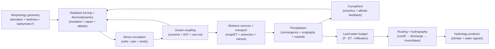

# Hydrology Domain Refactor — Phase 0.5 Greenfield Pre‑Work (Synthesis)

Purpose: do **earth‑physics‑first, greenfield** Hydrology design thinking *before* current‑state mapping (Phase 1) and target‑state modeling (Phase 2), so Phase 2 is not biased toward legacy shapes.

This synthesis combines the strongest, non‑conflicting elements from:
- `spike-hydrology-greenfield.md`
- `spike-hydrology-greenfield-gpt-web.md`
- `spike-hydrology-greenfield-gemini.md`

Scope guardrails (do not violate):
- No current-state mapping here (no file inventories, no “this step does X today”).
- No contract locking here (no schema decisions, no slice plans).
- Hydrology is a **single domain**; “subdomains” below are **internal organization only**.
- **No author/designer thumbs on the scale** (no swatches/paint/overlays that directly force climate/water outcomes). “Knobs” are allowed only as **semantic inputs** that compile to internal physics parameters.

References:
- Workflow (canonical): `docs/projects/engine-refactor-v1/resources/workflow/domain-refactor/WORKFLOW.md`
- Phase 0.5 reference: `docs/projects/engine-refactor-v1/resources/workflow/domain-refactor/references/phase-0-greenfield-prework.md`
- Domain inventory & boundaries: `docs/projects/engine-refactor-v1/resources/workflow/domain-refactor/references/domain-inventory-and-boundaries.md`
- Earth-physics posture: `docs/projects/engine-refactor-v1/resources/workflow/domain-refactor/references/earth-physics-and-domain-specs.md`
- Architecture vocabulary (buffers/artifacts/overlays): `docs/system/libs/mapgen/architecture.md`

---

## Authority stack (for Phase 0.5)

**Canonical (within repo):**
- `docs/system/libs/mapgen/architecture.md`
- `docs/system/libs/mapgen/hydrology.md`
- `docs/system/libs/mapgen/morphology.md`
- `docs/system/libs/mapgen/ecology.md`
- `docs/system/libs/mapgen/narrative.md`
- `docs/system/libs/mapgen/placement.md`

**Seed (ideas only; not authoritative):**
- `docs/system/libs/mapgen/research/SPIKE-synthesis-earth-physics-systems-swooper-engine.md`
- `docs/system/libs/mapgen/research/SPIKE-earth-physics-systems-modeling-alt.md`

**External (high‑trust grounding; examples):**
- Global atmospheric circulation / cells / jets: NOAA JetStream; UK Met Office
- Orographic precipitation concepts: NOAA NWS glossary
- Wind-driven ocean circulation / boundary currents / upwelling: NOAA Ocean Service
- Cryosphere / albedo basics: NASA Earthdata

---

## Executive vision: a “living water cycle” at mapgen time

Hydrology is the map generator’s **Earth Systems engine**: it converts **Energy** (insolation/thermal gradients) and **Geography** (terrain + oceans) into **Water availability** (precipitation, runoff, rivers, lakes, ice) and climate signals (temperature, winds, aridity) that downstream systems can trust.

Core posture:
- **Emergence over intervention:** deserts, rainforests, storm tracks, and snowlines exist because the modeled processes imply them—not because anything paints them.
- **Conservation mentality (abstracted):** water is sourced (evap/ET), transported, precipitated, stored (snow/ice/lakes), and routed; it does not appear/disappear via ad‑hoc “wetness modifiers”.
- **Deterministic:** identical physical inputs + seed ⇒ identical outputs (no hidden runtime randomness; optional “climate regime” is seed‑selected, not interactive).
- **High fidelity by abstraction:** we model the *right* causal mechanisms using graph/field operations and bounded passes—not full CFD.
- **Explainable:** the system should be able to answer “why is this place wet/dry/cold?” with derived diagnostics.

Anti‑patterns to reject explicitly:
- “Latitude bands as the climate model” (latitude matters as forcing, not as the whole answer).
- Any “swatch/paint” or story-driven override that directly perturbs climate/water inside Hydrology.
- Post-hoc “fix climate because rivers exist” (rivers should be consequences of precipitation + routing + storage).

---

## Boundaries (Hydrology vs neighbors)

Hydrology’s greenfield scope is large, but it must still respect clean boundaries:

| Domain | Owns (greenfield) | Does not own |
| --- | --- | --- |
| Foundation | planet-scale topology + coordinate basis; regional mesh/graph; global parameters | climate/water outcomes |
| Morphology | land/sea geometry; elevation; topographic derivatives; (ideally) bathymetry/coastal shelf; routing geometry policy | rainfall/winds/water budgets |
| **Hydrology (this)** | climate abstraction (winds/temperature/precip); ocean coupling; cryosphere; water budgets; routing → rivers/lakes/wetness signals | biomes/features/resources; story overrides |
| Ecology | biome/vegetation/soils interpretation; features/resources | climate simulation and hydrography solving |
| Narrative | story overlays derived from physics products (tagging, theming, playability) | feeding back into Hydrology outputs |
| Placement | start/wonder/resource placement consuming Hydrology/Ecology/Narrative | climate/water computation |

Boundary locks for later phases (stated here as greenfield intent):
- Narrative may **consume** Hydrology products, but Hydrology may not consume narrative overlays to alter physics.
- Hydrology should expose **continuous** fields (e.g., temperature, aridity, wetness) and derived indices; Ecology owns turning those into discrete biomes/features.

---

## Ideal internal decomposition (organizational subdomains)

Hydrology is one domain; internally it is useful to organize into submodules that mirror causality:

1) **Intake + geometry helpers** (from Morphology/Foundation)
   - land/sea, elevation, (ideally) bathymetry, cell areas, slopes/roughness, distance-to-coast, coastal orientation.
2) **Radiative forcing + thermodynamics (cheap)**
   - insolation proxy from latitude + seasonality/tilt; lapse rate; land/ocean thermal contrast; albedo influence.
3) **Atmospheric circulation scaffold**
   - Hadley/Ferrel/Polar cell scaffolding; **jet streams** and storm-track proxies; prevailing wind vectors per season.
4) **Ocean coupling**
   - wind-driven surface currents; coastal upwelling proxy; SST/heat-transport influence; sea ice coupling.
5) **Moisture source + transport**
   - evaporation from ocean (SST/temperature + wind), land ET proxy; advection/rainout along wind; continentality effects.
6) **Precipitation formation**
   - convergence (ITCZ/storm tracks/monsoons); orographic uplift; lee-side rain shadow; coastal onshore precipitation.
7) **Cryosphere**
   - snow accumulation/melt; sea ice extent; bounded **albedo feedback** into temperature forcing.
8) **Land water budget + hydrography**
   - runoff = precip − ET − infiltration proxy; routing; discharge; rivers; lakes (including endorheic basins); wetlands/wetness suitability.
9) **Diagnostics / explainability**
   - “why fields”: convergence factor, rain-shadow factor, continentality, upwelling influence, freeze/snow persistence.

---

## Causality spine (greenfield)

The central requirement is that *the spine is causal and directional*, with only bounded feedback where realism demands it.

Feedback posture:
- Cryosphere/albedo feedback is **bounded** (e.g., 1–2 passes) to keep determinism, performance, and interpretability.
- Seasonality is represented with **2–4 discrete seasons** (not time-stepping).

---

## Greenfield capability targets (what Hydrology should be capable of)

These targets define the *ideal* envelope; Phase 2 will decide what is in-scope for the locked model and what is deferred.

### A) Climate realism targets (implementable abstractions)

- **Jet-stream / storm-track influence**: mid-lat wet belts emerge from storm-track scaffolding, not noise bands.
- **ITCZ + seasonal migration**: tropical rain belt shifts with seasonality/tilt.
- **Monsoons**: seasonal wind reversal + precipitation intensification from land–ocean heating contrast.
- **Orographic precipitation + rain shadows**: windward wet / leeward dry is first-class and diagnostic.
- **Ocean currents + upwelling**: warm currents soften high-lat coasts; cold eastern boundary currents + upwelling create dry west-coast subtropics.
- **Teleconnection hook (optional)**: ENSO-like global regime as a deterministic, seed-driven “mode” that shifts jets/rain belts (cheap but high leverage).

### B) Microclimate targets (high-leverage local effects)

- windward/leeward asymmetry around mountain chains,
- continental interiors dry from rainout and distance-to-moisture-source,
- coastal wetness and fog belts from cold-current upwelling patterns,
- altitude-driven snowlines and rain→snow phase transitions,
- lake/humid-adjacency local boosts as optional derived signals.

### C) Hydrology/hydrography targets (surface water + storage)

- runoff and discharge respond to precipitation and temperature (not only elevation),
- river density and basin hierarchy emerge from discharge thresholds (including “major vs minor”),
- endorheic basins and closed-drainage lakes form where topology implies them,
- wetlands/floodplain suitability emerges from wetness + low slope + discharge patterns,
- cryosphere melt contributes to seasonal runoff where enabled.

---

## Upstream ⇄ downstream diff exercise (greenfield)

Phase 0.5 must explicitly separate:
- what exists today (likely), vs
- what Hydrology would ideally consume/produce to reach the north star.

### Upstream: available today vs ideal needs (change-candidates)

**Likely available (typical pipeline inputs):**
- region mesh / neighbor graph (Foundation),
- elevation / land–sea mask (Morphology),
- latitude basis / wrap semantics (global),
- coastline distance and slope derivatives (derivable if not produced).

**Ideal upstream needs (high leverage, realism-per-cost):**
- **Bathymetry or signed elevation** (ocean depth proxy) for credible currents/sea ice and coastal gradients.
- **Cell area** (or equivalent) for conservation-ish budgets (precip/runoff integration).
- **Topographic derivatives** published as stable products (slope/roughness/orographic barrier indices), to avoid recomputation and contract drift.
- **Coastal shelf / shallow-water proxy** (even coarse), for upwelling/coastal current behaviors.
- **Routing ownership policy** clarified (either upstream provides routing geometry OR Hydrology owns it), to avoid duplicate, inconsistent routing.

Upstream change-candidates (later refactors):
- Publish bathymetry/coastal shelf proxy from Morphology.
- Publish stable “geo helpers” (slope, roughness, distance-to-coast, continentality).
- Standardize cell-area semantics for budgets.

### Downstream: what Hydrology should provide (and what it unlocks)

**Downstream should be able to rely on:**
- climate: temperature (mean + seasonality), precipitation (mean + seasonality), aridity index (P vs PET proxy), freeze index, wind vectors (for sailing/story/diagnostics),
- water: runoff/discharge, river network projection (incl. magnitude), lakes (mask + ids), wetness suitability for wetlands/floodplains,
- cryosphere: snow/ice extent and persistence indices, albedo proxy.

**Unlocks / downstream change-candidates:**
- Ecology can become **field-driven** (continuous moisture/temperature constraints) rather than band-driven or authored.
- Placement can distinguish “freshwater adjacency” from “major river access” from “navigable river corridor”.
- Narrative can derive themes/overlays from physics products without contaminating Hydrology.

---

## Parameterization posture (semantic knobs, not overrides)

Greenfield Hydrology must be tunable without becoming author-painted.

Allowed:
- small set of **semantic knobs** (scenario- or map-setting-level), e.g. `dryness`, `temperature`, `seasonality`, `oceanCoupling`, `cryosphere`, `riverDensity`.
- knobs compile into internal physics parameters at a stable normalization boundary.

Forbidden:
- region-specific overrides (“paint this desert belt here”),
- injecting story motifs into climate/water computation.

Design intent for knobs:
- knobs alter **drivers** (evaporation rates, circulation strength, orographic efficiency, regime selection), not direct outputs (no “set rainfall here”).
- knobs are deterministic; the mapping from knob → internal parameters is stable and testable.

---

## Performance + memory reality (greenfield constraints)

This must be implementable on a Voronoi graph at mapgen time:
- Prefer **field operations** (scalar/vector per cell) and **edge masks** over heavy graph objects.
- Use **bounded passes** (e.g., 1–3 passes per subsystem; 2–4 seasonal modes).
- Quantize for storage when needed (but keep internal computations in higher precision where it matters).
- Avoid unbounded iterative solvers; if a phenomenon needs iteration (albedo/ice), cap iterations explicitly.

---

## Lookback 0.5 (what to validate in Phase 1)

Questions/assumptions to validate as evidence (not modeling):
- What physical inputs exist today (latitude basis, cell area semantics, bathymetry or proxies)?
- What downstream consumers implicitly expect (e.g., “navigable vs minor rivers”, river adjacency semantics, climate field quantization)?
- Where are the existing “thumb-on-scale” surfaces (swatches/overlays/refinement) and how they enter the pipeline (to be inventoried in Phase 1)?
- What determinism constraints exist in practice (seed handling, RNG scope, quantization rules)?
- What is the pipeline’s actual stage order and cross-domain coupling (so Phase 2 can explicitly break forbidden feedback paths)?

Risk notes:
- Without bathymetry, ocean coupling must start with a defensible proxy (e.g., distance-to-coast depth proxy) and document its limits.
- If routing is owned elsewhere today, Phase 2 must explicitly decide where routing lives in the greenfield model (but Phase 0.5 does not lock it).
