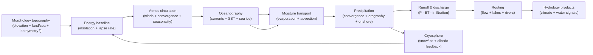

# Hydrology Domain Refactor — Phase 0.5 Greenfield Pre-Work Spike

Purpose: do **earth-physics-first, greenfield** Hydrology thinking *before* current-state mapping (Phase 1) and target-state modeling (Phase 2), so Phase 2 is not biased toward legacy shapes.

This spike intentionally treats “Hydrology” as a **single domain** that may contain internal *submodules* (for file organization), including climate/ocean/cryosphere. These internal splits are not separate domains.

References:
- Workflow (canonical): `docs/projects/engine-refactor-v1/resources/workflow/domain-refactor/WORKFLOW.md`
- Phase 0.5 template: `docs/projects/engine-refactor-v1/resources/workflow/domain-refactor/references/phase-0-greenfield-prework.md`
- Domain boundaries (canonical): `docs/system/libs/mapgen/architecture.md`
- Hydrology domain meaning (canonical): `docs/system/libs/mapgen/hydrology.md`
- Earth-physics modeling posture (canonical): `docs/projects/engine-refactor-v1/resources/workflow/domain-refactor/references/earth-physics-and-domain-specs.md`

Scope guardrails (do not violate):
- No current-state mapping here (no file inventories, no “this step does X today”).
- No contract locking here (no target artifacts, no schema decisions, no slice plans).
- Phase 2 is “up for grabs”: legacy structure is explicitly non-authoritative.

---

## Authority stack (for this spike)

**Canonical (within this repo):**
- `docs/system/libs/mapgen/architecture.md`
- `docs/system/libs/mapgen/hydrology.md`

**Seed (use for ideas; do not treat as contract truth):**
- `docs/system/libs/mapgen/research/SPIKE-synthesis-earth-physics-systems-swooper-engine.md`
- `docs/system/libs/mapgen/research/SPIKE-earth-physics-systems-modeling-alt.md`

**External (official / high-trust references consulted):**
- NOAA JetStream: Global atmospheric circulation (Hadley/Ferrel/Polar cells): https://www.noaa.gov/jetstream/global/global-atmospheric-circulations
- UK Met Office: global circulation patterns + jet stream notes: https://weather.metoffice.gov.uk/learn-about/weather/atmosphere/global-circulation-patterns
- NOAA NWS glossary: orographic precipitation / uplift definition: https://forecast.weather.gov/glossary.php?word=OROGRAPHIC
- NOAA Ocean Service: wind-driven gyres + boundary currents (incl. climate influence examples like the Gulf Stream): https://oceanservice.noaa.gov/education/tutorial_currents/04currents3.html
- NOAA NESDIS: monsoons as seasonal wind shifts driven by land/ocean heating contrast: https://www.nesdis.noaa.gov/about/k-12-education/severe-weather/what-monsoon
- NOAA: El Niño as coupled ocean–atmosphere pattern influencing rainfall and jet stream position: https://www.noaa.gov/understanding-el-nino
- NOAA Climate.gov (archived): ITCZ/tropical rain belt + seasonal migration + monsoon interaction: https://www.climate.gov/news-features/understanding-climate/annual-migration-tropical-rain-belt

---

## Greenfield domain narrative (earth-physics-first; not legacy-shaped)

Hydrology’s north star is a **climate-aware, microclimate-producing water cycle** that is:
- **causal** (topography + oceans + circulation → moisture transport → precipitation → runoff → rivers/lakes/ice),
- **high-fidelity by abstraction** (field-based, not full CFD; but still dynamic and spatially responsive),
- **deterministic + tunable** (same inputs/seed → same outputs; knobs are semantic, not incidental),
- and **explainable** (every major climate/water outcome has a traceable “why” signal).

The core anti-pattern to reject: treating **latitude bands** (or any single scalar driver) as the primary determinant of rainfall/moisture. Latitude is a real driver (insolation), but the map generator’s value proposition comes from modeling *how* circulation, ocean heat transport, and terrain create **regional** wet/dry patterns and seasonality.

Greenfield Hydrology should produce believable outcomes such as:
- wet windward coasts, leeward rain-shadow deserts, and continental interiors with aridity gradients,
- ITCZ-style tropical rain belts that **migrate** with seasonality/tilt,
- storm-track wet mid-latitudes (baroclinic zone) and polar cold deserts,
- coastal upwelling cold currents that create dry west coasts in subtropics,
- monsoons where large landmasses and adjacent oceans create seasonal wind reversals,
- snowlines and ice margins from temperature + precipitation + elevation,
- river networks whose discharge responds to precipitation/runoff patterns, not only elevation.

---

## Boundary sketch (ownership vs neighbors)

Hydrology is a **producer of authoritative climate + water signals**. It should not “borrow” responsibilities from neighbors, but it must also not offload climate realism onto downstream domains.

| Domain | Owns (greenfield) | Produces (greenfield) | Consumes (typical) |
| --- | --- | --- | --- |
| Foundation | planet-scale geometry + substrate drivers | region mesh + large-scale drivers | n/a |
| Morphology | topography + coastal geometry + substrate (geomorph) | elevation + land/sea + (ideally) bathymetry + routing geometry | Foundation drivers |
| **Hydrology (this)** | climate system abstraction + water-cycle signals | wind/temperature/moisture/precipitation fields; runoff/discharge; rivers/lakes; cryosphere state | Morphology topography + coast + optional routing geometry |
| Ecology | biosphere interpretation + biomes/features/resources | biome classification + vegetation/soils/features | Hydrology climate + wetness + substrate |
| Narrative | story overlays + playability motifs | overlays (corridors/motifs) | consumes upstream physics products for tagging and playability (no feedback into Hydrology) |
| Placement | final starts/wonders/resources placement | placements + diagnostics | ecology + hydrology + narrative signals |

Hydrology–Ecology boundary: Hydrology provides **continuous** climate/hydrology fields and indices (e.g., aridity, seasonality, freeze index), but does not classify biomes. Ecology owns biome classification and vegetation/soil processes.

Hydrology–Morphology boundary: Morphology owns *topography creation*. Hydrology consumes it and should not reshape elevation (except potentially via explicit, slow “glacial carving” feedback in future refactor phases; not assumed by default here).

---

## Ideal subdomain decomposition + causality spine (internal; still one domain)

Hydrology can be organized internally as submodules that align to a causal spine:

1. **Energy + temperature baseline**
   - Insolation geometry (latitude + axial tilt proxy) and elevation lapse-rate effects.
   - Surface albedo inputs (initially ocean/land + snow/ice; vegetation albedo is downstream or optional).
2. **Atmospheric circulation (winds + convergence)**
   - Three-cell circulation scaffold (Hadley/Ferrel/Polar) with jet-stream boundaries.
   - Land/sea thermal contrast and topographic steering as modifiers.
   - Seasonal mode(s) (e.g., “summer/winter”) to represent migration and reversals.
3. **Oceanography (currents + SST + sea ice)**
   - Basin decomposition from land/sea (+ bathymetry if present).
   - Wind-driven currents and gyres as a low-cost vector field.
   - Sea surface temperature (SST) via advection–diffusion.
4. **Moisture transport + precipitation**
   - Evaporation sources (SST + wind) and land evapotranspiration approximation.
   - Moisture advection along wind vectors, with precipitation from:
     - convergence bands (ITCZ, storm tracks),
     - orographic uplift and rain shadows,
     - coastal/onshore flow.
5. **Cryosphere (snow/ice storage) + albedo feedback**
   - Snow accumulation/melt proxy; sea ice extent.
   - Albedo feedback: snow/ice increases albedo → cools temperature → expands snow/ice (a controlled, cheap iteration).
6. **Terrestrial hydrology (runoff → routing → rivers/lakes)**
   - Runoff = precipitation − evapotranspiration − infiltration (parameterized; soil detail remains downstream).
   - Flow accumulation and discharge; depression filling / lake storage for endorheic basins.
7. **Diagnostics + explainability**
   - Always-on derived “why” fields (e.g., rain-shadow factor, convergence factor, continentality factor).

### Causality spine (conceptual)

Notes:
- The feedback loop is intentionally limited (e.g., 1–2 iterations) to stay deterministic and performant while still capturing non-linear “ice margin” behavior.
- “Seasonality” does not mean full time-stepping; it can be represented as 2–4 discrete seasonal modes with derived annual means and seasonal amplitudes.

---

## Greenfield pipeline capability targets (what Hydrology should be capable of)

This section defines what Hydrology should be able to express (even if not all is implemented immediately).

### Climate realism targets (implementable abstractions)

- **Dynamic wind fields** driven by a circulation scaffold, not purely by latitude bands.
- **Convergence-driven precipitation**: ITCZ-like band, storm tracks, and monsoon convergence.
- **Orographic precipitation + rain shadows**: windward uplift and leeward drying are first-class signals, not an afterthought (see NOAA definition of orographic precipitation).
- **Ocean heat transport influence**: SST and currents influence coastal temperatures, moisture sources, and coastal aridity/wetness.
- **Monsoons**: seasonal wind reversal in regions with strong land–ocean heating contrast (see NOAA monsoon explanation).
- **Teleconnection hooks (optional, cheap)**: ENSO-like mode as a global “state knob” that shifts rainfall patterns and jet positioning (see NOAA El Niño explanation). This can be implemented as a deterministic, seed-driven “climate regime” selection rather than stochastic runtime noise.

### Microclimate targets (high-leverage local effects)

- windward/leeward asymmetry around mountain ranges,
- continentality (distance from ocean) and rainout along prevailing wind paths,
- coastal upwelling analogs (cold eastern boundary currents) producing dry west coasts at subtropical latitudes,
- altitudinal snowlines and rain-to-snow transitions,
- lake-effect style local moisture boosts (optional; downstream can also consume “water adjacency”).

### Hydrology system targets (surface water)

- runoff and discharge fields that respond to precipitation and temperature (not only elevation),
- realistic river density and major basins aligned to wet regions,
- endorheic basins and inland seas where morphology implies closed drainage,
- lakes as **storage** and as climate modifiers (evaporation + local humidity), if enabled.

---

## Upstream inventory (current): what exists today that Hydrology could consume

This list is intentionally “outside view” and doc-grounded; Phase 1 will validate what is *actually wired*.

From `docs/system/libs/mapgen/morphology.md` (conceptual current upstream products):
- topography buffers (elevation; land/sea mask; sea level; bathymetry optional),
- routing geometry (flow direction + accumulation) as a potential upstream product,
- substrate signals that matter for runoff/permeability proxies (erodibility; sediment depth),
- coastline metrics and landmass decomposition as stable downstream inputs (if present as products).

From `docs/system/libs/mapgen/architecture.md` (pipeline-wide signals):
- region mesh / neighbor graph,
- latitude + wrap semantics (world topology),
- overlays container (cross-cutting, downstream). Hydrology’s physics model does not consume overlays.

From Foundation (optional; conceptual):
- large-scale tectonic/relief hints and crust properties (used mainly by Morphology).

---

## Upstream requirements (ideal): what Hydrology would want in a greenfield world

Hydrology can compute many things internally, but some upstream products dramatically improve realism and reduce duplicate computation.

Hard dependencies (ideal):
- **Bathymetry (or signed elevation)**: ocean depth is needed for credible ocean heat transport and sea ice patterns.
- **Coastline orientation + shelf hints**: coastal currents/upwelling analogs need shelf geometry or at least “shallow vs deep” near coasts.
- **Stable routing geometry policy**: either Morphology provides `flowDir`/`flowAccum` or Hydrology owns routing; the pipeline should not compute the same routing twice under different assumptions.

High-value upstream helpers (ideal):
- landmass decomposition (components + distance-to-coast fields),
- slope/roughness fields derived from elevation (used for orographic uplift and runoff partitioning),
- “basin/valley” indices (endorheic likelihood) from Morphology’s depression-fill analysis (if Morphology already does it for erosion).

---

## Upstream diff (greenfield gaps → upstream change candidates)

These are explicit “later” candidates for upstream refactors; they are not commitments.

1. Ensure **bathymetry is always available** (or ensure elevation is signed across sea level) so Hydrology can model SST/currents and sea ice credibly.
2. Decide **routing ownership** (Morphology vs Hydrology) and delete the duplicate:
   - If Morphology owns routing geometry: Hydrology consumes routing and computes only *water flux* (runoff/discharge) and river classification.
   - If Hydrology owns routing: Morphology deletes routing products and publishes only topography/substrate.
3. Publish a stable **distance-to-coast / continentality** helper (either as a Morphology derived product or computed in Hydrology once and made available to downstream domains as part of Hydrology products).
4. Publish minimal **coastal/ocean basin decomposition** helper if it’s too expensive to recompute repeatedly (but Hydrology can also own this internally).

---

## Downstream outputs (ideal): what Hydrology should provide downstream

This is conceptual; no shapes/contracts are locked in Phase 0.5.

### Climate outputs (authoritative read paths)

- wind vectors (annual mean + seasonal modes, if enabled),
- temperature (annual mean + seasonal amplitude; with elevation lapse-rate),
- precipitation/moisture (annual mean + seasonality index; with orographic signals),
- humidity or precipitable-water proxy (optional but high-value for ecology),
- derived indices:
  - **aridity** (e.g., P / PET proxy),
  - **freeze index** (freeze potential from temperature + elevation),
  - **storminess/convergence** proxy (for narrative/placement bias).

### Ocean outputs (optional, but a realism multiplier)

- sea surface temperature (SST),
- ocean current vectors,
- sea ice mask/extent (or “sea ice potential”).

### Surface hydrology outputs

- runoff and discharge fields,
- river network representation (graph + per-cell river order/discharge),
- lakes / inland seas (mask + volume proxy),
- wetness index / water-table proxy (useful for wetlands/fertility).

### Explainability / diagnostics outputs

Downstream domains should be able to answer “why” without reverse-engineering internals:
- rain-shadow factor,
- continentality factor,
- convergence/ITCZ proximity factor,
- ocean-current temperature moderation factor,
- snow/ice albedo factor.

---

## Downstream enablement (what these outputs unlock)

Ecology:
- biome classification using **aridity + seasonality**, not just annual rainfall.
- better separation of cold deserts vs tundra vs steppe (temperature + moisture interplay).
- wetlands and floodplains tied to **discharge/wetness**, not only proximity heuristics.

Narrative:
- monsoon belts, storm tracks, and upwelling zones as interpretable motifs for story overlays.
- “river corridor” motifs backed by discharge/routing rather than hand-authored noise.

Placement:
- start placement and resource bias using water availability stability (annual vs seasonal), flood risk, and navigable rivers.
- naval strategy hooks from currents/winds (if desired).

---

## Downstream diff (implied changes outside Hydrology)

These are “change candidates” implied by the greenfield posture; Phase 1/2 will validate consumers.

1. Ecology should consume **seasonality + aridity + freeze indices** as first-class signals (not re-derive from raw rainfall).
2. Narrative should consume **climate regime and convergence/storminess** signals for motif placement (rather than injecting climate ad hoc).
3. Placement should consume **discharge and flood potential** for starts/wonders/floodplain selection, reducing duplicated hydrology heuristics.

---

## Open questions + research backlog (for Phase 1/2 validation)

Earth-physics modeling questions:
- What minimal seasonal representation (2 vs 4 modes) gives believable ITCZ migration and monsoon behavior without time-stepping?
- What “teleconnection mode” knobs (ENSO-like regime) are worth supporting for variation, and how do we keep them deterministic and explainable?
- What oceanography fidelity is required to get “coastal deserts” and “warm currents” effects without heavy computation?

Pipeline + performance questions:
- What is the target map resolution / node count range and memory budget for additional Float32/Int16 fields?
- Which buffers should be persisted vs computed-on-demand to avoid ballooning memory?
- Which downstream domains need which “why factors” and how should they be exposed (diagnostic artifacts vs always-on indices)?

Domain boundary questions:
- Should routing geometry (flowDir/flowAccum) be owned by Morphology or Hydrology in the long-term architecture?
- Should cryosphere’s “glacial carving potential” be a Hydrology output consumed by Morphology (future), or is it out of scope?

---

## Lookback 0.5 (greenfield pre-work retrospective)

What changed in my understanding during research:
- The strongest realism multipliers are **circulation + ocean heat transport + seasonality**, not “better latitude bands”.
- A minimal but explicit **feedback loop** (snow/ice → albedo → temperature) is a high-leverage way to get credible ice margins without full coupled simulation.

Risks / failure modes to guard against in Phase 2 modeling:
- “Climate as a scalar”: collapsing climate to a single rainfall number will silently force Ecology and Placement to re-invent climate.
- “Oceanography as optional garnish”: if SST/currents are omitted, we should be explicit that we are forfeiting coastal realism and ensure downstream doesn’t implicitly assume it exists.
- “Underspecified seasonality”: if we do not model seasonality, monsoons and ITCZ migration become hand-wavy; if we do model seasonality, we must lock determinism semantics early.

What Phase 1 must answer (evidence gates):
- What Hydrology currently owns vs what is implicitly computed elsewhere (especially routing).
- What current consumers already depend on (directly or indirectly) for climate/hydrology signals.
- What “legacy simplifications” exist today that must be explicitly rejected or re-scoped in Phase 2.

What Phase 2 should start with (modeling posture):
- Treat circulation, ocean heat transport, precipitation, and cryosphere as a single coupled story, with explicit “cheap but causal” algorithms.
- Only after the model is stable, define canonical contract surfaces (Phase 2), then slice planning (Phase 3).
