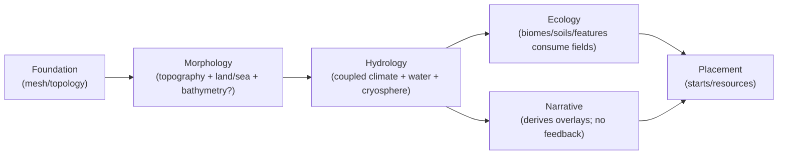

# Hydrology Domain Refactor — Phase 2 Modeling Spike (Synthesis)

Purpose: define the **authoritative, physics-first Hydrology model** and lock target contract surfaces for the Hydrology vertical refactor.

This synthesis combines the strongest, non‑conflicting elements from:
- `spike-hydrology-modeling.md`
- `spike-hydrology-modeling-gpt-web.md`
- `spike-hydrology-modeling-gemini.md` (empty at time of synthesis)

Scope guardrails (do not violate):
- **Model-first only**: no slice plan content belongs here (Phase 3).
- Hydrology is a **single domain**; subdomains are **internal organization only**.
- **Compatibility is forbidden inside Hydrology.** If any legacy shape must exist temporarily, it is downstream-owned and explicitly deprecated.

Hard postures (locked in the Phase 2 model):
- Hydrology is **physics-first, deterministic, and fully derivative** of upstream physical inputs + seed.
- **No author/designer thumbs on the scale** inside Hydrology:
  - no swatches/paint,
  - no story overlays/motifs as inputs that perturb climate/water,
  - no region-specific “make this wet/dry” controls.
- Public configuration exposes **semantic knobs only** (scenario-level intent), which compile into internal normalized parameters at stable boundaries.

References:
- Workflow: `docs/projects/engine-refactor-v1/resources/workflow/domain-refactor/WORKFLOW.md`
- Phase 2 reference: `docs/projects/engine-refactor-v1/resources/workflow/domain-refactor/references/phase-2-modeling.md`
- Phase 0.5 greenfield: `docs/projects/engine-refactor-v1/resources/spike/spike-hydrology-greenfield.md`
- Phase 1 current-state: `docs/projects/engine-refactor-v1/resources/spike/spike-hydrology-current-state.md`
- Architecture vocabulary: `docs/system/libs/mapgen/architecture.md`

---

## Authority stack

**Canonical (repo):**
- `docs/system/libs/mapgen/architecture.md`
- `docs/system/libs/mapgen/hydrology.md`
- `docs/system/libs/mapgen/morphology.md`
- `docs/system/libs/mapgen/ecology.md`
- `docs/system/libs/mapgen/narrative.md`
- `docs/system/libs/mapgen/placement.md`
- `docs/projects/engine-refactor-v1/resources/spec/SPEC-DOMAIN-MODELING-GUIDELINES.md`

**Evidence (current wiring; non-authoritative for target model):**
- Phase 1 spike: `docs/projects/engine-refactor-v1/resources/spike/spike-hydrology-current-state.md`

**Seed (ideas only; explicitly non-authoritative):**
- `docs/system/libs/mapgen/research/SPIKE-synthesis-earth-physics-systems-swooper-engine.md`
- `docs/system/libs/mapgen/research/SPIKE-earth-physics-systems-modeling-alt.md`

---

## Modeling loop (required; 2 iterations; model locked on Iteration 2)

### Iteration 1 (baseline coupled model)

Minimum causal pipeline:
- radiative forcing + lapse rate → temperature
- circulation scaffold → winds
- moisture sourcing + orographic rainout → precipitation
- depression fill + routing + discharge thresholds → rivers/lakes

Result:
- plausibly structured rainfall and basins,
- but weak coastal realism (no SST/ocean heat transport),
- and weak ice-margin stability (no albedo feedback).

### Iteration 2 (stabilized, authoritative model)

Adds / tightens:
- **ocean coupling** (currents + SST proxy + sea ice) to drive coastal temperature/moisture gradients,
- **cryosphere + bounded albedo feedback** to stabilize snow/ice margins deterministically,
- explicit PET/aridity and a wetness proxy suitable for Ecology,
- explicit river classification sufficient for gameplay (minor vs major/navigable).

**Model lock:** Iteration 2 is authoritative for Phase 3 planning and implementation.

---

## Canonical model statement (authoritative)

Hydrology owns a coupled **climate + surface-water** abstraction that produces believable:
- winds (incl. jet/storm-track influence),
- temperature (incl. seasonality proxies),
- humidity/moisture transport,
- precipitation (incl. convergence + orographic effects),
- runoff/discharge and routed hydrography (rivers/lakes),
- cryosphere state (snow/ice + sea ice) with bounded albedo feedback,

as deterministic functions of:
- upstream physical geometry (topography + land/sea + optional bathymetry),
- planetary forcing (latitude + seasonality/tilt proxies),
- and an optional seed-selected “climate regime” choice that remains physically constrained (no runtime randomness).

Hydrology does **not**:
- accept narrative/story overlays as inputs that perturb climate/hydrology,
- accept region-specific overrides (swatches/paint),
- embed compatibility projections for legacy artifacts.

---

## Causality spine (authoritative)

1) **Geometry intake**: elevation + land/sea + bathymetry (when available) + coastal/orographic helpers.
2) **Radiative forcing**: insolation proxy by latitude + season; temperature baseline + lapse rate.
3) **Atmospheric circulation scaffold**: cells + jets + storm tracks; wind vector fields per seasonal mode.
4) **Ocean coupling**: wind-driven surface currents + SST/heat-transport proxy + sea ice.
5) **Moisture cycle**: evaporation sources (ocean + land ET proxy) + advection/rainout along winds.
6) **Precipitation**: convergence + orography + coastal/onshore effects; per-season and aggregated.
7) **Cryosphere**: snow/ice accumulation + melt; bounded albedo feedback into thermodynamics (fixed iterations).
8) **Land water budget**: PET proxy + runoff fraction + wetness proxy.
9) **Routing/hydrography**: flow direction + discharge accumulation + depression fill → rivers/lakes (incl. endorheic).
10) **Diagnostics**: derived “why fields” that explain wet/dry/cold outcomes.

Seasonality posture:
- Use **2–4 discrete seasonal modes** (not time-stepping).
- Default consumer surface is **annual mean + seasonal amplitude**; optional per-season fields exist for consumers that truly need them.

---

## Domain boundaries (target)

| Domain | Owns | Does not own |
| --- | --- | --- |
| Foundation | mesh/topology; coordinate basis; global params | climate/water outcomes |
| Morphology | land/sea + elevation + (ideally) bathymetry + stable geo helpers | rainfall, winds, budgets |
| **Hydrology** | coupled climate + hydrography + cryosphere | biomes/soils/resources; authored overrides |
| Ecology | biomes/pedology/features/resources consuming Hydrology fields | climate/hydrography solving |
| Narrative | overlays derived from physics outputs | feeding back into Hydrology |
| Placement | starts/wonders/resources placement | physical climate/water computation |

Boundary locks (re-stated as enforceable target posture):
- Narrative is downstream-only; Hydrology does not consume overlays/motifs to compute physics.
- Hydrology outputs continuous fields and indices; Ecology owns discretization into biomes/features.

---

## Representation policy: internal truth vs projections (locked)

Principle: **Projections never define internal representation.**

Internal representation:
- typed, resolution-aligned climate/ocean/cryo/hydro fields (buffers) refined within Hydrology steps.

Downstream-facing artifacts:
- typed, stable projections of the internal state suitable for Ecology/Narrative/Placement.

Compatibility posture:
- Hydrology publishes **only the new typed artifacts**.
- If a legacy shape must exist temporarily, it is produced downstream as a deprecated shim with explicit removal triggers.

---

## Canonical contract surfaces (conceptual; target)

This is a conceptual contract matrix (not an SDK wiring prescription). Names are indicative.

### A) Climate surface (required downstream-facing capabilities)

Must support:
- temperature: annual mean + seasonality amplitude (optionally per-season),
- precipitation: annual mean + amplitude (optionally per-season),
- winds: prevailing near-surface vectors (optionally per-season),
- PET proxy + aridity index (P vs PET),
- freeze/cryosphere indices (freeze persistence, snow/ice suitability),
- explainability diagnostics (optional but recommended for debugging and iteration).

### B) Ocean surface (required if ocean coupling enabled)

Must support:
- basin identification (basin ids / connected components),
- SST proxy (sufficient to drive coastal thermal/moisture gradients),
- surface currents vector proxy,
- sea ice extent (for climate + downstream visuals/constraints).

### C) Cryosphere surface (required if cryosphere enabled)

Must support:
- snow/ice persistence indices,
- sea ice,
- albedo proxy (explicit or derivable).

### D) Hydrography surface (required downstream-facing capabilities)

Must support:
- runoff and discharge proxy fields,
- routing validity (drains to ocean outlet or endorheic basin),
- lakes: ids/mask + endorheic marking,
- rivers: a projection sufficient for gameplay/placement.

River classification requirement (explicit):
- Support both **minor/edge rivers** and **navigable/major rivers** as distinct projections, because downstream gameplay typically distinguishes “adjacent to any freshwater” from “major river corridor / navigable river”.

---

## Target op catalog (deterministic; pure ops; steps orchestrate)

Architecture rule: ops are pure; steps compose ops and perform bounded feedback.

Climate/atmosphere/ocean (compute ops):
- `hydrology/compute-radiative-forcing`
- `hydrology/compute-thermal-state`
- `hydrology/compute-atmospheric-circulation` (successor posture to current `compute-wind-fields`)
- `hydrology/compute-ocean-surface-currents`
- `hydrology/compute-evaporation-sources`
- `hydrology/transport-moisture`
- `hydrology/compute-precipitation`

Cryosphere (compute ops):
- `hydrology/compute-cryosphere-state`
- `hydrology/apply-albedo-feedback` (bounded pass; fixed iters)

Surface water (compute ops):
- `hydrology/compute-land-water-budget`
- `hydrology/compute-flow-routing` (if Hydrology owns routing)
- `hydrology/solve-depressions-and-lakes`
- `hydrology/accumulate-discharge`
- `hydrology/project-river-network` (minor vs navigable classification)
- `hydrology/compute-wetness-proxy`

Diagnostics (compute ops):
- `hydrology/compute-climate-diagnostics` (rain-shadow, convergence, continentality, etc.)

---

## Config semantics table (locked semantics; public knobs + compiled internals)

Principle: Hydrology exposes **semantic knobs**, not low-level algorithm bags. Knobs compile to an internal normalized parameter set at stable boundaries (`normalize`).

### A) Public semantic knobs (allowed surface)

Legend:
- Missing: property absent from config input.
- Empty/null: explicitly provided but empty (or `null` where allowed).
- Determinism: expectations for same inputs + seed.

| Knob | Meaning | Missing default policy | Empty/null behavior | Determinism expectations | Tests to lock semantics (Phase 3+) |
| --- | --- | --- | --- | --- | --- |
| `dryness` (`"wet"|"mix"|"dry"`) | Global moisture availability bias (not regional) | Default `"mix"` | Empty string invalid; null invalid | `"wet"` ≥ `"mix"` ≥ `"dry"` for global mean precip under same seed | Golden-map regression asserts monotonic precip ordering |
| `temperature` (`"cold"|"temperate"|"hot"`) | Global thermal offset affecting snowline/ET | Default `"temperate"` | null invalid | `"cold"` yields larger cryosphere extent than `"hot"` given same morphology | Snapshot tests on freeze/ice indices |
| `seasonality` (`"low"|"normal"|"high"`) | Seasonal amplitude (ITCZ migration, monsoon/storm-track shift) | Default `"normal"` | null invalid | same seed ⇒ identical seasonal mode fields | Regression on amplitude metrics |
| `oceanCoupling` (`"off"|"simple"|"earthlike"`) | Ocean influence on temperature/moisture | Default `"earthlike"` | null invalid | mode switch is deterministic | Coastal gradient index varies predictably across modes |
| `cryosphere` (`"off"|"on"`) | Enables snow/ice + albedo feedback | Default `"on"` | null invalid | fixed iteration count; platform-stable tie-breaking | A/B test verifies bounded deltas and stability |
| `riverDensity` (`"sparse"|"normal"|"dense"`) | Gameplay projection density, not hydrology physics override | Default `"normal"` | null invalid | deterministic thresholding on discharge | River count monotonic with density |
| `lakeiness` (`"few"|"normal"|"many"`) | Basin fill/endorheic persistence bias (global) | Default `"normal"` | null invalid | deterministic lake solver | Lake count/area monotonic vs knob |

Non-negotiable ban (restated):
- No knob may target a specific region, band, motif, or “painted” override.

### B) Compiled internal normalized parameters (not public surface)

These parameters are produced by knob compilation and are internal-only. They exist to make the physics model explicit and testable without exposing “author intervention” surfaces.

Conventions:
- All defaults are deterministic and derived from public knobs + map size/topology.
- Iteration counts are explicit and fixed; no convergence loops.

Examples of internal parameters the model expects (shape not locked as public API):
- Planet forcing: axial tilt proxy, solar constant/temperature scale, rotation sign/strength.
- Thermodynamics: lapse-rate, diffusion/smoothing passes (explicit iteration counts).
- Circulation: Hadley extent proxy, jet/storm-track strength proxies, wind strength scaling.
- Moisture cycle: evaporation scaling, advection iterations, orographic lift/rainout efficiency.
- Ocean coupling: heat transport efficiency, gyre/boundary current strengths, sea ice threshold.
- Cryosphere: albedo strength, land ice temp threshold, feedback iteration count.
- Hydrography: runoff fraction/infiltration proxy, depression-fill mode, endorheic evaporation factor.
- River projection: thresholds for minor vs navigable classification, slope constraints for navigable segments.
- Debug toggles: must not affect outputs (only emit additional diagnostics).

Internal parameter semantics must still be testable:
- toggling debug emits must not change computed fields,
- increasing advection iterations must have predictable, bounded effects (or be fixed by design),
- derived thresholds must be deterministic functions of discharge distribution and map resolution.

---

## Legacy disposition ledger (keep / kill / migrate; model-level classification)

This classification is used by Phase 3 planning; it does not prescribe slices here.

Legend:
- **Keep**: survives largely as-is.
- **Migrate**: mechanism survives; shape/placement changes to fit the new model.
- **Kill**: removed from Hydrology; if needed at all, rehomed downstream as deprecated shim or eliminated.

### Config concepts (current) → disposition

- Latitude-band-first climate baselines and noise weights: **Kill** (latitude remains only as forcing input).
- Ad-hoc “climate refine because rivers exist”: **Kill** as a causal driver; **Migrate** only the *emergent* wetness/floodplain mechanisms into water budget + wetness proxy.
- Orographic shadow mechanisms: **Migrate** (as part of moisture transport + precipitation, driven by winds/topography).
- Story motifs / hotspots / rifts as climate inputs: **Kill** (Narrative is downstream-only).
- Swatches / map-painted climate overrides: **Kill** (explicitly banned).
- Existing wind-fields op concept: **Migrate** into circulation op catalog and knob compilation.

### Modules/functions (current) → disposition (conceptual)

- Baseline climate functions: **Migrate** into causal ops (forcing/circulation/moisture/precip).
- Refinement subpasses:
  - physics-like (orography, water gradients): **Migrate**,
  - story-like (motif-driven): **Kill**.
- Swatch system: **Kill**.

---

## Producer/consumer map (target)

Forbidden current-state couplings to eliminate (Phase 3 planning/implementation):
- Narrative calling Hydrology internals (swatches).
- Hydrology consuming narrative overlays/motifs to perturb physics.

---

## Risk register (modeling risks; to inform Phase 3 planning)

- **Field budget risk:** seasonal fields can explode memory; default to annual mean + amplitude and make per-season optional.
- **Routing ownership risk:** deciding whether Morphology owns routing changes artifact boundaries; lock early in Phase 3.
- **Ocean coupling scope risk:** keep “earthlike” ocean coupling cheap and stable; avoid drifting into CFD.
- **Determinism risk:** bounded feedback (albedo) must have fixed iterations and stable tie-breaking to prevent platform drift.
- **Downstream migration risk:** Ecology/Narrative/Placement expectations of legacy artifacts must be systematically migrated; no compat inside Hydrology.

---

## Lookback 2 (what Phase 2 locks; what remains open)

### Locked here (authoritative)

- Hydrology contains climate + ocean + cryosphere as internal subdomains for this vertical refactor.
- Hydrology is strictly derivative and deterministic; no authored overrides.
- Public configuration is semantic knobs only; compilation produces internal normalized parameters.
- River representation must support both minor/edge rivers and major/navigable rivers as distinct projections.

### Open (to resolve in Phase 3 without changing this model)

- Routing ownership boundary (Morphology vs Hydrology) and contract implications.
- Exact units/scaling for precip/PET/discharge and thresholds calibration strategy.
- Upstream availability of bathymetry vs required proxy strategy (if missing).
- Final set of downstream-facing artifacts vs derived projections needed for engine/gameplay consumers.
