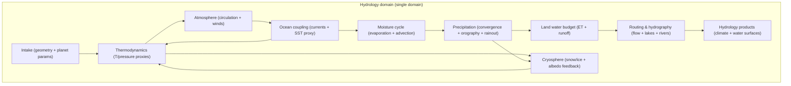
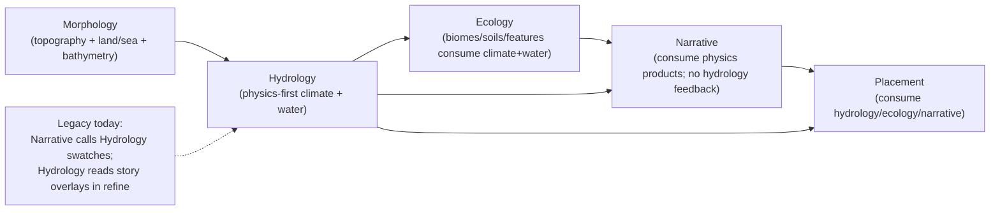

# Hydrology Domain Refactor — Phase 2 Modeling Spike

Purpose: define the **authoritative, first-principles Hydrology model** and lock target contract surfaces for the Hydrology vertical refactor.

This spike is **model-first**:
- No slice plan content belongs here (Phase 3).
- Compatibility surfaces must not live in Hydrology (compat, if needed, is downstream-owned and explicitly deprecated).

Hard posture (locked for Phase 2 modeling):
- Hydrology is **physics-first, deterministic, and fully derivative** of upstream physical inputs + seed.
- **No author-driven “thumbs on the scale”** inside Hydrology (no swatches, no story motifs/overlays influencing climate/water outcomes).
- Public configuration may expose **semantic knobs** only (e.g., `dryness: "wet" | "dry" | "mix"`), which compile to internal normalized configs at stable boundaries.

References (workflow):
- Workflow: `docs/projects/engine-refactor-v1/resources/workflow/domain-refactor/WORKFLOW.md`
- Phase 2 template: `docs/projects/engine-refactor-v1/resources/workflow/domain-refactor/references/phase-2-modeling.md`
- Phase 0.5 greenfield spike: `docs/projects/engine-refactor-v1/resources/spike/spike-hydrology-greenfield.md`
- Phase 1 current-state spike: `docs/projects/engine-refactor-v1/resources/spike/spike-hydrology-current-state.md`

---

## Authority stack

**Canonical (within this repo):**
- `docs/system/libs/mapgen/architecture.md` (domain layering, buffers/artifacts/overlays)
- `docs/system/libs/mapgen/hydrology.md` (Hydrology meaning; updated by this spike)
- `docs/system/libs/mapgen/morphology.md` (upstream intake posture)
- `docs/system/libs/mapgen/ecology.md` (downstream consumers posture)
- `docs/projects/engine-refactor-v1/resources/spec/SPEC-DOMAIN-MODELING-GUIDELINES.md` (ops/steps/strategies/rules)

**Evidence (current wiring; non-authoritative for target model):**
- `docs/projects/engine-refactor-v1/resources/spike/spike-hydrology-current-state.md`

**Seed (ideas only; explicitly non-authoritative):**
- `docs/system/libs/mapgen/research/SPIKE-synthesis-earth-physics-systems-swooper-engine.md`
- `docs/system/libs/mapgen/research/SPIKE-earth-physics-systems-modeling-alt.md`

**External (high-trust references used for grounding):**
- NOAA JetStream: global circulation (Hadley/Ferrel/Polar): https://www.noaa.gov/jetstream/global/global-atmospheric-circulations
- UK Met Office: global circulation patterns + jet stream: https://weather.metoffice.gov.uk/learn-about/weather/atmosphere/global-circulation-patterns
- NOAA NWS glossary: orographic uplift / precipitation: https://forecast.weather.gov/glossary.php?word=OROGRAPHIC
- NOAA Ocean Service: surface currents + boundary currents: https://oceanservice.noaa.gov/education/tutorial_currents/04currents3.html
- NOAA Ocean Service: upwelling: https://oceanservice.noaa.gov/education/tutorial_currents/03coastal4.html
- NOAA Ocean Service: Ekman spiral (Coriolis-driven transport basis): https://oceanservice.noaa.gov/education/tutorial_currents/04currents4.html
- NOAA: El Niño (coupled ocean–atmosphere teleconnection exemplar): https://www.noaa.gov/understanding-el-nino
- NASA Earthdata: albedo basics (snow/ice reflectivity): https://www.earthdata.nasa.gov/topics/cryosphere/albedo

---

## Research passes (required; summarized)

**Architecture alignment pass**
- Reconciled “buffers vs artifacts” and “overlays” concepts from `docs/system/libs/mapgen/architecture.md` with a Hydrology model that is strictly derivative and does not consume overlays.

**Greenfield-first pass**
- Started from Phase 0.5’s causality spine (terrain + oceans + circulation → moisture transport → precipitation → runoff/routing → rivers/lakes + cryosphere feedback).
- Explicitly rejected “latitude bands as primary driver” and “author swatches/story motifs” as anti-patterns for the target model.

**Current-state evidence pass**
- Used Phase 1 evidence to identify what must be deleted or rehomed (e.g., Narrative calling Hydrology swatch pass; Hydrology reading story overlays in refine).
- Treated these as constraints/cleanup targets only, not as modeling inputs.

**Upstream/downstream contract pass**
- Enumerated upstream intake requirements (topography/bathymetry/landmask + planet parameters) and downstream consumers (Ecology, Placement, Narrative) and identified necessary contract migrations.

---

## Canonical model + causality spine (target)

### Model statement (canonical)

Hydrology owns a **coupled climate + surface-water** abstraction that produces believable precipitation, humidity, temperature, runoff, rivers/lakes, and cryosphere signals as deterministic functions of:
- upstream physical geometry (topography + land/sea + bathymetry when available),
- planetary forcing (latitude/obliquity/seasonality proxies),
- and a seed-driven but physically constrained “climate regime” selector (optional; no runtime randomness).

Hydrology does **not**:
- accept regional author interventions (swatches, story overlays) that directly modify climate/water fields,
- embed compatibility projections for legacy artifacts,
- or require downstream domains to “fix” climate realism.

### Causality spine (authoritative)

1) **Geometry intake**: elevation + land/sea + bathymetry + coastal orientation (from Morphology).
2) **Radiative forcing**: insolation proxy by latitude + season; temperature baseline + lapse rate.
3) **Atmospheric circulation scaffold**: cells + jets + storm-track scaffold; winds as a vector field per season.
4) **Ocean coupling**: wind-driven surface currents + coastal upwelling proxy; SST/heat-transport influence on coastal temperature and moisture supply.
5) **Moisture source + transport**: evaporation sources (ocean, land evapotranspiration proxy) + advection along wind; rainout along flow paths.
6) **Precipitation formation**: convergence + orographic uplift + saturation/rainout; yields seasonal precipitation fields.
7) **Land surface water budget**: `runoff = precip - evapotranspiration - infiltrationStorageChange` (using tractable proxies for infiltration/soil storage).
8) **Routing / hydrography**: flow direction + accumulation + lake storage; river discharge and river-network classification.
9) **Cryosphere**: snow accumulation, melt, sea ice proxy; albedo feedback into temperature baseline (limited iterations).

Limited feedback loop (strictly bounded):
- Cryosphere/albedo may update temperature forcing with **1–2 deterministic iterations** to place snowlines/ice margins plausibly without introducing unstable simulation behavior.

---

## Conceptual narrative (what Hydrology is “simulating”, realistically but cheaply)

This model is “high-fidelity by abstraction”: it avoids CFD and time-stepping, but still captures the *mechanisms* that dominate where water ends up:
- **Wind is not a latitude band.** Winds are derived from an atmospheric circulation scaffold (cells + jets) modulated by land/ocean thermal contrast and topographic steering.
- **Precipitation is not a static band.** It emerges from convergence zones, storm-track scaffolds, orographic uplift, and moisture rainout along advected paths.
- **Oceans matter** as heat and moisture reservoirs; coarse surface currents and upwelling proxies are sufficient to create credible coastal gradients and west-coast aridity patterns.
- **Microclimates are emergent** from terrain + prevailing winds + continentality + coastal SST, not from author paint.
- **Cryosphere is a real constraint**: snow/ice alters albedo, which shifts local temperatures and therefore melt/accumulation balance; we include this as a bounded feedback.

### Seasonality posture

Seasonality is modeled with **2–4 discrete seasonal modes** (not daily time stepping). The model produces:
- annual means,
- seasonal amplitude,
- and optionally per-season fields for consumers that need them (Ecology may only need annual + amplitude).

---

## Diagrams (target model)

### A) Domain internal architecture (submodules are organizational only)

### B) Producer/consumer map (current vs target adjustment)

Target adjustment notes (non-slice, model-level):
- Narrative **must not call** Hydrology implementation surfaces.
- Hydrology **must not read** narrative overlays/motifs to modify climate/water outputs.
- If narrative wants “theming”, it is downstream-only and must not masquerade as hydrology physics.

---

## Target contract matrix (buffers / artifacts / overlays)

This table models the *conceptual* contract surfaces; it is intentionally not an SDK wiring prescription.

| Product | Kind | Owner | Canonical purpose | Notes |
| --- | --- | --- | --- | --- |
| `buffer:hydrology.climate` | Buffer | Hydrology | Working climate state (T, winds, humidity, precip, indices) refined across steps | Published once as an artifact handle for gating/typed access; refined in place |
| `artifact:hydrology.climate` | Artifact | Hydrology | Stable, typed climate surface for downstream domains | No legacy alias (e.g., no `artifact:climateField` compat inside Hydrology) |
| `buffer:hydrology.hydro` | Buffer | Hydrology | Working hydrology state (runoff, discharge, routing intermediates) | Can be refined once routing/lakes settle |
| `artifact:hydrology.hydro` | Artifact | Hydrology | Stable hydrology surface (rivers/lakes/runoff indices) for downstream | River topology is a projection, not internal truth |
| `artifact:hydrology.cryosphere` | Artifact | Hydrology | Snow/ice/albedo surfaces used by Ecology/Narrative/diagnostics | Feedback is bounded; artifact is output of final iteration |
| `overlays.*` | Overlay | Narrative | Story/playability metadata | Hydrology does not consume overlays in the physics-first model |

Minimum typed surface expectation (downstream-facing):
- Climate: temperature (annual mean + amplitude), precipitation (annual + amplitude), humidity proxy, aridity index, freeze index.
- Hydrology: runoff, discharge, river network projection, lake mask/storage proxy.

---

## Target op catalog (deterministic; no op-calls-op)

This is the target op catalog by “kind”, following `SPEC-DOMAIN-MODELING-GUIDELINES.md`.

Notes:
- Ops are **pure**: `run(input, config) -> output`.
- Steps (stages) orchestrate composition, iterate bounded feedback, apply/publish artifacts.

### Climate/atmosphere/ocean ops

- `hydrology/compute-radiative-forcing` (compute)
  - Inputs: latitude, season index, land/sea mask, elevation, optional albedo
  - Output: insolation/forcing scalars per cell
- `hydrology/compute-thermal-state` (compute)
  - Inputs: forcing + elevation + ocean SST proxy
  - Output: surface temperature field(s) + lapse-rate adjusted temperature
- `hydrology/compute-atmospheric-circulation` (compute)
  - Inputs: latitude, seasonality, land/ocean thermal contrast, rotation proxy
  - Output: wind vector fields (seasonal)
- `hydrology/compute-ocean-surface-currents` (compute)
  - Inputs: wind stress proxy, basins mask, Coriolis sign by hemisphere
  - Output: surface current vectors + upwelling potential proxy
- `hydrology/compute-evaporation-sources` (compute)
  - Inputs: SST/temperature, wind speed, land/sea mask, moisture availability proxy
  - Output: evaporation/ET source fields
- `hydrology/transport-moisture` (compute)
  - Inputs: wind vectors + evaporation sources + terrain blocking proxies
  - Output: humidity field + rainout budget along flow
- `hydrology/compute-precipitation` (compute)
  - Inputs: humidity + convergence proxy + orographic uplift proxy
  - Output: precipitation fields (seasonal + annual aggregates)

### Surface-water ops

- `hydrology/compute-land-water-budget` (compute)
  - Inputs: precipitation + temperature + ET proxy + permeability proxy
  - Output: runoff field + soil-moisture/storage proxy (optional)
- `hydrology/route-surface-water` (compute)
  - Inputs: runoff + flow direction (from Morphology) OR elevation (if Hydrology owns routing)
  - Output: discharge/accumulation fields + lake storage proxy + river network projection

### Cryosphere ops

- `hydrology/compute-cryosphere` (compute)
  - Inputs: temperature + precipitation + elevation + ocean coupling
  - Output: snow/ice masks + albedo field

### Index/diagnostics ops (optional but helpful)

- `hydrology/derive-climate-indices` (compute)
  - Inputs: temperature + precipitation + humidity
  - Output: aridity/freeze indices (typed, stable)
- `hydrology/derive-hydrology-indices` (compute)
  - Inputs: runoff + discharge + lakes
  - Output: wetness indices, floodplain likelihood proxies (placement/ecology consume)

---

## Upstream authoritative input selection (what Hydrology consumes)

Hydrology consumes upstream physical drivers only.

Minimum required:
- `artifact:morphology.topography` (elevation + land/sea mask)
- Latitude (per-row or per-cell) + wrap semantics + world topology
- Region mesh / neighbor graph (for advection and routing diffusion approximations)

Ideal (high-value) upstream additions:
- Bathymetry or signed elevation (sea depth) for ocean currents + sea ice realism
- A stable flow-direction/accumulation intermediate (if Morphology owns routing)
- Coast distance / continentality helpers (if already computed upstream; otherwise Hydrology can compute internally once)

Legacy upstream reads to delete (target posture):
- Hydrology reading narrative overlays/motifs to perturb climate fields.

---

## Downstream consumer impact scan (what will change)

Hydrology becomes the sole authoritative producer of climate/water fields. Consumers adapt to new artifacts and stop importing Hydrology internals.

Known current consumers (Phase 1 evidence):
- Ecology consumes Hydrology climate + heightfield artifacts and uses them for biomes/pedology/features/resource basins.
- Placement depends on Hydrology effect tags and on derived ecology outputs.
- Narrative currently calls Hydrology swatch pass and (in hydrology-post refine) Hydrology reads overlays for microclimate tweaks.

Target posture (model-level):
- Ecology consumes `artifact:hydrology.climate` + `artifact:hydrology.hydro` (typed arrays).
- Narrative consumes Hydrology outputs for tagging and playability; it does not write into Hydrology inputs.
- Any legacy artifact shape shims live downstream and are explicitly deprecated with removal triggers.

---

## Config semantics table (semantic knobs; compile → normalized internal form)

Principle: Hydrology exposes **semantic knobs**, not low-level algorithmic bags. Knobs compile to internal normalized op configs at stable boundaries (`step.normalize` / `op.normalize`), and downstream never observes internal config shapes.

Legend:
- Missing: property absent from config input.
- Empty/null: explicitly provided but empty (or `null` where allowed).
- Determinism: expectations for same inputs + seed.

| Knob | Meaning (human) | Missing default policy | Empty/null behavior | Determinism expectations | Tests-to-add (Phase 3+) |
| --- | --- | --- | --- | --- | --- |
| `dryness` (`"wet"|"mix"|"dry"`) | Global moisture availability bias (not a region override) | Default `"mix"` | Empty string invalid; null invalid | Monotonic: `"wet"` ≥ `"mix"` ≥ `"dry"` in global mean precip for same seed | Golden-map snapshot asserts monotonic precip ordering across presets |
| `temperature` (`"cold"|"temperate"|"hot"`) | Global thermal offset affecting snowline/ET | Default `"temperate"` | null invalid | Monotonic: `"cold"` produces larger cryosphere extent than `"hot"` given same morphology | Snapshot tests on cryosphere masks and freeze index thresholds |
| `seasonality` (`"low"|"normal"|"high"`) | Seasonal amplitude (ITCZ migration, monsoon strength, storm-track shift) | Default `"normal"` | null invalid | Same seed yields identical seasonal fields; `high` increases amplitude metrics | Seasonal amplitude metric regression harness |
| `oceanCoupling` (`"off"|"simple"|"earthlike"`) | Whether oceans influence winds/temperature/moisture | Default `"earthlike"` | null invalid | Same seed yields identical ocean fields; `off` yields reduced coastal gradients | Coastal gradient index differs predictably across modes |
| `cryosphere` (`"off"|"on"`) | Whether snow/ice/albedo feedback runs | Default `"on"` | null invalid | `off` disables albedo loop; all other fields remain deterministic | A/B test verifies only cryosphere + temperature deltas change |
| `riverDensity` (`"sparse"|"normal"|"dense"`) | River network thresholding for gameplay projection | Default `"normal"` | null invalid | Same runoff yields deterministic river network under thresholding | Discharge quantile thresholds stable; river count monotonic |

Non-negotiable ban (model-level):
- No knobs allow “painted” regional climate overrides. Any region-focused theming must be downstream and explicitly non-physics (and never presented as Hydrology).

---

## Decisions + defaults (modeling decisions)

Locked decisions (Phase 2 model authority):
- Hydrology produces climate/hydrology outputs as a deterministic derivative of upstream physics + seed; it does not accept author-driven regional overrides.
- Narrative overlays/motifs are not Hydrology inputs in the physics-first model (no feedback loop from Narrative into Hydrology).
- Public configuration is semantic knobs only; low-level algorithmic configs are internal and normalized at stable compile boundaries.

Default posture (when knobs are missing):
- `dryness: "mix"`, `temperature: "temperate"`, `seasonality: "normal"`, `oceanCoupling: "earthlike"`, `cryosphere: "on"`, `riverDensity: "normal"`.

Explicitly deferred (must be locked in Phase 3 planning; no model change implied):
- Routing ownership (Morphology vs Hydrology) and the resulting artifact contract boundaries.

---

## Legacy disposition ledger (keep / kill / migrate)

This ledger is about **existing Hydrology/Narrative climate surfaces** and their fate relative to the target model.

Legend:
- **Keep**: survives largely as-is (rare in a vertical refactor).
- **Migrate**: concept survives but implementation/shape changes.
- **Kill**: removed from Hydrology; if needed at all, rehomed downstream as deprecated shim or eliminated.

### A) Config surface (current) → disposition

- `climate.baseline.*` (latitude bands + noise weights): **Kill** (replaced by circulation/ocean-driven precipitation; latitude remains only a forcing input).
- `climate.refine.*` (orography, water gradients, river corridors): **Migrate** (mechanisms stay, but become physics-derived submodels inside precipitation/moisture transport, not ad hoc refinements).
- `climate.story.*` (story motifs): **Kill** (Hydrology does not consume story motifs/overlays).
- `climate.swatches.*` (author swatches): **Kill** (explicitly banned for physics-first Hydrology).
- `computeWindFields` op config (`windJetStreaks`, `windJetStrength`, `windVariance`): **Migrate** (fold into `hydrology/compute-atmospheric-circulation` under semantic knob compilation; op id may change).

### B) Hydrology climate functions/modules (current) → disposition

- `applyClimateBaseline`: **Migrate** (becomes part of `compute-*` ops; no latitude-band primacy).
- `refineClimateEarthlike` and subpasses: **Migrate/Kill split**
  - Orography/rain shadow: **Migrate**
  - River corridor humidity (as emergent from runoff/wetness): **Migrate** (but derived, not “painted”)
  - Hotspots/rifts motifs: **Kill** (story overlays)
- `applyClimateSwatches` + `climate/swatches/**`: **Kill**

### C) Pipeline wiring artifacts (current) → disposition

- `artifact:heightfield` (Hydrology alias of Morphology topography): **Migrate** (either delete and consume `artifact:morphology.topography`, or rename to `artifact:hydrology.topographyView` if truly needed; Phase 2 favors deletion)
- `artifact:climateField` (Any-typed buffers routed via artifact): **Kill** (replaced by typed `artifact:hydrology.climate`)
- `artifact:windField`: **Migrate** (part of typed climate output; may remain a dedicated artifact if downstream needs it)
- `artifact:riverAdjacency` Any-typed: **Migrate** (either typed adjacency artifact or derived hydrology indices projection)
- Narrative step `narrative-swatches/story-swatches` calling Hydrology: **Kill** (Narrative consumes hydrology outputs; does not call hydrology internals)

---

## Projection policy (explicitly non-canonical)

Internal representation:
- Hydrology’s internal representation is a set of typed, resolution-aligned fields (buffers) that encode the coupled climate/hydrology state (including seasonal modes where enabled).

Projections:
- Downstream-facing artifacts are projections of the internal state that are stable and typed.
- Projections may change over time, but they must never dictate the internal representation.
- Legacy projections (e.g., prior `artifact:climateField` shape) are forbidden inside Hydrology; if needed temporarily, they must be downstream-owned deprecated shims with deletion triggers.

---

## Pipeline delta list (model-implied contract changes)

Upstream:
- Prefer signed elevation / bathymetry publication from Morphology for ocean + sea ice realism.
- Decide routing ownership (Morphology vs Hydrology) explicitly; delete duplicate routing computations.

Hydrology:
- Replace legacy baseline bands + swatches + story motif perturbations with a deterministic, mechanism-based coupled model.
- Publish typed hydrology climate/hydro artifacts with clear buffer/artifact semantics.

Downstream:
- Ecology migrates from legacy `artifact:climateField` / `artifact:heightfield` to `artifact:hydrology.climate` (and Morphology topography as needed).
- Narrative removes `narrative-swatches` stage behavior that calls Hydrology swatches; any theming is downstream and explicitly non-physics.
- Placement consumes updated hydrology indices/tags as needed; ensure effect tags remain coherent with new hydrology outputs.

---

## Architecture alignment note (SPEC/ADR constraints)

- Follows `docs/system/libs/mapgen/architecture.md`:
  - Buffers are modeled as buffers (mutable working layers), even if wired through artifact contracts once for gating/typing.
  - Ops are atomic; composition (including bounded feedback iteration) happens in steps.
- Follows `SPEC-DOMAIN-MODELING-GUIDELINES.md`:
  - The op catalog is explicit and pure; rules/strategies are internal.
  - Knob compilation lives at stable boundaries (`step.normalize` / `op.normalize`) and never as runtime “fixup”.
- Explicitly constrains overlays:
  - Overlays remain a cross-cutting concept, but Hydrology’s physics-first model does not consume them.

---

## Risk register (modeling risks)

- **Performance/memory risk:** seasonal multi-field state can grow quickly; require strict field budgeting and optional outputs (annual mean + amplitude default).
- **Routing ownership risk:** deciding Morphology vs Hydrology routing changes artifact contracts and step responsibilities; must be locked early in Phase 3 slices.
- **Ocean coupling complexity risk:** too-detailed ocean modeling is expensive; keep a stable, cheap “earthlike” approximation with clear semantics.
- **Determinism risk:** bounded feedback (cryosphere/albedo) must have fixed iteration count and stable tie-breaking to avoid platform drift.
- **Consumer migration risk:** Ecology/Narrative/Placement assumptions about legacy artifacts must be systematically migrated with explicit shims outside Hydrology only.

---

## Golden path (authoritative target)

1) Consume Morphology topography (+ bathymetry if available).
2) Compute coupled climate fields (winds/temperature/humidity/precip) deterministically from physics abstractions.
3) Compute runoff + route discharge; project rivers/lakes deterministically.
4) Compute cryosphere surfaces (bounded feedback).
5) Publish typed Hydrology artifacts for downstream domains; downstream consumes without importing Hydrology internals.

---

## Iteration log (required; minimum two passes)

### Pass 1 (draft model)
- Adopted coupled atmosphere/ocean/moisture approach with discrete seasons and bounded cryosphere feedback.
- Sketched op catalog and contract matrix at a conceptual level.

### Pass 2 (stabilization)
- Locked “no author interventions” posture (no swatches, no story overlays influencing Hydrology outputs) as a target modeling invariant.
- Converted “refinement passes” into mechanism-based precipitation/moisture transport submodels (rainout, convergence, orography) and moved low-level knobs behind semantic compilation.
- Made downstream migration posture explicit (no compat inside Hydrology; shims only downstream).

Why stable now:
- Boundaries are coherent with the pipeline causal spine (Morphology → Hydrology → Ecology/Narrative/Placement).
- The contract surfaces are definable without inheriting legacy structure, while still acknowledging necessary migration work.

---

## Required updates (canonical docs)

- Update `docs/system/libs/mapgen/hydrology.md` to match this authoritative model (no swatches/story overrides; climate-aware, deterministic, physics-first).

---

## Lookback 2

What changed from Phase 0.5 after Phase 1 evidence:
- Phase 1 confirmed that current Hydrology includes explicit author-intervention mechanisms (swatches/motifs) and cross-domain inversion (Narrative calling Hydrology). The Phase 2 model explicitly rejects these as target capabilities and treats them as deletion targets.

What is still ambiguous (must be locked in Phase 3 planning):
- Routing ownership (Morphology vs Hydrology) and the resulting artifact contract implications.
- Exactly which climate fields must be downstream-facing artifacts vs internal-only buffers (field budget).
