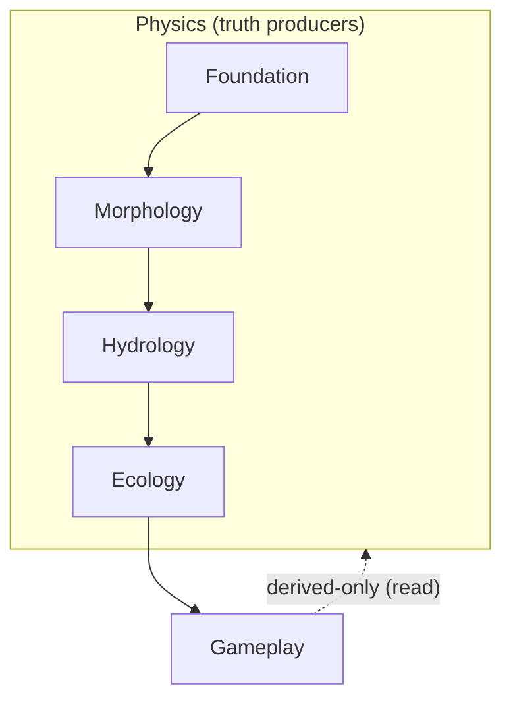

# Agent C Scratch — Pipeline Topology + Repo Alignment (Morphology Phase 2)

Scope: pipeline stages/steps, freeze points, and “no downstream backfeeding” rules; plus repo wiring alignment evidence and deltas. This file is a scratchpad for the Phase 2 rewrite; it is not the canonical Phase 2 deliverable.

---

## Open items (migrated from other scratchpads; relevant to pipeline shape)

From `docs/projects/engine-refactor-v1/resources/workflow/domain-refactor/plans/morphology/agent-a.scratch.md`:
- **Overlay-shaped inputs → physics ban closure:** remove `narrativePreArtifacts.overlays` dependency from Morphology steps and replace with Foundation/Morphology physics-derived drivers (coasts/islands/volcanoes).
- **Volcanism/islands intent surfaces:** replace `hotspotMask` / `seaLaneMask` / `activeMarginMask` / `passiveShelfMask` inputs in Morphology planning ops with Foundation-sourced drivers (tile-space or mesh-space + projection rules).
- **Routing ownership:** Phase 2 model says Hydrology owns canonical routing/basins; Morphology routing must become internal-only (but current repo publishes `artifact:morphology.routing`).

From `docs/projects/engine-refactor-v1/resources/workflow/domain-refactor/plans/morphology/agent-b.scratch.md`:
- **Terrain topology mutation placement:** base-standard does `expandCoasts*` + `generateLakes(...)` (land/water class mutation) before `buildElevation()`. Phase 2 must lock whether these are physics-domain truth ops vs Gameplay stamping ops, and how drift is prevented if stamping mutates topology.
- **LandmassRegionId policy surface:** decide whether LandmassRegionId is stamped only for major regions (others NONE/DEFAULT + optional ISLAND tag) or for all land tiles.

From this scratchpad (Agent C):
- **Stage IDs vs canonical topology:** decide whether Phase 2 can rename stages to canonical ids (`morphology`, `gameplay`) vs keeping legacy ids but marking them non-canonical wiring.
- **Config migration posture:** current maps/configs key off `narrative-pre` and `placement`; Phase 2 must specify where those knobs go (Foundation physics config vs Gameplay policy vs removal).

## Canonical pipeline model (ready-to-drop-in section text)

### 1) Pipeline topology (domain order is the product)

The canonical MapGen pipeline is a **linear, stage-ordered truth production system**:

`Foundation → Morphology → Hydrology → Ecology → Gameplay`

**Ownership rule:** Foundation/Morphology/Hydrology/Ecology are **physics truth producers (pure-only)**. Gameplay is a **pure-only projector** of physics truths into game-facing structures (projection artifacts). **Stamping/materialization** is performed only by **engine-adapter steps** that invoke Gameplay projection logic and then write to the engine.

**Hard bans:**

- **No downstream backfeeding:** nothing downstream can influence physics computations.
- **No overlays as physics inputs:** no story masks, corridor overlays, “hotspot” overlays, “protected lanes”, or any overlay-shaped structure may be read by physics stages.
- **No engine/projection truth as physics input:** engine terrain/region IDs/tags are derived-only and must not be used as authoritative inputs into physics stages.
- **No projections embedded in physics truth artifacts:** physics artifacts must not embed engine IDs / game-facing indices as “truth” fields (legacy fields are migration work into Gameplay projection/stamping).
- **Topology lock (Civ7 canonical): wrapX is invariant; wrapY is unsupported:** Civ7 maps always wrap east–west (**wrapX=true**, seam adjacency is real) and do not wrap north–south (**wrapY=false**, polar edges are the only hard edges). Wrap is **not** an authored knob and must not appear as an optional env/config posture in the canonical model.

### 2) Stages and freeze points (lifecycles are first-class)

Each stage has an explicit lifecycle:

- **Build phase (mutable, internal):** steps may mutate stage-owned working buffers.
- **Freeze point (stage boundary):** stage outputs become immutable **truth surfaces** for downstream consumers.
- **Consumption phase (downstream):** downstream stages may read prior frozen outputs; they may not mutate them.

Canonical freeze points:

- **F1 — after Foundation:** tectonic drivers/plate fields are frozen.
- **F2 — after Morphology:** morphology physical truth (topography/landmask/substrate/landmasses + any morphology truth artifacts) is frozen.
- **F3 — after Hydrology:** hydrology physical truth (routing/hydrography/climate truth artifacts) is frozen.
- **F4 — after Ecology:** ecology truth (biome classification, feature plans, etc.) is frozen.
- **F5 — after Stamping (engine adapter):** Civ7 engine materialization completed; effects/tags satisfied.

**Stamping lifecycle (apply-boundary band):**

- After any physics freeze point (F1–F4), the recipe may run **Gameplay projection + stamping** steps for convenience/legacy compatibility.
- These steps must remain **read-only w.r.t. physics truths** and must not create any dependency edges from physics → engine → physics.
- Braiding is allowed at the stage/step level, but **ownership is not** (see “Truth vs projection vs stamping” policy in `docs/projects/engine-refactor-v1/resources/workflow/domain-refactor/plans/morphology/spike-morphology-modeling-gpt-lockdown-plan.md:49`).
  - These steps (and all truth/projection computations) must treat wrapX seam adjacency consistently; only N/S edges are hard boundaries.
  - No “wrap optionality” branches exist in the canonical pipeline: wrapX helpers are canonical, and wrapX must not be modeled as configurable.

### 3) Stage/step rules (governing constraints, not just “operations”)

**Step ordering:**

- Steps are executed in the stage’s declared order.
- A step may only `require` artifacts/fields/effects that are already frozen by earlier stages or already provided by earlier steps in the same stage.

**Mutation rules:**

- Physics stages are **pure-only**: no engine adapter access; no engine writes; no engine reads; no publication of projection fields.
- Gameplay projection logic is **pure-only**: produces projection artifacts/indices/tags/placements, but does not stamp.
- Only **engine-adapter stamping steps** may mutate engine state (terrain/features/resources/players/tags) and emit engine-facing effects.

**Truth vs projection vs stamping (global policy; summarized):**

- **Physics = truth artifacts** (no engine IDs; no projection indices).
- **Gameplay = projection artifacts** (terrain/feature/resource/player indices, region IDs, tags, placements, overlays).
- **Stamping = adapter step** that reads physics truths, invokes Gameplay projection logic, stamps via adapter, then runs required postprocess/validation.
- **Braiding is allowed; ownership is not**: a recipe “Morphology stage” may include a Gameplay stamping step, but that does not make the logic Morphology-owned.

### 4) Canonical stage definitions (minimal, no braids)

The pipeline must not be braided/interleaved across domains. Narrative/Placement are not stages.

**Foundation (physics, truth producer)**

- Responsibilities: plates, kinematics, crust classification, driver fields for uplift/rift/shear, and **polar edge boundary regimes** (north/south edges behave as convergent/divergent/transform boundaries via “off-map polar plates”).
- Freeze at **F1**.

**Morphology (physics, truth producer)**

- Responsibilities: produce the planet’s physical surface model (topography + landmask + substrate + coastal metrics + landmasses + morphology truth signals).
- Must treat **polar edge boundary regimes** as first-class drivers (not an appendix).
- Freeze at **F2**.

Recommended internal step spine (single Morphology stage; no braids, no pre/mid/post as canonical; truth-only):

1. `substrate` — derive substrate parameters from Foundation tectonics (incl. polar edges).
2. `base-topography` — synthesize initial elevation/bathymetry from tectonic drivers.
3. `sea-level` — compute sea level scalar from elevation distribution + config targets.
4. `landmask` — derive land/water mask from elevation + sea level.
5. `coast-structure` — derive coastline/shelf metrics (may perform physical coastal shaping).
6. `routing-internal` — compute routing primitives used internally for erosion (not a public cross-domain hydrology contract).
7. `geomorphic-cycle` — erosion/deposition cycles updating elevation/sediment fields.
8. `island-chains` — physical island-chain truth signals driven by physics signals (not overlays; not engine stamps).
9. `orogeny` — mountain/hill truth signals driven by physics (not engine terrain stamping).
10. `volcanism` — volcanic truth signals driven by physics (Foundation-provided melt/plume signals; not overlays).
11. `landmasses` — finalize landmass decomposition snapshot.

**Hydrology (physics, truth producer)**

- Responsibilities: routing/hydrography/climate truth surfaces derived from Morphology outputs.
- Freeze at **F3**.

**Ecology (physics, truth producer)**

- Responsibilities: biome assignment, vegetation/feature planning truth derived from physics outputs.
- Freeze at **F4**.

**Gameplay (read-only consumer + materialization owner)**

- Responsibilities: pure projection logic + projection artifacts (derived-only), and ownership of stamping/materialization orchestration.
- Must be **read-only w.r.t. physics truth artifacts** (cannot mutate physics truth).
- Owns LandmassRegionId projection semantics and all downstream IDs/tags/projection artifacts.

Recommended internal Gameplay steps (high-level; Agent B locks details):

1. `derive-overlays` — derived annotations (if any), strictly non-influential to physics.
2. `project-terrain-and_features` — pure projections: terrain IDs, feature IDs, etc. (projection artifacts).
3. `project-landmass-regions` — LandmassRegionId and any engine-facing region projections (projection artifacts).
4. `plan-placement` — starts/resources/wonders/discoveries plans derived from frozen physics truth (projection artifacts).
5. `stamp-apply` — adapter step(s): apply projections + placements into engine.
6. `engine-postprocess` — required engine fixups/rebuilds (validate/fix, recalc, continent stamping, etc.).

### 5) Implementation mapping (current repo stage ids; non-canonical)

The current repo uses multiple stages per canonical domain. This is **implementation wiring only** and must not be treated as the canonical topology:

| Canonical stage | Current stage ids (standard recipe) |
| --- | --- |
| Foundation | `foundation` |
| Morphology | `morphology-pre` → `morphology-mid` → `morphology-post` |
| Hydrology | `hydrology-climate-baseline` → `hydrology-hydrography` → `hydrology-climate-refine` |
| Ecology | `ecology` |
| Gameplay (target) | currently split across `narrative-pre`, `narrative-mid`, `placement` |

Key evidence: `mods/mod-swooper-maps/src/recipes/standard/recipe.ts:21` and `mods/mod-swooper-maps/test/standard-recipe.test.ts:18`.

---

## Diagram updates (ready-to-drop-in mermaid snippets)

### A) Canonical topology (remove Narrative + Placement; Gameplay absorbs)

```mermaid
flowchart LR
  Foundation[Foundation\n(physics truth)] -->|F1 freeze| Morphology[Morphology\n(physics truth)]
  Morphology -->|F2 freeze| Hydrology[Hydrology\n(physics truth)]
  Hydrology -->|F3 freeze| Ecology[Ecology\n(physics truth)]
  Ecology -->|F4 freeze| Gameplay[Gameplay\n(overlays + placement + projections + stamping)]
  Gameplay -->|F5 freeze| Civ7[Civ7 Engine State\n(materialized map)]
```

### B) No-backfeeding guardrail (explicit)



---

## Repo alignment scan (verified evidence) + delta list

### Verified: current standard recipe is braided (Narrative + Placement stages exist)

- Stage list is currently defined in `mods/mod-swooper-maps/src/recipes/standard/recipe.ts:21` (includes `narrative-pre`, `narrative-mid`, `placement`).
- A test asserts this braided ordering in `mods/mod-swooper-maps/test/standard-recipe.test.ts:18`.

### Verified: Morphology steps consume Narrative overlays (hard-banned input shape)

- `morphology-mid/rugged-coasts` requires `narrativePreArtifacts.overlays` in `mods/mod-swooper-maps/src/recipes/standard/stages/morphology-mid/steps/ruggedCoasts.contract.ts:16`.
- `morphology-post/islands` requires `narrativePreArtifacts.overlays` in `mods/mod-swooper-maps/src/recipes/standard/stages/morphology-post/steps/islands.contract.ts:14`.
- `morphology-post/volcanoes` requires `narrativePreArtifacts.overlays` in `mods/mod-swooper-maps/src/recipes/standard/stages/morphology-post/steps/volcanoes.contract.ts:14`.
- Narrative overlays artifact exists at `mods/mod-swooper-maps/src/recipes/standard/stages/narrative-pre/artifacts.ts:13` (`artifact:storyOverlays`).

### Verified: engine/projection “truth” is being used inside physics stages (backfeeding risk)

Examples (non-exhaustive):

- Morphology:
  - `morphology-pre/landmass-plates` calls engine postprocess methods in `mods/mod-swooper-maps/src/recipes/standard/stages/morphology-pre/steps/landmassPlates.ts:151`.
  - `morphology-pre/coastlines` calls `expandCoasts` then reads engine terrain/water back into buffers in `mods/mod-swooper-maps/src/recipes/standard/stages/morphology-pre/steps/coastlines.ts:10`.
- Hydrology:
  - lake generation calls into engine in `mods/mod-swooper-maps/src/recipes/standard/stages/hydrology-climate-baseline/steps/lakes.ts:79`.
  - river modeling calls into engine in `mods/mod-swooper-maps/src/recipes/standard/stages/hydrology-hydrography/steps/rivers.ts:210`.
- Ecology:
  - biomes/features are applied directly to engine in `mods/mod-swooper-maps/src/recipes/standard/stages/ecology/steps/biomes/index.ts:62` and `mods/mod-swooper-maps/src/recipes/standard/stages/ecology/steps/features/index.ts:89`.

Under the updated “Truth vs projection vs stamping” policy, these are **stamping/materialization** responsibilities and must be moved into **Gameplay-owned adapter steps**. Physics stages must become pure-only.

### Verified: map configs are keyed by existing stage IDs (migration surface)

- Narrative config exists under `\"narrative-pre\"` in maps/presets, e.g. `mods/mod-swooper-maps/src/maps/shattered-ring.ts:144` and `mods/mod-swooper-maps/src/maps/presets/swooper-earthlike.config.ts:121`.
- Placement config exists under `placement` in maps/presets, e.g. `mods/mod-swooper-maps/src/maps/shattered-ring.ts:591` and `mods/mod-swooper-maps/src/maps/presets/swooper-earthlike.config.ts:597`.

### Verified: tags/effects currently assign ownership to Ecology/Placement (will move to Gameplay)

- Tag defs + effect owners: `mods/mod-swooper-maps/src/recipes/standard/tags.ts:18`.
- Example: `effect:engine.placementApplied` owned by phase `placement` at `mods/mod-swooper-maps/src/recipes/standard/tags.ts:48`.

### Delta list (what must change to realize canonical pipeline)

1) **Standard recipe composition**
- Replace braided stage order in `mods/mod-swooper-maps/src/recipes/standard/recipe.ts:21` with canonical `foundation → morphology → hydrology → ecology → gameplay`.
- Update test expectations in `mods/mod-swooper-maps/test/standard-recipe.test.ts:18`.

2) **Remove Narrative + Placement as stages**
- Remove/retire `narrative-*` stage usage (and any author-facing `narrative-pre` config keys).
- Replace/retire `placement` stage; move placement/projection/stamping ownership under `gameplay`.

3) **Eliminate overlay-shaped inputs to physics**
- Remove `narrativePreArtifacts.overlays` as a dependency from Morphology steps and replace with physics-derived signals (likely Foundation-provided).
- Remove overlay-driven steering from morphology islands/volcanoes/coasts.

4) **Consolidate engine materialization into Gameplay**
- Move engine stamping + engine postprocess calls out of physics stages and into Gameplay (Phase A: read-only consumer of physics truth).
- Retarget effect tags’ owners (currently Ecology/Placement) to Gameplay steps, once the stamping topology is locked.

4.1) **Migrate projection-like fields out of physics truth artifacts**
- Example (current Morphology truth artifact embeds a projection field): `artifact:morphology.topography.terrain` is “engine terrain id per tile” in `mods/mod-swooper-maps/src/recipes/standard/stages/morphology-pre/artifacts.ts:9` (projection-like; Gameplay-owned per policy).
- Additional known projection-like surface: `artifact:heightfield.terrain` is “terrain classification working layer (projection-only)” in `mods/mod-swooper-maps/src/recipes/standard/stages/hydrology-climate-baseline/artifacts.ts:15` and is read broadly (e.g. `mods/mod-swooper-maps/src/recipes/standard/stages/ecology/steps/features/inputs.ts:114`).
- Migration intent: remove these projection fields from physics truth artifacts and model them as **Gameplay projection artifacts** that are stamped only by adapter steps.

4.2) **Remove wrap optionality surfaces (Civ7 wrapX is always on)**
- Canonical Civ7 posture is fixed: **wrapX=true** and **wrapY=false**. Any code/spec surfaces that treat wrap as optional (or model bounded west/east edges) are migration targets.
- Keep wrapX helpers as canonical; the migration is to remove “if wrapX then …” / “allowWrapAdjacency” branching that treats wrap as a knob rather than a fixed invariant.
- N/S edges are the only hard edges. Polar boundary tectonics must be modeled at those edges; do not invent “west/east edge boundary regimes” in the canonical model.

Evidence pointers for wrapX invariance + current handling:
- Canonical wrap semantics: `docs/projects/engine-refactor-v1/resources/PRD-plate-generation.md:128` (wrapX=true, wrapY=false).
- Foundation wrap constraints: `docs/projects/engine-refactor-v1/resources/workflow/domain-refactor/plans/foundation/APPENDIX-WRAPX-PERIODIC-MESH-IMPLEMENTATION.md:29` (wrapX not authored; wrapY unsupported).
- Grid neighbor enumeration wraps X: `packages/mapgen-core/src/lib/grid/neighborhood/hex-oddq.ts:30` via `packages/mapgen-core/src/lib/grid/wrap.ts:1`.
- Foundation mesh uses periodic X width (`wrapWidth`) and site replication: `packages/mapgen-core/src/lib/mesh/delaunay.ts:139` and `packages/mapgen-core/src/lib/mesh/delaunay.ts:152`.
- Foundation tile projection math uses periodic deltas: `mods/mod-swooper-maps/src/domain/foundation/lib/project-plates.ts:16` (via `wrapAbsDeltaPeriodic`).
- Wrap modeled as an env option today (migration target under this lock): `docs/projects/engine-refactor-v1/resources/spec/recipe-compile/architecture/ts/env.ts:45`.
- Legacy “derived default” that treats wrap as optional (migration target): `docs/projects/engine-refactor-v1/resources/spec/adr/adr-er1-035-config-normalization-and-derived-defaults.md:264` (`allowWrapAdjacency`).

5) **Map config migration**
- Migrate map configs from `narrative-pre` and `placement` stage keys to the new canonical stage keys (likely `gameplay.*`), or to upstream physics config when they encode actual physics (see “Dependencies” below).

6) **Guardrails scripts**
- Update domain-stage root lists used by `scripts/lint/lint-domain-refactor-guardrails.sh:174` to reflect removal of `narrative` and `placement` domains/stages (and addition of `gameplay` as the only downstream stage).

---

## Dependencies / questions for orchestrator (actionable)

1) **Stage IDs vs compatibility:** Is Phase 2 allowed to rename stages to canonical ids (`morphology`, `gameplay`), even though maps/configs currently key off `morphology-pre|mid|post`, `narrative-pre`, `placement`? If yes, Phase 3 must include a migration plan; if no, we need a canonical mapping that avoids re-legitimizing “pre/mid/post” as architecture.

2) **Overlay-driven knobs migration:** Current maps configure `narrative-pre/story-seed` margins/corridors/hotspots (e.g., `mods/mod-swooper-maps/src/maps/shattered-ring.ts:144`). Which of these become:
- upstream physics config (Foundation tectonic boundary regimes / melt-plume signals), vs
- removed as non-physical authored overlays, vs
- retained only as Gameplay-derived annotations (non-influential)?

3) **Stamping boundary topology (Agent B dependency):** Given the heavy use of engine calls across Morphology/Hydrology/Ecology today, confirm the intended end-state:
- Do physics stages emit *only* truth artifacts (plans/fields) and Gameplay applies them to engine, or
- Is there a justified “terminal materialization” step inside a physics domain? (Default posture says no.)

4) **Cross-domain contract lifecycles (Agent A dependency):** The freeze-point model implies explicit artifact immutability across stage boundaries. Confirm whether we’re locking:
- “publish-once handle but mutable within stage only” semantics, and
- the set of canonical truth artifacts that are allowed to cross stage boundaries (e.g., Morphology’s routing is internal-only; Hydrology owns canonical routing).

---

## Doc hygiene note: Appendix C scaffold references missing “22”

Evidence: `docs/projects/engine-refactor-v1/resources/workflow/domain-refactor/plans/morphology/spike-morphology-modeling-gpt.md:1048` lists `**22: Open questions / deep-dive**`, but the Phase 2 canonical doc should not carry an empty/missing “open questions” section (regression guardrail: avoid placeholder/TBD).

Recommendation (pick one; keep Appendix C internally consistent):
- **Preferred:** Replace “22: Open questions / deep-dive” with **“22: Closure audit (no open questions)”** and add a short section that explicitly asserts there are **no open questions at the contract/pipeline level**, plus a small “Deep-dive pointers” list that links to durable docs (e.g. Civ7 stamping sequencing, wrapX topology appendix, determinism/config discipline) without framing them as unresolved.
- **Alternative:** Remove the bullet reference to section 22 entirely from Appendix C, and keep deep-dive pointers under “References” or a “Supporting docs” subsection.

Either way, avoid future drift by ensuring Appendix C references only sections that actually exist, and by making the “closure audit” a stable guardrail (it should list the locked decisions and the non-negotiable bans, not speculative questions).
