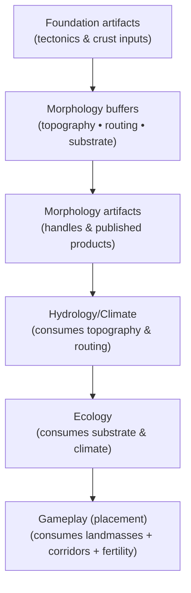
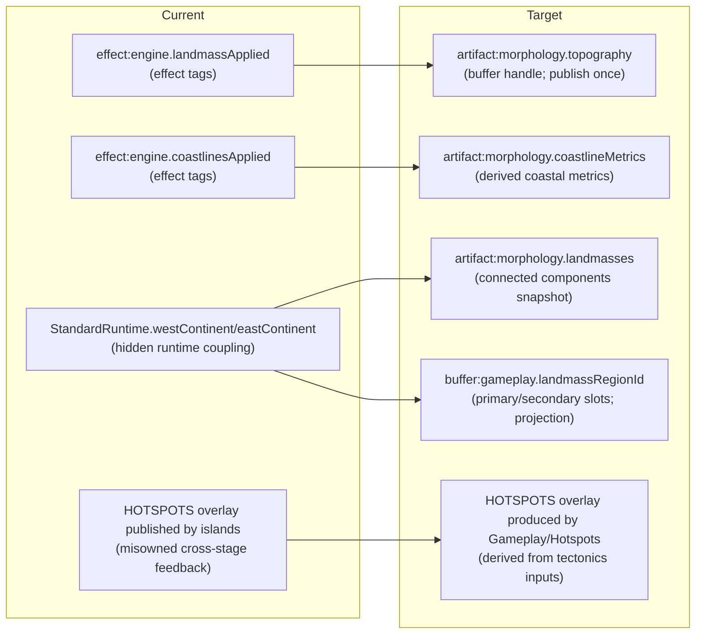

# Morphology Domain Refactor — Phase 2 Modeling Spike (Model-First)

This spike is the Phase 2 output for the Morphology vertical refactor workflow. It defines the authoritative first-principles Morphology model, then derives the target contract surfaces from that model. All updates reflect the integration of the Narrative and Placement domains into a unified Gameplay domain (absorbing story overlay production and placement logic).

## Purpose
- Goal: Establish the Morphology model and boundaries so Morphology no longer depends on or produces story overlays.
- Ensure Narrative (story overlay) steps and Placement logic live inside Gameplay, allowing Morphology to feed data downstream without reverse coupling.

## 0) Scope guardrails (Phase 2)

- Model-first only: No slice plan content in this document.
- Authoritative model: The model is canonical even if artifacts change.
- Projections are non-authoritative: Never let projection requirements (e.g. engine conveniences) dictate internal representation.
- No in-domain compatibility hacks: No legacy or Gameplay/Narrative compatibility logic inside Morphology; any transitional shims live downstream (marked deprecated).
- Explicit classification: Every config property, rule/policy, and function is explicitly marked as keep/kill/migrate (no silent carry-through of legacy behavior).

## 1) Authority stack (what is canonical vs supporting)

- **Canonical (authoritative) sources:**
  - Domain-only causality & ownership – Morphology spec: docs/system/libs/mapgen/morphology.md
  - Cross-domain data model (buffers, artifacts, overlays) – Architecture spec: docs/system/libs/mapgen/architecture.md
  - Upstream contract shape (inputs available) – Foundation spec: docs/system/libs/mapgen/foundation.md
  - Domain modeling rules (ops/strategies/rules/steps) – Modeling guidelines: docs/projects/engine-refactor-v1/resources/spec/SPEC-DOMAIN-MODELING-GUIDELINES.md
  - Refactor invariants & posture – Locked decisions & guardrails: docs/projects/engine-refactor-v1/resources/workflow/domain-refactor/references/implementation-traps-and-locked-decisions.md, .../verification-and-guardrails.md

- **External authority (Civ7 engine constraints – authoritative for interop, not for our internal model):**
  - Civ7 shipped map scripts & data under .civ7/outputs/resources/Base/modules/base-standard/ (key references for start placement and resource logic), e.g.:
    - assign-starting-plots.js (homelands vs distant start logic)
    - map-utilities.js (LandmassRegionId stamping helpers)
    - resource-generator.js (resource placement gating by LandmassRegionId)
    - age-transition-post-load.js (age-based resource logic using LandmassRegionId)
    - data/maps.xml and data/ages.xml (PlayersLandmass1/2, hemisphere restrictions)
    - config/config.xml (defines “Distant Lands” map size domain semantics)

- **Supporting (informative but not contract-authoritative):**
  - Earth physics synthesis (causal reference) – docs/system/libs/mapgen/research/SPIKE-synthesis-earth-physics-systems-swooper-engine.md
  - Civ7 mapgen feature inventory (idea bank) – docs/system/libs/mapgen/research/SPIKE-civ7-map-generation-features.md
  - Gameplay touchpoints (gameplay integration evidence) – docs/system/libs/mapgen/research/SPIKE-gameplay-mapgen-touchpoints.md
  - External research references (cited inline below as needed; not authoritative for our contracts)

## 2) Locked modeling principle (model-first)

Morphology is the “sculptor” layer:

- Upstream causes: Foundation produces tectonic potential and material history (plate configurations, uplift rates, crust types, etc.).
- Morphology’s role: Morphology converts those causes into topography, land/sea structure, and geomorphic signals that downstream systems can reason about.
- Downstream usage: Hydrology, Ecology, and Gameplay domains consume Morphology’s outputs to apply climate, biomes, resources, and story context, but Morphology itself remains physics-focused.

Key posture:

- Morphology owns the meaning of its physical products (elevation models, land/water distribution, geomorphic features). Downstream domains may interpret or project these (e.g. assign start regions), but Morphology defines them.
- If a downstream system (e.g. Gameplay) needs a legacy shape or convenience (like predefined “continent windows”), that is treated as a projection and lives downstream, not within Morphology. Any such legacy coupling is explicitly removed or deprecated in Morphology.

## 3) Canonical model (authoritative) + causality spine
### 3.1 Canonical state (conceptual; buffers are the truth)

Morphology’s internal representation is buffer-first: a set of mutable raster layers (tile-indexed arrays) that are iteratively refined across Morphology steps. The core state includes:

```ts
type TileIndex = number; // i = y * width + x

interface MorphologyTopographyBuffers {
  elevation: Float32Array;     // signed height relative to datum (per tile)
  bathymetry: Float32Array;    // signed depth below datum for oceans (per tile)
  landMask: Uint8Array;        // 1 = land, 0 = water (per tile; derived from elevation + seaLevel)
  seaLevel: number;            // scalar sea level datum defining land vs water

  slope?: Float32Array;        // derived metric (gradient per tile)
  ruggedness?: Float32Array;   // derived metric (local relief roughness)
  distanceToCoast?: Uint16Array; // derived metric (tiles to nearest coast; 0 at coast)
}

interface MorphologySubstrateBuffers {
  erodibilityK: Float32Array;   // resistance to erosion/incision (per tile)
  sedimentDepth: Float32Array;  // accumulated sediment thickness (per tile)
}

interface MorphologyRoutingBuffers {
  flowDir: Int32Array;   // steepest-descent neighbor index for runoff (per tile, or -1 if none)
  flowAccum: Float32Array; // drainage area proxy (accumulated flow) per tile
  basinId?: Int32Array;    // (optional) basin label per tile (for lake/river basin identification)
}

interface MorphologyLandmassModel {
  landmasses: Array<{
    id: number;
    tileCount: number;
    bbox: { west: number; east: number; south: number; north: number };
    coastlineLength: number;
    shelfShare?: number; // optional: fraction of land on continental shelf (if bathymetry is used)
  }>;
}
```


Non-goal of the canonical model: Representing engine-specific terrain or feature IDs (e.g. “mountain” terrain type). Those are projections applied later (in Gameplay or engine output finalization) and are not part of Morphology’s authoritative state.

### 3.2 Inputs (authoritative, upstream-owned facts)

Morphology consumes the following upstream inputs:

- **Tectonic drivers:** e.g. uplift rates, rift zones, shear zones, volcanism indices, cumulative uplift – provided by Foundation domain (plate tectonics model).
- **Material & age signals:** crust composition (continental vs oceanic crust) and crust age – from Foundation’s outputs.
- **Board geometry constants:** map size (width, height), wraparound flags (e.g. east-west wrap), latitude/longitude mapping – from the environment/engine setup.
- **No direct story inputs:** Morphology does not consume any story/narrative overlays or gameplay hints. Any concept of protected “corridors” or preset “sea lanes” must be handled via Morphology’s own logic or config, not via an external overlay input.

Note: In the previous model, Morphology could take an optional story overlay constraint (e.g. protected corridors) as a data-only input. In the updated model, this is removed – Morphology has no Narrative/Gameplay overlay inputs at all. Any high-level constraints (like ensuring an open ocean lane) are achieved through Morphology’s internal rules or upstream config, not by reading a Narrative artifact.

### 3.3 Outputs (authoritative vs projections)

Authoritative Morphology outputs (Morphology-owned meaning):

- **Topography buffers:** The final elevation map (and corresponding bathymetry and landMask) for the world.
- **Routing buffers:** Flow direction and accumulation buffers (and basin identifiers if used), establishing drainage patterns.
- **Substrate buffers:** Erodibility and sediment depth layers describing the geologic substrate.
- **Landmass decomposition:** A snapshot list of landmasses (connected land regions) with their attributes (size, bounds, coastline length, etc.), derived from the final landMask.

Projection outputs (explicitly non-canonical in Morphology):

These are derived interpretations for downstream gameplay/engine use. Morphology itself does not fully determine these; they are produced downstream based on Morphology outputs:

- **Start region windows:** e.g. predefined “west continent” vs “east continent” partitions for start placement. Morphology publishes landmasses, but any designation of primary/secondary continents for start bias is done by Gameplay as a projection.
- **Landmass region IDs (engine hemisphere slots):** The per-tile labels used by the Civ7 engine (GameplayMap.getLandmassRegionId), e.g. for “homelands vs distant lands.” These IDs are derived downstream from Morphology’s landmass data combined with gameplay rules – Morphology does not assign them directly.
- **Engine terrain or biome classifications:** Marking tiles as “mountain” terrain or “hills” is done later (during map finalization or by Ecology/Gameplay), using Morphology’s elevation and slope outputs but not decided within Morphology.

### 3.4 Causality spine (Morphology-local ordering)

This is the Morphology-internal chain of causality – the sequence in which morphological phenomena are produced. It forms the backbone for defining op and step boundaries later (each numbered item corresponds to a logical grouping of computations):

- **Substrate mapping (lithology):** Use crust type/age and tectonic regime to derive substrate strength properties (e.g. map crustal composition into an erodibility (K) field, plus any other proxies for resistance/strength).
- **Base topography generation:** Apply tectonic uplift and rift subsidence to generate an initial elevation field (and ocean depth for basins) – a first-pass heightmap before erosion.
- **Sea level & land definition:** Determine an appropriate sea level (targeting a desired land/ocean ratio or hypsometric curve) and derive the binary land/water mask from elevation relative to that sea level.
- **Coastline & shelf structuring:** Compute coastal metrics (distance-to-coast per tile, continental shelf identification) and adjust coasts. Enforce any large-scale coastal constraints such as ensuring an open ocean corridor (sea lane) if required by config (handled internally as a physical basin separation, not via external overlay).
- **Flow routing:** From the current elevation (post-initial coastal adjustments), compute water flow directions and accumulation (drainage basins). This establishes river networks and basins that Hydrology will later use.
- **Geomorphic shaping (erosion & deposition cycles):** Apply iterative terrain shaping processes: fluvial incision, hillslope diffusion, and sediment deposition. These run in one or more “eras” (iterations) to age the terrain, progressively naturalizing the tectonic heightmap; substrate properties modulate the response.
- **Landform accents:** Add discrete landform features on top of the smoothed base (island chains/archipelagos, volcanic peaks, ridge lines, rift basins). These are targeted topography edits that introduce fine-detail features the broad erosion may miss.
- **Landmass decomposition:** Derive high-level landmass entities from the finalized landMask (connected land regions with stats). This creates an artifact that downstream domains (Hydrology, Ecology, Gameplay) use for climate modeling, start placement, etc.

## 4) Conceptual narrative (the “technical visionary artist” view)

Morphology is where the map stops being a plate tectonic diagram and becomes a world you can recognize and reason about. In other words, Foundation sets the stage, but Morphology paints the scenery:

- **Convergent plate margins** become long, asymmetric mountain ranges with foothills and complex nearby coastlines.
- **Divergent rift zones** become rift valleys or inland seas flanked by younger volcanic belts.
- **Ancient stable cratons** turn into broad, relatively flat interiors punctuated by stubborn relief (mesas or shield highlands that resist erosion).
- **Sedimentary basins** emerge as fertile lowlands and river deltas, indicated by significant sediment accumulation.

The goal isn’t a photorealistic Earth, but rather a coherent, causal story in the terrain that yields gameplay-relevant features:

- **Natural chokepoints for defense** (mountain ridges and passable corridors).
- **Legible river networks and basins** that make river placement believable and support fertile floodplains.
- **Believable coastlines** with continental shelves and varied shapes (bays, fjords, peninsulas) rather than uniform blobs.
- **A geological substrate** that downstream systems can build upon (resources tied to sediment depth, biome differences on ancient vs young terrain).

From a gameplay perspective (Civ7-specific goals), the world also must support:

- **The “Homelands vs Distant Lands” paradigm** for start positions and age-based rules, without hardcoding that logic in Morphology.
- **Navigable rivers and meaningful watersheds** before Hydrology carves rivers, so river placement aligns with terrain.
- **Pronounced mountain belts and rough terrain** that influence movement and city placement, creating natural barriers and strategic considerations.

## 5) Diagrams (architecture view, data-flow, producer/consumer map)
### 5.1 Architecture view (domain spine + stage braid)

```mermaid
flowchart LR
  foundation["Foundation\n(mesh • crust • plates • tectonics)"]
  morphPre["Morphology (pre)\n(base topography • land/sea)"]
  gamePre["Gameplay (pre)\n(seed story overlays)"]
  morphMid["Morphology (mid)\ncoasts • erosion • routing"]
  gameMid["Gameplay (mid)\n(meaning/overlays)"]
  morphPost["Morphology (post)\nlandforms (islands/ridges/volcanoes)"]
  hydroPre["Hydrology (pre)\nclimate baseline • lakes"]
  gameplayPlacement["Gameplay (placement)\n(starts/wonders/etc)"]

  foundation --> morphPre --> gamePre --> morphMid --> gameMid --> morphPost --> hydroPre --> gameplayPlacement
```



**Explanation:**
- The standard map generation recipe interleaves Gameplay-oriented stages with Morphology stages, so Narrative/story overlay steps (now part of Gameplay) run between Morphology phases (e.g. after morphPre and morphMid).
- The Placement finale (applying starts, wonders, resources) is part of Gameplay at the end.
- In the refactored model we keep the braid order but clarify boundaries: Morphology produces data (artifacts/buffers) that Gameplay consumes, and Morphology no longer depends on Gameplay outputs. The dependencies are one-way.

### 5.2 Data-flow (authoritative buffers + contracted artifacts)



**Notes:**
- Morphology reads inputs from Foundation (tectonic drivers, crust, etc.) and produces internal buffers (tile grids) plus artifact handles (snapshots exposed to other domains).
- No overlay inputs flow into Morphology: the storyOverlays container (for narrative overlays) is now managed entirely within Gameplay and is omitted from Morphology’s inputs. Morphology’s processing is self-contained based on foundation inputs.
- Hydrology and Ecology consume Morphology’s outputs (topography, drainage, landmasses) in sequence. Gameplay (placement stage and associated logic) consumes both Morphology and Ecology outputs (e.g. for fertility signals) to place starts, resources, and finalize story elements. For example, corridors derived from Morphology data can influence placement, but Morphology itself doesn’t need to know about them.

### 5.3 Producer/consumer map adjustments (current → target)



**Target posture changes:**
- **Explicit artifacts instead of effect tags:** Replace the legacy effect-tag gating (e.g. steps waiting on landmassApplied or coastlinesApplied) with explicit data dependencies. Narrative/Gameplay steps that needed coastlinesApplied now explicitly require the relevant Morphology artifact (e.g. coastline metrics).
- **No hidden runtime coupling:** Remove the hidden runtime flags like StandardRuntime.westContinent/eastContinent. Morphology publishes the actual landmass breakdown (artifact:morphology.landmasses), and any west/east notion is computed downstream (e.g. as part of LandmassRegionId assignment).
- **HOTSPOTS handled upstream:** Morphology stops publishing the HOTSPOTS overlay. If a “hotspot” signal is required, Gameplay’s Hotspots step treats it as a tectonic-derived overlay, and Morphology relies on its own tectonic inputs for island/volcano placement.

## 6) Target contract matrix (buffers / artifacts / overlays)

This section summarizes the target contract surfaces implied by the canonical model. It defines what inputs Morphology accepts and what outputs it publishes in the refactored design. (Exact names and wiring will be handled in Phase 3 implementation; here we focus on meaning and ownership.)

### 6.1 Upstream inputs (adopted)

Adopt immediately (available today):

- artifact:foundation.plates – Plate projection per tile (boundary types, proximity, uplift/rift potentials, etc.). Used where tile-indexed data is needed (e.g. initial elevation seeding).
- artifact:foundation.tectonics – Mesh-indexed tectonic drivers (forces along plate boundaries, etc.). Preferred for driving continuous models (more physics-first approach).
- artifact:foundation.crust – Mesh-indexed crust material and age data. Preferred for substrate and elevation base calculations.

(Environmental constants like map dimensions are assumed available via context and not listed as artifacts.)

Note: Morphology no longer has any storyOverlay input. In earlier plans, an artifact like artifact:storyOverlays (a container for narrative overlays) existed and Morphology could read data-only views (e.g. a mask for protected sea lanes). In the new model, such overlay intakes are removed. Any high-level constraints are either encoded in Foundation inputs or handled by Morphology’s own rules/config rather than as foreign artifacts.

### 6.2 Morphology products (published contracts)

Buffers (canonical internal truth; published via artifact handles if needed):

- buffer:morphology.topography – The main heightfield buffers: elevation (with embedded bathymetry) and the associated landMask (plus any derived metrics like slope or distance-to-coast). This buffer is the ground truth for terrain shape.
- buffer:morphology.routing – The flow routing buffers (flow directions and accumulation, and optional basin identifiers). Defines the drainage network.
- buffer:morphology.substrate – The substrate property buffers (erodibility K and sediment depth). Defines underlying ground material properties.

(Buffers are not copied across domain boundaries; instead, Morphology will publish handles to these buffers exactly once, after which downstream can read them as needed while Morphology continues to own updates within its steps.)

Artifacts (published snapshot products, immutable after publication):

- artifact:morphology.topography – An artifact handle to the topography buffer (published once the base land/sea model is established). Downstream consumers use this to get terrain info without effect tags.
- artifact:morphology.routing – Handle to routing buffers (post-erosion, if applicable).
- artifact:morphology.substrate – Handle to substrate buffers.
- artifact:morphology.landmasses – The landmass decomposition snapshot (list of landmasses with their properties) derived at the end of Morphology.
- artifact:morphology.coastlineMetrics – Snapshot of derived coastal metrics (e.g. shelf extents, indentation measures) for use by islands placement, hydrology (lakes), etc.

Overlays (story-context signals – none published by Morphology in target model):

- Morphology does not publish any story overlays. Gameplay now produces all narrative/story motif overlays (corridors, rifts, etc.) from Morphology’s outputs, and Morphology keeps focusing on physical data.
- Explicit non-ownership: HOTSPOTS (volcanic hotspot signals) are tectonics-derived and handled outside Morphology. Morphology must not publish HOTSPOTS; the Gameplay hotspot step owns it. Protected sea lane and corridor markers are also computed downstream, not inside Morphology.
- (In summary, story overlays are append-preferred context held entirely within Gameplay. Morphology provides the raw material – elevation, landmasses, etc. – and Gameplay layers the story meaning afterward.)

## 7) Op catalog (target Morphology operations)

This section lists the operations (ops) that compose the Morphology domain’s implementation in the target model. Ops are grouped by type, and each corresponds to a portion of the causality spine above. (Ops will be injected/pure functions; steps in the recipe will orchestrate calling them and handling any cross-domain effects or publications.)

### 7.1 Core compute ops (buffer-building)

- **morphology/compute-substrate (compute)**  
  - **Inputs:** foundation crust + tectonics  
  - **Purpose:** Map lithology (crust material, age, tectonic regime) into the resistance of each tile (erodibilityK field and other proxies). Establish the initial substrate property layer.
- **morphology/compute-base-topography (compute)**  
  - **Inputs:** tectonic drivers  
  - **Purpose:** Generate an initial heightfield from tectonic uplift and subsidence: amplified uplift near convergent boundaries, rift valleys for divergent zones, and baseline elevation/depth per crust type.
- **morphology/compute-sea-level (compute)**  
  - **Inputs:** configurable target (desired land percentage or hypsometric curve) + current elevation distribution  
  - **Purpose:** Select a sea level threshold that achieves the intended land/ocean balance while honoring any rules (e.g. avoiding drowning key plates).
- **morphology/compute-landmask (compute)**  
  - **Inputs:** elevation + chosen seaLevel  
  - **Purpose:** Classify land vs water per tile. Compute distance-to-coast and optionally mark immediate coast adjacency for downstream consumers.
- **morphology/compute-coastline-metrics (compute)**  
  - **Inputs:** landMask + bathymetry + optional coastline config  
  - **Purpose:** Analyze coast shape (shelf extents, indentation metrics like bays/fjords) to inform island placement, hydrology, etc., and enforce large-scale ocean structure (e.g. ocean corridor shaping) as needed.
- **morphology/compute-flow-routing (compute)**  
  - **Inputs:** elevation (after initial shaping)  
  - **Purpose:** Derive flow directions and accumulation, establishing river basins and lake candidates before Hydrology carves rivers.
- **morphology/compute-geomorphic-cycle (compute)**  
  - **Inputs:** elevation, flow routing, erodibilityK (substrate)  
  - **Purpose:** Run an erosion/deposition cycle (fluvial incision, diffusion, deposition) to age the terrain; repeatable per worldAge (young vs old worlds).
- **morphology/compute-landmasses (compute)**  
  - **Inputs:** final landMask  
  - **Purpose:** Identify connected landmasses and compute their stats (size, bbox, coastline length). Publish the derived data as artifact:morphology.landmasses.

### 7.2 Plan ops (discrete landforms)

- **morphology/plan-island-chains (plan)**  
  - **Inputs:** coastline metrics + tectonic signals (volcanism, plate context)  
  - **Purpose:** Propose archipelagos or island chains (volcanic island arcs, hotspot chains) by combining coastal metrics (shelf edges, indentations) with tectonic context. It now relies solely on tectonic signals (Foundation volcanism/uplift traces) rather than a Narrative HOTSPOTS overlay.
- **morphology/plan-ridges-and-foothills (plan)**  
  - **Inputs:** tectonic drivers + topography  
  - **Purpose:** Identify ridge spines and foothill zones that can be accentuated, flagging mountain chains and potential corridors. This refines any ridge structures already hinted at in the base topography.
- **morphology/plan-volcanoes (plan)**  
  - **Inputs:** tectonic volcanism signals + topography + coastline metrics  
  - **Purpose:** Select locations for standalone volcanoes or volcanic ranges, combining tectonic activity with local terrain and coastal context. Provides volcano placement data that later steps materialize (e.g. carving peaks or calderas).

### 7.3 Rules (policy units; internal to ops)

(These are lower-level reusable logic pieces that remain internal to ops – not exposed as separate contracts. They encapsulate particular policy decisions or calculations.)
- **Hypsometry/sea-level selection:** Rules for choosing sea level based on target land fraction or distribution (e.g. “target X% land tiles” plus clamp rules to avoid all-land or all-water extremes).
- **Tectonic regime classification:** Classify map areas by tectonic context (boundary type, distance, rift intensity) into regimes (mountain belt, stable interior, rift zone) to drive topography and erosion behavior.
- **Ocean/coast protection policy:** Enforce ocean separation (sea lanes) internally by deriving a protection mask from config (e.g. preserveOceanCorridor) and applying it in compute-landmask or compute-coastline-metrics, without Narrative overlay coupling.
- **Erosion parameter scaling:** Adjust erosion/diffusion rates based on “world age,” map size, climate, or other factors to control how aggressively geomorphic cycles relax relief.
- **Miscellaneous placement heuristics:** Handle rules such as volcano spacing or island distribution bias to keep discrete features believable.

## 8) Legacy disposition ledger (keep/kill/migrate)

This ledger classifies every existing config property, rule/policy, and function in the current Morphology implementation, deciding whether to keep, migrate, or kill each in the target design:

keep: It remains with the same meaning/ownership (though it may be moved “behind” the new op interface).

migrate: The concept survives but moves or is renamed/recontracted – often to clarify ownership or integrate into the new model structure.

kill: It is removed entirely (deemed legacy, incoherent, or superseded by a new approach).

### 8.1 Config properties
#### 8.1.1 LandmassConfigSchema (mods/mod-swooper-maps/src/domain/morphology/landmass/config.ts)

All landmass config parameters will be absorbed into the op-specific configs under the new model (primarily into compute-sea-level, compute-base-topography, and compute-landmask). The current schema is a legacy monolithic “bag” of settings; it will not be used as-is in new op contracts. Each entry is handled as follows:

```yaml
LandmassConfigSchema:
  baseWaterPercent: migrate        # -> use in morphology/compute-sea-level (target global water fraction for hypsometry)
  waterScalar: migrate             # -> morphology/compute-sea-level (secondary scaling factor; likely handled in normalization)
  boundaryBias: migrate            # -> either compute-base-topography (to bias boundary uplift) or compute-landmask (if used for coastal land suppression)
  boundaryShareTarget: migrate     # -> morphology/compute-sea-level (influence on land distribution relative to plate boundaries)
  continentalFraction: migrate     # -> morphology/compute-sea-level (possible constraint for percent land on continental crust; might be dropped if Foundation provides needed data)
  clusteringBias: migrate          # -> morphology/compute-base-topography (influences land layout clustering; could move upstream later if it’s really a tectonic input)
  microcontinentChance: migrate    # -> possibly compute-base-topography or plan-island-chains; reframe as “microcontinent frequency” (small independent land pieces)
  crustEdgeBlend: migrate          # -> morphology/compute-base-topography (smooth elevation at crust boundaries; might become part of diffusion)
  crustNoiseAmplitude: migrate     # -> morphology/compute-base-topography (adds random noise in base elevation; might be reduced if erosion provides variation)
  continentalHeight: migrate       # -> morphology/compute-base-topography (base elevation offset for continental crust)
  oceanicHeight: migrate           # -> morphology/compute-base-topography (base depth for oceanic crust regions)
  tectonics:
    interiorNoiseWeight: migrate        # -> compute-base-topography (variation inside plates)
    boundaryArcWeight: migrate          # -> compute-base-topography (amplitude of orogeny mountain arc shaping)
    boundaryArcNoiseWeight: migrate     # -> compute-base-topography (roughness of mountain arcs; might become regime-specific noise)
    fractalGrain: migrate               # -> compute-base-topography (scale of noise; may be killed if multi-scale diffusion covers this)
  geometry:
    post:
      expandTiles: kill           # (legacy projection tweak for windows; irrelevant in new model)
      expandWestTiles: kill       # (projection-only; remove)
      expandEastTiles: kill       # (projection-only; remove)
      clampWestMin: kill          # (projection-only)
      clampEastMax: kill          # (projection-only)
      overrideSouth: kill         # (projection-only)
      overrideNorth: kill         # (projection-only)
      minWidthTiles: kill         # (projection-only; downstream concern if needed)
```


Decision note: Legacy “continent window” adjustments (all those expand/clamp/override settings) were used to fine-tune the west/east continent division for start positions. These are pure projection concerns and will not exist in Morphology anymore. We will rely on the landmass artifact and downstream logic to handle such windows if needed. They are removed from Morphology as they violate the model’s separation of concerns.

#### 8.1.2 MorphologyConfigSchema (mods/mod-swooper-maps/src/domain/morphology/config.ts)

This schema contains various sub-settings for Morphology. Under the new model, many entries migrate to new homes (or are refactored), especially those related to narrative overlays or legacy toggles:

```yaml
MorphologyConfigSchema:
  oceanSeparation:
    enabled: migrate
    bandPairs: migrate
    baseSeparationTiles: migrate
    boundaryClosenessMultiplier: migrate
    maxPerRowDelta: migrate
    minChannelWidth: migrate
    channelJitter: migrate
    respectSeaLanes: migrate   # (if true, we enforce open sea lanes; handled in new model via Morphology internal rule using these params)
    edgeWest:
      enabled: migrate
      baseTiles: migrate
      boundaryClosenessMultiplier: migrate
      maxPerRowDelta: migrate
    edgeEast:
      enabled: migrate
      baseTiles: migrate
      boundaryClosenessMultiplier: migrate
      maxPerRowDelta: migrate

  coastlines:
    bay:
      noiseGateAdd: migrate
      rollDenActive: migrate
      rollDenDefault: migrate
    fjord:
      baseDenom: migrate
      activeBonus: migrate
      passiveBonus: migrate
    plateBias:
      threshold: migrate
      power: migrate
      convergent: migrate
      transform: migrate
      divergent: migrate
      interior: migrate
      bayWeight: migrate
      bayNoiseBonus: migrate
      fjordWeight: migrate
    minSeaLaneWidth: migrate   # (ensures a minimum width for any enforced sea lane corridor; used in coastline metrics adjustments)

  islands:
    fractalThresholdPercent: migrate
    minDistFromLandRadius: migrate
    baseIslandDenNearActive: migrate
    baseIslandDenElse: migrate
    hotspotSeedDenom: migrate  # (will be renamed or reinterpreted; originally related to hotspot spacing – might be repurposed as generic island chain frequency or moved to Gameplay if purely story-driven)
    clusterMax: migrate

  mountains:
    tectonicIntensity: migrate
    mountainThreshold: migrate
    hillThreshold: migrate
    upliftWeight: migrate
    fractalWeight: migrate
    riftDepth: migrate
    boundaryWeight: migrate
    boundaryGate: migrate
    boundaryExponent: migrate
    interiorPenaltyWeight: migrate
    convergenceBonus: migrate
    transformPenalty: migrate
    riftPenalty: migrate
    hillBoundaryWeight: migrate
    hillRiftBonus: migrate
    hillConvergentFoothill: migrate
    hillInteriorFalloff: migrate
    hillUpliftWeight: migrate

  volcanoes:
    enabled: migrate
    baseDensity: migrate
    minSpacing: migrate
    boundaryThreshold: migrate
    boundaryWeight: migrate
    convergentMultiplier: migrate
    transformMultiplier: migrate
    divergentMultiplier: migrate
    hotspotWeight: migrate   # (will likely be renamed; in new model, if we incorporate “hotspot” signals, it will consume those tectonic signals rather than rely on a nebulous interior metric)
    shieldPenalty: migrate
    randomJitter: migrate
    minVolcanoes: migrate
    maxVolcanoes: migrate
```

Modeling note: “migrate” here means the setting will still exist for authors/tuning, but its ownership or interpretation changes. These values will be moved behind specific op configs and normalized to fit the new model. For instance, many of the above become parameters to our new compute or plan ops (instead of being global Morphology toggles).

### 8.2 Rules/policies

Legacy rule or policy functions and how they translate to the new design:

```yaml
rules_and_policies:
  DEFAULT_OCEAN_SEPARATION:
    disposition: migrate
    target: "rule inside morphology/compute-landmask or morphology/compute-coastline-metrics"

  resolveSeaCorridorPolicy:
    disposition: migrate
    target: "step-level policy (derive and apply ocean corridor mask from config; no external overlay)"

  findNeighborSeaLaneAttributes:
    disposition: migrate
    target: "step-level policy (derive sea lane protection mask internally; no cross-domain coupling)"

  findNeighborSeaLaneEdgeConfig:
    disposition: migrate
    target: "step-level policy (derive protection mask internally at edges)"
```


These policies relate mostly to the ocean separation (ensuring an open sea corridor between major land regions). In the new model, they are implemented within Morphology using config-driven rules rather than reading any Narrative overlays:

DEFAULT_OCEAN_SEPARATION becomes an internal rule applied during landmask/coastline ops to enforce the separation.

resolveSeaCorridorPolicy and the findNeighborSeaLane* helpers become step-level logic that computes where to preserve sea lanes using the config parameters (like minSeaLaneWidth, bandPairs, etc.) and applies that by adjusting the landmask or marking those areas off-limits to land elevation. No narrative overlay input is needed; these use Morphology’s own understanding of the map and config to ensure the outcome.

### 8.3 Functions (current exports)

This is an inventory of functions currently exported by the Morphology domain (or related helpers) in the legacy code, with their disposition:

```yaml
domain_functions:
  createPlateDrivenLandmasses:
    disposition: migrate
    target: "morphology/compute-base-topography + morphology/compute-landmask (model-first, without outputting windows)"

  applyLandmassPostAdjustments:
    disposition: kill
    rationale: "Legacy post-processing of continents for start windows; projection-only concern."

  applyPlateAwareOceanSeparation:
    disposition: migrate
    target: "morphology/compute-landmask (implement ocean basin shaping as part of landmask generation)"

  addRuggedCoasts:
    disposition: migrate
    target: "morphology/compute-coastline-metrics (compute coastal roughness) + possibly minor topography edits; no effect tags, purely data output."

  addIslandChains:
    disposition: migrate
    target: "morphology/plan-island-chains (plan op) + corresponding step to apply those island edits"

  layerAddMountainsPhysics:
    disposition: migrate
    target: "morphology/plan-ridges-and-foothills (plan op) + step to apply ridge/hill projections"

  layerAddVolcanoesPlateAware:
    disposition: migrate
    target: "morphology/plan-volcanoes (plan op) + step to apply volcano creation"

  computePlateBias:
    disposition: migrate
    target: "integrate into rules inside coastline-related ops (influence coastal deformation by plate context)"

  computeTargetLandTiles:
    disposition: migrate
    target: "rule inside morphology/compute-sea-level (to achieve target land percentage)"

  computeClosenessLimit:
    disposition: kill
    rationale: "Legacy heuristic for continent spacing (crust-first approach); obsolete under uplift-driven model."

  tryCrustFirstLandmask:
    disposition: kill
    rationale: "Old approach that made land placement depend solely on crust type; conflicts with uplift→elevation model."

  applyLandmaskToTerrain:
    disposition: migrate
    target: "step-level effect (calls engine API to set terrain based on landmask); remains outside ops (engine write)."

  computePlateStatsFromLandMask:
    disposition: migrate
    target: "morphology/compute-landmasses (gather stats from final landmask)"

  windowsFromPlateStats:
    disposition: kill
    rationale: "Computing west/east windows from plate stats is a projection; replaced by downstream landmass post-processing."

  windowFromPlateStat:
    disposition: kill
    rationale: "Same as above – legacy projection logic."

  computeFractalOnlyScores:
    disposition: kill
    rationale: "Legacy fallback for missing tectonic input; new model requires tectonic inputs, so this is dropped."

  computePlateBasedScores:
    disposition: migrate
    target: "integrate into ridge planning rule (use tectonic regime classification + scoring for ridges)"

  applyRiftDepressions:
    disposition: migrate
    target: "move into compute-base-topography (handle rift valley lowering as part of initial elevation, not later in mountains)"

  scoreVolcanoWeight:
    disposition: migrate
    target: "rule inside volcano planning op (to score potential volcano sites)"
```

## 9) Upstream authoritative input selection (adopted inputs & legacy reads to delete)
### 9.1 Adopted inputs (target)

To reiterate, Morphology in the target state will use the following authoritative inputs from upstream:

Foundation tectonic and crust artifacts: foundation.tectonics and foundation.crust are directly used for model-first calculations (plate boundary forces, crust composition) – these are high-fidelity inputs preferred over any tile projections where possible.

Foundation plates projection: foundation.plates remains available as a tile-indexed projection of tectonic data, to be used where needed (e.g. seeding elevation on a per-tile basis). It’s essentially a convenient lookup for “what is the tectonic context of this tile” derived from the mesh.

No direct narrative/story inputs: (Removed) – The prior system allowed an overlay artifact from Narrative (story overlays) to be passed in. In the new model, there is no narrative domain artifact fed into Morphology. Any influence that narrative overlays had is achieved via config or upstream tectonics. For example, if a “protected sea lane” was previously indicated by a narrative overlay, now the oceanSeparation config and Morphology’s rules handle it internally.

### 9.2 Legacy reads to delete (in this domain)

As part of this refactor, Morphology will stop using or depending on the following legacy surfaces:

Foundation deep imports: No Morphology code should directly import Foundation implementation constants (e.g. BOUNDARY_TYPE enums from Foundation). All such data must come through proper artifacts (foundation.plates or foundation.tectonics artifacts encapsulate needed info).

Runtime continents in StandardRuntime: Morphology will not read or write StandardRuntime.westContinent / eastContinent flags. These hidden global flags (used to signal start continent split) are replaced by explicit morphology.landmasses outputs and downstream computations for start regions.

Publishing HOTSPOTS overlay within Morphology: Remove the code path where the Morphology islands step was publishing a HOTSPOTS overlay snapshot to the overlay registry. This was a misownership of that data; going forward HOTSPOTS are generated upstream (Gameplay) and Morphology does not handle them.

(By eliminating these reads/writes, we ensure Morphology’s independence and a clean contract surface.)

## 10) Downstream consumer impact scan (current usage & required changes)

- **Current cross-domain usage discovered (Phase 1 findings):**
  - Narrative (story overlay) steps gate on Morphology’s effect tags (e.g. narrative-pre steps wait for effect:engine.coastlinesApplied).
  - Hydrology checks effect:engine.landmassApplied for lake timing and reads deprecated runtime continent flags for climate behavior.
  - Placement consumes runtime continent info, encodes it into start-region logic, and may rely on narrative overlays (corridors) for resource placement.

- **Required downstream changes implied by the new model:**
  - Replace effect-tag gating with artifact requirements: Gameplay steps must declare dependencies on morphology artifacts (e.g. story steps require artifact:morphology.coastlineMetrics instead of coastlinesApplied).
  - Eliminate runtime “continents” coupling: Hydrology and Gameplay must switch to artifact:morphology.landmasses (and any needed projections) rather than StandardRuntime flags. Primary/secondary continents are derived explicitly downstream.
  - Explicit LandmassRegionId projection: Gameplay (placement or a dedicated step) must compute Civ7 LandmassRegionId assignments (e.g. homelands vs distant lands) from morphology.landmasses, including propagation to adjacent water tiles.
  - Story overlay generation stays in Gameplay: HOTSPOTS, corridors, etc., are produced by Gameplay (e.g. the storyHotspots pre-step) using Morphology outputs; Morphology no longer consumes or publishes overlays.
  - Hydrology/Ecology logic remains unchanged aside from fetching data via the new artifacts instead of implicit signals.

(No detailed migration plan is included here – Phase 3 will cover the precise sequence of changes and how to implement these requirements.)

## 11) Architecture alignment note (SPEC/ADR constraints and resolutions)

These are areas where the current code deviates from the target architecture and how the refactor will resolve them. The model is locked to enforce these:

No direct imports across domain boundaries: Recipe steps in Morphology (or any domain) must not import Morphology’s own implementation classes or those of another domain. They should call domain ops via injected interfaces (run(ctx, config, ops, deps) pattern). This avoids entangling implementation details across domains and keeps boundaries clear.

Op purity and atomicity: Ops remain atomic and data-only (no op should call another op internally; no side effects like writing artifacts or overlays). Steps orchestrate op calls and handle side effects such as publishing artifacts or triggering engine writes.

Step-owned effect boundaries: Steps, not ops, handle interactions with external systems – that includes writing to the game engine state, publishing artifact snapshots, and (in the Gameplay domain) appending to overlays. Morphology ops produce data; if anything needs to be written to the engine (terrain placement, etc.) or to an overlay, the step does it. (In Morphology’s case, this primarily means steps publish artifacts or call engine API to mark terrain, since Morphology no longer touches overlays at all.)

Buffers vs artifacts: Buffers are the ground truth and can be mutated within Morphology across steps. Artifacts are just published “views” of those buffers at certain points (and remain constant once published). We minimize using artifacts except at domain boundaries – within Morphology, operate on buffers directly.

No phantom or ghost data: We do not snapshot or freeze state unnecessarily at publish boundaries. Publish an artifact when needed for other domains, but within Morphology continue to use the live buffer. Also avoid any placeholder artifacts or “dead data” just to satisfy old interfaces.

(These resolutions align Morphology with the overall system architecture guidelines, ensuring a clean, maintainable separation of concerns.)

## 12) Decisions & defaults (modeling decisions)
- **Decision:** Morphology publishes landmass decomposition; does not publish start-region windows.
  - **Choice (locked):** Morphology will produce artifact:morphology.landmasses (physical connected land regions and their stats).
  - **Explicit non-goal:** Morphology will not emit westContinent/eastContinent labels or assign engine LandmassRegionId values.
  - **Rationale:** “Homelands vs distant lands” or continent groupings are gameplay projections. Morphology supplies raw landmasses, and Gameplay decides how to split/label them, keeping Morphology physics-first.

- **Decision:** HOTSPOTS overlay is not Morphology-owned.
  - **Choice (locked):** Morphology must not publish the HOTSPOTS overlay (volcanic hotspot points); the signal belongs upstream in Gameplay.
  - **Practical ownership (current):** Gameplay’s Hotspots step (formerly narrative-pre/storyHotspots) now produces HOTSPOTS using Foundation/coast inputs.
  - **Rationale:** Hotspots derive conceptually from tectonics. Morphology reacts to their effects but is not the source of hotspot locations. By moving hotspot generation to Gameplay, Morphology stays free of overlay management while still consuming hotspot coordinates if provided.

- **Decision:** Ocean separation is modeled as basin shaping (not a continent “window” hack).
  - **Choice (locked):** Encode open ocean separation as a physical constraint on landmask/bathymetry, shaping a contiguous ocean corridor rather than using continent windows.
  - **Rationale:** Civ7 expects a meaningful separation between major land groups. Shaping the world to create the separation (e.g. keeping a central ocean band) satisfies the gameplay need in a reproducible simulation, not as a downstream hack.

- **Default:** “World age” is a first-class Morphology knob (discrete eras vs continuous simulation).
  - **Choice:** Interpret “world age” as a small number of erosion iterations (1–3 cycles for young, mature, old), not a continuous time simulation.
  - **Rationale:** This yields deterministic, tunable outcomes, aligning with strategy map needs and making testing/explanation easier.

Canonical authored config (target surface; op configs are derived internally)

The author-facing configuration for Morphology should align with the conceptual model rather than legacy implementation details. Below is a conceptual shape of what the Morphology section of game configuration might look like, focusing on outcomes rather than the internal knobs:

```ts
interface MorphologyAuthorConfig {
  /** Land fraction / hypsometry controls (sea level tuning). */
  hypsometry: {
    targetWaterPercent: number;  // e.g. ~60 for Earth-like distribution
    variance?: number;           // allowable random deviation in water percent per map
  };

  /** World age setting controlling erosion intensity. */
  worldAge: "young" | "mature" | "old";

  /** Orogeny & relief shaping controls (how tectonics translate to height). */
  relief: {
    intensity: number;          // overall amplitude of terrain features
    ridgeSharpness?: number;
    riftSubsidence?: number;
  };

  /** Geomorphic cycle parameters (erosion, diffusion, etc). */
  geomorphology: {
    fluvial: { rate: number; m: number; n: number };    // stream power constants
    diffusion: { rate: number; talus?: number };        // hillslope diffusion rate and talus angle
    deposition: { rate: number };                       // sediment deposition rate
    eras: 1 | 2 | 3;                                    // how many erosion cycles to run
  };

  /** Coastline & continental shelf structure. */
  coast: {
    shelfWidth?: number;       // characteristic continental shelf width
    indentation?: { 
      bayRate: number;         // frequency/size of bays
      fjordRate: number;       // frequency/size of fjords
      protectionRespect?: boolean; // whether to enforce protected sea lanes (open ocean corridors)
    };
    minSeaLaneWidth?: number;  // minimum width for the open ocean corridor if enforced
  };

  /** Discrete landform frequency/intensity controls. */
  landforms: {
    islands?: { frequency: number; hotspotChainBias?: number };
    volcanoes?: { density: number; arcBias?: number; hotspotBias?: number };
  };
}
```


**Derivation posture:** The implementation normalizes this author config into specific op parameters. Each step/operation takes what it needs (e.g. compute-sea-level derives the precise sea level from the hypsometry target), and ops never see a giant MorphologyConfig bag. They only receive the parameters relevant to their task, ensuring clean separation of concerns and easier testing. The above structure guides how we present configuration to authors coherently.

## 13) Risk register (modeling)

```yaml
risks:
  - id: R1
    title: "Hidden consumer coupling via StandardRuntime continents"
    severity: high
    blocking: true
    notes: "Model forbids use of runtime continent flags; Phase 3 must ensure all consumers switch to landmass artifact."
  - id: R2
    title: "Effect-tag gating in consumers instead of explicit dependencies"
    severity: high
    blocking: true
    notes: "Must be corrected by introducing artifact requirements for narrative/gameplay steps (coastlines, etc.), removing reliance on effect tags."
  - id: R3
    title: "Gameplay overlay schema is overly permissive (Type.Any registry)"
    severity: medium
    blocking: false
    notes: "The overlay container (storyOverlays) is loosely typed. The model tolerates it as an append-only artifact in Gameplay, but long-term we should tighten the schema for safety."
  - id: R4
    title: "Current landmass generation logic uses crust-first land assignment"
    severity: high
    blocking: true
    notes: "Legacy code favored placing land purely based on crust type (continental crust = land) which conflicts with our uplift-driven model. Implementation must remove or rework this to follow the new elevation→landmask chain."
  - id: R5
    title: "Tile-indexed vs mesh-indexed input mismatch"
    severity: medium
    blocking: false
    notes: "In the short term we rely on the tile-indexed foundation.plates projection for some steps. Long-term, we prefer using mesh-indexed data directly. This is an acceptable interim step but should be resolved later."
```


(Mitigations for each risk are either inherent in the model decisions above or will be addressed in Phase 3 planning. Notably, R1 and R2 will be resolved by the contract changes in this refactor; R3 is an ongoing concern to handle in the Gameplay domain; R4 and R5 are addressed by changes in the modeling approach and planned future improvements.)

## 14) Golden path example (authoritative implementation pattern)

This outlines what an ideal Morphology step implementation looks like under the new model, as a guide for Phase 3:

- **Goals to demonstrate:**
  - The step imports only Morphology op contracts and stage-owned artifact contracts.
  - The runtime uses `run(ctx, config, ops, deps)` and accesses inputs through `deps` (e.g. `deps.artifacts.foundation`) instead of globals.
  - Ops remain data-only; the step handles artifact publication and any engine calls.

- **Candidate golden path (Morphology pre/topography step):**
  - Require Foundation artifacts (e.g. `foundation.plates` or `foundation.tectonics` via `deps.artifacts`).
  - Call `ops.morphology.computeBaseTopography(...)` to build initial elevation/bathymetry.
  - Call `ops.morphology.computeSeaLevel(...)` to choose sea level from config and elevation.
  - Call `ops.morphology.computeLandmask(...)` to derive the land/water classification.
  - Publish `artifact:morphology.topography` (a handle to elevation, bathymetry, and landMask buffers) via `deps.artifacts.morphology.topography.publish(ctx, buffers)`.
  - Do not output overlays or call engine APIs; the step only sets up the physical state and publishes it.

This makes morphology.topography available to downstream Gameplay without effect tags, while Morphology retains ownership of the buffers for later refinement.

## 15) Projection policy (explicitly non-canonical features)

To reiterate, these are outputs/considerations kept out of Morphology’s core model:

- **Start-region continent “windows”:** Explicit partitions (west vs east continents or multiple regions) are projections applied downstream (scenario config or Gameplay step), not part of Morphology.
- **Legacy effect-tag signaling:** Signals like `landmassApplied` or `coastlinesApplied` are replaced by explicit artifacts in the new contracts.
- **Engine terrain IDs as proxies:** Morphology defines elevation/ruggedness, not discrete terrain IDs. Downstream steps decide classifications, avoiding engine-specific tags as shortcuts.

These policies keep Morphology’s outputs general and physically based without baked-in gameplay artifacts.

## 16) Pipeline delta list (upstream/downstream contract changes implied by the model)

This is a checklist of downstream integration changes implied by the model (not the implementation plan itself).

- **New Morphology artifact contracts:** Introduce stage-owned artifacts for morphology.topography, morphology.routing, morphology.substrate, morphology.landmasses, and morphology.coastlineMetrics so consumers can depend on explicit outputs.
- **Drop Narrative overlay dependency:** Morphology steps no longer list artifact:storyOverlays as an input; the contract is now one-way (Morphology publishes, Gameplay consumes). Steps that previously consumed overlay masks will use Morphology’s own logic/config instead.
- **Hydrology & Ecology updates:** Declare dependencies on the new artifacts (e.g. Hydrology requires morphology.topography; Ecology may consume morphology.landmasses or coastlineMetrics).
- **Gameplay contract updates:** Story overlay steps (corridors, hotspots) now require relevant Morphology artifacts instead of effect tags; Placement requires morphology.landmasses (and optionally ecology.fertility) and drops StandardRuntime continent assumptions.
- **LandmassRegionId projection step:** Add or extend a Gameplay step to assign LandmassRegionId via the Civ7 adapter using Morphology landmasses and any config-driven split.
- **Engine adapter responsibilities:** Gameplay steps explicitly invoke Civ7 engine calls (setLandmassRegionId, storeWaterData, finalize elevation/rainfall/fertility) that Morphology previously held.

These contract changes ensure Morphology is a self-contained physical simulation, with Gameplay layering narrative context afterward. Phase 3 will plan the implementation slices and migrations to enact them.

**Lookback 2 (Phase 2 → Phase 3): Modeling locked; gameplay transition impacts**

- With Phase 2 modeling complete, we lock the model and note required adjustments due to the Gameplay integration. Implementation changes beyond this point must be minimal and driven by reality, not new abstractions.

- **Finalized invariants (must not change during implementation):**
  - Model-first data: Morphology produces canonical buffers (topography, routing, substrate); artifacts (not effect tags) define the state.
  - No compatibility logic inside Morphology: Runtime continent windows and story overlay publications are removed, and Morphology no longer imports other domains’ internals.
  - Landmasses are authoritative: The connected landmass list is the final word on continent layout; any “primary vs secondary” grouping is a downstream projection.
  - No invented region IDs: Gameplay projects Morphology landmasses into the engine’s expected LandmassRegion constants (e.g. LandmassRegion.PRIMARY/SECONDARY).
  - Ops are atomic and data-only: Ops compute data (no engine writes or overlay management); steps handle side effects like publishing artifacts or calling engine adapters.
  - Overlays remain append-only, non-canonical context handled entirely by Gameplay.
  - New invariant: Gameplay owns story overlays; Morphology references no storyOverlays artifact.

- **Phase 3 planning inputs (for slicing & migration):**
  - **Downstream migrations required:**
    - Update Hydrology/Ecology code to stop reading StandardRuntime.continents/effect tags and instead use morphology.landmasses or morphology.topography artifacts.
    - Gameplay start-position logic must derive its two-slot partition from morphology.landmasses (e.g. deterministically picking primary vs secondary landmass) and stamp LandmassRegionIds accordingly.
    - Explicitly call Civ7 adapter APIs (set elevation, rainfall, continent stamping, water data, fertility recalculations) in Gameplay’s finalization step; Morphology no longer handles these.
    - Gameplay story overlay steps must declare artifact dependencies (e.g. coastlineMetrics) instead of waiting on effect tags.
    - Confirm HOTSPOTS generation moved to Gameplay and ensure Morphology’s island planner operates without publishing the overlay.
  - **Domain cleanup required:**
    - Remove any crust-first land generation logic (the chain is uplift → elevation → seaLevel → landmask); eliminate `tryCrustFirstLandmask`.
    - Delete HOTSPOTS overlay usage in Morphology code (no storyHotspots dependencies remain).
    - Cut any cross-domain type imports (Narrative overlays, Placement types, etc.).

These inputs guide Phase 3’s implementation and migration planning, building on the locked Morphology model.
