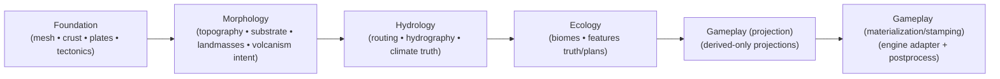
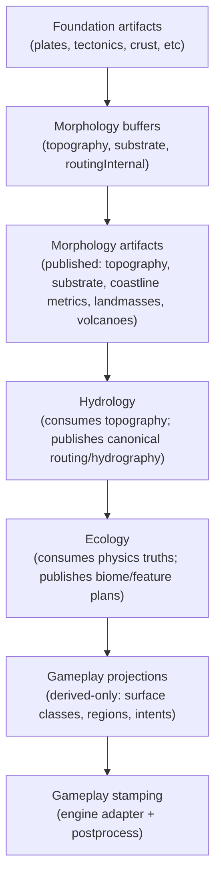

# Morphology Domain Refactor - Phase 2 Modeling Spike (Model-First)

> **PHASE 2 OVERVIEW / NOT CANONICAL**
> Canonical Phase 2 spec surfaces live in `plans/morphology/spec/` and win on conflict.

This spike is the **Phase 2 output** for the Morphology vertical refactor workflow. It defines the target first-principles Morphology model and contract surfaces, based on Phase 0.5 (greenfield) concepts refined by Phase 1 evidence (current state). Its content supersedes earlier drafts and addenda, fully integrating corrections (polar boundary handling, overlay purge, thumb-on-scale removal) into the new canonical spec.

## Goal

Define the **authoritative first-principles Morphology model** (domain causality and outputs) and lock its contract surfaces. If the existing pipeline wiring or legacy behavior conflicts with this model, **the model wins** — resolve conflicts by migrating downstream call sites to the canonical contracts (no compatibility shims).

## Canonical Phase 2 spec surfaces (authoritative)

Phase 2 is canonically specified in the split spec files under `spec/`:

- Pipeline + invariants + freeze points: `spec/PHASE-2-CORE-MODEL-AND-PIPELINE.md`
- Cross-domain contracts (schemas/semantics/lifecycle/determinism): `spec/PHASE-2-CONTRACTS.md`
- Gameplay projections + Civ7 stamping (`artifact:map.*` + `effect:map.*Plotted`): `spec/PHASE-2-MAP-PROJECTIONS-AND-STAMPING.md`

This file remains a Phase 2 overview, narrative spine, and legacy disposition ledger. If any wording here appears to conflict with the `spec/` files, treat the `spec/` files as the canonical contract-locking source of truth.

## Scope guardrails (Phase 2)

- **Model-first only:** This document focuses on the conceptual model and contract closure. It does not contain detailed implementation planning, but it does explicitly model required upstream/downstream deltas so Phase 3 can implement the locked contracts without “reinterpretation”.
- **Canonical model is authoritative:** The model's logic is the single source of truth, even if artifact shapes or names change in implementation.
- **No domain-order reordering:** The canonical domain order remains `Foundation → Morphology → Hydrology → Ecology → Gameplay`. Phase 2 clarifies data dependencies and canonical stage/step rules; it does not justify any downstream→upstream backfeed or braid-shaped causality.
- **No external overlays:** Morphology will not consume any Gameplay/story overlays as inputs. All inputs come from physics domains (Foundation, Environment) and author config - never from story motifs or "protected lanes."
- **No backfeeding into physics:** Gameplay can only consume Morphology outputs (read-only); it cannot influence Morphology's physics generation in this model.
- **Topology lock (Civ7 canonical):** The map **always wraps east–west** and **never wraps north–south**. Wrap is not an environment/config option and must not appear as an optional input knob; all adjacency, distance, and bbox semantics are cylinder-aware.
- **No projection artifacts in physics truth:** physics domains publish physics truths only (pure-only; no engine coupling). Gameplay owns all game-facing projections/indices (terrain IDs, feature IDs, resource IDs, player IDs, region IDs, tags, placements) and the pure projection logic to compute them from physics truths. Engine stamping happens only in recipe stages/steps with an engine adapter.
- **No contract-level unknowns:** Phase 2 locks ownership, schemas, semantics, lifecycles/freeze points, determinism/tie-breakers, and Civ7 stamping/materialization contracts. Only micro-level internal numeric method choices may be deferred (and only when they do not change public contract shapes or semantics).
- **No compat shims:** We do not introduce “temporary compat” surfaces or shims (in Morphology or elsewhere) as a design pattern. If legacy call sites conflict with this model, they must be migrated to the canonical contracts directly.
- **Every existing feature classified:** Every config property, rule/policy, and function from the current Morphology is explicitly marked **keep**, **migrate**, or **kill** in this spec (legacy disposition ledger).

## Canonical pipeline topology (stages, freeze points, rules)

The canonical MapGen pipeline is a **linear, stage-ordered truth production system**:

`Foundation → Morphology → Hydrology → Ecology → Gameplay (projection) → Gameplay (materialization/stamping)`

**Stage lifecycle (first-class contract semantics):**
- **Build phase (mutable, internal):** steps may mutate stage-owned working buffers.
- **Freeze point (stage boundary):** stage outputs become immutable truth (for physics) or immutable derived projections (for Gameplay projection).
- **Consumption phase (downstream):** downstream stages may read prior frozen outputs; they may not mutate them.

**Canonical freeze points:**
- **F1 — after Foundation:** tectonic drivers/macrostructure are frozen.
- **F2 — after Morphology:** morphology truth (topography/substrate/coastline metrics/landmasses/volcanism intent) is frozen.
- **F3 — after Hydrology:** hydrology truth (canonical routing/hydrography/climate surfaces) is frozen.
- **F4 — after Ecology:** ecology truth (biome/feature plans) is frozen.
- **F5 — after Gameplay materialization:** Civ7 engine terrain/materialization + required engine postprocess is complete.

**Stage/step rules (governing constraints, not just “operations”):**
- **No downstream backfeeding:** nothing downstream can influence physics computations.
- **Hard ban: overlays as physics inputs:** no story/narrative/gameplay masks influence physics, even indirectly.
- **Truth vs projection:** physics artifacts are physics truths; projection artifacts (terrain IDs, region IDs, tags, placements) are Gameplay-owned derived-only outputs.
- **Purity:** physics stages and Gameplay projection are pure-only (no engine reads/writes). Engine stamping/materialization happens only in adapter steps.
- **Topology lock:** wrap east–west is always on; wrap north–south is always off; there is no “wrap flag” input.

## Authority stack (canonical vs supporting references)

### Canonical (within this repo)

- **Morphology domain spec:** docs/system/libs/mapgen/morphology.md - Defines Morphology's responsibilities, inputs, outputs, and causal model (will be updated per this spec).
- **Cross-domain data model:** docs/system/libs/mapgen/architecture.md - Describes buffers, artifacts, overlays and the relationships between domains.
- **Upstream domain contract:** docs/system/libs/mapgen/foundation.md - Foundation domain outputs (e.g. tectonic forces, crust data) that Morphology consumes, and overall pipeline context.
- **Domain modeling guidelines:** docs/projects/engine-refactor-v1/resources/spec/SPEC-DOMAIN-MODELING-GUIDELINES.md - Rules for ops/steps, ensuring consistency across domain refactors.

### External authority (Civ7 engine constraints to respect for interop, though not shaping our internal model)

- **Civ7 map scripts & data:** The shipped game expects certain outputs to integrate with its systems:
  - Starting positions logic requires identifying "homelands" vs "distant lands" landmasses (see assign-starting-plots.js and map scripts).
  - Engine uses a LandmassRegionId tagging (two slots in base game) for certain rules (resources, age transitions).
  - Example: base game maps.xml defines PlayersLandmass1 and PlayersLandmass2 for each map size, implying two main land groups for player starts. Likewise, ages.xml imposes hemisphere-based restrictions tied to landmass grouping.
  - Map generation finalization calls engine hooks (e.g. TerrainBuilder.validateAndFixTerrain()) to ensure coherent terrain and continent tags after generation.
- **Civ7 config semantics:** The standard config includes a _DistantLands_ map size domain, meaning scenarios where only one landmass hosts human players. Our model must support this via outputs (landmass identification) rather than custom generation hacks.
- **Engine compatibility:** We must output terrain in a form that engine expects (e.g. contiguous landmass definitions, coastline markings) so that engine post-processes (like area recalculations, fertility recompute) do not "fight" the generation.

### Supporting references (informative, not canonical for our contracts)

_(These external requirements constrain what Morphology must ultimately provide or avoid, but they do not dictate the internal physics model. If a legacy game expectation conflicts with physics-first modeling, we prefer to meet it by translating our outputs downstream or adjusting config, not by warping the model itself.)_

- **Earth physics synthesis:** docs/system/libs/mapgen/research/SPIKE-synthesis-earth-physics-systems-swooper-engine.md - Earth geomorphology principles used as inspiration for the model.
- **Civ7 mapgen feature inventory:** docs/system/libs/mapgen/research/SPIKE-civ7-map-generation-features.md - Inventory of features and patterns observed in Civ7 map generation (for evidence and idea seeding).
- **Gameplay touchpoints:** docs/system/libs/mapgen/research/SPIKE-gameplay-mapgen-touchpoints.md - Analysis of where gameplay systems (e.g. resources, AI, victory conditions) intersect with map generation outputs (to ensure we provide necessary signals).
- **External geomorphology sources:** Real-world geomorphology and plate tectonics references (textbooks, research papers) were consulted for grounding. External citations are included in context below where relevant.

## Locked modeling principle (physics-first sculptor)

### Morphology is the "sculptor" layer of world generation

- _Upstream (Foundation)_ provides the **tectonic canvas** - plate configurations, motion vectors, crust composition, and force fields (uplift, rifting, shear, volcanism).
- _Morphology_ then converts those tectonic causes and geologic histories into a **topographical reality**: the land-sea distribution, terrain elevation, mountains and basins, coastal forms, and other geomorphic signals that downstream systems can use.
- _Downstream systems_ (Hydrology, Ecology, Gameplay) consume Morphology's outputs to simulate climate, biomes, resources, and scenario/game-facing interpretations, but **do not feed back into Morphology**. Morphology owns the meaning of its outputs in the pipeline.

### Key postures

- **Physics-only causality:** Morphology's terrain formation is driven purely by physics-based inputs (tectonics, crust, environment) and internal rules. Any "story" or gameplay requirements (e.g. ensuring two separate continents for distant start positions) must be achieved _through physical parameters or downstream interpretation_, not by hard-coding terrain edits or reading narrative overlays. If a downstream requirement still exists (e.g. needing a "west vs east continent" distinction), that is handled as a **downstream projection** derived from Morphology's outputs - it does _not_ alter Morphology's generative process.
- **Model wins over legacy:** If the legacy pipeline had a certain behavior that doesn't fit the new model (for example, abrupt plate boundary artifacts at the map edge, or manually protected sea lanes), we favor the new model. Legacy content and downstream call sites must migrate to the canonical contracts; we do not preserve mismatched legacy behaviors via “temporary compat shims.”
- **No "thumb on scale" tweaks:** We eliminate any ad-hoc terrain tweaks that were previously used to force desired outcomes (e.g. manually keeping an ocean channel open). Instead, broad outcomes emerge from tuned physical parameters:
  - _Example:_ Want two large landmasses separated by ocean? - Use Foundation config to produce that plate layout (e.g. fewer, clustered continental plates in a dispersal phase). Morphology will naturally produce an ocean basin between them, and Gameplay can then identify the landmasses as needed. Morphology itself will **not** artificially dig or preserve a "sea lane."
- **Explicit config, no hidden constants:** Any parameter that influences terrain generation must be either an explicit author-facing knob or a documented internal constant with clear intent. The model will not rely on unnamed magic numbers or undeclared default behaviors. Configuration uses a _normalize then apply_ pattern with no "presence-based" conditionals (see Config Semantics section).

## Canonical model and causality spine (Morphology)

### Model statement (executive summary)

Morphology converts tectonic potential and geologic context into a **realistic, playable landscape**. It takes the abstract outputs of Foundation (plates, motions, crust properties) and yields concrete physical geography: continents and oceans, mountains and valleys, coastlines and river basins. It does this via a **geomorphic process simulation** - integrating uplift to build mountains, applying erosion and sedimentation to shape valleys and plains, and determining sea level to define coasts. The model is deterministic (given the same inputs and seed) and **physics-first**: every feature is a consequence of tectonics, material properties, or process mechanics, not arbitrary placement. Morphology's outputs are the _ground truth_ for downstream domains like climate and biomes. Notably, Morphology **does not incorporate any gameplay storytelling layers** - e.g. no "magic" placement of mountain ranges or guaranteed navigation corridors. Those kinds of narrative constructs, if needed, will either emerge naturally from physical inputs or be handled by downstream interpretation of Morphology's results. Morphology's role is to ensure the world's physical shape is coherent and causally believable as a basis for everything that follows.

### 3.1 Canonical state (conceptual data model)

Morphology's internal state is defined by a set of **tile-indexed buffers** representing topography and related geophysical properties. These buffers are the authoritative representation of the world's physical shape as Morphology computes it - they are mutable during Morphology's steps and constitute the "truth" that downstream systems ultimately read (usually via finalized artifacts). Conceptually, the key state includes:

```ts
type TileIndex = number; // tile indices (i = y * width + x), flat array indexing

interface MorphologyTopographyBuffers {
  elevation: Float32Array; // Elevation (height above datum) per tile
  bathymetry: Float32Array; // Depth below datum per tile (0 for land; <=0 for water tiles)
  landMask: Uint8Array; // Land/sea flag per tile (1 = land, 0 = water), derived from elevation vs seaLevel
  seaLevel: number; // The global sea level value (height threshold separating land and water)
  slope?: Float32Array; // (Optional) Slope magnitude per tile (derived from elevation)
  ruggedness?: Float32Array; // (Optional) Terrain ruggedness index per tile (derived metric for e.g. movement cost scaling)
  distanceToCoast?: Uint16Array; // (Optional) Distance in tiles to nearest coast (0 at coastal tiles)
}

interface MorphologySubstrateBuffers {
  erodibilityK: Float32Array; // Erodibility coefficient per tile (resistance to erosion)
  sedimentDepth: Float32Array; // Sediment layer thickness per tile (accumulated loose material)
}

interface MorphologyRoutingBuffers {
  flowDir: Int32Array; // Downhill neighbor index for water flow (steepest descent, or -1 if none)
  flowAccum: Float32Array; // Flow accumulation (drainage area proxy) per tile (e.g. number of upstream tiles or relative catchment size)
  basinId?: Int32Array; // (Optional) Drainage basin identifiers, if needed for marking distinct basins or lake catchments
}

interface MorphologyLandmassModel {
  landmasses: Array<{
    id: number;
    tileCount: number;
    // Cylindrical (wrapX) semantics:
    // - `south..north` are conventional (no wrapY).
    // - `west..east` encodes an interval on a cylinder:
    //   - if `west <= east`, bbox covers x ∈ [west, east]
    //   - if `west > east`, bbox wraps across the seam and covers x ∈ [west, width-1] ∪ [0, east]
    // BBox is computed as the minimum-width interval on the cylinder that contains all land tiles in the landmass.
    bbox: { west: number; east: number; south: number; north: number };
    coastlineLength: number;
    shelfShare?: number; // (Optional) fraction of coastline that is shallow shelf, if bathymetry modeled
  }>;
}
```

**Notes:**

- _Topography buffers:_ These hold the primary terrain height information. If bathymetry is not explicitly modeled, bathymetry buffer may be omitted and ocean depth is implied by negative elevation.
- The landMask is directly derived from comparing elevation to seaLevel. seaLevel is a single value for the world (global sea level) chosen by Morphology based on target land coverage (hypsometry).
- _Substrate buffers:_ represent underlying material properties. erodibilityK is derived from crust composition/age (e.g. weaker sedimentary rock vs strong cratonic rock), and influences how fast terrain erodes. sedimentDepth tracks how much sediment has accumulated on top of bedrock (important for downstream ecology, e.g. fertile floodplains).
- _Routing buffers:_ These describe how water would flow over the surface. flowDir and flowAccum define the drainage network (but note: final river generation occurs in Hydrology; Morphology just provides the raw flow paths). Optionally, basinId can label distinct basins (useful for identifying endorheic basins or isolating separate river systems).
- _Landmass model:_ After terrain is finalized, Morphology identifies discrete landmasses (connected land regions) and computes basic attributes for each (size, bounding box, coastline length, etc.). This is used by downstream systems for gameplay rules (e.g. determining which landmass is "continent 1" vs "2" for starts, resource distribution, etc.), but the landmass identification itself is purely geometric based on the final landMask.

**Non-goals of Morphology's internal model:** We do _not_ encode game-specific classifications like terrain types (plains, hills, mountains in engine terms) or continent names in this canonical state. Those are considered **projections** or annotations added later. For example, classifying a tile as "mountain" for the engine is a downstream step that uses elevation and possibly slope - Morphology itself doesn't store a "mountain flag." Similarly, legacy concepts like west/east hemisphere flags or LandmassRegionId tags are not part of this internal model; if needed, they'll be derived downstream from the landmass data.

### 3.2 Inputs (authoritative upstream facts)

Morphology consumes only upstream data from physics domains (plus basic environment settings and author config). These inputs are **owned by upstream stages** - Morphology does not redefine or override them, it only reads them. They include:

- **Tectonic driver fields (from Foundation):** A set of quantitative fields describing tectonic forces and context at each location. At minimum:
  - _Uplift/compression potential:_ where crust is being pushed upward (mountain-building potential).
  - _Extension/rift potential:_ where crust is pulling apart (rift or basin potential).
  - _Shear/transform indicators:_ where plates are sliding, causing faulting.
  - _Volcanism/melt potential:_ where mantle melt or subduction volatility is present (plume locations, subduction arcs, rift magma) - often derived from plate boundaries and hotspots. In the model, this is expressed as a **melt flux field** (e.g. meltFlux per tile) representing magma supply intensity.
  - _Cumulative uplift history:_ a longer-term signal of total tectonic uplift (areas that have been raised over geologic time, providing a baseline elevation prior to erosion).
- **Material properties (from Foundation):**
  - _Crust type:_ e.g. continental vs oceanic crust, with variations like young volcanic crust vs ancient shield. This informs elevation baseline (isostasy) and erodibility.
  - _Crust age:_ older crust tends to be lower (ocean floor subsides as it ages) and more stable; younger crust can be hotter, higher, and often more topographically varied.
- **Plate geometry context (from Foundation):**
  - Plate boundaries and their types (convergent/divergent/transform), including proximity to boundaries for each tile.
  - Off-map plate context for map edges: The north and south map edges are treated as potential plate boundaries (see Polar Boundary handling below). Foundation (or a config default) provides a nominal "off-map plate" regime for each polar edge (transform, convergent, or divergent).
- **World geometry and environment (from Env stage):** Basic parameters of the map:
  - Map dimensions (width, height in tiles).
  - **Topology lock (Civ7 canonical):** the map **always wraps east–west** and **never wraps north–south**. Do not model wrap as an environment variable, scenario option, or contract input.
  - Latitude values or rows (for each tile or each map row, used for climate but also to identify polar zones).
  - Any global parameters like world age or sea level preference (if exposed via config or scenario: e.g. a "Young World" vs "Old World" setting that influences erosion level - typically this would adjust erosion intensity or number of cycles).
- **Author config (Morphology-specific settings):** High-level knobs that scenario designers or map scripts can set to influence Morphology's outcomes. These are semantic biases (not direct overrides). For example:
  - Target land percentage or land/ocean ratio (affecting sea level selection).
  - Terrain roughness or "world age" setting (affecting how much erosion/diffusion flattens the world).
  - Possibly toggles like "allow polar mountains" (or simply the polar boundary modes mentioned above, defaulting to a benign setting if not specified).
  - All config values are consumed by Morphology's ops via deterministic normalization (no config option _must_ be provided; defaults are applied such that absence of a field does not alter deterministic behavior). See Config Semantics section for details on defaulting rules (no presence-gating, etc.).

**Important invariant:** _No Gameplay/story overlays are valid inputs to Morphology._ In earlier drafts, there were optional "overlay constraints" (like protected sea-lane masks or hotspot markers) listed as inputs. **Those are now completely disallowed.** Morphology will not read any Gameplay-produced mask or marker - not even as a "data-only" hint. The only inputs are physics-based data and intentional config. This ensures a one-way dependency: physics → Gameplay projections/materialization, with no reverse influence. (Gameplay overlays may exist for storytelling/UI/scenario logic, but they are derived after physics freeze points and never fed into physics.)

### 3.3 Outputs (Morphology products vs projections)

Morphology produces a set of **authoritative outputs** that become part of the world's state passed to downstream domains. These outputs have **owned meaning within Morphology's model** - i.e. Morphology guarantees their semantics and structure. We distinguish these from **projections** or engine-specific representations that are not part of the canonical model but are needed for interfacing with the game.

**Authoritative Morphology outputs (domain-owned, canonical):**

- **Topography buffers:** This includes the final elevation map, the chosen seaLevel value, the landMask, and any derived metrics (like slope or distance-to-coast if computed). These define the physical landscape (terrain height and land/sea distribution). Downstream domains (especially Hydrology and Ecology) will read these extensively.
- **Substrate buffers:** The erodibility and sedimentDepth maps, representing material hardness and soil accumulation. These are critical for Ecology (e.g. fertile soil distribution) and also inform how erosion proceeded.
- **Routing buffers:** Flow direction and accumulation matrices that describe where water flows. These provide the raw river network for Hydrology to turn into actual rivers and lakes.
- **Coastline metrics:** Analytic metrics describing coastal geometry, such as identifiers for coastal tiles, continental shelf extents, or coastal indentation indices. For example, Morphology might output a mask of "coastal shallow water" vs "deep ocean" (shelf vs abyss) or an index of how concave/convex each coastal segment is. These metrics are used by landform planning (islands, reefs), by Hydrology (ocean currents, upwelling zones), and by Gameplay placement/projection (e.g., preferring certain features near complex coastlines).
- **Landmass decomposition:** The list of landmasses (connected land regions) with their properties, as defined in the internal model. This is published as an artifact for any system that needs to reason about distinct landmasses. Notably, **Gameplay uses this to implement “distant lands”/region logic** (e.g., major-region selection for starts/resources) instead of relying on hidden engine heuristics.

**Non-canonical projection outputs (downstream-owned, derived from Morphology):**

These are **not** generated by Morphology in the new model, but they are listed here to clarify how certain legacy needs will be met:

- **"Primary/Secondary Continent" identifiers:** In Civ7's current logic, there was a concept of a "west vs east continent" or primary vs secondary landmass, used for things like splitting players between two land areas. In the refactored pipeline, Morphology simply outputs all landmasses and their sizes/locations; a downstream Gameplay step (or placement logic) will choose which landmass is considered the "distant land" if needed. The engine's LandmassRegionId tags will be assigned at that point as a projection (e.g. the largest landmass gets ID=0, second gets ID=1 for DistantLands mode), using morphology.landmasses as input.
- **Hemisphere or region masks for ages:** Similarly, any scenario-specific classification like "Old World vs New World hemispheres" (e.g. some Ages in Civ7 restrict certain content to one hemisphere) will be derived from the landmass data combined with latitude - not baked into Morphology's generation. For instance, a script can take landmasses and label those predominantly in the north as one group.
- **Discrete terrain types (mountain/hill/flat labels):** Morphology doesn't output engine terrain IDs. Instead, Gameplay projection/stamping translates continuous elevation/slope fields into discrete surface classes and engine terrain types. For example, if a tile’s elevation and neighbors meet certain criteria, Gameplay will stamp it as a mountain terrain in-game. By keeping this separation, we avoid Morphology being tied to any particular game's terrain type taxonomy.
- **Volcanic hotspot markers:** The legacy pipeline had Morphology directly publishing a "HOTSPOTS overlay" (marking volcanic hotspot locations). In the new model, Morphology does not output a hotspots overlay at all. Instead, Foundation provides melt/plume drivers, Morphology publishes volcanism intent (`artifact:morphology.volcanoes`), and Gameplay may generate a visual “hotspot” overlay downstream for scenario/UI/AI purposes. Morphology itself remains overlay-free.

In summary, Morphology's outputs are all **physical world data**. Anything that exists purely for gameplay semantics or engine formality (like special tags or IDs) is handled as a projection outside the Morphology domain. This clean separation ensures Morphology's algorithms remain focused on simulating geology and geomorphology, without being contorted to satisfy gameplay constraints. Downstream systems will adapt to Morphology, not vice versa.

### 3.4 Causality spine (conceptual sequence of Morphology)

The Morphology model can be thought of as a sequence of dependent processes - each step answers a question "what is determined _before_ what?" in building the world. This causality spine guides how we break down operations and in what order they must execute. The conceptual chain is:

1. **Substrate mapping (lithology)**
   - **Purpose:** Determine the material properties of the crust across the map.
   - **Input:** Foundation's crust composition (rock type, age) and tectonic regime signals (e.g. identify which tiles are near plate boundaries, and of what type).
   - **Output:** An `erodibilityK` map (and any other substrate parameters, like initial sediment thickness patterns).
   - **Notes:** Here, we also classify tectonic regimes per tile - including treating the **north/south map edges as boundary segments** according to config. That means, for example, if the north edge is set as a convergent boundary, tiles along the top edge will be flagged in a "convergent boundary zone" regime. This regime map influences substrate (e.g. making convergent zones have harder rock, transform zones more fractured). Essentially, this step lays down where the world is strong vs weak, which will later influence erosion and volcano placement.
2. **Base topography (raw elevation)**
   - **Purpose:** Generate the initial elevation field from tectonics.
   - **Input:** Tectonic driver fields (uplift, rifting, etc.) and cumulative uplift history.
   - **Output:** A first-pass topography (elevation) and tentative bathymetry.
   - **Notes:** This is where mountains are raised and rift valleys sunk _before_ any erosion. We apply plate boundary effects: e.g. convergent boundaries produce mountain ranges (with maximum uplift right at the boundary if continental, or perhaps an ocean trench and an offshore island arc if one side is oceanic). Divergent boundaries produce rift valleys or mid-ocean ridges; transform boundaries produce linear fault-aligned features (small ridges and basins). Notably, if a polar edge is defined as a boundary (from step 1), we apply corresponding edge effects here too. For instance, a convergent north edge will generate a mountain chain along the map's top border, whereas a transform edge will generate a lower, fractured terrain seam instead of an abrupt wall. The result of this step is a rough heightmap "block" reflecting tectonic forces, without any smoothing or sea level applied.
3. **Sea level & land definition**
   - **Purpose:** Decide how high the oceans are (or equivalently, how much of the land is submerged).
   - **Input:** The preliminary elevation field from step 2, plus config targets (desired land percentage, etc.).
   - **Output:** A scalar seaLevel value and the binary landMask.
   - **Notes:** This involves hypsometric analysis - we consider the elevation distribution and choose a sea level that yields the intended proportion of land vs water. We might also incorporate crust context (e.g. ensure most continental crust ends up above sea, most oceanic below) and possibly a bit of randomness or variation by world age. **No special cases or masks** are applied here - e.g. there is no "force this particular corridor to be ocean." It's a global decision possibly with some bias (like avoiding drowning all continents or leaving huge shallow seas if config indicates). Once seaLevel is set, we label all tiles as land (elevation > seaLevel) or water (elevation <= seaLevel).
4. **Coastline and shelf structuring**
   - **Purpose:** Refine coastal areas and derive coastal metrics.
   - **Input:** Landmask and raw elevation/bathymetry; substrate info.
   - **Output:** Coastal adjustments in elevation (if any) and computed coastline metrics (distance-to-coast values, identification of shallow continental shelf vs deep ocean, coastal slope profiles, etc.).
   - **Notes:** We ensure that there are no one-tile unnatural cliffs at coasts - any steep boundary from land to deep ocean should be smoothed by a continental shelf if appropriate (especially around large landmasses). This step might slightly adjust bathymetry to create realistic continental shelves (shallower seas near coasts, then dropping off). It also computes data used later for island placement (e.g. where shallow water areas could allow reef islands) and for hydrology (coastal upwelling zones if needed). **Importantly, no "protected sea lane" or other corridor enforcement is done** - coast structuring is a purely physical process (e.g. wave erosion and sediment forming shelves), not guided by narrative concerns.
5. **River routing (flow computation)**
   - **Purpose:** Determine how water would flow over the current terrain.
   - **Input:** The current elevation field (after any coastal shaping) and landMask.
   - **Output:** flowDir and flowAccum buffers (and possibly identification of basins).
   - **Notes:** This uses a steepest-descent algorithm to assign each land tile a downslope neighbor (or mark it as a local low if it has no lower neighbor). Then it calculates accumulation (how many tiles or what area drains through each tile). This defines where water would flow and how large catchments are. We perform this at this stage because the next step (erosion) uses the flow information. These routing primitives are **internal-only**; Hydrology later derives and publishes canonical routing/hydrography from the frozen topography truth.
6. **Geomorphic shaping (erosion & deposition cycles)**
   - **Purpose:** Sculpt the terrain by simulating erosion, sediment transport, and deposition, possibly in multiple "eras."
   - **Input:** Elevation, flow directions & accumulation, substrate erodibility, initial sediment.
   - **Output:** Updated elevation (elevation is modified in-place), updated sedimentDepth (sediment may move or increase), and possibly updated buffers like slope if recalculated.
   - **Notes:** This is essentially running a **fluvial incision and hillslope diffusion** process. High-flow areas (rivers) will cut down the elevation depending on erodibility (stream power law - channels deepen in proportion to water flow and rock softness), forming valleys. Steep slopes will diffuse (collapse or gradually smooth) based on a threshold, rounding off sharp peaks. Eroded material is deposited in low-energy areas: e.g. at river mouths, in basins, or in shallow coastal areas, increasing sedimentDepth and raising those areas slightly. We may repeat this in a few iterations (representing geologic time periods) to achieve a mature landscape. By the end, we have a plausible heightmap with valleys, hills, and plains shaped by erosion. World age config might control how aggressive this is (e.g. an "Old" world might run more cycles to heavily erode mountains, a "Young" world runs fewer, leaving sharper terrain).
7. **Landform accents (discrete features)**
   - **Purpose:** Plan and apply specific discrete terrain features that are not fully accounted for by the continuous erosion model.
   - **Input:** A variety of signals - _coastline metrics_ (for islands), _tectonic regimes & melt flux_ (for volcanoes), _topography_ (for ridges/foothills placement).
   - **Output:** Adjustments to elevation and possibly new small land pieces (islands), plus a frozen volcanism intent artifact (`artifact:morphology.volcanoes`) describing volcano locations deterministically.
   - **Sub-actions:** This involves several sub-actions:
     - **Island chain formation:** Identify where isolated islands or archipelagos should exist, typically above mantle plumes (hotspots) or along certain shallow coasts. Using the meltFlux (hotspot/plume signal from Foundation) and coastal shelf info, we might raise some underwater areas to just above sea level to create volcanic island chains (e.g. a plume under an oceanic plate results in a Hawaii-like chain). These changes affect the landMask (new land tiles).
     - **Mountain ridge extensions and foothills:** Add smaller-scale relief that wasn't captured explicitly in the base topography. For example, along major mountain ranges, add secondary ridge spurs and foothills to avoid perfectly smooth Gaussian ranges. Or, in broad flat areas, introduce minor escarpments if tectonics suggest fault lines. These are subtle edits to elevation guided by tectonic detail.
     - **Volcano placement:** Determine specific volcano peak locations for downstream stamping/gameplay use. Using the meltFlux and tectonic regime, pick tiles (usually at peaks or along rift zones) to be volcano "vents." Morphology may slightly raise these tiles and must publish the result as `artifact:morphology.volcanoes` (the engine feature is stamped downstream in Gameplay). No external "volcano overlay input" is used - this is purely based on physical signals like convergent subduction zones (arc volcano chains inland of coasts), divergent rifts (rift volcanoes), or hotspots (intra-plate volcanoes).
   - **Notes:**
     - All these landform accents are deterministic and based on physical criteria. We explicitly do **not** use any Gameplay/story overlays or “story seeds” to decide where they go. (If scenario design wants to ensure a named volcano exists, that is handled by selecting and labeling one of the physics-generated volcanoes downstream in Gameplay, not by forcing Morphology to place a volcano at a specific spot.)
     - These edits can create new land (islands) or raise existing land in places (volcano peaks). We ensure they are integrated smoothly (e.g. an island appears as a natural extension of a seamount chain, not a random one-tile bump).
8. **Landmass decomposition**
   - **Purpose:** Identify connected land regions from the final landMask and calculate their attributes.
   - **Input:** Final landMask (after islands added, etc.), possibly using the routing graph to ensure diagonal connections as needed.
   - **Output:** morphology.landmasses artifact containing the list of landmasses with their stats.
   - **Notes:** This step doesn't change the map; it's an analysis pass. We compute properties like each landmass's tile count (area), bounding box, coastline length, maybe fraction of tiles that are "shallow coast" vs inland (shelf share) to help Gameplay decisions. The landmass list is then published for downstream use. At this point, Morphology's job is essentially done - the physical world is built and described. Downstream systems (Hydrology, Ecology, etc.) will take over to simulate their aspects on this world.

This spine represents the conceptual _causal order_. It also maps closely to how we will implement the pipeline (each numbered item corresponds to one or more ops, see Target Op Catalog). Note that some steps could be grouped or subdivided in implementation for efficiency, but the dependencies remain as above. For instance, steps 4 and 5 (coastline metrics and routing) could technically be computed in either order since they don't strongly depend on each other (one could do routing then compute distance-to-coast, or vice versa) - but we chose to list coastline structuring first, so that if any slight elevation tweaks at coasts occur, routing uses the updated elevation. In practice, this ordering ensures rivers know about any low coastal plains or newly formed straits.

**Polar boundary integration:** A special call-out in this spine is how we treat the north/south map edges. In legacy maps, those edges were often flat and unnatural because tectonics "stopped" at the border. Our model changes that - if configured, the edge acts like a real plate boundary. Conceptually:

- In step 1, we classify edge tiles as boundary zone tiles (with a regime: transform, convergent, or divergent).
- In step 2, those edge zones are given tectonic behavior consistent with their regime: e.g. _transform edge_ → introduce a linear shear fault zone with modest offset and no large wall; _convergent edge_ → push up a mountain ridge along the border (and possibly a trench just off the border on the ocean side); _divergent edge_ → create a rift-like depression or marginal sea at the border, maybe with a shallow ridge if oceanic.
- In subsequent steps, erosion and routing treat the map edge just like any other active region - water can flow off the edge as if going to an ocean beyond (we implement a "virtual off-map sink" so that rivers don't just stop at the world end). The result is that the polar areas of the map won't be featureless or weirdly cut-off; they'll look like the world logically continues beyond the border. For example, a convergent south edge might look like a mountain range at the bottom of the map, suggesting land continues beyond; a divergent north edge might have a rift valley that implies an opening sea beyond the map.

We consider the above spine as the **immutable model order** - any deviation or shortcut must be justified. For instance, one might ask: could we do erosion earlier? The answer is no, because we need sea level set and initial rivers to know how erosion proceeds. Could we place islands before erosion? We choose not to, because erosion might change the context (however, one could argue minor order tweaks, but we lock this order for clarity and consistency).

## 4) Conceptual narrative (the "vision" of the world)

In plain language, Morphology is where the map stops being an abstract plate model and becomes a recognizable world. It's the stage at which a player could look at the heightmap and see **a story of geology**:

- **Convergent margins** become dramatic ranges - long mountain arcs often near coasts, with asymmetric profiles (gentler slopes on one side, steep drop on the other) and foothills that taper into the interiors. These areas tell the story of colliding plates uplifting crust into mountains.
- **Divergent rifts** become great valleys or even new seas - you might see inland rift valleys that could fill with water, flanked by volcanic ridges, or if it's an oceanic rift, a mid-ocean ridge with a shallow seafloor along a line and deeper ocean further away. These features indicate where the world is pulling apart.
- **Transform faults** (including any configured at the map edges) appear as **linear scar zones** - perhaps a string of rugged hills and depressions marking where crust shears. They don't create continuous walls; instead you see a jagged seam across terrain, maybe with offset river courses following the fault line.
- **Ancient cratons** (very old stable continental interiors) become broad, mostly flat regions - but not boring flat. They have stubborn highlands or mesas that erosion couldn't fully wear down (representing extremely hard rock), leading to isolated mountains or ranges in otherwise plain-like areas.
- **Sedimentary basins** turn into fertile lowlands and deltas. Where erosion has deposited deep sediment (high sedimentDepth), we get flat river valleys and broad floodplains - areas that downstream Ecology will likely mark as fertile farmlands or lush regions. Large deltas might appear at river mouths where sediment built up.
- **Polar edges** (if treated as active boundaries) become natural-looking map termini:
  - A _transform_ polar boundary yields a rugged, shattered polar rim - not a sheer cliff, but a zone of faults, small basins, and offset mini-ridges that imply a huge off-map plate grinding past.
  - A _convergent_ polar boundary produces a **polar mountain range** or uplifted plateau at the edge, possibly with a trench just off the map if ocean meets that edge. It feels like the map edge is part of a greater mountain chain extending beyond.
  - A _divergent_ polar boundary creates a polar depression or sea - perhaps a chain of rift lakes or a new narrow ocean at the map's end, with signs of volcanic activity (analogous to how the Red Sea or Great Rift Valley behaves).
- **Volcanic hotspots** manifest as island chains or isolated volcano peaks. For example, one might see a line of islands tracing the movement of a plate over a plume (like a mini Hawaii), or a cluster of volcanoes inland near a convergent margin (like the Pacific Ring of Fire pattern) - these are directly driven by the meltFlux input and tectonic context, not by random or story-placed events.
- **Erosion tells time:** an older world (if config/world age says "Old") will show more gentle hills and vast sedimentary basins, fewer jagged peaks. A younger world will have crisper mountain ranges and thinner sediment in valleys. This difference emerges naturally from running more or fewer erosion cycles.

Overall, the **artistic goal** of Morphology is not to produce a perfectly Earth-like map, but a _coherent_ one. A player looking at the map should be able to infer "oh, these mountains likely block rain, hence desert beyond" or "that river probably carved this valley." We aim for:

- Believable **chokepoints and passes** in mountain ranges (the ranges aren't impenetrable walls without any valleys).
- **Legible river networks** - major rivers flow from mountains to sea in sensible paths, with branching tributaries (thanks to the routing algorithm).
- **Plausible coastlines** - not random fractals or boring straight lines, but shapes that suggest real processes (e.g. indented bays near mountains, large deltas where big rivers meet the sea, smooth expansive continental shelves in some areas).
- **A substrate foundation** for ecosystems - the map is physically ready for the climate and biomes steps, meaning things like rain shadows, floodplains, and mountain ranges for orographic rainfall are all where you'd expect. Also, the sedimentDepth map hints at where fertile soils or floodplains will be (deep sediment in lowlands), which Ecology can use for biome placement.

The **gameplay goal** for Morphology's output is that it provides a flexible yet solid stage for game rules:

- The map can accommodate a "Homelands vs Distant Lands" setup (e.g. two distinct large landmasses) **without Morphology explicitly forcing it**. If the scenario calls for it, it will be achieved by using the landmass artifact (to pick which continents are which) and foundation's control of initial plate clustering. Morphology itself does not contain a "make two continents" switch, but it doesn't preclude two continents either - it's driven by the inputs.
- Rivers and lakes (though final placement is done by Hydrology) should have viable paths pre-laid. That means Morphology's routing ensures water has places to go; no giant completely enclosed depressions with unrealistic outcomes (unless intended, like endorheic basins). This is important so that when Hydrology runs, it can create continuous rivers and avoid weird artifacts.
- Natural barriers (mountains, water bodies) and funnels are present to inform strategic gameplay. E.g. continents separated by oceans create naval play; mountain ranges create strategic chokes on land; large rivers might impede movement without bridges, etc. We ensure these features arise from the model in a balanced way (which the game can further tune via config if needed).
- Crucially, **gameplay constraints do not boomerang back** into Morphology. For instance, if a game mode required every player to start on the same landmass, we would **not** change Morphology to generate only one continent - instead, we'd let Morphology possibly generate multiple continents and simply place all players on one via placement logic. This one-way flow keeps the model robust.

In essence, Morphology's world is rich enough for gameplay to thrive on, but it's also self-consistent - it feels like a natural world first and a game map second.

## 5) Diagrams (architecture, data-flow, producer/consumer)

### 5.1 Architecture view (canonical stages; no braid)



_Interpretation:_ The canonical pipeline has **no Narrative/Placement domains**. Narrative + Placement responsibilities are absorbed into **Gameplay** (Phase A: read-only w.r.t. physics truths). Any legacy “pre/mid/post” stage splits or narrative-bracketed execution order are treated as implementation details and must not be re-legitimized as canonical architecture.

### 5.2 Data-flow diagram (target data products)



_Explanation:_ This shows the flow of data between domains in the refactored model. Morphology publishes **truth artifacts**. Hydrology and Ecology publish downstream **truth artifacts**. Gameplay publishes derived-only **projection artifacts**, and only then stamps those projections into the Civ7 engine using adapter steps and required engine postprocess phases. There is no overlay-shaped input into physics domains.

### 5.3 Producer/consumer adjustments (Current vs Target)

```mermaid
flowchart LR
subgraph Current (Legacy)
C1["engine effect tags:<br/>TerrainBuilder.landmassApplied<br/>(used as continent divider)"]
C2["engine effect tags:<br/>TerrainBuilder.coastlinesApplied<br/>(used for resource spawn gating)"]
C3["StandardRuntime hidden coupling:<br/>westContinent/eastContinent flags<br/>(internally decides LandmassRegionId)"]
C4["Morphology outputs HOTSPOTS overlay<br/>(misused as upstream data)"]
end

subgraph Target (Refactored)
T1["artifact:morphology.topography<br/>(buffer handle, published once)"]
T2["artifact:morphology.coastlineMetrics<br/>(explicit coastal metrics)"]
T3["artifact:morphology.landmasses<br/>(connected components with IDs and stats)"]
T4["overlay:gameplay.volcanicHotspots<br/>(derived from Foundation & Morphology outputs; Gameplay-owned)"]
T5["artifact:map.landmassRegionSlotByTile<br/>(derived-only; stamped via TerrainBuilder.setLandmassRegionId)"]
end

C1 --> T1
C2 --> T2
C3 --> T3
C3 --> T5
C4 --> T4
```

In the legacy system (left), certain engine "effect tags" and hidden conventions acted as couplings:
- C1/C2: The engine would tag when it applied continents or coastlines, and those tags were indirectly used by other systems (resources, etc.). We replace those with explicit artifacts (T1: topography artifact can serve as a gating for anything needing terrain, T2: coastline metrics artifact for anything needing to know about coasts).
- C3: There was a hidden notion of westContinent/eastContinent that the runtime used to assign LandmassRegionId and to decide distant land starts. We eliminate that hidden coupling by providing explicit landmass data (T3) and leaving the decision of which landmass is "primary" vs "secondary" to a clear downstream selection, which then writes to a gameplay buffer or mapping (T5) that tags each tile's landmass with a region ID if needed.
- C4: Morphology previously published a HOTSPOTS overlay directly (e.g. marking hotspot locations), which was actually a tectonic concept. In the new model, that is moved out: Gameplay will produce a "volcanicHotspots" overlay for game use as a derived projection, grounded in physical signals (T4), and Morphology itself does not output it.

**Target posture summary:** We replace implicit or hard-coded communications with explicit data contracts:

- Terrain features are communicated via artifacts/buffers rather than engine flags.
- Legacy hidden logic (like assuming exactly two continents and labeling them in engine) is replaced by Morphology outputting all continents and letting the game explicitly choose how to label them.
- The HOTSPOTS overlay production is removed from Morphology; any such overlay is **Gameplay-owned derived-only** (for UI/scenario/AI) and is based on the same physical data (Foundation melt/plume drivers + Morphology volcanism intent) that Morphology uses internally.
- In short, **Morphology now cleanly provides physical world data, and anything gameplay-specific is a consumer of that data, not an input or intrinsic part of it.**

## 6) Target contract matrix (buffers, artifacts)

This section defines the **target contract surfaces** that Morphology requires or provides. It is closure-grade: Phase 2 locks artifact keys, schemas (required fields + types), units/normalization, lifecycle/freeze points, and determinism/tie-break rules. Implementation work must conform to these contracts; it must not “reinterpret” shapes or semantics later.

### Upstream inputs (from Foundation/Env)

Morphology will consume the following artifacts from upstream stages (produced by Foundation or Environment):

- artifact:foundation.mesh - (Mesh topology and coordinates) The region's graph structure. _Owned by Foundation._ Gives adjacency info and base geometry; needed for routing and diffusion calcs.
- artifact:foundation.plates - (Tile-indexed plate and boundary data) A deterministic, Foundation-owned **derived tile-space view** of mesh-first tectonic truths (plate ids, boundary signals, stress/potential fields, plate motion proxies). Morphology consumes this as the canonical tile view (to avoid re-deriving the same projection math across multiple steps). This is a physics artifact, not a Gameplay `artifact:map.*` projection surface.
- artifact:foundation.tectonics - (Mesh-indexed tectonic force fields) The primary driver signals: uplift rates, extension rates, shear indicators, and melt anomalies per mesh cell. _Canonical output of Foundation._ Morphology uses these to create topography and volcanoes. (This includes what we refer to as meltFlux internally for hotspots and arc volcanism intensity.)
- artifact:foundation.crust - (Mesh-indexed crust material properties) Contains crust type (continental/oceanic) and crust age for each cell. _From Foundation._ Used for isostatic baseline and erodibility mapping.
- Env.width, Env.height, Env.latitude - (Environment parameters) Basic world geometry inputs. Treated as runtime constants from the environment setup. Width/height define tile indexing; topology is fixed (wrap east–west, no wrap north–south); latitude array is used for climate context (though Morphology doesn't do climate, it might pass latitude to Hydrology or use it to decide polar band extent).
- MorphologyConfig - (Author config for Morphology) The configuration object for this domain, after schema defaulting. This includes any user settings like land percentage or world age, polar boundary modes, etc. It's not an "artifact" per se, but a structured input to Morphology's steps. (One can conceptually treat it as an upstream input that comes from recipe config or scenario settings.)

### Morphology outputs (published artifacts)

The following are the products Morphology will publish for downstream consumption. These are generally made available as **artifacts** (immutable snapshots or handles) at the end of Morphology's processing, and in some cases as working **buffers** during:

```yaml
items:
  - name: buffer:morphology.topography
    type: Buffer
    owner: Morphology
    meaning: |
      The master heightfield working buffers (mutable within Morphology only): elevation (+ optional bathymetry),
      landMask, and seaLevel. This is the canonical physics truth for surface shape while Morphology is executing.
    notes: Internal representation may use high-precision buffers; published truth artifacts lock schema/units for downstream consumption.
  - name: artifact:morphology.topography
    type: Artifact
    owner: Morphology
    meaning: |
      Frozen topography truth snapshot (published at F2): elevation (meters), seaLevel (same units),
      landMask (derived by elevation > seaLevel), plus bathymetry (depth below datum).
    notes: Excludes engine/game-facing indices (terrain IDs, cliffs, tags). Tile indexing (`tileIndex`) is allowed in truth artifacts.
  - name: buffer:morphology.substrate
    type: Buffer
    owner: Morphology
    meaning: Substrate property buffers: erodibilityK and sedimentDepth. Describes material resistance and soil depth per tile.
    notes: Mutable during erosion cycles. Not typically needed outside Morphology except by Ecology.
  - name: artifact:morphology.substrate
    type: Artifact
    owner: Morphology
    meaning: Handle to substrate buffers for downstream. Ecology will use this (e.g. sedimentDepth for fertile soil distribution).
    notes: Published at end of Morphology. No legacy equivalent (was internal only).
  - name: buffer:morphology.routingInternal
    type: Buffer
    owner: Morphology
    meaning: Internal-only routing primitives used for geomorphic cycles (erosion/deposition), computed on the cylindrical grid (wrapX seam adjacency; hard N/S edges).
    notes: Not a public contract. Hydrology owns canonical routing/hydrography artifacts.
  - name: artifact:morphology.coastlineMetrics
    type: Artifact
    owner: Morphology
    meaning: |
      Frozen coastal truth metrics snapshot (published at F2): includes coastalLand, coastalWater, distanceToCoast
      (field list is canonical in spec/PHASE-2-CONTRACTS.md).
    notes: Downstream can use these for climate, placement, and projection policies without reverse-engineering engine terrain.
  - name: artifact:morphology.landmasses
    type: Artifact
    owner: Morphology
    meaning: |
      Frozen landmass decomposition (published at F2): landmassIdByTile (dense mapping; -1 for water) and landmasses[]
      with stable IDs, tileCount, coastlineLength, and wrap-aware bbox { west,east,south,north } (west > east encodes a wrapped interval crossing the seam).
    notes: This is the authoritative “continents/landmasses” truth for downstream projection (e.g., LandmassRegionId).
  - name: artifact:morphology.volcanoes
    type: Artifact
    owner: Morphology
    meaning: |
      Frozen volcanism intent snapshot (published at F2): a deterministic list/mask of volcano tiles (and optional kind/strength),
      derived from Foundation melt/plume/subduction drivers (never overlays).
    notes: Gameplay stamps engine volcano features from this intent; physics domains never stamp.
```

### Notes on ownership

All above Morphology artifacts are **owned by Morphology** (Morphology defines schema + semantics) and are read-only to downstream consumers.

Routing ownership is closed: **Hydrology owns canonical routing/hydrography**. Any routing computed inside Morphology is internal-only and must not be treated as a cross-domain contract.

### Contract schemas (locked fields, types, units, indexing)

Phase 2 locks the **shape and semantics** of public artifacts. Implementation may choose internal working precision, but the published schemas below are the canonical cross-domain contracts.

**Indexing (tile-space):**
- All tile arrays are length `width * height` and use `tileIndex = y * width + x`.
- Topology is cylindrical: **wrap east–west always**, **no north–south wrap**. This affects adjacency/distance calculations and bbox semantics, but is not represented as a config/env input knob.

```ts
type TileIndex = number; // tileIndex = y * width + x

interface MorphologyTopographyArtifact {
  // Units: meters relative to a shared datum (consistent across elevation/seaLevel/bathymetry).
  // Storage: typed arrays are canonical for performance and determinism.
  elevation: Int16Array; // meters above datum (land and seafloor)
  seaLevel: number; // meters above datum (global scalar)
  landMask: Uint8Array; // 1 = land, 0 = water (derived by elevation > seaLevel)
  bathymetry: Int16Array; // meters below datum (0 for land; <=0 for water tiles)
}

interface MorphologySubstrateArtifact {
  // `erodibilityK` is a dimensionless or normalized coefficient used by erosion rules (higher = erodes more).
  // `sedimentDepth` units: meters (accumulated loose material thickness).
  erodibilityK: Float32Array;
  sedimentDepth: Float32Array;
}

interface MorphologyCoastlineMetricsArtifact {
  coastalLand: Uint8Array; // 1 if land tile adjacent to water, else 0
  coastalWater: Uint8Array; // 1 if water tile adjacent to land, else 0
  distanceToCoast: Uint16Array; // 0 at coast; otherwise shortest grid distance to nearest coast (wrap-aware in X)
  // Additional coastline geometry metrics may be included (and must be deterministic if published):
  // - shelfMask (u8), concavity/indentation (f32), alongshore segment IDs (i32), etc.
}

interface MorphologyLandmassesArtifact {
  landmassIdByTile: Int32Array; // -1 for water; otherwise stable landmass ID
  landmasses: Array<{
    id: number; // stable ID (see determinism rules)
    tileCount: number;
    coastlineLength: number;
    // Cylindrical bbox semantics (wrapX):
    // - `south..north` are conventional (no wrapY).
    // - `west..east` encodes a shortest-width interval on a cylinder:
    //   - if `west <= east`, bbox covers x ∈ [west, east]
    //   - if `west > east`, bbox wraps across the seam: x ∈ [west, width-1] ∪ [0, east]
    bbox: { west: number; east: number; south: number; north: number };
  }>;
}

interface MorphologyVolcanoesArtifact {
  volcanoMask: Uint8Array; // 1 if volcano vent tile, else 0
  volcanoes: Array<{
    tileIndex: TileIndex;
    // Optional classification for downstream rules (Gameplay, resources, hazards).
    kind?: "subductionArc" | "rift" | "hotspot";
    strength?: number; // normalized intensity (deterministic; no implicit RNG)
  }>;
}
```

### Non-Morphology overlays and projections

Morphology does **not** own any overlays or game-facing projections in the target model. For clarity, we list here some surfaces that exist but are **Gameplay-owned derived-only** outputs:
- `overlay:gameplay.volcanicHotspots` — markers for scenario/UI purposes, derived from Foundation + Morphology truths, **never** fed into physics.
- `overlay:gameplay.mountainPasses` / `overlay:gameplay.rifts` — derived labels computed from physics truths for scenario/UI/AI consumption; they are not Morphology outputs and must not influence physics computation.
- `artifact:map.landmassRegionSlotByTile` — a per-tile projection used to stamp engine `LandmassRegionId` deterministically from `artifact:morphology.landmasses` (Gameplay-owned; see stamping section below).

In essence, the **contract matrix** for Morphology has been cleaned of any story/overlay elements. Morphology takes in physics data and yields physical data. Overlays remain outside of this contract, and legacy engine-specific tags are replaced by our explicit artifacts.

### Gameplay projections & Civ7 materialization (“stamping”) (Phase 2 required)

Even though this is the Morphology Phase 2 modeling spec, Phase 2 must explicitly model the downstream **Gameplay-owned** projection/materialization layer because the product is a Civ7 map.

**Ownership (hard rule):**
- Physics domains (Foundation/Morphology/Hydrology/Ecology) publish physics truths only.
- Gameplay owns **projection logic** (pure ops) and **projection artifacts** (derived-only) that live under a unified `artifact:map.*` namespace.
- Engine stamping/materialization happens only in recipe **steps** that have access to the Civ7 adapter.
- Gameplay-owned stages/steps may be **braided inside** the Morphology phase; this does not change domain ownership (Physics remains truth-only; Gameplay remains projection/stamping-only).

**Gameplay projection artifacts (derived-only; pure):**
At minimum, Gameplay computes:
- `artifact:map.surfaceClassByTile` — symbolic surface class per tile (e.g., `OCEAN | COAST | LAND_FLAT | LAND_HILL | LAND_MOUNTAIN`), derived from frozen physics truths.
- `artifact:map.landmassRegionSlotByTile` — per tile slot assignment (`WEST | EAST | DEFAULT`) for LandmassRegionId stamping (where `DEFAULT` maps to `LandmassRegion.LANDMASS_REGION_DEFAULT`).
- `artifact:map.volcanoIntent` — a projection of `artifact:morphology.volcanoes` into engine-facing intent (e.g., per-tile mask/list to stamp `FEATURE_VOLCANO` deterministically).

These identifiers are a modeling template, not a mandate on how many steps exist. In practice, Gameplay projection/stamping will be decomposed into granular steps aligned with the modeling guidelines (e.g., `plot-mountains`, `plot-volcanoes`, `plot-landmass-regions`, etc.).

**Execution guarantees (locked; no receipts/hashes):**
Downstream steps sometimes need a strict guarantee that stamping occurred (not merely that intent exists). We lock:

- `artifact:map.*` intent artifacts are **published once and frozen** for the relevant pass before stamping begins.
- Each stamping step provides a boolean **effect tag** after successful adapter calls, which downstream steps can require.

Effect naming (locked; short; no version suffixes):
- `effect:map.mountainsPlotted`
- `effect:map.volcanoesPlotted`
- `effect:map.featuresPlotted`
- `effect:map.biomesPlotted`
- `effect:map.landmassRegionsPlotted`

**LandmassRegionId stamping contract (Gameplay-owned; topology-fixed):**
- Inputs: `artifact:morphology.landmasses` + `(width,height)`; topology is fixed (wrap east–west, no wrap north–south); **do not accept wrap flags as inputs**.
- Evidence (base-standard usage): LandmassRegionId is consumed by starts/resources/age-transition scripts (e.g. `.civ7/outputs/resources/Base/modules/base-standard/maps/assign-starting-plots.js`, `.civ7/outputs/resources/Base/modules/base-standard/maps/resource-generator.js`, `.civ7/outputs/resources/Base/modules/base-standard/scripts/age-transition-post-load.js`).
- Engine semantics note (determinism + safety): base-standard uses factor-coded membership checks like `assignedLandmass % landmassRegionId == 0` and treats `LANDMASS_REGION_NONE/DEFAULT/ANY` specially, so stamping must use engine `LandmassRegion.*` constants (no numeric literals) and must not invent ad-hoc region IDs.
- Ordering constraint (engine behavior): if the recipe uses Civ7 coast expansion helpers, LandmassRegionId must be stamped for land/coast first because `expandCoasts(...)` propagates LandmassRegionId onto newly-created coast tiles (see `.civ7/outputs/resources/Base/modules/base-standard/maps/elevation-terrain-generator.js`).
- Deterministic algorithm (canonical):
  1) Select required major landmasses (usually 1 or 2) by descending `tileCount` with deterministic tie-breakers.
  2) Compute each selected landmass’s wrapped `centerX` from its wrap-aware bbox interval (where `west > east` means the interval crosses the seam).
  3) Assign major landmasses to `WEST`/`EAST` slots using `centerX < width/2` as the primary rule, resolving collisions deterministically.
  4) Stamp engine LandmassRegionId via `TerrainBuilder.setLandmassRegionId(x,y, LandmassRegion.*)` for tiles belonging to selected major landmasses; all other tiles are stamped as `LandmassRegion.LANDMASS_REGION_DEFAULT` (and may additionally receive an island tag in Gameplay).

**Civ7 engine materialization/postprocess (evidence-driven; deterministic):**
Gameplay stamping writes engine-facing surfaces (terrain types, features, LandmassRegionId, etc.) and then runs required Civ7 postprocess phases so that downstream systems behave correctly. Base-standard scripts consistently use the pattern:
- `TerrainBuilder.validateAndFixTerrain()` → `AreaBuilder.recalculateAreas()` → `TerrainBuilder.stampContinents()`
- `TerrainBuilder.buildElevation()` (after terrain surface is set)
- `TerrainBuilder.modelRivers()` → `TerrainBuilder.validateAndFixTerrain()` → `TerrainBuilder.defineNamedRivers()`
- `TerrainBuilder.addFloodplains()` → `TerrainBuilder.storeWaterData()`
- `FertilityBuilder.recalculate()` (after terrain/water data is finalized; before/after placement scripts as required by the recipe)

Phase 2 locks that this sequencing is modeled as a first-class pipeline responsibility (Gameplay-owned) and is not hand-waved as “external engine magic”.

Evidence pointers (non-exhaustive; base-standard):
- Terrain/materialization sequencing appears in shipped map scripts like `.civ7/outputs/resources/Base/modules/base-standard/maps/continents-voronoi.js` and `.civ7/outputs/resources/Base/modules/base-standard/maps/archipelago.js`.
- Volcano representation is terrain + feature in base-standard (e.g. `.civ7/outputs/resources/Base/modules/base-standard/maps/volcano-generator.js` sets mountain terrain and stamps the volcano feature).
- Cliffs/elevation are engine-derived (not directly writable): base-standard hill logic queries `GameplayMap.isCliffCrossing(...)` (see `.civ7/outputs/resources/Base/modules/base-standard/maps/elevation-terrain-generator.js`) and our adapter/types do not expose `TerrainBuilder.setElevation` (see `packages/civ7-types/index.d.ts`); alignment constraints are tracked in `docs/system/DEFERRALS.md`.

## 7) Target operation catalog (planned ops and responsibilities)

Based on the causality spine and target contracts, we enumerate the operations Morphology will implement. Each op is a pure, deterministic function (conforming to the project's op interface guidelines) that transforms inputs into outputs. We list them by category:

### 7.1 Core "compute" ops (terrain forming)

These ops produce or modify the fundamental continuous fields (buffers):

- **morphology/compute-substrate** - **Compute** op.
  - _Inputs:_ Foundation crust and tectonic regime data; optional config for substrate.
  - _Function:_ Generates substrate properties like erodibilityK (and possibly an initial sedimentDepth template). Maps crust type/age and boundary proximity to a rock strength. For example, tiles in convergent zones might get lower erodibility (harder rock due to orogeny/metamorphism), transform zones higher erodibility (fractured crust), oceanic crust moderate (basaltic, relatively uniform). This op essentially initializes the buffer:morphology.substrate.
- **morphology/compute-base-topography** - **Compute** op.
  - _Inputs:_ Tectonic driver fields (uplift rates, rift rates, etc.), cumulative uplift, substrate (for any dependence on lithology), and polar boundary config.
  - _Function:_ Synthesizes the initial elevation field. It applies tectonic effects: raising terrain at convergent boundaries (mountain roots), lowering at divergent (rift valleys or initial ocean ridges), adjusting around transform faults (small offsets, avoid big walls). It also sets a baseline elevation difference for continental vs oceanic crust (continents start higher, oceans lower - e.g. continentalHeight and oceanicHeight baseline offsets from config). The output is the first draft of elevation and bathymetry. No erosion or smoothing yet, just raw tectonic shape. Also may populate a preliminary ruggedness or slope map if needed for later use.
- **morphology/compute-sea-level** - **Compute** op.
  - _Inputs:_ The raw elevation field (global distribution) and config targets (desired land percent, etc.). Possibly crust fraction info.
  - _Function:_ Determines the seaLevel. It does this by analyzing the elevation histogram and applying the target land/ocean ratio (e.g. baseWaterPercent from config). It may also consider constraints: for instance, ensure at least X% of continental crust remains above sea (so we don't drown all continents), or small random variation for flavor. The result is a single seaLevel number. It does **not** directly modify elevation; instead, this sets up the threshold for the next op. (In practice, this op might also output some diagnostic like actual land percentage achieved.)
- **morphology/compute-landmask** - **Compute** op.
  - _Inputs:_ Elevation buffer and the chosen seaLevel.
  - _Function:_ Produces the binary landMask (1 for land, 0 for water) by comparing elevation to seaLevel. Also computes distanceToCoast for each tile (distance to nearest land/water boundary) and maybe a coastal adjacency matrix (which tiles border the opposite type). Essentially, this finalizes where the coastline is. It might also assign newly underwater tiles as "coastal shallow" vs "deep ocean" using a depth cutoff (for coastline metrics). Any special rules about land distribution (like making sure not all land is in one cluster) are _not_ enforced here - that's left to Foundation input and downstream usage. This op is straightforward given seaLevel.
- **morphology/compute-coastline-metrics** - **Compute** op.
  - _Inputs:_ LandMask, elevation (with bathymetry), possibly substrate (sediment) for identifying shelves.
  - _Function:_ Derives additional coastal metrics now that land/sea is defined. For each coastal tile or coastal water tile, it measures things like: how deep is the water just off the coast (shelf depth), is the coastline concave or convex (which might indicate bay vs cape), perhaps an "exposure" metric (how open to ocean a coastal tile is vs sheltered in a bay). These metrics feed into landform planning (e.g. island placement may favor certain coastal shapes) and to Hydrology (e.g. upwelling is stronger on certain coasts). This op could also do slight terrain adjustments if needed (e.g. if a config says ensure a continental shelf of at least a configured width, it could raise some shallow ocean tiles or smooth a coastal drop-off).
- **morphology/compute-flow-routing** - **Compute** op.
  - _Inputs:_ Current elevation (after sea level, i.e. land and sea), landMask (to treat ocean as out-of-bounds for river flow).
  - _Function:_ Calculates flowDir and flowAccum. It assigns each land tile's flow direction to the steepest downhill neighbor (using the mesh adjacency - likely considering all 6 neighbors on a hex grid or 8 on a square grid). Then it computes accumulation by doing a topological sort or iterative accumulation of drainage areas. Optionally assigns basinId to tiles that have no outlet (interior basins). The result delineates preliminary river networks. _Note:_ If a tile flows into the ocean or off a **north/south** map edge, we consider that flow "exiting" the map (we implement a virtual sink: off-map beyond north/south edges is treated as sea level outlet). There are no east/west edges (wrap is always on). This prevents polar-edge tiles from being treated as endorheic basins incorrectly.
- **morphology/compute-geomorphic-cycle** - **Compute** op.
  - _Inputs:_ Elevation (current), flowDir & flowAccum (routing), erodibility, config parameters for erosion (world age, etc.). Possibly also seaLevel if needed for baselevel reference.
  - _Function:_ Performs one "era" of erosion and deposition. For each land tile, calculates erosion amount (e.g. using stream power: `erosion = K * A^m * S^n`) where A is flowAccum and S is slope, and deposition in low-slope downstream areas. It updates the elevation buffer (subtracting from higher areas, adding to lower areas where sediment deposits) and updates sedimentDepth accordingly. It likely also does a diffusion (hillslope) pass to simulate landslides smoothing steep slopes. This operation might be run multiple times (or internally looped) to simulate multiple geological eras. The end result is a modified elevation field (more valleys and gentle slopes) and an updated sedimentDepth map. We ensure mass balance (eroded volume ≈ deposited volume, within some loss factor). If multiple iterations: e.g., do 3 cycles for a very old world, 1 for a young world. This op will also consider if any new land was added in step 7 (islands/volcanoes) - in practice, we plan to run this _before_ adding islands and volcanoes, since those are like final touches. (However, one could imagine splitting erosion: e.g. do a big erosion pass, then add volcanoes, then maybe a brief erosion again to soften volcano surroundings. This is a tunable sequence.)
- **morphology/compute-landmasses** - **Compute** op.
  - _Inputs:_ Final landMask (after all terrain modifications are done).
  - _Function:_ Scans the landMask to label connected land components and computes their properties. Uses a flood-fill or union-find on the graph of land tiles. Assigns each landmass a unique ID and calculates tile count, bounding box, coastline length (count of land-water edges), and potentially other metrics like average elevation or shelf size. Outputs the artifact:morphology.landmasses. No effect on other buffers. This op is straightforward but crucial for informing downstream systems of the world's continent structure.

### 7.2 "Plan" ops (discrete feature placement)

Plan ops operate at a more discrete level, planning sets of features (often implemented as making targeted edits or annotations). They rely on the continuous fields but output lists of modifications or markers.

- **morphology/plan-island-chains** - **Plan** op.
  - _Inputs:_ Coastline metrics (shelf info, coastal concavity), Foundation tectonic signals (especially meltFlux for hotspots), possibly plate motion vectors (to align island chains).
  - _Function:_ Decides where to create islands or archipelagos. It looks for conditions like: a strong mantle plume under oceanic crust (meltFlux high in ocean area) - which suggests a hotspot island chain; or very shallow wide shelf areas that could plausibly host islands (like Indonesia-style archipelago). It then formulates a list of "island" features: each with a set of tiles to raise above sea level and perhaps a volcano tag. Islands might be planned as a chain following the plate motion (if plume and motion are known, it can string islands out down-current). The output is a list of island tile coordinates and heights to add. The op doesn't itself modify the elevation buffer (that is applied by a step orchestrator after planning), or it may directly raise them - implementation choice. Importantly, it uses **physics signals only** (plumes, shelves) - no external "desired island here" inputs.
- **morphology/plan-ridges-and-foothills** - **Plan** op.
  - _Inputs:_ Tectonic context (plate boundaries, especially convergent boundaries and transforms), existing elevation.
  - _Function:_ Identifies smaller-scale landform details to add:
    - For major mountain ranges, plan ridge lines and adjacent foothills to make the range less "smooth". For example, at a long convergent range, pick some along-strike segments to emphasize with a ridge crest (if not already highest) and plan lower foothill zones extending outward where appropriate.
    - In transform zones or other linear features, plan elongated ridges or depressions to accentuate fault lines. Essentially, this op is about adding detail that the continuous simulation might miss - like ensuring that mountain ranges have a realistic texture of multiple sub-ridges and that significant fault lines have aligned features.
  - _Output:_ Perhaps a list of ridge line tile sets to raise slightly and foothill tile sets to lower slightly (or mark for some procedural generation of hills). These modifications will be applied to the elevation buffer as minor tweaks to shape the terrain.
- **morphology/plan-volcanoes** - **Plan** op.
  - _Inputs:_ Melt flux signals (from Foundation tectonics - includes plume hotspots and subduction arc melt), tectonic regime map (convergent/divergent context), current topography & coast info.
  - _Function:_ Chooses specific locations for volcanoes. For convergent regimes, it might line up volcanoes just inland of a trench or along a mountain belt (subduction volcano chain); for divergent, along a rift or ridge (rift volcanoes); for hotspots, at the peak of the plume's uplift (often creating a volcanic island or plateau). It uses meltFlux intensity to gauge how many or how large volcanoes to place. The output could be a list of volcano features, each with a position (tile) and maybe a size classification. These could be later translated to engine volcano tags or simply remain as elevated peaks. If Morphology needs to actually raise the terrain at those tiles (to form a volcanic mountain), it will do so (this can be combined with ridge/foothill adjustments). _Note:_ No "hotspot overlay" or external story input is consulted - placement is purely based on physical signals and location (plume under the crust, etc.). The volcano op ensures, for example, that if there's a big subduction zone, we'll get a line of volcanoes parallel to the mountains, or if there's a hotspot, at least one volcano arises at that spot.

Each plan op essentially produces a set of proposed changes or annotations which are then applied to the terrain model. The **difference between compute and plan ops** is that compute ops produce entire fields deterministically (they fill buffers), whereas plan ops pick spots to alter or label. In the pipeline, plan ops typically run after the main compute ops and make small adjustments that don't require recomputing everything from scratch (for example, after adding islands, we might not recompute a full erosion cycle - these islands are usually small enough that it's okay, or if needed, we could do a localized smoothing).

### 7.3 Internal rules (reusable policy units)

These are not top-level operations, but internal logic modules or algorithms that multiple ops use. They don't produce standalone artifacts; instead they ensure consistency and avoid duplicating logic. We list key rule families:

- **Hypsometry & sea-level selection:** Logic for choosing seaLevel based on elevation distribution and config. Includes rules like "target X% land", "if config sets continentalFraction, ensure at least that fraction of map is on continental crust above sea" (which might affect seaLevel), and handling of extreme cases (all high or all low elevation edge cases). This rule family is used in compute-sea-level.
- **Tectonic regime classification:** Logic to classify every tile or plate boundary segment as convergent/divergent/transform (or none) and assign intensities. Foundation provides plate boundary graphs; this rule interprets them for Morphology's use. Also includes the extension to treat polar edges as boundary segments with a chosen regime. Used in compute-substrate (to adjust erodibility by regime) and compute-base-topography (to apply regime-specific uplift/subsidence patterns).
- **Erosion and deposition parameters:** Encapsulates how world age or config translates to number of cycles, values of exponents (m, n in stream power), diffusion constants, etc. Ensures that we don't scatter such parameters in code - they're defined in one place and referenced by compute-geomorphic-cycle. For example, "Old world: 3 cycles, high diffusion constant; New world: 1 cycle, low diffusion" - these are locked here.
- **Volcano selection criteria:** A rule set that given meltFlux field and regime info, decides "this tile qualifies as a volcano site". It might include thresholds of melt needed, distances (volcano spacing), and interplay with existing topography (prefer volcano on a peak or create a peak if flat). This would be used in plan-volcanoes.
- **Island shape generator:** Guidelines for how to shape an island when we decide to place one (e.g. how wide an area to raise, peak height relative to sea level, maybe ensuring a lagoon if it's an atoll scenario). Part of plan-island-chains.
- **Edge boundary tapering:** Ensures any polar boundary effects taper off smoothly into the interior over a configurable band width. Implementation in base-topography and substrate ops likely calls a common function to apply a gradient from the edge inward (so you don't get an abrupt one-tile wide range at the edge).
- **No-overlap guardrails:** If plan ops might interfere (e.g. a volcano could be planned exactly where an island was raised, or ridge plan tries to add a hill where we already have one), there are rules to reconcile them (like volcano placement could detect an island at that tile and just mark it as volcano without double-raising it). These internal checks keep the final result coherent.

_(By design, there is notably_ _no rule for "coast protection masks" or forced ocean corridors_ _- that concept was explicitly removed. In the legacy approach, there might have been a rule like "if a certain mask overlay says keep water here, then ensure landMask = 0 there." All such logic is gone. If the design calls for a guaranteed ocean between major lands, that must come from how Foundation set up the plates, not from a post-hoc rule in Morphology.)_

## 8) Legacy disposition ledger (legacy features: keep, migrate, or kill)

Every element of the current (pre-refactor) Morphology implementation is accounted for here, to ensure we aren't missing anything or carrying forward unwanted baggage. This ledger lists legacy config fields, functions, and patterns, and notes what happens to each in the new model:

### 8.1 Configuration properties (legacy LandmassConfig and related)

The current Morphology (often called "Landmass" in code) has a config schema with various fields. We map each:

- **baseWaterPercent** - **Migrate.** Represents desired water coverage. In new model, it informs compute-sea-level (target land fraction). We will carry it forward as a semantic knob (perhaps renamed to something like targetLandFraction for clarity). Default likely ~71% water (Earth-like) unless overridden.
- **waterScalar** - **Migrate (with adjustment).** This was a secondary scalar affecting water coverage (maybe a way to fine-tune sea level beyond baseWaterPercent). We will interpret it as part of hypsometry selection in compute-sea-level (like a way to bias sea level up or down slightly after baseWaterPercent is applied). Might fold into the above knob or treat as an internal normalization detail.
- **boundaryBias** - **Kill.** Legacy “boundary bias” intent is now handled by Foundation’s plate boundary strategy (including polar boundary interactions). Morphology does not keep a separate knob for it. If authors need to control north/south edge effects, that control lives in Foundation as an explicit polar boundary interaction intensity surface (see Phase 2 contracts; no overlays).
- **boundaryShareTarget** - **Migrate/Review.** Possibly ensured some proportion of land is near plate boundaries. If still relevant, it might factor into compute-sea-level or how we shape distribution (e.g. ensure that land isn't all clumped in center away from boundaries). But this might be an outdated concept. We'll tentatively migrate it as a constraint in sea-level or initial topography (ensuring continents aren't all interior), but likely to be reevaluated; could be dropped if Foundation already ensures plate-boundary-driven land.
- **continentalFraction** - **Migrate (or Kill).** If this meant "percent of map that should be continental land," we might not need it explicitly. Foundation's crust generation and our sea-level targeting together cover how much continent vs ocean exists. This might have been used when foundation was less authoritative. We can migrate it as a secondary target in compute-sea-level (like "don't drown more than (1 - continentalFraction) of continental crust"). But if Foundation is improved to handle that, we may kill this to avoid redundancy.
- **clusteringBias** - **Migrate (upstream?).** Probably influenced whether landmasses cluster together or disperse. Honestly this is more of a plate generation parameter (Foundation) - e.g. controlling continental seed clustering. We might still handle minor adjustments at Morphology (like where to prefer adding microcontinents), but ideally this should be a Foundation input. In Phase 2 we'll mark it as _to be moved upstream._ If kept now, it could influence how base topography arranges major land areas (e.g. cluster land if positive bias, or spread out).
- **microcontinentChance** - **Migrate (reframe).** This likely controlled small isolated land generation. We will implement that via plan-island-chains and possibly compute-base-topography noise. It effectively becomes "frequency of microcontinents/islands." We'll keep the concept but rename it (e.g. islandFrequency or similar) and tie it directly to the island planning op. No longer a random chance that spawns continents ex nihilo; instead it will bias how aggressive the island planning is in creating standalone landmasses.
- **crustEdgeBlend** - **Migrate.** Possibly used to smooth elevation differences at crust type boundaries (continent-ocean transitions). In our model, we will ensure diffusion/erosion and explicit shelf shaping handle this. If needed, we carry it into compute-base-topography or compute-geomorphic-cycle as a parameter controlling how much to smooth at continent-ocean joins. We'll keep it as an internal parameter (to avoid abrupt drop-offs) but might not expose as separate config if redundant with general smoothing.
- **crustNoiseAmplitude** - **Migrate (tentative).** Magnitude of random noise added to elevation (to avoid perfectly smooth terrain). We likely still want some noise seeding in base topography to create variation. This will move into compute-base-topography as an internal noise factor. We might expose a knob for "terrain roughness" but that overlaps with world age. Potentially, world age = old implies lower noise amplitude (since erosion would flatten it anyway). But to be safe, we'll maintain a parameter for noise amplitude in initial topography, defaulting to a small value.
- **continentalHeight** - **Migrate.** Used to set base elevation for continental crust. In our model, this is part of isostasy. We'll implement it as internal constants or config in base-topography (basically, the baseline height offset for land vs ocean regions before tectonics). We might not expose it directly to authors (since it's somewhat technical), but it will exist as a tunable constant (could be in advanced config).
- **oceanicHeight** - **Migrate.** Similar to above, baseline depth for ocean crust. Moves to base-topography logic (or simply computed from continentalHeight and global hypsometry target).
- **tectonics.interiorNoiseWeight** - **Migrate.** Weight of noise/variation in plate interior (maybe to avoid interiors being too flat). This fits in base-topography, where we can apply a small random elevation perturbation scaled by this weight for plate interior tiles.
- **tectonics.boundaryArcWeight** - **Migrate.** Possibly controls exaggeration of arc shapes at boundaries (maybe curvature or amplitude of mountains). We'll carry it into base-topography - essentially a multiplier for boundary uplift magnitude or extent.
- **oceanSeparation.enabled** - **Kill in Morphology.** This was a legacy "thumb on scale" to force an ocean divide between two land groups. We are removing this entirely from Morphology. If we want to preserve functionality, it must move to Foundation (plate layout) or Gameplay (interpretation). But within Morphology, there is no concept of an artificial separation mask now.
- **oceanSeparation.bandPairs / baseSeparationTiles** - **Kill in Morphology.** These parameters configured how wide the forced separation corridor should be, etc. All removed along with the feature. No direct replacement here; the concept is replaced by natural plates. (If needed, Foundation could introduce a "supercontinent dispersal" setting that indirectly yields multiple oceans, but that's outside Morphology.)
- **`hotspot*` fields (e.g. hotspotSeedDenom, hotspotWeight, hotspotBias etc.)** - **Migrate or Kill (replaced by meltFlux logic).** Legacy had some config controlling hotspot generation frequency and influence. We are no longer using a "HOTSPOTS overlay" concept; instead, Foundation's meltFlux field covers this. So:
  - If these fields were essentially scaling factors for how many hotspots to create or how strongly they affect terrain, we can reinterpret them as multipliers on the meltFlux input or as parameters in island/volcano planning. For example, hotspotWeight might become plumeVolcanismBias used in plan-volcanoes to scale how much a given melt flux translates to a volcano count.
  - If any hotspot field was just toggling a legacy overlay, it may be dropped. We'll likely keep a concept of "volcanic island bias" or "plume strength scalar" as part of config, but clearly name it to reflect it's a physics scalar, not an overlay presence.
- **mountains.shieldPenalty, mountains.randomJitter, mountains.minVolcanoes** (from legacy if present) - These might have been internal tuning for mountain ranges (e.g. penalize volcanoes on shields/cratons, add random jitter to mountain heights, ensure at least N volcanoes per map). We will:
  - _shieldPenalty:_ incorporate into volcano rules (i.e. if crust is ancient craton, maybe reduce chance of volcano except if forced by hotspot).
  - _randomJitter:_ incorporate into base-topography or ridge planning (we will always have some randomness).
  - _minVolcanoes:_ likely remove as a strict rule. We won't guarantee a minimum number of volcanoes; if design insists, that belongs in a narrative layer ("if fewer than X volcanoes, maybe tag some mountains as dormant volcano for gameplay purposes"). But physics model itself won't force artificial volcano count.

_(In summary, the majority of config fields are migrated into the new ops but often with a different allocation - e.g. ocean separation is moved out, hotspot fields replaced by melt signals, clustering moved upstream. This ensures the config is aligned with physical meaning in the new model.)_

### 8.2 Functional behaviors and hooks

Legacy Morphology code likely included specific functions or one-off adjustments. We address notable ones:

- **Legacy "plate-aware ocean separation" function** (e.g. something like applyPlateAwareOceanSeparation in code) - **Removed from Morphology.** In the old system, after generating land, they might have had a function that carves an ocean strip if two big landmasses were connected. This is gone. If a map script still calls such a function, it will be a no-op or be implemented as part of a Foundation layout in new pipeline. We explicitly lock that Morphology does not do this post-hoc carving.
- **Legacy direct calls to Gameplay/story overlays** (e.g. checking an overlay inside Morphology to spare some area) - **Removed.** E.g. if Morphology had something like `if tile in protectedCorridorOverlay then keep water`, that code will not exist now. We will ensure Morphology code has zero imports or dependencies on Gameplay projection/overlay modules.
- **Hotspot overlay publishing** (legacy: Morphology would output an overlay artifact of hotspots) - **Removed.** Instead, plan-volcanoes yields volcano positions and if a downstream overlay wants to mark "active volcano here," it can. Morphology itself will not produce an overlay for hotspots.
- **Runtime continent tagging** (legacy engine stamping continents at end of Morphology) - **Migrated externally.** Previously, after Morphology, the engine assigned continent IDs to land. That's fine and will continue, but now we ensure our landmasses artifact corresponds 1-1 with what engine will tag. We essentially precompute continents so that engine tagging is just a formality. No special action needed in Morphology code aside from providing landmasses data.
- **Multiple passes of terrain fix-ups** (legacy TerrainBuilder calls that fix coherence) - **Externalized.** If the engine or map script calls functions to smooth terrain or adjust lakes after generation (like the validateAndFixTerrain() calls noted), those will still happen but they are outside Morphology. We do not try to incorporate engine fixes into our model except to aim not to need them. E.g. our model tries to avoid invalid configurations (no 1-tile lakes that break things, etc.) so that engine fixes are no-ops. But any such fix (like ensure all coast tiles have correct water neighbors) is left to engine finalization.
- **Legacy compatibility artifacts** (if any existed in Morphology to feed old downstream code, e.g. a duplicate "continent map" because some other system expected it) - **Deprecate/kill.** We will not maintain two sources of truth. If Hydrology or Gameplay expected some now-removed artifact, those domains must switch to the canonical truth artifacts. Morphology will maintain only the canonical surfaces.
- **Civ6 legacy code paths** (if any remain in our fork) - We explicitly drop any behavior only there for Civ6 or pre-Swooper compatibility. Since this is Civ7 refactor, those aren't relevant unless explicitly needed for transitional reasons (none known).

Every function in the current Morphology will be aligned with one of our new ops. If something doesn't map (like a function solely handling story overlay integration), it will be removed.

### 8.3 Ownership changes and justifications

_(This is a high-level summary of major "who does this now" changes for clarity):_

- **Overlay intake:** **Removed.** Previously, legacy story/gameplay overlays might be supplied to Morphology (hotspots, corridors). Now **no overlay** is consumed by Morphology. Overlays may still exist, but they are Gameplay-owned derived outputs for UI/scenario/AI and occur after physics freeze points.
- **Hotspot generation:** Moved from “Morphology publishes overlay” to “Foundation provides physics drivers.” Foundation provides melt/plume drivers (e.g., meltFlux). Morphology uses those physics drivers to produce physical effects (volcanism intent, island chains). If Gameplay wants a “hotspot locations” overlay for UI/scenario logic, Gameplay derives it downstream from physics truths. Rationale: hotspots are geophysical causes, not something Morphology “decides”.
- **Ocean separation enforcement:** Completely moved to **Foundation** (cause) and **Gameplay** (interpretation). Morphology no longer has any logic to ensure two supercontinents separated by ocean. Instead, if scenario wants that, Foundation's plate config will result in that layout, and if it somehow didn't, too bad - Gameplay can still treat two largest continents as distant, or scenario should tweak input. We chose this because forcing it in Morphology was a hack that undermined the physical simulation.
- **Landmass identification:** Now explicitly done in **Morphology** (compute-landmasses) and consumed by others, rather than being implicitly done by the engine after the fact. We take ownership of defining continent boundaries so we can use that info immediately in downstream systems and ensure consistency.
- **Rivers (routing):** Closed ownership: Morphology may compute internal routing primitives for erosion, but **Hydrology owns canonical routing/hydrography**. Morphology does not publish a routing artifact as a cross-domain contract.
- **Terrain typing (mountain/hill):** This is a **Gameplay/engine materialization** responsibility. Morphology publishes continuous physics truths; Gameplay projection/stamping produces discrete surface classes and stamps engine terrain types.
- **Effect tags (coastalApplied, etc.):** Engine effect tags are derived-only and must not be treated as physics truth. Gameplay stamping may still rely on engine postprocess phases, but any gating/coordination between systems is expressed via explicit artifacts and stage ordering, not engine booleans.

All these changes align with the guiding principle: **physics and data flow in one direction, no hidden couplings.** Where something used to be done implicitly or in the wrong place, we've relocated it to the appropriate domain or made it an explicit data product.

## 9) Public vs internal surface ledger

Not everything computed in Morphology is meant for public consumption by other domains. Here we clarify which surfaces are **public (intended for use by downstream)** and which are **internal (used within Morphology or for debugging, but not part of the official cross-domain contract)**:

**Public Morphology outputs (downstream-facing contracts):**

- **Topography (`artifact:morphology.topography`):** Public - consumed by Hydrology (routing/hydrography/climate), Ecology (biome/feature planning), and Gameplay projections/materialization. This includes elevation, seaLevel, and landMask (derived from elevation vs seaLevel).
- **Substrate (`artifact:morphology.substrate`):** Public - consumed by Ecology (soil/fertility proxies) and potentially by Gameplay/AI analysis.
- **Coastline metrics (`artifact:morphology.coastlineMetrics`):** Public - consumed by Hydrology (coastal climate/ocean dynamics) and Gameplay (placement/projection policies, AI analysis).
- **Landmasses (`artifact:morphology.landmasses`):** Public - consumed by Gameplay to project/stamp LandmassRegionId and to implement continent-aware rules and placement policies.
- **Volcanism intent (`artifact:morphology.volcanoes`):** Public - consumed by Gameplay to stamp engine volcano features and any volcano-driven gameplay rules/resources.

**Internal-only surfaces (not intended as downstream contracts):**

- **Intermediate buffers (slope, ruggedness):** These are computed inside Morphology (e.g. slope map for erosion or for potential use in classifying terrain), but we don't expose them as official artifacts. If a downstream domain needs slope or ruggedness, they can compute it from the elevation artifact or we could consider promoting it later. For now, slope/ruggedness remain internal diagnostic or intermediate tools.
- **Drainage basin IDs:** If we compute basinId (to mark e.g. interior basins), that's internal. Hydrology might choose to generate its own basin mapping if needed. We won't expose basin IDs as a formal contract unless a use-case emerges (like “Gameplay wants to label endorheic basins”) and that use is contract-locked.
- **Routing primitives (`buffer:morphology.routingInternal`):** Computed to support geomorphic cycles (erosion/deposition) and never published as a cross-domain artifact. Hydrology owns canonical routing/hydrography.
- **Any debug or trace overlays:** e.g. if we create an overlay to visualize erosion intensity or so, those are not part of the official contract. They remain in dev/test code.
- **Morphology config itself:** Downstream domains should not peek into Morphology's config. For instance, Ecology shouldn't behave differently because Morphology config had a certain value - all needed information must be conveyed via artifacts. (This is just to say: config is not a cross-domain contract; artifacts are.)

**Promotion rules:** If a downstream need arises for an internal value, we have two choices: either **promote** that value to an official artifact (with proper schema and documentation) or adjust the downstream to derive what it needs from existing artifacts. For example, if AI code needed a "roughness map" to decide movement cost, we'd either promote our ruggedness buffer as an artifact or, more likely, have the AI compute ruggedness from the elevation data. We explicitly avoid ad-hoc access to internal buffers from outside or, worse, cross-module imports to get internal data. Everything consumed outside Morphology must go through the public artifacts listed.

## 10) Determinism and feedback handling

Morphology's operations are designed to be **deterministic**: given the same inputs (including random seed), they produce the same outputs every time. There are no unbounded random choices; any randomness (e.g. jitter in sea level or adding noise to elevation) is based on the seed and/or stable config, ensuring reproducibility.

**Determinism considerations:**

- Operations that involve random sampling (if any, like choosing where exactly to add an island within a broad zone) will use the global seed in a controlled way - typically by deriving pseudo-random values but in a stable order (for example, iterate through potential sites in index order and use a random roll to decide, which is seed-consistent).
- The sequence of ops is fixed (no dynamic ordering that could depend on random events).
- If any feedback loops exist, they are bounded and deterministic. In Morphology, we have essentially one feedback-like scenario: erosion and deposition can have an iterative aspect. We cap the iterations (e.g. 2-3 cycles max, based on world age) and in each cycle, if using an iterative solver, we ensure it converges or stops after fixed steps. There is no infinite loop or sensitive dependence that would cause nondeterminism.
- Tie-breaking: If two tiles have exactly equal conditions for something (rare in continuous data), our algorithms should have a deterministic tie-break (like use tile index as secondary sort key). For instance, if two sink points have exactly the same lowest elevation, we assign basin IDs in index order to break ties, not randomly.

**No unbounded feedback:** Morphology by itself doesn't have multi-step feedback aside from the controlled erosion iteration. There is a small boundary-condition concept with polar edge routing (treating off-map as sink improves routing), but that's a one-time boundary condition, not a loop. Hydrology has bounded climate feedback (cryosphere) but Morphology doesn't loop with other domains. So no cross-domain feedback either (legacy story/gameplay overlays used to feed into physics - banned; Hydrology feedback into erosion is explicitly out of scope).

In summary, Morphology's process is as linear and fixed as possible, given the complexity, to ensure every run yields the same world given the same inputs. This is crucial for game seeds (players expect the same seed to produce the same map).

## 11) Config semantics and knobs table

Morphology exposes a set of **semantic knobs** to game setup or map scripts, meaning the config options are high-level and meaningful (not arbitrary algorithmic constants). These knobs compile down to the internal parameters used by the ops. The config schema will be fully defined in Phase 3; here we lock the semantics and behavior of each.

Some principles enforced in config handling:

- **Advanced config vs knobs:** We will have an internal "advanced config" structure with default values (covering all parameters needed by ops). Author-provided knobs are applied on top of those defaults to tweak the world. The application order is strictly: defaults → apply author knob transformations → result is final parameters for ops.
- **No presence-gating:** We do not allow a field's mere presence or absence in the input to change logic. For example, we won't have "if someOption is provided, do X, otherwise do Y" after defaults - because after schema normalization, you can't tell if it was provided or just default. Every option will have an explicit default behavior that is equivalent to it being set to a default value. (If we need a true boolean toggle, false vs true must both be explicit states, not "absent means false" ambiguous logic).
- **Determinism of knobs:** If a knob is set to different values, the outcomes shift in a monotonic or predictable way, and tests will be written to assert these effects. Also, setting a knob to a value equal to the default should yield the default behavior - no hidden detection of "oh it was user-specified but same as default, do something different" nonsense.
- **No hidden multipliers:** If a certain numeric multiplier greatly affects terrain (like vertical scale factor), it will be exposed or documented. For example, if we internally have a constant "mountainHeightFactor = 1.2", we either expose it as config or decide it's an invariant and mention it in docs. Nothing will quietly double terrain heights without that being part of config or a named model decision.

Below is a table of the key user-facing Morphology config knobs, their meaning, and how they behave in edge cases:

| **Knob (Config field)** | **Meaning (Human terms)** | **Default if missing** | **Empty/Null Behavior** | **Determinism and Effect** | **Test cases to verify** |
| --- | --- | --- | --- | --- | --- |
| landPercent (or waterPercent) | Desired percentage of map area that is land (vs water). | 29% land (71% water) (Earth-like) | If explicitly set to null/empty: treat as default (no change). | Higher landPercent => more land (seaLevel lower), monotonic. For same seed & other inputs, 40% land will always produce more land tiles than 30%. | **Test:** Set extreme values (e.g. 10% vs 90%) and verify land area fraction matches target within tolerance. |
| worldAge ("young"\|"standard"\|"old") | Global erosion/terrain age setting. "young" = recently formed terrain (sharp, mountainous), "old" = highly eroded terrain (smooth, worn down). | "standard" (balanced erosion) | If empty or invalid: default to "standard". | Deterministic preset mapping: "young" yields fewer erosion cycles (e.g. 1) and lower diffusion -> more mountains; "old" yields more cycles (e.g. 3) -> flatter terrain. Ordering: Young always results in higher global ruggedness than Old, given same inputs. | **Test:** For a fixed seed map, generate with each setting; measure average slope or max elevation - ensure Young > Standard > Old in roughness and peak height remaining. |
| polarBoundaryMode (object with north/south subfields) | Specifies tectonic regime at north/south map edge. e.g. "convergent", "divergent", "transform" (or "none" to treat as normal open boundary). Can be a single mode applied to both if one value given. Also may include intensity and bandTiles (width) settings. | Default: both edges "transform" with moderate intensity, narrow band (e.g. 5 tiles). This default yields low disruption (a gentle shear) unless overridden. | If field omitted entirely: defaults apply (transform mode). If provided but north/south keys missing: use any provided default in config or fallback to transform. Null or empty mode = treat as "no special boundary" (or use default transform). | Deterministic application: e.g. setting north="convergent" always produces a mountain range at north edge; setting south="divergent" always produces a rift at south. Intensity numeric scales the magnitude of uplift/subsidence at edge; bandTiles changes how wide the effect extends - these have linear or well-defined influence. | **Test:** Set one edge to each mode (and intensity extremes) and verify outcomes: convergent edge yields higher max elevation at edge than transform; divergent yields a lower trough or sea at edge. Changing bandTiles from 3 to 10 spreads the effect inward (test slope or elevation drop-off distance). |
| islandFrequency (replacing legacy microcontinentChance) | Overall frequency/likelihood of independent islands and micro-continents forming. Higher means more islands outside main landmasses. | Default moderate (e.g. "normal" or a 0-1 scale value default ~0.5). | Null = default. If set to 0 or "none", means do not add any extra islands beyond those inherently from plate breaks. | Monotonic-ish: Increasing this results in either a greater count of islands or larger islands on average, deterministic given seed. At extreme high, should maximize the count of possible hotspot islands (every hotspot spawns an island chain). At zero, only islands are those absolutely required by base tectonics (which could be none if no hotspot in ocean). | **Test:** For a seed with known hotspots, generate with min and max islandFrequency - verify that at max, islands appear at most or all hotspot locations, and at 0, those islands do not appear (only maybe the ones from plate divergence if any). Also test intermediate values produce intermediate counts. |
| terrainRoughness (global noise amplitude/scaling) | Controls the small-scale roughness of terrain (apart from large mountains). High values give more local irregularities (noisy hills), low values yield smoother terrain. | Default medium (balance realism and smoothness). Possibly ties to worldAge inversely (older world naturally smoother, but this knob can fine-tune). | Null/empty = default. If worldAge is set and this is not, we use worldAge's implication. If both set, this specifically overrides small-scale noise intensity separate from erosion. | Effect: deterministic addition of noise. Higher roughness means higher standard deviation of elevation noise. It should not affect large scale features or overall hypsometry, just micro variation. But raising it will increase local slope variability. | **Test:** Same seed with roughness=0 vs roughness=max: measure elevation variance in a "flat" region (like interior of a continent). It should be near 0 for roughness=0 (smooth plain) and noticeably >0 for roughness=max (bumpy plain). Ensure large-scale features (like mountain range positions) unchanged. |
| volcanismBias | Global scalar on how much volcanic activity to express. Higher means more volcanoes or larger volcanic terrain features; lower means fewer/smaller volcanoes. | Default 1.0 (no bias - use physical values as is). | Normalized default: 1.0. No presence-based gating at runtime. | Deterministic scaling: If meltFlux field says X volcanoes would normally form, a 0.5 bias might produce roughly half as many (or they might be half as high). At 2.0, maybe double density or bigger calderas, etc. It won't introduce randomness, just a multiplier. | **Test:** On a map with known high melt regions (hotspot and subduction zone), run with bias 0, 1, 2. At 0, ensure no extra volcano peaks beyond general mountains; at 2, ensure additional volcano markers or higher peaks appear where expected. Check count of volcano-flagged tiles follows trend. |

_(Additional knobs can include things like "mountainSmoothing" or "valleyDepthBias". Default posture for this spec is completeness-first: if a knob is plausibly useful for authors or downstream consumers, we include it explicitly; low-level numerical parameters still stay internal, but they must be explicitly named constants or derived from config—not hidden magic.)_

One particular policy to highlight: **"Knobs apply last as deterministic transforms."** For example, suppose an author sets landPercent to 50 (so exactly half land). Our compute-sea-level will aim for that. If the author also set an advanced option (though typically they wouldn't see it) like continentalFraction, that would have been accounted for in how Foundation outputs crust. But importantly, if an author explicitly sets something equal to the default, our code should treat it as set (not assume default logic can be skipped). We will add tests such as: if default landPercent is 29, and the author explicitly sets 29, we still follow the code path as if they want 29 (which is effectively default, so nothing changes - but we ensure no weird condition triggers differently).

We also explicitly ban any config where absence is meaningful. If an option is truly binary (feature on/off), it should be a boolean that defaults to false, not "if provided then on". The schema will reflect that to avoid any ambiguity after defaults.

The above table covers major knobs. We assume any others are either derived (like we may not expose polar bandTiles as separate knob, could be advanced config). In Phase 3, we'll write unit tests corresponding to each row's "Tests-to-add" to lock these semantics.

## 12) Explainability and diagnostics

One of the goals of refactoring is to improve **explainability** - the ability to trace "why does this tile have this terrain?" Morphology contributes to that by producing certain metrics and by how it structures data:

- The **causality structure** itself aids debugging: e.g., if a tile is unusually high, we know to check Foundation uplift or maybe volcano planning; if a region is flat, check erosion results.
- We output intermediate artifacts or at least buffers that can be inspected: for instance, erodibilityK map explains why some areas eroded more; flowAccum map shows why a valley formed there (lots of upstream area).
- The coastlineMetrics help explain coastal features (e.g., "this bay exists because the indentation metric was high and no sediment filled it").
- Landmass artifact and basin identification allow devs (and potentially AI or scripts) to ask things like "which continent is this tile on?" easily and get a consistent answer.

**Diagnostics and debugging aids:**

- During development, we plan to use overlay visualizations (not in final game, but for dev): e.g. color maps for erosion amount, for tectonic regime classification, etc., to verify that each step is behaving plausibly.
- Log or counters: e.g. total sediment moved, number of islands created, highest peak height - to ensure values in expected range given config.
- Deterministic debug dumps: because everything is deterministic, we can re-run with known seeds to reproduce any odd results.

From a user perspective (map script authors, etc.), we ensure:
- The **landmass IDs are stable** given the same world. If a script labels Landmass 3 as "Australia" one game, another game with same seed and config yields the same assignment.
- The contract artifacts are documented so one can reason about them. E.g., if a modder wants to know why a certain resource didn't spawn, they can look at coastlineMetrics or climate and see maybe that tile wasn't considered coast, etc. (Morphology's piece of that puzzle is providing clear data for such reasoning).

Crucially, Morphology's design avoids "black box random" elements - everything is grounded in explicit signals, so one can trace back: This mountain is here because plate convergence was high here (check Foundation's output); this valley is here because there was high river flow (check flowAccum) plus high erodibility (check K). We will document such cause-effect relationships in code comments and potentially provide a way for automated analysis (for example, a debug function: given a tile, output the contributing factors - though that might be beyond scope).

## 13) Capability envelope and deferred features

Morphology's model covers the core needs for Civ7 worldgen, but we consciously defer or limit some aspects in this Phase 2 spec. Here we list what's **in-scope** vs **out-of-scope**, and note triggers or future documents for the latter:

**In scope (Phase 2 covers these):**

- All physical terrain generation as described: mountains, hills, valleys, plains, coasts.
- Handling of map edges as tectonic boundaries (this was an addition and is included now).
- Basic integration with upstream and downstream expectations (no domain stands in isolation).
- Ensuring no legacy/story features creep in - we have explicitly covered and removed them.
- Determining all outputs needed for downstream (we've enumerated those).
- Variation via config (we allow different world styles via config knobs like worldAge, etc.).

**Deferred or out-of-scope in this spec:**

- **Biome-specific landform tweaks:** e.g., we are not explicitly modeling karst landscapes, fjords, or other very specific terrain types. If those come up, they'd likely be emergent or need a special deep-dive if required. For now, our model is general and doesn't simulate e.g. glacial terrain separately.
- **Dynamic events / time evolution:** The model doesn't simulate meteor impacts, supervolcano eruptions, or other "events" - it's a steady-state model (though we simulate "eras" in erosion, we don't simulate event-driven changes). If gameplay wanted, say, a crater feature, that might be added as a one-off in narrative layer or a future extension of Morphology.
- **Integration of climate back-influence:** E.g., sometimes climate (Hydrology) can influence erosion (monsoon rains erode more). We currently treat erosion in Morphology as generic. In the future, a deeper Earth systems integration might incorporate climate into erosion (coupled feedback). We explicitly do not do that now (Hydrology will use Morphology outputs but not feed back to alter them beyond maybe cryosphere effects which we said are bounded in Hydrology).
- **Multiple world types (e.g., all-land or all-water worlds):** Our design assumes an Earth-like mix. If an extreme scenario (100% land or 100% water) is needed, our hypsometry logic can handle it in principle, but we haven't optimized for an all-ocean world (which might need no continents at all - Foundation would have to allow that). We note this as a capability: if someone set landPercent=0 or 100, we can do it, but it's edge-case. We'd test but maybe not heavily tune because the game likely doesn't use those extremes.
- **Underground features (caves, tunnels):** Not applicable - engine doesn't support, and Morphology doesn't simulate sub-surface beyond a single sediment depth number.
- **Volcanic soil enrichment or similar cross-domain effects:** We mention volcanoes, but any effect of volcanoes on soil fertility (ecology) or on climate (ash affecting climate) is downstream's job. Morphology just places them.
- **Edge smoothing beyond domain boundaries:** If there's any slight mismatch when combining with Hydrology (e.g. hydrology might create a lake that slightly conflicts with our river network), handling that is Phase 3. We ensure outputs are as consistent as possible; any remaining mismatch is fixed either by adjustments in Phase 3 or by leaving minor engine fixes.

For each deferred item, if it becomes important, a **Deep-Dive document** or a Phase extension will be planned. For example:
- If we decide to simulate **glaciation effects** in Morphology (e.g. terrain smoothing or U-shaped valleys in an Ice Age scenario), we might have a separate doc to handle that or leave it to Hydrology/Ecology.
- Routing ownership is locked in this spec (Hydrology owns canonical routing/hydrography; Morphology routing is internal-only).
- LandmassRegionId assignment is contract-locked in this spec as a Gameplay-owned projection/stamping responsibility.

We consider the model defined here robust enough for the game's needs, with no critical features left unaddressed. The deferred items are either enhancements or extremely edge-case scenarios.

## 14) Upstream input implications and required handoffs

Morphology's ideal inputs shape some requirements for upstream domains (mainly Foundation and Environment). Coming out of Phase 2 modeling, we identify what upstream changes or guarantees are needed:

- **Foundation must provide richer tectonic detail:** As noted, we rely on signals like meltFlux, strainRate (convergence/divergence), and explicit identification of boundary segments. If Foundation's current output lacks any of these, Phase 3 will need to extend it. For example, if Foundation doesn't currently output a "volcanism intensity" field, it must be added (or at least derive-able from other fields like boundary type and plate speed).
- **Foundation macro-controls:** To achieve things like separated continents, Foundation should expose config like supercontinentPhase or plate clustering parameters. We will coordinate with Foundation spec that those exist. Morphology is dropping its oceanSeparation hack, so Foundation must pick up the slack to allow scenarios (like DistantLands) to be configured by plate layout. If Foundation Phase 2/3 hasn't planned those, we flag it now: e.g. a _supercontinent assembly vs dispersal_ toggle is highly desirable, as it directly feeds into Morphology's outcome (big single landmass vs many continents).
- **Environment or Setup must feed worldAge (if concept exists):** If "World Age" is a user setting (as in previous Civ games), that likely comes into Morphology config (or could be interpreted by recipe to knobs like erosion cycles). We assume environment passes that through. If not, we'll define it in Morphology config.
- **Latitude granularity:** Morphology doesn't need detailed climate, but we do care about polar vs tropical because of the polar boundary feature. We assume environment provides at least row-by-row latitude or a simple formula (like row 0 = 90°N, row N = 90°S on a cylindrical map that wraps east–west). If not, environment must be updated to supply this.
- **Upstream data no longer needed (to remove):**
  - If Foundation or Env was providing any "legacy" inputs purely for old Morphology (for example, a fixed oceanCorridorMask or a "hotspot overlay" file), those should be removed or deprecated, since Morphology will ignore them. Keeping them would be confusing and could tempt someone to reintroduce them incorrectly. So we'll communicate: drop narrative overlay generation prior to Morphology entirely.
  - If any upstream stage precomputed continent separation or something (maybe not, but if Foundation tried to decide land vs water to help Morphology, that should be turned off - as per locked decision to use uplift→sea level chain).
- **Crust vs land interplay:** We insist that Foundation does not _guarantee_ land vs ocean. It gives crust type, but doesn't mark "this crust must be land." The old "crust-first land existence" approach (if any such assumption existed) is removed. Instead, some continental crust might end up submerged if sea level is high, etc. Upstream should not hard-code that all continental crust yields land or all oceanic yields ocean, beyond providing the raw buoyancy differences.
- **Plate edges alignment with map edges:** For polar boundaries, if Foundation's plate generation logic currently doesn't consider map edges, we might need a minor update: basically allow a "virtual plate" beyond the north/south to produce the needed boundary conditions. Possibly, we handle it entirely in Morphology by config. But ideally, Foundation should at least be aware of the concept so that, for instance, if a user sets polar convergent, maybe Foundation could generate a more realistic plate velocity field near edge (e.g. everything moving toward north boundary).
- **Upstream random seed discipline:** Foundation and Morphology share the same global seed. We need to ensure Foundation's random usage is stable and doesn't swallow entropy in a way that Morphology expects. Likely fine, but for example, if Foundation randomly numbers plates, that could affect Morphology if it relies on plate IDs for something. We should be fine because we mostly use fields, but it's worth ensuring reproducibility across domain boundaries (should hold given design).

**Upstream handoff cleanup:** After Morphology refactor, Morphology will not accept certain legacy artifacts. For instance, if previously any upstream code populated a “mountain range overlay” or similar story mask that Morphology read, that overlay’s raison d’être is gone. The code responsible should be removed or repurposed as a **Gameplay-owned derived overlay** (computed from physics truths) with no physics dependency edges. In particular:
- Gameplay overlay containers can still exist, but Morphology steps will not list any overlay container as an input. If any code tries to populate an overlay “for Morphology’s sake” (like a mask to ensure a path through mountains), that code becomes obsolete.
- The pipeline JSON (if any describes stage inputs/outputs) should be updated to not list overlays into Morphology. Instead, Morphology steps will list foundation artifacts and config.

To summarize, upstream needs to provide robust physics inputs (no less than before, and a bit more in terms of continuous fields), and can drop any narrative crutches. We have identified those needs here so that Phase 3 planning for upstream changes can include them.

## 15) Downstream consumer impact scan (changes required downstream)

We now consider each downstream domain and how they must adapt to Morphology's new model and outputs:

- **Hydrology:**
  - **Input changes:** Hydrology consumes `artifact:morphology.topography` (and other frozen Morphology truths like coastline metrics and landmasses as needed) instead of any legacy heightfield/engine tags. Hydrology computes and publishes the **canonical routing/hydrography** surfaces in its own domain; Morphology routing is internal-only for erosion and is not a cross-domain input. Hydrology must not read Gameplay/story overlays as inputs.
  - **No reading of continent overlays:** If Hydrology had logic like "if two continents, adjust climate" or used continent tags to decide monsoons, it should now use landmasses artifact. E.g., if an age requires one hemisphere mostly land, previously maybe Hydrology read an overlay indicating which tiles were in which continent cluster. Now, it can derive from landmasses and latitude. We explicitly ensure morphology.landmasses is available by the time Hydrology needs it (which it is, since Hydrology runs after the Morphology freeze point **F2**).
  - **Rivers and lakes:** Hydrology derives canonical routing/hydrography from the frozen Morphology topography truth. Boundary conditions are fixed by topology (wrap east–west, hard north/south edges); rivers may exit at the north/south edges via the polar-edge “virtual sink/outflow” boundary condition rather than being treated as endorheic sinks.
  - **In summary:** Hydrology must transition to using Morphology's outputs as authoritative. The climates/rivers will no longer be influenced by any story input on Morphology, which simplifies assumptions. For instance, currently if Hydrology had special-case code for "if there was a corridor overlay, maybe allow more moisture through," that's gone. Instead, if a corridor exists, it exists physically (valley through mountains) and hydrology naturally sees it.
- **Ecology:**
  - Ecology uses topography (for elevation and slope to determine biomes like mountain vs lowland) - it will use our artifact now. If it previously read engine terrain types (like "tile is mountain or hill"), it should instead rely on frozen physics truths and/or Gameplay’s stamped engine terrain (as a downstream convenience), without introducing any physics dependency on engine tags.
  - Ecology uses substrate: previously, if it didn't have explicit sediment info, it might have guessed or used land vs river proximity. Now it has sedimentDepth from Morphology, which is a boon - it can use it to influence soil fertility or wetland placement. That's a new input for Ecology to incorporate.
  - Climate from Hydrology remains an input for Ecology, unchanged by Morphology except climate will be more realistic thanks to better mountains/coasts.
  - Ecology might have had special cases for continents or for story regions (like certain resources only on main continent). If so, those should now use landmasses. E.g., if content is meant to spawn only on "distant land" continents, Gameplay can filter by landmass ID / LandmassRegionId instead of relying on an overlay or effect tag.
  - No direct coupling expected to Morphology beyond reading artifacts; so mostly just switching to new artifact names and possibly taking advantage of new data (sediment, etc.).
- **Gameplay (projection, placement, stamping):**
  - **Starting positions (Civilizations):** Gameplay uses `artifact:morphology.landmasses` plus the Gameplay-owned LandmassRegionId projection/stamping contract to place starts deterministically per game mode/config (e.g., homelands vs distant lands), without any upstream influence on physics.
  - **LandmassRegionId tagging:** Gameplay must stamp engine LandmassRegionId deterministically using the Phase 2 LandmassRegionId projection/stamping contract: derive `artifact:map.landmassRegionSlotByTile` from `artifact:morphology.landmasses`, then stamp via `TerrainBuilder.setLandmassRegionId(x,y, LandmassRegion.*)` using engine constants (no numeric literals). Additional “continent naming” or multi-continent classifications (if desired) are modeled as Gameplay-owned derived overlays/tags, not physics truths.
  - **Natural Wonders and Resources:** Some wonder placement or resource distribution might depend on terrain and continent. For instance, certain resources might only appear on a certain continent or a certain latitudes. With our outputs:
    - They have explicit continents (landmass IDs) if needed: e.g. "spawn one of this resource on each continent" - easily done by iterating landmasses artifact.
    - Coasts vs inland metrics can be used instead of hacky checks: if a wonder should be on a prominent coast, we have coast concavity metrics to help identify such.
    - If any placement logic used the "coastlinesApplied" engine tag to know that coast step happened (some weird gating), they can instead just know that by stage ordering or use coastlineMetrics artifact directly to choose spots.
    - Fertility recalculation: In Civ6, after placement, they recalculated fertility of tiles (an engine concept combining terrain, fresh water, etc.). That still happens, but with more stable inputs, presumably fine. (Not Morphology's concern but just noting no negative impact).
    - **No hidden coupling with mountains:** e.g., if placement expected a "range separation" thanks to some corridor overlay that prevented mountains in middle, now it must rely on the actual physical map. We provide a map that should be flexible enough.
  - **Victory/AI logic:** Possibly beyond our direct scope, but say some AI agenda cares about "other continent" - they should use landmass IDs. Also, any code that was toggling difficulty or content by hemisphere or continent must use our data now. We will ensure to document for game devs that landmasses is the source of truth for "continents" and maybe even provide utility functions (like a function to get landmass by tile id).
  - **Scenario/event scripting (Gameplay overlays/tags):** Any story/scenario logic that gates events by regions must derive those regions from frozen physics truths (landmasses/latitude/volcanism intent) and/or Gameplay projections, not embed them in Morphology.

Overall, **downstream posture**: They consume clearly-defined artifacts rather than reaching into Morphology. Some legacy coupling to engine tags or overlays is replaced by queries on artifacts:

- Instead of checking engine's internal "continent count" - use morphology.landmasses.
- Instead of engine's effect tags for coastline done - just require coastlineMetrics in code if needed.
- Instead of relying on hidden "west vs east" - define it explicitly via artifact usage.

One known consumer adaptation: **map scripts themselves**. In Civ7, map generation scripts in Base might use calls to certain API that now will shift. For example, they might call Map.findContinents() or something to label continents. With our refactor, either those script functions become thin wrappers reading our data, or the scripts are updated to rely more on the new pipeline (perhaps with less scripting since more is in engine now). This is beyond modeling doc, but we mention it: we expect script-level logic around continents to change.

No downstream domain needs to "fix" problems caused by Morphology because we aim to not create such problems (like crazy terrain requiring fix). We explicitly banned that kind of thing. Downstream just needs to change where they get their info.

One required documentation update (to prevent drift in agent work): the tag registry/spec docs must be updated to reflect the canonical surfaces locked here:
- `docs/projects/engine-refactor-v1/resources/spec/SPEC-tag-registry.md` should remove Narrative/Placement-era tags and add/align `artifact:map.*` + `effect:map.<thing>Plotted` as the canonical projection/stamping surfaces.

## 16) Architecture alignment notes

We double-check our plan against the overall engine architecture and any ADRs:

- The separation of buffers vs artifacts we propose is consistent with architecture.md: we publish artifacts like topography, substrate, coastline metrics, landmasses, and volcanism intent, and treat them as stable truth outputs at the Morphology freeze point. We also label overlays vs artifacts explicitly: Morphology publishes no overlays; overlays are Gameplay-owned derived-only outputs.
- Operation semantics: each op we listed corresponds to a single responsibility, aligning with ADR ER1-034 on operation kind semantics (compute vs plan, etc.). We have clearly separated compute (field creation) and plan (feature placement) ops, which matches the guidelines.
- Config handling aligns with ADR ER1-035: we described how defaults and transforms work, banning presence gating. We will follow the project's standardized approach for config normalization.
- Domain boundaries: We are conscious not to break boundaries. E.g., Hydrology is a downstream domain - we don't have Morphology reaching into it. LandmassRegionId assignment and all engine-facing tags/indices are Gameplay-owned projections/materialization outputs, outside the physics truth model.
- We also ensure no cross-import: Gameplay code is not imported into Morphology and vice versa - a guardrail explicitly enforced by the “truth vs projection vs stamping” boundary.
- Concurrency and data: If multiple domains could run in parallel, our data dependencies wouldn't allow that, but that's okay - pipeline runs sequentially. The architecture might in future want to parallelize e.g. climate and morphology if decoupled, but climate depends on morphology, so no conflict.
- Memory and performance considerations: Using typed arrays for buffers as per architecture. We mention large arrays like Float32Array which is aligned with how buffers are specified across domains (foundation uses similar typed arrays).
- Identity semantics: We mention that no presence gating, which covers the tricky identity default issues. For example, polarBoundary config we explicitly said missing means use default mode, not some hidden behavior.
- We align with Earth-physics references (we have reasoning from actual geology for each regime and process, e.g. referencing typical features).
- The architecture doc mentions an **op catalog** and that pipeline steps should be clearly delineated. Our op catalog is set and maps to the canonical stage/step/freeze-point model (any legacy “pre/mid/post” grouping is an implementation detail, not canonical).
- There's an architecture note about _no op calls op, composition in steps_ - our design respects that. Each bullet in spine is basically one op (or a family, but we won't make an op that internally calls another - they'll each be invoked by step).
- **Feedback loops**: The architecture wanted any feedback loop bounded - we have one (erosion multi-iteration) and it's bounded (we explicitly fixed iteration count and gave rationale).
- **Golden path**: architecture expects we can outline the golden path. Essentially: Foundation → Morphology → Hydrology → Ecology → Gameplay (projection) → Gameplay (stamping). This document provides that via the canonical pipeline section and diagrams.

Thus, the plan aligns with all higher-level architecture decisions. No conflicts identified - if anything, we remove previous architecture violations (like overlay-shaped inputs into physics, or treating engine/projection surfaces as physics truth).

If any architecture doc (like _earth-physics-and-domain-specs.md_) had specifics, e.g. mapping Earth analogs, we have kept in mind Earth analogs for features, so we're good.

## 17) Key modeling decisions & default choices

In designing this model, we locked in certain decisions that become part of the spec. We recap them here, along with default parameters that are noteworthy:

- **Decision: North/South edges are true boundaries** - Locked. We will treat polar edges as plate boundaries by default (mode = transform by default, low intensity). This prevents "dead flat" polar rims. We give authors the ability to change mode, but not to turn off edges entirely (setting both edges to transform with low intensity is effectively "no big deal at edges"). This is a shift from older maps where edges were inactive. _Default:_ transform mode for both edges, intensity tuned to avoid big walls unless changed.
- **Decision: No gameplay overlays as inputs** - Locked. (Reiterating because it's crucial.) Morphology will never require an overlay as an input. If in doubt, the answer is no - all needed info must come from Foundation or config. We have purged overlay-shaped inputs from Morphology contracts.
- **Decision: "Hotspot" concept is now a Foundation field (meltFlux)** - Locked. Morphology uses meltFlux input. We rename any internal variable or config referring to "hotspot" to avoid confusion with overlays. E.g., internal code might have plumeId or plumeAge passed through from Foundation but no "hotspot overlay". The rule: _hotspot_ in code means physics plume, not story.
- **Decision: Ocean separation via physics only** - Locked. Morphology itself will not enforce an ocean corridor. If a map ends up one big continent, so be it (game can handle via landmass labeling). If a scenario wants two continents, that must be achieved by plate setup. This was a conscious break from a legacy approach. We might implement optional Foundation controls to encourage ocean (like supercontinentPhase set to dispersal to get more ocean). But in Morphology: _no special post-processing to cut continents._
- **Decision: Mountains = compression + uplift only** - Locked cause/effect. No random mountains or story-placed mountains. If we see a mountain, it's because plates converged there or a plume uplifted it plus maybe erosion left it standing. We will not have any config that says "Number of mountain ranges = 3" or "Place a range at X". Authors influence mountains only via tectonic inputs (like faster convergence yields bigger range) or world age (erosion).
- **Decision: Volcanoes = melt + regime only** - Locked. Same reasoning: volcano appears where meltFlux is high and conditions allow (like a subduction arc or hotspot). We explicitly forbid adding volcanoes for story reasons. E.g., a scenario designer who wants a volcano at a specific spot can mark it as a Natural Wonder or narrative element - Morphology won't guarantee it unless physics did. (If needed, they could fudge by setting a plume under that spot via config, effectively using physics route).
- **Decision: Islands = physical emergent only** - Locked. We won't randomly sprinkle islands for gameplay. Every island originates either from a hotspot/plume, a piece of continent rifted off, or a sedimentary buildup (like maybe a delta island, though those are usually tiny). No "just because maps looked empty" islands. Config islandFrequency biases actual triggers (plumes) rather than conjuring islands from nothing.
- **Default sea level selection methodology:** We choose to use target land % as primary. Some map generators use target "sea level" presets like low/medium/high; effectively same concept. Ours will default to a medium that yields Earth-like ratio. We ensure the distribution is such that we get a reasonable mix of continents vs archipelagos across seeds (some seeds might cluster continents more, but as long as config same, the percentage stays).
- **Default erosion cycles:** We will default to 2 erosion cycles (representing maybe a moderately aged world) for standard settings. "Young" might do 1, "Old" 3. We decided a fixed small number is enough - not an iterative until no change (which could be too slow or flatten too much).
- **Default polar intensity:** The addendum recommended transform with moderate intensity as baseline. We'll quantify that: e.g. intensity 1.0 on some scale - we might define transform intensity such that it yields maybe ±100m elevation variation along edge, just enough to be noticeable but not form a wall. Convergent default intensity similarly tuned so that if someone explicitly picks convergent, they get a substantial range at edge.
- **Naming conventions:** We will refer to "landmasses" not "continents" in code to avoid confusion with any specific Earth continents list. Similarly "plume" or "melt" instead of "hotspot" inside physics code.
- **No hidden story names:** e.g., Morphology won't secretly name the largest land "Continent_Africa" or something. That kind of naming can be done in narrative if needed (maybe random assignment from that big list of continent names we saw in maps.xml). We just number them by size or discovery order.

All these decisions ensure a consistent model. They will be reflected in documentation and code tests (for example, we'll test that adding a narrative overlay yields no difference in Morphology output, to verify the no-overlay rule).

## 18) Risk register (modeling risks & mitigations)

Identifying potential risks in the model and how we plan to address them:

- **Risk: Over-constrained Land/Ocean Balance.** If we strictly hit a land% target, could it produce unnatural coastlines or mismatched with plate input (e.g. if Foundation generates mostly continental crust but user asks for 80% water, we might drown a lot of "should-be land")? _Mitigation:_ Our sea level selection will weigh crust type: it won't drown all continental crust even if landPercent is low; it'll find a compromise or we may warn if config asks for something physically weird. We preserve realism by biasing sea level to respect crust buoyancy (with a message in test if extreme config is used).
- **Risk: Edge effects at Poles might look artificial if not tuned.** If polar boundary mode intensity is too high or too low, it could either reintroduce a wall (if convergent too strong) or still look flat (if transform but too mild). _Mitigation:_ We'll calibrate intensities by testing extreme seeds (we might generate sample maps and adjust default intensities until satisfied). Also ensure smoothing at edge to interior works (no abrupt line where edge effect stops).
- **Risk: Removing ocean corridor enforcement might lead to all-land or no significant ocean in some seeds, frustrating "distant land" expectations.** _Mitigation:_ We rely on Foundation's randomness/controls. Possibly rare seeds could end up one giant landmass. Gameplay can still function (all players on one continent, distant lands mode basically trivial). If that's unacceptable, the solution is not to reintroduce hack but to adjust Foundation's plate gen to usually produce multiple large plates. We'll monitor outcome distribution. Also, scenario designers can explicitly set plate count etc. for desired outcome.
- **Risk: Downstream not ready to use landmasses artifact, causing a gap in functionality (like AI fails to treat continents properly).** _Mitigation:_ Communication and implementation integration. Updating AI/placement/age-transition logic to use `artifact:morphology.landmasses` (and Gameplay’s stamped `LandmassRegionId`) is mandatory; we do not allow “temporary compat shims” as a design pattern.
- **Risk: Performance** - Erosion simulation can be heavy if map is large. We plan a streamlined approach (few iterations, possibly vectorized operations on arrays). If needed, we can reduce resolution for some calcs or break into chunks. We'll watch out for large maps (Huge map 106x66 = ~7000 tiles; trivial for modern CPU, so okay).
- **Risk: Integration of foundation mesh vs tile raster.** There is some complexity mapping mesh-based data to tile-based outputs. Foundation outputs on Voronoi cells, and we derive tile values. There's risk of interpolation artifacts (like plate boundaries not aligning perfectly with tile grid causing uneven mountains). _Mitigation:_ We'll carefully sample or rasterize Foundation outputs. Possibly Morphology might refine some signals onto tiles with smoothing. The risk is low conceptually but an area to test (we might find slight noise - can be mitigated with blur).
- **Risk: Legacy compatibility** - If any old maps or mods rely on now-removed config fields, they'll break. But since this is a fundamental refactor, breaking changes are expected and will be documented in upgrade notes.
- **Risk: Missed Legacy Behavior** - Perhaps some subtle feature from Civ7's current maps we haven't replicated (e.g., maybe they had code to ensure no super long straight rivers to avoid boring lines). If such emerges during testing, we'll decide if it's necessary to incorporate. Our stance is to only mimic legacy if it's crucial to gameplay and doesn't violate physics. So if AI or gameplay truly needed something like "no extremely large flat areas without a break," we'd try to achieve that via config (like a slight noise or ensure at least some mountain per X tiles).
- **Risk: Dual-routing confusion in legacy code** - Legacy wiring might treat Morphology routing as canonical. _Mitigation:_ Ownership is locked: Morphology routing is internal-only for erosion; Hydrology computes and publishes canonical routing/hydrography; any routing-shaped cross-domain artifact must be removed/migrated.
- **Risk: Multi-domain coordination** - Our model touches Foundation (for inputs) and Gameplay (for projection/stamping/placement) heavily. This requires cross-team sync. The risk is if upstream physics drivers are missing (e.g., Foundation does not publish melt/plume drivers) or downstream stamping contracts are not implemented. _Mitigation:_ Treat missing required physics drivers as a hard integration failure (not something Morphology approximates). Phase 3 implementation must add the required artifacts and tests end-to-end.

Most of these risks are manageable with careful testing and collaboration. None appear to threaten the model's validity itself - mainly they affect how smoothly it slots into the whole pipeline.

## 19) Golden path example (end-to-end flow summary)

To illustrate the target state, here's a concise narrative of a world generation with the refactored Morphology (the "golden path" for a typical map):

- **Foundation stage:** generates a mesh and partitions it into, say, 6 plates with certain motions. It outputs: plate map, boundary types (convergent along a big arc in north hemisphere, divergent in south, etc.), a crust map (two large continental plates, others mostly oceanic), and tectonic force fields (high uplift along the northern convergent boundary, high rift stress in south, a plume under one ocean plate). It also notes polar edges as boundaries (imagine the south map edge corresponds to an off-map plate collision, configured as convergent).
- **Morphology Pre:**
- compute-substrate reads crust and assigns erodibility: continents (especially an ancient shield in center) get low K (resistant), a large sedimentary basin area (maybe where two plates pulled apart eons ago) gets high K, ocean crust moderate. Also, the convergent boundary in north and south edge have special cases: north convergent zone rock hardened (low K), south convergent edge rock hardened too.
- compute-base-topography raises a mountain chain along the northern convergent plate boundary (let's say a nice curving range through tiles 30N latitude) - peaks maybe 5km high at center of collision, tapering off. Along the southern edge (convergent edge boundary from config), it also uplifts a mountain range at map's bottom edge. In the middle of a major ocean plate, it forms a broad shield volcano rise where Foundation's plume is (like a 1km high bump) - just seafloor upwelling. Rifts (divergent boundaries) maybe created a shallow sea or rift valley - e.g., east-west rift zone with a line of high terrain flanking a depression. The interior of big plates remains relatively flat with some noise. We now have a raw elevation map with big features: mountains north and at south edge, a deep ocean basin between, some rift valleys.
- compute-sea-level looks at elevation distribution. There's a lot of low elevation (because many ocean basins). If config target land = 30%, it picks a seaLevel that floods most low areas but leaves two major continents above water: one in northern hemisphere, one smaller in the south-east perhaps. It might adjust slightly because one plate was entirely oceanic (ensuring it stays ocean).
- compute-landmask then marks those areas above sea as land. We see at end of Pre: two main landmasses (the northern one spanning from the mountain range down to some mid-latitudes, and a smaller one in far south-east which is actually the high part of an otherwise oceanic plate). The south edge mountains at the bottom appear as a narrow land strip spanning the map edge (like a rim of land at the bottom).
- **Morphology Mid:**
- compute-coastline-metrics finds broad continental shelves around the big northern continent (shallow seas extending 100km out, thanks to gradual slope), but near the south-edge range, it finds an immediate trench off the coast (since convergent boundary likely had one). It marks those coastal differences. It also finds the small south-east landmass is mostly volcanic island with steep drop-offs (no shelf).
- compute-flow-routing sees water will run off the big northern continent: many rivers likely flow outward from the central mountains to the coasts. It marks high flow accumulations forming a few major rivers. It identifies that near the center of continent is an inland basin (maybe a plateau with no outlet); gives it a basinId. On the smaller landmasses, maybe only short streams.
- compute-geomorphic-cycle then erodes: the northern mountains get their peaks lowered a bit, deep valleys carved where the flow was highest (producing large river valleys). Sediment from those is deposited at foothills and coasts - e.g. we see broad deltas at river mouths on the northern continent's east and west coasts. Some sediment also fills that inland basin making it a flat desert. The southern edge mountains are so steep they shed sediment into the ocean trench quickly, but since that trench is off map, not much deposition on land - so they remain steep. The small southeastern volcanic landmass, being mostly one volcano, gets some slope diffusion - the volcano becomes a bit smoother, maybe forming an island with gentle base and one peak.
- **Morphology Post:**
- plan-island-chains notices the ocean plume: it's currently a seamount (raised bump underwater). The algorithm says this plume is strong enough to breach sea level in spots. It creates a chain of islands trailing the plate motion direction. Now a half-dozen small islands appear in a line in that ocean, representing a hotspot chain. It also looks at the long trench by the south edge and decides not to put islands there (convergent trenches usually not island-forming except if arc - but the arc is the edge itself).
- plan-ridges-and-foothills adds detail: the northern mountain range gets some extended ridges radiating into the continent (so not just a single spine). It also places foothills along the margins, ensuring a gradation into the plains. Along the transform segment in the northwest of that continent, it adds a small linear ridge to mark a fault. The south-edge mountain strip maybe gets no extra (it's already narrow).
- plan-volcanoes uses meltFlux: high at convergent north boundary - already mountains, so it picks a few peaks just behind the coastline to mark as volcanoes (these would be an arc parallel to trench, inland a bit). In the south edge convergent range, similarly a couple of volcanoes along it (maybe representing Andes-style line). The hotspot plume already has islands - it likely flags the central island as a volcano (shield volcano). Perhaps a couple of rift volcanoes were placed in that divergent rift valley to the east of the main continent as well.
- Those plan ops raise a few tiles and tag volcano spots. The elevation is updated accordingly (volcano peaks might gain a few hundred meters).
- compute-landmasses then finalizes land regions. We have: Landmass A = the big northern continent (let's say 60% of land tiles), Landmass B = the long narrow polar range at south edge (it's separate because off the bottom, maybe contiguous across whole map width, interestingly - if it touches both west/east edges, it's one ring of land hugging map bottom), Landmass C = the smaller south-east island (10% of land), Landmass D = the hotspot island chain (several small islands, combined maybe 5% of land).
- It outputs the list with each's area, bounding box, coastline length. Big continent likely bbox covering much of northern hemisphere, etc.
- **Hydrology stage:** now sees the frozen topography and runs hydrology/climate. Thanks to high mountains up north, it yields a rain shadow and rivers. Hydrology derives its canonical routing/hydrography from the topography truth and applies the fixed boundary conditions (wrap east–west; north/south outflow via virtual sink) so rivers can exit at polar edges rather than being treated as endorheic sinks.
- **Ecology stage:** uses substrate and climate to place biomes - deep sediment areas become fertile plains (where our deposition happened, likely river deltas get lush wetlands or jungles), high mountains become tundra or bare rock at peaks, etc.
- **Gameplay (projection + stamping):** consumes frozen physics truths, projects surface classes and LandmassRegionId slots deterministically from `artifact:morphology.landmasses`, places starts/resources/wonders per game mode, stamps terrain/features/region IDs via the engine adapter, and runs the required Civ7 engine postprocess phases.

The result is a map that respects the physics model and still meets game needs: two distinct main land areas for homelands vs distant, interesting geography for gameplay (mountain ranges to block and create passes, rivers, islands for exploration), and no obvious "the game forced this" artifacts (like unrealistic straight channel or unnatural empty areas - everything has a geological explanation).

## Appendices

### Appendix A: Canonical file & module structure

In the refactored codebase, the Morphology domain will have a well-defined module layout. All Morphology logic lives in the **mods/mod-swooper-maps** package (the Swooper Maps mod), under the domain/morphology directory. The structure will be as follows (illustrative):

```text
mods/mod-swooper-maps/
src/
domain/
morphology/
config.ts # MorphologyConfig schema and default values
ops/
compute-substrate/
contract.ts # defines input/output types for the op
index.ts # implementation of the op
compute-base-topography/
contract.ts
index.ts
compute-sea-level/
contract.ts
index.ts
compute-landmask/
contract.ts
index.ts
compute-coastline-metrics/
contract.ts
index.ts
compute-flow-routing/
contract.ts
index.ts
compute-geomorphic-cycle/
contract.ts
index.ts
compute-landmasses/
contract.ts
index.ts
plan-island-chains/
contract.ts
index.ts
plan-ridges-and-foothills/
contract.ts
index.ts
plan-volcanoes/
contract.ts
index.ts
contracts.ts # exports combined types for all ops
index.ts # registers all ops implementations
```

Additionally, Morphology may have:

```text
rules/
(pure policy units used by ops; explicit inputs/outputs; no side-effects)
strategies/
(pure algorithm bundles used by ops; explicit inputs/outputs; no side-effects)
```

- The config.ts will contain the MorphologyConfigSchema definition (using something like TypeBox or Zod as per project), with fields as described (landPercent, worldAge, polarBoundary defaults, etc.). It will also include default values (ensuring no presence gating).
- Each op has its own subdirectory with a contract.ts describing its input and output types (for example, computeBaseTopography might require FoundationTectonicsArtifact and MorphologySubstrateBuffer and output MorphologyTopographyBuffer changes). The index.ts contains the op's actual run() implementation.
- The ops/contracts.ts probably aggregates the types of all ops into a single contracts object which is used to satisfy the DomainOpImplementationsForContracts generic (as seen in our code snippet). This essentially ties each op id (like "computeBaseTopography") to its input/output contract types.
- The ops/index.ts registers all ops by importing each and putting them in an implementations object, then exporting it as default. We saw that in snippet, listing computeBaseTopography, etc., which matches our planned op catalog.
- No Morphology code will import from Gameplay; it will import from Foundation artifacts (likely via a core module providing artifact types), environment (dimensions/latitude), and shared libraries (e.g., `mapgen-core`) for common utilities.
- The docs/system/libs/mapgen/morphology.md (documentation) is updated to reflect this structure and the responsibilities (likely summarizing ops).
- Tests: Under mods/mod-swooper-maps/test/ there will be unit tests for Morphology ops and integration tests for a full Morphology run on a small map, verifying outputs (these tests are implied by our plan but structure-wise, each op should have corresponding test file).

By modularizing each op, the implementation stays clean and matches this spec sections. For example, compute-landmasses/index.ts will implement the flood-fill algorithm to create the list of landmasses.

The **module naming** follows the op IDs closely (kebab-case folder names corresponding to op function names without the domain prefix). This makes it easy to locate code for a given op described in the spec.

This structure is consistent with how other domains are organized in the refactor (based on evidence from Hydrology, etc.).

### Appendix B: Contract inventory and behavior frames

This section provides a quick reference of all key contracts and relates them to conceptual "behavior frames" (the model's logical segments):

**Upstream artifacts consumed:**

- artifact:foundation.mesh - (Mesh graph). Used implicitly by many ops (erosion, flow) for adjacency.
- artifact:foundation.crust - (Crust material properties). Input to substrate mapping (erodibility).
- artifact:foundation.tectonics - (Tectonic forces on mesh). Input to base topography (uplift, rift, shear fields) and indirectly to volcano planning (meltFlux).
- artifact:foundation.plates - (Plate IDs & boundaries per tile). Canonical derived tile-space view of Foundation tectonic truth; consumed by tile-based physics steps and available to Gameplay for annotation without duplicating it under `artifact:map.*`.
- Env.dimensions (width/height) - Used for knowing grid shape. Topology is fixed (wrap east–west, no wrap north–south); there is no wrap flag input.
- Env.latitudeArray - Used for climate context (maybe not directly in Morphology except potentially polar config).
- MorphologyConfig - (Author config). Consumed by various ops (sea-level, polar edges, worldAge affecting erosion, etc.).

**Morphology internal buffers (working state):** (For clarity - these are not separate artifacts but the evolving state)

- Elevation, Bathymetry
- LandMask, seaLevel
- ErodibilityK, SedimentDepth
- FlowDir, FlowAccum (BasinId)
- (Derived: Slope, distanceToCoast, etc.)

**Morphology artifacts produced (public):**

- **Topography** - (Buffer handle to elevation, bathymetry, landMask, seaLevel).
- **Substrate** - (Buffer handle to erodibilityK, sedimentDepth).
- **CoastlineMetrics** - (Data structure/artifact containing coastal analytic results: e.g., an array or map for distanceToCoast per tile, shelf mask array, etc.).
- **Landmasses** - (Array of landmass objects with id, area, bbox, coastline length).
- **Volcanoes** - (Volcanism intent: deterministic list/mask of volcano tiles and optional classification/strength).

**Downstream projections (not Morphology-owned but facilitated):**

- LandmassRegionId map - (Gameplay-owned derived projection stamped via engine adapter using Landmasses artifact).
- Engine terrain tags - (tile->terrain type like Mountain/Hill, determined after based on elevation/slope thresholds).
- Hotspot overlay - (Gameplay-owned derived overlay if needed for UI/scenario/AI, derived from Foundation melt drivers + Morphology volcanoes).

Now, mapping these to **behavior frames** (conceptual model stages vs pipeline steps):

Conceptual model stages and their corresponding ops and outputs:

- **Lithology & Regimes (Substrate mapping)**
  - _Ops:_ compute-substrate.
  - _Takes:_ Foundation crust + boundary info.
  - _Produces:_ erodibilityK (internal), maybe initial sedimentDepth (internal).
  - _Frame output:_ Rock hardness map ready for use.
- **Tectonic Elevation (Base topography)**
  - _Ops:_ compute-base-topography.
  - _Takes:_ Tectonic forces, cumulative uplift, polar mode from config, erodibility (maybe for context).
  - _Produces:_ Elevation & Bathymetry initial values (internal, in topography buffer).
  - _Frame output:_ Raw heightfield with no water yet.
- **Global Sea Level**
  - _Ops:_ compute-sea-level.
  - _Takes:_ Elevation distribution, config landPercent, etc.
  - _Produces:_ seaLevel value (internal, then part of topography artifact).
  - _Frame output:_ Chosen datum for ocean.
- **Land/Ocean Definition**
  - _Ops:_ compute-landmask.
  - _Takes:_ Elevation + seaLevel.
  - _Produces:_ landMask buffer (internal, then in topography buffer), and derived coastal adjacency (internal distanceToCoast, etc., though main detailed metrics in next step).
  - _Frame output:_ Which tiles are land vs water.
- **Coastline Shaping & Metrics**
  - _Ops:_ compute-coastline-metrics.
  - _Takes:_ LandMask, Bathymetry, maybe sediment.
  - _Produces:_ Possibly adjusts coastal elevation minimally (internal) and outputs coastlineMetrics artifact (shelf mask, etc.).
  - _Frame output:_ Data about coasts (and any improvements to shelf terrain).
- **River Network (Routing)**
  - _Ops:_ compute-flow-routing.
  - _Takes:_ Elevation (with any coast adjustments), LandMask.
  - _Produces:_ flowDir & flowAccum buffers (internal-only; not published as an artifact).
  - _Frame output:_ Drainage paths identified.
- **Erosion & Deposition (Geomorphic cycle)**
  - _Ops:_ compute-geomorphic-cycle.
  - _Takes:_ Elevation, FlowDir/Accum, Erodibility, maybe rainfall proxy (not for now).
  - _Produces:_ Updated Elevation, updated SedimentDepth (internal buffers).
  - _Frame output:_ Smoothed terrain, valleys carved, sediment laid (terrain now final shape except discrete features).
- **Discrete Landforms (Accents)**
  - _Ops:_ plan-island-chains, plan-ridges-and-foothills, plan-volcanoes.
  - _Takes:_ Coastline metrics, MeltFlux & tectonic regimes, current Elevation.
  - _Produces:_ Adjustments to Elevation (islands raised, peaks tweaked) and marks (volcano tags internally).
  - _Frame output:_ Final terrain heightmap with small features added.
- **Continent Identification**
  - _Ops:_ compute-landmasses.
  - _Takes:_ final LandMask.
  - _Produces:_ landmasses artifact (list of landmasses with stats).
  - _Frame output:_ Data for downstream to use for continent-aware logic.

Now, the above conceptual frames map to canonical stage boundaries as follows:

- All frames are executed inside the **single canonical Morphology stage** (physics truth producer), producing frozen Morphology artifacts at **F2**.
- There is **no Narrative/Placement braid** in the canonical pipeline. Any story/UI/placement behavior is Gameplay-owned, derived-only, and occurs after physics freeze points.
- Implementation may temporarily group contiguous subsets of Morphology frames into multiple recipe steps for ergonomics (e.g., “pre/mid/post”), but this is an implementation detail and must not introduce new cross-domain dependencies or legitimized braiding in the canonical model.

**Behavior frames vs freeze points:**

- Frames 1–9 mutate only Morphology-owned working buffers.
- Publishing of Morphology truth artifacts occurs once at **F2** (end of Morphology), at which point downstream domains may read them.
- Any intermediate “checkpoint” artifacts (if introduced for debugging) are explicitly non-canonical and must not be used to justify downstream→upstream feedback or overlay-driven steering.

### Appendix C: Spec scaffold / spine breakout

This spec is intended to be readable as a *single canonical body*. To keep future edits grounded, here is a short, accurate map of where key Phase 2 concerns are addressed:

- **Goal + scope + guardrails:** `## Goal`, `## Scope guardrails (Phase 2)`.
- **Pipeline as product (stages/steps/rules + freeze points):** `## Canonical pipeline topology (stages, freeze points, rules)`.
- **Authority stack:** `## Authority stack (canonical vs supporting references)`.
- **Canonical Morphology model:** `## Canonical model and causality spine (Morphology)`.
- **Architecture + data-flow diagrams:** `## 5) Diagrams (architecture, data-flow, producer/consumer)`.
- **Cross-domain contract matrix (what artifacts exist, who owns them):** `## 6) Target contract matrix (buffers, artifacts)`.
- **Operations + rules catalog (internal decomposition):** `## 7) Target operation catalog (planned ops and responsibilities)`.
- **Legacy disposition (what gets migrated/killed):** `## 8) Legacy disposition ledger (legacy features: keep, migrate, or kill)`.
- **Public vs internal surfaces:** `## 9) Public vs internal surface ledger`.
- **Determinism + tie-breakers:** `## 10) Determinism and feedback handling`.
- **Config semantics (normalize-once, knobs-last):** `## 11) Config semantics and knobs table`.
- **Explainability/diagnostics:** `## 12) Explainability and diagnostics`.
- **Capability envelope:** `## 13) Capability envelope and deferred features` (note: Phase 2 does not defer contract shapes/semantics; only internal numeric method choices may be left open).
- **Upstream/downstream delta modeling:** `## 14) Upstream input implications and required handoffs`, `## 15) Downstream consumer impact scan (changes required downstream)`.
- **Modeling decisions + risks + golden path:** `## 17) Key modeling decisions & default choices`, `## 18) Risk register (modeling risks & mitigations)`, `## 19) Golden path example (end-to-end flow summary)`.
- **Appendices:** file/module structure + behavior frames are documented under `## Appendices`.

## References

1. `docs/projects/engine-refactor-v1/resources/workflow/domain-refactor/plans/morphology/MORPHOLOGY.md` — Morphology vertical refactor plan.
2. `docs/projects/engine-refactor-v1/resources/workflow/domain-refactor/WORKFLOW.md` — Backbone workflow for the domain refactor.
3. `docs/projects/engine-refactor-v1/resources/workflow/domain-refactor/plans/morphology/spike-morphology-greenfield-gpt.md` — Phase 0.5 greenfield morphology exploration.
4. `docs/projects/engine-refactor-v1/resources/workflow/domain-refactor/plans/morphology/spike-morphology-current-state-gpt.md` — Phase 1 current-state analysis.
5. `docs/system/libs/mapgen/morphology.md` — Canonical Morphology domain responsibilities and outputs.
6. `docs/system/libs/mapgen/architecture.md` — Cross-domain data model and artifact/buffer relationships.
7. `docs/system/libs/mapgen/foundation.md` — Foundation domain outputs relied on by Morphology.
8. `docs/projects/engine-refactor-v1/resources/spec/SPEC-DOMAIN-MODELING-GUIDELINES.md` — Domain modeling rules for operations and steps.
9. `docs/system/libs/mapgen/research/SPIKE-synthesis-earth-physics-systems-swooper-engine.md` — Earth physics synthesis insights informing the model.
10. `docs/system/libs/mapgen/research/SPIKE-civ7-map-generation-features.md` — Inventory of Civ7 mapgen features for reference.
11. `docs/system/libs/mapgen/research/SPIKE-gameplay-mapgen-touchpoints.md` — Documentation of gameplay touchpoints with map generation.
