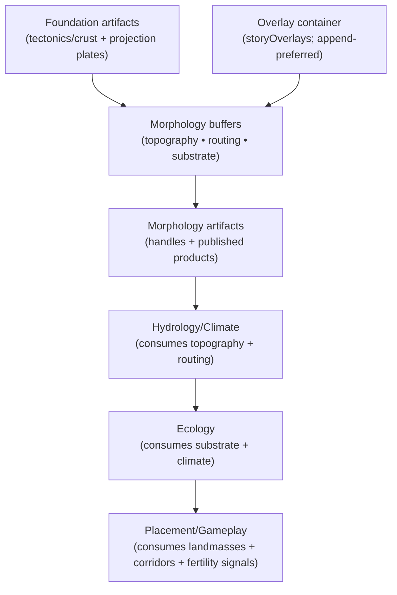
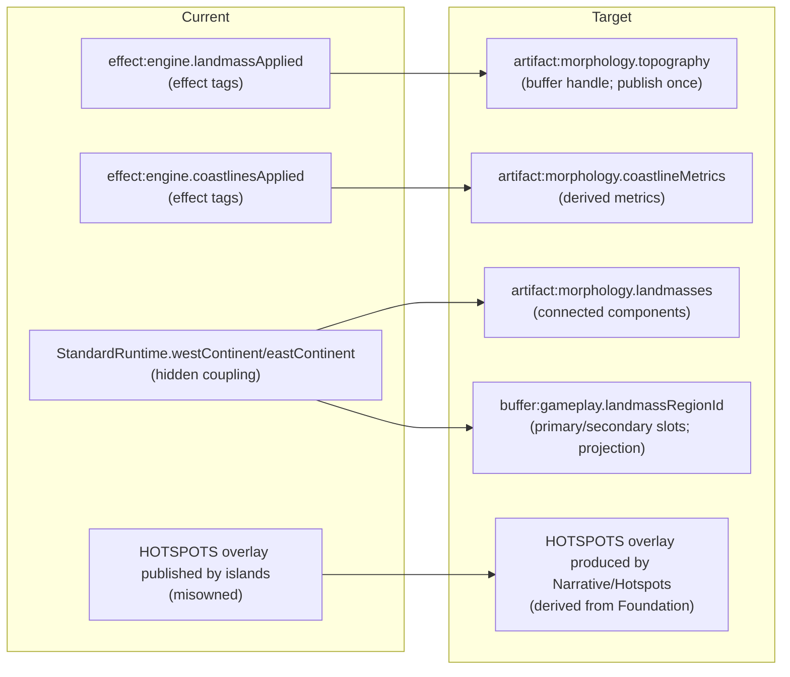

# Morphology Domain Refactor — Phase 2 Modeling Spike (Model-First)

This spike is the **Phase 2 output** for the Morphology vertical refactor workflow:
- Plan: `docs/projects/engine-refactor-v1/resources/workflow/domain-refactor/plans/MORPHOLOGY.md`
- Backbone workflow: `docs/projects/engine-refactor-v1/resources/workflow/domain-refactor/WORKFLOW.md`
- Phase 1 (current-state): `docs/projects/engine-refactor-v1/resources/spike/spike-morphology-current-state.md`

Goal: define the **authoritative first-principles Morphology model**, then derive the target contract surfaces from that model.

Hard rule: if the existing pipeline wiring conflicts with the model, the model wins. Any compatibility shims must be **downstream-owned** and explicitly deprecated.

---

## 0) Scope guardrails (Phase 2)

- Model-first only. No slice plan content in this document.
- Authoritative model is canonical even if artifacts change.
- Projections never define internal representation.
- Compatibility is forbidden inside Morphology; transitional shims may only exist downstream as explicitly deprecated.
- Every config property, rule/policy, and function is explicitly classified as keep/kill/migrate.

---

## 1) Authority stack (what is canonical vs supporting)

**Canonical (authoritative):**
- Domain-only causality + ownership: `docs/system/libs/mapgen/morphology.md`
- Cross-domain data model (buffers/artifacts/overlays): `docs/system/libs/mapgen/architecture.md`
- Upstream contract shape (inputs available): `docs/system/libs/mapgen/foundation.md`
- Domain modeling rules (ops/strategies/rules/steps): `docs/projects/engine-refactor-v1/resources/spec/SPEC-DOMAIN-MODELING-GUIDELINES.md`
- Refactor invariants + posture:
  - `docs/projects/engine-refactor-v1/resources/workflow/domain-refactor/references/implementation-traps-and-locked-decisions.md`
  - `docs/projects/engine-refactor-v1/resources/workflow/domain-refactor/references/verification-and-guardrails.md`

**External authority (Civ7 engine constraints; authoritative for interop, not for our internal model):**
- Civ7 shipped map scripts + data under `.civ7/outputs/resources/Base/modules/base-standard/`, especially:
  - `.civ7/outputs/resources/Base/modules/base-standard/maps/assign-starting-plots.js` (homelands vs distant start logic)
  - `.civ7/outputs/resources/Base/modules/base-standard/maps/map-utilities.js` (LandmassRegionId stamping helper)
  - `.civ7/outputs/resources/Base/modules/base-standard/maps/resource-generator.js` (resource placement gated by LandmassRegionId)
  - `.civ7/outputs/resources/Base/modules/base-standard/scripts/age-transition-post-load.js` (age transition resource logic gated by LandmassRegionId)
  - `.civ7/outputs/resources/Base/modules/base-standard/data/maps.xml` + `.civ7/outputs/resources/Base/modules/base-standard/data/ages.xml` (PlayersLandmass1/2; age hemisphere restrictions)
  - `.civ7/outputs/resources/Base/modules/base-standard/config/config.xml` (DistantLandsMapSizes semantics)

**Supporting (useful seeds; not canonical for contracts):**
- Physics synthesis (seed; low-churn causal claims only): `docs/system/libs/mapgen/research/SPIKE-synthesis-earth-physics-systems-swooper-engine.md`
- Civ7 mapgen feature inventory (seed/hypothesis bank): `docs/system/libs/mapgen/research/SPIKE-civ7-map-generation-features.md`
- Gameplay touchpoints (evidence; informs downstream constraints): `docs/system/libs/mapgen/research/SPIKE-gameplay-mapgen-touchpoints.md`
- External references (cited below; not authoritative for repo contracts).

---

## 2) Locked modeling principle (model-first)

**Morphology is the “sculptor” layer:**
- Foundation produces **tectonic potential + material history**.
- Morphology converts those causes into **topography + land/sea structure + geomorphic signals** that downstream systems can reason about.

**Key posture:**
- Morphology owns the *meaning* of its products (elevation, landmask, routing signals, sediments).
- If downstream still needs a legacy shape (e.g., “west/east continent bounds”), that is a **projection** and must live downstream (explicitly deprecated).

---

## 3) Canonical model (authoritative) + causality spine

### 3.1 Canonical state (conceptual; buffers are the truth)

Morphology’s internal representation is buffer-first: mutable working layers refined across steps.

```ts
type TileIndex = number; // i = y * width + x

interface MorphologyTopographyBuffers {
  elevation: Float32Array;     // signed height relative to datum (tile-indexed)
  bathymetry: Float32Array;    // signed depth below datum for oceans (tile-indexed)
  landMask: Uint8Array;        // 1=land, 0=water (tile-indexed; derived from elevation + seaLevel)
  seaLevel: number;            // scalar datum threshold for land

  slope?: Float32Array;        // derived metric (tile-indexed)
  ruggedness?: Float32Array;   // derived metric (tile-indexed)
  distanceToCoast?: Uint16Array; // derived metric (tile-indexed; 0=coast)
}

interface MorphologySubstrateBuffers {
  erodibilityK: Float32Array;   // resistance to fluvial incision (tile-indexed)
  sedimentDepth: Float32Array;  // loose sediment thickness (tile-indexed)
}

interface MorphologyRoutingBuffers {
  flowDir: Int32Array;          // steepest-descent receiver index per tile (or -1)
  flowAccum: Float32Array;      // drainage area proxy per tile
  basinId?: Int32Array;         // optional, if needed for lakes/deltas (tile-indexed)
}

interface MorphologyLandmassModel {
  landmasses: Array<{
    id: number;
    tileCount: number;
    bbox: { west: number; east: number; south: number; north: number };
    coastlineLength: number;
    shelfShare?: number; // optional; if bathymetry exists
  }>;
}
```

**Non-goal of the canonical model:** representing engine terrain/feature IDs. Those are fields/projections applied later.

### 3.2 Inputs (authoritative, upstream-owned facts)

Morphology consumes:
- **Tectonic drivers:** uplift, rift, shear, volcanism, cumulative uplift (from Foundation).
- **Material/age:** crust type and age (from Foundation).
- **Board geometry facts:** width/height, wrap semantics, latitude (from Env).
- **Overlay constraints (optional):** “protected corridors / sea lanes” (from Narrative overlays), but only as **data inputs** (no op depends on Narrative module layout).

### 3.3 Outputs (authoritative vs projection)

**Authoritative Morphology outputs (owned meaning):**
- Topography buffers (elevation, bathymetry, landMask/seaLevel).
- Routing buffers (flowDir/flowAccum; optional basinId).
- Substrate buffers (erodibilityK, sedimentDepth).
- Landmass decomposition (connected components with bbox + attributes).

**Projection outputs (explicitly non-canonical):**
- “West/east continent windows” for start systems.
- Per-tile “hemisphere / landmass region id” labels used by Civ7 (`GameplayMap.getLandmassRegionId`); this is derived from canonical landmasses and downstream gameplay constraints.
- Any discrete terrain classification (mountain/hill/flat) if represented as engine terrain IDs.

#### Civ7 official behavior review: homelands vs distant lands (constraints to honor)

This is the minimum *engine-facing* constraint set the refactor must support, based on Civ7 shipped scripts/data:

- Civ7’s “homelands vs distant lands” is implemented as a **two-slot landmass partition** (often called “west/east” in scripts) and is referenced by:
  - start region assignment (`.civ7/outputs/resources/Base/modules/base-standard/maps/assign-starting-plots.js`)
  - per-hemisphere resource distribution and age transitions (`.civ7/outputs/resources/Base/modules/base-standard/maps/resource-generator.js`, `.civ7/outputs/resources/Base/modules/base-standard/scripts/age-transition-post-load.js`)
- The partition is represented in-engine as a per-tile **LandmassRegionId** (`TerrainBuilder.setLandmassRegionId`, read via `GameplayMap.getLandmassRegionId`).
- The shipped start placement algorithm supports two selection modes:
  - **Sector-based**: preselected “start sectors” (driven by `StartSectorRows/StartSectorCols` and `chooseStartSectors`), and
  - **Equal fertility regions**: `StartPositioner.divideMapIntoMajorRegions(...)` on a left/right window, then pick starts from those regions.
  Both modes gate picks by LandmassRegionId (`.civ7/outputs/resources/Base/modules/base-standard/maps/assign-starting-plots.js`).
- Map scripts assign LandmassRegionId in (at least) two patterns:
  - **Rectangular hemisphere windows**: scripts create “westContinent/eastContinent” rectangles and stamp LandmassRegionId on all non-ocean tiles inside them via `markLandmassRegionId` (`.civ7/outputs/resources/Base/modules/base-standard/maps/map-utilities.js`), e.g. `.civ7/outputs/resources/Base/modules/base-standard/maps/terra-incognita.js`.
  - **Generator landmass slots**: Voronoi scripts map generator landmass ids `1/2` to the two LandmassRegion slots (and treat other land as islands via `PlotTags.PLOT_TAG_ISLAND`), e.g. `.civ7/outputs/resources/Base/modules/base-standard/maps/continents-voronoi.js`.
- Many scripts treat “islands” as a separate category (plot tag + special resource behavior) rather than as part of either hemisphere slot (`PlotTags.PLOT_TAG_ISLAND`, `replaceIslandResources`, `GameInfo.MapIslandBehavior` in `.civ7/outputs/resources/Base/modules/base-standard/maps/resource-generator.js`).
- The “ocean separation buffer” is enforced structurally (not just by UI fog): coast expansion avoids the central ocean buffer columns, keeping an open-ocean corridor between the two slots (`g_OceanWaterColumns` gating in `.civ7/outputs/resources/Base/modules/base-standard/maps/elevation-terrain-generator.js`).
- Age rules include hemisphere restrictions:
  - `HumanPlayersPrimaryHemisphere="true"` for Antiquity/Exploration (`.civ7/outputs/resources/Base/modules/base-standard/data/ages.xml`), and
  - `NoVictoriesSecondaryHemisphere="true"` for Antiquity (`.civ7/outputs/resources/Base/modules/base-standard/data/ages.xml`).
- LandmassRegionId participates in resource eligibility checks using divisibility (`assignedLandmass % landmassRegionId == 0`), so the LandmassRegionId values are not arbitrary (`.civ7/outputs/resources/Base/modules/base-standard/maps/resource-generator.js`, `.civ7/outputs/resources/Base/modules/base-standard/scripts/age-transition-post-load.js`).
- Map size parameters expose the expected player split across the two slots (`PlayersLandmass1/PlayersLandmass2` in `.civ7/outputs/resources/Base/modules/base-standard/data/maps.xml`), and the shipped config documents a “Distant Lands” map size domain for ages with landmass victory restrictions (`.civ7/outputs/resources/Base/modules/base-standard/config/config.xml`).

**Other “silent contract” surfaces adjacent to Morphology (worth making explicit):**

- `LandmassRegionId` is used for more than west/east:
  - Voronoi maps use generator-produced `tile.landmassId` values (e.g. `1` for primary, `2` for “common islands”) and stamp them directly into LandmassRegionId (`.civ7/outputs/resources/Base/modules/base-standard/maps/pangaea-voronoi.js`); they additionally tag `tile.landmassId === 2` as `PlotTags.PLOT_TAG_ISLAND`.
  - **Interpretation of the divisibility rule:** Civ7 appears to treat `ResourceBuilder.getResourceLandmass(...)` as an “allowed set” integer and `LandmassRegionId` as a **factor-coded region key** (membership is tested by `%`). This makes it unsafe to invent new numeric region IDs; downstream projections must use the engine’s `LandmassRegion.*` constants, not ad-hoc numbers (`.civ7/outputs/resources/Base/modules/base-standard/maps/resource-generator.js`, `.civ7/outputs/resources/Base/modules/base-standard/scripts/age-transition-post-load.js`).
  - LandmassRegionId is propagated into newly-created **coastal water** tiles: the coast-expansion step converts some ocean tiles to coast and copies the adjacent coast’s LandmassRegionId (`.civ7/outputs/resources/Base/modules/base-standard/maps/elevation-terrain-generator.js`).
- “Elevation” is a first-class engine field that downstream scripts assume exists:
  - The biome/feature pass adjusts logic using `GameplayMap.getElevation(...)` (e.g. modifies effective latitude by elevation) (`.civ7/outputs/resources/Base/modules/base-standard/maps/feature-biome-generator.js`).
  - Map scripts consistently call `TerrainBuilder.buildElevation()` after stamping land and before biome/feature passes (e.g. `.civ7/outputs/resources/Base/modules/base-standard/maps/continents-voronoi.js`, `.civ7/outputs/resources/Base/modules/base-standard/maps/terra-incognita.js`, `.civ7/outputs/resources/Base/modules/base-standard/maps/archipelago.js`).
- “Rainfall” is also a first-class engine field used to drive biome/feature logic:
  - The biome/feature pass reads rainfall from `GameplayMap.getRainfall(...)` (`.civ7/outputs/resources/Base/modules/base-standard/maps/feature-biome-generator.js`).
  - The elevation/terrain pass explicitly writes rainfall via `TerrainBuilder.setRainfall(...)` (`.civ7/outputs/resources/Base/modules/base-standard/maps/elevation-terrain-generator.js`).
- “ContinentType” is read as if it’s always available for start scoring:
  - Start scoring gates by `GameplayMap.getContinentType(...)` (`.civ7/outputs/resources/Base/modules/base-standard/maps/assign-starting-plots.js`), but continent IDs are not authored directly; map scripts call `TerrainBuilder.stampContinents()` (and frequently `AreaBuilder.recalculateAreas()`) to keep those labels coherent (e.g. `.civ7/outputs/resources/Base/modules/base-standard/maps/pangaea-voronoi.js`).
- “Water data” and “fertility” are treated as engine-finalized fields:
  - Map scripts consistently call `TerrainBuilder.storeWaterData()` near the end of generation (e.g. `.civ7/outputs/resources/Base/modules/base-standard/maps/continents-voronoi.js`, `.civ7/outputs/resources/Base/modules/base-standard/maps/pangaea-voronoi.js`).
  - Map scripts consistently call `FertilityBuilder.recalculate()` after generation (e.g. `.civ7/outputs/resources/Base/modules/base-standard/maps/continents-voronoi.js`, `.civ7/outputs/resources/Base/modules/base-standard/maps/pangaea-voronoi.js`), implying downstream gameplay systems expect fertility to be coherent after worldgen.
  - Map scripts call `TerrainBuilder.validateAndFixTerrain()` multiple times between major phases, implying an engine-level “coherence repair” step after terrain topology edits (e.g. `.civ7/outputs/resources/Base/modules/base-standard/maps/pangaea-voronoi.js`, `.civ7/outputs/resources/Base/modules/base-standard/maps/continents-voronoi.js`).

**Implication for our model:** Morphology must publish canonical **landmasses** (physical truth). A downstream stage (Placement/Gameplay) can then choose a two-slot partition (primary/secondary) and derive engine-facing projections (LandmassRegionId + any start-region windows) without reintroducing hidden runtime coupling.

### 3.4 Causality spine (Morphology-local ordering)

This is the Morphology-local “what exists before what” chain. It is the backbone used to derive ops and step boundaries later.

1) **Substrate mapping (lithology):** crust type/age + tectonic regime → erodibility/strength proxies.
2) **Base topography:** tectonic uplift + rift subsidence → a first-pass elevation and bathymetry field.
3) **Sea level + land definition:** choose sea level (or target hypsometry), derive landMask.
4) **Coastline + shelf structuring:** distance-to-coast, shelf shaping, coastal constraints (e.g., sea lane protection).
5) **Routing:** flowDir/flowAccum from current elevation.
6) **Geomorphic shaping:** incision (stream power) + diffusion (hillslope) + deposition (sediment) in 1–3 “eras”.
7) **Landform accents:** islands/volcanic chains, ridge spines/foothills, rift-valley basins (as topography edits + overlays).
8) **Landmass decomposition:** connected components and attributes derived from final landMask (for downstream consumption).

---

## 4) Conceptual narrative (the “technical visionary artist” view)

Morphology is where the map stops being a plate diagram and becomes a world you can read at a glance:

- **Convergent margins** become long, asymmetric mountain arcs with foothills and coastal complexity.
- **Divergent margins** become rift valleys, inland seas, and younger volcanic belts.
- **Ancient cratons** become broad, relatively flat interiors with stubborn, erosion-resistant relief.
- **Sedimentary basins** become fertile lowlands and deltas (sedimentDepth as a first-class gameplay-relevant substrate signal).

The artistic goal is not a photoreal heightmap; it’s a *coherent causal story* that produces:
- defensible chokepoints (ridges + passes),
- legible river basins (flow routing),
- believable coastlines (shelf + indentation),
- and a substrate that downstream systems can build on (soils/resources/biomes).

The gameplay goal (Civ7-specific) is that the world also supports:
- “Homelands vs Distant Lands” separation and map expansion constraints without infecting Morphology with compat surfaces;
- navigable rivers and meaningful drainage networks (routing must exist before Hydrology tries to “make rivers”);
- clear “rough terrain” / mountain belts that shape movement and settlement.

---

## 5) Diagrams (architecture view, data-flow, producer/consumer map)

### 5.1 Architecture view (domain spine + stage braid)

```mermaid
flowchart LR
  foundation["Foundation\n(mesh • crust • plates • tectonics)"]
  morphPre["Morphology (pre)\n(base topography • land/sea)"]
  narrPre["Narrative (pre)\n(seed overlays)"]
  morphMid["Morphology (mid)\ncoasts • erosion • routing"]
  narrMid["Narrative (mid)\nmeaning/overlays"]
  morphPost["Morphology (post)\nlandforms (islands/ridges/volcanoes)"]
  hydroPre["Hydrology (pre)\nclimate baseline • lakes"]
  placement["Placement\nstarts/wonders/etc"]

  foundation --> morphPre --> narrPre --> morphMid --> narrMid --> morphPost --> hydroPre --> placement
```



Phase-2 posture: we do **not** reorder stages here. The model instead makes the braid’s dependency boundaries explicit (via artifacts/buffers/overlays).

### 5.2 Data-flow (authoritative buffers + contracted artifacts)



### 5.3 Producer/consumer map adjustments (current → target)



Target posture:
- Replace effect-tag gating with artifact/buffer dependencies.
- Delete runtime hidden coupling; publish explicit Morphology landmass decomposition instead.
- Remove HOTSPOTS publication from Morphology; treat it as tectonics-derived overlay owned upstream (Narrative for now).

---

## 6) Target contract matrix (buffers / artifacts / overlays)

This is the target “contract truth” implied by the canonical model. Exact names/tags are Phase 3 wiring decisions; meaning is locked here.

### 6.1 Upstream inputs (adopted)

**Adopt now (available today):**
- `artifact:foundation.plates` (`foundationArtifacts.plates`) — tile-indexed tectonic projection (boundary type/closeness, uplift/rift potentials, shield stability).
- `artifact:foundation.tectonics` (`foundationArtifacts.tectonics`) — mesh-indexed drivers (preferred for model-first ops where feasible).
- `artifact:foundation.crust` (`foundationArtifacts.crust`) — mesh-indexed material/age signals (preferred).

**Overlay intake (optional, but must be explicit):**
- `artifact:storyOverlays` — append-preferred overlay container; Morphology reads only derived, data-only views passed into ops by steps.

### 6.2 Morphology products (published contracts)

**Buffers (canonical internal truth; publish “handles” once if needed):**
- `buffer:morphology.topography` — elevation/bathymetry/landMask + derived metrics.
- `buffer:morphology.routing` — flowDir/flowAccum (+ optional basinId).
- `buffer:morphology.substrate` — erodibilityK/sedimentDepth.

**Artifacts (published products; immutable-by-convention):**
- `artifact:morphology.topography` — handle/contract for the topography buffer (publish once; then mutate the underlying buffer in place).
- `artifact:morphology.routing` — handle/contract for routing buffers (publish once).
- `artifact:morphology.substrate` — handle/contract for substrate buffers (publish once).
- `artifact:morphology.landmasses` — landmass decomposition snapshot (derived from final landMask; immutable).
- `artifact:morphology.coastlineMetrics` — derived coastline/shelf metrics snapshot (immutable).

**Overlays (append-preferred stories; never canonical truth):**
- Morphology-owned overlays should be *meaningful motifs* derived from its canonical buffers, e.g.:
  - `overlays.corridors` (mountain passes / ridge corridors)
  - `overlays.rifts` (rift belts / inland sea candidates)
  - `overlays.deltas` (major depositional fans)

Explicit non-ownership:
- HOTSPOTS are tectonics-derived; Morphology must not publish them (see decisions).

### 6.3 Downstream projections required by Civ7 (not Morphology-owned)

These are downstream *gameplay* contracts that should be derived from `morphology.landmasses` (and other upstream signals) without reintroducing hidden runtime coupling:

- Per-tile Civ7 LandmassRegionId (“homelands vs distant lands” slot assignment).
- Optional start-region “windows” if a given placement/start algorithm still needs them (projection-only).

---

## 7) Target op catalog (contract surfaces implied by the model)

This section locks **what Morphology ops should exist** (ids + kinds + responsibilities). Exact input/output schemas are Phase 3 work, but the catalog is a modeling commitment.

### 7.1 Core compute ops (buffer-building)

- `morphology/compute-substrate` (`compute`)
  - crust/tectonics → `erodibilityK` (and any other resistance proxies).
- `morphology/compute-base-topography` (`compute`)
  - tectonics drivers → base `elevation` + `bathymetry` (pre-erosion).
- `morphology/compute-sea-level` (`compute`)
  - policy + desired hypsometry → scalar `seaLevel`.
- `morphology/compute-landmask` (`compute`)
  - elevation + seaLevel → landMask + distanceToCoast (and optional coast adjacency).
- `morphology/compute-coastline-metrics` (`compute`)
  - landMask + bathymetry → shelf/indentation metrics used by coasts/islands/hydrology.
- `morphology/compute-flow-routing` (`compute`)
  - elevation → flowDir + flowAccum (+ basinId if needed).
- `morphology/compute-geomorphic-cycle` (`compute`)
  - (elevation, routing, erodibilityK) → elevation delta + sediment updates, in 1–3 “eras”.
- `morphology/compute-landmasses` (`compute`)
  - landMask → landmass components + attributes (bbox/area/coastline length).

### 7.2 Plan ops (discrete landforms)

- `morphology/plan-island-chains` (`plan`)
  - consumes coastline metrics + tectonic/hotspot signals → list of island edits (tile list + types).
- `morphology/plan-ridges-and-foothills` (`plan`)
  - consumes tectonic drivers + topography → ridge spine + foothill candidates (tile sets).
- `morphology/plan-volcanoes` (`plan`)
  - consumes tectonic volcanism + topography/coast metrics → volcano placements.

### 7.3 Rules (policy units; internal to ops)

Candidate rule families (op-local; not exported as contracts):
- “hypsometry/sea-level selection” (target land fraction; clamp rules).
- “tectonic regime classification” (boundary-type/closeness + rift potential → regime).
- “coast protection masks” (sea lanes / protected corridors) as data-only inputs.
- “erosion parameter normalization” (world age → erosion/diffusion scaling).

---

## 8) Legacy disposition ledger (keep/kill/migrate)

This ledger classifies every existing config property, rule/policy, and function in the current Morphology surface.

Legend:
- **keep**: survives with same ownership/meaning (may move behind ops).
- **migrate**: concept survives but moves/renames/recontracts (ownership clarified).
- **kill**: removed (legacy-only, incoherent, or replaced).

### 8.1 Config properties

#### 8.1.1 `LandmassConfigSchema` (`mods/mod-swooper-maps/src/domain/morphology/landmass/config.ts`)

All landmass config becomes op-owned under the target catalog (primarily `compute-sea-level`, `compute-base-topography`, and `compute-landmask`). The current schema is a legacy “bag” and must not be reused inside op contracts.

```yaml
LandmassConfigSchema:
  baseWaterPercent: migrate  # -> morphology/compute-sea-level (hypsometry / target land fraction)
  waterScalar: migrate       # -> morphology/compute-sea-level (derived scaling; likely normalize-only)
  boundaryBias: migrate      # -> morphology/compute-base-topography (boundary uplift shaping) OR compute-landmask (coastal avoidance)
  boundaryShareTarget: migrate # -> morphology/compute-sea-level (constraint for land distribution)
  continentalFraction: migrate # -> morphology/compute-sea-level (constraint); may be removed once crust model is authoritative
  clusteringBias: migrate    # -> morphology/compute-base-topography (layout shaping); candidate to move upstream later
  microcontinentChance: migrate # -> morphology/plan-island-chains OR compute-base-topography; reframe as “microcontinent frequency”
  crustEdgeBlend: migrate    # -> morphology/compute-base-topography (smoothing at seams; likely becomes diffusion-era param)
  crustNoiseAmplitude: migrate # -> morphology/compute-base-topography (noise injection); may be replaced by erosion/diffusion
  continentalHeight: migrate # -> morphology/compute-base-topography (datum offsets)
  oceanicHeight: migrate     # -> morphology/compute-base-topography (bathymetry baseline)
  tectonics:
    interiorNoiseWeight: migrate   # -> compute-base-topography (plate interior variation)
    boundaryArcWeight: migrate     # -> compute-base-topography (orogeny arc shaping)
    boundaryArcNoiseWeight: migrate # -> compute-base-topography (arc roughness; likely becomes regime-specific)
    fractalGrain: migrate          # -> compute-base-topography (noise scale; may be killed if replaced by multi-scale diffusion)
  geometry:
    post:
      expandTiles: kill        # projection-only (window shaping); move downstream if still needed
      expandWestTiles: kill    # projection-only
      expandEastTiles: kill    # projection-only
      clampWestMin: kill       # projection-only
      clampEastMax: kill       # projection-only
      overrideSouth: kill      # projection-only
      overrideNorth: kill      # projection-only
      minWidthTiles: kill      # projection-only
```

Decision note:
- “continent windows” are projections (start-region convenience). They must not remain Morphology-owned.

#### 8.1.2 `MorphologyConfigSchema` (`mods/mod-swooper-maps/src/domain/morphology/config.ts`)

```yaml
MorphologyConfigSchema:
  oceanSeparation:
    enabled: migrate
    bandPairs: migrate
    baseSeparationTiles: migrate
    boundaryClosenessMultiplier: migrate
    maxPerRowDelta: migrate
    minChannelWidth: migrate
    channelJitter: migrate
    respectSeaLanes: migrate
    edgeWest:
      enabled: migrate
      baseTiles: migrate
      boundaryClosenessMultiplier: migrate
      maxPerRowDelta: migrate
    edgeEast:
      enabled: migrate
      baseTiles: migrate
      boundaryClosenessMultiplier: migrate
      maxPerRowDelta: migrate

  coastlines:
    bay:
      noiseGateAdd: migrate
      rollDenActive: migrate
      rollDenDefault: migrate
    fjord:
      baseDenom: migrate
      activeBonus: migrate
      passiveBonus: migrate
    plateBias:
      threshold: migrate
      power: migrate
      convergent: migrate
      transform: migrate
      divergent: migrate
      interior: migrate
      bayWeight: migrate
      bayNoiseBonus: migrate
      fjordWeight: migrate
    minSeaLaneWidth: migrate

  islands:
    fractalThresholdPercent: migrate
    minDistFromLandRadius: migrate
    baseIslandDenNearActive: migrate
    baseIslandDenElse: migrate
    hotspotSeedDenom: migrate
    clusterMax: migrate

  mountains:
    tectonicIntensity: migrate
    mountainThreshold: migrate
    hillThreshold: migrate
    upliftWeight: migrate
    fractalWeight: migrate
    riftDepth: migrate
    boundaryWeight: migrate
    boundaryGate: migrate
    boundaryExponent: migrate
    interiorPenaltyWeight: migrate
    convergenceBonus: migrate
    transformPenalty: migrate
    riftPenalty: migrate
    hillBoundaryWeight: migrate
    hillRiftBonus: migrate
    hillConvergentFoothill: migrate
    hillInteriorFalloff: migrate
    hillUpliftWeight: migrate

  volcanoes:
    enabled: migrate
    baseDensity: migrate
    minSpacing: migrate
    boundaryThreshold: migrate
    boundaryWeight: migrate
    convergentMultiplier: migrate
    transformMultiplier: migrate
    divergentMultiplier: migrate
    hotspotWeight: migrate   # renamed; should consume hotspot signal as input, not as “interior band heuristic”
    shieldPenalty: migrate
    randomJitter: migrate
    minVolcanoes: migrate
    maxVolcanoes: migrate
```

Modeling note:
- “migrate” here means “survives as an authored knob, but moves behind op-owned configs and is renormalized to match the canonical model.”

### 8.2 Rules/policies

```yaml
rules_and_policies:
  DEFAULT_OCEAN_SEPARATION:
    disposition: migrate
    target: "rule inside morphology/compute-landmask or morphology/compute-coastline-metrics"

  resolveSeaCorridorPolicy:
    disposition: migrate
    target: "step-level intake (derive protection mask from overlays); op consumes data-only mask"

  findNeighborSeaLaneAttributes:
    disposition: migrate
    target: "step-level intake (derive protection mask); do not keep Narrative-type coupling inside Morphology"

  findNeighborSeaLaneEdgeConfig:
    disposition: migrate
    target: "step-level intake (derive protection mask)"
```

### 8.3 Functions (current exports)

This list is “outside view”: the functions currently exported as Morphology domain entrypoints or helpers.

```yaml
domain_functions:
  createPlateDrivenLandmasses:
    disposition: migrate
    target: "morphology/compute-base-topography + morphology/compute-landmask (model-first; no window outputs)"

  applyLandmassPostAdjustments:
    disposition: kill
    rationale: "window post-processing is projection-only; move downstream if needed"

  applyPlateAwareOceanSeparation:
    disposition: migrate
    target: "morphology/compute-landmask (ocean basin shaping; data-only edits)"

  addRuggedCoasts:
    disposition: migrate
    target: "morphology/compute-coastline-metrics + (optional) topography edits; must not publish effect tags"

  addIslandChains:
    disposition: migrate
    target: "morphology/plan-island-chains (plan op) + step applies edits"

  layerAddMountainsPhysics:
    disposition: migrate
    target: "morphology/plan-ridges-and-foothills (plan op) + step applies projections"

  layerAddVolcanoesPlateAware:
    disposition: migrate
    target: "morphology/plan-volcanoes (plan op) + step applies"

  computePlateBias:
    disposition: migrate
    target: "rule inside coastline-related ops"

  computeTargetLandTiles:
    disposition: migrate
    target: "rule inside morphology/compute-sea-level (hypsometry selection)"

  computeClosenessLimit:
    disposition: kill
    rationale: "legacy closeness-limit heuristic tied to current crust-first landmask; replaced by canonical model"

  tryCrustFirstLandmask:
    disposition: kill
    rationale: "explicitly rejects uplift-driven elevation causality; replaced by base-topography + sea-level model"

  applyLandmaskToTerrain:
    disposition: migrate
    target: "step-only effect boundary (engine writes); never inside ops"

  computePlateStatsFromLandMask:
    disposition: migrate
    target: "morphology/compute-landmasses (derived model output)"

  windowsFromPlateStats:
    disposition: kill
    rationale: "window outputs are projections; replace with landmass decomposition"

  windowFromPlateStat:
    disposition: kill
    rationale: "projection-only"

  computeFractalOnlyScores:
    disposition: kill
    rationale: "fallback hides missing foundation inputs; canonical model requires tectonic drivers"

  computePlateBasedScores:
    disposition: migrate
    target: "rule/strategy inside ridges plan op (tectonic regime classification + ridge scoring)"

  applyRiftDepressions:
    disposition: migrate
    target: "base-topography compute op (rift subsidence) rather than an afterthought in mountain scoring"

  scoreVolcanoWeight:
    disposition: migrate
    target: "rule inside volcano plan op"
```

---

## 9) Upstream authoritative input selection (adopted inputs + legacy reads to delete)

### 9.1 Adopted inputs (target)

Adopt as authoritative:
- `foundation.tectonics` and `foundation.crust` for model-first shaping (preferred).
- `foundation.plates` as a temporary projection input where tile-indexed shaping is required.

Overlay intake:
- Use `storyOverlays` only as an append-preferred overlay container and as a source of **data-only protection masks** (sea lanes, protected corridors).

### 9.2 Legacy reads to delete (in this domain)

Delete from Morphology:
- Deep import dependency on Foundation implementation constants (`BOUNDARY_TYPE` via `@mapgen/domain/foundation/constants.js`).
- Writing/reading `StandardRuntime.westContinent/eastContinent` as an implicit consumer surface.
- Publishing HOTSPOTS overlay from within Morphology (misowned; see decisions).

---

## 10) Downstream consumer impact scan (current usage + required changes)

Downstream consumers discovered in Phase 1:
- Narrative steps currently gate on `effect:engine.coastlinesApplied`.
- Hydrology uses `effect:engine.landmassApplied` (lakes) and also reads runtime continents implicitly (climate baseline).
- Placement consumes runtime continents and encodes them in placement op contract.

Required downstream changes implied by the model:
- Replace effect-tag gating with explicit artifact requirements:
  - Consumers should require `artifact:morphology.topography` and/or `artifact:morphology.coastlineMetrics` (as appropriate).
- Replace runtime continents with `artifact:morphology.landmasses` (and downstream-owned projections, if still needed).
- Add an explicit downstream projection for Civ7 hemisphere semantics:
  - Derive per-tile LandmassRegionId (“homelands vs distant lands” slot assignment) from `morphology.landmasses` + placement/gameplay constraints, rather than reading hidden runtime windows.
- Move HOTSPOTS overlay production to an upstream step (Narrative is the best current home).

No detailed migration steps are specified here (Phase 3 owns the slice plan).

---

## 11) Architecture alignment note (SPEC/ADR constraints and resolutions)

Conflicts between current code and canonical architecture (to be resolved in implementation; model locked here):
- Steps must not import Morphology implementation modules; steps must call injected ops (`run(ctx, config, ops, deps)`).
- Ops must be atomic and data-only; they must not call other ops.
- Steps own effect boundaries (engine writes, artifact publication, overlay mutation).
- Buffers are buffers; any artifact “handle” is a wiring compromise, publish-once.

---

## 12) Decisions + defaults (modeling decisions)

### Decision: Morphology publishes landmass decomposition; does not publish start-region windows

- **Choice (locked):** Morphology publishes `artifact:morphology.landmasses` (connected components + attributes).
- **Explicit non-goal:** Morphology does not publish:
  - `westContinent/eastContinent` windows, or
  - Civ7 LandmassRegionId (“homelands vs distant lands” slot labels).
- **Rationale:** landmasses are a physical consequence of sea level; both “windows” and “homelands/distant slot assignment” are downstream gameplay projections derived from landmasses + game constraints.

### Decision: HOTSPOTS overlay is not Morphology-owned

- **Choice (locked):** Morphology must not publish HOTSPOTS. Treat hotspots as tectonics-derived signal owned upstream.
- **Practical ownership (today):** `narrative-pre/storyHotspots` is the best current home for HOTSPOTS production (it already consumes Foundation + coastlines and owns overlay seeding).
- **Rationale:** hotspots are tectonic causes; Morphology consumes them to express island/volcano manifestations.

### Decision: Ocean separation is modeled as “ocean basin shaping” (not a continent-window hack)

- **Choice (locked):** keep the *concept* (ocean separation / preserved corridors) but treat it as a Morphology-local physical shaping constraint.
- **Rationale:** Civ7’s age system requires reliable deep-ocean barriers; we model it as basin shaping that acts on landMask/bathymetry, not as “start region windows”.

### Default: “world age” is a first-class Morphology knob (eras, not continuous simulation)

- **Choice:** prefer 1–3 snapshots (eras) that modulate erosion/diffusion intensity, rather than many-step particle simulations.
- **Rationale:** stable, deterministic, and designer-tunable for a strategy map.

### Canonical authored config (target surface; op configs are derived)

The *author-facing* Morphology config should be shaped like the model (topography/routing/substrate), not like a bag of legacy implementation knobs.

Target authored shape (conceptual; exact schema lives in op/step contracts):

```ts
interface MorphologyAuthorConfig {
  /** Land fraction / hypsometry posture (drives sea level selection). */
  hypsometry: {
    targetWaterPercent: number; // Earth-like default ~60
    variance?: number; // how much per-map variation is allowed
  };

  /** “World age” controls how strongly erosion/diffusion relaxes relief. */
  worldAge: "young" | "mature" | "old";

  /** Orogeny + relief shaping (tectonic expression into elevation). */
  relief: {
    intensity: number; // overall amplitude of tectonic expression
    ridgeSharpness?: number;
    riftSubsidence?: number;
  };

  /** Geomorphic cycle controls (fluvial incision + diffusion + deposition). */
  geomorphology: {
    fluvial: { rate: number; m: number; n: number };
    diffusion: { rate: number; talus?: number };
    deposition: { rate: number };
    eras: 1 | 2 | 3;
  };

  /** Coastline + shelf structure controls (not “random ruggedness”). */
  coast: {
    shelfWidth?: number;
    indentation?: { bayRate: number; fjordRate: number; protectionRespect?: boolean };
    minSeaLaneWidth?: number;
  };

  /** Discrete landforms as controllable motifs. */
  landforms: {
    islands?: { frequency: number; hotspotChainBias?: number };
    volcanoes?: { density: number; arcBias?: number; hotspotBias?: number };
  };
}
```

Derivation posture:
- Steps normalize this authored config into op-owned configs.
- Ops never depend on a domain-wide config bag.

---

## 13) Risk register (modeling)

```yaml
risks:
  - id: R1
    title: "Hidden consumer coupling via StandardRuntime continents"
    severity: high
    blocking: true
    notes: "Model forbids it; Phase 3 must plan downstream migration to landmasses artifact."
  - id: R2
    title: "Effect-tag gating replaces explicit artifact deps"
    severity: high
    blocking: true
    notes: "Must be replaced with morphology stage-owned artifact contracts; consumers updated accordingly."
  - id: R3
    title: "Narrative overlay schema is permissive (Type.Any) and treated as registry"
    severity: medium
    blocking: false
    notes: "Model tolerates artifact-wired overlay container, but recommends tightening schema over time."
  - id: R4
    title: "Current landmass generator rejects uplift-driven causality (crust-first land existence)"
    severity: high
    blocking: true
    notes: "Model requires uplift→elevation→sea level; implementation must delete or reframe crust-first landmask."
  - id: R5
    title: "Tile-indexed vs mesh-indexed inputs mismatch"
    severity: medium
    blocking: false
    notes: "Short-term: consume foundation.plates projection; long-term: adopt mesh-first drivers with explicit projections."
```

---

## 14) Golden path (authoritative)

Use this as the “one representative Morphology step” reference when implementing.

Targets to demonstrate:
- Step contract imports only Morphology op contracts + stage-owned artifacts.
- Step runtime uses `run(ctx, config, ops, deps)` and reads dependencies via `deps` only.
- The op surface is called with data-only inputs; engine writes happen in the step only.

Candidate golden path for Morphology (shape, not implementation):
- A `morphology-pre/topography` step that:
  - reads Foundation artifacts via `deps.artifacts.*`
  - calls `morphology/compute-base-topography`, `morphology/compute-sea-level`, `morphology/compute-landmask`
  - publishes `artifact:morphology.topography` handle once

---

## 15) Projection policy (explicitly non-canonical)

Explicit projections that must not shape Morphology internals:
- Start-region “continent windows” (west/east or multi-band windows).
- Legacy effect-tag naming (`landmassApplied`, `coastlinesApplied`).
- Engine terrain IDs (mountains/hills/coasts) as substitutes for topography buffers.

---

## 16) Pipeline delta list (upstream/downstream contract changes implied by the model)

Contract-level deltas implied by the model (implementation details intentionally omitted):

- Add Morphology stage-owned artifact contracts:
  - `morphology.topography` (buffer handle)
  - `morphology.routing` (buffer handle)
  - `morphology.substrate` (buffer handle)
  - `morphology.landmasses` (snapshot)
  - `morphology.coastlineMetrics` (snapshot)
- Remove Morphology effect-tag gating; consumers should require artifacts instead.
- Delete `StandardRuntime.westContinent/eastContinent` as a cross-stage surface.
- Move HOTSPOTS overlay production out of Morphology (Narrative-owned in current braid).
- Remove cross-domain deep imports from Morphology (Foundation constants; Narrative type coupling).

---

## 17) Research sources (external references used for modeling)

- Stream power law (fluvial incision family): https://en.wikipedia.org/wiki/Stream_power_law
- Hillslope diffusion / nonlinear transport relations (background): https://www.sciencedirect.com/science/article/abs/pii/S0169555X99001270

---

## 18) Iteration log (required; minimum two passes)

### Pass 1 (broad sweep → draft model)

Changes made:
- Treated Morphology outputs as canonical buffers (topography/routing/substrate) rather than effect tags.
- Identified misowned surfaces that must move (HOTSPOTS publication; runtime continents).
- Proposed a first target contract set (topography + landmasses).

Reason:
- Align Morphology with `docs/system/libs/mapgen/morphology.md` and `docs/system/libs/mapgen/architecture.md` buffer/artifact posture.

### Pass 2 (refinement → stabilized model)

Changes made:
- Promoted bathymetry and coastline metrics to first-class Morphology products (to support hydrology/ocean reasoning).
- Split “landmass decomposition” (authoritative) from “start region windows” (projection).
- Locked op catalog as compute vs plan responsibilities derived from the causality spine.
- Reframed ocean separation as “basin shaping” to preserve Civ7 constraints without compat leakage.

Reason:
- Increase physical coherence (topography + shelf structure are upstream causes of climate/hydrology).
- Make downstream impacts explicit while keeping compat forbidden inside Morphology.

### Pass 3 (Civ7 official resources audit → interop constraints locked)

Changes made:
- Added Civ7 shipped-script constraints for “homelands vs distant lands” and LandmassRegionId as explicit projection requirements.
- Clarified that LandmassRegionId and start-region windows are downstream gameplay projections derived from `morphology.landmasses`, not Morphology-owned surfaces.

### Pass 4 (adjacent “silent contracts” sweep → engine projection contract clarified)

Changes made:
- Captured additional Civ7 engine-facing fields that downstream scripts assume are coherent (Elevation, Rainfall, ContinentType, WaterData, Fertility), plus their ordering signals (`buildElevation`, `setRainfall`, `stampContinents`, `storeWaterData`, `FertilityBuilder.recalculate`, repeated `validateAndFixTerrain`).
- Clarified `LandmassRegionId` semantics beyond west/east: factor-coded membership via divisibility, plus propagation into coastal water tiles during coast expansion.

Reason:
- Prevent “implicit interop coupling” from re-entering Morphology: these are required for Civ7 behavior, but they are not Morphology-owned meanings and must live as explicit downstream projection/finalization steps.

Convergence note:
- The model stabilizes because the outputs are now defined as stable, cross-domain causal layers (topography/routing/substrate/landmasses) and the braid adjustments are limited to dependency surfaces (no reordering).

---

## Lookback 2 (Phase 2 → Phase 3): Modeling is locked; planning inputs only

### Finalized invariants (must not change during implementation)

1) Model-first: Morphology produces canonical buffers (topography/routing/substrate); effect tags are not the model.
2) No compat inside Morphology: no runtime continent windows; no HOTSPOTS publication; no deep imports for boundary semantics.
3) Landmasses are authoritative; start-region windows and Civ7 LandmassRegionId are downstream projections.
4) Civ7 interop must not invent region IDs: LandmassRegionId behaves like a factor-coded membership key in shipped scripts; projections must use engine `LandmassRegion.*` constants, and must propagate the chosen region labels into relevant coastal water tiles (where scripts do).
5) Ops are atomic and data-only; steps own engine writes and overlay mutation.
6) Overlays are append-preferred and must be treated as overlays, not as canonical artifacts.

### Phase 3 planning inputs (not a slice plan)

- Downstream migrations required:
  - Hydrology and Placement must move off runtime continents onto `morphology.landmasses` (or downstream shims).
  - Placement/Gameplay must derive Civ7 LandmassRegionId (“homelands vs distant lands” slot assignment) explicitly, rather than via hidden runtime windows.
  - Civ7 interop must make “engine projection + finalize” explicit (Elevation/Rainfall writes; continent stamping/area recalc; water-data storage; fertility recalc; terrain coherence repair), and keep it out of Morphology ownership.
  - Narrative steps must migrate from effect-tag gating to artifact requires (topography/coastlineMetrics).
- Domain cleanup required:
  - Remove crust-first land existence posture; adopt uplift→elevation→sea level causal chain.
  - Remove HOTSPOTS publication from islands; move to Narrative-owned producer.

Phase 3 owns slice ordering, migration matrix, and guardrail placement.
