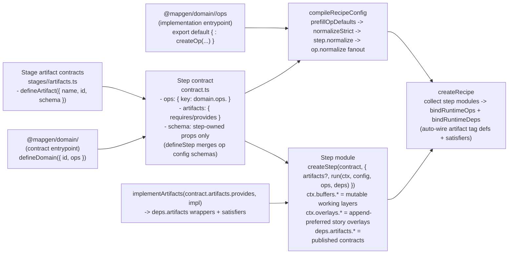

# Implementation Reference (Expanded Constraints + Surfaces)

This is the expanded reference used during Phase 4 implementation. Keep it close while coding.

## Expanded constraints and invariants

Canonical TypeScript rules (hard rules):
- Use `OpTypeBag` from `@swooper/mapgen-core/authoring` for all shared op types (`types.ts` is the only shared type surface).
- Do not export or re-export types from helpers or rules; shared types live in `types.ts` only.
- `rules/**` must not import `../contract.js` (type-only or runtime). Use `../types.js` for types and core SDK packages for utilities.

Execution posture:
- Proceed end-to-end; only stop if continuing would cause dangerous side effects (data loss, breaking public contracts without updating consumers, or violating the canonical spec/ADRs).
- Router compliance: before editing any file, read the closest `AGENTS.md` router that scopes that file.

Non-negotiable invariants (target architecture):
- Ops are the contract; steps never call internal domain helpers directly.
- Ops are atomic; ops must not call other ops (composition happens in steps/stages).
- No runtime “views” cross the op boundary (POJOs + typed arrays only).
- Op contracts own schemas and default configs; step contracts declare which op contracts they use via `contract.ops`.
- `defineStep({ ops })` merges declared op configs into the step schema automatically (step schemas only declare step-owned props).
- Plan compilation produces final configs; runtime treats `node.config` as “the config” (no runtime defaulting merges).
- No dual paths, shims, translators, DeepPartial override blobs, or fallback behaviors within scope.
- Artifacts are contract-first and stage-owned:
  - contracts live at `stages/<stage>/artifacts.ts` (stable import surface),
  - step contracts declare `artifacts.requires/provides` using those contracts,
  - step runtime uses `deps.artifacts.*` exclusively (no ad-hoc artifact imports).

## Artifacts authoring (stage-owned contract + step-owned runtime)

Stage contract surface (stable import path for step contracts):
```ts
// mods/mod-swooper-maps/src/recipes/standard/stages/ecology/artifacts.ts
import { Type, defineArtifact } from "@swooper/mapgen-core/authoring";

export const ecologyArtifacts = {
  featureIntents: defineArtifact({
    name: "featureIntents",
    id: "artifact:ecology.featureIntents",
    schema: Type.Object({}, { additionalProperties: false }),
  }),
} as const;
```

Consumer step contract (declares dependencies via `artifacts.*`):
```ts
// mods/mod-swooper-maps/src/recipes/standard/stages/ecology/steps/features-apply/contract.ts
import { Type, defineStep } from "@swooper/mapgen-core/authoring";
import ecology from "@mapgen/domain/ecology";
import { ecologyArtifacts } from "../../artifacts.js";

export default defineStep({
  id: "features-apply",
  phase: "ecology",
  artifacts: { requires: [ecologyArtifacts.featureIntents], provides: [] },
  ops: { apply: ecology.ops.applyFeatures },
  schema: Type.Object({}, { additionalProperties: false }),
  requires: [],
  provides: [],
});
```

Producer step runtime (binds runtime checks + publishes via `deps`):
```ts
// mods/mod-swooper-maps/src/recipes/standard/stages/ecology/steps/features-plan/index.ts
import { createStep, implementArtifacts } from "@swooper/mapgen-core/authoring";
import contract from "./contract.js";

const artifacts = implementArtifacts(contract.artifacts!.provides!, {
  featureIntents: { /* validate/satisfies/freeze overrides (optional) */ },
});

export default createStep(contract, {
  artifacts,
  run: (ctx, config, ops, deps) => {
    // No artifact imports here: only deps.* access.
    deps.artifacts.featureIntents.publish(ctx, { /* ... */ });
  },
});
```

## Target architecture diagram (wiring)



## Expected file surfaces (outside view)

```txt
mods/mod-swooper-maps/src/domain/<domain>/
  index.ts                # contract entrypoint (defineDomain); safe for step contracts
  config.ts               # optional; thin re-export surface for domain-owned schemas/constants
  ops/
    contracts.ts          # op contracts registry (export const contracts = { ... })
    index.ts              # op implementations registry (export default { ... } satisfies contracts)
    <op>/
      contract.ts
      types.ts
      rules/
        index.ts
      strategies/
        default.ts
        index.ts
      index.ts

mods/mod-swooper-maps/src/recipes/standard/stages/<stage>/
  artifacts.ts            # stage-owned artifact contracts (defineArtifact)
  index.ts                # stage module (createStage), wires steps + knobsSchema + compile-time op registry
  steps/
    <step>/
      contract.ts         # defineStep({ ops, artifacts.requires/provides, schema, requires/provides (non-artifacts) })
      index.ts            # createStep(contract, { artifacts?, normalize?, run(ctx, config, ops, deps) })
      lib/                # optional pure helpers
```
