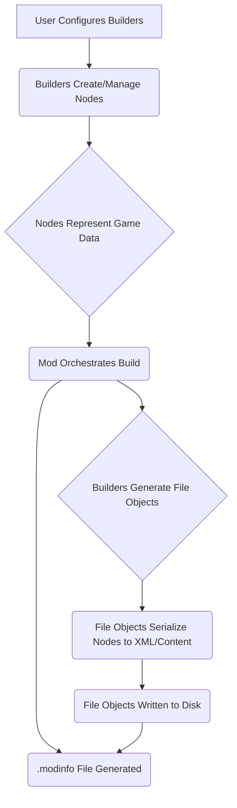
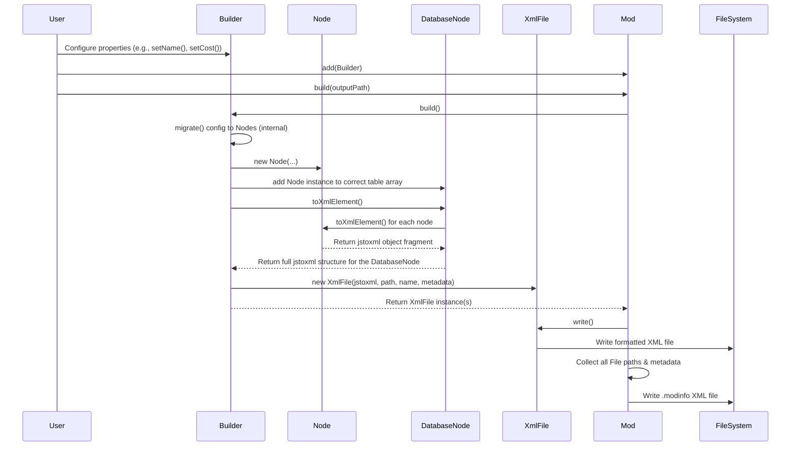

# Technical Guide: civ7-modding-tools (`src/`)

## 1. Introduction

### Purpose
This guide provides a technical deep-dive into the architecture and core components of the `civ7-modding-tools` library. It is based on an analysis of the codebase within the `src/` directory and aims to explain how the library facilitates the creation of Civilization VII mods using TypeScript.

### Target Audience
This document is intended for developers who want to:
*   Understand the internal workings of the `civ7-modding-tools` library.
*   Contribute to the library's development.
*   Leverage the library's patterns for more advanced modding tasks.
****
### Scope
This guide covers the following key areas:
*   **Architecture Overview:** The layered structure and directory organization.
*   **Key Components:** Detailed breakdown of core classes and modules (`Mod`, Builders, Nodes, Files, Constants, etc.).
*   **Common TypeScript Patterns:** Recurring design patterns used throughout the codebase.
*   **Data Flow:** The process from user configuration to generated mod files.
*   **Mod Definition Process:** The typical workflow for users defining mod elements.

## 2. Architecture Overview

### Layered Approach
The `civ7-modding-tools` library employs a layered architecture designed to abstract the complexities of Civilization VII modding:

1.  **Configuration Layer (Builders - `src/builders/`):** This is the primary interface for users. Specific `Builder` classes (e.g., `CivilizationBuilder`, `UnitBuilder`) provide a fluent, type-safe API to define game elements programmatically.
2.  **Data Representation Layer (Nodes - `src/nodes/`):** Builders internally create and manage instances of `Node` classes (e.g., `CivilizationNode`, `TraitNode`). These nodes directly map to the structured data required by the game, often corresponding to rows in XML database tables. `DatabaseNode` acts as a container for these nodes.
3.  **File Generation Layer (Files - `src/files/`):** `Node` structures are serialized into intermediate formats (like `jstoxml` objects). `File` classes (e.g., `XmlFile`, `ImportFile`) handle the conversion to final file content (e.g., XML strings, copied assets) and manage writing to the correct output directory structure.
4.  **Orchestration Layer (Mod - `src/core/`):** The central `Mod` class coordinates the entire process. It collects configured Builders and other Files, triggers the build process, gathers generated `File` objects and their metadata, and constructs the final `.modinfo` file required by the game.

### Directory Roles
The `src/` directory is organized as follows:
*   `core/`: Contains the central `Mod` orchestrator and related core logic.
*   `builders/`: Houses the `Builder` classes providing the user-facing API.
*   `nodes/`: Defines the `Node` classes representing game data structures.
*   `files/`: Contains classes for handling file generation and management (`XmlFile`, `ImportFile`).
*   `constants/`: Stores type-safe constants representing game identifiers (Traits, Kinds, etc.).
*   `localizations/`: Components specifically for generating localization XML files.
*   `utils/`: Shared utility functions used across the library.
*   `types/`: Shared TypeScript type definitions and utility types.

### High-Level Flow Diagram



## 3. Key Components (Detailed Breakdown)

### `src/core/`
*   **`Mod.ts`:** The heart of the library.
    *   Manages mod metadata (ID, name, version, etc.).
    *   Collects instances of `Builder` and `BaseFile`.
    *   Orchestrates the build process by calling `build()` on builders and `write()` on files.
    *   Generates the crucial `.modinfo` file, registering all mod components with the game.
*   **`ActionGroupBundle.ts`:** Manages the standard set of Action Groups (`current`, `shell`, `always`) and associated Actions (`UPDATE_DATABASE`, `LOCALIZATION_DATA`) used by Civ VII to determine when and how mod files are loaded.

### `src/builders/`
*   **`BaseBuilder.ts`:** The abstract foundation for all specific builders.
    *   Provides common configuration logic (e.g., via a `fill` utility).
    *   Defines the `build()` method interface, responsible for generating `File` objects.
    *   Holds an `ActionGroupBundle` to define when the builder's output should be loaded.
*   **Specific Builders (e.g., `CivilizationBuilder.ts`, `UnitBuilder.ts`, `ConstructibleBuilder.ts`):**
    *   Provide a typed, fluent interface for defining specific game elements (Civilizations, Units, Buildings, etc.).
    *   Internally manage `Node` structures, often within `DatabaseNode` containers.
    *   Implement `migrate()` logic (often implicitly called) to translate high-level configuration into detailed `Node` objects.
    *   Offer `bind()` methods for creating relationships between different mod elements (e.g., linking a unique unit to a civilization).
    *   Implement the `build()` method to generate one or more `File` objects (typically `XmlFile`) containing the serialized node data and appropriate metadata.

### `src/nodes/`
*   **`BaseNode.ts`:** Represents a single data entry, usually mapping to an XML element like `<Row>` or `<InsertOrIgnore>`.
    *   Handles automatic conversion of its properties into XML attributes during serialization.
    *   Provides the `toXmlElement()` method for conversion to the `jstoxml` format.
*   **`DatabaseNode.ts`:** Represents the root `<Database>` element common in Civ VII mod XML files.
    *   Contains arrays of specific `BaseNode` subclasses, grouped by the target game table name (e.g., `Units`, `Traits`, `Civilizations`).
    *   Handles the serialization of the entire table structure into the `jstoxml` format by calling `toXmlElement()` on its contained nodes.
*   **Specific Nodes (e.g., `CivilizationNode.ts`, `UnitNode.ts`, `TraitNode.ts`, `ConstructibleYieldChangeNode.ts`):**
    *   Define the specific properties (which become XML attributes) for each type of game data row or element.
    *   Inherit from `BaseNode`.

### `src/constants/`
*   **Role:** Provides type-safe access to the vast collection of game-specific string identifiers used within Civilization VII's database (e.g., for Traits, Kinds, Actions, Yields, Terrains, Units, Buildings, etc.). This is crucial for:
    *   **Type Safety:** Prevents typos that would lead to runtime errors or incorrect mod behavior.
    *   **Discoverability:** Enables IDE autocompletion, making it easier to find valid game identifiers.
    *   **Maintainability:** Centralizes game strings, simplifying updates if game definitions change.
    *   **Readability:** Using named constants (e.g., `YIELD.FOOD`) is much clearer than raw strings (`'YIELD_FOOD'`).
*   **Implementation:**
    *   Constants are defined in dedicated files (e.g., `TRAIT.ts`, `YIELD.ts`, `UNIT_CLASS.ts`) as plain JavaScript objects.
    *   The `as const` assertion is used to ensure TypeScript treats the values as specific literal types, not just generic `string` types.
    *   A barrel file (`src/constants/index.ts`) re-exports all constants, allowing convenient imports like `import { TRAIT, YIELD } from '../constants';`.
*   **Examples:**
    *   *Definition Snippet (`src/constants/YIELD.ts`):*
        ```typescript
        // src/constants/YIELD.ts
        export const YIELD = {
          FOOD: 'YIELD_FOOD',
          PRODUCTION: 'YIELD_PRODUCTION',
          GOLD: 'YIELD_GOLD',
          SCIENCE: 'YIELD_SCIENCE',
          CULTURE: 'YIELD_CULTURE',
          FAITH: 'YIELD_FAITH',
          // ... many more yields
        } as const;
        ```
    *   *Importing:*
        ```typescript
        // In a builder or other module
        import { TRAIT, YIELD, UNIT_CLASS, KIND } from '../constants';
        ```
    *   *Usage in Builders/Nodes (Conceptual):*
        ```typescript
        // In a Builder configuration
        const unitBuilder = new UnitBuilder({
          kind: KIND.UNIT,
          unitType: 'UNIT_GONDOR_SWORDSMAN',
          unitClass: UNIT_CLASS.MELEE,
          // ... other config
        });

        // Creating a Node directly
        const yieldNode = new ConstructibleYieldChangeNode({
          yieldType: YIELD.PRODUCTION, // Type-safe!
          amount: 1,
        });

        // Adding a Trait using its constant identifier
        civilizationBuilder.addTrait(TRAIT.ANTIQUITY_CIV);
        ```
*   **Scope:** The `src/constants/` directory covers a wide range of game concepts, reflecting Civ VII's complexity. File names like `ABILITY.ts`, `RESOURCE.ts`, `TERRAIN.ts`, `BUILDING_CULTURES.ts`, `EFFECT.ts`, etc., indicate the breadth of available identifiers.

### `src/files/`
*   **`BaseFile.ts`:** An abstract representation of a file to be generated as part of the mod.
    *   Holds common properties: `path`, `name`, `content`.
    *   Crucially stores metadata for the `.modinfo` file: `actionGroups` and `actionGroupActions`, determining how the game loads the file.
*   **`XmlFile.ts`:** A specialization for generating XML files.
    *   Takes `jstoxml`-compatible content (usually generated by `DatabaseNode.toXmlElement()`).
    *   Uses the `jstoxml` library to convert this object structure into a formatted XML string.
    *   Handles writing the final XML content to disk at the specified path.
*   **`ImportFile.ts`:** Handles copying existing asset files (like images `.png`, `.dds` or `.sql` scripts) from a source location into the generated mod's directory structure, ensuring they are also registered in the `.modinfo`.

### `src/localizations/`
*   **Purpose:** Contains classes and nodes specifically designed for generating the localization XML files (`<LocalizedText>`) required for displaying custom text in-game.
*   **Key elements:** Includes localization-specific classes (e.g., `CivilizationLocalization.ts`), the `EnglishTextNode` for defining text entries, and helper functions like `locale()` to create standard localization tags easily.

### `src/types/` & `src/utils/`
*   **Role:** Provide shared resources to maintain consistency and reduce boilerplate across the library.
*   `src/types/`: Contains reusable TypeScript type definitions, interfaces, and utility types (e.g., `TClassProperties`, `TPartialRequired`).
*   `src/utils/`: Contains helper functions used in various parts of the codebase (e.g., `fill` for object property assignment, `locale` for localization tag generation, `trim` for string manipulation).

## 4. Common TypeScript Patterns

The codebase leverages several common TypeScript patterns to enhance robustness and developer experience:

*   **Strong Typing:** Extensive use of TypeScript's type system, including:
    *   Generics (e.g., `BaseBuilder<T>`, `BaseNode<T>`) for flexible yet type-safe base classes.
    *   Specific interfaces and types for builder configurations and node properties.
    *   Utility types (`src/types/`) for common type transformations.
*   **`as const`:** Applied to constant objects (`src/constants/`) to ensure TypeScript infers literal types (e.g., `'YIELD_FOOD'` instead of just `string`), enabling stricter type checking and better autocompletion.
*   **Class-Based OOP:** The architecture heavily relies on classes and inheritance (e.g., `BaseBuilder`, `BaseNode`, `BaseFile` serve as foundations for specific implementations).
*   **Builder Pattern:** The primary design pattern for user interaction. Builders provide a dedicated object for constructing complex game elements step-by-step.
*   **Barrel Files (`index.ts`):** Used extensively (e.g., in `src/`, `src/builders/`, `src/nodes/`, `src/constants/`) to group exports from modules within a directory, simplifying imports for consumers.
*   **Utility Functions/Types:** Shared logic and type definitions are extracted into `src/utils/` and `src/types/` to promote code reuse and maintainability.
*   **Fluent Interface:** Builder methods that configure properties often return `this`, allowing for method chaining (e.g., `builder.setName('...').setCost(100).addTrait(...)`).

## 5. Data Flow (Step-by-Step)

The process of turning user configuration into a functional mod involves the following data flow:

1.  **Configuration:** The user interacts with Builder instances, setting properties or calling configuration methods (e.g., `civilizationBuilder.civilizationType = 'CIV_GONDOR';`).
2.  **Migration:** Internally, the builder's `migrate()` logic (called explicitly or implicitly during configuration or build) translates the high-level settings into specific `Node` objects (e.g., creating `CivilizationNode`, `TraitNode` instances). These nodes are typically stored within the builder's internal `DatabaseNode` containers (e.g., `this._databaseNodes.Civilizations.push(civilizationNode)`).
3.  **Binding (Optional):** If `bind()` methods are used, builders modify nodes in other bound builders and add necessary cross-referencing nodes (e.g., `UnitReplaceNode`) to their own `DatabaseNode` containers.
4.  **XML Structure Generation:** When `Mod.build()` is called, it iterates through its added builders and calls each builder's `build()` method.
5.  **Serialization:** Inside `Builder.build()`, the builder calls `toXmlElement()` on its `DatabaseNode` containers. `DatabaseNode` then calls `toXmlElement()` on each contained `Node`, recursively generating a nested JavaScript object structure (`XmlElement`) compatible with `jstoxml`, representing the desired XML.
6.  **File Object Creation:** The builder's `build()` method wraps the generated `XmlElement` structure(s) into `XmlFile` objects (or creates `ImportFile` objects for assets). It assigns the correct output path, filename, and the crucial `ActionGroup`/`Action` metadata for `.modinfo` registration.
7.  **File Writing:** `Mod.build()` collects all generated `File` objects and calls the `write()` method on each. `XmlFile.write()` uses the `jstoxml` library to convert the `XmlElement` structure into a formatted XML string and writes it to the filesystem. `ImportFile.write()` copies the source asset file.
8.  **`.modinfo` Generation:** Finally, `Mod.build()` gathers all the `File` objects, extracts their paths and metadata (`actionGroups`, `actionGroupActions`), collects unique `Criteria` (if any), and constructs the final `.modinfo` XML file. This file acts as the manifest, telling Civilization VII which files constitute the mod and how to load them.

### Detailed Sequence Diagram



## 6. Mod Definition Process (User Workflow)

Based on the architecture and components, the typical workflow for a user creating a mod element (e.g., a custom Civilization) looks like this:

1.  **Initialize Mod:** Create an instance of the main `Mod` class, providing essential metadata.
    ```typescript
    import { Mod } from 'civ7-modding-tools'; // Assuming package usage

    const myMod = new Mod({
      id: 'MyGondorMod_v1',
      name: 'Gondor Civilization (My Version)',
      version: '1.0',
      description: 'Adds the Kingdom of Gondor as a playable civilization.',
    });
    ```
2.  **Create Builder(s):** Instantiate the required builder(s) for the elements you want to add or modify. Provide initial configuration via the constructor.
    ```typescript
    import { CivilizationBuilder, UnitBuilder } from 'civ7-modding-tools';
    import { TRAIT, UNIT_CLASS, KIND } from 'civ7-modding-tools/constants'; // Example import path

    const gondorBuilder = new CivilizationBuilder({
      civilizationType: 'CIVILIZATION_MY_GONDOR',
      civilizationName: 'LOC_CIVILIZATION_MY_GONDOR_NAME', // Localization key
      civilizationIcon: 'ICON_CIVILIZATION_MY_GONDOR',
      leaderType: 'LEADER_MY_ARAGORN', // Assuming a leader is also defined
      // ... other core civilization properties
    });

    const gondorSwordsmanBuilder = new UnitBuilder({
      kind: KIND.UNIT,
      unitType: 'UNIT_MY_GONDOR_SWORDSMAN',
      unitClass: UNIT_CLASS.MELEE,
      name: 'LOC_UNIT_MY_GONDOR_SWORDSMAN_NAME',
      cost: 90,
      // ... other unit properties
    });
    ```
3.  **Configure Builder(s):** Use the fluent API of the builders to set specific properties, add traits, define yields, etc.
    ```typescript
    gondorBuilder
      .setCivilizationDescription('LOC_CIVILIZATION_MY_GONDOR_DESCRIPTION')
      .addTrait(TRAIT.ANCIENT_CIV) // Example trait
      .setStartBiasRiver(5); // Add a preference for starting near rivers

    gondorSwordsmanBuilder
      .setDescription('LOC_UNIT_MY_GONDOR_SWORDSMAN_DESCRIPTION')
      .setCombat(40)
      .setMovement(2);
    ```
4.  **Bind Unique Elements (if applicable):** If creating unique units, buildings, etc., that replace or are specific to another element (like a Civilization), use the `bind()` method.
    ```typescript
    // Assuming gondorSwordsman replaces the standard Swordsman for Gondor
    // The specific bind method might vary (e.g., .addUnit(), .bindUnit(), etc.)
    // This is a conceptual example; check builder specifics.
    // gondorBuilder.bind([gondorSwordsmanBuilder]); // Or similar method
    ```
    *Note: The exact binding mechanism depends on the specific builders involved.*

5.  **Add to Mod:** Add all configured top-level builders and standalone files to the main `Mod` instance.
    ```typescript
    myMod.add(gondorBuilder);
    myMod.add(gondorSwordsmanBuilder);
    // Add builders for Leaders, Unique Buildings/Districts, etc.
    ```
6.  **Add Assets (Optional):** Add external files like icons (`.png`, `.dds`) or custom SQL scripts using `ImportFile`.
    ```typescript
    import { ImportFile } from 'civ7-modding-tools';

    myMod.addFiles(
      new ImportFile({
        path: 'Icons', // Target directory within the mod
        name: 'ICON_CIVILIZATION_MY_GONDOR.dds', // Target filename
        source: './assets/gondor_civ_icon.dds', // Source file path
      }),
      new ImportFile({
        path: 'Art',
        name: 'AragornLeaderhead.ast',
        source: './assets/aragorn.ast',
      })
    );
    ```
7.  **Build Mod:** Call the `build()` method on the `Mod` instance, specifying the output directory. This triggers the entire file generation process.
    ```typescript
    // Build the mod into the 'generated-mods/gondor' directory
    myMod.build('./generated-mods/gondor')
      .then(() => console.log('Gondor mod built successfully!'))
      .catch(error => console.error('Mod build failed:', error));
    ```

This workflow demonstrates how the builders abstract the underlying XML complexity and `.modinfo` registration, allowing users to focus on defining their mod's content using a structured, type-safe TypeScript approach.

## 7. Conclusion

The `civ7-modding-tools` library provides a robust and developer-friendly way to create Civilization VII mods using TypeScript. Its layered architecture, centered around the Builder pattern and strong typing, abstracts away much of the boilerplate associated with direct XML editing and `.modinfo` management.

By understanding the roles of the core components (Mod, Builders, Nodes, Files, Constants) and the data flow, developers can effectively leverage the library to build complex and well-structured mods.

For further exploration, consider examining the specific options available on different Builders within the `src/builders/` directory and reviewing the examples provided in the `examples/` directory of the project.