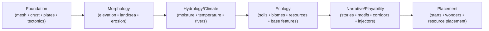

# MapGen Domains: Layering + Causality Overview

> **Status:** Canonical (domain-only modeling orientation)
>
> **This doc is:** the “what exists before what” causal spine and domain ownership boundaries.
>
> **This doc is not:** SDK wiring guidance (step/stage file layout, authoring mechanics, adapters).

Map generation is organized into **domain layers** that progressively refine the world from physical substrate → gameplay-facing surfaces.

## Glossary (quick)

- **Domain:** a modeling boundary (physics/gameplay responsibility + contracted products).
- **Stage:** a recipe slice that composes steps to realize one or more domain responsibilities.
- **Step:** orchestration + publication; composition happens here (not inside operations).
- **Operation:** an **atomic** domain unit of work (a single responsibility); operations should not contain composition of other operations.
- **Artifact:** a named product (often non-rendered “math”) published for downstream consumption.
- **Field:** a rendered/engine-facing map surface (tile fields like terrain/biome/feature IDs).

## Causal spine (domain ordering)

Notes:
- Narrative/playability is **cross-cutting** and may inject changes, but it remains “downstream” of the physical spine.
- Placement is downstream of Ecology/Narrative because it consumes their signals/contracts to make “final” game-start decisions.

## Domain summaries (ownership boundaries)

### Foundation

- **Owns:** simulation board geometry + lithosphere substrate signals.
- **Produces:** region mesh, crust/material signals, plate partition + kinematics, tectonic force fields.
- **Feeds:** Morphology (uplift drivers, crust hardness/age signals).

See: `docs/system/libs/mapgen/foundation.md`

### Morphology

- **Owns:** turning tectonic drivers into playable landforms.
- **Produces:** elevation, land/ocean mask, slope/flow routing intermediates, sediment/erodibility signals.
- **Feeds:** Hydrology/Climate (topography drivers), Ecology (soils substrate drivers).

See: `docs/system/libs/mapgen/morphology.md`

### Hydrology & Climate

- **Owns:** gameplay-oriented climate + surface water signals (fast, deterministic, tunable).
- **Produces:** moisture/rainfall fields, temperature bands/fields, river/lake signals.
- **Feeds:** Ecology (biomes/soils/feature planning), Placement/Narrative (biases and constraints).

See: `docs/system/libs/mapgen/hydrology.md`

### Ecology

- **Owns:** the living-world interpretation of physics + climate.
- **Produces:** soils, biome classification, resource basin signals, and baseline (non-wonder) features.
- **Boundary:** Ecology owns baseline placement of non-wonder features (forests/wetlands/reefs/ice). Placement owns natural wonders + floodplains.
  - Historical rationale: `docs/projects/engine-refactor-v1/resources/spike/_archive/spike-ecology-feature-placement-ownership.md`

See: `docs/system/libs/mapgen/ecology.md`

### Narrative / Playability

- **Owns:** interpretation + optional injections layered on top of the physical world (regions/motifs/corridors; themed adjustments).
- **Produces:** typed story entries (canonical products); views/overlays are derived on demand.

See: `docs/system/libs/mapgen/narrative.md` and `docs/projects/engine-refactor-v1/resources/PRD-target-narrative-and-playability.md`

### Placement

- **Owns:** final “game-start” placement decisions (starts, wonders, resources placement), consuming upstream signals.
- **Produces:** placements and any placement-owned diagnostics/products needed by downstream consumers (if any).

See: `docs/system/libs/mapgen/placement.md`
