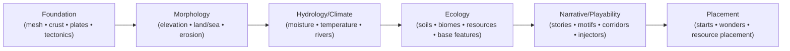

# MapGen Domains: Layering + Causality Overview

> **Status:** Canonical (domain-only modeling orientation)
>
> **This doc is:** the “what exists before what” causal spine and domain ownership boundaries.
>
> **This doc is not:** SDK wiring guidance (step/stage file layout, authoring mechanics, adapters).

Map generation is organized into **domain layers** that progressively refine the world from physical substrate → gameplay-facing surfaces.

## Glossary (quick)

- **Domain:** a modeling boundary (physics/gameplay responsibility + contracted products).
- **Stage:** a recipe slice that composes steps to realize one or more domain responsibilities.
- **Step:** orchestration + publication; composition happens here (not inside operations).
- **Operation:** an **atomic** domain unit of work (a single responsibility); operations should not contain composition of other operations.
- **Buffer:** a mutable, shared working layer that multiple steps (and sometimes stages) read and refine over time.
- **Overlay:** an append-preferred, structured “story of formation” published alongside the pipeline (e.g., corridors/swatches) for downstream domains to bias behavior.
- **Artifact:** a named published product (often non-rendered “math”) that is **write-once** and treated as immutable-by-convention.
- **Field:** a rendered/engine-facing map surface (tile fields like terrain/biome/feature IDs).

## Pipeline state kinds (buffers vs artifacts vs fields)

Domain specs intentionally talk about “products” without binding to SDK mechanics, but we still need a shared conceptual model for pipeline data:

- **Buffers (mutable working layers):**
  - Exist because multiple steps need to iteratively refine the same canonical layer (e.g., elevation/heightfield, climate field, routing indices).
  - Are intentionally mutable and shared.
  - Are **not** “just another artifact”, even if current wiring temporarily routes them through artifact contracts for gating/typing.
  - When a buffer is routed through artifact contracts, that “buffer artifact” must be **published once**, then refined in place; do **not** re-publish it.
- **Artifacts (published contracts):**
  - Exist for dependency gating, typed access, and stable consumption across domain boundaries.
  - Are published once and treated as immutable-by-convention.
  - A buffer may be *published once* as an artifact “handle” for gating/typing, but the buffer itself remains mutable until the pipeline freezes it.
- **Fields (engine-facing surfaces):**
  - Are the final rendered representations applied to the engine map (biome IDs, terrain IDs, feature IDs).
  - May be derived from artifacts/buffers; mutating a field is not the same as mutating a physics buffer.

## Overlays (published “stories” of formation)

Overlays are a cross-cutting way to publish *extra, structured meaning* about how the world was created, so downstream domains can “read” that story and act on it.

- Overlays are **not the same thing** as core domain products like “the heightfield” or “the biome map”.
- They are a **semantic layer** that captures motifs/patterns (e.g., a specific mountain corridor) that consumers can use for biasing.

### Canonical model (single overlays container)

- Conceptually, there is a single **overlay container** (`overlays`) that holds per-type collections:
  - `overlays.corridors`
  - `overlays.swatches`
  - (add types only when there is a clear downstream consumer)
- Each overlay type is a collection of overlay instances:
  - `overlays.corridors = [corridor1, corridor2, ...]`
- Do **not** model overlays as many separate top-level artifacts (`storyOverlaysRifts`, `storyOverlaysMargins`, ...). Use one container and vary instances inside the relevant type.

### Mutation posture (append-preferred)

- Overlays are **append-preferred**: steps should generally add new overlay instances rather than rewriting prior ones.
- Mutation is not forbidden today, but it should be rare and intentional (treat edits as “surgery”, not “normal flow”).

### Current wiring vs desired end state

- Today, overlays are still threaded through the **artifact** system so they can participate in dependency gating/typing.
- This is a temporary architectural compromise, similar to how buffers are currently routed.
- Future intent: overlays become a first-class dependency kind (distinct from artifacts), without changing the conceptual model above.

## Causal spine (domain ordering)

Notes:
- Narrative/playability is **cross-cutting** and may inject changes, but it remains “downstream” of the physical spine.
- Placement is downstream of Ecology/Narrative because it consumes their signals/contracts to make “final” game-start decisions.

## Domain summaries (ownership boundaries)

### Foundation

- **Owns:** simulation board geometry + lithosphere substrate signals.
- **Produces:** region mesh, crust/material signals, plate partition + kinematics, tectonic force fields.
- **Feeds:** Morphology (uplift drivers, crust hardness/age signals).

See: `docs/system/libs/mapgen/foundation.md`

### Morphology

- **Owns:** turning tectonic drivers into playable landforms.
- **Produces:** elevation, land/ocean mask, slope/flow routing intermediates, sediment/erodibility signals.
- **Feeds:** Hydrology/Climate (topography drivers), Ecology (soils substrate drivers).

See: `docs/system/libs/mapgen/morphology.md`

### Hydrology & Climate

- **Owns:** gameplay-oriented climate + surface water signals (fast, deterministic, tunable).
- **Produces:** moisture/rainfall fields, temperature bands/fields, river/lake signals.
- **Feeds:** Ecology (biomes/soils/feature planning), Placement/Narrative (biases and constraints).

See: `docs/system/libs/mapgen/hydrology.md`

### Ecology

- **Owns:** the living-world interpretation of physics + climate.
- **Produces:** soils, biome classification, resource basin signals, and baseline (non-wonder) features.
- **Boundary:** Ecology owns baseline placement of non-wonder features (forests/wetlands/reefs/ice). Placement owns natural wonders + floodplains.
  - Historical rationale: `docs/projects/engine-refactor-v1/resources/spike/_archive/spike-ecology-feature-placement-ownership.md`

See: `docs/system/libs/mapgen/ecology.md`

### Narrative / Playability

- **Owns:** interpretation + optional injections layered on top of the physical world (regions/motifs/corridors; themed adjustments).
- **Produces:** typed story entries (canonical products); views/overlays are derived on demand.

See: `docs/system/libs/mapgen/narrative.md` and `docs/projects/engine-refactor-v1/resources/PRD-target-narrative-and-playability.md`

### Placement

- **Owns:** final “game-start” placement decisions (starts, wonders, resources placement), consuming upstream signals.
- **Produces:** placements and any placement-owned diagnostics/products needed by downstream consumers (if any).

See: `docs/system/libs/mapgen/placement.md`
